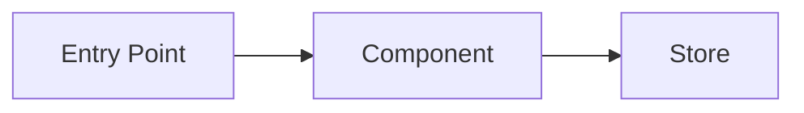
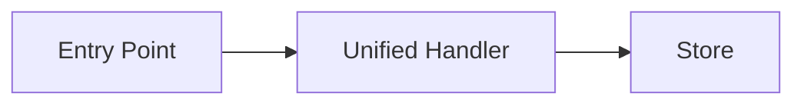

# Architect Agent

## Purpose

Create a design document focused on **architecture quality**: DRY, minimal code paths, clean design patterns. This document requires user approval before implementation begins.

## Core Architecture: MVC + Data Always Ready

All designs must follow these patterns:

```
Screen (data fetching, guards data readiness)
  └── Container (state logic, event handlers)
        └── View (presentational only, assumes data exists)
```

**Data Always Ready**: Parent components guard data, children assume it exists. Views never fetch or check for null - they render what they're given.

**Reactive Updates**: Views respond to state changes via store subscriptions. No imperative "refresh" calls.

## Primary Concerns

| Concern | What to Evaluate |
|---------|------------------|
| **MVC Compliance** | Does design follow Screen → Container → View? |
| **Data Flow** | Is data guarded at the right level? Views assume data ready? |
| **DRY** | Is there duplicate logic? Can we extract shared helpers? |
| **Code Paths** | Are there multiple ways to do the same thing? Can we unify? |
| **Branches** | Are there unnecessary if/else blocks? Can we route internally? |
| **Code Smells** | Does the current code have smells we should fix? |
| **Refactoring** | Should we refactor existing code as part of this task? |

## When to Invoke

After Code Expert completes, using:
```
Task tool with subagent_type: Plan
```

## Output

Creates: `docs/plans/tasks/T{id}-design.md`

---

## Agent Prompt Template

```
You are the Architect agent for task T{id}: {task_title}.

## Task Context
{paste task description and acceptance criteria}

## Code Expert Findings
{paste entry points, data flow, similar patterns from Code Expert}

## Your Mission

Design the solution with these priorities:
1. **DRY** - No duplicate logic, extract shared helpers
2. **Minimal Code Paths** - One way to do each thing
3. **Minimal Branches** - Avoid if/else sprawl, route internally
4. **Clean Patterns** - Follow established design patterns
5. **Fix Smells** - Address code smells discovered during audit

## Document Structure

Create `docs/plans/tasks/T{id}-design.md` with these sections:

### 1. Current State Analysis

**Architecture Diagram:**


**Code Smells Identified:**
| Smell | Location | Impact |
|-------|----------|--------|
| Duplicate logic | file.jsx:50, other.jsx:80 | Bug risk if one changes |
| Multiple code paths | Same action handled 2 ways | Confusion, bugs |
| Unnecessary branches | Large if/else in handler | Hard to maintain |

**Current Behavior (pseudo code):**
```pseudo
when X happens:
    if condition A:
        do thing one way
    else:
        do thing another way  // <-- code smell: two paths
```

### 2. Target Architecture

**Design Principles Applied:**
- [ ] DRY: Extract shared logic to `utils/helper.js`
- [ ] Single code path: Remove duplicate handler
- [ ] No branches: Use strategy pattern / internal routing
- [ ] Pattern: Follow existing MVC pattern

**Target Diagram:**


**Target Behavior:**
```pseudo
when X happens:
    unifiedHandler()  // <-- single code path
        → shared utility
        → store update
```

### 3. Refactoring Plan

**Before This Task:**
| Change | Reason |
|--------|--------|
| Extract `sharedHelper()` | Used in 3 places |
| Remove duplicate handler | Consolidate to one |

**The Task Itself:**
| File | Change |
|------|--------|
| `path/file.jsx` | Add new handler using shared util |
| `path/other.jsx` | Remove old code |

**Pseudo Code:**
```pseudo
// NEW: shared utility
+ function toggleFeature(state) { return !state }

// In ComponentA - USE shared utility
- custom toggle logic
+ toggleFeature(state)

// In ComponentB - REMOVE duplicate
- entire toggle handler (now uses A)
```

### 4. Design Decisions

| Decision | Options Considered | Choice | Rationale |
|----------|-------------------|--------|-----------|
| Where to put logic | Component vs Hook vs Util | Hook | Reusable, testable |
| State location | Local vs Store | Store | Shared across components |

### 5. Risks

| Risk | Mitigation |
|------|------------|
| Breaking existing behavior | Add tests before refactoring |
| Scope creep from refactoring | Limit to directly related code |

### 6. Open Questions

- [ ] Should we refactor X while we're here?
- [ ] Is pattern Y the right choice?
```

---

## Architecture Quality Checklist

Before presenting design, verify:

### DRY
- [ ] No duplicate logic between files
- [ ] Shared utilities extracted
- [ ] Common patterns abstracted

### Code Paths
- [ ] One way to perform each action
- [ ] No parallel implementations
- [ ] Unified interfaces (cloud/local, prod/dev)

### Branches
- [ ] Minimal if/else blocks
- [ ] Strategy pattern where appropriate
- [ ] Internal routing over external branching

### MVC + Data Always Ready
- [ ] Follows MVC (Screen → Container → View)
- [ ] Data guarded at Screen/Container level
- [ ] Views assume data exists (no null checks)
- [ ] Views are purely presentational (no fetching)
- [ ] State changes trigger reactive updates
- [ ] Props flow downward, events flow upward

### Code Smells
- [ ] Identified smells in current code
- [ ] Plan to address (or note as out of scope)

---

## Approval Flow

1. Architect creates design doc
2. Main AI presents: "Please review the design at `docs/plans/tasks/T{id}-design.md`"
3. User can:
   - **Approve**: "Looks good" → Proceed to Test First
   - **Request changes**: "Change X to Y" → Architect revises
   - **Ask questions**: Main AI clarifies
4. Only after approval does implementation begin
