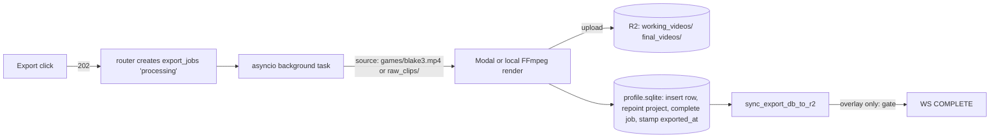

# Export Pipeline — Domain Knowledge

## Scope
- `src/backend/app/routers/export/` — `framing.py` (722 L), `overlay.py` (2,243 L), `multi_clip.py` (2,500 L), `before_after.py` (381 L), `__init__.py` (mounts all under `/api/export`, `__init__.py:24`)
- `src/backend/app/routers/exports.py` — durable job status/recovery (`/api/exports/*`, prefix at `exports.py:38` + `main.py:156`)
- `src/backend/app/services/export_helpers.py`, `export_worker.py`, `auto_export.py`, `transitions/`
- `src/backend/app/routers/downloads.py` — publish ("Move to My Reels") / restore-for-edit
- `src/backend/app/middleware/db_sync.py` — durable-sync machinery; `src/backend/app/websocket.py` — progress channel
- DB tables (per-user profile SQLite): `export_jobs`, `working_videos`, `final_videos`, `working_clips`, `projects`. Readers use `MAX(version)` via `app/queries.py` (`latest_working_clips_subquery`, `latest_final_videos_subquery`)

## Entry points
| Route | Handler | What it does |
|---|---|---|
| `POST /api/export/render` | `framing.py:350 render_project` | Backend-authoritative single-clip framing render; 202 + background `_run_render_background` (`framing.py:508`) |
| `POST /api/export/framing` | `framing.py:160 export_framing` | Accepts frontend-rendered video; uploads to R2, inserts `working_videos`, stamps `working_clips.exported_at` |
| `POST /api/export/multi-clip` | `multi_clip.py:1832 export_multi_clip` | Multi-clip concat (transitions); 202 + `_run_multi_clip_background` (`:1989`) → shared `_export_clips` (`:1191`) |
| `POST /api/export/render-overlay` | `overlay.py:1961 render_overlay` | Highlight overlay render (Modal or local); 3 completion paths (no-keyframes copy `:2083`, test `:2159`, real render → `_run_overlay_export_background` `:1830`) |
| `POST /api/export/final` | `overlay.py:1150 export_final` | Save frontend-rendered final video; request-scoped `durable_sync` dependency (`:1155`) |
| `POST /api/exports` + `/api/exports/framing` | `exports.py:436/:475` | BackgroundTasks path → `export_worker.process_export_job` (`export_worker.py:146`) |
| `GET /api/exports/{job_id}/modal-status` | `exports.py:797` | Recovery source of truth; may call `finalize_modal_export` (`exports.py:191`) |
| Sweep (no route) | `auto_export.py _export_brilliant_clip` | **T4175**: pre-expiry, preserves each never-framed clip's extract to `raw_clips/auto_*.mp4` + wires `raw_clips.filename` + leaves a frameable draft. NO publish, NO archive (was: `final_videos` insert + `archive_project`). Already-framed reels still skipped (T4160). |
| `POST /api/downloads/publish/{project_id}` etc. | `downloads.py:818` publish, `:923` restore | Both use `durable_sync` dependency |

**The 6 export triggers** (T4370 harness must snapshot all of them): single-clip render (`/render`), multi-clip Modal branch, multi-clip local branch (`_export_clips:1236` vs `:1463`), overlay final (`render_overlay`/`/final`), durable worker (`export_worker.process_export_job`), sweep auto-export (`auto_export._export_brilliant_clip`).

**Progress:** WebSocket `/ws/export/{export_id}` (`main.py:181`, handler `websocket.py:154`).
- `manager.send_progress` is fire-and-forget — dropped if no client connected (`websocket.py:123-126`); last frame mirrored into the in-memory `export_progress` dict for late polls.
- `websocket.py:21 make_progress_data` is the single payload builder: `status`/`done` derive from `phase`; `phase in (complete,done,error)` → `done=True`.
- Durable state lives ONLY in `export_jobs` rows (`GET /api/exports/active|recent|unacknowledged`); recovery/reconnect flows poll those, never the WS.

**Credits:** GPU exports reserve → insert job → confirm before dispatch (`framing.py:446-478`, `multi_clip.py:1927-1958`, `exports.py:536-595`); failure paths refund (`multi_clip.py:1760-1829`, `export_worker.py:206-219`).

## Data flow

- **Source resolution (T4175 `resolve_clip_source`, `export_helpers.py`):** framing (`_run_render_background`) and multi-clip both call the shared `resolve_clip_source(clip) -> (url, in_off, out_off, flexible)` instead of inlining the game key. Order, first hit wins, visible-fail on total miss (`SourceUnavailable`, no silent fallback): (1) game video present -> `(game_url, raw_start, raw_end, flexible=True)`; **T4140: HEAD-probed for EVERY game clip** (the recap is now a universal fallback, so a reclaimed game must fall through — the old "no extract -> skip probe" shortcut is gone; `r2_head_object_global` retries transient blips internally); (2) preserved per-clip extract (`raw_clips.filename` set) -> `(raw_clips/{filename}, 0.0, duration, flexible=False)`; (3) **T4140 recap** (`_resolve_recap_source`, FILLED): downloads `recaps/{game_id}_clips.json`, matches the entry by **raw_clip id** (`clip['raw_clip_id']`, the recap-mapping key — a recap entry's `id` is the raw_clips.id, see games.py `_compute_recap_clips`), returns `(presign(recaps/{game_id}.mp4), recap_start, recap_end, flexible=False)`; None (-> `SourceUnavailable`) when game_id/mapping/entry/recap object missing. Uploaded multi-clip clips keep their own `raw_clips/{uploaded_filename}` download path. `flexible=False` = frozen bounds (reframe-only, no wider trims). This is what lets a T4130 Create-Clip draft (no preserved extract) re-export after the game video is reclaimed.
  - Game clips are keyed `games/{blake3_hash}.mp4` in a GLOBAL (env-prefix-free, not per-user) R2 namespace, fetched via `generate_presigned_url_global` + ffmpeg `-ss/-to -c copy` extraction (now via the resolver; `multi_clip.py` game branch unchanged mechanics).
  - Hash resolved as `COALESCE(gv.blake3_hash, g.blake3_hash)` joining `game_videos`→`games` (`framing.py:399`, `multi_clip.py:2044`, `auto_export.py:125-129`).
  - Per-user artifacts: `raw_clips/`, `working_videos/`, `final_videos/`, `temp/multi_clip_{export_id}/`.
  - Export routers never touch `storage_refs`/`game_storage_refs` — the ref-count/reclaim lifecycle that can delete a `games/{hash}.mp4` lives in `materialization.py` / `sweep_scheduler.py` / `games.py`; `auto_export.py` is the pre-reclaim export hook.
- **Missing-source classification (T4990):** a re-export whose game source was reclaimed must
  record a TYPED `SOURCE_UNAVAILABLE` failure (user-actionable "expired/unavailable" wording),
  not a raw ffmpeg 404 string, so the UI can show the expired-source panel. Classify at the
  R2-object boundary, NEVER by parsing ffmpeg stderr (banned defensive patch). Primary path:
  `resolve_clip_source` already raises `SourceUnavailable` when every candidate source is gone.
  Backstop in `_run_render_background` (framing.py): on ffmpeg EXTRACT failure, re-probe with
  `export_helpers.source_confirmed_unavailable(clip)` (same HEAD probes resolve uses —
  `r2_head_object_global`/`file_exists_in_r2` retry transient blips internally, so True = a
  SUSTAINED miss = confirmed-404-only, T4820; a present source with a transient failure stays
  GENERIC). The outer handler maps `SourceUnavailable` → `classified_source_unavailable_message`
  (carries the `SOURCE_UNAVAILABLE` code + clip id) into `fail_export_job` + the WS error.
  Spec/regression: `test_t4050_missing_source_reexport.py` (was RED on master, deselected in CI)
  + `test_t4990_source_classification.py`. NOTE: the known-failures.md row + branch-ci.yml
  `--deselect` for test_t4050_missing_source_reexport are now stale (the test passes) — remove
  both once this lands.
- **Finalize transaction** (hand-copied 5×, drifted — see epic): insert `working_videos`/`final_videos` → repoint `projects.working_video_id`/`final_video_id` → complete `export_jobs` → stamp `working_clips.exported_at` + snapshot `raw_clip_version`.
  - Copies: `export_worker.py:259-339`, `framing.py:227-288`, `multi_clip.py:1398-1435` + `:1660-1727`, `exports.py:249-268` (omits version/duration), `overlay.py:96 _finalize_overlay_export`.
- **`final_videos` writers (2):** `overlay.py` (`_finalize_overlay_export`), `overlay.py` (`export_final`) — both insert `poster_filename=NULL` (T5280) + the frozen `slowmo_section_*`. (The T4175 sweep is NO LONGER a `final_videos` writer — it produces a needs-framing draft + `raw_clips/` extract, no publish, no `published_at`.) `test_seams.py` seeds published rows directly for tests only.
- **`final_videos.name` re-freeze at publish (T5260):** the render-time INSERT freezes `name` from `projects.name` at that moment, but the draft stays renameable in Reel Drafts until it's moved to My Reels. `publish_to_my_reels` (`downloads.py:1208`) re-reads the CURRENT `projects.name` and writes it into the same `UPDATE` that sets `published_at`/`watched_at`, so a rename-after-render isn't silently lost. If the project row is missing/gone (dangling `final_videos.project_id`, see T4800 below) or its name is empty, the existing frozen name is kept (no NULL overwrite) and an info `[Publish]` log line notes why. This makes PUBLISH the second and last freeze point for `name` — the gallery rename endpoint (`downloads.py:~868`, guarded `published_at IS NOT NULL`) is the only writer after that. Single write path per phase: render owns pre-publish, publish re-freezes once, gallery rename owns post-publish; no path overlaps another.
- **Branded outro (T3950):** "Made with Reel Ballers" (~2.4s animated dark card since T5240; ~1.75s static originally) attached via two non-invasive paths:
  - **Playback compositing (shared/public surfaces only):** `BrandedEndCard.jsx` (React) shown by `SharedVideoOverlay` (on `MediaPlayer.onEnded`) and `SharedCollectionView` (on `CollectionPlayer.onEnded`); inline DOM overlay in the edge-function share page (`functions/shared/[token].js`, `v.ended` listener). No re-encode, no migration — every existing reel gets the card for free on next view. Never shown in editor/ranker/owner My Reels (prop-gated via `visible` prop).
  - **Download-time burn-in:** `GET /api/downloads/{id}/file` downloads from R2 into a temp dir, calls `append_branded_outro(original, out)`, streams the result, then cleans up in `finally`. Non-fatal: any failure logs loudly and serves the original (HTTP 200 always). Card is cached per (width×height, fps, pix_fmt, audio layout) in `/tmp/rb_outro_cards/` (MD5 keyed, atomic rename on build). Stored `final_videos` carry NO outro — the burn happens at serve time on demand.
  - Gate: `BRANDED_OUTRO_ENABLED` env var (backend, default true) + `BRANDED_OUTRO_ENABLED` constant (`src/frontend/src/constants/brandedOutro.js`, default true).
  - **T5240 — animated card (2026-07-22):** the download-burn card is ANIMATED entirely inside `_build_outro_card`'s `filter_complex` (still encoded ONCE + cached, so animation is free at export). `OUTRO_DURATION` bumped `1.75`→`2.4` for the extra beats. The logo is rebuilt from its SVG PARTS (not the old flat `reelballers-lockup.png`, now unused): `assets/branding/reelballers-ring.png` (film-reel ring + 4 sprocket holes) and `reelballers-play.png` (white triangle), both rasterized from `src/assets/logo/logo.svg` on a TRANSPARENT canvas. Motion: (1) WHITE-FLASH entrance (`fade=t=in:color=white:st=0:d=OUTRO_FLASH_IN`, applied LAST so frame 0 is deterministically white on every ffmpeg build — the portable anchor); (2) the ring SPINS in, decelerating to a stop (`rotate=a='<ease-out>':c=none`, `OUTRO_SPIN_D`/`OUTRO_SPIN_TURNS`) + alpha fade; (3) the play triangle LANDS with a press bounce (`scale=w/h='<ease-out-back>':eval=frame`, `OUTRO_PLAY_ST`); (4) staggered captions "Made with" + "Reel Ballers" brand (`OUTRO_BRAND_IN_ST`), tagline `TAGLINE_TEXT` (`OUTRO_TAGLINE_IN_ST`), URL (`OUTRO_URL_IN_ST`), drawtext `alpha='if(...)'` ramps. `_CARD_VERSION` bumped `v3-animated`→`v4-spin-play`. **Landmines:** (a) `overlay` CANNOT composite an input whose size changes per frame (`scale …:eval=frame` feeding it freezes on frame-0's size) — PAD each scaled play frame back onto a CONSTANT `play_canvas` (`pad=…:eval=frame`, sized > the overshoot) before overlay; (b) drawtext CANNOT reliably inline an apostrophe (the tagline's `Player's`) across ffmpeg builds — write it to a temp file and use `textfile=`; (c) filtergraph expression values are single-quoted, so do NOT also backslash-escape their commas; (d) the luma-read test harness must read the FIRST `metadata=print` line (`lines[0]`), not the last — `-frames:v 1` bounds the muxer, not the metadata filter, and older CI ffmpeg prints many lines. Concat/probe-match/non-fatal/cache contract unchanged. Tests: `test_t5240_animated_outro.py` (flash entrance, ring-before-play ordering, play press bounce, caption stagger, exact tagline — via luma-over-time) + `test_t3950_branded_outro.py` (unchanged, still green).
- **Share posters / og:image (`services/poster.py`, T4890 -> T5090/T5180 -> T5280):** one frame stored as a JPEG in R2 so share links unfurl with a real image. Selection heuristic `extract_clearest_frame_jpeg` = JPEG-encode a few samples, keep the LARGEST (detail encodes bigger; motion blur/defocus compress away). **Capture moved to PUBLISH (T5280): determine-at-render, capture-at-publish.** The poster's only consumers are share links / og:image (can't exist before publish), so the JPEG extraction/upload NO LONGER runs at render finalize — both overlay finalize paths now insert `poster_filename=NULL` (render still computes + FREEZES the slow-mo section, cheap, no ffmpeg). `publish_to_my_reels` (`downloads.py:~1291`) captures via `generate_poster_at_publish(user_id, final_video_id, filename, project_id, frozen_start, frozen_end)` BEFORE `archive_project` runs: `asyncio.to_thread` INSIDE the request so the poster object + `poster_filename` land before the endpoint's durable-sync barrier (T4110), NOT fire-and-forget; failure NEVER fails publish (best effort, never raises). The helper prefers the frozen columns, else reconstructs+heals via `resolve_slowmo_section` (live `working_clips` still present pre-archive, then R2 archive) — SAME policy as `backfill_posters`; idempotent (deterministic key, re-publish overwrites in place). **`publish_to_my_reels` is the ONLY live `published_at` writer** (T4175 sweep produces needs-framing drafts, does NOT publish; restore/unpublish sets NULL; gallery-rename edits an already-published row). **Poster policy is per artifact type:**
  - **Reels** (`generate_and_store_poster(user_id, filename, slowmo_section)`): clearest frame in the **FIRST HALF of the first slow-mo section** on the FINAL (stretched, concatenated) timeline; **no slow-mo / no section -> plain first frame** (NOT whole-clip sampling). `first_slowmo_section(clips)` walks ordered `(segments_data, source_duration)` per working clip reusing `highlight_transform` (`canonicalize_segments_data` for the dual boundary format, `get_segment_speed`, `get_trim_range`; output = source/speed), accumulating per-clip offsets so MULTI-CLIP reels find the first slow-mo across the whole concatenation, respecting `trimRange`; a leading clip of UNKNOWN output length (`(None, None)`) -> bail to first frame (no bogus 0.0 offset). `extract_clearest_frame_jpeg(..., window=(start,end))` restricts sampling to that absolute-time span (the first half). **The FULL section `[start,end]` (final time) is FROZEN on `final_videos.slowmo_section_start/end` (REAL, nullable; profile_db v025)** at finalize -- BOTH overlay paths compute it (`_finalize_overlay_export` via `load_project_clip_segments`; `export_final` via `read_clip_segments_for_project` on its open cursor) and store it in the INSERT (which now sets `poster_filename=NULL` — T5280 defers the poster JPEG to publish; the frozen section is what publish/backfill later read). **Why frozen (landmine):** publish (`archive_project`) PRUNES `working_clips`, so live reconstruction returns `[]` for every published reel -- a force-regen from live clips alone would downgrade ALL posters to first frame. **T5280 corollary:** publish captures the poster BEFORE `archive_project` prunes, so even a pre-v025 reel with unfrozen columns can still reconstruct from live clips at publish time. **Section resolution order** (`resolve_slowmo_section`): (1) frozen columns; (2) live `working_clips`; (3) R2 archive `archive/{project_id}.msgpack` (`segments_from_archive` picks latest version per identity + sort_order, `source_duration=None` since the archive has no raw_clips); unreconstructable -> None -> first frame (logged, NO fabrication). **Backfill** (`backfill_posters(force=True)`) prefers the frozen columns, else reconstructs AND heals them. **v025** additionally backfills the frozen columns for already-published reels from the archive (tuple-row-factory `up(conn)`; per-row best-effort, missing/unparseable archive left NULL + counted). Poster basename stored on `final_videos.poster_filename`; **failure NEVER fails the export** (best effort, returns None).
  - **Game/teammate recaps** (T5180 -> T5270): **whole-clip clearest frame** (recaps are stitched, no per-segment slow-mo -> reel policy does NOT apply, selection helper unchanged). `ensure_recap_poster(recap_key, poster_key)` generates from `recaps/{game_id}.mp4` -> caches at deterministic `recaps/posters/{game_id}.jpg` (reuse-if-cached via HEAD, overwrite-safe, never raises). **Warmed at teammate-share-CREATION time (T5270)**, not generate-on-first-request: `poster.warm_recap_poster(user_id, profile_id, game_id)` (wraps `ensure_recap_poster` in `asyncio.to_thread`, swallows all exceptions/logs at info) is awaited inline from all three share-creation call sites -- `games.py: share_game`, `games.py: share_playback`, `clips.py: share_with_teammates` (once per `game_id`, gated on at least one share actually created) -- so the R2 object exists before the response returns and the first crawler to unfurl the link never pays the ffmpeg cost. The GET path stays as a self-healing fallback (pre-T5270 shares, evicted cache). Served via token-gated `GET /api/shared/teammate/{token}/poster.jpg` (`shares.py`, mirrors `_serve_poster_jpeg`; 24h cache; 404 -> edge branded-card fallback). `upload_bytes_to_r2_global(key, ...)` writes to a full env-prefixed key under the SHARER's prefix from the unauthenticated request. Teammate GET returns `poster_url` (stable proxy path) when a recap exists; teammate edge fn emits og:image via it.
  - **Landmines:** (1) `segments_data` dual format (full-list vs splits-only) — ALWAYS `canonicalize_segments_data` before walking pairs (Bug 20p). (2) **og:image is NEVER a presigned URL** (T4890 cache-poisoning) — all poster surfaces serve through stable token-gated proxies. (3) The stored `final_videos`/recap objects carry NO branded outro, so poster time-offsets match content exactly (outro is appended after content). (4) Any admin sweep querying a migration-added column (`poster_filename`) must migrate each profile to head first + guard the query (T5110).
- **My Reels grouping (T4190):** the frozen `final_videos.game_ids` BLOB (v008/T3605) is the PRIMARY game-attribution source — `collections_summary` and the `/api/downloads` game_id/mixes filters route by it (`route_collection`), and `list_downloads` now resolves `brilliant_clip` reels' `game_names`/`game_ids`/`group_key` from it too (`downloads.py:~306-470`), with the `raw_clips.auto_project_id -> game_id` chain kept only as a fallback for pre-v008 reels (empty blob). Frozen ids survive the source clip's draft being re-created (`auto_project_id` repointing), which previously dropped the published reel out of its group. `collections_summary` also exposes a per-bucket `unwatched_count` (`SUM watched_at IS NULL`) so the My Reels NEW badge (`GET /api/downloads/count`) always has a visible collapsed-group chip counterpart.
- **Durable sync:**
  - Background tasks bypass the request middleware, so they must call `export_helpers.sync_export_db_to_r2` (`export_helpers.py:333`) themselves. It blocks (`lock_timeout=None`), syncs BOTH profile DB and user DB, returns True only if both reached R2; on failure it marks sync pending for the middleware retry path.
  - Request-scoped writes instead use the `durable_sync` dependency (`middleware/db_sync.py:84`) → 503 `DURABLE_SYNC_FAILED_RESPONSE` on failure. Used by `/api/export/final` (`overlay.py:1155`), publish (`downloads.py:818`), restore (`downloads.py:923`).
  - Ordinary writes ride fire-and-forget `_background_sync` with a 0.5s lock defer — the loss path T4050/T4110 closed for gestures/exports.
- **Full-state save vs export:** `PUT /api/projects/{project_id}/clips/{clip_id}` (`clips.py:2001-2124`) — if clip already exported (`exported_at IS NOT NULL`) and framing actually changed, it inserts a NEW `working_clips` version (new version has `exported_at=NULL`) and returns `refresh_required`.
  - `exported_at` is stamped at export time only: `framing.py:263-269`, `multi_clip.py:1427-1432` (Modal), `:1719-1724` (local).
- **Multi-clip transitions:** strategy pattern in `app/services/transitions/` (`base.py:15 TransitionStrategy`, `TransitionFactory`; cut/fade/dissolve self-register). Called from `concatenate_clips_with_transition` (`multi_clip.py:1100`); unknown type falls back to `'cut'`; chapter markers embedded after concat (`multi_clip.py:1139-1188`).
- **before_after.py:** builds "Before vs After" comparison videos from `before_after_tracks` (rows written by `overlay.py:1283-1327` during `/final`). Pure local FFmpeg; no R2/DB writes, no `export_jobs`.

## Invariants & rules
1. **Sync-then-announce (T4110 + T4200, DONE 2026-07-11):** the R2 DB sync must succeed BEFORE the export is announced complete. **ALL THREE overlay completion paths gate COMPLETE on `sync_export_db_to_r2`** (T5300 verified): the no-keyframes copy path (`overlay.py:2043`) and the test-mode copy path (`:2110`) run inline and return **503** + a retryable `sync_failed` progress event on failure; the real-render **background** path (`_run_overlay_export_background:1817-1833`, the one that returns **202** and finishes async) gates the same way but — having already returned 202 — emits the retryable `_export_sync_failed_data` event over the WS/`export_progress` dict INSTEAD of a 503 (there is no live HTTP response to fail). Also gated: framing (`framing.py:718-722`) and multi-clip (`multi_clip.py:2298-2301` + COMPLETE sites `:1440-1448/:1737`). DB-save failure is terminal — no phantom export announces success. The `export_sync_failed_data` helper lives in `export_helpers.py:379` (no router→router imports); it sets `code='sync_failed'`, `retryable=True`, `phase='error'`.
   - **Landmine (T5300):** the sync-fault only surfaces as `sync_failed` if the render REACHES the durable boundary. On the background path the finalize INSERT (`_finalize_overlay_export`, `overlay.py:183`) writes `final_videos` incl. the v025 `slowmo_section_start/end` columns; a profile DB **behind head schema** throws `table final_videos has no column named slowmo_section_start` at that INSERT — BEFORE the boundary — so the terminal event is a plain `error` (no `code`), masking the durability check. This is NOT a durability gap: the boundary is sound; the DB was just un-migrated. A /dotask container pulls the user DB from R2 at whatever version R2 holds and does NOT auto-run migrations, so the self-verify spec must migrate the profile to head first (see Testing seams: `/api/test/migrate-current-profile`).
2. **Never destroy the old final video before the new one exists (T4010, DONE 2026-06-26):** re-export inserts a new `final_videos` version, repoints atomically, deletes the prior R2 object only post-commit (`overlay.py:1202-1210`, `:1336-1337`, `_finalize_overlay_export:189-190`); no speculative `final_video_id = NULL` at job-accept (`framing.py:245-248` comment; `export_worker.py:335` repoints working only). Failure paths restore prior pointers (`framing.py:696-703`).
3. **No export may create a working-clip version that drops just-exported framing (T4020, DONE, frontend):** the export→overlay transition must not fire a second full-state save; only the pre-render `saveCurrentClipState` (ExportButtonContainer) is the gesture. Backend faithfully persists what it receives — the guard is frontend convention only until T4400.
4. **Every DB write traces to a user gesture** (CLAUDE.md persistence rule); sweep auto-export is the one gesture-less writer, which is why it must become explicit parameters of the shared writer (epic decision 3, `docs/plans/tasks/export-write-path/EPIC.md`).
5. **Versioned reads:** never read `working_clips`/`final_videos` without the `MAX(version)` subqueries in `app/queries.py`. No UNIQUE constraint on `(project_id, version)` — coexisting old+new versions are by design.
6. Prefix note: `/api/export/...` = render pipelines (`routers/export/`); `/api/exports/...` = job status/recovery (`routers/exports.py`). Easy to confuse.
7. **My Reels collection naming (T4810):** inside a game group the play-all collection card reads **"Game Highlights"** (`GameCollectionGroup` derives `cardTitle` from `shareScope.type === 'game'`); the `CollapsibleGroup` header keeps the bare game name so two games stay distinguishable (the T4190 anti-phantom disambiguation lives in the HEADER, not the card). `playTitle`/share stays game-identified. Mixes bucket keeps its own name. The flagship smart collection stays **"Top Plays"** (`collections.py TOP_PLAYS`) — do NOT rename it (more "Top {X}" collections are planned). Backend game share title is already `"{game} Game Highlights"` (`_build_collection_title`), unchanged.

## Landmines & history
- **T4010 (prod incident):** framing pre-step speculatively NULLed `final_video_id` at job-accept with no rollback → published reel destroyed by a failed re-export (prod project 30). Fixed; the invariant above is the residue. Game-source key scheme `games/{blake3}.mp4` misled the recovery search (no env prefix).
- **T4020 (prod incident):** redundant post-render full-state save (`FramingScreen.jsx` transition) persisted EMPTY crop/segments as a new shadow working-clip version; bloat-cleanup then pruned the real one → permanent framing loss. Recovery only via pre-prune R2 snapshot.
- **T4110 (prod incident):** export finalize rows rode fire-and-forget sync; machine cycle lost them → "edited reel vanishes from My Reels". Fix = sync-then-announce + `sync_failed` retry UX + v018 heal migration.
- **Rank-sweep incident (T4160/T4170):** sweep auto-export published raw 1080p stream-copies into the 9:16 ranking pool (its own `final_videos` writer, instant publish, hardcoded metadata). Sweep is still a parallel universe: no `export_jobs` row, own ffmpeg/R2/status literals (audit E8; unified in T4410).
- **Live bugs (audit 2026-07-03, fixed in bug sweep 2026-07-11):**
  - ~~Multi-clip swallows DB-save exceptions and still announces success~~ FIXED T4200 (terminal failure; sync-then-announce extended to framing+multi-clip).
  - ~~`exports.py` returned undefined `presigned_url`~~ FIXED T4790 (2026-07-10).
  - ~~Modal API error treated as "not running" → `cleanup_stale_exports` kills live paid job~~ FIXED T4240 (`check_modal_job_running` returns None on lookup error; cleanup skips jobs with unknown Modal status).
  - ~~Fabricated `recovered_{job_id}.mp4` when Modal result lacks `output_key`~~ FIXED T4240 (fails loudly, no fabricated row).
  - ~~`export_worker.py:198-204` except block reads try-scoped vars~~ FIXED T4240 (bare-except narrowed to `Exception`; vars are now always in scope).
  - Two competing job-create helpers with different initial status: `exports.py:86` (`'pending'`) vs `export_helpers.py:37` (`'processing'`, swallows insert failure) — T4380 unifies.
- WS progress is lossy by design; if you need durability, write `export_jobs`, don't add WS retries.
- `export_worker.process_framing_export` does NOT stamp `working_clips.exported_at` (drift vs the router paths).
- T2720 history: a 14s R2 upload lock once froze the UI post-export — keep syncs off the request path; change ordering, not threading.

## Testing seams
- `MODAL_ENABLED=false` → full local render path (T4120's sanctioned in-container verify mode); `FORCE_R2_SYNC_FAILURE` + machine-cycle simulation seams (prod-gated) exist for durability tests (`tests/test_t4050_durable_sync.py` is the pattern).
- **`POST /api/test/migrate-current-profile` (T5300, gated like every seam):** migrates the logged-in user's CURRENT profile (+ user.sqlite) to head schema via the same `_migrate_profile_db`/`_migrate_user_db` machinery as `POST /api/admin/migrate`, scoped to one profile. The T4120 durability spec calls it after login because the container's pulled DB is at whatever version R2 holds and migrations never auto-run — without it the overlay render dies at the finalize INSERT before the durable boundary (see Invariant 1 landmine). NOT a schema shortcut — it runs the real versioned migrations.
- WARNING (memory): backend tests TRUNCATE the real dev Postgres — warn the user before running; the guard blocks staging/prod only.
- T4370 will add `tests/export_golden/`-style DB-delta snapshots; until it lands there is NO characterization safety net over this pipeline — prefer surgical diffs.

## Perf attribution (T4770, 2026-07-09)
- **`working_video/stream` is a same-origin Range pass-through proxy (NOT byte-windowed).** It forwards
  the client's Range to R2 and returns R2's status/Content-Range/Content-Length unchanged — working_videos
  are self-contained faststart MP4s (ftyp→moov→mdat, moov at front), so R2's own 206 is authoritative.
  Contrast `clips.py:stream_working_clip_bounded`, which DOES clamp bytes (clips are slices of GB games).
  Ranged playback = plain Range forwarding; there is no moov-window contract to preserve here.
- **T4773 DONE (pooled-httpx, KEEP; `projects.py:stream_working_video`).** Was: fresh `httpx.AsyncClient()`
  per request **twice** (a 1-byte size-probe round-trip to compute Content-Length ourselves, then the
  stream) → fresh R2 TLS every time (HAR `ssl=485–1193ms`/req). Fix (T4630 precedent, mirrors
  `downloads.py:stream_download`/`_get_r2_stream_client`, scoped to THIS endpoint only): module-level
  pooled client `_get_working_video_r2_client()` + drop the size probe (single R2 round-trip, pass R2's
  range headers through). Post-storm re-measure (2026-07-09, in-container): overlay `clicked→videoReady`
  **3474→2136ms (-39%)**; HAR main-stream first-byte **1037→408ms (-61%)** under the overlay-open burst;
  live isolated single-request TTFB only 245→224ms (a lone request has no pool to reuse — the win is under
  Chrome's concurrent Range burst). Lever 2 (302→presigned-R2) was NOT needed. `/health` flat (~2ms)
  throughout → not a contention artifact (ledger row 3's proxy-TTFB cost was real, distinct from the
  T4772 storm). Correctness verified live: 200/206/416/HEAD, byte-integrity (full == concatenated ranges).
- **T5642 (overlay working-video load path — cross-origin 401 fix).** The Overlay `<video>` no
  longer loads the working-video through the same-origin proxy `working_video/stream`. On staging/prod
  the frontend is cross-SITE to the API (pages.dev -> fly.dev) and `components/VideoPlayer.jsx`'s
  `<video>` has NO `crossOrigin` attribute, so its cross-site range request carried no session cookie
  -> auth middleware 401 -> Chrome `MEDIA_ELEMENT_ERROR` "Format error" (readyState 0). Fix mirrors
  Framing (`clips.py get_clip_playback_url`): new authed endpoint
  **`GET /api/projects/{id}/working_video/playback-url`** (`projects.py`, right after
  `stream_working_video`) returns `{url, expires_in}` where `url` is an ANONYMOUS presigned R2 URL
  (reuses `_generate_working_video_presigned_url`, key `working_videos/{filename}`, 1h). Middleware
  auth-gates it (NOT allowlisted -> 401 without a session; the whole point — an authed caller trades a
  session for an anonymous presign). `OverlayScreen.jsx` `attemptLoad` now `apiFetch`es that endpoint,
  then sets `<video src>` to the presigned R2 URL (metadata extraction + player both use it). The
  `working_video/stream` proxy stays for back-compat (Framing/warmer/legacy). LANDMINE: presigned-R2 is
  anonymous — do NOT put `crossOrigin="use-credentials"` on that `<video>` (R2 sends no
  `Access-Control-Allow-Credentials` for a specific origin -> breaks CORS). Tests: `test_stream_auth.py`
  (401 w/o auth, returns presign url w/ auth), real-browser `e2e/T5642-overlay-working-video-presigned.qa.spec.js`
  (presigned `<video>` loads cross-site 206/no-401/plays; credential-less proxy 401s).
- **`warmAllUserVideos()` (App.jsx:233,336) is a contention villain.** It streams `working_video/stream`
  for MANY projects at once through the Fly proxy on every home mount (Annotate/Overlay/My Reels opens
  all show the storm), inflating foreground TTFBs 0.5–1.5s. Fix = foreground-first + bounded concurrency
  (T4772); reuse `utils/cacheWarming.js` priority/abort machinery. The reel playback path
  (`GET /api/downloads/{id}/stream`, bounded proxy) is FAST (~615ms to playing, TTFB 441ms) — no issue.
- Editor post-video "settle" (`videoReady→settled` ~1.5s in framing AND overlay) is a **main-thread JS
  gap** (no request in flight) = crop/highlight/canvas hydration, not latency (T4774).

## Active/upcoming work
- **T4380** (TODO): unify the two competing job-create helpers (`exports.py:86` `'pending'` vs `export_helpers.py:37` `'processing'`).
- **DONE (2026-07-11 bug sweep):** T4200 (framing+multi-clip sync-then-announce), T4210 (overlay blob decode→500 not []; PUT /overlay-data deleted), T4230 (projects.py catch-all crop-NULL fixed; renameProject no longer writes stale aspect_ratio), T4240 (four recovery bugs fixed), T4280 (backend silent-fallback sweep).
- **Export Write-Path Unification epic** (`docs/plans/tasks/export-write-path/EPIC.md`, STRICT serial order): T4370 golden harness (DB-delta snapshots for all 6 triggers + local render goldens — gates everything after) → T4380 ExportJobRepository → T4390 finalize/publish single writers → T4400 backend-authoritative export (`mark-exported`; kills client-state authority) → T4410 pipelines→services + sweep unification. T4420 (interpolation) and T4430 (ffmpeg params/probe) also depend on T4370.
- ~~**T3950**~~ DONE 2026-07-12: playback-composited on shared/public viewers (no backend changes) + download-time burn-in in `GET /api/downloads/{id}/file` (`downloads.py`). See the Data-flow "Branded outro" bullet above.
- **T2650** (TODO): move sweep auto-export compute to Modal.
- DONE context (do not re-fix): T4010 atomic re-export, T4020 shadow-version guard, T4110 overlay sync-then-announce, T4160/T4170 sweep framed-reel preservation + metadata heal.

- **Drafts-lingering sweep bug (fixed 2026-07-04, then SUPERSEDED by T4175):** `_export_brilliant_clip`
  published a final_video but never archived the auto-project; v020 archived those rows. INVARIANT
  (still true for *manual* publish): every publish path must archive its project.
- **T4175 — sweep drafts instead of publishing (2026-07-05):** the sweep no longer publishes raw 16:9
  stream-copies as reels at all. It preserves the extract to `raw_clips/auto_*.mp4`, wires
  `raw_clips.filename`, and leaves the auto-project as a frameable draft (`archived_at` + `final_video_id`
  stay NULL; working_clip kept, rebuilt via `_insert_working_clip_with_dims` only if missing). An
  unframed clip must NEVER enter My Reels. The user frames it later; `resolve_clip_source` step 2 finds
  the extract once `games/{hash}.mp4` is reclaimed. "Needs-framing draft" is derivable state
  (`archived_at IS NULL` + working_clip exists + no published final_video) — NO marker column,
  `_SCHEMA_DDL` untouched. Remediation: **profile_db v021** reverses BOTH the publish and the v020
  archive for already-written `auto_%`/`brilliant_clip` published rows — copies `final_videos/{filename}`
  -> `raw_clips/{filename}` (before delete; copy-fail aborts that row), restores the draft (restore_project
  or rebuild), nulls `projects.final_video_id`, sweeps dangling `before_after_tracks`, deletes the reel
  row (dropping its seeded Glicko `rating`/`rd`/`match_count` — these are columns ON `final_videos`, there
  is NO separate match-history table). Idempotent, tuple-row-factory safe. Tests:
  `test_auto_export.py::TestExportBrilliantClip`, `test_resolve_clip_source.py`, `test_v021_migration.py`.

- **T4800 — clip-delete drops the dead draft, preserves the published reel (2026-07-06):** deleting a
  raw clip whose auto-reel had a `final_video` used to leave a 0-clip orphan draft in Reel Drafts
  (`_delete_auto_project` kept anything with `working_video_id OR final_video_id`). Now
  `_delete_auto_project` (clips.py:870) deletes the draft when it was the clip's LAST source — even if
  exported — but guards on `final_videos.published_at IS NOT NULL` to keep published reels (My Reels)
  intact (invariant #2 / T4010). It deletes the unpublished `final_videos` row first because
  `final_videos.project_id` has NO ON DELETE CASCADE (same reason `projects.delete_project` does).
  Root-cause fix ONLY — no read-time `clip_count == 0` filter and no client guard (they'd hide the
  bug; a visible 0-clip draft signals a missed producer). No cleanup migration (no evidence any real
  account has a pre-existing orphan). The tutorial-capture spec also deletes the auto-reel it creates
  (was leaking orphans onto the live imankh account). Tests: `test_t4800_orphan_drafts.py`.

- **T4140 — recap as full-quality re-edit source (2026-07-09):** the recap is now a re-edit master, not a
  480p review proxy. `auto_export._generate_recap` encodes each segment at its **NATIVE resolution**
  (dropped `.filter("scale",854,480)`) at master-grade quality (`RECAP_CRF=18`, `RECAP_PRESET="fast"`,
  module consts). Crop keyframes are stored in **source pixels** (default_crop.py `DEFAULT_CROP_SIZES` are
  pixel dims), so native-res keeps every single-source clip's framing valid for re-edit. `concat c=copy`
  needs a uniform resolution: single-source games already are; mixed-resolution multi-source games are
  normalized to a canonical resolution (`_pick_canonical_resolution` = most-common, tie->larger area),
  scaling **only** the minority segments (`scale`+`setsar=1`) — those clips' crop keyframes shift
  (documented, frozen-bounds only). Mapping shape unchanged. This FILLED `_resolve_recap_source` (see the
  Source-resolution bullet). **Backfill:** `backfill_hiq_recaps(limit, dry_run)` (admin-triggered
  `POST /api/admin/backfill-hiq-recaps?limit=&dry_run=`, `_require_admin`; NOT on startup) upgrades legacy
  recaps for games whose game video still exists; iterates users+profiles like the sweep
  (`get_all_users_for_admin` + `_get_profile_ids` + `ensure_database`), HEAD-probes every source hash
  (any half gone -> `skipped_gone`, past-grace stays 480p, never crashes), and is **idempotent via the
  854x480 legacy signature** (`_recap_is_legacy_480p` probes the recap; hi-q recaps aren't 854x480 so
  re-runs skip them) — no schema column, so no versioned migration. `limit` throttles re-encodes per call;
  `partial=True` means call again. **Accounting:** recap storage is **prepaid in the game upload cost**
  (T1582 flat +1 credit, no expiry, no per-byte recap charge, no prefix-sum) — hi-q recaps are materially
  larger but the model still counts them ONCE at upload with **no double-count** vs the game video; the
  flat prepay margin is a product/economy tuning call, not a code path. **Frozen bounds:** a recap-sourced
  draft returns `flexible=False` (reframe/re-crop OK, trim can't widen past annotated in/out); the frontend
  "widen the trim" guard is a follow-up (backend already returns `flexible`). Tests:
  `test_resolve_clip_source.py` (recap branch), `test_auto_export.py::TestGenerateRecap` (native res / mixed
  normalize) + `::TestBackfillHiqRecaps`, `test_t4140_recap_reexport.py` (Create-Clip draft re-exports from
  recap after game delete).
