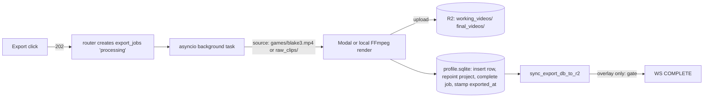

# Export Pipeline — Domain Knowledge

## Scope
- `src/backend/app/routers/export/` — `framing.py` (722 L), `overlay.py` (2,243 L), `multi_clip.py` (2,500 L), `before_after.py` (381 L), `__init__.py` (mounts all under `/api/export`, `__init__.py:24`)
- `src/backend/app/routers/exports.py` — durable job status/recovery (`/api/exports/*`, prefix at `exports.py:38` + `main.py:156`)
- `src/backend/app/services/export_helpers.py`, `export_worker.py`, `auto_export.py`, `transitions/`
- `src/backend/app/routers/downloads.py` — publish ("Move to My Reels") / restore-for-edit
- `src/backend/app/middleware/db_sync.py` — durable-sync machinery; `src/backend/app/websocket.py` — progress channel
- DB tables (per-user profile SQLite): `export_jobs`, `working_videos`, `final_videos`, `working_clips`, `projects`. Readers use `MAX(version)` via `app/queries.py` (`latest_working_clips_subquery`, `latest_final_videos_subquery`)

## Entry points
| Route | Handler | What it does |
|---|---|---|
| `POST /api/export/render` | `framing.py:350 render_project` | Backend-authoritative single-clip framing render; 202 + background `_run_render_background` (`framing.py:508`) |
| `POST /api/export/framing` | `framing.py:160 export_framing` | Accepts frontend-rendered video; uploads to R2, inserts `working_videos`, stamps `working_clips.exported_at` |
| `POST /api/export/multi-clip` | `multi_clip.py:1832 export_multi_clip` | Multi-clip concat (transitions); 202 + `_run_multi_clip_background` (`:1989`) → shared `_export_clips` (`:1191`) |
| `POST /api/export/render-overlay` | `overlay.py:1961 render_overlay` | Highlight overlay render (Modal or local); 3 completion paths (no-keyframes copy `:2083`, test `:2159`, real render → `_run_overlay_export_background` `:1830`) |
| `POST /api/export/final` | `overlay.py:1150 export_final` | Save frontend-rendered final video; request-scoped `durable_sync` dependency (`:1155`) |
| `POST /api/exports` + `/api/exports/framing` | `exports.py:436/:475` | BackgroundTasks path → `export_worker.process_export_job` (`export_worker.py:146`) |
| `GET /api/exports/{job_id}/modal-status` | `exports.py:797` | Recovery source of truth; may call `finalize_modal_export` (`exports.py:191`) |
| Sweep (no route) | `auto_export.py _export_brilliant_clip` | **T4175**: pre-expiry, preserves each never-framed clip's extract to `raw_clips/auto_*.mp4` + wires `raw_clips.filename` + leaves a frameable draft. NO publish, NO archive (was: `final_videos` insert + `archive_project`). Already-framed reels still skipped (T4160). |
| `POST /api/downloads/publish/{project_id}` etc. | `downloads.py:818` publish, `:923` restore | Both use `durable_sync` dependency |

**The 6 export triggers** (T4370 harness must snapshot all of them): single-clip render (`/render`), multi-clip Modal branch, multi-clip local branch (`_export_clips:1236` vs `:1463`), overlay final (`render_overlay`/`/final`), durable worker (`export_worker.process_export_job`), sweep auto-export (`auto_export._export_brilliant_clip`).

**Progress:** WebSocket `/ws/export/{export_id}` (`main.py:181`, handler `websocket.py:154`).
- `manager.send_progress` is fire-and-forget — dropped if no client connected (`websocket.py:123-126`); last frame mirrored into the in-memory `export_progress` dict for late polls.
- `websocket.py:21 make_progress_data` is the single payload builder: `status`/`done` derive from `phase`; `phase in (complete,done,error)` → `done=True`.
- Durable state lives ONLY in `export_jobs` rows (`GET /api/exports/active|recent|unacknowledged`); recovery/reconnect flows poll those, never the WS.

**Credits:** GPU exports reserve → insert job → confirm before dispatch (`framing.py:446-478`, `multi_clip.py:1927-1958`, `exports.py:536-595`); failure paths refund (`multi_clip.py:1760-1829`, `export_worker.py:206-219`).

## Data flow

- **Source resolution (T4175 `resolve_clip_source`, `export_helpers.py`):** framing (`_run_render_background`) and multi-clip both call the shared `resolve_clip_source(clip) -> (url, in_off, out_off, flexible)` instead of inlining the game key. Order, first hit wins, visible-fail on total miss (`SourceUnavailable`, no silent fallback): (1) game video present -> `(game_url, raw_start, raw_end, flexible=True)`; HEAD-probed only when a preserved extract can back a miss (else used directly — unchanged loud-fail); (2) preserved per-clip extract (`raw_clips.filename` set) -> `(raw_clips/{filename}, 0.0, duration, flexible=False)`; (3) recap — **T4140 stub** (`_resolve_recap_source` returns None until T4140 lands). Uploaded multi-clip clips keep their own `raw_clips/{uploaded_filename}` download path. `flexible=False` = frozen bounds (reframe-only, no wider trims).
  - Game clips are keyed `games/{blake3_hash}.mp4` in a GLOBAL (env-prefix-free, not per-user) R2 namespace, fetched via `generate_presigned_url_global` + ffmpeg `-ss/-to -c copy` extraction (now via the resolver; `multi_clip.py` game branch unchanged mechanics).
  - Hash resolved as `COALESCE(gv.blake3_hash, g.blake3_hash)` joining `game_videos`→`games` (`framing.py:399`, `multi_clip.py:2044`, `auto_export.py:125-129`).
  - Per-user artifacts: `raw_clips/`, `working_videos/`, `final_videos/`, `temp/multi_clip_{export_id}/`.
  - Export routers never touch `storage_refs`/`game_storage_refs` — the ref-count/reclaim lifecycle that can delete a `games/{hash}.mp4` lives in `materialization.py` / `sweep_scheduler.py` / `games.py`; `auto_export.py` is the pre-reclaim export hook.
- **Finalize transaction** (hand-copied 5×, drifted — see epic): insert `working_videos`/`final_videos` → repoint `projects.working_video_id`/`final_video_id` → complete `export_jobs` → stamp `working_clips.exported_at` + snapshot `raw_clip_version`.
  - Copies: `export_worker.py:259-339`, `framing.py:227-288`, `multi_clip.py:1398-1435` + `:1660-1727`, `exports.py:249-268` (omits version/duration), `overlay.py:96 _finalize_overlay_export`.
- **`final_videos` writers (3):** `overlay.py:152` (`_finalize_overlay_export`), `overlay.py:1262` (`export_final`), `auto_export.py:283` (sweep — hardcodes `version=1, source_type='brilliant_clip'`, `published_at` set at insert).
- **My Reels grouping (T4190):** the frozen `final_videos.game_ids` BLOB (v008/T3605) is the PRIMARY game-attribution source — `collections_summary` and the `/api/downloads` game_id/mixes filters route by it (`route_collection`), and `list_downloads` now resolves `brilliant_clip` reels' `game_names`/`game_ids`/`group_key` from it too (`downloads.py:~306-470`), with the `raw_clips.auto_project_id -> game_id` chain kept only as a fallback for pre-v008 reels (empty blob). Frozen ids survive the source clip's draft being re-created (`auto_project_id` repointing), which previously dropped the published reel out of its group. `collections_summary` also exposes a per-bucket `unwatched_count` (`SUM watched_at IS NULL`) so the My Reels NEW badge (`GET /api/downloads/count`) always has a visible collapsed-group chip counterpart.
- **Durable sync:**
  - Background tasks bypass the request middleware, so they must call `export_helpers.sync_export_db_to_r2` (`export_helpers.py:333`) themselves. It blocks (`lock_timeout=None`), syncs BOTH profile DB and user DB, returns True only if both reached R2; on failure it marks sync pending for the middleware retry path.
  - Request-scoped writes instead use the `durable_sync` dependency (`middleware/db_sync.py:84`) → 503 `DURABLE_SYNC_FAILED_RESPONSE` on failure. Used by `/api/export/final` (`overlay.py:1155`), publish (`downloads.py:818`), restore (`downloads.py:923`).
  - Ordinary writes ride fire-and-forget `_background_sync` with a 0.5s lock defer — the loss path T4050/T4110 closed for gestures/exports.
- **Full-state save vs export:** `PUT /api/projects/{project_id}/clips/{clip_id}` (`clips.py:2001-2124`) — if clip already exported (`exported_at IS NOT NULL`) and framing actually changed, it inserts a NEW `working_clips` version (new version has `exported_at=NULL`) and returns `refresh_required`.
  - `exported_at` is stamped at export time only: `framing.py:263-269`, `multi_clip.py:1427-1432` (Modal), `:1719-1724` (local).
- **Multi-clip transitions:** strategy pattern in `app/services/transitions/` (`base.py:15 TransitionStrategy`, `TransitionFactory`; cut/fade/dissolve self-register). Called from `concatenate_clips_with_transition` (`multi_clip.py:1100`); unknown type falls back to `'cut'`; chapter markers embedded after concat (`multi_clip.py:1139-1188`).
- **before_after.py:** builds "Before vs After" comparison videos from `before_after_tracks` (rows written by `overlay.py:1283-1327` during `/final`). Pure local FFmpeg; no R2/DB writes, no `export_jobs`.

## Invariants & rules
1. **Sync-then-announce (T4110, DONE 2026-06-28):** the R2 DB sync must succeed BEFORE the export is announced complete. Enforced today ONLY for overlay: `overlay.py:1907-1923` (background render gates COMPLETE on `synced`), `:2122-2129` and `:2189-2196` (copy/test paths → 503 + retryable `_export_sync_failed_data` event, helper at `overlay.py:199`). `sync_export_db_to_r2`'s docstring (`export_helpers.py:347-349`) says all callers must gate on it — framing and multi-clip DON'T yet (that gap is T4200).
2. **Never destroy the old final video before the new one exists (T4010, DONE 2026-06-26):** re-export inserts a new `final_videos` version, repoints atomically, deletes the prior R2 object only post-commit (`overlay.py:1202-1210`, `:1336-1337`, `_finalize_overlay_export:189-190`); no speculative `final_video_id = NULL` at job-accept (`framing.py:245-248` comment; `export_worker.py:335` repoints working only). Failure paths restore prior pointers (`framing.py:696-703`).
3. **No export may create a working-clip version that drops just-exported framing (T4020, DONE, frontend):** the export→overlay transition must not fire a second full-state save; only the pre-render `saveCurrentClipState` (ExportButtonContainer) is the gesture. Backend faithfully persists what it receives — the guard is frontend convention only until T4400.
4. **Every DB write traces to a user gesture** (CLAUDE.md persistence rule); sweep auto-export is the one gesture-less writer, which is why it must become explicit parameters of the shared writer (epic decision 3, `docs/plans/tasks/export-write-path/EPIC.md`).
5. **Versioned reads:** never read `working_clips`/`final_videos` without the `MAX(version)` subqueries in `app/queries.py`. No UNIQUE constraint on `(project_id, version)` — coexisting old+new versions are by design.
6. Prefix note: `/api/export/...` = render pipelines (`routers/export/`); `/api/exports/...` = job status/recovery (`routers/exports.py`). Easy to confuse.

## Landmines & history
- **T4010 (prod incident):** framing pre-step speculatively NULLed `final_video_id` at job-accept with no rollback → published reel destroyed by a failed re-export (prod project 30). Fixed; the invariant above is the residue. Game-source key scheme `games/{blake3}.mp4` misled the recovery search (no env prefix).
- **T4020 (prod incident):** redundant post-render full-state save (`FramingScreen.jsx` transition) persisted EMPTY crop/segments as a new shadow working-clip version; bloat-cleanup then pruned the real one → permanent framing loss. Recovery only via pre-prune R2 snapshot.
- **T4110 (prod incident):** export finalize rows rode fire-and-forget sync; machine cycle lost them → "edited reel vanishes from My Reels". Fix = sync-then-announce + `sync_failed` retry UX + v018 heal migration.
- **Rank-sweep incident (T4160/T4170):** sweep auto-export published raw 1080p stream-copies into the 9:16 ranking pool (its own `final_videos` writer, instant publish, hardcoded metadata). Sweep is still a parallel universe: no `export_jobs` row, own ffmpeg/R2/status literals (audit E8; unified in T4410).
- **Live bugs (audit 2026-07-03, tasked):**
  - Multi-clip swallows DB-save exceptions and still announces success (`multi_clip.py:1436-1448` — phantom export; T4200 makes it terminal).
  - `exports.py:279` returns undefined `presigned_url` → every successful Modal recovery commits then reports `finalized: False` (T4240).
  - Modal API error treated as "not running" → `cleanup_stale_exports` can kill a live paid job (`exports.py:290-309`, T4240).
  - Fabricated `recovered_{job_id}.mp4` filename when a Modal result lacks `output_key` (`exports.py:216`, T4240).
  - Two competing job-create helpers with different initial status: `exports.py:86` (`'pending'`) vs `export_helpers.py:37` (`'processing'`, swallows insert failure) — T4380 unifies.
- WS progress is lossy by design; if you need durability, write `export_jobs`, don't add WS retries.
- `export_worker.process_framing_export` does NOT stamp `working_clips.exported_at` (drift vs the router paths).
- T2720 history: a 14s R2 upload lock once froze the UI post-export — keep syncs off the request path; change ordering, not threading.

## Testing seams
- `MODAL_ENABLED=false` → full local render path (T4120's sanctioned in-container verify mode); `FORCE_R2_SYNC_FAILURE` + machine-cycle simulation seams (prod-gated) exist for durability tests (`tests/test_t4050_durable_sync.py` is the pattern).
- WARNING (memory): backend tests TRUNCATE the real dev Postgres — warn the user before running; the guard blocks staging/prod only.
- T4370 will add `tests/export_golden/`-style DB-delta snapshots; until it lands there is NO characterization safety net over this pipeline — prefer surgical diffs.

## Active/upcoming work
- **T4200** (TODO, audit B1): extend sync-then-announce to framing (`framing.py:718-722` ungated finally-sync) + multi-clip (`multi_clip.py:2298-2301`; COMPLETE sites `:1440-1448`, `:1737`); DB-save failure becomes terminal. Copy overlay's pattern; share `_export_sync_failed_data` via `export_helpers` (no router→router imports).
- **T4240** (TODO, audit A1+A10): the four recovery bugs above. Surgical; do not start the repository refactor there.
- **T4210/T4230/T4280** (TODO): overlay blob decode→`[]` erasure; projects.py catch-all NULLing crop/segments; backend silent-fallback sweep — adjacent write-path bugs.
- **Export Write-Path Unification epic** (`docs/plans/tasks/export-write-path/EPIC.md`, STRICT serial order): T4370 golden harness (DB-delta snapshots for all 6 triggers + local render goldens — gates everything after) → T4380 ExportJobRepository → T4390 finalize/publish single writers → T4400 backend-authoritative export (`mark-exported`; kills client-state authority) → T4410 pipelines→services + sweep unification. T4420 (interpolation) and T4430 (ffmpeg params/probe) also depend on T4370.
- **T3950** (TODO): "Made with Reel Ballers" outro, render-time FFmpeg concat in both single-clip and multi-clip paths — see modal-gpu.md.
- **T2650** (TODO): move sweep auto-export compute to Modal.
- DONE context (do not re-fix): T4010 atomic re-export, T4020 shadow-version guard, T4110 overlay sync-then-announce, T4160/T4170 sweep framed-reel preservation + metadata heal.

- **Drafts-lingering sweep bug (fixed 2026-07-04, then SUPERSEDED by T4175):** `_export_brilliant_clip`
  published a final_video but never archived the auto-project; v020 archived those rows. INVARIANT
  (still true for *manual* publish): every publish path must archive its project.
- **T4175 — sweep drafts instead of publishing (2026-07-05):** the sweep no longer publishes raw 16:9
  stream-copies as reels at all. It preserves the extract to `raw_clips/auto_*.mp4`, wires
  `raw_clips.filename`, and leaves the auto-project as a frameable draft (`archived_at` + `final_video_id`
  stay NULL; working_clip kept, rebuilt via `_insert_working_clip_with_dims` only if missing). An
  unframed clip must NEVER enter My Reels. The user frames it later; `resolve_clip_source` step 2 finds
  the extract once `games/{hash}.mp4` is reclaimed. "Needs-framing draft" is derivable state
  (`archived_at IS NULL` + working_clip exists + no published final_video) — NO marker column,
  `_SCHEMA_DDL` untouched. Remediation: **profile_db v021** reverses BOTH the publish and the v020
  archive for already-written `auto_%`/`brilliant_clip` published rows — copies `final_videos/{filename}`
  -> `raw_clips/{filename}` (before delete; copy-fail aborts that row), restores the draft (restore_project
  or rebuild), nulls `projects.final_video_id`, sweeps dangling `before_after_tracks`, deletes the reel
  row (dropping its seeded Glicko `rating`/`rd`/`match_count` — these are columns ON `final_videos`, there
  is NO separate match-history table). Idempotent, tuple-row-factory safe. Tests:
  `test_auto_export.py::TestExportBrilliantClip`, `test_resolve_clip_source.py`, `test_v021_migration.py`.

- **T4800 — clip-delete drops the dead draft, preserves the published reel (2026-07-06):** deleting a
  raw clip whose auto-reel had a `final_video` used to leave a 0-clip orphan draft in Reel Drafts
  (`_delete_auto_project` kept anything with `working_video_id OR final_video_id`). Now
  `_delete_auto_project` (clips.py:870) deletes the draft when it was the clip's LAST source — even if
  exported — but guards on `final_videos.published_at IS NOT NULL` to keep published reels (My Reels)
  intact (invariant #2 / T4010). It deletes the unpublished `final_videos` row first because
  `final_videos.project_id` has NO ON DELETE CASCADE (same reason `projects.delete_project` does).
  Belt-and-suspenders: `GET /api/projects` (projects.py `list_projects`) hides `clip_count == 0`.
  Tests: `test_t4800_orphan_drafts.py`.
