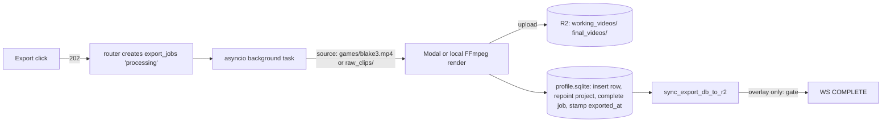

# Export Pipeline — Domain Knowledge

## Scope
- `src/backend/app/routers/export/` — `framing.py` (722 L), `overlay.py` (2,243 L), `multi_clip.py` (2,500 L), `before_after.py` (381 L), `__init__.py` (mounts all under `/api/export`, `__init__.py:24`)
- `src/backend/app/routers/exports.py` — durable job status/recovery (`/api/exports/*`, prefix at `exports.py:38` + `main.py:156`)
- `src/backend/app/services/export_helpers.py`, `export_worker.py`, `auto_export.py`, `transitions/`
- `src/backend/app/routers/downloads.py` — publish ("Move to My Reels") / restore-for-edit
- `src/backend/app/middleware/db_sync.py` — durable-sync machinery; `src/backend/app/websocket.py` — progress channel
- DB tables (per-user profile SQLite): `export_jobs`, `working_videos`, `final_videos`, `working_clips`, `projects`. Readers use `MAX(version)` via `app/queries.py` (`latest_working_clips_subquery`, `latest_final_videos_subquery`)

## Entry points
| Route | Handler | What it does |
|---|---|---|
| `POST /api/export/render` | `framing.py:350 render_project` | Backend-authoritative single-clip framing render; 202 + background `_run_render_background` (`framing.py:508`) |
| `POST /api/export/framing` | `framing.py:160 export_framing` | Accepts frontend-rendered video; uploads to R2, inserts `working_videos`, stamps `working_clips.exported_at` |
| `POST /api/export/multi-clip` | `multi_clip.py:1832 export_multi_clip` | Multi-clip concat (transitions); 202 + `_run_multi_clip_background` (`:1989`) → shared `_export_clips` (`:1191`) |
| `POST /api/export/render-overlay` | `overlay.py:1961 render_overlay` | Highlight overlay render (Modal or local); 3 completion paths (no-keyframes copy `:2083`, test `:2159`, real render → `_run_overlay_export_background` `:1830`) |
| `POST /api/export/final` | `overlay.py:1150 export_final` | Save frontend-rendered final video; request-scoped `durable_sync` dependency (`:1155`) |
| `POST /api/exports` + `/api/exports/framing` | `exports.py:436/:475` | BackgroundTasks path → `export_worker.process_export_job` (`export_worker.py:146`) |
| `GET /api/exports/{job_id}/modal-status` | `exports.py:797` | Recovery source of truth; may call `finalize_modal_export` (`exports.py:191`) |
| Sweep (no route) | `auto_export.py _export_brilliant_clip` | **T4175**: pre-expiry, preserves each never-framed clip's extract to `raw_clips/auto_*.mp4` + wires `raw_clips.filename` + leaves a frameable draft. NO publish, NO archive (was: `final_videos` insert + `archive_project`). Already-framed reels still skipped (T4160). **T7600 idempotency: safe to re-run** (see invariant below). |

> **T7600 — auto-export MUST be idempotent (a sweep re-run is a no-op).** `auto_export_game` retries the WHOLE game (up to `MAX_AUTO_EXPORT_ATTEMPTS=3`) whenever a LATER stage fails (e.g. recap generation crashes after the brilliant-clip loop) — `_find_games_for_hash` re-selects the `failed` game and the loop re-invokes `_export_brilliant_clip` for every clip. Before T7600 each re-run minted a FRESH `uuid4` filename, uploaded a NEW `raw_clips/auto_*.mp4`, and overwrote `raw_clips.filename` — silently orphaning every prior upload (never deleted, un-referenced once the pointer moved; prod: 3 waves = 3× storage for 8 clips). **Fix:** `_export_brilliant_clip` now exists-checks the clip's CURRENT `raw_clips.filename` (added to `_get_annotated_clips`' SELECT) via `r2_head_object(user_id, "raw_clips/{filename}")` before any ffmpeg/upload/DB-write; if the object is live, the call short-circuits to a no-op. The retry reuses the same annotated `start_time`/`end_time` from `_get_annotated_clips` (bounds are NOT re-trimmed between waves), so an existing valid extract is current — a pure exists-check is safe (option 1; random-suffix naming kept). Guard keys on the R2 OBJECT, not just the DB pointer, so a lost extract still regenerates. Cleanup for the ALREADY-orphaned prod objects: `scripts/cleanup_orphan_raw_clips.py` (dry-run default, `--apply` confirmation-gated — a human runs it with sign-off, never the AI). Tests: `test_auto_export.py::TestExportBrilliantClipIdempotency`, `test_t7600_orphan_raw_clips.py`.
| `POST /api/downloads/publish/{project_id}` etc. | `downloads.py:818` publish, `:923` restore | Both use `durable_sync` dependency |
| `GET /api/collections/download` | `collections.py download_collection` | **T4945**: stream a collection as ONE stitched MP4 (`[intro?][member_1..N][outro?]`); members concat (local ffmpeg or CPU-only `gpu=None` Modal `stitch_members` per `MODAL_ENABLED`) then app-side `compose_serve_time` for the ONE intro+outro, read-only over sources, disposable `temp/collection_stitch` scratch. **T4947 cache** (below): HEAD-before-build / write-after-build R2 cache. Access/sign-in gate: T4946 note above. Event-loop/error-handling hardening: T7040 note below. Progress UI: T7050 note above. |

**The 6 export triggers** (T4370 harness must snapshot all of them): single-clip render (`/render`), multi-clip Modal branch, multi-clip local branch (`_export_clips:1236` vs `:1463`), overlay final (`render_overlay`/`/final`), durable worker (`export_worker.process_export_job`), sweep auto-export (`auto_export._export_brilliant_clip`).

> **`POST /api/export/framing` is DEAD (T4350 finding).** No frontend or backend caller — the frontend uses `/render` (single) + `/multi-clip`. Its inline verbatim highlight carry (`framing.py:240-260`) never runs. Don't "fix" that site; the live carry lives in `upsert_working_video` (below).

## Highlight carry-forward on framing re-export (T4350 + T4355)

The problem: `working_videos.highlights_data` is the SOLE home of user overlay-edited highlights (`transform_all_regions_to_raw` has ZERO production callers → edits are never written to raw space). A framing re-export creates a NEW `working_videos` version; the live finalizers used to seed it from FRESH detection → the prior version's edits were **silently discarded**.

- **Decision site (single chokepoint): `upsert_working_video` (`export_finalize.py`), INSERT branch ONLY.** It reads the prior wv (`highlights_data` + `framing_snapshot`) via `projects.working_video_id` BEFORE the repoint, then calls `services/highlight_carry.resolve_carried_highlights(prior_highlights, prior_snapshot, new_snapshot, detected_regions, clip_count)`. The **UPDATE/resume branch sets only filename/duration/detections_data** — it must NOT touch `highlights_data`/`framing_snapshot`/`highlight_carry_note`, or a recovery-after-sync-failure re-run re-seeds detection over the carried regions (the original bug, on the recovery path).
- **Decision matrix** (`highlight_carry.py`): empty prior → seed detected; `prior_snapshot == new_snapshot` → verbatim fast-path; prior_snapshot is None (legacy, ANY clip_count) → verbatim carry + `"legacy_uncertain"` (promoted above the clip_count split — carrying real regions with a "verify positions" flag beats a detection reset); `clip_count == 1` + differs → `_transform_single_clip` (`to_raw`(old framing)→`to_working`(new framing), drop out-of-range), `note="dropped:N"`; `clip_count > 1` + differs → **`_transform_multi_clip`** (T4355, below), same `dropped:N` contract; residual unmappable multi-clip → detected + `"multiclip_reset"`. Transform preserves region metadata (merge geometry onto the original by id); `dropped` counts ENABLED regions only.
- **T4355 — multi-clip per-region attribution + transform (closes Gap B).** Highlight regions live in CONCATENATED working-video seconds with no clip reference. `_attribute_clip_index(start_time, offsets, durations)` buckets each region into its OLD clip via a **half-open span** `[off_i, off_i+dur_i)` — attribution is by `start_time` alone (a region's geometry is authored against the moment it begins); an exactly-on-boundary `start_time` attributes to the LATER clip, never the earlier one. `_transform_multi_clip` then: shifts the region into that clip's LOCAL old timeline (clamping `end_time` to the clip's OLD span end for a straddling region — mirrors the single-clip transform's existing partial-trim clamp) → runs the SAME `transform_all_regions_to_raw`/`_to_working` pair against `clips[i]` (generalizing `_transform_single_clip`'s hard-indexed `clips[0]`) → re-offsets into the clip's position on the NEW concatenated timeline → id-merges geometry back onto the original region. DROP+count (folded into the same `dropped:N`, never a new note) when: the attributed OLD clip index no longer exists on the NEW side (removed, or reordered past the new count), the straddle-clamp collapses to sub-frame, or the per-clip transform returns nothing (trimmed out on the NEW side).
  - **Clip identity is POSITIONAL ONLY** (`clips[i]`, no stable id in the snapshot) — a true clip reorder is indistinguishable from "the clip at this position got reframed." A region on a reordered clip safely DROPS+flags (never silently lands on the wrong clip's timeline); true reorder-survival would need a persisted clip id and is a follow-up, not attempted here.
  - **Dissolve transitions:** `_build_framing_snapshot` gained an additive `"transition":{"type","duration"}|None` key (no migration, same BLOB) so a re-export's OLD-side concat offsets can subtract the dissolve overlap. `concat_offsets(snapshot)` (`routers/export/multi_clip.py`) is the shared cumulative-offset formula (`get_output_duration` per clip + dissolve subtraction), used for BOTH old and new sides — **kept independent from**, not merged into, the pre-existing `build_clip_boundaries_from_durations`/`_from_input` (those consume raw `ClipExportData`/measured durations for detection boundaries; `concat_offsets` consumes the snapshot's canonical `{segments_data, raw_duration}` — different input shapes bounded the abstract-on-3rd extraction; the dissolve-subtraction LOOP is duplicated across three sites and must be kept in sync by hand if either changes). Absent/`None` `"transition"` ⇒ treated as **cut** (never guesses dissolve) — this is what lets a LEGACY prior snapshot (written by T4350 before this key existed) still transform correctly on a plain cut re-export.
  - **Landmine (caught in Reviewer, fixed before merge):** the "can't derive OLD offsets" unmappable-guard must key on the **NEW-side** transition (`_dissolve_offsets_unavailable(prior_snapshot, new_snapshot)`), not "OLD snapshot lacks a `transition` key" alone. An OLD-only guard resets **every** legacy multi-clip project — including plain cut re-exports — on its very next re-export, discarding real user highlights the design explicitly says should transform fine. `NOTE_MULTICLIP_RESET` now fires ONLY when the prior snapshot lacks `transition` **and** the current export's own NEW side is itself a dissolve (the one case where the OLD overlap is genuinely unknowable).
- **Framing snapshot** (`{clip_count, video_dims, clips:[{crop_keyframes(FRAME-based), segments_data(canonical), fps=30, raw_duration}], transition:{type,duration}|None}`): built at export START in `_export_clips._build_framing_snapshot` from the render's own `ClipExportData` (frame-based crop captured before the render's time-based conversion — `interpolate_crop_at_frame` needs frame-based), NOT re-read at finalize (avoids the pre-export-PUT race). Threaded via `job input_data` + `_persist_rendered_checkpoint` so recovery reconstructs it. `video_dims` = render target resolution. `transition` key added T4355, additive/optional.
- **Schema:** profile_db **v046** adds `working_videos.framing_snapshot BLOB` + `highlight_carry_note TEXT` (columns only, **no backfill**). All carry-column reads/writes are deploy→migrate column-guarded (`_working_videos_has_carry_columns`, `/overlay-data` `column_exists`, complete_data try/except). T4355 added **no schema/migration** — `transition` is an additive msgpack key inside the existing BLOB.
- **Notice surfaces (both read the same code):** export-complete WS payload `complete_data.highlightCarryNote` → `toast.info` (`ExportButtonContainer.onComplete`); `GET /overlay-data` returns `highlight_carry_note` → persistent dismissible amber banner (`OverlayMode`, held in `useHighlightRegions` like `videoDetections`). `utils/highlightCarryNote.js` maps codes → copy. T4355 introduced NO new note code — multi-clip success-with-drops reuses `dropped:N` verbatim, so this file is unchanged.
- **T4355 verification gap:** the container worker that implemented this had no Modal auth / running dev server / real account, so end-to-end live QA (place highlights on 2+ clips, re-trim one, re-export, confirm correct landing) was NOT exercised — same gap T4350's worker hit. Coverage is 32 pure-function fixtures (`tests/test_t4355_multiclip_carry.py` + extended `test_t4350_carry_finalize.py`/`test_t4350_highlight_carry.py`) using the real production transform/canonicalize helpers as ground truth, not a hand-verified live render.

**Progress:** WebSocket `/ws/export/{export_id}` (`main.py:181`, handler `websocket.py:154`).
- `manager.send_progress` is fire-and-forget — dropped if no client connected (`websocket.py:123-126`); last frame mirrored into the in-memory `export_progress` dict for late polls.
- `websocket.py:21 make_progress_data` is the single payload builder: `status`/`done` derive from `phase`; `phase in (complete,done,error)` → `done=True`.
- Durable state lives ONLY in `export_jobs` rows (`GET /api/exports/active|recent|unacknowledged`); recovery/reconnect flows poll those, never the WS.
- **T7040 — `GET /api/exports/active` must NOT block the event loop.** `list_active_exports` (async) offloads the whole `get_active_exports()` chain via `await anyio.to_thread.run_sync(get_active_exports)` (`exports.py:617`). That chain runs `cleanup_stale_exports()` → for every stale job with a `modal_call_id`, a BLOCKING Modal round-trip (`check_modal_job_running` → `call.get(timeout=0)`, a control-plane hit even at timeout=0) in a SEQUENTIAL loop. Running it inline on uvicorn's single-worker loop froze EVERY other concurrent request for the sweep's duration (observed 31s), which starved a racing collection download until the browser abandoned it as a bare `TypeError: Failed to fetch`. `cleanup_stale_exports`/`check_modal_job_running` stay plain `def` (they are MEANT to run in a thread); the offload relies on anyio copying request contextvars (user/profile) into the worker so `get_db_connection()` still resolves the caller's per-user DB (fresh sqlite connection opened in-thread, no cross-thread affinity). Invariant: a blocking SDK/network call inside an `async def` route must be `anyio.to_thread.run_sync`-offloaded. Regression: `test_t7040_collection_download_event_loop.py` (a ticker coroutine must keep ticking during the sweep — FAILS inline, PASSES offloaded).
- **T7040 stub note:** the "clean 500" test stubs `evaluate_collection_members` — its stub member must carry an `id` (real return is `{id, name, duration, filename}`), since T4947's cache key reads `m["id"]`.

- **T4947 — disposable stitched-download cache (NO DB row, NO migration; existence fully derivable from the R2 key).** `download_collection` caches its composed MP4 at `{r2_prefix}/collection_downloads/{sha256(fingerprint)}.mp4` (same per-user prefix as the Modal stitch scratch, so it is disposable + torn down with the account). **HEAD-before-build** (`r2_head_object_global` → on hit, `download_from_r2_global` and stream, NO stitch/compose run at all); **write-after-build** on a miss (new `storage.upload_file_to_r2_global`, a local-file counterpart of `upload_bytes_to_r2_global`). Helpers: `_collection_download_cache_key`, `_card_content_hash`, shared `_stream_file_and_cleanup`. **Cache-key fingerprint = EVERYTHING that changes the composed bytes:** ordered member ids + each member's filename + resolved intro card id (`card_row["id"]`, post `resolve_intro_card_id` 0/dangling→None) + the card's content hash (`updated_at` + content columns, so a same-id card EDIT invalidates) + **the burned intro FACTS** (`_load_field_values`: profile `full_name` + shown fields — these live in `user.sqlite`, NOT the card row, so a profile rename never bumps the card's `updated_at`; folded in only when a card is attached, `asyncio.to_thread`-offloaded per T7040) + `outro_enabled()` (the `BRANDED_OUTRO_ENABLED` flag is what `compose_serve_time` ACTUALLY honors, not the literal `outro=True`) + `budget_sec`. **Two concurrency/degradation invariants:** (1) **race-safe** — an R2 object PUT is atomic (key visible only on completion) AND each request streams its OWN freshly-built local `serve_path` (never the key it just wrote), so two concurrent uncached requests can't corrupt each other's output; no temp-key/rename dance needed (R2 PUT ≠ filesystem partial write). (2) **degraded builds are NOT cached** — `compose_serve_time` is non-fatal (a transient intro/outro/concat hiccup degrades to the bare stitch but still returns True); it now takes an optional `report` out-dict setting `report["full_fidelity"]`, and the endpoint caches ONLY when full-fidelity, so a transient degradation streams to that one caller but never freezes outro-less bytes into the cache (the next request re-misses + rebuilds). Regression: `test_t4947_cache_stitched_downloads.py` (hit-no-recompute incl. Modal branch; one miss test per dimension incl. card-content edit + burned-fact edit; degraded-not-cached; asyncio-gather race with a `threading.Barrier`). Downloads are FREE (Decision 4) so there is no charge to skip on a hit.

**Credits:** GPU exports reserve → insert job → confirm before dispatch (`framing.py:446-478`, `multi_clip.py:1927-1958`, `exports.py:536-595`); failure paths refund (`multi_clip.py:1760-1829`, `export_worker.py:206-219`).

## Data flow

```mermaid
graph LR
  FE[Export click] -->|202| R[router creates export_jobs 'processing']
  R --> BG[asyncio background task]
  BG -->|source: games/blake3.mp4 or raw_clips/| REN[Modal or local FFmpeg render]
  REN -->|upload| R2[(R2: working_videos/ final_videos/)]
  REN --> DB[(profile.sqlite: insert row, repoint project, complete job, stamp exported_at)]
  DB --> SYNC[sync_export_db_to_r2]
  SYNC -->|overlay only: gate| WS[WS COMPLETE]
```
- **Source resolution (T4175 `resolve_clip_source`, `export_helpers.py`):** framing (`_run_render_background`) and multi-clip both call the shared `resolve_clip_source(clip) -> (url, in_off, out_off, flexible)` instead of inlining the game key. Order, first hit wins, visible-fail on total miss (`SourceUnavailable`, no silent fallback): (1) game video present -> `(game_url, raw_start, raw_end, flexible=True)`; **T4140: HEAD-probed for EVERY game clip** (the recap is now a universal fallback, so a reclaimed game must fall through — the old "no extract -> skip probe" shortcut is gone; `r2_head_object_global` retries transient blips internally); (2) preserved per-clip extract (`raw_clips.filename` set) -> `(raw_clips/{filename}, 0.0, duration, flexible=False)`; (3) **T4140 recap** (`_resolve_recap_source`, FILLED): downloads `recaps/{game_id}_clips.json`, matches the entry by **raw_clip id** (`clip['raw_clip_id']`, the recap-mapping key — a recap entry's `id` is the raw_clips.id, see games.py `_compute_recap_clips`), returns `(presign(recaps/{game_id}.mp4), recap_start, recap_end, flexible=False)`; None (-> `SourceUnavailable`) when game_id/mapping/entry/recap object missing. Uploaded multi-clip clips keep their own `raw_clips/{uploaded_filename}` download path. `flexible=False` = frozen bounds (reframe-only, no wider trims). This is what lets a T4130 Create-Clip draft (no preserved extract) re-export after the game video is reclaimed.
  - Game clips are keyed `games/{blake3_hash}.mp4` in a GLOBAL (env-prefix-free, not per-user) R2 namespace, fetched via `generate_presigned_url_global` + ffmpeg `-ss/-to -c copy` extraction (now via the resolver; `multi_clip.py` game branch unchanged mechanics).
  - Hash resolved as `COALESCE(gv.blake3_hash, g.blake3_hash)` joining `game_videos`→`games` (`framing.py:399`, `multi_clip.py:2044`, `auto_export.py:125-129`).
  - Per-user artifacts: `raw_clips/`, `working_videos/`, `final_videos/`, `temp/multi_clip_{export_id}/`.
  - Export routers never touch `storage_refs`/`game_storage_refs` — the ref-count/reclaim lifecycle that can delete a `games/{hash}.mp4` lives in `materialization.py` / `sweep_scheduler.py` / `games.py`; `auto_export.py` is the pre-reclaim export hook.
- **Missing-source classification (T4990):** a re-export whose game source was reclaimed must
  record a TYPED `SOURCE_UNAVAILABLE` failure (user-actionable "expired/unavailable" wording),
  not a raw ffmpeg 404 string, so the UI can show the expired-source panel. Classify at the
  R2-object boundary, NEVER by parsing ffmpeg stderr (banned defensive patch). Primary path:
  `resolve_clip_source` already raises `SourceUnavailable` when every candidate source is gone.
  Backstop in `_run_render_background` (framing.py): on ffmpeg EXTRACT failure, re-probe with
  `export_helpers.source_confirmed_unavailable(clip)` (same HEAD probes resolve uses —
  `r2_head_object_global`/`file_exists_in_r2` retry transient blips internally, so True = a
  SUSTAINED miss = confirmed-404-only, T4820; a present source with a transient failure stays
  GENERIC). The outer handler maps `SourceUnavailable` → `classified_source_unavailable_message`
  (carries the `SOURCE_UNAVAILABLE` code + clip id) into `fail_export_job` + the WS error.
  Spec/regression: `test_t4050_missing_source_reexport.py` (was RED on master, deselected in CI)
  + `test_t4990_source_classification.py`. NOTE: the known-failures.md row + branch-ci.yml
  `--deselect` for test_t4050_missing_source_reexport are now stale (the test passes) — remove
  both once this lands.
- **Finalize transaction** (hand-copied 5×, drifted — see epic): insert `working_videos`/`final_videos` → repoint `projects.working_video_id`/`final_video_id` → complete `export_jobs` → stamp `working_clips.exported_at` + snapshot `raw_clip_version`.
  - Copies: `export_worker.py:259-339`, `framing.py:227-288`, `overlay.py:96 _finalize_overlay_export`.
- **Staged, unified multi-clip finalize (T5630, DONE):** the multi-clip finalizer's THREE divergent writers (Modal in-band, local in-band, recovery-only) collapsed into ONE path. `services/export_finalize.py`:
  - `upsert_working_video(job, *, filename, duration, highlights_data, detections_data=None, gpu_seconds, modal_function)` — the shared idempotent **persist transaction** (working_videos INSERT/UPDATE → repoint project → complete `export_jobs` → stamp `working_clips.exported_at`). **Insert-once-per-job** via the `export_jobs.output_video_id` back-reference (no UNIQUE on `(project_id, version)`, so enforced in code): if the job already has an `output_video_id` whose row exists → UPDATE in place (same version), else INSERT `MAX(version)+1`. Used by BOTH `_export_clips` branches (Modal via finalize_export, local directly) — the local branch passes `detections_data=None` (its historical omission).
  - `finalize_export(job, output_key, user_id, profile_id, *, video_duration, gpu_seconds, modal_function, progress_callback)` — the Modal **detect → persist → sync** orchestrator, resumable by `export_jobs.stage`. Idempotent early-return when `stage=='complete'` OR `status=='complete'`. Reconstructs `source_clips` from the persisted `input_data` (`build_clip_boundaries_from_input`, render-file-independent). **BINDING fidelity: detection fps defaults to 30 (do NOT pass `target_fps`); the detection fallback writes `_empty_video_detections()`, NOT `None`.** Sync gate (invariant #1) stays between persist and `stage='complete'`; on sync fail it stays at `persisting` and returns `sync_failed` (working_video committed locally + `mark_sync_pending` retry). **T7210: concurrent-finalize CAS.** The `stage=='complete'` idempotency check only catches an already-FINISHED job, not two callers racing through detect/persist AT ONCE — became reachable once recovery could actually finalize (see modal-gpu.md § Recovery). `_claim_stage_for_finalize(job_id, expected_stage, new_stage)` gates the `→detecting` transition on the CALLER's OWN stage snapshot (`WHERE stage IS ?`) — the loser's UPDATE matches 0 rows and it returns `{"finalized": False, "already_finalizing": True}` instead of proceeding. Tolerates "no export_jobs row exists at all" (some callers, e.g. tests driving `_export_clips` directly, never insert one — pre-T7210 `_set_export_stage` silently no-op'd on this too) by falling back to "proceed" only when no row exists; a row that exists with a DIFFERENT stage is genuine contention → bail. `multi_clip.py`'s `_await_concurrent_finalize` is the loser-side wait (polls `export_jobs` briefly for the winner's terminal state instead of raising a false failure/credit-refund).
  - **Recovery == normal export:** `exports.py finalize_modal_export` is now a thin async adapter → `finalize_export` (output_key from the persisted `stage='rendered'` checkpoint, else `modal_result.output_key` for pre-v028 jobs). Both recovery sites (`check_modal_status`, `resume-progress`) `await` it. `export_worker.recover_orphaned_jobs` unchanged (delegates completed Modal jobs to `/modal-status`). This deleted writer 3's old minimal `INSERT INTO working_videos (project_id, filename)` — the Brilliant-Control incident (recovery lost overlay data) is closed.
  - **Schema:** `export_jobs.stage TEXT DEFAULT 'queued'` + `output_key TEXT` (profile_db **v028**, tuple-row-factory-safe set-based backfill; runs manually post-deploy). 6-state `ExportStage` enum (`constants.py`): `queued→rendering→rendered→detecting→persisting→complete` (no `synced` — sync is a gate, not a persisted state). `stage` is exposed on the export-job JSON payloads (`ExportJobResponse`, guarded by `_has_stage_columns` for the deploy→v028 window — a below-head DB reads `stage=None`, never 500s). Checkpoints wired in `_export_clips` (`rendering` in the `store_modal_call_id` callback; `rendered` + `output_key` + `input_data={clips,transition}` via `_persist_rendered_checkpoint` after Modal success).
- **`final_videos` writers — CORRECTED to FOUR (T5215, 2026-08-06; this line previously said "(2)" and was wrong).** Every literal `INSERT INTO final_videos` in the tree (verified exhaustively: raw `sqlite3`, no ORM, no dynamically-built table name, so a whole-tree grep for the literal string is exhaustive by construction):
  1. `overlay.py` (`_finalize_overlay_export`) — the re-render finalize path (Modal/local/no-keyframes/test completion). Inserts `poster_filename=NULL` (poster columns filled by a SEPARATE `generate_poster_at_export` call the caller awaits right after, T5410) + the frozen `slowmo_section_*` + (T5215) carries `intro_card_id` forward from the prior version it just read (see below).
  2. `overlay.py` (`export_final`) — same shape, frontend-rendered final save; same T5215 carry-forward.
  3. `downloads.py` (`move_reels_to_profile` / `_build_moved_reel_row`) — moves a published reel to a SIBLING profile (T5810). **Deliberately does NOT carry `intro_card_id`** (cards are per-profile, epic decision 7; a source card id is meaningless/dangling in the target) — the column is absent from `_MOVED_REEL_CARRY_COLUMNS` on purpose, so the target row lands NULL = inherits the TARGET profile's own default.
  4. `test_seams.py` — seeds published rows directly, test-only, not a production egress.
  (The T4175 sweep is NO LONGER a `final_videos` writer — it produces a needs-framing draft + `raw_clips/` extract, no publish, no `published_at`.)
- **Player-intro attachment (T5215, 2026-08-06):** `final_videos.intro_card_id` (profile_db v034: `0` = no intro, `NULL` = inherit the profile default, `<id>` = that explicit card — NULL and 0 are deliberately different, epic decision 8) is resolved by the ONE shared helper `app.services.intro_cards.resolve_intro_card_id` (pure) + `resolve_intro_card` (DB wrapper: loads the profile default + the duration threshold, then fetches the row) — every consumer (the reel PATCH's read-back, `GET /api/downloads`'s batch-resolved list, the collection share resolver) imports this same function; two implementations of the resolution order was the one failure this task existed to prevent.
  - **Duration gate REMOVED (T6680; column dropped T6850).** There is NO duration threshold anymore: the NULL/inherit branch ALWAYS resolves to the profile default regardless of reel length. `resolve_intro_card`/`resolve_intro_card_id` no longer read any `reel_duration`. The `user_settings.intro_min_duration_seconds` setting (added profile_db v037/v041) is gone — dropped by profile_db v043 (T6850) as dead data, its `GET/PATCH /api/profiles/current/intro-min-duration` endpoints removed. (Historical: 2026-08-06 the inherit path was gated on `reel_duration >= threshold`, default 20s; T6680 deleted that path.) An EXPLICIT id or `0` was never gated and still isn't.
  - **Re-export carry-forward (the top regression risk):** writers 1 and 2 above read the project's PRIOR `final_videos` row's `intro_card_id` (same read that already captures `filename` for the T4010 atomic-swap prior-object cleanup) BEFORE any delete, and thread it into the new version's INSERT — both column-guarded (`column_exists`) for the deploy→migrate window. This is what makes "attach a card, re-export, the new version still carries it" hold. Writer 3 (cross-profile move) is the one INSERT that must NOT carry it (see above).
  - **`GET /api/downloads` no-N+1:** batch-loads `{card_id: {name, is_default}}` (`services.intro_cards.load_profile_cards`) + the threshold ONCE for the whole list, then resolves every row in memory via `resolve_intro_card_id` — cost is O(1) extra queries regardless of row count, not O(n). Returns BOTH the raw stored `intro_card_id` (0/NULL/id, for the picker's preselection) and the RESOLVED `intro_card_name` (what will actually play).
  - **Collection attach (`collections.py`):** `CollectionDefinition.intro_card_id` is the client's raw picker choice (id / 0 / None="use my default"); `create_collection_share_endpoint` resolves it to a CONCRETE value (id or 0, NEVER NULL) at share-CREATION time and freezes that into the canonical JSONB (`shares.collection_definition`, no Postgres migration) — this is what makes "changing the default later does not retroactively move an existing link" true. Serve-time (`resolve_collection_share`/`_evaluated_share_members`) calls `resolve_intro_card(definition.get("intro_card_id", 0), ...)` on that frozen concrete value. A legacy share predating this field (missing key entirely) defaults to `0` (no intro).
  - **Consent gate:** `PATCH /api/downloads/{id}/intro` and the collection-share create both 403 when attaching a non-null/non-zero explicit id without `intro_consent_at` recorded (`services.user_db.get_intro_consent`, user.sqlite) — detaching (`0`) or leaving it on inherit (`null`) is NEVER gated.
  - **Frontend:** one shared presentational carousel (`components/introcards/IntroCardCarousel.jsx`) used identically by the reel kebab menu (`ReelTile.jsx` → `IntroCardPicker.jsx` modal) and the collection share dialog (`CollectionShareModal.jsx`, embedded inline) — newest-first, a "No intro" tile, the default marked "Your default", the public-exposure notice when the effective selection has a photo. The profile threshold input lives in `ProfileIntroSection.jsx`, gated on `profile.isCurrent` (the endpoint is current-profile-scoped only; `ProfileIntroSection` can render for a non-active profile via `ManageProfilesModal`, where the control is not meaningful — mirrors the existing `isCurrent` gate the "Intro cards" library button already used).
- **`final_videos.name` re-freeze at publish (T5260):** the render-time INSERT freezes `name` from `projects.name` at that moment, but the draft stays renameable in Reel Drafts until it's moved to My Reels. `publish_to_my_reels` (`downloads.py:1208`) re-reads the CURRENT `projects.name` and writes it into the same `UPDATE` that sets `published_at`/`watched_at`, so a rename-after-render isn't silently lost. If the project row is missing/gone (dangling `final_videos.project_id`, see T4800 below) or its name is empty, the existing frozen name is kept (no NULL overwrite) and an info `[Publish]` log line notes why. This makes PUBLISH the second and last freeze point for `name` — the gallery rename endpoint (`downloads.py:~868`, guarded `published_at IS NOT NULL`) is the only writer after that. Single write path per phase: render owns pre-publish, publish re-freezes once, gallery rename owns post-publish; no path overlaps another.
- **Branded outro (T3950):** "Made with Reel Ballers" (~2.4s animated dark card since T5240; ~1.75s static originally) attached via two non-invasive paths:
  - **Playback compositing (shared/public surfaces only):** `BrandedEndCard.jsx` (React) shown by `SharedVideoOverlay` (on `MediaPlayer.onEnded`) and `SharedCollectionView` (on `CollectionPlayer.onEnded`); inline DOM overlay in the edge-function share page (`functions/shared/[token].js`, `v.ended` listener). No re-encode, no migration — every existing reel gets the card for free on next view. Never shown in editor/ranker/owner My Reels (prop-gated via `visible` prop).
  - **Download-time burn-in:** `GET /api/downloads/{id}/file` downloads from R2 into a temp dir, calls `append_branded_outro(original, out)`, streams the result, then cleans up in `finally`. Non-fatal: any failure logs loudly and serves the original (HTTP 200 always). Card is cached per (width×height, fps, pix_fmt, audio layout) in `/tmp/rb_outro_cards/` (MD5 keyed, atomic rename on build). Stored `final_videos` carry NO outro — the burn happens at serve time on demand.
  - Gate: `BRANDED_OUTRO_ENABLED` env var (backend, default true) + `BRANDED_OUTRO_ENABLED` constant (`src/frontend/src/constants/brandedOutro.js`, default true).
  - **T5240 — animated card (2026-07-22):** the download-burn card is ANIMATED entirely inside `_build_outro_card`'s `filter_complex` (still encoded ONCE + cached, so animation is free at export). `OUTRO_DURATION` bumped `1.75`→`2.4` for the extra beats. The logo is rebuilt from its SVG PARTS (not the old flat `reelballers-lockup.png`, now unused): `assets/branding/reelballers-ring.png` (film-reel ring + 4 sprocket holes) and `reelballers-play.png` (white triangle), both rasterized from `src/assets/logo/logo.svg` on a TRANSPARENT canvas. Motion: (1) WHITE-FLASH entrance (`fade=t=in:color=white:st=0:d=OUTRO_FLASH_IN`, applied LAST so frame 0 is deterministically white on every ffmpeg build — the portable anchor); (2) the ring SPINS in, decelerating to a stop (`rotate=a='<ease-out>':c=none`, `OUTRO_SPIN_D`/`OUTRO_SPIN_TURNS`) + alpha fade; (3) the play triangle LANDS with a press bounce (`scale=w/h='<ease-out-back>':eval=frame`, `OUTRO_PLAY_ST`); (4) staggered captions "Made with" + "Reel Ballers" brand (`OUTRO_BRAND_IN_ST`), tagline `TAGLINE_TEXT` (`OUTRO_TAGLINE_IN_ST`), URL (`OUTRO_URL_IN_ST`), drawtext `alpha='if(...)'` ramps. `_CARD_VERSION` bumped `v3-animated`→`v4-spin-play`. **Landmines:** (a) `overlay` CANNOT composite an input whose size changes per frame (`scale …:eval=frame` feeding it freezes on frame-0's size) — PAD each scaled play frame back onto a CONSTANT `play_canvas` (`pad=…:eval=frame`, sized > the overshoot) before overlay; (b) drawtext CANNOT reliably inline an apostrophe (the tagline's `Player's`) across ffmpeg builds — write it to a temp file and use `textfile=`; (c) filtergraph expression values are single-quoted, so do NOT also backslash-escape their commas; (d) the luma-read test harness must read the FIRST `metadata=print` line (`lines[0]`), not the last — `-frames:v 1` bounds the muxer, not the metadata filter, and older CI ffmpeg prints many lines. Concat/probe-match/non-fatal/cache contract unchanged. Tests: `test_t5240_animated_outro.py` (flash entrance, ring-before-play ordering, play press bounce, caption stagger, exact tagline — via luma-over-time) + `test_t3950_branded_outro.py` (unchanged, still green).
- **Player intro card (T5210, 2026-08-05; egress wired T5220, 2026-08-08; 5th egress — owner in-app playback — added T6700, 2026-08-09):** an animated intro card PREPENDED at serve time — the mirror of the branded outro in the prepend direction. `services/player_intro.py`:
  - `build_intro_card(card, field_values, image_path, info, out_path) -> bool` is a PURE function (no DB, no R2, no job rows — T5220 resolves the card row, the profile fact VALUES, the effective focal, and downloads the R2 image to a local path (image_key ONLY — T6950 one-image rule, cutout reads removed)). `prepend_intro_card(card_path, main_path, out_path)` does the probe-matched `-c copy` concat with the **card FIRST**, re-encode fallback, then `_validate_concat`. **NON-FATAL always** (epic dec 9): every failure returns False/None and logs; it NEVER raises into a download/share/export.
  - **T6860 round-2 landmine (facts-freshness asymmetry -> "right card, WRONG stale name" in the download only):** the card TITLE = the profile's `full_name`, which lives in **user.sqlite** (`user_settings` key `intro_full_name.{profile}`), NOT in the card row (profile.sqlite). The burn egress reads the card ROW restore-if-newer (`open_profile_db_readonly` -> `ensure_profile_db_local`) but read the FACTS via the OWNER path `get_user_db_connection` -> `ensure_user_database` = **restore-if-ABSENT only**. On Fly (multi-machine, per-machine local user.sqlite + per-machine `/tmp/rb_intro_cards` render cache), a machine holding a stale user.sqlite bakes an OLD full_name into the (correctly hash-keyed) cached card, while in-app playback on a DIFFERENT, fresh machine shows the current name. The render cache is NOT the bug (`_content_hash` includes the rendered title, so a name change busts it) — the bug is STALE FACTS feeding the correct hash. **Fix: `intro_egress._load_field_values` calls `ensure_user_database_fresh(user_id)` (restore-if-newer, WAL-safe sidecar guard, read-only) before reading facts**, so all three live egresses (owner download, share playback, share download) that share this ONE seam read facts as fresh as the card row. Owner user.sqlite reads are otherwise restore-if-ABSENT on every path (session_init included) — only foreign-user reads restore-if-newer (via `confirm_current_before_write`). Guard: `tests/test_t6860_intro_facts_freshness.py`.
  - **T6860 landmine (Fly-only, cost the user every downloaded intro):** the burn egress fetches the card image via `intro_egress._download_card_image` → `storage.download_from_r2_global`. That helper ORIGINALLY used `get_r2_transfer_client()` (boto3 GB-scale multipart TransferManager) — and it is the ONLY live caller of `download_from_r2_global`, so that transfer-client path was exercised by NOTHING else on the Fly web servers (playback + game export only ever *presign*). It failed non-transiently on Fly → `_download_card_image` raised → `resolve_intro_for_reel` degraded NON-FATALLY to no-intro → the intro was silently absent from BOTH download egresses (owner `/downloads/{id}/file` + single-reel share `/shared/{token}/download`) while in-app **playback stayed correct** (presign, never downloads). It reproduced ONLY on Fly — locally the transfer client downloads fine under either ffmpeg. **Fix: `download_from_r2_global` now uses the DEFAULT sync `get_r2_client()`** (same client+`download_file` that per-user `download_from_r2` runs on every session-init, proven-good on Fly); card images are ~1-2 MB, far below any multipart need. Rule for future global downloads of SMALL objects: use the sync client, not the transfer client. The non-fatal degrade is correct (epic dec 9) but must NOT be the steady state — an attached card is required to appear. Guard: `tests/test_t6860_intro_download_client.py`.
  - The card is DATA: composition is DERIVED via `intro_cards.derive_composition` (NO layout column), treatment is an independent axis, and geometry + motion + the treatment palette all come from the shared contract `services/intro_card_geometry.py` (Python source of truth) mirrored to `src/frontend/src/utils/introCardGeometry.js` (GENERATED — `python -m app.services.intro_card_geometry` regenerates; do not hand-edit) with `tests/test_t5210_geometry_parity.py` re-parsing the JS's embedded `@parity:*` JSON blocks (no JS runtime) and asserting `== Python`. The editor (T5205) reads the SAME numbers so preview == export.
  - **`intro_cards.text_elements` is FULLY DEAD (T6640, 2026-08-09)** — typography is now TEMPLATE-owned (a fixed ROLE per slot — title/primary/secondary, `ROLE_FOR_SLOT` in the shared contract — never per-card styling); the card rail no longer renders `TextSpecEditor` at all (the Overlay text rail still does, full control, untouched). `_select_elements`/`buildPreviewElements` stopped reading it, profile_db **v038** NULLs every row's column, and **`routers/intro_cards.py` create/patch no longer ACCEPT the field either** (round 3 — it was a dead write surface nothing sent; `validate_text_elements` deleted from `services/intro_cards.py`). Do not reintroduce a text_elements read OR write path. **Title text = the profile's full name (`field_values["full_name"]`) ALWAYS (T6620); `intro_cards.title_text` is DEAD — no longer read.** It was a pre-T6570 grandfathered override, but T6570 removed the only UI that could clear it, so a legacy value trapped an existing card on a stale name forever (staging report "my player's name won't pull into the card"). T6620 deleted every read (`player_intro._select_elements`, `introCardPreviewElements.resolveTitleText`) so the profile always wins, and **profile_db migration v036 NULLs the dead column** (do NOT reintroduce override semantics; the v034/v035/database.py DDL comments are updated to say DEAD). Fact VALUES = the profile (`field_values`). **Geometry slots are ORDINAL (`fact1/2/3` = the Nth line's position); styling is keyed SEMANTICALLY (`title`/`position`/`class`/`team`)** so un-ticking one fact never transfers another's styling. The renderer maps `for i, field in enumerate(shown_fields): slot=f"fact{i+1}"; styling=text_elements.get(field); value=field_values.get(field)`. This mapping is documented at length in `intro_card_geometry`'s header (the single most confusable thing). There is **no `subtitle` slot** (no schema field feeds it). A blank title/fact is OMITTED + logged, never drawn blank.
  - Text is a pre-rendered RGBA PNG per element via `text_render.render_text_layer` (T5180) — ffmpeg composites/animates the PNGs, NEVER `drawtext` (dec 5), which is what makes the export match the preview. Motion (dec 10) lives in ONE cached `filter_complex`, encoded once: photo Ken Burns push-in via `zoompan` (constant output size → overlay-safe, T5240 landmine a), staggered per-element `fade=…:alpha=1` + an overlay-`y` rise, and a white-flash EXIT (`fade=t=out:color=white`) applied LAST for a deterministic final white frame → clean cut to footage (the intro flashes OUT where the outro flashes IN). Stagger indices come from the contract's `STAGGER_ORDER`.
  - **Background, scrim and photo framing are Pillow, not ffmpeg** (exact + unit-testable, and radial gradients aren't a native ffmpeg filter): the treatment radial gradient is rendered per-pixel to match the editor's CSS (endpoints + centre + extent carried in the contract, NEVER flattened to one colour); `_frame_photo` cover-crops from the stored `focal_x/y`/`zoom` and PRESERVES alpha so a T5200 cut-out shows the treatment bg through. Photo is full-bleed for title-only/hero/broadcast and INSET for recruiting (top band at 9:16, left column at 16:9) — the inset is what visually separates recruiting from broadcast.
  - Cache: per content-hash (every pixel-affecting field: composition, treatment, aspect, duration, focal, IMAGE BYTES, each resolved element spec, probe params, `_CARD_VERSION`) in `/tmp/rb_intro_cards`, atomic rename. Editing the card invalidates; renaming it does not. Encoded once → animation free at serve time.
  - The ffmpeg concat/probe helpers (`probe_media`/`concat_segments`/`run`/`escape_filter_path`) were extracted into `services/ffmpeg_concat.py` at T5220 (3rd use, abstract-on-the-3rd rule + T5210 gate Q4) — `branded_outro.py`/`player_intro.py` import from it as a strangler-fig facade, keeping their own public function signatures (`append_branded_outro`, `apply_branded_outro_to_bytes`, `build_intro_card`, `prepend_intro_card`) unchanged; `concat_segments` generalizes the old 2-segment join to an ORDERED N-segment list. Tests: `test_t5210_player_intro.py` (build matrix 4×3×2 + flash-luma + cache hit/invalidation + non-fatal paths + the ordinal↔semantic seam mapping), `test_t5210_geometry_parity.py`, `test_t5220_ffmpeg_concat.py` (N-segment join, mismatch->re-encode fallback, validation-length guard). **Verified 2026-08-05** by live-driving the renderer: all 24 (4 comp × 3 treatment × 2 aspect) build valid MP4s; visual pass confirmed professional motion; cut-out transparency, no-photo gradient, unfilled-field omission, cache, prepend, and every non-fatal failure path all confirmed; a long club name in Graduate at 16:9 recruiting WRAPS to two lines within the slot (no horizontal overflow, stays on-frame — Graduate is wide but the wrap holds; not silently shrunk) and lowercase reads fine.
  - **T5220 — egress wiring (design: `docs/plans/tasks/T5220-design.md`).** `services/serve_time_video.py::compose_serve_time(reel_path, out_path, *, intro=None, outro=True, metadata_hook=None)` is the ONE serve-time helper: probes the reel once, builds whichever cards are requested, joins `[intro?, reel, outro?]` in a SINGLE `ffmpeg_concat.concat_segments` pass (not two sequential passes), applies the (today no-op) `metadata_hook` seam, and returns True whenever ANYTHING playable was produced (False only when the reel itself is unreadable) — non-fatal fall-through ladder: intro fails -> `[reel][outro]`; outro fails -> `[intro][reel]`; both/concat fail -> raw `[reel]`; HTTP 200 always. `services/intro_egress.py::resolve_intro_for_reel(user_id, profile_id, intro_card_id, reel_duration, reel_id, *, mode="burn"|"playback", profile_conn=None)` is the ONE cross-DB assembly seam for the three LIVE-resolving paths (owner download, single-reel share playback, single-reel share download): opens the reel's profile.sqlite (the caller's connection if supplied, else its OWN read-only `open_profile_db_readonly(user_id, profile_id)` — **never the ambient `get_db_connection()`**, since the share paths resolve the SHARER's profile from a request carrying no/a different user context), resolves the card via T5215's `resolve_intro_card`, cross-DB reads `field_values` from user.sqlite (`get_all_intro_facts`/`get_all_intro_full_names`), and either downloads the card image to a temp path (`mode="burn"`, returns an `IntroSpec` the caller `.cleanup()`s) or presigns it (`mode="playback"`, returns `{card, previewUrl, field_values, profile}` — `build_intro_playback_payload` is the shared serializer for this shape, reused by `routers/collections.py` for the FROZEN collection path so both never diverge). Wired at:
    - **Owner download** (`routers/downloads.py::download_file`): the `final_videos` SELECT is widened to `fv.intro_card_id, fv.duration`; both the R2 and local streaming generators call `resolve_intro_for_reel` (default `profile_conn=None` — resolves its own read-only connection, since the ambient request connection is already closed by the time a `StreamingResponse` generator body actually runs) then `compose_serve_time(..., intro=intro, outro=True)`, replacing the old outro-only `append_branded_outro` call.
    - **Share playback** (`routers/shares.py::get_shared_video`): `ShareDetailResponse.intro` (optional) is populated via `_resolve_share_video_intro(share, mode="playback")`, which opens the SHARER's profile.sqlite, reads that video's LIVE `intro_card_id`/`duration`, and resolves. Absent/failed -> `intro=None`, no pre-roll (today's behavior).
    - **Share download** (`routers/shares.py`, NEW `GET /api/shared/{share_token}/download`): token-gated identically to `get_shared_video` (404/410/403); downloads the reel to a temp dir, resolves the SAME LIVE intro (`mode="burn"`), `compose_serve_time(..., outro=True)`, streams as an attachment. `SharedVideoOverlay.jsx`'s `handleDownload` repoints here from the raw `fetch(share.video_url)` (closes the pre-existing "share download has no outro either" gap in the same move).
    - **Collection playback** (`routers/collections.py::resolve_collection_share`): unchanged resolution (`_evaluated_share_members` already resolves the FROZEN card, T5215) — T5220 only SERIALIZES it: `intro_fields["intro"] = build_intro_playback_payload(intro_card, _load_field_values(sharer_user_id, sharer_profile_id))`, once under a single top-level `intro` key (not per-member).
    - **Owner in-app playback (T6700, 2026-08-09; design: `docs/plans/tasks/T6700-design.md`)** — the 5th egress, extending decision 1's PLAYBACK half to playing your OWN reel/collection in-app (not download, not share; T5220 deliberately scoped only the other 4). Two thin per-play GET endpoints, reusing the SAME `resolve_intro_for_reel`/`build_intro_playback_payload` seam verbatim (no new resolver, no new serializer): `routers/downloads.py::get_download_intro_playback` (`GET /{download_id}/intro-playback`) resolves the reel's own `final_videos.intro_card_id`; `routers/collections.py::get_collection_intro_playback` (`GET /intro-playback`, same params as `GET /intro`) resolves the COLLECTION's own attached card against LIVE total duration (mirrors `get_collection_intro`'s resolution block — never per-member reel intros). Both non-fatal 200-always (`{"intro": null}` for no attachment/resolve failure). **The one call site that intentionally passes the AMBIENT `get_db_connection()`** as `resolve_intro_for_reel`'s `profile_conn`, not `open_profile_db_readonly`: this path is same-account/same-request-user (the owner viewing their own reel), not a cross-account share resolution, so the ambient connection is correct here — the "never the ambient connection" rule two paragraphs up is about the SHARE paths specifically, not a blanket rule. Deliberately NOT a widened list response (`GET /api/downloads` stays thin, no N+1 presigning on list load) — a per-play fetch instead, fired from the Play gesture handler (never a `useEffect`).
    - **Playback delivery (React):** `components/introcards/IntroPreRoll.jsx` wraps `MotionPreview` (T5205, the SAME component the editor preview/carousel use — no second animation path) — reassembles the backend's split `{card, previewUrl, field_values, profile}` payload back into the single `card`/`profile` shape `MotionPreview` has always read (`card.previewUrl`, `profile.full_name`/`profile[shownField]`) since the backend has no single "profile" row to cross a share boundary with. Mount-gated like `BrandedEndCard`'s `visible` prop, in reverse (shows BEFORE playback, not after). `SharedVideoOverlay.jsx` gates `<MediaPlayer autoPlay>` behind it; `SharedCollectionView.jsx` STILL mounts it INSTEAD OF `CollectionPlayer` until `onDone` (unmount/mount swap, unchanged by T6710 — that task explicitly scoped the composite-timeline rebuild to the owner in-app player only, §7.3 of its design doc). **`DownloadsPanel.jsx` no longer does the swap** (superseded by T6710, below) — it mounts `IntroStoryPlayer` unconditionally instead. `CollectionPlayer.jsx`'s prop signature is the invariant every caller (SharedCollectionView, DownloadsPanel via IntroStoryPlayer, RankingGame, the collectionplayerdiag dev harness) relies on staying unchanged — guarded by `CollectionPlayer.characterization.test.jsx`; `useStoryPlayback.js` itself must stay byte-identical (T6710 verified this at every stage). The edge function (`functions/shared/[token].js`) cannot mount React — it hand-rolls a SIMPLIFIED CSS-keyframe DOM intro (photo + name + facts as plain text; push-in/fade/white-flash) mirroring how it already hand-rolls the outro `.ec-*` end-card; the `<video>` omits `autoplay` only when an intro is present, JS calls `.play()` after the card's own `setTimeout`. This is the one place the intro is NOT pixel-identical to the download (same accepted compromise as the shipped edge outro).
    - **Owner in-app intro as a real timeline segment (T6710, 2026-08-10; design: `docs/plans/tasks/T6710-design.md`)** — upgrades T6700's bolted-on swap into ONE composite scrubber spanning intro + reels, owner-in-app-player only (`SharedCollectionView` deliberately untouched, still does its own swap — see above). No backend change; both T6700 endpoints reused verbatim. New pieces, all in `components/introcards/`: `useIntroPlayback.js` (the intro's own rAF clock — `introTimeMs`, `seekIntro(ms)` for true arbitrary seek, `onIntroEnded` fired once, frozen via `setPlaying(region==='intro')` driven externally by the composite); `IntroStoryPlayer.jsx` (the composite container — owns ONE `region` state `'intro'|'reels'`, global position DERIVED not stored, forwards landing into `CollectionPlayer` via `initialIndex`/`initialSeekFraction` + a monotonic `landingToken` rather than calling `goTo` directly, so `useStoryPlayback` stays byte-identical); `CompositeScrubber.jsx` (the ONE shared weighted segmented-bar component, `flexGrow: durationSec` with a `weight=1` fallback for null/0/undefined duration — used by BOTH the composite and `CollectionPlayer`'s own internal bar, which is now ALSO duration-proportional globally, a deliberate non-gated scope decision that reaches `SharedCollectionView`'s bar too even though its intro-swap stays untouched). `CollectionPlayer.jsx` gained an additive `renderScrubber` (default true) and `onProgress({activeIndex, segmentProgress})` prop (fires off its EXISTING `useStoryPlayback` rAF tick — no second loop) so the composite can mirror live per-reel progress into its own bar. `MotionPreview.jsx` became `currentTimeMs`-driven/seekable (WAAPI animations built `pause()`d, `fill:'both'`) instead of mount-once-autoplay; its `setTimeout(onDone)` was deleted, so three now-orphaned legacy callers (`IntroPreRoll`'s share/edge path, `IntroCardCarousel.jsx`, `IntroCardStage.jsx`) needed a new shared fallback clock, `useMotionPreviewAutoplay.js` (the "play once, tell me when done" shape `useIntroPlayback` intentionally does NOT provide).
      - **Landmine — don't call a side-effecting callback that triggers a SIBLING component's `setState` from inside a `setState` functional updater.** `useIntroPlayback`'s rAF tick originally computed `next` and called `fireEndedOnce()` (which cascades into `IntroStoryPlayer`'s `setRegion('reels')`) from inside the callback passed to `setIntroTimeMs(prev => ...)`. This passed every unit test (jsdom's isolated `renderHook` + a bare `vi.fn()` callback never exercises a second component's state) but froze forever in the real browser: the updater's side effect ran but the cross-fiber `setState` it triggered was silently dropped/never committed, so the intro finished the animation and never handed off to the reel. Only caught by a live Playwright QA pass (`e2e/T6710-intro-timeline-segment.qa.spec.js`) driving a real account — this is the reason this task's QA stage is not a formality for anything touching cross-component region/state handoffs. Fix: keep a synchronous ref mirror of the value (`introTimeMsRef`) and fire the cascading callback as a plain statement in the tick's own body, never inside another hook's updater.
      - **Landmine — CSS stacking, not test coverage, catches invisible overlays.** The first implementation pass rendered the composite scrubber as a plain unpositioned `
` sibling to the region's `fixed inset-0` player/intro overlay; per CSS stacking rules a positioned element paints above a static one regardless of DOM order, so the bar was invisible and unclickable — and every jsdom unit test still passed, because jsdom does no real layout/paint. Fixed by wrapping the bar in its own `fixed inset-0 ${Z.ALERT}` (z-[90], named ladder rung in `constants/zLayers.js`, clears both `Z.PLAYER` z-[70] and the intro's z-[85]) with a `pointer-events-none` outer / `pointer-events-auto` inner split. Any future full-screen-overlay UI needs either a real-browser check or an explicit DOM-structure assertion on positioning — a component-level render test alone will not catch this class of bug.
    - **Exposure notice (Scope F):** `components/introcards/IntroExposureNotice.jsx` extracts the amber "publicly visible" copy (was inline in `IntroCardCarousel.jsx`, 2nd use — a compliance single-source, not just DRY); `ShareModal.jsx` now also shows it, gated on a new `resolved_intro_has_photo` boolean in `GET /api/downloads`'s list response (`services/intro_cards.py::load_profile_cards` widened by one column, same batched query, no N+1).
  - **Seams (T5220 design §10):** (a) **T4945 (collection stitched download) — BUILT 2026-08-13.** `GET /api/collections/download?scope_type&aspect_ratio&game_id?&tags?&budget_sec?` (`routers/collections.py::download_collection`) streams a collection as ONE MP4. See the dedicated **Collection download (T4945)** note below. (b) **T6360 (download metadata/cover-art)** — `compose_serve_time`'s `metadata_hook` parameter; today always `None` (identity copy-through). T5220 owns the share-download endpoint AND this seam; T6360 supplies a non-None hook on top of it, never a second endpoint.
- **Collection download (T4945, 2026-08-13):** `routers/collections.py::download_collection` — the collection analogue of the single-reel owner download. Resolves members (`evaluate_collection_members`, rank order; optional `select_within_budget(budget_sec)`) + the collection's OWN card id (`get_collection_intro_card_id`) + R2 member keys (`final_videos/{filename}`) + `total_duration` + the R2 prefix (`_resolve_modal_user_id`, read while the ContextVar is ALIVE) + the filename **BEFORE** building the `StreamingResponse` generator (same closed-connection gotcha as `download_file`). Then (T7040, 2026-08-15) the fallible work — the member stitch (Modal or local) + R2 fetch + `compose_serve_time(stitched, out, intro=<collection card>, outro=True)` (ONE intro at the front `reel_id=None`, ONE outro at the end, never per-member) — runs IN THE HANDLER BODY, NOT inside the generator; the generator now only streams the finished `composed.mp4` off local disk. **Why:** an exception inside a `StreamingResponse` generator fires AFTER the 200 + headers commit, dropping the connection abnormally — the browser surfaced that as a bare `TypeError: Failed to fetch` with no diagnosable status. Doing the stitch eagerly means a failure raises a clean `HTTPException(500)` before any byte streams (nothing is streamed until the stitch finishes anyway, so zero added latency). The intro/outro compose stays best-effort (a compose failure degrades to the bare stitch, non-fatal). tmp_dir + scratch cleanup happens in the handler's `except` on eager failure and in the generator `finally` on the success/mid-stream-read path. `resolve_intro_for_reel` opens its own read-only conn.
  - **UI progress (T7050, 2026-08-15):** the `StreamingResponse` sets **NO `Content-Length`** (only `Content-Disposition` + `Cache-Control`, `collections.py:952-955`) — the stitched size is unknown until compose finishes — so the download UI shows an **INDETERMINATE** indicator, never a fake percentage. `useDownloads.downloadCollection(def, {onProgress})` reads the body via `response.body.getReader()` (blob fallback when the body is not a readable stream, e.g. test mocks), accumulating received bytes and reporting `{receivedBytes, totalBytes:null}` through `onProgress`; `CollectionCard` owns `downloadProgress` as gesture-scoped state (set/cleared in the same try/finally as the existing `downloadLoading` busy flag — no hook-global state, no `useEffect`), and `CollectionHeader` renders the bar in its footer reusing `GlobalExportIndicator`'s treatment (`animate-pulse w-full` indeterminate; `width:%` only if a `totalBytes` ever exists). **Most of the wait is pre-first-byte** (the stitch runs before the 200+headers commit, so the fetch itself hasn't resolved — the byte readout only ticks during the final disk→network stream); the copy is "Preparing your download…" until bytes arrive, then "Downloading… X MB". A failed download still throws → `DownloadsPanel.onDownloadCollection` catch → toast (T7040 error path intact). Tests: `CollectionDownload.test.jsx`.
  - **Compute location honors `MODAL_ENABLED` (EPIC decision 1).** `MODAL_ENABLED=false` (dev/container/staging): `_stitch_members_local` downloads each member (`download_from_r2(..., profile_id=<explicit>)`, or a copy of the local `final_videos/` file when R2 is off) and calls `ffmpeg_concat.concat_segments` (top-ranked member = reference; mixed-resolution safety is its built-in re-encode fallback, decision 7). `MODAL_ENABLED=true` (prod): the member concat is routed to the **new CPU-only (`gpu=None`) Modal `stitch_members`** function (`modal_functions/video_processing.py`, base ffmpeg+boto3 image, no GPU) via `modal_client.call_modal_stitch_members(user_prefix, member_keys, scratch_rel)` — the app then downloads the disposable `temp/collection_stitch/{uuid}.mp4` scratch (absolute-key `download_from_r2_global`) and best-effort deletes it (`r2_delete_object_global`). **The intro/outro compose ALWAYS runs app-side** (T3950 invariant: cards/branding/fonts are never in a Modal function) — Modal only ever muxes the raw members. `call_modal_stitch_members` takes the ALREADY-resolved prefix (it runs inside the deferred generator, ContextVar gone) and the inlined Modal concat is kept behaviour-equivalent to `concat_segments`. **Read-only over sources always:** sources are only ever downloaded; the sole writes are the per-request temp dir + the disposable scratch key (never a `final_videos/` key); nothing touches `final_videos`/`export_jobs`; every stage is non-fatal. `stitch_members` requires a **manual `modal deploy`** before the prod (Modal) branch works — deferred to T4946's prod-exposure step (deploys don't ride the Fly deploy). T4946 owns the real access/credit gate; T4947 owns caching — neither is in T4945. Tests: `test_t4945_collection_download.py` (control flow, mocked ffmpeg) + `test_t4945_stitch_ffmpeg_qa.py` (real-ffmpeg mixed-resolution validity + single-outro + read-only + full HTTP drive).
  - **Asymmetric by design (T5220 design §11 R5):** owner download and single-reel shares resolve the intro LIVE (current `final_videos.intro_card_id`, re-read every request); collections resolve FROZEN (the concrete value snapshotted into `collection_definition` at share-creation, T5215). There is no `share_videos.intro_card_id` column to freeze a single-reel share into (no schema change was in scope), so single-reel shares are structurally forced to be live — consistent with the owner-download path, which is also live.
- **Share posters / og:image (`services/poster.py`, T4890 -> T5090/T5180 -> T5280 -> T5410):** one frame stored as a JPEG in R2 so share links unfurl with a real image. **T5410 REVERSED T5280 and replaced the reel selection heuristic entirely — capture moved back to overlay EXPORT, and the byte-size/clearest-frame selector was CUT for reels.** No detection of any kind (no new YOLO, no Modal call, no CPU inference) — the study's only strong signal (open-play zone beats the spotlight instant) is realized purely as a candidate-window gate computed by arithmetic on the already-frozen `slowmo_section` (`poster.py::open_play_window`); within the window the frame is either the user's overlay-timeline marker (honoured verbatim, never clamped) or the deterministic midpoint (`select_poster_frame`). Recap/draft posters are UNCHANGED and still use `extract_clearest_frame_jpeg` (byte-size heuristic, whole-clip/clip-region windows) — that heuristic was only ever wrong for the reel/slow-mo case the study measured.
  - **Capture point (T5410): overlay EXPORT, not publish.** `generate_poster_at_export(user_id, final_video_id, final_filename, section, final_duration, user_marker_time)` runs AFTER `_finalize_overlay_export`/`export_final` return (final video + row both exist) and BEFORE the sync-then-announce barrier (T4110), in each async completion path (`_run_overlay_export_background`, the no-keyframes copy path, the test-mode path, `export_final`) — so `poster_filename`/`poster_frame_time`/`poster_source` ride the SAME durable R2 sync as the rest of finalize. With no detection this is one ffmpeg seek (`_grab_and_store_poster_frame`, single `extract_first_frame_jpeg` call at the already-decided time) + one R2 upload — no added export latency, no per-export GPU cost on drafts that are never published. Best-effort/never-raises (poster failure never fails export, same T4110 invariant as before).
  - **Publish (`downloads.py::publish_to_my_reels`) NO LONGER GENERATES A POSTER** — `generate_poster_at_publish` is DELETED. Publish now does a best-effort HEAD check only (`file_exists_in_r2` against the deterministic poster key, wrapped so a check failure never fails publish) and logs at info if absent (pre-T5410 export, or a poster that failed at export).
  - **Selection algorithm** (`poster.py`): `SPOTLIGHT_SKIP_SECONDS=2.0`, `END_MARGIN_SECONDS=0.3`, `MIN_WINDOW_SECONDS=0.5`. `open_play_window(section, final_duration)` — no section -> whole clip minus the end margin; section present -> skip the first `SPOTLIGHT_SKIP_SECONDS` (the contested/occluded spotlight instant), clamp the end to `final_duration - END_MARGIN_SECONDS`; if what's left is under `MIN_WINDOW_SECONDS`, degrade to the WHOLE section. `select_poster_frame(window, user_marker_time)` — the marker if set (verbatim, never clamped into the window — a deliberate spotlight pick is a decision, not an error), else the window midpoint. Both pure arithmetic, no I/O, fully unit-tested (`test_t5410_poster_selection.py`).
  - **Pre-export marker (`projects.poster_marker_time`, profile_db v032):** the user's override, set from the OVERLAY timeline BEFORE a `final_videos` row exists. Lives on `projects`, NOT `working_videos` — `upsert_working_video` (`export_finalize.py`) INSERTs a NEW version row on every re-render (no UPDATE-in-place for a fresh render), so a `working_videos` column would be silently dropped on re-export; `archive_project` also DELETEs `working_videos` at publish entirely. The `projects` row's id never changes across re-render/archive/restore (archive keeps the row, only nulls `working_video_id`; restore's dynamic column list carries a new column through automatically), so a column there survives the reel's whole lifecycle for free — this is what dissolves "does an override survive re-export" as a non-question (no finalize special-casing; re-export just re-reads the same marker). `get_project_poster_marker_time`/`set_project_poster_marker_time` are the single read/write pair (column-guarded for the deploy->migrate window, mirrors the T6030 `_has_slowmo` pattern); `_finalize_overlay_export`/`export_final` each read it inline (same guard) and thread it into `generate_poster_at_export`. `GET /api/export/projects/{id}/overlay-data` also returns `poster_marker_time` + `poster_slowmo_section` (the live/reconstructed section) so the overlay timeline can render the marker default (client mirrors the window-gate arithmetic in `src/frontend/src/utils/posterWindow.js` — kept byte-identical to the backend constants on purpose). **T6380: `/overlay-data` also returns `poster_source` + `poster_filename`** (of the project's CURRENT `final_videos` row, **column-guarded** — v032 on a hot read, a below-head profile must not 500 the overlay screen) so the overlay cover state is HYDRATED on every load: `OverlayScreen` seeds `posterUploadedFilename` from `poster_source === 'upload'`, restoring "Custom image in use" after a reload instead of falsely showing the auto/marker state. Hydration is a read (restore-read-only, no write-back).
  - **Pre-export endpoints** (`routers/export/overlay.py`): `POST /api/export/projects/{id}/poster-time` `{time: float}` — surgical, gesture-only write (drag-end / "Use current frame"). **T6560: the null/clear path was REMOVED — `time` is REQUIRED and validated finite + non-negative (`PosterTimeRequest`), so a null/missing/NaN body 422s LOUDLY instead of silently blanking the poster.** The preview image is ALWAYS a frame (T6510), so the marker can only be MOVED to another frame, never cleared to "none"; this makes the invalid state structurally unreachable at the persistence boundary regardless of any UI path. Reset-to-auto is `/poster/revert` (below), which regenerates a real frame — it never lands on nothing. (`set_project_poster_marker_time` correspondingly takes a concrete `float`; a stored NULL still READS as "no override -> window midpoint" for legacy rows, but no write path produces one.) **T6510 REMOVED `POST /poster/upload`** (and its `store_override_poster` helper): the preview image is now always a frame from the reel (default resolved + SHOWN + moved via the timeline marker), so `'upload'` is no longer a WRITABLE `poster_source`. It still READS for grandfathered reels (the `/overlay-data` `poster_source`/`poster_filename` block is retained + commented so it is not deleted as dead code), and `/poster/revert` below is the one-way switch off it. `POST /api/export/projects/{id}/poster/revert` (T6380, "Use a frame instead") — reverts a custom cover (upload OR overlay marker) back to auto/marker: `revert_to_auto_poster` REUSES the SINGLE selection path `generate_poster_at_export` (frozen-first section resolution, mirrors `backfill_posters`; duration via `_resolve_final_duration`; marker via `get_project_poster_marker_time`) to regenerate the frame and OVERWRITE the same deterministic key, so shares/og:image/share-email need zero changes and `poster_source` returns to `'overlay'` (marker still set) / `'auto'`. Requires an exported final video (same precondition as upload — 400 if none, **never a silent no-op**). **There is exactly ONE poster-selection path; a revert MUST NOT re-derive the frame.**
  - **Columns (`final_videos`, v032):** `poster_frame_time REAL` (final-timeline seconds the stored poster was captured at; NULL for uploads/legacy), `poster_source TEXT` (`'auto'|'overlay'|'upload'`; NULL = legacy, treated as auto). `poster_source` guards the admin backfill from clobbering a user's manual cover choice under `force`.
  - **Reels** (`open_play_window` + `select_poster_frame`, T5410 — replaces the old byte-size clearest-frame-in-first-half heuristic): the window gate above, not a per-frame score (every candidate shares the zone, so a per-candidate term was dead arithmetic — this is why NO detection is needed: the dominant signal is a decision about *when*, not *what's in the pixels*). `first_slowmo_section(clips)` (UNCHANGED) walks ordered `(segments_data, source_duration)` per working clip reusing `highlight_transform` (`canonicalize_segments_data` for the dual boundary format, `get_segment_speed`, `get_trim_range`; output = source/speed), accumulating per-clip offsets so MULTI-CLIP reels find the first slow-mo across the whole concatenation, respecting `trimRange`; a leading clip of UNKNOWN output length (`(None, None)`) -> bail (no bogus 0.0 offset). **The FULL section `[start,end]` (final time) is still FROZEN on `final_videos.slowmo_section_start/end` (profile_db v025)** at finalize — unchanged plumbing, now feeding `open_play_window` instead of a first-half clearest-frame window. **Why frozen (landmine):** publish (`archive_project`) PRUNES `working_clips`, so live reconstruction returns `[]` for every published reel. **Section resolution order** (`resolve_slowmo_section`, unchanged): (1) frozen columns; (2) live `working_clips`; (3) R2 archive `archive/{project_id}.msgpack`; unreconstructable -> None -> `open_play_window(None, duration)` (whole-clip-minus-margin, logged, NO fabricated first-frame). **Backfill** (`backfill_posters(force=True)`) resolves the section the same way, applies `open_play_window` + midpoint (never a user marker — backfill has none), grabs that ONE frame (`_grab_and_store_poster_frame`, no clearest-frame sampling); **skips `poster_source IN ('overlay','upload')` unconditionally, even under force** (never clobbers a manual cover); a profile predating even the `duration` column (v007) is column-guarded the same way `slowmo_section_*` already was, falling back to `_resolve_final_duration`'s ffprobe path. Poster basename stored on `final_videos.poster_filename`; **failure NEVER fails the export** (best effort, returns None).
  - **Honest-copy invariant:** the auto-pick is the midpoint of the open-play slow-mo — UI copy must never call it "AI-picked" or "smart".
  - **Game/teammate recaps** (T5180 -> T5270): **whole-clip clearest frame** (recaps are stitched, no per-segment slow-mo -> reel policy does NOT apply, selection helper unchanged). `ensure_recap_poster(recap_key, poster_key)` generates from `recaps/{game_id}.mp4` -> caches at deterministic `recaps/posters/{game_id}.jpg` (reuse-if-cached via HEAD, overwrite-safe, never raises). **Warmed at teammate-share-CREATION time (T5270)**, not generate-on-first-request: `poster.warm_recap_poster(user_id, profile_id, game_id)` (wraps `ensure_recap_poster` in `asyncio.to_thread`, swallows all exceptions/logs at info) is awaited inline from all three share-creation call sites -- `games.py: share_game`, `games.py: share_playback`, `clips.py: share_with_teammates` (once per `game_id`, gated on at least one share actually created) -- so the R2 object exists before the response returns and the first crawler to unfurl the link never pays the ffmpeg cost. The GET path stays as a self-healing fallback (pre-T5270 shares, evicted cache). Served via token-gated `GET /api/shared/teammate/{token}/poster.jpg` (`shares.py`, mirrors `_serve_poster_jpeg`; 24h cache; 404 -> edge branded-card fallback). `upload_bytes_to_r2_global(key, ...)` writes to a full env-prefixed key under the SHARER's prefix from the unauthenticated request. Teammate GET returns `poster_url` (stable proxy path) when a recap exists; teammate edge fn emits og:image via it.
  - **Reel drafts** (T5671, `poster.py::ensure_draft_poster` + `GET /api/projects/{id}/poster.jpg` in `projects.py`): a cheap cacheable thumbnail for UNPUBLISHED drafts (home tiles/carousel, T5672/T5673) — drafts have no `final_videos` row, so the reel/publish poster path does NOT apply. **Key: `posters/drafts/{project_id}.v2.jpg`** (T5682 card-size 480px; `.v2` suffix forced regeneration from the pre-resize objects) (per-profile, DETERMINISTIC from the id — NO DB column, NO migration; the key is derivable state). Source = the draft's FIRST working clip (min sort_order, latest version; `_load_first_clip_for_poster` mirrors `framing.py`'s clip query) resolved via `resolve_clip_source` (game → preserved extract → recap), clearest frame WITHIN the clip's `[in_off, out_off]` region (`extract_clearest_frame_jpeg(window=...)` — the whole-clip heuristic scoped to the clip; **no slow-mo policy**, that's finals-only). Cache-first (HEAD via `file_exists_in_r2`) → generate-on-miss → upload; a reclaimed/expired source raises `SourceUnavailable` → `None` → **endpoint 404** (frontend fallback tile, no fabricated image). **Invalidation is gesture-driven**: `invalidate_draft_poster(project_id)` (best-effort `delete_from_r2`, never raises) is called from the clip-composition handlers in `clips.py` — `add_clip_to_project`, `upload_clip_with_metadata`, `reorder_clips`, `remove_clip_from_project` — so the next GET regenerates; NO reactive watcher. Served by `projects.py::_serve_draft_poster_jpeg` (session-authed, per-profile fresh presign proxy, `Cache-Control: private, max-age=86400` + ETag, If-None-Match -> 304 — T5682). Poster failure NEVER fails the clip action (epic decision #1). Tests: `test_t5671_draft_poster.py`.
  - **Owner-facing card posters (T5673/T5681/T5682/T5683):** three session-authed tile routes — `GET /api/downloads/{id}/poster.jpg` (published reels, `downloads.py`), `GET /api/games/{id}/poster.jpg` (`games.py`), plus the draft route above. **All serve 480px q~70 card thumbs on SEPARATE keys** (`{name}.card.jpg` reels/games, `.v2.jpg` drafts) — og:image/share paths keep their untouched full-size `.jpg` keys. **Landmine: `final_videos.poster_filename` is often NULL on older reels even when the R2 object exists — derive the key via `poster_basename(filename)`, never trust the column.** Games: recap-derived poster wins; no recap + live source -> ONE frame at the HIGHEST-RATED clip's timestamp (tie -> earliest; no clips -> 60s offset) via `ensure_game_source_poster`; expired+no-recap -> 404 (fallback tile). T5682 serving: pooled keepalive R2 client (`get_poster_r2_client` — per-request AsyncClient was a repeat of the T4773 TLS-handshake landmine), R2's own ETag, `max-age=86400`, If-None-Match -> single HEAD -> 304, 404s negative-cached 60s. T5683 warming (`services/poster_warmer.py`): per-key async in-flight dedup + bounded semaphore (3-4); warm-at-gesture hooks in clip composition + game activation; bounded list-time warming on `GET /api/projects`+`/api/games`; `fire_and_forget()` holds STRONG task refs (bare create_task results are weakly referenced and GC-able mid-flight). Measured: 6 posters warm 0.62s after LIST; warm GET ~175-300ms.
  - **Landmines:** (1) `segments_data` dual format (full-list vs splits-only) — ALWAYS `canonicalize_segments_data` before walking pairs (Bug 20p). (2) **og:image is NEVER a presigned URL** (T4890 cache-poisoning) — all poster surfaces serve through stable token-gated proxies. (3) The stored `final_videos`/recap objects carry NO branded outro, so poster time-offsets match content exactly (outro is appended after content). (4) Any admin sweep querying a migration-added column (`poster_filename`, `poster_source`, `poster_marker_time`) must migrate each profile to head first + guard the query (T5110).
  - **T5410 overlay timeline marker (frontend):** `src/frontend/src/modes/overlay/layers/PosterMarkerLayer.jsx` — a cyan pin pinned to the video-track TOP RAIL (same band as the playhead, `-top-3` absolute), rendered as a sibling of `RegionLayer` inside `TimelineBase`'s children slot so it never collides with the region band below. Pointer-Events drag (mirrors `RegionLayer`'s pattern) + `role="slider"` keyboard nudging + a 44px coarse-pointer hit box — visible at rest, never hover-gated (T5910/T6300 hidden-affordance class). State lives in `overlayStore.js` (`posterMarkerTime`/`posterSlowmoSection`/`posterUploadedFilename`, raw values only) and `overlayActions.js` (`setPosterTime`/`revertPoster`; **`uploadPoster` was deleted in T6510**); gesture-wrapped in `OverlayScreen.jsx` (`wrappedSetPosterMarkerTime`/`wrappedRemoveUpload`, same `dispatchOverlayAction` pattern as every other overlay gesture — no `useEffect`→API). **T6380 (fixes the former "Remove is a no-op" limitation):** `wrappedRemoveUpload` now `await`s `overlayActions.revertPoster` (the `/poster/revert` endpoint above) and updates `posterUploadedFilename` FROM the response (not optimistically), so the R2 object is genuinely overwritten and `poster_source` reset. Bug 2 (also T6380): `posterUploadedFilename` was written ONLY from the upload response and never read back → session-local; now hydrated from `/overlay-data`'s `poster_source` on load.
    - **T6510 — preview image is a FRAME CHOICE, not an upload (2026-08-05).** The upload affordance is gone from `OverlaySettingsCard.jsx`; the preview image is always a reel frame. The card now SHOWS the actual chosen still via `components/PosterFramePreview.jsx` — a self-contained widget that seeks a HIDDEN, playback-independent `<video preload="metadata">` (a range-served lightweight frame grab, NOT a server poster render, and NOT the live playback element — seeking that would yank the user's scrub position) to the chosen SOURCE time and draws it to a `<canvas>` for DISPLAY only (**no `crossOrigin`**: pixels are never read back, so a CORS-less presigned R2 URL is fine — requesting CORS would instead make the video fail to load). The chosen source time is computed in `OverlayModeView.jsx` (`posterFrameSourceTime`: the marker if set, else `openPlayWindow`+`selectPosterFrame` from `posterWindow.js`, mirroring `poster.py`) so the shown still == what export picks; it re-grabs on every marker drag-end / "Use current frame" / revert. A grandfathered `poster_source==='upload'` reel keeps a "Custom image in use" placeholder + a one-way **"Use a frame instead"** button (`wrappedRemoveUpload` → `/poster/revert`); there is no path back to upload. Verified in a real browser (`e2e/T6510-preview-image-frame-choice.qa.spec.js`): default resolves + is shown, marker move re-seeks the grab, "Use current frame", reload persists with ZERO poster writes on restore, and the grandfathered upload branch.
    - **T6560 — the marker MOVES, it never clears (2026-08-05).** Staging report: "possible to turn the Preview Image off on the timeline by clicking it." Enforced UNREACHABLE in TWO layers: (1) **persistence/API** — `/poster-time` rejects null/missing/non-finite (see the endpoint note above); this is the authoritative guarantee. (2) **interaction** — `PosterMarkerLayer.jsx` now distinguishes a CLICK from a DRAG: a pointerdown+up that never travels past `DRAG_THRESHOLD_PX` (4px) commits NOTHING (previously ANY pointerup snapped the marker to `pixelToVisualTime(clientX)`, so a click / release-in-place relocated the frame). The marker still moves on a real drag or arrow-key nudge. `wrappedSetPosterMarkerTime` also refuses a non-finite time loudly (belt-and-braces with the backend). Also removed the "Applies highlight overlay (H.264)" export-info line from `OverlaySettingsCard.jsx` (named a codec to a user with no decision to make). Verified in a real browser (`e2e/T6560-preview-image-never-cleared.qa.spec.js`): click once, click again in place, keyboard-activate, drag-release-in-place — a preview frame stays resolved+shown and `posterMarkerTime` is unchanged after EACH, a deliberate drag STILL moves it, reload persists, and `/poster-time {time:null}`/`{}` 422 against the running backend.
- **Rich text engine (T5180, 2026-08-04):** ONE shared text system for styled text on video, replacing the vestigial pixel-based `TextOverlay`/`TextOverlaysData` stub (`schemas.py`, deleted). Backend renderer `services/text_render.py::render_text_layer(spec: TextSpec, frame_w, frame_h) -> PIL.Image` (RGBA, Pillow-only, no ffmpeg `drawtext`, no headless browser); frontend preview `components/RichText.jsx` (pure presentational, `<RichText spec boxWidth boxHeight/>`). Both read the SAME `assets/fonts/fonts.json` manifest (loader: `services/fonts.py`) and serve/load the SAME 4 TTFs (anton, oswald, graduate, playfair — `oswald`/`playfair` ship variable-font-only upstream, pinned to a single instance via `font.set_variation_by_axes([weight])` backend-side and CSS `font-variation-settings` frontend-side, both keyed off the manifest's single `weight` field). alfa-slab and kanit-italic were dropped (2026-08-04): the card design moved to layouts DERIVED from fact count (title-only/hero/broadcast/recruiting, epic decision 2 revised) rather than a picked-from-menu style, leaving neither face with a role. No consumer yet (T5210 card, T5225 Overlay burn-in are next); this task shipped the engine + a Playwright parity spec (`e2e/T5180-text-parity.spec.js`) proving the two renderers agree, at `TOL_BOX_FRACTION=1.5%`/`TOL_BASELINE_FRACTION=0.5%` (named constants, fill-only box/baseline; shadow/stroke asserted separately as presence/geometry, never folded into the box tolerance — an inflated-by-blur bbox would hide real drift).
  - **T6620 — "blur implies a shadow" (2026-08-06):** the shadow was gated purely on `opacity > 0` in BOTH renderers, but the Overlay text rail exposes only a blur slider and a new overlay block defaults to `shadow.opacity 0` — so dragging Shadow blur was inert by construction (staging report). Both renderers now resolve an EFFECTIVE opacity: explicit value if set, else a shared default (`DEFAULT_SHADOW_OPACITY = 0.6`) when `blur > 0`, else 0. `text_render.py::_resolve_shadow_opacity` ↔ `constants/textSpec.js::resolveShadowOpacity` (keep the constant in step or a preview shadow vanishes on export). The RESOLUTION lives in the renderers only — the stored spec keeps the raw opacity. `blur==0 && opacity==0` still draws nothing (the `test_shadow_off_matches_fill_only` invariant holds). **Stroke was NOT the same defect** — stroke renders whenever `stroke.width > 0` (no separate opacity gate), so the stroke-width slider was already live; left unchanged. Card slots (`introCardPreviewElements.defaultStyling`, `player_intro._*_SHADOW`) set opacity > 0 and are unaffected. Verified live on the real Overlay screen (`e2e/T6620-defects.qa.spec.js`): raising blur on a DB-loaded opacity-0 block makes the `<RichText>` textShadow go `none → rgba(0,0,0,0.6)`.
  - **Unit invariant (documented once, above `TextSpec` in `schemas.py`):** `size`/`position.y` are fractions of frame HEIGHT; `maxWidth`/`position.x` are fractions of frame WIDTH; `position` is read as the anchor per `align` (left/center/right), `position.y` is the block's TOP edge; **`shadow.blur`/`stroke.width` are EM-RELATIVE** — a fraction of the element's OWN resolved `size`, not the frame directly (`blur_px = spec.shadow.blur * spec.size * frame_h`, mirrored in RichText.jsx as `blurPx = spec.shadow.blur * fontPx`). A frame-relative stroke/blur would give a small caption and a huge title in the SAME composition the same absolute stroke width — wrong the moment two text sizes coexist.
  - **Line advance = the face's own `ascent + descent` metrics, NEVER the browser's `line-height: normal` guess.** Backend: `font.getmetrics()`. Frontend: Canvas 2D `measureText().fontBoundingBox{Ascent,Descent}`, explicitly applied as `lineHeight: '${ascentPx + descentPx}px'` in RichText.jsx's textStyle — **landmine, diagnosed via parity**: CSS's own "normal" line-height is NOT reliably `ascent+descent` for every font (matched almost exactly for Anton — 232 vs 233px — but was 230px vs a backend 176px for Graduate, a 54px/font-specific divergence with no warning). Trusting the browser's default here silently drifts per-font; pin it explicitly instead.
  - **Canvas `measureText()` font metrics are approximate for an unpredictable number of animation frames after the custom `@font-face` is visually usable** — `document.fonts.ready` resolving (and `document.fonts.check(...)` returning true) is NOT sufficient proof the metrics have "settled"; the settle time varied 0 to 2+ rAF ticks run to run in testing, so a fixed-delay wait is not reliable. `RichText.jsx`'s `useSettledFontMetricsPx` hook polls every `requestAnimationFrame` after `fonts.ready` and only commits once two consecutive measurements are IDENTICAL (bounded by `maxFrames=30` so a pathological case can't hang). Anything that reads font metrics off a freshly-loaded custom font (canvas OR future consumers) should use the same settle-until-stable pattern, not a fixed rAF/timeout count.
  - **Frame-edge clipping:** the backend's Pillow canvas is physically `frame_w x frame_h` — ink from an unbreakable overflowing word (no mid-word break in v1, `text_render.py`'s `_wrap_paragraph`) past that edge is simply outside the pixel buffer and never counted. The DOM has no implicit equivalent, so `RichText.jsx`'s root box is `boxWidth x boxHeight` with `overflow: hidden` (matches the backend's physical bound for real rendering/preview). Note this only fixes what's *painted* — `getBoundingClientRect`/`getClientRects` on a clipped-away child still report its full untruncated geometry (CSS clipping is paint-time, not layout-time), so any DOM-geometry-based measurement of RichText content (the parity spec's tight-ink-bbox helper) must ALSO clamp its own result to `[0, boxWidth] x [0, boxHeight]` independently — the CSS clip does not make a geometry query "just work".
  - **Tight-ink bbox parity, not CSS-box parity:** `getBoundingClientRect()`/Playwright's `boundingBox()` measure the CSS line box (font metrics + line-height + the shrink-to-fit *available* width when content wraps), not glyph ink — diagnosed as TWO compounding landmines: (1) `display: inline-block` + a `maxWidth`-only wrapper resolves an inline-block's width via shrink-to-fit — once content needs to wrap, that formula collapses to the full *available* width, not the widest actually-rendered line (fixed: `display: inline`, whose `getClientRects()` return one rect per real line, unioned into the tight box); (2) `white-space: pre-wrap` visibly preserves the space that caused a soft wrap as its own trailing fragment (fixed: `white-space: pre-line`, which collapses it like `normal` while still honouring explicit `\n`). Even after both fixes, `getBoundingClientRect` still reports the CSS line-box (includes leading/whitespace above ascenders and below descenders), never the tight glyph-ink extent Pillow's numpy alpha bbox reports — for all-caps/no-descender captions this is NOT typically negligible, so the parity spec's own measurement (not RichText.jsx) walks the text node char-by-char via `Range`, groups characters into the browser's own real line-wrap boundaries, and re-measures each line's substring with Canvas 2D `measureText()`'s `actualBoundingBox*` fields (the browser's only tight-ink-bbox primitive) — see `measureTightInkBBox` in `e2e/T5180-text-parity.spec.js` for the full algorithm + landmine writeup.
  - **Test seams (dev/local-only, gated 3 ways like every `/api/test/*` seam):** `POST /api/test/render-text-bbox` (`test_seams.py`) calls the real `render_text_layer` and returns `{bbox, baseline_y, shadow_halo_bbox, stroke_extent_px}` computed the SAME way `tests/test_t5180_text_render.py` computes them (shared `_tight_alpha_bbox`, can't drift). `GET /debug/rich-text?spec=&boxWidth=&boxHeight=` (`main.jsx`, gated on `import.meta.env.DEV`, checked BEFORE `<App/>` mounts since this app has no react-router) mounts a bare `<RichText/>` with no chrome, for the parity spec to measure directly. `GET /debug/intro-card?card=&profile=&aspect=&boxWidth=&boxHeight=` (T6640 round 3, same file/gating) mounts the REAL `<IntroCardPreview>` — required whenever a test needs the card layout mirror's OWN font-metric measurement (`introCardPreviewElements.js::advanceFrac`) and its sibling `<RichText>` renders to agree: a bare `/debug/rich-text` mount of a hand-computed spec never triggers `injectFontFaces` on that page (nothing there ever mounts a RichText for that font), so the layout mirror's canvas metrics measure the BROWSER'S FALLBACK font forever — a false mismatch with nothing to do with any real bug (diagnosed live building this seam: identical numbers across 40 polled rAF frames, i.e. not a race, a stuck-on-fallback-font measurement). Card-collision assertions MUST use `/debug/intro-card`, never two independent `/debug/rich-text` mounts.
  - **Two settle loops still exist for a card, by design — count vs. advance.** T6640 round 3 made the WRAP COUNT a single decision (`layout()` computes `lines: string[]` once; `RichText` renders it verbatim instead of re-wrapping — see `introCardPreviewElements.js`'s `lines` field and `RichText.jsx`'s `useSettledFontMetricsPx(..., presetLines)`), closing the double-wrap collision class. It deliberately did NOT unify the LINE ADVANCE (spacing) metric: `layout()`'s own `advanceFrac` (unsettled, single canvas read) still reserves height independently of `RichText`'s own settled `ascentPx+descentPx`. This is safe in the shipped app ONLY because `useCardPreviewElements`'s pre-existing settle loop (T6640 round 2, `STABLE_FRAMES_REQUIRED=6`) re-runs `advanceFrac` every poll frame until ITS OWN measurement stabilizes post-`document.fonts.ready` — which requires the card's `@font-face` to already be registered (i.e. some sibling `<RichText>` in the SAME tree must have mounted and fetched the manifest). A test or future consumer that calls `buildPreviewElements`/`layout()` directly, outside a mounted `<IntroCardPreview>`, bypasses BOTH the font registration and this settle loop and will see a stuck cold-canvas advance that never matches the real render — see the `/debug/intro-card` entry above.
  - **Environment landmine (this sandbox specifically, not a code bug):** the Vite dev server here sometimes serves STALE transformed source after an edit — a raw `curl` of the module URL can show old content indefinitely until the dev server process is fully killed and restarted (a `touch` on the file is not reliable, and the staleness can silently reappear on the NEXT edit too). Verify `curl -s http://localhost:5173/src/<file> | grep <a string unique to your latest edit>` before trusting any Playwright run against a freshly-edited component; if it doesn't show your change, kill and restart `npm run dev` rather than debugging what looks like a logic bug.
- **Overlay text layer (T5225, 2026-08-04):** T5180's engine's first consumer — styled text blocks burned into the Overlay render over a user-chosen range of the concatenated timeline.
  - **Persistence:** `{ id, spec: TextSpec, startTime, endTime, enabled }` entries, msgpack list in `working_videos.text_overlays` (column already existed, open socket, no migration). Read/save pair is SEPARATE from highlights (`overlay.py`'s `_get_text_overlays`/`_save_text_overlays`, distinct from `_get_overlay_data`/`_save_overlay_data`) but bumps the SAME shared `overlay_version` counter. Decode error RAISES, never `[]` (same T4210 rule as highlights). 5 surgical `/overlay/actions` branches: `add_text` (client-minted id, re-validates the whole `TextSpec`), `move_text_edge` (partial start/end), `update_text_spec` (whole-spec replace, re-validated, debounced ~250ms client-side per BLOCK ID — a single shared timer would let editing block B cancel block A's still-pending write, see landmine below), `toggle_text` (mute without deleting), `delete_text` (idempotent on a missing id, mirrors `delete_keyframe`).
  - **Range semantics are HALF-OPEN `[startTime, endTime)`** — deliberately asymmetric with highlight regions' closed `[start, end]`. Do not assume the two layers share boundary-inclusion semantics if you touch both.
  - **Clip-boundary snapping (`clip_boundary_offsets`, `poster.py`):** interior cut-points on the concatenated timeline for the frontend's drag-to-snap UX (`utils/textSnapping.js::snapToBoundary`, pixel-threshold converted to time at drag time, mirrors `RegionLayer`'s existing 15px click-snap). Reuses the EXACT per-clip output-duration walk `first_slowmo_section` already does (`_clip_slowmo_walk`) — does not re-derive clip lengths a second way. Exposed read-only on `GET /overlay-data` as `clip_boundaries`; degrades to `[]` (never 500) when clip data is unresolvable (e.g. a published reel with pruned `working_clips`) — the client falls back to free (unsnapped) drag.
  - **Render burn-in, both loops, rasterise-once:** `_rasterize_text_layers` (`overlay.py`) runs APP-SIDE (Pillow-capable) inside `_run_overlay_export_background`, BEFORE dispatch to either render loop — calls `text_render.render_text_layer` exactly ONCE per enabled block, PNG-encodes it, and passes `text_layers=[{startTime,endTime,png}]` through `modal_client.call_modal_overlay(_auto)` to BOTH `local_processors._overlay_sync` (local CPU path) and the Modal `render_overlay` function. Both render loops then only `_decode_text_layers` (cv2.imdecode, ONCE per block before the frame loop) and `_blend_text_layers` (numpy alpha-blend, per active frame) — never re-rasterise.
  - **Dims probe is TWO-TIER, never a silent default (landmine avoided):** `_probe_working_video_dims` tries a local on-disk cv2 probe first (fast path — the same pod that just finished framing usually still has the file), then falls back to a presigned-URL + range-request `ffprobe` (mirrors `poster.py::_probe_duration`'s existing remote-probe pattern) when the local copy is absent — the case a naive "read `get_working_videos_path()`" implementation misses on a multi-pod/restarted-pod deployment (R2 is the durable store; local disk is pod-ephemeral). Raises only when BOTH tiers fail. Rasterised layer dims MUST equal the frame dims each loop is about to encode — a mismatch raises rather than silently `cv2.resize`-ing.
  - **Modal image cannot import Pillow or `app`** (same constraint as `_spotlight_reveal`): `_decode_text_layers`/`_blend_text_layers` are duplicated verbatim into `modal_functions/video_processing.py`, pinned by `TestModalInlineParity` in `test_t5225_text_burn_in.py` (asserts byte-identical decode/blend output between the two copies) — keep both copies in sync or Modal and local burn-in will silently diverge.
  - **T6990 — text fades OUT over its final 0.25s, both loops + preview (2026-08-13):** a text region rendered at full alpha for its whole `[startTime, endTime)` window and HARD-CUT on its end frame (staging report "text should quickly fade out instead of just disappear"). Fix: `_blend_text_layers` (both copies) scales the layer's alpha by `fade = min(1, (endTime - t) / TEXT_FADE_OUT_SEC)` per active frame. **`TEXT_FADE_OUT_SEC = 0.25` is a THREE-WAY manual mirror** (there was no existing FE/BE overlay-constant sharing mechanism except the same `DEFAULT_SHADOW_OPACITY` manual-mirror precedent): source of truth in `overlay.py` (near `_blend_text_layers`), **verbatim copy** in `video_processing.py` (Modal can't import `app`), mirror + `textFadeOutFactor(endTime, currentTime)` helper in `src/frontend/src/constants/textSpec.js`. `TestModalInlineParity` now also asserts the two BACKEND constants are byte-equal AND agree on a mid-fade frame — change any of the three together or preview/local/Modal drift. **Preview parity:** `TextOverlayPreview.jsx` ramps each real (non-ghost) element's wrapper `opacity` via `textFadeOutFactor` so scrubbing across a region end previews the same fade the burn shows (the FE helper adds a `Math.max(0,...)` floor the BE omits, covering the `PLAYHEAD_EPSILON` tail where `currentTime` can sit a hair past `endTime`; both give ~0 there — benign). **Clamp choice (documented in all 3 sources):** bare `min(1,...)` with no per-region floor, so a region SHORTER than 0.25s never reaches full alpha — accepted simplification (sub-0.25s regions are pathological drags), keeps the envelope identical across surfaces without threading each region's own start. **Fade-IN is out of scope** (one-line note left where the envelope is computed). Alpha-over-time regression uses the T5240 luma-read technique (opaque layer on a black frame → burned pixel == value·fade). **Modal redeployed 2026-08-13** (`reel-ballers-video-v2`) — both local and Modal-routed exports fade correctly as of this deploy; parity was proven via the harness before the deploy too, but the deploy is what makes the deployed image itself actually match.
  - **T6620 — the eye button (`toggle_text`) hides the text in the PREVIEW (2026-08-06):** the export already honoured `enabled` (`_rasterize_text_layers` filters `b.get('enabled', True)` — undefined/missing renders, `False` is skipped), but the preview did NOT: `TextOverlayPreview.jsx` short-circuited `if (block.id === selectedTextId) return true` BEFORE the `enabled === false` check, so hiding the block you were editing left its text on screen (staging report "the eye doesn't turn off the text"). Fix: the `enabled === false` check runs FIRST, so a disabled block is hidden UNCONDITIONALLY even while selected. `=== false` (not `!enabled`) is deliberate — a DB-loaded block with `enabled === undefined` (never toggled) must still show. Verified live (`e2e/T6620-defects.qa.spec.js`): toggling a DB-loaded block on project 50 removes its `<RichText>` from the paused stage AND persists `enabled=false` (which the burn-in skips).
  - **Completion-path gate:** the no-keyframes copy shortcut (`render_overlay` endpoint) became `if not has_keyframes and not has_text` — a project with text but no highlight keyframes used to silently R2-copy the raw working video and drop the text entirely. Same fix applied to the local `_overlay_sync`'s inner `if not highlight_regions` copy-shortcut and the Modal `_process_overlay_gen`/`_process_overlay` copy-shortcuts. Text-mode `X-Test-Mode` E2E path is deliberately left text-blind (documented, not a gap) — any test asserting burn-in must exercise the real render path.
  - **Frontend:** `TextLayer.jsx` (`components/timeline/`) is a near-clone of `RegionLayer`'s pointer-event lever mechanics (setPointerCapture, window-level listeners, 44px coarse hit target, `.lever-handle` guard) with clip-boundary snapping layered on top; wired into the LIVE timeline host `modes/overlay/OverlayMode.jsx` (see dead-code correction below), not the reserved-slot comments the original task spec pointed at. `useTextOverlays.js` mirrors `useHighlightRegions`' entity-return-value contract (every mutator returns the updated/new/removed entity, never relies on a same-tick state re-read — the T5644 landmine class). `TextSpecEditor.jsx` (`components/textspec/`) is the FIRST and shared TextSpec-editing rail — pure presentational, store/API-free, emits a COMPLETE spec on every change — T5205's card editor reuses it verbatim, not a copy. `TextOverlayPreview.jsx` (`modes/overlay/overlays/`) is the live "what you see is what renders" preview, positioned via the same `useVideoDisplayRect` SSOT every other overlay (crop/highlight/detection) already uses.
  - **Dead-code correction (verified, not fixed — filed separately):** the task spec and EPIC.md named `modes/overlay/OverlayTimeline.jsx` as the integration point (reserved-slot comments at the old :103/:153). Both that file AND a second same-named `OverlayTimeline` function inside `containers/OverlayContainer.jsx` are confirmed DEAD — `grep '<OverlayTimeline'` across the frontend returns zero hits. The live timeline host is `OverlayScreen → OverlayModeView → OverlayMode → RegionLayer`(highlight)/`TextLayer`(text). Do not trust either `OverlayTimeline`'s reserved-slot comments as evidence of what's rendered; verify with a JSX-usage grep before treating a task file's stated integration point as fact.
  - **UX truth:** overlay text is burned into the render (unlike the T5205/T5210 intro card, which is applied at download/playback, never burned). The "editing this means re-exporting" consequence is a static line in `TextSpecEditor.jsx`'s rail, shown at edit time — not a export-time surprise.
  - **Body drag — move the whole block (T6610, 2026-08-05):** the levers only ever RESIZED (move one edge). `TextLayer` now also drags the block BODY to reposition it in time with DURATION preserved. `useTextOverlays.moveTextBlock(id, newStart)` is the memory-only mover (shifts start+end together, clamp-to-`[0,duration]` only, never resizes; returns the updated entity like the edge movers). Persistence is gesture-based and reuses the EXISTING `move_text_edge` action carrying BOTH edges — NOT a new write path: the body-drag effect mutates local state on every pointermove (`onMoveTextBody(id,start,false)`, no network) and fires exactly ONE surgical write on pointerup (`commit=true` → `OverlayScreen.wrappedMoveTextBody` → `dispatchOverlayAction`). **Resize-vs-move hit-test:** the levers `stopPropagation` on pointerdown, so a lever press never reaches the body handler (a body handler lives on the block's inner div); a sub-`BODY_DRAG_THRESHOLD_PX`(4px) press is a CLICK that selects, not a move (mirrors PosterMarkerLayer/T6560). Leading-edge snapping reuses `snapToBoundary`/`SNAP_PX` (snaps whichever of start/end is nearer a clip boundary, offsetting the block rigidly). Arrow keys nudge (keyboard equivalent, one commit each). **Item 2:** the text lane grew `h-14`→`h-28` (and `OverlayMode.getTotalLayerHeight` + the text label bumped in lockstep) so the per-block delete/toggle controls clear the timeline's horizontal scrollbar, and those controls take a 44px coarse-pointer hit box (`isCoarsePointer ? w-11 : w-7`). Real-browser proof: `e2e/T6610-text-body-drag.qa.spec.js` (10/10, textdiag harness now exposes `commits=N` to count the one-write-per-drag) + 10 jsdom cases; T5225 lever/add/delete/toggle regression still 10/10.
  - **Spatial drag — reposition on the FRAME (T6720, 2026-08-10):** the live preview `TextOverlayPreview.jsx` now makes the currently-SELECTED element draggable to an arbitrary `spec.position` (frame-relative fractional anchor: `position.x` per `align`, `position.y` = TOP edge — the SAME field `text_render.py` burns in and the 9-slot `PositionPresetGrid` writes, so preview==export by construction; backend render verified at a non-preset (0.7,0.3): ink center-x=0.7·W, top≈0.3·H). Idiom copied from `HighlightOverlay`: transient drag state in REFS (first pointermove honoured, no re-render lag — T5380), one unified pointer path + `setPointerCapture`, non-passive touchmove blocker, `TAP_SLOP`(6px) click-vs-drag gate. **Persistence reuses the EXISTING `update_text_spec` action, NOT a new path** — `OverlayScreen.wrappedMoveTextPosition(id, nextSpec, commit)` mirrors `wrappedMoveTextBody`: `updateElementSpec` LOCAL on every pointermove (`commit=false`, no network), exactly ONE `dispatchOverlayAction('updateTextSpec', ...)` on pointerup (`commit=true`); deliberately does NOT route through the 250ms-debounced `wrappedUpdateTextSpec` (that's for per-keystroke editor edits — a drag would emit trailing writes). **Reconciliation (user-confirmed):** drag and the preset grid are two writers of the same `position`; most-recent wins; the grid's active/"Custom position" state is a pure derived `matchPreset` comparison (already built T6630) — NO mode flag, NO "was-custom" boolean, nothing persisted beyond `position`. **Clamp keeps the RENDERED text box on-frame, measured LIVE** (`clampAnchorToFrame` + `measureSpanBox` reading the real `` rect fresh at pointerdown, NOT a fixed `maxWidth` assumption — a short vs long string clamp to different max x; a box wider than the frame stays covering it). **`clampAnchorToFrame` then clamps the RETURNED anchor to `[0,1]` as a final step** — `schemas.py` `Position` is `ge=0/le=1` and `update_text_spec` re-validates, so an out-of-range value is a non-retryable 400 (revert-on-reload). The on-frame box clamp alone leaks out of `[0,1]` in two cases: a font whose `fontBoundingBox` exceeds its content area gives `offTopF>0` → negative y at the top edge; a box wider than the frame gives x<0 (left-align) / x>1 (right-align). **Two landmines:** (a) the drag hit target must snapshot the element id into the drag ref (`dragRef.current.elementId`) — an early version omitted it, so `updateElementSpec(undefined,...)` silently no-op'd while the harness still counted the commit (position never moved but commits=1 — a false-pass unless the qa spec asserts MOVEMENT, not just commit count); (b) the drag's clamp must MEASURE the box FRESH at pointerdown, not trust the `grabBox` state, which still lags a text/size change (a long string dragged right before its re-measure settled overshot the frame by ~150px). Only the selected element is draggable (a SEPARATE sibling grab-frame div, rendered after the element list, gets `pointer-events:auto` inside the otherwise `pointer-events-none` overlay, so video tap-nav + non-selected text pass through — the element wrappers themselves stay non-interactive); this padded (`GRAB_PAD_PX` 6px) dashed frame is the visible affordance, and it `stopPropagation`s its trailing click (T6080) so a completed drag can't reach `handleVideoAreaTap`/togglePlay in mobile fullscreen. `TextSpecEditor.jsx`/`RichText.jsx`/`TextLayer.jsx` (temporal drag) UNTOUCHED; card editor unaffected (T6640 removed `TextSpecEditor` from the card rail). Real-browser proof: `e2e/T6720-text-spatial-drag.qa.spec.js` (4/4 chromium — first-gesture-moves+persists-once, tap=0-writes, short/long clamp span-on-frame, top-left corner clamp) against dev-only `textpreviewdiag.html`/`src/textpreviewdiag/main.jsx` (mounts REAL `TextOverlayPreview`+`useTextOverlays` in a fixed `.video-container`); pure clamp math in `TextOverlayPreview.test.jsx`. **Harness landmine:** `useVideoDisplayRect` keys its layout effect on `panOffset`, so a consumer that lets the `panOffset={x:0,y:0}` DEFAULT re-create each render feeds a fresh object every render → infinite `setRect` (max-update-depth). The real app passes a stable `panOffset` from `useZoom`; the harness must pass a module-constant too.
  - **Editor rail contrast is HOST-AWARE (T6480, 2026-08-05):** `TextSpecEditor` is dark-surface tuned (text-gray-400 labels, gray-800 inputs, amber footer). On the Overlay screen it was hosted on a LIGHT glass panel (`bg-white/10` over the purple app bg) → labels read bright-on-bright. Fix is HOST-SIDE, not in the shared component: the Overlay "Edit Text" panel (`OverlayModeView.jsx`) is now dark glass (`bg-gray-900/85 border-gray-700`), matching the card editor's already-dark rail. **Do NOT darken labels inside `TextSpecEditor`** — that inverts the bug in the (dark) card-editor host. Real-browser WCAG proof: `e2e/T6480-text-editor-contrast.qa.spec.js` + dev-only harness `textspecdiag.html`/`src/textspecdiag/main.jsx` (mounts the REAL component in the old-light / new-dark / card-dark surfaces) — old surface measured BELOW 4.5:1, fixed overlay + card + amber footer all clear it.
  - **Verification (2026-08-04):** real-browser Playwright (`e2e/T5225-text-lever-drag.qa.spec.js`, dev-only harness `textdiag.html`/`src/textdiag/main.jsx` mirroring `regiondiag.html`'s pattern) proved drag/snap/free-park/add/toggle/delete against the REAL `TextLayer` + REAL `useTextOverlays` hook — 10/10 passing. A direct call through the real `_process_frames_to_ffmpeg` local-render loop against a synthetic ffmpeg-generated video confirmed the rendered OUTPUT file shows the text only within `[startTime, endTime)` (verified by sampling decoded frames before/during/at-the-exclusive-boundary/after). **The Modal path is written but NOT deployed** (`modal deploy app/modal_functions/video_processing.py` requires supervisor authorization) — until that deploy, Modal-routed exports render no text while the local CPU path already does; the `TestModalInlineParity` test is what stands in for a live Modal-side check until then.
- **My Reels grouping (T4190):** the frozen `final_videos.game_ids` BLOB (v008/T3605) is the PRIMARY game-attribution source — `collections_summary` and the `/api/downloads` game_id/mixes filters route by it (`route_collection`), and `list_downloads` now resolves `brilliant_clip` reels' `game_names`/`game_ids`/`group_key` from it too (`downloads.py:~306-470`), with the `raw_clips.auto_project_id -> game_id` chain kept only as a fallback for pre-v008 reels (empty blob). Frozen ids survive the source clip's draft being re-created (`auto_project_id` repointing), which previously dropped the published reel out of its group. `collections_summary` also exposes a per-bucket `unwatched_count` (`SUM watched_at IS NULL`) so the My Reels NEW badge (`GET /api/downloads/count`) always has a visible collapsed-group chip counterpart.
- **Durable sync:**
  - Background tasks bypass the request middleware, so they must call `export_helpers.sync_export_db_to_r2` (`export_helpers.py:333`) themselves. It blocks (`lock_timeout=None`), syncs BOTH profile DB and user DB, returns True only if both reached R2; on failure it marks sync pending for the middleware retry path.
  - Request-scoped writes instead use the `durable_sync` dependency (`middleware/db_sync.py:84`) → 503 `DURABLE_SYNC_FAILED_RESPONSE` on failure. Used by `/api/export/final` (`overlay.py:1155`), publish (`downloads.py:818`), restore (`downloads.py:923`).
  - Ordinary writes ride fire-and-forget `_background_sync` with a 0.5s lock defer — the loss path T4050/T4110 closed for gestures/exports.
- **Full-state save vs export:** `PUT /api/projects/{project_id}/clips/{clip_id}` (`clips.py:2001-2124`) — if clip already exported (`exported_at IS NOT NULL`) and framing actually changed, it inserts a NEW `working_clips` version (new version has `exported_at=NULL`) and returns `refresh_required`.
  - `exported_at` is stamped at export time only: `framing.py:263-269`, `multi_clip.py:1427-1432` (Modal), `:1719-1724` (local).
- **Multi-clip transitions:** strategy pattern in `app/services/transitions/` (`base.py:15 TransitionStrategy`, `TransitionFactory`; cut/fade/dissolve self-register). Called from `concatenate_clips_with_transition` (`multi_clip.py:1100`); unknown type falls back to `'cut'`; chapter markers embedded after concat (`multi_clip.py:1139-1188`).
- **before_after.py:** builds "Before vs After" comparison videos from `before_after_tracks` (rows written by `overlay.py:1283-1327` during `/final`). Pure local FFmpeg; no R2/DB writes, no `export_jobs`.

## Cross-profile game references (T5800, profile_db v030)
- A **reference game** is a `games` row with `source_profile_id IS NOT NULL` (+ `source_game_id`,
  both nullable, profile_db **v030**). It is a **metadata-only link** to a game owned by a SIBLING
  profile of the same user, materialized so a MOVED reel (T5810) keeps its by-game grouping in the
  target profile's Gallery. Referenceness is DERIVED (`source_profile_id IS NOT NULL`), there is NO
  `is_reference` boolean (EPIC decision 3). Metadata is FROZEN at materialization (name/opponent/
  date/type/tournament/dims/durations + `created_at` copied from source; a later rename of the
  owning game does NOT propagate).
- **What a reference row is NOT:** it has **no `game_storage` row, no Postgres `game_storage_refs`,
  no `game_ref_counts`** (EPIC decision 4 — video lifecycle stays 100% with the owning profile).
  So `list_games` (`games.py:_read_games_for_list`/`_list_games_impl`) **skips ALL storage-expiry
  computation for references** — a reference emits `storage_status=None`, `storage_expires_at=None`,
  `can_extend=False`, plus `is_reference=true`/`source_profile_id`/`source_game_id`/`source_profile_name`
  (owning profile's display name from `user_db.get_profiles`, ONE read, no N+1). `source_game_id` lets
  the frontend (T5820) locate the owning game by exact id match — including MULTI-VIDEO owning games,
  whose `blake3_hash` is NULL and so could never be used as a matching key. Athlete stats are naturally
  zero (no local `raw_clips`). NEVER show an expiry chip on a reference card.
- **Primitive:** `materialization.ensure_game_reference(target_conn, target_profile_id,
  source_profile_id, source_game_row, source_game_videos) -> int` (the 2nd cross-profile game
  copier; shares the insert with `_copy_game` via `_insert_game_with_videos`). 4-step resolution:
  (1) dedup on `(source_profile_id, source_game_id)`; (2) chain-collapse — a reference SOURCE
  resolves through its own source pointer so references never point at references (EPIC dec. 6);
  (3) hash-dedup against a REAL local game (share-materialized earlier) via
  `_find_existing_game_by_hashes` → reuse it, no reference; (4) else insert a reference. Takes an
  ALREADY-OPEN target conn (Row factory); callers own cross-profile DB opening + R2 sync ordering.
- **Migration-window (v030):** `source_profile_id`/`source_game_id` land on the bootstrap-hot games
  SELECT, so `_read_games_for_list` `column_exists`-guards them (projects `NULL` on a pre-v030 DB —
  nothing can create a reference until v030, so NULL is correct). Same class as T5970/T6030; the
  structural guard test `POST_V023_COLUMNS`/`HEAD_VERSION_AUDITED` was extended to v030.
- **Games-tab UI for a reference (T5820).** The frontend renders a reference (`is_reference:true`)
  as a `ReferenceGameCard` (subdued dashed link tile, "In {source_profile_name}" badge, NO expiry
  chip / kebab / annotate-delete-recap actions, no poster fetch) — the real `GameTile` is byte-identical
  for non-references. Clicking it switches to the owning profile (`profileStore.switchProfile`) and lands
  on ITS Games tab with the real game highlighted, located by exact `source_game_id` match against the
  target profile's own game list (`_list_games_impl` projects `source_game_id` under the `is_reference`
  gate, per the list above) — this works for MULTI-VIDEO owning games too, since it never depends on
  `blake3_hash`. A deleted owning game (its id no longer present in the target profile's list) degrades
  to a visible in-tab notice at click time (no cross-profile existence check on list render). Details:
  annotate.md §Landmines (T5820 breadcrumb).
- **Moved reels CARRY remapped `game_ids` (T5810).** `downloads.py:move_reels_to_profile` no longer
  nulls `game_ids`/`game_id` (the old T4850 behavior). Instead `_build_reference_map` resolves each
  distinct source game to a target reference via `ensure_game_reference` (per-DISTINCT-game, NOT
  per-reel — no N+1) and `_build_moved_reel_row` rewrites `game_ids` (sorted-distinct, re-encoded
  msgpack) + scalar `game_id` through that map; `project_id`/`source_clip_id` still stay NULL
  (editing lineage does not move). So a single-clip moved reel groups under the game header in the
  target Gallery, exactly like the source. `collections.py` (`route_collection`/summary) is
  UNCHANGED — grouping falls out of the remapped frozen `game_ids` (T4190 read path). Orphan
  references are cleaned gesture-driven (move-away Phase 2 + reel-delete), never a sweep. Sync
  ordering unchanged (rides the existing Phase-1 target `sync_db_to_r2_explicit`; persistence-sync.md
  § 6b-T5810).
- **Versioned heal for PRE-T5810 moved reels (T5830, profile_db v033).** Reels moved BEFORE T5810
  had `game_ids` nulled by the old move flow and their source reels deleted, so attribution can't be
  auto-derived. `v033_heal_moved_reel_attribution.py` restores it by REUSING `ensure_game_reference`
  (so every reference invariant above holds identically — same dedup, same `source_profile_id`/
  `source_game_id`, same "no storage/refcount participation", `video_filename NULL`) + setting
  `game_ids` to a msgpack single-id list; `game_id` stays NULL (the moved rows had it NULL and T5810
  only remaps a scalar that was already set). It applies a signed-off account-specific mapping
  (arshia's 14 reels → 6 references across 2 kid profiles), **gated on DATA SHAPE not user id**: a
  profile DB is touched only when it holds a `final_videos` row whose `(filename, clip_game_start_time)`
  matches the frozen mapping with `clip_count=1` and empty `game_ids` — filenames carry a unique random
  hex suffix and `clip_game_start_time` is compared at full REAL precision (`abs(a-b) < 1e-6`, never
  `==`/truncated), so it is a provable no-op for every other user and idempotent on re-run (a healed
  reel's `game_ids` is no longer empty). The source `games`/`game_videos` live in the DEFAULT profile
  (`b95eb93b`), opened read-only cross-profile via `open_profile_db_readonly` (the default sorts AFTER
  the kids so it may not be locally cached when a kid profile is migrated — R2-download is required, not
  a local-only open). Landmine: the runner hands `up(conn)` a TUPLE row factory, so gating reads index
  positionally, but `ensure_game_reference` needs a `sqlite3.Row` target conn — flip `conn.row_factory`
  to Row only around the primitive and restore it in a finally (v017 crashed on the tuple factory for 4
  prod users). Precedent gating style: v012/v018/v019 account/data-shape heals.

## Invariants & rules
1. **Sync-then-announce (T4110 + T4200, DONE 2026-07-11):** the R2 DB sync must succeed BEFORE the export is announced complete. **ALL THREE overlay completion paths gate COMPLETE on `sync_export_db_to_r2`** (T5300 verified): the no-keyframes copy path (`overlay.py:2043`) and the test-mode copy path (`:2110`) run inline and return **503** + a retryable `sync_failed` progress event on failure; the real-render **background** path (`_run_overlay_export_background:1817-1833`, the one that returns **202** and finishes async) gates the same way but — having already returned 202 — emits the retryable `_export_sync_failed_data` event over the WS/`export_progress` dict INSTEAD of a 503 (there is no live HTTP response to fail). Also gated: framing (`framing.py:718-722`) and multi-clip (`multi_clip.py:2298-2301` + COMPLETE sites `:1440-1448/:1737`). DB-save failure is terminal — no phantom export announces success. The `export_sync_failed_data` helper lives in `export_helpers.py:379` (no router→router imports); it sets `code='sync_failed'`, `retryable=True`, `phase='error'`.
   - **Landmine (T5300):** the sync-fault only surfaces as `sync_failed` if the render REACHES the durable boundary. On the background path the finalize INSERT (`_finalize_overlay_export`, `overlay.py:183`) writes `final_videos` incl. the v025 `slowmo_section_start/end` columns; a profile DB **behind head schema** throws `table final_videos has no column named slowmo_section_start` at that INSERT — BEFORE the boundary — so the terminal event is a plain `error` (no `code`), masking the durability check. This is NOT a durability gap: the boundary is sound; the DB was just un-migrated. A /dotask container pulls the user DB from R2 at whatever version R2 holds and does NOT auto-run migrations, so the self-verify spec must migrate the profile to head first (see Testing seams: `/api/test/migrate-current-profile`).
2. **Never destroy the old final video before the new one exists (T4010, DONE 2026-06-26):** re-export inserts a new `final_videos` version, repoints atomically, deletes the prior R2 object only post-commit (`overlay.py:1202-1210`, `:1336-1337`, `_finalize_overlay_export:189-190`); no speculative `final_video_id = NULL` at job-accept (`framing.py:245-248` comment; `export_worker.py:335` repoints working only). Failure paths restore prior pointers (`framing.py:696-703`).
3. **No export may create a working-clip version that drops just-exported framing (T4020, DONE, frontend):** the export→overlay transition must not fire a second full-state save; only the pre-render `saveCurrentClipState` (ExportButtonContainer) is the gesture. Backend faithfully persists what it receives — the guard is frontend convention only until T4400.
4. **Every DB write traces to a user gesture** (CLAUDE.md persistence rule); sweep auto-export is the one gesture-less writer, which is why it must become explicit parameters of the shared writer (epic decision 3, `docs/plans/tasks/export-write-path/EPIC.md`).
5. **Versioned reads:** never read `working_clips`/`final_videos` without the `MAX(version)` subqueries in `app/queries.py`. No UNIQUE constraint on `(project_id, version)` — coexisting old+new versions are by design.
6. Prefix note: `/api/export/...` = render pipelines (`routers/export/`); `/api/exports/...` = job status/recovery (`routers/exports.py`). Easy to confuse.
8. **Public single-reel share payload carries the sharer's frozen sport (T5130).** `GET /api/shared/{token}` (`shares.py get_shared_video`) now returns `sport` on `ShareDetailResponse`, sourced from the EXISTING `shares.sharer_default_sport` snapshot (v018/T2915) that `get_share_by_token` already selects via `s.*` — **no new column, no migration.** It is the sharer's DEFAULT-profile sport frozen at share-creation time (`create_shares` → `_sharer_default_sport`), so the anonymous public viewer (`SharedVideoOverlay` → `MediaPlayer` → `VideoControls`) can render the sport-ball scrub handle without a live cross-user read. `None` when the sharer's sport is unknown → viewer keeps the plain purple dot (no soccer fabrication). `VideoControls` stays store-free (a plain `handleGlyph` string prop; the landing build imports it via `@editor`).
7. **My Reels collection naming (T4810):** inside a game group the play-all collection card reads **"Game Highlights"** (`GameCollectionGroup` derives `cardTitle` from `shareScope.type === 'game'`); the `CollapsibleGroup` header keeps the bare game name so two games stay distinguishable (the T4190 anti-phantom disambiguation lives in the HEADER, not the card). `playTitle`/share stays game-identified. Mixes bucket keeps its own name. The flagship smart collection stays **"Top Plays"** (`collections.py TOP_PLAYS`) — do NOT rename it (more "Top {X}" collections are planned). Backend game share title is already `"{game} Game Highlights"` (`_build_collection_title`), unchanged.
9. **My Reels has FOUR look-alike amber "locked" surfaces — each must say WHY it's locked (T7650).** They share the amber+`Lock`+progress-bar chrome (`LockedCollectionCard` / the ConfidenceBanner locked variant), so a low-footage profile stacks several identical-looking cards and reads as broken (bug 45p). Distinguish by `LOCKED_KINDS` (exported from `LockedReasonModal.jsx`), passed as `kind` to `LockedReasonModal` AND reflected in each card's subtitle: `ranking` (profile-wide `ConfidenceBanner`), `smart` (a smart collection like Top Plays — `SmartLockedCard`, subtitle "Your top-rated reels, once you have enough"), `game` (per-game highlights — `RatioUnlockGroup` default), `mixes` (cross-game mixes — `RatioUnlockGroup kind=MIXES`, chosen in `GameCollectionGroup` from `shareScope?.type`). Landmine fixed: `RatioUnlockGroup` used ONE hardcoded "unlock game highlights" caption for BOTH game and mixes groups — wrong for mixes (they span games). Presentation only — the lock THRESHOLD (`COLLECTION_MIN_DURATION_SEC=30s`) and ranking eligibility (`rank.py`) are untouched. A cold-profile R2 restore makes the FIRST `/collections/summary` slow (CollectionsTab shows its loader, then the correct state) and per-clip `#N` season-rank badges arrive later via the lazy `/downloads` member fetch — that latency is real; do NOT relabel a genuine load as "locked".

## Landmines & history
- **T4010 (prod incident):** framing pre-step speculatively NULLed `final_video_id` at job-accept with no rollback → published reel destroyed by a failed re-export (prod project 30). Fixed; the invariant above is the residue. Game-source key scheme `games/{blake3}.mp4` misled the recovery search (no env prefix).
- **T4020 (prod incident):** redundant post-render full-state save (`FocusScreen.jsx` transition) persisted EMPTY crop/segments as a new shadow working-clip version; bloat-cleanup then pruned the real one → permanent framing loss. Recovery only via pre-prune R2 snapshot.
- **T4110 (prod incident):** export finalize rows rode fire-and-forget sync; machine cycle lost them → "edited reel vanishes from My Reels". Fix = sync-then-announce + `sync_failed` retry UX + v018 heal migration.
- **Rank-sweep incident (T4160/T4170):** sweep auto-export published raw 1080p stream-copies into the 9:16 ranking pool (its own `final_videos` writer, instant publish, hardcoded metadata). Sweep is still a parallel universe: no `export_jobs` row, own ffmpeg/R2/status literals (audit E8; unified in T4410). **Re-confirmed CLOSED by T7830 (2026-08-27):** `_export_brilliant_clip` (T4175) now writes NO `final_videos` row at all (frameable draft only); `rank._rankable_pool` selects only published `final_videos`; historical leaked rows were purged by migration v021. Structurally impossible to recur without a new writer reintroducing a publish path.
- **Live bugs (audit 2026-07-03, fixed in bug sweep 2026-07-11):**
  - ~~Multi-clip swallows DB-save exceptions and still announces success~~ FIXED T4200 (terminal failure; sync-then-announce extended to framing+multi-clip).
  - ~~`exports.py` returned undefined `presigned_url`~~ FIXED T4790 (2026-07-10).
  - ~~Modal API error treated as "not running" → `cleanup_stale_exports` kills live paid job~~ FIXED T4240 (`check_modal_job_running` returns None on lookup error; cleanup skips jobs with unknown Modal status).
  - ~~Fabricated `recovered_{job_id}.mp4` when Modal result lacks `output_key`~~ FIXED T4240 (fails loudly, no fabricated row).
  - ~~`export_worker.py:198-204` except block reads try-scoped vars~~ FIXED T4240 (bare-except narrowed to `Exception`; vars are now always in scope).
  - Two competing job-create helpers with different initial status: `exports.py:86` (`'pending'`) vs `export_helpers.py:37` (`'processing'`, swallows insert failure) — T4380 unifies.
- **Share routing uses POINTER CAPABILITY, never UA (T6300 → T5220 → T7350, three-time landmine).** The Gallery/My-Reels "Share" gesture (`DownloadsPanel.webShareReel` → `useWebShare().isMobile`) must decide native-OS-sheet (mobile) vs `ShareModal` (desktop) from `useIsCoarsePointer()` (`(pointer: coarse)` matchMedia), NOT a `navigator.userAgent` regex. History: T6300 (57e07b89f) removed a UA sniff from `ReelTile`/`DownloadsPanel` because it misdetected touch-Windows as desktop; T5220 (8a051985) reintroduced a UA regex in `useWebShare.isMobileDevice()` for a *real* desktop bug (Chromium exposes `navigator.share()` for URL-only shares, popping a bare OS sheet where `ShareModal` belongs); T7350 (2026-08-20) swapped that regex for `useIsCoarsePointer()`, fixing BOTH directions at once — coarse pointer ⇒ native share (in-app webviews / desktop-site mode no longer misclassified), fine pointer ⇒ `ShareModal` even where `navigator.share` exists (T5220 stays fixed). The signal flows through both the `capability` memo (FULL/LINK_ONLY vs NONE) and the standalone `isMobile` return. Invariant: **no `navigator.userAgent` regex in the share capability path** — grep to prove it; reuse the matchMedia hook `ReelTile`/`DraftTile` already consume.
- WS progress is lossy by design; if you need durability, write `export_jobs`, don't add WS retries.
- `export_worker.process_framing_export` does NOT stamp `working_clips.exported_at` (drift vs the router paths).
- T2720 history: a 14s R2 upload lock once froze the UI post-export — keep syncs off the request path; change ordering, not threading.

## Testing seams
- `MODAL_ENABLED=false` → full local render path (T4120's sanctioned in-container verify mode); `FORCE_R2_SYNC_FAILURE` + machine-cycle simulation seams (prod-gated) exist for durability tests (`tests/test_t4050_durable_sync.py` is the pattern).
- **`POST /api/test/migrate-current-profile` (T5300, gated like every seam):** migrates the logged-in user's CURRENT profile (+ user.sqlite) to head schema, scoped to one profile. T5087 (2026-09-01) re-pointed this from the deleted bulk-sweep primitives (`_migrate_profile_db`/`_migrate_user_db`) onto `run_profile_seam`/`run_user_seam` — the SAME JIT seam a real request hits (T5083/T5085, hardened by T8190) — since the old `POST /api/admin/migrate` this used to mirror no longer exists. The T4120 durability spec calls it after login because the container's pulled DB is at whatever version R2 holds and a container is not itself an active JIT-seam caller until something touches it — without this call the overlay render dies at the finalize INSERT before the durable boundary (see Invariant 1 landmine). NOT a schema shortcut — it runs the real versioned migrations, and reports the ACTUAL post-migration schema version (`{"status": "ok"|"not_at_head", "profile_version", "head_version"}`), not a hard-coded success.
- **`POST /api/test/seed-recap-game` (T5710, gated like every seam):** seeds a game with rated clips on BOTH layers (`athlete_clips`/`team_clips`, team clips carry `tagged_teammates`) and (if `stitch=true`, default) runs the real `ensure_recap(game_id, layer)` for both layers so the game exits with genuine stitched per-layer recaps + `recap_video_url` set — same state a real auto-exported game reaches. Each clip is an 8s (`CLIP_SECONDS`) window, not 1s: a 1s-per-clip stitched video's autoplay drifted onto the next clip mid-assertion during a real e2e run's several-real-second Playwright steps, so "the active/currently-playing clip" (Create Clip's target, the NotesOverlay/transport label) would silently move on before the test finished checking the one it had just clicked. Bump `CLIP_SECONDS` further only if a similarly slow multi-step e2e flow reappears.
- **Landmine — shared `test-login` account + Playwright's bare `request` fixture:** `POST /api/auth/test-login` always resolves to the SAME fixed `e2e@test.local` account (ignores the `X-User-ID` header entirely — see `auth.py::test_login`); `X-User-ID` is only consulted as a fallback when a request carries no session cookie (`db_sync.py` middleware, cookie wins when present). Any e2e spec that (1) logs in via `test-login` (minting an `rb_session` cookie for that fixed account) AND (2) also calls the plain `request` fixture (a separate `APIRequestContext` that does NOT share the page's cookies) for seeding/cleanup will silently operate on TWO DIFFERENT user identities — the seeded/cleaned-up data lands in an orphaned `X-User-ID` namespace the cookie-authenticated browser never queries, and the UI falls back to showing whatever pre-existing game on the shared account happens to reuse the same autoincrement id (T5710 hit this: the modal opened a stale leftover game instead of the freshly seeded one). Fix/pattern: always use `page.request` for API calls in a spec that also drives `page` post-login — never the bare `request` fixture. Other specs (`collections.spec.js`, `T5330-share-signup-nuf.spec.js`) share this same login-then-bare-`request`-cleanup pattern and likely have the same latent no-op-cleanup bug; not fixed here (out of T5710's scope), flagging for whoever touches them next.
- WARNING (memory): backend tests TRUNCATE the real dev Postgres — warn the user before running; the guard blocks staging/prod only.
- T4370 will add `tests/export_golden/`-style DB-delta snapshots for all 6 triggers; until it lands there is NO broad characterization net — prefer surgical diffs. **The multi-clip finalizer IS now pinned** by `tests/test_t5630_characterization.py` (local in-band, Modal in-band, recovery == in-band) + `test_t5630_finalize_unit.py` (upsert/finalize idempotency, fallback) — reuse the T5600/T4200 mocked-pipeline harness (mock Modal AI call, R2, detection, sync; real profile SQLite via a `_init_cache` test user) for any further finalize change.

## Staging export timeline + overlay-export-mount gap (T6120, 2026-07-27)
- **The overlay->final pipeline is HEALTHY and FAST on staging** (`modal_enabled=true`). Measured on the
  imankh fixture (`9fa7378c`) via read-only `GET /api/exports/project/{id}`: framing renders complete in
  **64-114s** (proj 37: 64s, proj 51: 114s); a real overlay export completed in **~16s** (proj 31,
  2026-07-22, `final_31_eda94512.mp4`). None of these is anywhere near the derisk spec's 480s budget.
- **The `derisk-staging-export.qa.spec.js` 480s failure / T5420 SKIP were the SAME root cause, and it is
  NOT a render stall — the overlay export never STARTED.** For a pre-framed single-clip draft the overlay
  Export button is gated on `OverlayScreen.effectiveOverlayVideoUrl = workingVideo?.url` (screen-scope,
  `OverlayScreen.jsx:204`, passed to `OverlayModeView` at `:1124` — NOT the container-scope
  `OverlayContainer.effectiveOverlayVideoUrl`; `framingVideoUrl` is a pass-through used only for
  un-framed / multi-clip / edited drafts). The panel mounts iff `workingVideo` hydrates, which needs the
  working-video presigned R2 URL to actually LOAD.
- **The earlier T5420 diagnosis ("pre-framed single-clip draft does not hydrate framingVideoUrl") was WRONG.**
  Real cause: a **dangling working_video ref** — DB reports `has_working_video=true` (row + `working_video_url`
  present, `working_video/playback-url` returns 200) but the `working_videos/{file}.mp4` R2 object returns
  **NoSuchKey/404**. `playback-url` signs the URL WITHOUT HEAD-verifying the object exists, so the frontend
  can't classify it as `VideoAssetMissing` (that path only triggers on a playback-url 404, i.e. DB ref gone);
  instead `extractVideoMetadataFromUrl` fails, `workingVideo` stays null, `shouldWaitForWorkingVideo` stays
  true (working_video_url is truthy) -> `effectiveOverlayVideoUrl` stays null -> **panel never mounts**, and
  the "Export required" message also never shows (single un-edited clip => `hasFramingEdits`/`hasMultipleClips`
  both false). A draft whose working-video R2 object is INTACT mounts fine (verified: proj 37/54).
- **Why the objects were missing = the 2026-07-27 staging wipe / `copy_user_between_envs` dropped `working_videos/`
  R2 objects while keeping the profile SQLite rows AND the `final_videos/` objects** (all 8 sampled published
  finals returned 200; only working videos 404'd — 3/5 pre-framed drafts: 31, 33, 51 missing; 37, 54 intact,
  37's being the freshest, post-wipe framing). This is a **staging-DATA (dangling-ref) artifact, not a
  mount-logic product defect and not a prod defect.**
- **Data-loss STOP shape (has_final_video-false-while-final-MP4-exists, T4010/T4020) is CONCLUSIVELY ABSENT
  here:** per-project job history shows NO overlay/final export ever ran for any `has_final_video=false` draft
  (32-39, 51, 52), so no orphan final MP4 can exist for them; the only recorded overlay job (proj 31) succeeded
  and its draft correctly reads `has_final_video=true`.
- **Robustness follow-up — DONE (T6130, 2026-07-27):** `working_video/playback-url` (`projects.py`)
  now verifies the R2 object exists (`file_exists_in_r2`, gated on `R2_ENABLED`) and returns a typed
  **404 "Working video asset missing"** on a dangling ref, plus a WARNING log. **Zero frontend change:**
  `OverlayScreen.attemptLoad` already maps a playback-url 404 -> `VideoAssetMissingError` -> the T5440
  "re-export to rebuild" terminal state (shipped T5642/T5440); T6130 just gives that existing path a
  reliable new trigger. **Why the frontend alone can't fix it:** the browser only meets the miss when it
  fetches the *cross-origin* R2 URL, and R2's 404 does not reliably carry CORS headers -> opaque
  `TypeError` -> the transient-retry branch -> generic "Video failed to load" + a Retry that can't
  succeed. CORS hides the status, so only the *backend* can read gone-vs-flaky; the API's own 404
  carries proper CORS/credentials.
  - **DECISION (invariant-vs-external, recorded so it isn't re-litigated):** a dangling working-video ref
    is an **EXTERNAL condition to degrade on, NOT an internal invariant to make LOUD.** R2 is external;
    **no in-env code path deletes `working_videos/*.mp4`** (the dangling refs are env-copy/wipe
    provenance), so the miss is not producible by our runtime logic. Verifying at the R2-object boundary
    and returning a typed "gone" is correct **external-failure classification** — the same shape as
    T4990 `SOURCE_UNAVAILABLE` — NOT the CLAUDE.md-banned "defensive fix for an internal bug": we surface
    the 404, we NEVER mutate the row to hide it (silently NULL-ing `working_video_id` would be the banned
    masking move). Log at **WARNING, not CRITICAL** — the state is routine on env-copied staging (3/5
    drafts), so CRITICAL would cry wolf; WARNING stays greppable if a ref ever dangles where no ops
    action explains it (which WOULD signal an upstream producer bug).
  - **Twin `clips.py:get_clip_playback_url` (`:1904`) — deliberately LEFT for a follow-up.** Same
    presign-without-verify shape, but points at `games/{blake3}.mp4` (GLOBAL namespace) where object loss
    is *legitimate reclaim* — already classified upstream as `SOURCE_UNAVAILABLE` (T4990) with recap
    re-export recovery (T4140). It is on the **Framing** open path, which has NO measured bad-degradation
    evidence like T6120's for Overlay, and the kickoff forbids adding a HEAD to a hot path without
    measuring it. Same treatment is plausible but needs its own measurement + task, not a silent copy.
  - **Latency:** the added check is ONE body-free HEAD via the `@lru_cache`-pooled `get_r2_client`
    (`max_pool_connections=25`, keepalive — NOT the T4773 fresh-TLS anti-pattern), once per
    working_video_id load, happy-path single round-trip. Against the ~2136ms overlay clicked->videoReady
    budget (T4773) that is a warm-pool ~1-3% (repo-measured pooled-R2 HEAD ~24ms, T5682) up to ~12% on a
    cold pool (~200-250ms, T4773). Live confirmation belongs on **staging** (real R2 + dangling fixtures
    31/33/51); the sandbox has no R2 endpoint and prod is off-limits. Tests:
    `test_t6130_dangling_working_video.py` (endpoint 404s on miss, 200 on present, right key, R2-off
    skips) + updated `test_stream_auth.py` healthy-path stub.
- **Spec change (T6120):** `derisk-staging-export.qa.spec.js` now (a) discovery prefers a draft whose
  working-video R2 object actually loads (`probeWorkingVideo`), and (b) on a mount failure probes the ACTUAL
  cause and SPLITS it: working video loads but panel still absent -> **FAIL** (real mount-logic regression);
  working video does not load (dangling ref / un-framed) -> **SKIP loudly** (staging fixture issue). More
  diagnostic AND less tolerant than the old blanket skip. `FIXTURE-CONTRACT.md` T5420 gap note corrected.

## Perf attribution (T4770, 2026-07-09)
- **`working_video/stream` is a same-origin Range pass-through proxy (NOT byte-windowed).** It forwards
  the client's Range to R2 and returns R2's status/Content-Range/Content-Length unchanged — working_videos
  are self-contained faststart MP4s (ftyp→moov→mdat, moov at front), so R2's own 206 is authoritative.
  Contrast `clips.py:stream_working_clip_bounded`, which DOES clamp bytes (clips are slices of GB games).
  Ranged playback = plain Range forwarding; there is no moov-window contract to preserve here.
- **T4773 DONE (pooled-httpx, KEEP; `projects.py:stream_working_video`).** Was: fresh `httpx.AsyncClient()`
  per request **twice** (a 1-byte size-probe round-trip to compute Content-Length ourselves, then the
  stream) → fresh R2 TLS every time (HAR `ssl=485–1193ms`/req). Fix (T4630 precedent, mirrors
  `downloads.py:stream_download`/`_get_r2_stream_client`, scoped to THIS endpoint only): module-level
  pooled client `_get_working_video_r2_client()` + drop the size probe (single R2 round-trip, pass R2's
  range headers through). Post-storm re-measure (2026-07-09, in-container): overlay `clicked→videoReady`
  **3474→2136ms (-39%)**; HAR main-stream first-byte **1037→408ms (-61%)** under the overlay-open burst;
  live isolated single-request TTFB only 245→224ms (a lone request has no pool to reuse — the win is under
  Chrome's concurrent Range burst). Lever 2 (302→presigned-R2) was NOT needed. `/health` flat (~2ms)
  throughout → not a contention artifact (ledger row 3's proxy-TTFB cost was real, distinct from the
  T4772 storm). Correctness verified live: 200/206/416/HEAD, byte-integrity (full == concatenated ranges).
- **T5642 (overlay working-video load path — cross-origin 401 fix).** The Overlay `<video>` no
  longer loads the working-video through the same-origin proxy `working_video/stream`. On staging/prod
  the frontend is cross-SITE to the API (pages.dev -> fly.dev) and `components/VideoPlayer.jsx`'s
  `<video>` has NO `crossOrigin` attribute, so its cross-site range request carried no session cookie
  -> auth middleware 401 -> Chrome `MEDIA_ELEMENT_ERROR` "Format error" (readyState 0). Fix mirrors
  Framing (`clips.py get_clip_playback_url`): new authed endpoint
  **`GET /api/projects/{id}/working_video/playback-url`** (`projects.py`, right after
  `stream_working_video`) returns `{url, expires_in}` where `url` is an ANONYMOUS presigned R2 URL
  (reuses `_generate_working_video_presigned_url`, key `working_videos/{filename}`, 1h). Middleware
  auth-gates it (NOT allowlisted -> 401 without a session; the whole point — an authed caller trades a
  session for an anonymous presign). `OverlayScreen.jsx` `attemptLoad` now `apiFetch`es that endpoint,
  then sets `<video src>` to the presigned R2 URL (metadata extraction + player both use it). The
  `working_video/stream` proxy stays for back-compat (Framing/warmer/legacy). LANDMINE: presigned-R2 is
  anonymous — do NOT put `crossOrigin="use-credentials"` on that `<video>` (R2 sends no
  `Access-Control-Allow-Credentials` for a specific origin -> breaks CORS). Tests: `test_stream_auth.py`
  (401 w/o auth, returns presign url w/ auth), real-browser `e2e/T5642-overlay-working-video-presigned.qa.spec.js`
  (presigned `<video>` loads cross-site 206/no-401/plays; credential-less proxy 401s).
- **`warmAllUserVideos()` (App.jsx:233,336) is a contention villain.** It streams `working_video/stream`
  for MANY projects at once through the Fly proxy on every home mount (Annotate/Overlay/My Reels opens
  all show the storm), inflating foreground TTFBs 0.5–1.5s. Fix = foreground-first + bounded concurrency
  (T4772); reuse `utils/cacheWarming.js` priority/abort machinery. The reel playback path
  (`GET /api/downloads/{id}/stream`, bounded proxy) is FAST (~615ms to playing, TTFB 441ms) — no issue.
- Editor post-video "settle" (`videoReady→settled` ~1.5s in framing AND overlay) is a **main-thread JS
  gap** (no request in flight) = crop/highlight/canvas hydration, not latency (T4774).

## Video-failure diagnostics (T6330, 2026-08-01)
- **Every video/poster-serving FAILURE logs ONE structured line** so "missing" vs "denied" vs
  "expired" is triaged from logs alone -- no manual R2 archaeology (read `blake3_hash`, probe R2
  across prefixes, re-request with a fresh session). Motivating incident: a game video 401'd on a
  cloned account; confirming the object was actually present took three manual steps because **the
  backend never recorded the key it resolved.**
- **Shared helper `storage.log_video_resolution(log, *, kind, outcome, key, entity_id, user_id,
  profile_id, blake3_hash, head_found, reason, bucket)`** (storage.py) formats + emits the line
  `[VIDEO_RESOLVE] kind=… outcome=… entity_id=… user_id=… profile_id=… blake3_hash=… bucket=…
  key=… head_found=… reason=…`. `outcome` is `VideoServeOutcome` (`redirect_302` | `missing` |
  `denied` | `expired`). **Level: DEBUG for `redirect_302` (success -- never INFO on a hot path),
  WARNING for the three failure outcomes.** `storage.video_outcome_for_status(status)` maps an
  upstream R2 status (401/403→denied, 410→expired, else→missing) for the proxy paths.
- **Log the KEY, NEVER the presigned URL** — it embeds short-lived credentials, worthless AND
  unsafe in a log. `log_video_resolution` redacts any credential-bearing value slipped into `key`
  (a scheme, `X-Amz-`, or `?` → `<redacted_url>`; a real R2 key contains none of these).
- **Env-prefix asymmetry is printed, not templated** (the whole point): game sources are
  env-prefix-FREE `games/{blake3}.mp4` (global namespace; `_game_video_r2_key`/`get_game_video_url`),
  while per-user media (reel/working videos, posters) is env-prefixed
  `{env}/users/{uid}/profiles/{pid}/…` via `r2_key`. Print the REAL key so a reader never guesses.
- **Failure-path HEAD is the classifier, and ONLY on failure** (T2880/T3380 keep presign off the
  hot path -- do NOT add a HEAD to a success path). Game/clip video: `games.log_game_video_failure`
  does one HEAD (`r2_head_object_global` global / `file_exists_in_r2` old per-user) → object present
  ⇒ `denied` (a session/serve problem, NOT absence); absent + `_is_game_storage_expired` ⇒
  `expired`; absent otherwise ⇒ `missing`. The R2-fetch proxies (download_file, stream_download,
  stream_working_video, poster proxies) already observe R2's status, so they classify via
  `video_outcome_for_status` with no extra HEAD.
- **Diagnostics ONLY — no new fallback behavior.** A missing object still fails loudly (404); we
  never substitute a placeholder and never mutate the row to hide the miss (CLAUDE.md § no silent
  fallbacks). Call sites: `games.py` (get_game_video 302 + DEBUG success line, get_game_playback_url,
  get_game_poster), `clips.py` (get_clip_playback_url), `downloads.py` (download_file,
  stream_download, _serve_reel_poster_jpeg), `projects.py` (stream_working_video,
  get_working_video_playback_url — the T6130 dangling-ref WARNING now rides this helper). Tests:
  `test_t6330_video_failure_diagnostics.py` (pins log OUTPUT per outcome, credential absence, and the
  success path's no-INFO/no-HEAD contract).

## Active/upcoming work
- **T5710 — per-layer recaps (2026-08-01):** the single combined recap is replaced by two
  independently-stitched, layer-filtered recaps. `_get_annotated_clips(conn, game_id, layer)`
  (`auto_export.py:138`) takes a layer predicate: athlete = `my_athlete = 1 OR my_athlete IS NULL`
  (NULL defaults to athlete), team = `my_athlete = 0` exactly (imported clips land on team —
  a team recap shows the whole team's plays regardless of annotator). `_generate_recap` produces
  per-layer outputs on DERIVED keys (no schema change): athlete keeps `recaps/{game_id}.mp4`
  (existing consumers/`resolve_clip_source` untouched), team is `recaps/{game_id}_team.mp4` +
  `recaps/{game_id}_team_clips.json` mapping. `ensure_recap(user_id, profile_id, game_id, layer)`
  (`auto_export.py:658`) is the idempotent, single-layer, synchronously-callable stitch helper —
  cheap on the hit path (HEAD + mapping-stamp check, no ffmpeg), safe to call repeatedly; it does
  NOT co-generate the sibling layer (only the auto-export sweep co-generates both). This is the
  entry point T5720's share-creation gesture calls (`ensure_recap(game_id, 'team')`) before
  minting a public link. `GET /api/games/{id}/recap-data?layer=athlete|team` (`games.py:1095`)
  resolves per layer: stitched recap -> game-video seek-through with a layer-filtered clip
  mapping -> explicit empty state (never a silent fallback to the other layer's content — an
  empty team layer must never render athlete clips under the Team Recap label, and vice versa).
  A pre-T5710 legacy combined recap (unrecoverable per-layer offsets) renders as its own
  `recap_legacy_combined` entry, honestly labelled, no per-clip rail, never under either layer
  label (both layer requests resolve to the SAME combined payload in that case). Frontend:
  `RecapPlayerModal.jsx` splits the old single "Annotations" tab into Team Recap / {Athlete}
  Recap tabs (sticky-within-session default: {Athlete}), each with its own `useRecapPlayback`
  instance keyed to that layer's clips; the Team Recap rail additionally has player-tag filter
  chips (epic decision 7) that filter the RENDERED rail list (`sidebarClips`) by
  `tagged_teammates` — this does NOT touch the underlying `useRecapPlayback` clip list or
  playback, so the currently-PLAYING clip's name still legitimately renders in the NotesOverlay
  video overlay + PlaybackControls transport label even when it's filtered out of the rail (by
  design: the stitched video autoplays through every clip regardless of the rail filter). The
  rail has `data-testid="recap-clip-rail"` specifically so tests can distinguish "is this clip in
  the filtered list" from "is this clip's name showing anywhere in the modal" — an e2e assertion
  that doesn't scope to the rail will flake once the video autoplays past the clip it just
  filtered out. Tests: `test_t5710_per_layer_recaps.py` (layer-filter SQL, empty-layer states,
  seek-through offsets, stitched/stale-mapping resolution, `ensure_recap` idempotency, query-count
  perf guard), `RecapPlayerModal.test.jsx`, `e2e/T5710-per-layer-recap.spec.js` (real-browser,
  see the seed-recap-game seam note above).
- **T4380** (TODO): unify the two competing job-create helpers (`exports.py:86` `'pending'` vs `export_helpers.py:37` `'processing'`).
- **DONE (2026-07-11 bug sweep):** T4200 (framing+multi-clip sync-then-announce), T4210 (overlay blob decode→500 not []; PUT /overlay-data deleted), T4230 (projects.py catch-all crop-NULL fixed; renameProject no longer writes stale aspect_ratio), T4240 (four recovery bugs fixed), T4280 (backend silent-fallback sweep).
- **Export Write-Path Unification epic** (`docs/plans/tasks/export-write-path/EPIC.md`, STRICT serial order): T4370 golden harness (DB-delta snapshots for all 6 triggers + local render goldens — gates everything after) → T4380 ExportJobRepository → T4390 finalize/publish single writers → T4400 backend-authoritative export (`mark-exported`; kills client-state authority) → T4410 pipelines→services + sweep unification. T4420 (interpolation) and T4430 (ffmpeg params/probe) also depend on T4370.
- ~~**T3950**~~ DONE 2026-07-12: playback-composited on shared/public viewers (no backend changes) + download-time burn-in in `GET /api/downloads/{id}/file` (`downloads.py`). See the Data-flow "Branded outro" bullet above.
- **T2650** (TODO): move sweep auto-export compute to Modal.
- DONE context (do not re-fix): T4010 atomic re-export, T4020 shadow-version guard, T4110 overlay sync-then-announce, T4160/T4170 sweep framed-reel preservation + metadata heal.

- **Drafts-lingering sweep bug (fixed 2026-07-04, then SUPERSEDED by T4175):** `_export_brilliant_clip`
  published a final_video but never archived the auto-project; v020 archived those rows. INVARIANT
  (still true for *manual* publish): every publish path must archive its project.
- **T4175 — sweep drafts instead of publishing (2026-07-05):** the sweep no longer publishes raw 16:9
  stream-copies as reels at all. It preserves the extract to `raw_clips/auto_*.mp4`, wires
  `raw_clips.filename`, and leaves the auto-project as a frameable draft (`archived_at` + `final_video_id`
  stay NULL; working_clip kept, rebuilt via `_insert_working_clip_with_dims` only if missing). An
  unframed clip must NEVER enter My Reels. The user frames it later; `resolve_clip_source` step 2 finds
  the extract once `games/{hash}.mp4` is reclaimed. "Needs-framing draft" is derivable state
  (`archived_at IS NULL` + working_clip exists + no published final_video) — NO marker column,
  `_SCHEMA_DDL` untouched. Remediation: **profile_db v021** reverses BOTH the publish and the v020
  archive for already-written `auto_%`/`brilliant_clip` published rows — copies `final_videos/{filename}`
  -> `raw_clips/{filename}` (before delete; copy-fail aborts that row), restores the draft (restore_project
  or rebuild), nulls `projects.final_video_id`, sweeps dangling `before_after_tracks`, deletes the reel
  row (dropping its seeded Glicko `rating`/`rd`/`match_count` — these are columns ON `final_videos`, there
  is NO separate match-history table). Idempotent, tuple-row-factory safe. Tests:
  `test_auto_export.py::TestExportBrilliantClip`, `test_resolve_clip_source.py`, `test_v021_migration.py`.

- **T4800 — clip-delete drops the dead draft, preserves the published reel (2026-07-06):** deleting a
  raw clip whose auto-reel had a `final_video` used to leave a 0-clip orphan draft in Reel Drafts
  (`_delete_auto_project` kept anything with `working_video_id OR final_video_id`). Now
  `_delete_auto_project` (clips.py:870) deletes the draft when it was the clip's LAST source — even if
  exported — but guards on `final_videos.published_at IS NOT NULL` to keep published reels (My Reels)
  intact (invariant #2 / T4010). It deletes the unpublished `final_videos` row first because
  `final_videos.project_id` has NO ON DELETE CASCADE (same reason `projects.delete_project` does).
  Root-cause fix ONLY — no read-time `clip_count == 0` filter and no client guard (they'd hide the
  bug; a visible 0-clip draft signals a missed producer). No cleanup migration (no evidence any real
  account has a pre-existing orphan). The tutorial-capture spec also deletes the auto-reel it creates
  (was leaking orphans onto the live imankh account). Tests: `test_t4800_orphan_drafts.py`.

- **T4140 — recap as full-quality re-edit source (2026-07-09):** the recap is now a re-edit master, not a
  480p review proxy. `auto_export._generate_recap` encodes each segment at its **NATIVE resolution**
  (dropped `.filter("scale",854,480)`) at master-grade quality (`RECAP_CRF=18`, `RECAP_PRESET="fast"`,
  module consts). Crop keyframes are stored in **source pixels** (default_crop.py `DEFAULT_CROP_SIZES` are
  pixel dims), so native-res keeps every single-source clip's framing valid for re-edit. `concat c=copy`
  needs a uniform resolution: single-source games already are; mixed-resolution multi-source games are
  normalized to a canonical resolution (`_pick_canonical_resolution` = most-common, tie->larger area),
  scaling **only** the minority segments (`scale`+`setsar=1`) — those clips' crop keyframes shift
  (documented, frozen-bounds only). Mapping shape unchanged. This FILLED `_resolve_recap_source` (see the
  Source-resolution bullet). **Backfill:** `backfill_hiq_recaps(limit, dry_run)` (admin-triggered
  `POST /api/admin/backfill-hiq-recaps?limit=&dry_run=`, `_require_admin`; NOT on startup) upgrades legacy
  recaps for games whose game video still exists; iterates users+profiles like the sweep
  (`get_all_users_for_admin` + `_get_profile_ids` + `ensure_database`), HEAD-probes every source hash
  (any half gone -> `skipped_gone`, past-grace stays 480p, never crashes), and is **idempotent via the
  854x480 legacy signature** (`_recap_is_legacy_480p` probes the recap; hi-q recaps aren't 854x480 so
  re-runs skip them) — no schema column, so no versioned migration. `limit` throttles re-encodes per call;
  `partial=True` means call again. **Accounting:** recap storage is **prepaid in the game upload cost**
  (T1582 flat +1 credit, no expiry, no per-byte recap charge, no prefix-sum) — hi-q recaps are materially
  larger but the model still counts them ONCE at upload with **no double-count** vs the game video; the
  flat prepay margin is a product/economy tuning call, not a code path. **Frozen bounds:** a recap-sourced
  draft returns `flexible=False` (reframe/re-crop OK, trim can't widen past annotated in/out); the frontend
  "widen the trim" guard is a follow-up (backend already returns `flexible`). Tests:
  `test_resolve_clip_source.py` (recap branch), `test_auto_export.py::TestGenerateRecap` (native res / mixed
  normalize) + `::TestBackfillHiqRecaps`, `test_t4140_recap_reexport.py` (Create-Clip draft re-exports from
  recap after game delete).
