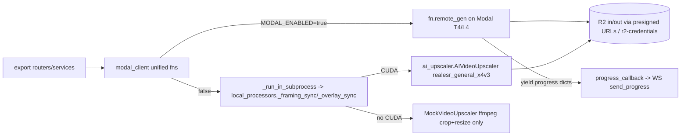

# Modal GPU / Local Render — Domain Knowledge

## Scope
- `src/backend/app/modal_functions/` — `video_processing.py` (2,930 L, the deployed app), `video_processing_optimized.py` (benchmark clone, NOT production), `deploy.py`
- `src/backend/app/services/modal_client.py` (unified dispatch), `local_processors.py` (MODAL_ENABLED=false engine), `processor_modal.py` / `processor_local.py` / `local_gpu_processor.py` / `video_processor.py` (factory layer, mostly bypassed), `modal_queue.py` (dormant), `progress_reporter.py`
- `src/backend/app/ai_upscaler/` — local Real-ESRGAN/RIFE package (`AIVideoUpscaler`, `KeyframeInterpolator`)
- Modal recovery surface in `src/backend/app/routers/exports.py` (shared with export-pipeline domain)

## Entry points
Always call the **unified interface** in `modal_client.py` (backend CLAUDE.md rule) — it routes Modal vs local internally:
- `call_modal_framing_ai` (`modal_client.py:489`) — single-clip framing+upscale. Caller: `export_helpers.py:227`.
- `call_modal_clips_ai` (`:784`) — multi-clip. Caller: `multi_clip.py:1316`. NO local fallback — raises if Modal disabled (local branch lives in `multi_clip.py:1463+` instead).
- `call_modal_overlay` (`:986`) / `call_modal_overlay_auto` (`:1200`, always sequential — parallel was 3-4x costlier, experiment E7). Callers: `export_worker.py:387`, `overlay.py:1867`.
- `call_modal_detect_players` (`:1252`) / `_batch` (`:1299`) — YOLO. Caller: `routers/detection.py`.

Deployed Modal app: `modal.App("reel-ballers-video-v2")` (`video_processing.py:27`); backend looks functions up lazily via `modal.Function.from_name(MODAL_APP_NAME, ...)` (`modal_client.py:330,359-470`). `@app.function`s (all use secret `modal.Secret.from_name("r2-credentials")`; no Volumes — weights baked into images):
| Function (decorator line) | GPU | Timeout | Role |
|---|---|---|---|
| `render_overlay` (:189) | T4 | 600 | highlight overlay render, generator |
| `detect_players_modal` (:797) / `_batch` (:913) | T4 | 120/300 | YOLO (`yolov8x.pt` baked into `yolo_image`) |
| `process_framing_ai` (:1150) | T4 | 1800 | sequential framing+upscale, generator |
| `process_framing_ai_l4` (:1628) | L4 | 1800 | 200-line benchmarking COPY, not wired into client (T4420 deletes) |
| `process_framing_ai_chunk` (:1840) | T4 | 900 | parallel chunk worker |
| `process_framing_ai_parallel` (:2043) | none (CPU orchestrator) | 3600 | fans out chunks |
| `process_clips_ai` (:2387) | T4 | 3600 | multi-clip framing+concat, generator |

## Data flow

- **Dispatch/monitoring:** Modal functions are Python generators; the backend iterates `fn.remote_gen(...)` in an executor and forwards each `{progress, phase, message}` yield to the async `progress_callback` (framing loop `modal_client.py:689-715`; clips `:897-943`; overlay `:1106-1131`).
  - There is **no webhook and no Modal→backend callback** — progress is consumed in-process, then pushed over the export WebSocket via `export_helpers.send_progress`.
  - `progress_reporter.py` is pure weighted-phase math (`DEFAULT_PHASE_WEIGHTS`, UPSCALING weight 0.50); it never talks to Modal.
- **Recovery:** `gen.object_id` is captured as `modal_call_id` and stored on `export_jobs` (`modal_client.py:875-880`; `multi_clip.py:1287-1298`; `export_helpers.store_modal_call_id:130`).
  - Mid-stream connection loss after job start → clips returns `{"status":"connection_lost","recoverable":True}` (`modal_client.py:908-914`).
  - Later, `GET /api/exports/{job_id}/modal-status` polls `modal.FunctionCall.from_id(call_id).get(timeout=0)` (`exports.py:843-847`; `TimeoutError` = still running) and finalizes via `finalize_modal_export` (`exports.py:191`).
  - `POST /api/exports/{job_id}/resume-progress` (`exports.py:1004`) simulates progress from elapsed time while polling Modal.
  - Job-level retry inside the client: 3 attempts, backoff 2.0, gated by `classify_modal_error` transient/deterministic (`modal_client.py:104-111,153`); user-facing error translation in `_translate_modal_error` (`:297`).
- **Modal↔R2:** Modal reads/writes R2 directly (`get_r2_client`, `video_processing.py:121`, env from the `r2-credentials` secret: `R2_ENDPOINT_URL`, `R2_ACCESS_KEY_ID`, `R2_SECRET_ACCESS_KEY`, `R2_BUCKET_NAME`). Paths are `{user_prefix}/{key}` — `_resolve_modal_user_id` (`modal_client.py:345`) converts user_id → R2 prefix before every dispatch.
- **Local path:** `_run_in_subprocess` (`modal_client.py:74`) runs `local_processors._framing_sync`/`_overlay_sync` in a `ProcessPoolExecutor(max_workers=2)`, progress bridged via a Manager queue (T2640: keeps ffmpeg/AI off the event loop).
  - `MockVideoUpscaler` (`local_processors.py:28`) is a drop-in for `AIVideoUpscaler` doing ffmpeg crop+resize only — pipeline verification without a GPU.

## Invariants & rules
1. **`MODAL_ENABLED` is the single master switch** (default false; `modal_client.py:327`). Auth via `MODAL_TOKEN_ID`/`MODAL_TOKEN_SECRET` (read by the Modal SDK, not app code). No `USE_MODAL`/`USE_GPU` vars exist. Local GPU-vs-mock is decided by `torch.cuda.is_available()` (`local_processors.py:137-159`; `multi_clip.py:1469-1492` — CUDA→real upscaler, no-CUDA+Modal-off→Mock "pipeline verify", no-CUDA expecting GPU→503).
2. **Always route through `modal_client`'s unified functions** — routers must not import Modal functions directly. The `ProcessorFactory`/`VideoProcessor` ABC layer exists but export paths bypass it; don't build new code on the factory.
3. **Deploys are manual and must be offered to the user** (backend CLAUDE.md): after editing anything in `app/modal_functions/`, ask, then run
   `cd src/backend && PYTHONUTF8=1 .venv/Scripts/python.exe -m modal deploy app/modal_functions/video_processing.py`.
   Deployed function set must stay in sync with the `modal.Function.from_name(MODAL_APP_NAME, ...)` lookups; renaming/adding a function without redeploy → `RuntimeError("Modal <fn> not available")` at dispatch. `deploy.py` is a Windows-Unicode-safe subprocess wrapper writing `deploy_result.txt`. Deploys do NOT ride the Fly deploy — they are a separate step.
4. **Weights bake into images at build** (no Modal Volumes). Four images in `video_processing.py`:
   - `image` (`:30`): debian_slim py3.11 + ffmpeg + boto3/opencv/numpy (overlay).
   - `yolo_image` (`:42`): + ultralytics/torch; pre-downloads `yolov8x.pt` (`:54-56`).
   - `upscale_image` (`:64`): pins `torch==2.1.0, torchvision==0.16.0, basicsr==1.4.2, realesrgan==0.3.0` (torchvision 0.17+ removed `functional_tensor` that basicsr imports, `:60-63`); pre-downloads `realesr-general-x4v3.pth` to `/root/.cache/realesrgan/weights/` (`:78-82`).
   - `_optimized.py` has its own image (benchmark only).
5. **GPU selection:** `get_framing_ai_gpu_config(duration)` (`modal_client.py:412`): <3s→1 GPU, <10s→2, else 4; parallel only when `num_chunks>1 and segment_data is None` (`:620`). Everything production runs on T4.
6. **Production upscale pipeline (ground truth, verified 2026-07-03** — `docs/plans/tasks/upscale-quality/EPIC.md`): `SRVGGNetCompact` compact model via `RealESRGANer(scale=4, tile=0, half=True, dni_weight=None)` (`_get_realesrgan_model`, `video_processing.py:1076-1112`) → crop (Catmull-Rom `_interpolate_crop:1117`) → enhance 4x → Lanczos resize to target. T4 ≈ 1.47 fps; 10s clip ≈ $0.03. Do NOT confuse with `app/ai_upscaler/` (local path + SwinIR/HAT backends, not the prod hot path).

## Landmines & history
- **Crop-interpolation math exists 4×** (audit E4 / T4420): canonical `app/interpolation.py`, `ai_upscaler/keyframe_interpolator.py`, `video_processing.py:586-1156`, `_optimized.py`. Divergence = local vs Modal exports crop differently. Fixture parity FIRST when consolidating.
- **`video_processing_optimized.py`** is a separate benchmark app (`reel-ballers-video-optimized`) with 8 T4/L4 variants — never called by the client; T4420 deletes it. `process_framing_ai_l4` is likewise an unwired copy.
- **`deploy_result.txt` is stale** (old app name `reel-ballers-video`, old function list); the `local_entrypoint` example at `video_processing.py:2929` also prints the old name. Don't trust either as deploy ground truth.
- ~~**T4240 recovery-bug quartet** (FIXED 2026-07-11):~~ `exports.py:279` NameError was T4790 (fixed 2026-07-10). The remaining three T4240 bugs are now fixed: `check_modal_job_running` returns None on lookup error instead of treating it as "not running" (cleanup skips unknown-status jobs, no longer kills live paid jobs); fabricated `recovered_{job_id}.mp4` filename when `output_key` missing replaced with a loud failure and no DB row; `export_worker.py` except block narrowed so try-scoped vars are always in scope. Regression tests: `test_t4240_export_recovery.py`.
- **Two `LocalGPUProcessor` classes both register `ProcessingBackend.LOCAL_GPU`** (`processor_local.py:332` CUDA-required vs `local_gpu_processor.py:379` ffmpeg-only) — last import wins the factory slot. Another reason not to use the factory.
- **`modal_queue.py` has ZERO registered task types** — `_process_single_task` always fails "Unknown task type" (`modal_queue.py:106-108`); retained scaffolding (clip extraction removed T740/T800). Startup recovery is per-user-first-request (`main.py:344-351` defers; `session_init.py:255-301` runs `recover_orphaned_jobs` + `process_modal_queue`), NOT at boot.
- **Encode drift** (T4430/T4710):
  - Modal final encode is `libx264 -crf 23 -preset fast` while parallel chunks are crf 18 — last step is the lowest quality.
  - Modal path missing bt709 color tags (local `video_encoder.py:789-792` sets them; some players render washed out).
  - `-shortest` truncation fix applied in one path, still passed in others (`overlay.py:707`, `processor_local.py:252` per audit E3); ~55 hand-built ffmpeg arg lists across 13 modules.
  - `dni_weight` denoise blend (`realesr-general-wdn-x4v3` companion) is unused while far crops carry block noise the GAN sharpens.
- **Local torch import is optional/guarded** (`ai_upscaler/__init__.py:16-19`) so CPU containers can still import the torch-free `KeyframeInterpolator` needed by the overlay renderer (T4120).
- Containers (/dotask) run Modal OFF by default (T4180); `MODAL_ENABLED=false` local-render verify mode is the sanctioned in-container way to exercise exports (T4120).

## Testing seams
- `call_modal_framing_ai(test_mode=True)` → `local_processors.local_framing_mock` (`modal_client.py:541`, `local_processors.py:737`) — no GPU, no Modal, no render.
- `MODAL_ENABLED=false` + no CUDA → `MockVideoUpscaler` end-to-end pipeline verification (T4120 recipe); /dotask containers have Modal off by default and optional token provisioning (T4180).
- Cost/perf anchors (E6 benchmark): T4 ≈ 681 ms/frame; 10s clip @30fps ≈ 204 GPU-s ≈ $0.03; Modal jobs can run 40+ min (hence the 60-min stale threshold in `cleanup_stale_exports`).

## Active/upcoming work
- **T3950** (TODO): "Made with Reel Ballers" branded outro (~1.5-2s), render-time FFmpeg concat in `video_processing.py` — both single-clip and multi-clip/collection paths, per aspect ratio (9:16/1:1/16:9), exactly once (no double-outro on re-export), behind a single flag for future paid removal. No persistence writes.
- ~~**T4240**~~ DONE 2026-07-11 (all four recovery bugs fixed — see Landmines above).
- **T4420** (TODO, depends on T4370 harness): one interpolation module packaged into the Modal image; GPU-param on `process_framing_ai` (kills the L4 copy); delete `_optimized.py`. Requires Modal redeploy (ask user).
- **T4430** (TODO, depends on T4370): named encode profiles + single ffprobe.
- **Upscale Quality epic** (`docs/plans/tasks/upscale-quality/EPIC.md`, strict order): T4700 SR testbed (`src/backend/experiments/sr_testbed/`, prime directive: no quality change ships without a testbed run) → T4710 encode/denoise quick wins (crf, bt709, `dni_weight`) → T4720 GAN A/B → T4730 temporal VSR prototype (FlashVSR/SeedVR2, L40S) → T4740 prod integration with crop-size routing → T4750 fine-tune.
- **T2650** (TODO): move sweep auto-export compute from Fly to Modal.
- Historical: T2480 shipped Catmull-Rom spline crop interpolation on the Modal side (matching frontend curves) — the origin of today's duplicated spline copies; T50/T51 were the original Modal cost/parallelization analyses (parallel overlay rejected as 3-4x costlier, E7).
- Related DONE infra: T1200 (Modal job-id logging + retry), T1520 (disconnect/retry UX reconciling with Modal job state), T2450-T2470 (auto-export reliability: presigned URLs to FFmpeg, pending-status recovery, sweep keepalive).
