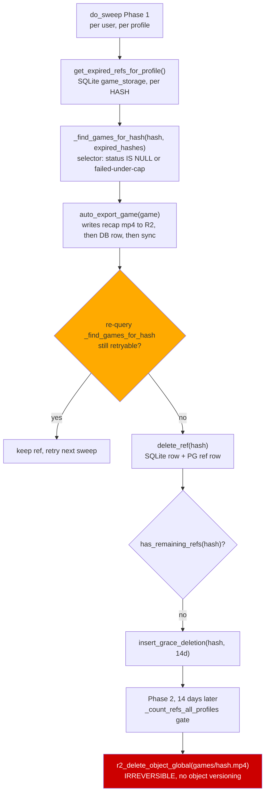
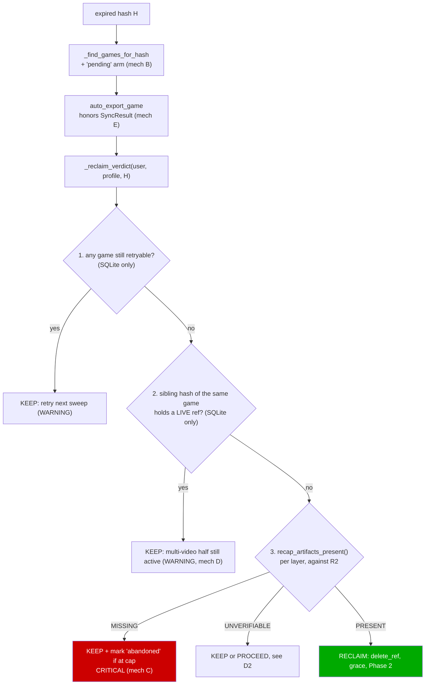

# T10121 Design: the storage-reclaim sweep must never destroy footage it cannot prove is preserved

**Task file:** [T10121-reclaim-sweep-can-permanently-destroy-unrecapped-footage.md](T10121-reclaim-sweep-can-permanently-destroy-unrecapped-footage.md)
**Status:** APPROVED (2026-09-14) — all 7 decisions (D1-D7) approved as recommended
**Written:** 2026-09-14
**Tier:** L (design-gated: irreversible deletion, no R2 versioning, no recovery path)
**Layers:** Backend only. ~3 source files, ~250 LOC, ~10 curated backend tests.
**Knowledge docs:** `.claude/knowledge/backend-services.md`, `.claude/knowledge/persistence-sync.md`,
`.claude/knowledge/export-pipeline.md`

> This document is the approval gate. Nothing is implemented until the user approves it.
> Section 2.4 holds **seven numbered decisions**. Five of them change or extend what the task
> file's expert-authored fix design says, based on what the current code actually does.
> Those are the rows that need a yes or no.

---

## 0. Verification of the task file's five fix points against current master

The task file's fix design was written this morning by the expert agent. Every point was re-checked
against the checkout at `7ceb5fbf`. Three hold as written, two need correction, and three new
findings change the shape of the work.

| # | Fix point | Verdict | Evidence |
|---|---|---|---|
| 1 | `needs_export` selector does not match `pending` | **CONFIRMED as written** | `sweep_scheduler.py:374-377`: the predicate is `auto_export_status IS NULL OR (auto_export_status = 'failed' AND attempts < ?)`. No `pending` branch. `auto_export.py:93-94` does tolerate re-entry, so only the selector is missing. |
| 2 | `auto_export_status` has no CHECK constraint | **CONFIRMED. No migration needed.** | `database.py:1378` declares it as bare `auto_export_status TEXT` inside the `games` DDL (`:1359-1384`). Zero `CHECK (` occurrences anywhere in `app/migrations/profile_db/`. No profile_db migration rebuilds the `games` table. Exact precedent: T7490 added `GameStatus.UPLOAD_FAILED` to the equally unconstrained `games.status` with no migration. **The Migration agent is NOT required for this task.** |
| 3 | `_recap_artifacts_complete` shape; does `recap_r2_keys` exist | **`recap_r2_keys` ALREADY EXISTS**, `auto_export.py:199-210`, returning `(recap_key, mapping_key)` relative keys. Nothing new to write there. But the gate as specified has a **false-positive class** the brief missed: pre-T5710 legacy mixed recaps. See D3. | `recap_r2_keys(game_id, TEAM)` is `recaps/{id}_team.mp4`; athlete/None is the unsuffixed `recaps/{id}.mp4`, which is ALSO the legacy mixed key. A game exported before T5710 (2026-08-01) has team clips and no `_team.mp4`, so the literal gate would refuse its reclaim forever. |
| 4 | Multi-video partial expiry: refusal condition | **CONFIRMED live, but the brief's refusal condition as literally stated would strand refs forever.** | `get_expired_refs_for_profile` (`auth_db.py:485`) returns per-hash rows from `game_storage`; `_find_games_for_hash`'s all-hashes filter (`sweep_scheduler.py:397-405`) excludes the game; the post-export re-check at `:178` then returns empty and `delete_ref` at `:185` runs on the expired half. Real. But "refuse when a sibling hash has not expired" must be phrased as "a sibling hash has a **LIVE (future-expiry) `game_storage` row**", not "is absent from `expired_hashes`": a sibling already reclaimed in an earlier sweep has NO row at all, is therefore also absent from `expired_hashes`, and the naive phrasing would block that hash's reclaim permanently. See D4. |
| 5 | Honoring `SyncResult` needs only a return-value check at 3 call sites | **PARTLY WRONG.** Checking the value at `auto_export.py:110,152,160` is necessary but NOT sufficient: the sweep's keep-or-reclaim decision is re-derived from the DATABASE at `sweep_scheduler.py:178`, not from `auto_export_game`'s return value. A returned "unsettled" status is currently discarded by `do_sweep` (it is only logged, `:170`). Honoring the sync result therefore requires `do_sweep` to fold the returned statuses into its decision. See §2.3 and D6. | `sweep_scheduler.py:169-183`. |

**Two corrections to the task file's mechanism descriptions** (worth fixing in the record, they
change nothing about the fix but they change how the fix is tested):

- **Mechanism E's stated mechanism is stale.** The task file says "on CONFLICT, `storage.py`
  replaces the local DB with R2's newer copy". T4310 reviewer round 2 removed that re-download
  (`database.py:2002-2024`): the conflicting upload is refused, the baseline is frozen, a conflict
  marker is written and `schedule_profile_db_reheal` (`database.py:873-892`) invalidates the cached
  version so the NEXT `ensure_database` re-pulls. The refused edit is then DISCARDED by that re-pull
  (T6160 decision 2, stated in the docstring). So the `complete` row is still lost, just at the next
  profile load rather than inside the sync call. The damaging window is real and larger than the
  brief implies: **inside the same sweep pass**, `_find_games_for_hash` re-reads the LOCAL DB, sees
  `complete`, judges the game settled, and deletes the ref, on the strength of a row that is
  guaranteed to be thrown away.
- **`file_exists_in_r2` cannot express "I could not check".** `storage.py:923-938` returns `False`
  when `get_r2_client()` is None AND swallows every exception into `False`. "Absent" and
  "unreachable" and "unconfigured" are one value. Using it raw as the artifact gate means the gate
  refuses every reclaim in any environment without R2 credentials, which is exactly how the existing
  sweep test suite runs (`test_sweep_scheduler.py:92` patches `R2_ENABLED=False` and there is no R2
  client). See D2.

**Third new finding, in scope:** grace rows queued by these bugs are **already sitting in Postgres
today**. Gating only Phase 1 leaves them to be executed, irreversibly, by the first sweep after
deploy. See D5.

---

## 1. Current state analysis

### 1.1 The reclaim path as it exists



The single decision that guards an irreversible delete is node **E**, and it asks one question:
*is any game on this hash still in the retry selector?* Every mechanism in this task is a way for
that question to answer "no" while the footage is in fact unpreserved.

### 1.2 Code smells

| Smell | Location | Impact |
|---|---|---|
| A safety gate asks a proxy question instead of the real one | `sweep_scheduler.py:178` | "no game is still retryable" is used as a stand-in for "the recap exists". Every one of B, C, D, E is a case where the proxy and the truth disagree |
| Status vocabulary duplicated as bare literals across two modules | `'pending'`/`'failed'`/`'complete'`/`'skipped'` in `auto_export.py:89,93,98,109,147,159` and in SQL text at `sweep_scheduler.py:375-377` | The `pending` hole is exactly a vocabulary drift: one module writes a value the other module's selector never mentions |
| Return value discarded at a durability boundary | `auto_export.py:110,152,160` | A 3-state `SyncResult` (`database.py:494-508`) reduced to nothing. Every other caller in the codebase checks it (`migrations/__init__.py:213`, `profiles.py:216`, `export_helpers.py:429`) |
| Result of the unit of work discarded by its caller | `sweep_scheduler.py:169-170` | `status = auto_export_game(...)` is logged and never used; the decision is re-derived from the DB |
| Exhaustion is indistinguishable from success in the logs | `auto_export.py:157-161` (one `error`), `sweep_scheduler.py:170` (INFO) | Permanent data destruction emits no CRITICAL, no metric, no user-visible state |
| Tri-state collapsed into a boolean | `storage.py:923-938` `file_exists_in_r2` | absent / unreachable / unconfigured are one `False`. Building a delete gate on it is building on a silent fallback |
| Test pins the wrong half of the invariant | `test_sweep_scheduler.py:196` `test_multi_video_partially_expired_excluded` | Asserts the game is excluded from EXPORT, never asserts the ref survives. The exclusion it pins is the very thing that lets the ref be deleted |

### 1.3 Current behavior, pseudo code

```pseudo
for each expired hash H in this profile:
    games = select games on H where status IS NULL or (status='failed' and attempts<3)
    // 'pending' matches NEITHER arm                                   <-- mechanism B
    // a multi-video game whose sibling is still live is filtered out  <-- mechanism D
    // a game at attempts==3 matches NEITHER arm                       <-- mechanism C
    for g in games: auto_export_game(g)
        // writes recap to R2, then DB row, then sync_db_to_r2_explicit(...)
        // return value discarded; a CONFLICT means the DB row will be
        // thrown away at the next ensure_database                     <-- mechanism E

    if select-again(games) is empty:        // "settled"
        delete_ref(H)                       // and 14 days later, the pixels
```

Every one of B, C, D, E reaches the same line: `delete_ref` runs while no recap exists.

---

## 2. Target architecture

### 2.1 Design principles applied

- **One gate, asked of R2, not of a status column.** The reclaim decision becomes a single predicate
  function with a named verdict. The four mechanisms stop being four bugs with four patches and
  become four inputs to one question: *may this hash be reclaimed?*
- **Fail loud, never self-repair.** A gate that cannot prove preservation refuses and escalates.
  It does not stitch a missing recap on the fly (that would be the sweep quietly fixing a bug the
  sweep caused), and it does not delete on incomplete information.
- **Reuse the precedent already in this file.** `_count_refs_all_profiles`
  (`sweep_scheduler.py:265-320`) already implements "indeterminate means do not delete", with an
  explicit `authoritative` flag. The new gate copies that shape rather than inventing a second one.
- **Each module keeps its own job.** `auto_export.py` owns *what artifacts an export must produce*
  (it already owns `recap_r2_keys`, `_get_annotated_clips`, `load_recap_mapping`).
  `sweep_scheduler.py` owns *when a hash may be reclaimed*. The new artifact predicate lives in
  `auto_export.py`; the new verdict lives in `sweep_scheduler.py`.
- **No new abstraction beyond those two functions.** No status enum, no registry, no strategy
  object (see D7).

### 2.2 Target diagram



The three checks are ordered cheapest-first on purpose: two SQLite reads before any R2 HEAD, so the
common "still retryable" and "sibling live" cases cost zero network calls.

### 2.3 Target behavior, pseudo code

```pseudo
# auto_export.py  (owns "what an export must have produced")

enum ArtifactVerdict: PRESENT | MISSING | UNVERIFIABLE

def recap_artifacts_present(user_id, game_id) -> ArtifactVerdict:
    if get_r2_client() is None: return UNVERIFIABLE        # cannot check, do not guess
    for layer in (TEAM, ATHLETE):
        if not _get_annotated_clips(game_id, layer): continue    # empty layer needs no recap
        key, _ = recap_r2_keys(game_id, layer)
        if file_exists_in_r2(user_id, key): continue
        if layer is TEAM and _legacy_mixed_recap_covers(user_id, game_id): continue   # D3
        return MISSING
    return PRESENT                 # zero rated clips passes trivially (the 'skipped' case)

def _legacy_mixed_recap_covers(user_id, game_id) -> bool:
    # a pre-T5710 mixed recap holds BOTH layers' clips; mirrors ensure_recap's
    # legacy-slice branch (auto_export.py:739-741): unstamped mapping == legacy mixed
    layer, entries = load_recap_mapping(user_id, f"recaps/{game_id}_clips.json")
    return layer is None and entries and file_exists_in_r2(user_id, f"recaps/{game_id}.mp4")


# auto_export.py  (mechanism E: a write is not durable until R2 confirms it)

  ... UPDATE games SET auto_export_status='complete', recap_video_url=? ...
+ if not sync_db_to_r2_explicit(user_id, profile_id):
+     logger.critical("[AutoExport] game=... recap uploaded but the DB write was NOT "
+                     "confirmed to R2 (result=...); refusing to report settled")
+     return 'unsynced'                     # a non-settled status, see D6
  return 'complete'


# sweep_scheduler.py  (owns "when a hash may be reclaimed")

def _reclaim_verdict(user_id, profile_id, hash, expired_hashes, export_statuses) -> Verdict:
    if _find_games_for_hash(...):                       return KEEP_RETRYABLE
    if any(status not settled for status in export_statuses):  return KEEP_UNSYNCED      # D6
    if _has_live_sibling_hash(hash):                    return KEEP_SIBLING_LIVE         # D4
    for game_id in _games_using_hash(hash):             # ALL games, not just needing export
        v = recap_artifacts_present(user_id, game_id)
        if v is MISSING:      return KEEP_ARTIFACTS_MISSING(game_id)
        if v is UNVERIFIABLE: return KEEP_UNVERIFIABLE or RECLAIM       # D2
    return RECLAIM

# in do_sweep, replacing the bare re-check at :178-185
verdict = _reclaim_verdict(...)
if verdict is KEEP_ARTIFACTS_MISSING:
    _abandon_if_exhausted(game_id)     # terminal status + CRITICAL, keeps the ref
if verdict is not RECLAIM:
    log(verdict.level, verdict.reason); continue
delete_ref(user_id, profile_id, hash)
```

`_abandon_if_exhausted` writes `auto_export_status='abandoned'` only when
`auto_export_attempts >= MAX_AUTO_EXPORT_ATTEMPTS` and the status is not already terminal, emits ONE
CRITICAL carrying `user_id`/`profile_id`/`game_id`/`attempts`/`clip_count`, then syncs the profile DB
and honors that sync result too. Because `'abandoned'` matches neither arm of the `needs_export`
selector, the game stops being retried, and because the gate keeps refusing, the ref is kept forever
until an admin intervenes. That is the intended trade: **storage cost is recoverable, footage is not.**

### 2.4 The seven decisions

---

**D1. The gate verifies R2 artifacts, not the status column. Recommend: YES (adopt as specified).**

This is the core of the expert's design and it survives verification. The status column is exactly
what mechanisms B, C, and E corrupt, so a gate reading it is a gate reading the bug. `recap_r2_keys`
and `_get_annotated_clips` already exist, so the gate is ~25 lines. The cost is 1 to 2 R2 HEAD calls
per game per expired hash, on a path that already runs ffmpeg encodes.

*If rejected:* the only alternative that still closes B, C, D, E is "never reclaim unless
`auto_export_status='complete'`", which trusts a column that a CAS conflict can silently revert and
which does not distinguish "complete" from "complete but three clips failed to encode"
(`auto_export.py:122-123` swallows per-clip failures). Not recommended.

---

**D2. What the gate does when R2 cannot be reached or is not configured.**

`file_exists_in_r2` returns `False` for "absent", for "HEAD threw", and for "no R2 client at all"
(`storage.py:923-938`). The third case is how the entire existing sweep test suite runs
(`test_sweep_scheduler.py:92`). Three options:

| Option | Behavior when `get_r2_client()` is None | Consequence |
|---|---|---|
| **A (recommended)** | Gate returns `UNVERIFIABLE` and the sweep **proceeds** to reclaim, logging a WARNING once per sweep | Matches the existing precedent at `games.py:943` (`if get_r2_client() and not r2_head_object_global(...)`, commented "When R2 is not configured (local dev / tests), skip the check"). Existing tests keep passing unchanged. Production ALWAYS has a client, so the real gate is never bypassed there |
| B | `UNVERIFIABLE` blocks reclaim | Safest on paper, but it changes dev/test sweep behavior, breaks three existing tests that assert `delete_ref` is called, and buys nothing in production |
| C | Raise on a missing client | Turns a dev-environment condition into a sweep-wide failure |

A HEAD that **throws** (client present, R2 unreachable) is a different case and is treated as
`MISSING` under all three options: refuse, and retry next sweep. That is the conservative direction
and it costs nothing, since the ref simply survives one more cycle.

*Recommend A.* It keeps "no silent fallback" where it matters (a configured R2 that says "absent"
is believed) and applies the sanctioned external-dependency exemption only to "the dependency is
not configured at all", with the existing in-repo precedent.

---

**D3. A pre-T5710 legacy mixed recap satisfies the team layer. Recommend: YES.**

The brief's gate would, for any game exported before T5710 (2026-08-01) that has team clips, look
for `recaps/{id}_team.mp4`, not find it, and refuse the reclaim permanently, even though the footage
IS preserved inside the legacy mixed `recaps/{id}.mp4`. T5710 shipped this exact fallback in
`ensure_recap` (`auto_export.py:738-753`): when the game source is gone it slices the layer out of
the surviving legacy recap. `export-pipeline.md:831` records that legacy combined recaps are a live,
honestly-labelled state in the UI (`recap_legacy_combined`).

So the gate's team-layer requirement becomes: `_team.mp4` exists, OR the unsuffixed recap exists and
its mapping is **unstamped** (a bare list, which by `load_recap_mapping`'s contract means legacy
mixed, containing both layers). The athlete layer needs no such branch: its key IS the legacy key.

The population affected is small (a `complete` game that still holds a live ref means the user
extended storage after export) but non-zero, and the failure mode is a permanently un-reclaimable
ref with a CRITICAL log every sweep. The extra cost is one small JSON GET, only on the
team-recap-missing path.

*If rejected:* those games are refused and logged; nothing is destroyed, and an admin resolves them
by hand. Safe but noisy.

---

**D4. Multi-video refusal keys off a LIVE sibling ref, not off absence from `expired_hashes`.
Recommend: YES.**

Stated as "refuse when the game's other hashes have not expired yet", the rule silently covers a
second case: a sibling that has NO `game_storage` row at all (already reclaimed in a previous sweep,
or never reffed) is also "not in `expired_hashes`", so the rule would refuse that hash's reclaim
forever, leaking storage with no path out.

The precise condition, reusing `count_refs_in_profile` (`auth_db.py:521`, already written and already
conservative about unparseable expiries):

```pseudo
def _has_live_sibling_hash(hash) -> bool:
    for game_id in _games_using_hash(hash):
        for sibling in game_videos(game_id) where sibling != hash:
            total, live = count_refs_in_profile(sibling)
            if live > 0: return True        # the game is still active through its other half
    return False
```

Note this check is **partly redundant with D1**: a multi-video game with rated clips and no recap is
already refused by the artifact gate. It is still required, because a multi-video game with ZERO
rated clips passes the artifact gate trivially, and reclaiming half its footage while the user is
still actively using the other half is the user-visible harm this mechanism describes. Keeping the
rule explicit also makes the invariant greppable instead of emergent.

*If rejected:* D1 alone covers every multi-video game that has annotations. Unannotated multi-video
games can still lose one half early. Cheapest row to drop, and the only one whose omission is not a
data-loss risk for annotated content.

---

**D5. Gate Phase 2 as well, not only Phase 1. Recommend: YES.**

Phase 1's gate stops NEW grace rows from being queued. It does nothing about grace rows **queued
before this fix ships**, which are sitting in `r2_grace_deletions` right now, put there by exactly
these bugs, and which the first post-deploy sweep will execute irreversibly.

Phase 2 already walks every profile (`_count_refs_all_profiles`, `sweep_scheduler.py:265`), so the
artifact check slots into a walk that exists. After `delete_ref` the profile no longer holds a
`game_storage` row for the hash, but `games`/`game_videos` still reference it, so
`_games_using_hash` still finds the games and the gate still works.

Cost: for each grace-expired hash, up to 2 R2 HEADs per game per profile. Phase 2 handles a handful
of hashes per sweep, so this is bounded and rare. Behavior on refusal mirrors the existing DEFER
branch (`:240-244`): leave the grace row queued, log, re-evaluate next sweep. That means a genuinely
damaged hash never reclaims, which is the correct direction and is visible in the logs.

*If rejected:* the fix has a one-time blind spot exactly equal to the backlog the bugs created, and
that backlog is the reason this task exists. If the user wants Phase 1 only, the mitigation must be
a manual audit of `r2_grace_deletions` before deploy, which is strictly more work than the gate.

---

**D6. What `auto_export_game` returns when its `complete` write did not sync, and how the sweep uses
it.**

The task file says "return a non-settled status so the sweep keeps the ref". The sweep does not
currently use the return value at all (`sweep_scheduler.py:169-170` logs it and re-derives the
decision from the DB), and the DB at that moment says `complete`, because the local write succeeded
and only the upload was refused. So a returned status alone changes nothing. Options:

| Option | Shape | Notes |
|---|---|---|
| **A (recommended)** | `auto_export_game` returns a new status `'unsynced'`; `do_sweep` collects the per-game statuses it already receives and treats any non-settled status as KEEP | Small, explicit, no DB write. The status string is a return value only and is never persisted, so no new column value and no vocabulary drift into SQL |
| B | Write `auto_export_status='failed'` on sync failure | Destroys the locally-correct record of a successful export, and burns a retry attempt for something that was not an export failure. Rejected |
| C | Rely on D1's artifact gate | The recap IS in R2 (uploaded at `auto_export.py:577` before the DB write), so the gate PASSES and the ref is deleted. The pixels survive and T10120's per-layer read makes the recap reachable, but the reclaim decision was still made on a row known to be discarded. Rejected as a standalone answer, though it does explain why mechanism E is the least damaging of the four |

Also covered by option A: the two other discarded syncs (`auto_export.py:110` on the `skipped` path,
`:160` on the `failed` path), plus the new sync after the `'abandoned'` write. All four log at
CRITICAL on a non-OK result, matching the CAS handling CLAUDE.md mandates: freeze, log CRITICAL,
never blind-retry, never auto-merge.

*Recommend A.*

---

**D7. Three smaller calls, bundled. Recommend the defaults unless the user objects.**

| Question | Options | Recommended |
|---|---|---|
| Introduce an `AutoExportStatus` enum in `constants.py` for the 5 status literals? | enum now / literals + one docstring | **Literals.** Refactoring rule 3 (moves never mix with behavior change) and rule 6 (greppability beats elegance). The vocabulary gets ONE authoritative comment next to `MAX_AUTO_EXPORT_ATTEMPTS` (`auto_export.py:44-47`) listing all five values and which are terminal. An enum is a fine follow-up, as a mechanical commit of its own |
| Reset `auto_export_attempts` for games currently stuck at `pending`, so they get fresh retries after the selector fix? | one-time migration / no reset | **No reset.** A crash-consumed attempt is not reliably distinguishable from a real failure, and since the fix now KEEPS the source for such games, nothing is lost by requiring an explicit re-drive. No data rewrite, no migration, keeps this task schema-free |
| Alerting cadence for a stuck game: CRITICAL every sweep, or once? | every sweep / once at the transition | **CRITICAL once, at the transition into `'abandoned'`; WARNING on every subsequent refusal.** The transition is the event; repeating CRITICAL daily forever trains the reader to ignore it. The recurring WARNING keeps the condition visible without becoming noise |

---

## 3. Change plan

Line numbers verified against `7ceb5fbf` (2026-09-14).

### 3.1 `src/backend/app/services/auto_export.py`

| Location | Change |
|---|---|
| `:44-47` | Extend the `MAX_AUTO_EXPORT_ATTEMPTS` comment into the single authoritative note on the status vocabulary: `pending` / `failed` (retryable under cap) / `complete` / `skipped` / `abandoned` (terminal), and which the sweep selector matches (D7) |
| after `:210` (`recap_r2_keys`) | `+ class ArtifactVerdict(str, Enum): PRESENT / MISSING / UNVERIFIABLE`; `+ def recap_artifacts_present(user_id, game_id) -> ArtifactVerdict` (D1, D2); `+ def _legacy_mixed_recap_covers(user_id, game_id) -> bool` (D3) |
| `:109-112` (`skipped` path) | check the sync result; CRITICAL and return `'unsynced'` on non-OK (D6) |
| `:144-155` (`complete` path) | same, after the `complete` + `recap_video_url` write. This is the one that matters (mechanism E) |
| `:157-161` (`failed` path) | same, on the `failed` status write |
| docstring `:66-70` | document the new `'unsynced'` return value and that it is a RETURN value only, never persisted |

### 3.2 `src/backend/app/services/sweep_scheduler.py`

| Location | Change |
|---|---|
| `:374-377` `needs_export` | `+ auto_export_status = 'pending' AND attempts < ?` as a third arm, under the same cap (mechanism B). The SQL takes a second `MAX_AUTO_EXPORT_ATTEMPTS` parameter at both call sites (`:386`, `:394`) |
| new, near `_find_games_for_hash` | `+ def _games_using_hash(hash) -> set[int]`: ALL games on the hash regardless of export status (single via `games.blake3_hash`, multi via `game_videos`). The existing selector cannot be reused: it deliberately excludes settled games, and the gate must inspect exactly those |
| new | `+ def _has_live_sibling_hash(hash) -> bool` using `count_refs_in_profile` (D4) |
| new | `+ def _reclaim_verdict(...) -> ReclaimVerdict` with named outcomes (`RECLAIM`, `KEEP_RETRYABLE`, `KEEP_UNSYNCED`, `KEEP_SIBLING_LIVE`, `KEEP_ARTIFACTS_MISSING`, `KEEP_UNVERIFIABLE`), ordered SQLite-first then R2 |
| new | `+ def _abandon_if_exhausted(user_id, profile_id, game_id)`: writes `'abandoned'` when `attempts >= MAX` and the status is not already terminal, ONE CRITICAL with the full identifying payload, then `sync_db_to_r2_explicit` with its result honored (D7 cadence) |
| `:167-185` | collect `auto_export_game`'s returned statuses (they are currently only logged) and replace the bare re-check with `_reclaim_verdict`. The existing WARNING at `:179-182` becomes the `KEEP_RETRYABLE` branch, wording preserved |
| `:210-259` Phase 2 | insert the artifact gate before `r2_delete_object_global`, reusing the existing DEFER shape at `:240-244` (log, leave the grace row queued, continue) (D5) |

### 3.3 No other files

- **No migration, no schema change.** `auto_export_status` is unconstrained TEXT (§0 point 2).
  The Migration agent is not in this task's pipeline.
- **No frontend change.** Zero frontend references to `auto_export_status` (grepped). The API still
  returns it (`games.py:1565`) and `_compute_storage_status` (`games.py:2462`) only tests it for
  truthiness, so `'abandoned'` needs no handling there. An abandoned game keeps its (past-dated)
  `game_storage` row, so it reads as `'expired'` in the UI, which is honest: the user cannot rely on
  that source, even though the bytes are still there.
- **T10130 (expiry-banner reassurance copy) stays blocked on this task**, and its copy should be
  written against the post-fix guarantee: "we keep your source until the highlights are safely
  saved", never "your footage is always recoverable".

---

## 4. Design decisions summary

| Decision | Options considered | Choice | Rationale |
|---|---|---|---|
| What the delete gate reads | status column / R2 artifacts | R2 artifacts (**D1**) | The status column is what three of the four mechanisms corrupt |
| Where the artifact predicate lives | `sweep_scheduler` / `auto_export` / new module | `auto_export` | It already owns `recap_r2_keys`, `_get_annotated_clips`, `load_recap_mapping`. The sweep keeps the policy, auto-export keeps the artifact model |
| Missing-artifact response | stitch the recap on the fly via `ensure_recap` / refuse and escalate | refuse and escalate | Stitching inside the delete gate is the sweep silently repairing its own bug, which CLAUDE.md bans outright. `ensure_recap` stays a gesture-driven and admin-driven entry point |
| Unconfigured R2 | refuse all / proceed with a warning / raise | proceed with a warning (**D2**) | Precedent `games.py:943`; production always has a client; keeps the existing suite honest rather than rewriting three tests to accommodate a dev-only condition |
| Unreachable R2 (HEAD throws) | treat as absent / as present | as absent (refuse) | The safe direction, and it costs only one extra sweep cycle |
| Legacy mixed recap | ignore / accept for the team layer (**D3**) | accept | It genuinely contains both layers; T5710 already slices layers out of it |
| Multi-video refusal key | absent from `expired_hashes` / live sibling ref (**D4**) | live sibling ref | The literal phrasing strands already-reclaimed siblings forever |
| Phase 2 | leave as is / add the same gate (**D5**) | add the gate | The pre-existing grace backlog is the highest-probability real loss in the next 14 days |
| Unconfirmed sync | ignore / mark failed / new return status (**D6**) | new return status | Does not corrupt the locally-correct row, does not burn a retry, and is the only option the sweep can actually act on |
| Terminal state | unbounded retries / delete anyway / `'abandoned'` + keep ref | `'abandoned'` + keep ref | The expert's reasoning stands: unbounded retries burn every sweep forever with no signal; deleting anyway is the bug |
| Status vocabulary | new enum / literals + one comment (**D7**) | literals | Refactoring rules 3 and 6; an enum is a clean mechanical follow-up |

---

## 5. Risks

| Risk | Mitigation |
|---|---|
| **The gate refuses reclaims that used to succeed, so storage cost stops falling** and nobody notices | Every refusal logs with its reason and the game id. The `'abandoned'` transition logs CRITICAL. Step 8 of the task (a read-only inventory of abandoned-shaped games on prod) becomes the sizing measurement, run BEFORE deploy so the post-deploy log volume is expected rather than alarming |
| **A game whose rated clips ALL have invalid ranges can never satisfy the gate.** `_generate_recap` raises "No clips extracted" (`auto_export.py:526-528`) when every clip is skipped for an inverted or missing range, so the export fails forever and the gate refuses forever | This is the correct outcome (do not delete footage we cannot preserve), and it now terminates loudly at `'abandoned'` instead of silently deleting. Called out here so the first CRITICAL of this shape is diagnosed, not treated as a gate bug |
| **Existing sweep tests assert `delete_ref` is called under `R2_ENABLED=False`** (`test_sweep_scheduler.py:270,298,379`) | D2 option A keeps them green unchanged. If the user picks D2 option B instead, those three tests must be updated to stub the gate, and that must be stated in the approval so it is not mistaken for a regression |
| **Extra R2 HEADs on the sweep path** | 1 to 2 per game per expired hash, ordered after two SQLite checks that short-circuit the common cases. The same loop already runs ffmpeg encodes per clip. The sweep is off the request path entirely (`asyncio.to_thread`, `sweep_scheduler.py:100`) |
| **Concurrent sweeps across Fly machines** (no leader election, `main.py:564-566`) could both evaluate the same hash | Unchanged by this task, and the fix is strictly safer under concurrency: every new outcome is "keep", and `delete_ref` is already idempotent (T6770, pinned by `TestDeleteRefIdempotency`). Worth recording as a known non-goal rather than silently assuming single-writer |
| **`'abandoned'` games have no re-drive path.** No admin endpoint re-runs auto-export for one game; `backfill_hiq_recaps` only touches `complete` games | Nothing is lost without one (the source is kept), so this is a follow-up, not a blocker. Recommend filing "admin re-drive for abandoned auto-exports" after approval. Until it exists, the recovery procedure is documented in the CRITICAL log message itself |
| **The task's own Step 8 (prod remediation) touches live user data** | Read-only inventory first, reported to the user, no writes without explicit scope confirmation per the Data Safety Rules. Nothing in this design writes to prod outside the sweep's normal operation |

---

## 6. Test plan, curated relevant set (~10 backend tests)

`src/backend/tests/test_sweep_scheduler.py` (the file that owns this corner):

1. a `pending` game under the cap IS re-selected by `_find_games_for_hash` (mechanism B, red before the fix)
2. a `pending` game AT the cap is NOT re-selected
3. an `'abandoned'` game is never re-selected
4. artifact gate MISSING: the sweep does NOT call `delete_ref` and does NOT queue a grace deletion
5. artifact gate PRESENT: reclaim proceeds exactly as today (guards against over-blocking)
6. exhausted plus missing artifacts: `auto_export_status` becomes `'abandoned'`, exactly one CRITICAL is emitted, the ref survives
7. multi-video partial expiry: the expired half's ref is NOT deleted (mechanism D, the regression missing next to `test_multi_video_partially_expired_excluded:196`); plus the already-reclaimed-sibling case still reclaims (the D4 anti-deadlock property)
8. Phase 2 gate: a grace-expired hash whose game has no recap artifact is NOT deleted from R2 and its grace row is left queued (D5)
9. D2 behavior: with no R2 client the gate reports `UNVERIFIABLE` and the sweep logs a warning while behaving as it does today

`src/backend/tests/test_auto_export.py`:

10. a non-OK `SyncResult` after the `complete` write produces a CRITICAL and a non-settled return status (mechanism E); the local `complete` row is NOT rewritten to `failed`

Each of 1, 4, 6, 7, 8, 10 must be counterfactual-checked: revert the corresponding hunk and confirm
the test goes red. A test for an irreversible-deletion guard that passes against the unfixed code is
worse than no test.

Run command (per the test-scope policy, this is the whole local run):

```
cd src/backend && .venv/Scripts/python.exe -m pytest tests/test_sweep_scheduler.py tests/test_auto_export.py -v > /tmp/t10121-tests.log 2>&1; echo "exit: $?"
```

Branch CI (backend job) is the full-sweep verdict.

---

## 7. Sequencing

One branch, `feature/T10121-reclaim-sweep-artifact-gate`. Four commits, each independently green,
because unlike T9860 there is no cutover constraint here and each mechanism is separable.

| # | Commit | Contents |
|---|---|---|
| 1 | `T10121: close the pending hole in the sweep's needs_export selector` | §3.2 selector arm + tests 1, 2 |
| 2 | `T10121: honor SyncResult in auto-export writes` | §3.1 sync checks + `'unsynced'` + test 10 |
| 3 | `T10121: verify recap artifacts in R2 before reclaiming a game source` | `recap_artifacts_present`, `_games_using_hash`, `_has_live_sibling_hash`, `_reclaim_verdict`, Phase 1 and Phase 2 gates + tests 4, 5, 7, 8, 9 |
| 4 | `T10121: terminal 'abandoned' state with CRITICAL alerting, never a silent reclaim` | `_abandon_if_exhausted` + selector exclusion + tests 3, 6 |

Commit 3 is the largest (~120 lines of meaningful diff) and stays inside the ~200-line reviewable
limit. The Reviewer runs on the full diff, since the pieces only make sense together.

Before deploy: run the read-only prod inventory (task Step 8) so the expected volume of new WARNING
and CRITICAL lines is known in advance, and so any already-abandoned-shaped game is reported to the
user for a remediation decision rather than discovered from a log.

---

## 8. Decisions awaiting approval

- [ ] **D1** Gate reclaim on R2 recap artifacts, not on `auto_export_status`. *(recommend yes)*
- [ ] **D2** Unconfigured R2 means `UNVERIFIABLE` and the sweep proceeds with a warning; an R2 error means refuse. *(recommend option A)*
- [ ] **D3** A pre-T5710 legacy mixed recap satisfies the team layer. *(recommend yes)*
- [ ] **D4** Multi-video refusal keys off a LIVE sibling ref, not absence from `expired_hashes`. *(recommend yes; cheapest row to drop)*
- [ ] **D5** Apply the same gate in Phase 2, to catch grace rows already queued by these bugs. *(recommend yes)*
- [ ] **D6** `auto_export_game` returns a new non-persisted `'unsynced'` status and `do_sweep` acts on the returned statuses. *(recommend yes)*
- [ ] **D7** No status enum, no `auto_export_attempts` reset, CRITICAL once at the transition then WARNING. *(recommend the three defaults)*

Also confirmed for the record, needing no decision: **no migration and no Migration agent**
(`auto_export_status` is unconstrained TEXT), **no frontend change**, and **no user-visible behavior
change** other than games that would previously have been reclaimed now staying visible as expired
with their source retained.
