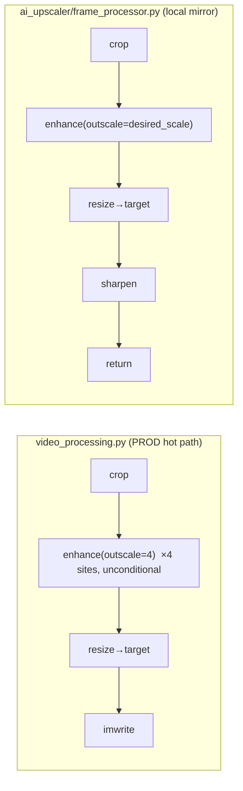
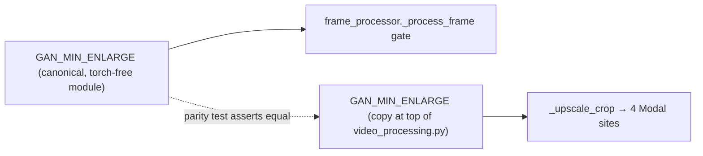
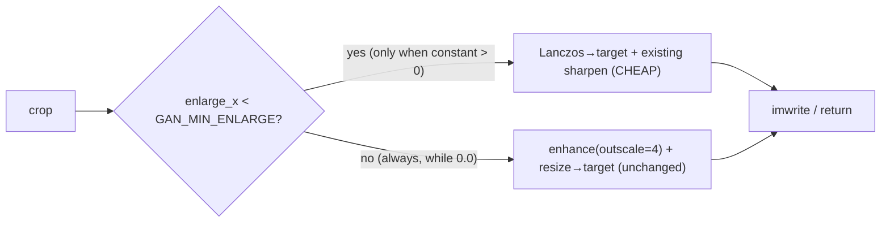

# T10160 — Design: Skip the GAN upscale pass when the enlargement is small

> **DESIGN GATE — requires user approval before ANY implementation begins.**
> This document is the Stage 2 (Architecture) artifact. Nothing here has been coded.
> It ships a change that is **INERT by default** (byte-identical to today) and defers the
> one behaviour-changing number to a follow-up gated on a GAN-inclusive measurement that
> cannot run in this container. See §5 (Risks) and §6 (Open Questions) before approving.

**Task:** `docs/plans/tasks/T10160-skip-gan-for-small-enlargements.md`
**Expert findings (primary input):** `docs/plans/tasks/T10160-expert-findings.md`
**Domain doc:** `.claude/knowledge/modal-gpu.md`

---

## 0. Scope statement (what this task DOES and does NOT do)

**Does:**
- Introduce a single named constant `GAN_MIN_ENLARGE`, defaulted to `0.0` (cheap path dead).
- Add a cheap-path branch (`enlarge_x < GAN_MIN_ENLARGE` → Lanczos resize + existing sharpen;
  else → `enhance()` unchanged) at the production hot path **and** the local mirror, so the two
  engines do not diverge.
- Extract one shared helper per engine so the four Modal enhance sites route through one place
  (DRY; single code path for the gate).
- Add tests proving the `>= threshold` path is byte-identical to today when `GAN_MIN_ENLARGE=0.0`,
  and that the two engines agree on the branch decision (fixture parity).
- Describe (not build) the GAN-inclusive measurement harness and the deploy sequence.

**Does NOT:**
- Set a real, non-zero threshold. That is a follow-up (§3 Step 5) gated on Q2's measurement.
- Change any user-facing copy or make any quality/cost claim (acceptance criterion #4).
- Tune `outscale` to save cost — per the expert, `outscale` does not reduce GAN compute (§1).
- Touch the T9950 "wider frame" control or the default crop size (T10150) — those are separate.

---

## 1. Current State Analysis

### 1.1 Two separate upscale implementations (the core structural fact)

There are **two** Real-ESRGAN upscale implementations, and they are separate code:

| Engine | File | Role | Enhance call |
|--------|------|------|--------------|
| **Modal (production hot path)** | `src/backend/app/modal_functions/video_processing.py` | Every cloud export | `enhance(cropped, outscale=4)` **UNCONDITIONAL**, 4 sites |
| **Local mirror** | `src/backend/app/ai_upscaler/frame_processor.py` | `MODAL_ENABLED=false` + CUDA host | `enhance(frame, outscale=desired_scale)`, 1 site |

This mirrors the domain doc's **"crop-interpolation math exists 4×"** landmine: the local
`ai_upscaler` and the Modal prod copy are independent, and a change to one that is not mirrored
to the other silently diverges the two engines' output.

**Expert's ground-truth correction (read first):** the task premise and the domain doc both lean
on the local `desired_scale = min(scale_x, scale_y, 4.0)` "enhance-then-downsize" logic
(`frame_processor.py:218`). **That is NOT the production hot path.** Production is the Modal copy,
which has no `desired_scale` trim — it calls `enhance(outscale=4)` unconditionally.

### 1.2 The four Modal enhance sites (all identical in shape)

`video_processing.py`, each preceded by an `upsampler = _get_realesrgan_model()` and a crop:

| Site (line) | Enclosing Modal function | Output var names |
|-------------|--------------------------|------------------|
| **1568** | `process_framing_ai` (:1150, sequential T4) | `output_width`/`output_height` |
| **1954** | `process_framing_ai_l4` (:1628, **unwired L4 benchmark copy**, T4420 deletes) | `output_width`/`output_height` |
| **2187** | `process_framing_ai_chunk` (:1840, parallel chunk worker) | `output_width`/`output_height` |
| **2963** | `process_clips_ai` (:2387, multi-clip — the backend-authoritative path) | `target_width`/`target_height` |

Every site is byte-for-byte the same three-step block:

```pseudo
# CURRENT — repeated verbatim at 4 sites
try:
    upscaled, _ = upsampler.enhance(cropped, outscale=4)     # GAN, always
except Exception as e:
    upscaled = cv2.resize(cropped, (OUT_W, OUT_H), INTER_LANCZOS4)   # error fallback
if upscaled.shape[1] != OUT_W or upscaled.shape[0] != OUT_H:
    upscaled = cv2.resize(upscaled, (OUT_W, OUT_H), INTER_LANCZOS4)  # trim 4x → target
```

Note: site 1954 lives inside `process_framing_ai_l4`, which the domain doc marks as an
**unwired benchmark copy owned by T4420 for deletion**. It is not on any live dispatch path. See
§2.4 for how this design treats it (mirror the branch for consistency, but it is not load-bearing).

### 1.3 Why cost tracks crop pixels, not enlargement (the key mechanism)

- `_get_realesrgan_model()` (`video_processing.py:1251`) builds `RealESRGANer(scale=4, tile=0, …)`.
  `tile=0` = no tiling: a single forward pass over the whole crop.
- `SRVGGNetCompact` is fully convolutional → FLOPs are linear in input pixel count (H×W).
- `RealESRGANer.enhance(img, outscale)` **always runs the network at its native `scale=4` over the
  entire input**, then does a trivial final `cv2.resize` to `outscale`. So `outscale` changes only
  the cheap trailing resize — it never changes GAN FLOPs.

**Consequence:** GAN cost is a pure function of **crop input pixel count**, independent of
`enlarge_x`. The ONLY lever that removes GAN cost is skipping `enhance()` entirely. Tuning
`outscale` (including the local path's `desired_scale`) saves at most a downscale-resize, never GAN
compute. This strengthens the task's motivation: wider crops (small enlargement) cost the MOST GAN
time precisely because they have the most input pixels.

Expert's analytical cost model (anchor-relative ratios are robust; absolute figures inherit the E6
anchor's uncertainty — Q1):

| Crop | enlarge_x | input px | GAN cost vs today's default |
|------|-----------|----------|-----------------------------|
| 205×365 (today's default) | 3.95× | 74,825 | 1.0× (anchor) |
| 410×730 (T9950 "wider frame") | 1.98× | 299,300 | ~4.0× |
| 608×1080 (max-fit for 9:16 @ 1080p) | 1.33× | 656,640 | ~8.8× |

### 1.4 Code smells in current code

| Smell | Location | Impact |
|-------|----------|--------|
| Duplicated block (×4) | `video_processing.py:1568, 1954, 2187, 2963` | A gate added at one site and missed at another silently diverges export paths within the SAME engine |
| Parallel implementations | Modal vs `frame_processor.py` | The 4× crop-math landmine — the gate must land in both or the engines diverge |
| Stale premise in task/domain doc | `desired_scale` framed as prod path | Corrected by expert §"Ground-truth correction"; domain doc to be updated at Stage 7 |

### 1.5 Current-behaviour architecture



---

## 2. Target Architecture

### 2.1 Design principles applied

- [x] **DRY:** collapse the 4 duplicated Modal blocks into ONE shared helper; one gate decision.
- [x] **Single code path:** the gate lives in exactly one function per engine; sites call it.
- [x] **Minimal branches:** one `if enlarge_x < GAN_MIN_ENLARGE` inside the helper — not four.
- [x] **Greppability beats elegance:** literal constant name `GAN_MIN_ENLARGE`, co-located, no
  registry/dynamic dispatch (Refactoring Rule 6). Two copies if the engines can't share a module —
  addressed explicitly in §2.5.
- [x] **Inert-first (T8280 precedent):** ship with `GAN_MIN_ENLARGE = 0.0` → cheap path dead →
  byte-identical to today. Numeric flip is a separate, gated commit.

### 2.2 The gate quantity

`enlarge_x = output_width / cropped.shape[1]` — computed right at the enhance site from data
already in hand. It is the pure-geometry, GAN-independent signal for "how much invented detail the
GAN must supply." Cost tracks crop pixels; the *quality* decision is governed by `enlarge_x`, and
low `enlarge_x` correlates with large crops — so gating on the quality axis wins the cost saving for
free.

> Note on ratio direction: `enlarge_x < 1` is impossible on the crop path (output is never smaller
> than the crop after target-fit), and for 9:16 output from a 1080p source the source-supply ceiling
> makes `enlarge_x < ~1.33×` physically impossible (a 9:16 crop can't be wider than 608×1080). The
> interesting threshold band is therefore **1.33×–2×**, not "1.1×–3×". With `GAN_MIN_ENLARGE=0.0`
> the branch is unreachable regardless — this is why inert is byte-identical.

### 2.3 The shared helper + branch shape (Modal engine)

Add one module-level helper in `video_processing.py`, co-located with the other `_`-helpers and the
constant (natural home: next to `_get_realesrgan_model` at :1251 / `_interpolate_crop` at :1292):

```pseudo
# NEW module-level constant, co-located at top of the upscale helper region.
# INERT default: 0.0 means enlarge_x < 0.0 is never true → cheap path is dead code →
# byte-identical to today. Flip to the calibrated value only in the follow-up (Step 5).
GAN_MIN_ENLARGE = 0.0   # skip GAN when output_w/crop_w < this; 0.0 = never skip

# NEW shared helper — the SINGLE gate decision for all Modal sites.
def _upscale_crop(upsampler, cropped, out_w, out_h):
    enlarge_x = out_w / cropped.shape[1]
    if enlarge_x < GAN_MIN_ENLARGE:
        # CHEAP PATH: Lanczos to target + the existing sharpen step.
        resized = cv2.resize(cropped, (out_w, out_h), interpolation=cv2.INTER_LANCZOS4)
        return _sharpen(resized)          # same unsharp-mask params as frame_processor.py:232-238
    # GAN PATH — must be byte-identical to today's block:
    try:
        upscaled, _ = upsampler.enhance(cropped, outscale=4)
    except Exception as e:
        upscaled = cv2.resize(cropped, (out_w, out_h), interpolation=cv2.INTER_LANCZOS4)
    if upscaled.shape[1] != out_w or upscaled.shape[0] != out_h:
        upscaled = cv2.resize(upscaled, (out_w, out_h), interpolation=cv2.INTER_LANCZOS4)
    return upscaled
```

Each of the four sites collapses to:

```pseudo
# AT EACH SITE (1568, 1954, 2187, 2963) — replaces the 3-line duplicated block
upscaled = _upscale_crop(upsampler, cropped, OUT_W, OUT_H)   # OUT_* = that site's target vars
```

**Load-bearing invariant:** with `GAN_MIN_ENLARGE = 0.0` the `if` is never taken, so `_upscale_crop`
executes exactly the current try/except + conditional-resize — verified byte-identical by test
(§4). This is the T8280 "gated single path, not a parallel one" shape.

### 2.4 The local mirror (`frame_processor.py`)

The local engine gets the **same** gate so the two engines agree (the 4× crop-math landmine). It
already has the sharpen step (`:230-238`) and a `desired_scale` computation (`:216-218`). The branch
inserts before the `enhance` call at `:222`:

```pseudo
# frame_processor.py ~:216 — enlarge_x computed from the SAME quantity as Modal
enlarge_x = target_w / current_w
if enlarge_x < GAN_MIN_ENLARGE:
    enhanced = cv2.resize(frame, target_resolution, interpolation=cv2.INTER_LANCZOS4)
    # fall through to the EXISTING sharpen block (:230-238) unchanged
else:
    enhanced, _ = upsampler.enhance(frame, outscale=desired_scale)   # unchanged
    if enhanced.shape[:2] != (target_h, target_w):
        enhanced = cv2.resize(enhanced, target_resolution, INTER_LANCZOS4)
# existing sharpen at :230-238 runs for BOTH branches (quality mode)
```

The `min(scale_x, scale_y, 4.0)` `desired_scale` on the local side stays as-is on the GAN branch —
it is not the prod path and this task deliberately does not consolidate the two engines (that is the
T4420-adjacent crop-math consolidation, out of scope). We only add the *same gate* to both.

> Site 1954 (`process_framing_ai_l4`) is an unwired benchmark copy T4420 will delete. We still route
> it through `_upscale_crop` for within-file consistency (one grep, one behaviour), but it is not on
> a live dispatch path, so its parity is a code-hygiene nicety, not a correctness requirement.

### 2.5 The constant-drift problem (addressed explicitly)

`frame_processor.py` (under `app/`) and `video_processing.py` (deployed into a Modal image that does
**not** mount `app`) **cannot share a module** — this is the exact same constraint that forced
`_resolve_modal_app_name` to be a byte-for-byte duplicate (`video_processing.py:42`, guarded by
`tests/test_modal_app_name.py`). So `GAN_MIN_ENLARGE` must physically exist **twice**.

A drifting constant is its own landmine (the engines would gate differently). Mitigation, mirroring
the established `resolve_modal_app_name` precedent:

- Define `GAN_MIN_ENLARGE` in a small **torch-free** module under `app/ai_upscaler/` (e.g.
  `upscale_gate.py`) so the local engine imports the canonical value.
- Keep a byte-for-byte copy at the top of `video_processing.py` (with a comment pointing at the
  canonical one, exactly like the app-name copy's comment).
- **Add a parity test** (`tests/test_upscale_gate_constant.py` or fold into an existing modal-parity
  test) that imports both and asserts they are equal — so they cannot silently drift. This is the
  same guard pattern already trusted for the app name.



### 2.6 Target behaviour



---

## 3. Implementation Plan (ordered)

**This task lands Steps 1–4 only. Step 5 is an explicit follow-up gated on Q2.**

| # | Step | Deliverable |
|---|------|-------------|
| 1 | Canonical constant + parity | Torch-free `GAN_MIN_ENLARGE = 0.0` module under `ai_upscaler/`; byte-copy at top of `video_processing.py`; parity test |
| 2 | Modal helper + 4 call sites | `_upscale_crop()` in `video_processing.py`; replace the duplicated block at 1568, 1954, 2187, 2963 |
| 3 | Local mirror branch | Add the same gate to `frame_processor.py` ~:216-222; reuse existing sharpen |
| 4 | Tests (see §4) | Byte-identical `>=`-path test; two-engine branch-parity fixture test; constant-parity test; `from app.main import app` import check |
| 5 | **(FOLLOW-UP, gated)** flip `GAN_MIN_ENLARGE` to the calibrated value | Separate commit after the GAN-inclusive run exists (Q2) |

### 3.1 Measurement harness for the follow-up (describe, do not build)

The number in Step 5 comes from **one** gated measurement: a GAN-inclusive run of the six crops
(608×1080, 540×960, 410×730, 405×720, 270×480, 205×365) over the 24 matched timestamps on the wcfc
fixture, computing enlarged/encoded `lap_var` (+ `hf_ratio`) the same way as `scripts/quality_benchmark.py`.

- **Reuse `scripts/quality_benchmark.py`**, extended with a GAN-inclusive mode: when CUDA + the four
  pinned `upscale_image` packages are present, run `enhance(crop, outscale=4)` → Lanczos-to-810×1440
  through the real `realesr-general-x4v3` model instead of the current Lanczos-only lower bound.
  Today it is Lanczos-only in a no-CUDA container (domain doc: it is a **no-GAN LOWER BOUND**).
- **Where it runs:** a CUDA host with torch + the four pinned packages, OR **staging Modal**
  (`reel-ballers-video-v2-staging`) with real credentials. Neither is dispatchable from this
  container (no torch/CUDA, no Modal auth — expert §(a)).
- **The threshold** = the largest `enlarge_x` at which `(GAN lap_var − Lanczos lap_var)` drops below
  a perceptual-noise floor, ideally corroborated by a small parent A/B (T9970's blocked dimension 12).
- Expert's provisional direction is `enlarge_x <= ~1.5×` — a **hypothesis to test, not a ship-it
  number**. Do not bake 1.5× (or any number) into this task's default.

### 3.2 Deploy sequence (Invariant 3 — manual, per-env)

The Modal-image code changes, so the change is **inert until `video_processing.py` is redeployed**,
and it rides the manual per-environment deploy gate (same rollout as T8280 / T7090 / Tbug49p):

1. Ask the user to deploy **staging** first: `python app/modal_functions/deploy.py`.
2. **Verify on staging:** a real non-30fps upload + ffprobe (Tbug49p repro pattern). With
   `GAN_MIN_ENLARGE=0.0` the verification expectation is *no observable change vs today* — this
   confirms the inert wiring is correct, which is the whole point of Step 1–4.
3. Then **prod**: `python app/modal_functions/deploy.py --prod`.
4. The **backend** (`frame_processor.py` etc.) ships on the normal branch → master → staging path;
   the Modal redeploy is a separate step that must be offered explicitly.

For Step 5 (the flip), the SAME staging→verify→prod sequence repeats — but that verification is a
real before/after quality comparison (matched-timestamp exported clips), which is why it is gated.

---

## 4. "No regression above threshold" — concretely

**"Byte-identical" means:** for any frame whose `enlarge_x >= GAN_MIN_ENLARGE` (which is EVERY frame
while the constant is `0.0`), `_upscale_crop` must produce exactly what today's inline block
produces — same `enhance(outscale=4)` call, same args, same except-fallback, same conditional
target-resize. The refactor is pure code motion on that path (Refactoring Rule 3: moves are
mechanical, never mixed with behaviour change).

Verification (all runnable in-container — no CUDA/Modal needed because they assert the *decision* and
*call args*, not GAN output):

1. **Enhance-args-unchanged test:** with `GAN_MIN_ENLARGE=0.0`, spy/mock `upsampler.enhance` and
   assert it is called with `outscale=4` for a representative crop at each `enlarge_x` in the table
   (1.33×, 1.5×, 1.98×, 2.0×, 3.0×, 3.95×). Assert the cheap-path resize is **never** taken. This is
   the concrete "no regression above threshold" guard.
2. **Cheap-path activation test:** with `GAN_MIN_ENLARGE=1.5` (test-only override), assert
   `enhance` is NOT called for `enlarge_x < 1.5` and IS called at/above it — proving the gate is
   wired to the right quantity and direction.
3. **Two-engine branch-parity fixture test:** feed the SAME crop/target pairs to the Modal
   `_upscale_crop` decision and the `frame_processor` gate; assert both take the same branch for the
   same `enlarge_x` (guards the 4×-crop-math divergence at the decision level).
4. **Constant-parity test:** import `GAN_MIN_ENLARGE` from both the canonical module and the
   `video_processing.py` copy; assert equal (guards drift, §2.5).
5. **Import check:** `from app.main import app` (backend CLAUDE.md required step).

Test-scope note (RELEVANT SET, ~10 tests, curated): the four new tests above + the existing
`test_modal_app_name.py` (the parity-guard precedent) + any existing `video_processing`/upscale
regression test guarding this corner + the e2e/export spec for the framing flow. Not the whole
suite — Branch CI is the full-sweep verdict.

---

## 5. Rollback safety

- **Single kill switch:** set `GAN_MIN_ENLARGE = 0.0` (both copies) → cheap path is dead code →
  byte-identical to today. This is the shipping default, so **this task ships already-safe**.
- **Bad flip is redeploy-revertible:** because the change rides the manual per-env deploy gate
  (Invariant 3), a bad calibrated value discovered on staging never reaches prod (staging→verify
  precedes prod). A bad value that somehow reaches prod is reverted by setting the constant back to
  `0.0` and redeploying — a one-line, greppable change.
- **No persistence involved:** this is a pure render-time compute branch — no DB writes, no R2
  version interaction, nothing to migrate or un-migrate. Rollback is purely code+redeploy.

---

## 6. Risks

| Risk | Severity | Mitigation |
|------|----------|------------|
| **Two-engine divergence** (gate added to Modal but not local, or constants drift) | High | Both engines get the gate in the SAME task; constant defined once + byte-copy + **parity test** (§2.5), mirroring the trusted `resolve_modal_app_name` guard |
| **Q1 — E6 anchor calibration uncertainty** | Med | The cost *ratios* (4×/8.8×) are anchor-independent and robust; absolute GPU-s/$ inherit the anchor. Confirm the crop size the 681 ms/frame anchor was measured at from the E6 record BEFORE quoting any dollar figure to product. Does not affect the inert ship |
| **Q2 — the gated GAN run is unavailable here** | High (blocks the number) | Ship INERT (`0.0`); the numeric flip is an explicit follow-up (Step 5) gated on a CUDA/staging GAN-inclusive run. No number is baked in |
| **Q3 — single-fixture calibration** | Med | The wcfc fixture is one lighting/distance sample. Calibrate the eventual threshold on a multi-fixture set (low-light, closer subject) before the non-inert flip; a too-high threshold durably under-processes real exports, a too-low one wastes the saving |
| **Shipping inert means no user-visible change lands this task alone** | Expected, not a defect | By design (T8280 precedent): this task lands the mechanism + tests + harness; the benefit arrives with the gated Step-5 flip. The acceptance criteria explicitly forbid a quality claim from this task |
| Missing one of the 4 Modal sites | Med | The `_upscale_crop` helper makes it one call per site; a grep for `enhance(cropped` in `video_processing.py` must return zero direct callers after the refactor (all route through the helper) |
| Site 1954 is dead code (T4420) | Low | Routed through the helper for consistency; not load-bearing; no separate handling needed |

---

## 7. Open Questions (carry-forward from expert §(g) — for the user at the design gate)

- **Q1 (calibration anchor):** What crop input size was the E6 681 ms/frame anchor measured at?
  Assumed 205×365; a different size rescales every absolute GAN-time/$ figure linearly (ratios
  unaffected). Confirm before any dollar figure reaches product.
- **Q2 (authorize the gated run):** Approve a staging-Modal or CUDA-host run of the six-crop
  GAN-inclusive benchmark? It is the single measurement that turns the provisional ~1.5× direction
  into a shippable threshold. **If not now:** land the inert constant + both-engine branch +
  harness (Steps 1–4) and defer the flip.
- **Q3 (fixture scope):** Calibrate the threshold on a multi-fixture set before the non-inert flip,
  or is the wcfc fixture acceptable for a first flip?
- **Q4 (this design):** Approve the shared-helper extraction (`_upscale_crop`) as part of THIS task,
  or keep the four sites separate and only add the gate inline? Extraction is DRY-correct and makes
  the "no site missed" guarantee greppable, but it enlarges the mechanical diff slightly. Recommended:
  extract (still well under the ~200-line reviewable-unit limit).

---

## Approval

**This design requires user approval before implementation (Stage 3/4).** On approval, the task
proceeds to Test-First (Stage 3) writing the §4 tests, then Implementation (Stage 4) of Steps 1–4,
then the manual Modal deploy gate (§3.2). Step 5 (the numeric flip) remains blocked on Q2.
