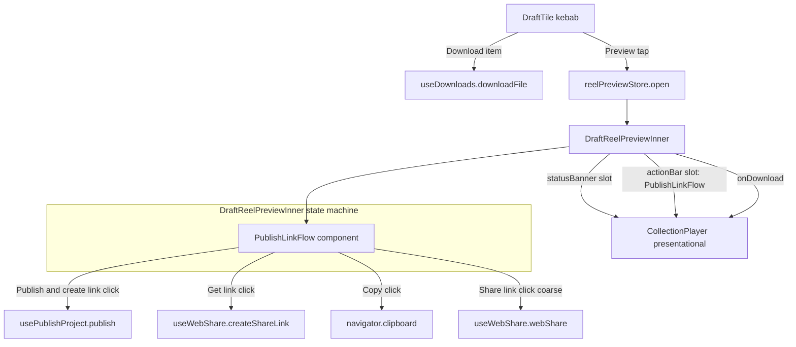

# T10180 Design — Result-surface Publish -> visibility-review -> link-ready UI

**Status:** APPROVED (user, 2026-09-21) - Q1 split item 4 out (filed as T10860), Q2 extract shared
`LinkReadyCard` (refactor `CollectionShareModal` to consume it), Q3 copy approved as written.
**Tier:** L (new multi-step UI pattern, design-gated)
**Author:** Architect (Stage 2)
**Date:** 2026-09-21
**Sources:** T9880 decision record (`docs/plans/tasks/evaluation-2026-09-13/T9880-decision-record.md`), Code Expert Stage-1 findings

---

## 0. Scope decision up front (the item-4 call)

**Item 4 ("Update shared version" backend token re-point) is SPLIT OUT of this task.** Rationale
in §5. This task ships items 1, 2, 3, 5 (all frontend, no backend change). A follow-up task should
be filed for item 4. **This is the one OPEN QUESTION requiring the user's explicit sign-off** (see §8).

---

## 1. Current State (file:line)

### 1.1 Result surface = `DraftReelPreview` wrapping a presentational `CollectionPlayer`

- `DraftReelPreview.jsx:194` renders `<CollectionPlayer>`. ALL publish/share vocabulary lives in this
  wrapper; `CollectionPlayer` is strictly presentational (component doc `:13-17`).
- The wrapper owns local flags: `published` (`:70`, seeds from `payload.alreadyPublished`), `failed`
  (`:71`), `ringOn` (`:72`). No store-derived published flag — the archived project drops from the
  store post-publish (`:26-28`, §4.7 of its own doc).
- One-reel payload built at `:93-104`; the draft streams `/api/downloads/${payload.finalVideoId}/stream`
  (`:97`), which is NOT gated on `published_at`.

### 1.2 Today's one-tap publish (no review, no cancel)

- `handlePublish` (`:106-121`): calls `publish({ openGallery: false })`, on success sets
  `published = true`, toasts `STAGE_REASONS.PUBLISH`, arms a 1.5s attention ring.
- Primary slot is **state-exclusive** and swaps in the CALLER (`:201-204`):
  `onPublish={published ? undefined : handlePublish}` / `onShare={published ? handleShare : undefined}`.
- `handleShare` (`:126-149`): coarse pointer -> `webShare`, fine pointer -> `copyLink` + a
  `toast.success('Link copied to clipboard', { dedupKey: 'copy-link' })` (`:136`/`:140`).
- Status banner (`:155-191`): cyan draft strip "Only you can see this. Publish it to get a share link."
  (`:187`) -> amber retry on failure -> null once published.

**Gap:** publish immediately flips Publish -> Share. There is no visibility-review confirm, no Cancel
path, and no distinct link-ready state. The link is created invisibly as a side effect of the first
Share tap (`copyLink`/`webShare`), so "copied" can fire before the user has seen the link.

### 1.3 The get-link-then-copy state machine (to reuse) — `CollectionShareModal.jsx:212-238`

- `creatingPublicLink ? <Loader spinner> : publicLink ? <selectable readonly input + Copy button> : <Get Link button>`.
- Create gesture `createPublicLink` (`:88-100`) calls `createShare([], true)`, stores
  `collectionLink(token)`.
- Selectable readonly input (`:218-224`): `<input readOnly value={publicLink} onFocus={(e) => e.target.select()}>`.
- Copy handler `handleCopy` (`:110-124`): `navigator.clipboard.writeText`, catch -> hidden-input
  `execCommand('copy')`; sets `copied` for 2s.
- This machine is **collection-scoped** and uses the collection `createShare` API — NOT the
  single-`final_video` share path the result surface needs.

### 1.4 `useWebShare.js` (keep, reuse for the single-video path)

- `copyLink` (`:17-35`) creates the single-video token and writes it to the clipboard;
  `webShare` (`:89`/`:101`) uses `navigator.share`; the silent fallback `copyToClipboard`
  (`:37-48`) uses a hidden input + `execCommand` (NOT selectable). Native-share blob fetch hits
  `/api/downloads/{downloadId}/file` (`:85`).
- **Key point:** `useWebShare` already knows how to MINT the single-video share token and RETURN the
  link. We need a create-that-returns-the-URL entry point rather than the create-and-immediately-copy
  path so the link can be displayed before any copy.

### 1.5 Copy strings — `config/displayNames.js`

- `STAGE_REASONS.PUBLISH = "Nobody else can see this until you share a link."` (`:170`, block opens
  `:167`; consumed as PUBLISH_CAPTION at `:426`/`:489`). This is the T9670-settled audience contract.
- `LIBRARY_ACTIONS` (`:205-218`): `PUBLISH_REEL = 'Publish reel'` (`:217`) — the label
  `CollectionPlayer` uses today (`:499`).
- Absent (grep-confirmed): "Publish and get link", "Publish and create link", "Link ready",
  "Share link...", "Update shared version".

### 1.6 `CollectionPlayer` slots (do NOT add logic here)

- Props `:126-152`; `onPublish` (`:138`), `onShare` (`:136`), `onDownload` (`:142`),
  `statusBanner` (`:140`), `actionBar` (`:141`).
- Publish button `:492-505`; Share `:510-521`; Download `:523-534`. `statusBanner` renders `:606`;
  `actionBar` renders `:696`.
- Shared by Published/DownloadsPanel/`/shared` viewer/IntroStoryPlayer/RankingGame — **any change
  must be additive and default inert.**

### 1.7 `DraftTile` kebab (item 5 target)

- Ready-state kebab items rendered by `renderKebabItems` (`DraftTile.jsx:462-508`), shared
  `menuItemClass` (`:461`). Items: Rename (`:464`), Open in Framing (`:469`), Open in Spotlight
  (`:475`), Hide from Drafts (`:481`), game link/unlink (`:487-499`), Delete (`:503`). **No Download.**
- `isComplete = project.has_final_video` (`:346`); tile already references
  `project.final_video_id` for streaming (`:401-402`).

### 1.8 Item-5 download path is buildable pre-publish, NO backend change (Code Expert verdict)

- `download_file` (`routers/downloads.py:692`) resolves purely on id
  (`SELECT ... WHERE fv.id = ?` `:713-717`), NO `published_at` filter. `stream_download` likewise.
- The private draft already streams the same id (`:97`), so `/file` serves the same id. No new
  endpoint, no gate change.

---

## 2. Target State

### 2.1 Architecture (unchanged shape: wrapper owns vocabulary, player stays presentational)



The new multi-step flow lives ENTIRELY in `DraftReelPreview` and a new `PublishLinkFlow` presentational
component it renders into the `CollectionPlayer` **`actionBar`** slot. The one-button primary slot
(`onPublish`/`onShare`) is replaced by the richer flow in `actionBar`, so the state-exclusivity
constraint of the primary slot is not violated — we stop using it for this surface (see §6 risk R2).

### 2.2 State machine (the core deliverable)

```
                         ┌─────────────────────────────────────────────┐
   Idle (draft)          │ statusBanner: cyan "Only you can see this..."│
   ─────────────         └─────────────────────────────────────────────┘
   actionBar shows:  [ Publish and get link ]  (+ Download secondary)
        │ click "Publish and get link"
        ▼
   Review (visibility-review confirm)   <-- NO write has happened yet
   ────────────────────────────────
   actionBar shows a confirm card:
     Title:  REVIEW_TITLE(name)  = "Publish "<name>"?"
     Body:   REVIEW_BODY         = "Anyone with the link can watch.
                                     Publishing creates a link; it does not send it."
     Buttons: [ Cancel ]   [ Publish and create link ]
        │ Cancel ───────────────► back to Idle (no write, no link)
        │ click "Publish and create link"
        ▼
   Publishing (busy)                    <-- gesture: publish() then createShareLink()
   ─────────────────
   actionBar shows: spinner + "Publishing..."
        │ publish() resolves OK  ──► create link  ──► link-ready
        │ publish() fails (503/generic) ──► Failed (amber retry, same gesture)
        ▼
   Link-ready (success)
   ────────────────────
   actionBar shows the lifted get-link-then-copy card:
     Label:  LINK_READY = "Link ready"
     [ selectable readonly input: the share URL ]  [ Copy ]      (fine pointer)
     [ Share link... ]                                            (coarse pointer)
     Copy success -> toast "Link copied to clipboard" (dedupKey 'copy-link')
```

Pseudocode for `DraftReelPreviewInner`:

```
phase: 'idle' | 'review' | 'publishing' | 'ready' | 'failed'
shareUrl: string | null

onPublishClick()        // "Publish and get link"
    setPhase('review')          // pure UI, NO write

onCancelReview()               // "Cancel"
    setPhase('idle')            // NO write ever occurred

onConfirmPublish()      // "Publish and create link"  <-- the single write gesture
    setPhase('publishing')
    const ok = await publish({ openGallery: false })   // usePublishProject, unchanged
    if (!ok) { setPhase('failed'); return }
    const url = await createShareLink({ downloadId: reel.id })  // useWebShare, new return-url path
    setShareUrl(url)
    setPhase('ready')

onCopy()                // "Copy" in link-ready
    await navigator.clipboard.writeText(shareUrl)   // fallback: hidden-input execCommand
    toast.success('Link copied to clipboard', { dedupKey: 'copy-link' })

onNativeShare()         // "Share link..." (coarse pointer)
    await webShare({ downloadId: reel.id, ... })     // existing useWebShare path
```

Every transition above is a NAMED user gesture (button onClick). The link is created inside
`onConfirmPublish`'s onClick chain — never in a `useEffect` watching `published` (see §7).

### 2.3 Link-ready component — LIFT the machine, or duplicate?

**Decision: EXTRACT a small shared presentational component `LinkReadyCard`** used by both
`DraftReelPreview` (new) and `CollectionShareModal` (refactor `:212-238` to consume it).

- Duplication count: `CollectionShareModal:212-238` is use #1; this task is use #2. The
  abstract-on-3rd-duplication rule says **do not abstract on the 2nd**. **However**, the two
  differ in three ways (collection `createShare` vs single-video token; modal chrome vs actionBar
  chrome; intro-card reset coupling in the modal), so a shared component would need heavy
  parameterization — a premature abstraction that hides code paths from grep.
- **Chosen middle path:** extract ONLY the leaf presentational fragment that is genuinely identical
  — the `publicLink ? <selectable input + Copy> : <Get Link>` render — as a tiny stateless
  `LinkReadyCard({ link, onGetLink, creating, copied, onCopy })`. The state (which gesture created
  the link, which API) stays with each caller. This satisfies "reuse the selectable-input machine"
  (AC) WITHOUT a leaky abstraction, and is a mechanical move for `CollectionShareModal`.
- **If the reviewer prefers zero refactor of `CollectionShareModal` in this task:** duplicate the
  ~15-line selectable-input+Copy fragment deliberately (it is use #2, under the rule threshold) and
  note it for consolidation on the 3rd use. Flagged as a minor OPEN QUESTION (§8, Q2).

**We use the SELECTABLE readonly input (`CollectionShareModal:218-224` pattern), NOT the silent
`useWebShare` `copyToClipboard` hidden-input fallback** — this is the AC. The `useWebShare` silent
fallback stays only as the last-resort clipboard-write fallback inside `onCopy`, exactly as
`CollectionShareModal.handleCopy` does (`:110-124`).

### 2.4 `useWebShare` — add a create-that-returns-URL entry point

Today `copyLink` (`:17-35`) creates the token AND writes to clipboard in one call. Link-ready needs
the URL BEFORE any copy. Add `createShareLink({ downloadId })` that mints/reuses the token and
RETURNS the URL string (no clipboard write). `copyLink` can be refactored to call
`createShareLink` then write — or left as-is (it stays used by the coarse-pointer `handleShare` on
other surfaces). Minimal, additive; the token-create is still gesture-driven.

---

## 3. Implementation Plan (component-by-component)

### 3.1 `config/displayNames.js` — new copy block (the ~9 strings)

Add a `RESULT_PUBLISH` block near `STAGE_REASONS`/`LIBRARY_ACTIONS`. Policy check against the T9670
contract: no placeholders; no "sent"/"emailed" (a link is created, never sent); no "watched"
conflation; matches "Anyone with the link can watch" phrasing already sanctioned by the task/T9880.

```js
export const RESULT_PUBLISH = {
  // Idle primary action — starts the review flow, does NOT publish yet.
  PUBLISH_GET_LINK: 'Publish and get link',
  // Visibility-review confirm card.
  REVIEW_TITLE: (name) => `Publish "${name}"?`,
  REVIEW_BODY: 'Anyone with the link can watch. Publishing creates a link; it does not send it.',
  REVIEW_CANCEL: 'Cancel',
  REVIEW_CONFIRM: 'Publish and create link',
  // Busy + failure (reuse existing amber copy for the retry banner; this is the actionBar label).
  PUBLISHING: 'Publishing...',
  // Link-ready success state.
  LINK_READY: 'Link ready',
  COPY_LINK: 'Copy link',
  SHARE_LINK: 'Share link...',   // coarse-pointer native share entry
};
```

That is 9 keys (`PUBLISH_GET_LINK`, `REVIEW_TITLE`, `REVIEW_BODY`, `REVIEW_CANCEL`, `REVIEW_CONFIRM`,
`PUBLISHING`, `LINK_READY`, `COPY_LINK`, `SHARE_LINK`). `STAGE_REASONS.PUBLISH` stays the toast/caption
line and is reused unchanged. "Update shared version" is deliberately NOT added (item 4 split out).

Policy notes:
- `REVIEW_BODY` uses "creates a link; it does not send it" — the exact T9880/T9670 disambiguation
  between creating a link and sending/notifying. No email vocabulary.
- "watch" (not "see"/"view") matches "Anyone with the link can watch" already blessed in the task.
- All are final strings, no `TODO`/placeholder — satisfies the epic no-provisional-copy rule.

### 3.2 New component `components/PublishLinkFlow.jsx` (presentational)

- Props: `phase`, `reelName`, `shareUrl`, `isMobile`, `copied`, `onPublishClick`, `onCancel`,
  `onConfirm`, `onCopy`, `onNativeShare`. Pure render of the §2.2 machine, one branch per phase.
- Renders into `CollectionPlayer`'s `actionBar` slot. No store access, no fetching, no effects —
  data-always-ready: parent (`DraftReelPreviewInner`) owns all state.
- Uses `RESULT_PUBLISH` strings and `LinkReadyCard` (or inline fragment per §2.3 decision).
- Buttons use the existing `Button` component variants (cyan for primary publish, per
  `CollectionPlayer:494`; secondary for Cancel) — consistent with ui-style-guide.

### 3.3 `components/DraftReelPreview.jsx` (rewire the state machine)

- Replace `published`/`failed` two-flag pair with a single `phase` state machine (§2.2) plus
  `shareUrl` + `copied`. Keep `payload.alreadyPublished` seeding: if already published on open,
  start in a link-ready-capable phase (mint the link on first Get-link click; do NOT auto-create on
  mount — no reactive effect).
- Stop passing `onPublish`/`onShare` to `CollectionPlayer`; pass `PublishLinkFlow` via `actionBar`.
  Keep `statusBanner` (idle cyan / publishing / amber-failed) — the banner copy stays, the primary
  buttons move to `actionBar`.
- Pass `onDownload` + `downloadLoading` into `CollectionPlayer` (item 5, §3.5).
- The quest timer (`:82-87`), off-page scoping (`:46-49`), and remount keying (`:57`) are untouched.

### 3.4 `hooks/useWebShare.js`

- Add `createShareLink({ downloadId })` returning the URL string (mint/reuse token, no clipboard
  write). Additive; existing `copyLink`/`webShare` unchanged for other surfaces.

### 3.5 Item 5 — surface Download

**On the result view (`DraftReelPreview`):** pass a `handleDownload` into `CollectionPlayer`'s
existing `onDownload` prop (`:142`, button `:523-534` already exists). Wire via `useDownloads`:
`downloadFile(reel.id)` where `reel.id === payload.finalVideoId === project.final_video_id`
(`utils/finishedReelNav.js:40`). `downloadLoading` from `useDownloads.downloadingId === reel.id`.
No backend change (Code Expert verdict §1.8). Wrap in try/catch -> `toast.error` on failure
(`downloadFile` re-throws).

**On `DraftTile` kebab:** add a Download item in `renderKebabItems` (`:462-508`), gated on
`isComplete && project.final_video_id`, using `menuItemClass`, a `Download` icon, and
`useDownloads().downloadFile(project.final_video_id)`. Placed after Open-in-Spotlight, before the
Hide/Delete divider. `useDownloads()` is instantiated in `DraftTile` (or lifted to the parent if the
tile already holds a downloads hook — verify at implementation; if not present, instantiate with
`useDownloads(false)` since it does not need the panel-open fetch).

**Live-verify (AC + Step 5):** drive a real never-published draft's Download to disk on
dev/staging via `loginAsRealUser` + Playwright before shipping — the download-path-works claim is
code-evidenced, not yet live-proven (T9880 flagged this).

### 3.6 `CollectionShareModal.jsx` (only if §2.3 extract-shared path chosen)

- Replace the inline `:212-238` fragment with `<LinkReadyCard>`. Mechanical move, behavior
  unchanged. Guarded by characterization test (existing modal test if present, else add one).

---

## 4. Design Decisions

| Decision | Options | Choice | Rationale |
|----------|---------|--------|-----------|
| Where the multi-step flow lives | primary slot swap / new `actionBar` component / new CollectionPlayer logic | `actionBar` component owned by `DraftReelPreview` | Primary slot is state-exclusive (one button); a 5-phase flow needs richer render. Keeps player presentational (R1). |
| Link-ready reuse | lift full machine / extract leaf fragment / duplicate | Extract leaf `LinkReadyCard` (fallback: duplicate) | Two callers differ in API+chrome; only the selectable-input render is truly shared. Avoids leaky abstraction. |
| Link creation trigger | reactive effect on `published` / button onClick chain | onClick chain in `onConfirmPublish` | Gesture-based persistence rule — never a reactive effect (§7). |
| `useWebShare` change | reuse `copyLink` (creates+copies) / add `createShareLink` (returns URL) | Add `createShareLink` | Link-ready must SHOW the URL before any copy; copy-on-create can't satisfy "confirmed only after clipboard success + selectable fallback". |
| Item 4 (Update shared version) | in this task / split out | Split out | Only backend piece; own CAS/durable-sync + live-verification concern; items 1-3-5 need no backend (§5). |
| Download hook | `useDownloads` / new call | `useDownloads.downloadFile` | Existing, race-safe, re-throwing; already the gallery download path. |

---

## 5. Item-4 scope decision (Update shared version) — SPLIT OUT

**Verdict: NOT in this task. File a follow-up.**

Why split:
1. **It is the only backend piece.** Items 1/2/3/5 are pure frontend with zero endpoint/schema
   change (Code Expert §1.8). Item 4 requires re-pointing an existing `gallery/{id}/share` (or
   single-video share) token to a moved `final_video_id` after a private re-export.
2. **It is its own persistence + live-verification concern.** Re-pointing a token is a write path
   that must "prove its copy is current, or fail loudly" (CLAUDE.md persistence rule) — CAS on the
   share row, durable R2 sync, and refuse-on-conflict. A re-export INSERTs a NEW `final_videos`
   version (`upsert_working_video`); nothing today re-points the token (T9880 §2, "MET by
   construction, UNVERIFIED live"). Getting this wrong silently updates or silently fails to update
   a live shared link — exactly the class of bug the persistence rules guard.
3. **It needs a live backend** to verify (no backend venv in T9880's container; the item-4 endpoint
   behavior when `final_video_id` moved is unproven). Bundling it would gate the whole
   frontend-only task on backend live-drive.
4. **LOC/risk boundary.** Items 1-3-5 are ~200-350 LOC frontend, one design gate. Item 4 adds a
   backend endpoint + CAS story + its own live proof — a clean separate L-tier (or M) task.

**Action:** after approval, file a follow-up task "T{next}: Update-shared-version — re-point share
token to moved final_video_id after private re-export (backend, CAS + durable sync + live proof)".
The `RESULT_PUBLISH` block does NOT include "Update shared version" copy; that ships with the
follow-up. AC line 105 (item 4) moves to the follow-up.

---

## 6. Risks

| Risk | Mitigation |
|------|------------|
| **R1 — Cross-surface `CollectionPlayer` regression.** It is shared by Published/DownloadsPanel/`/shared`/IntroStoryPlayer/RankingGame. | Add NO logic to `CollectionPlayer`. Reuse only its existing `actionBar`/`statusBanner`/`onDownload` slots, all already inert-by-default. No new prop needed (actionBar exists). |
| **R2 — Primary-slot state-exclusivity.** Today one of `onPublish`/`onShare` renders. The 5-phase flow can't fit one button. | Stop using the primary slot for this surface; render the whole flow in `actionBar`. Other surfaces keep using the primary slot unchanged. |
| **R3 — Reactive link creation.** Creating the link on a `published`-flag effect would violate gesture-based persistence and could double-create. | Link mint fires ONLY inside `onConfirmPublish`'s onClick chain. No `useEffect` watches `phase`/`published`. Explicitly checked in §7. |
| **R4 — Item 5 download path unproven live.** Code says ungated; not live-driven for a never-published draft. | Live-drive Download on a real never-published draft (dev/staging, `loginAsRealUser`) before shipping — AC + Step 5. Do not ship blind. |
| **R5 — `alreadyPublished` open (Focus one-tap).** A preview opened already-published must reach link-ready without a phantom review step or auto-create. | Seed `phase` to allow Get-link on first click; never auto-create on mount. Covered by a unit test. |
| **R6 — Double-publish / repeat clicks.** | `phase === 'publishing'` disables the confirm button; `usePublishProject.isPublishing` already guards the underlying gesture. |
| **R7 — Copy false-success.** "Copied" firing before clipboard success. | `onCopy` awaits `clipboard.writeText`; toast only after it resolves; selectable input is the visible fallback (AC). |

---

## 7. Persistence check (every new write/gesture)

| Gesture (named) | Handler | Write | Reactive? |
|-----------------|---------|-------|-----------|
| "Publish and get link" click | `onPublishClick` | none (UI phase -> review) | No |
| "Cancel" click | `onCancelReview` | none | No |
| "Publish and create link" click | `onConfirmPublish` | `usePublishProject.publish` (existing surgical POST `/api/downloads/publish/{id}`) then `useWebShare.createShareLink` (token mint) | No — both inside the onClick chain |
| "Copy link" click | `onCopy` | none (clipboard only) | No |
| "Share link..." click (coarse) | `onNativeShare` | `useWebShare.webShare` (token mint, existing) | No |
| Download (result view / kebab) | `handleDownload` | none (GET stream to disk; not a DB write) | No |

**Confirmed: no `useEffect` watches state to trigger a write.** The only mount effects retained in
`DraftReelPreview` are the quest timer and off-page-scoping cleanup (neither persists). No new
reactive persistence introduced.

---

## 8. OPEN QUESTIONS for the user

- **Q1 (primary — needs your call):** Confirm item 4 ("Update shared version" backend token
  re-point) is SPLIT OUT into a follow-up task, so this task ships frontend-only (items 1/2/3/5).
  Recommended: yes.
- **Q2 (minor):** For the link-ready UI, extract a shared `LinkReadyCard` (refactoring
  `CollectionShareModal:212-238` to use it, a mechanical move) OR deliberately duplicate the ~15-line
  fragment (it is only use #2, under the abstract-on-3rd rule)? Recommended: extract the leaf
  fragment only; falls back to duplicate if you'd rather not touch `CollectionShareModal` this task.
- **Q3:** Copy sign-off — are the §3.1 strings final? Specifically `REVIEW_BODY = "Anyone with the
  link can watch. Publishing creates a link; it does not send it."` and `LINK_READY = "Link ready"`.

---

## 9. Test Plan (curated relevant set, ~10)

**Unit (Vitest):**
1. `DraftReelPreview` — idle shows "Publish and get link", cyan banner, no review card.
2. `DraftReelPreview` — click "Publish and get link" -> review card (title/body/Cancel/Confirm), NO
   publish call fired (assert `usePublishProject.publish` not called).
3. `DraftReelPreview` — Cancel returns to idle, no write, no link.
4. `DraftReelPreview` — Confirm calls `publish` then `createShareLink`, lands in link-ready with the
   URL rendered in a selectable readonly input.
5. `DraftReelPreview` — publish failure -> amber retry banner, retry re-runs the gesture; link never
   created on failure.
6. `DraftReelPreview` — `alreadyPublished` payload reaches link-ready without a phantom review and
   without auto-creating on mount (R5).
7. `PublishLinkFlow` / `LinkReadyCard` — Copy awaits clipboard then toasts once
   (`dedupKey: 'copy-link'`); selectable input present; coarse pointer shows "Share link...".
8. `DraftTile` — Download kebab item renders only when `isComplete && final_video_id`, calls
   `downloadFile(project.final_video_id)`.
9. `DraftReelPreview` — Download button wired via `onDownload`; loading state reflects
   `downloadingId`.

**E2E (Playwright, real account via `loginAsRealUser`):**
10. Full flow on a real never-published draft: open preview -> Publish and get link -> review ->
    Publish and create link -> link-ready -> Copy; AND Download-to-disk succeeds (R4 live proof, AC
    line 104). One spec, staged assertions.

Curated per Test Scope Policy: the feature's new tests (1-9) + the changed-flow e2e (10). Branch CI
runs the full frontend suite as the mandatory sweep.
