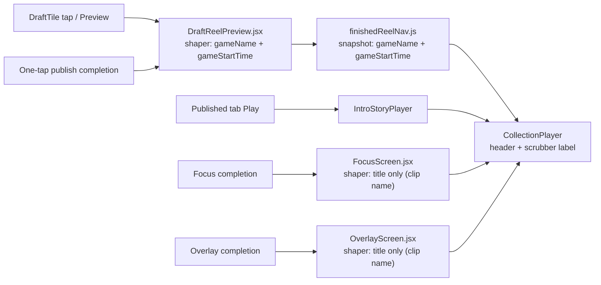
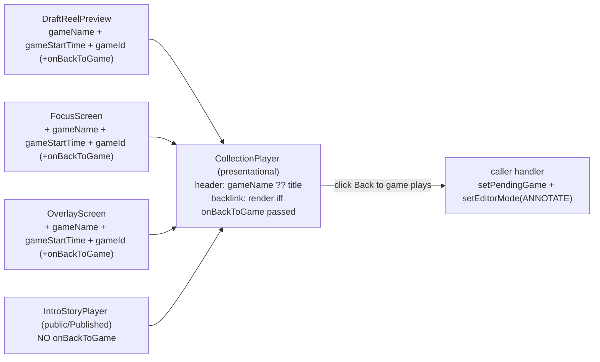

# T10190 Design: Result-surface title consistency, back-to-game backlink, and copy centralization

**Task file:** [T10190-result-title-consistency-backlink-copy.md](T10190-result-title-consistency-backlink-copy.md)
**Source investigation:** [T9890-decision-record.md](evaluation-2026-09-13/T9890-decision-record.md)
**Copy conventions reconciled against:** [T9860-design.md](T9860-design.md) (APPROVED, STAGING)
**Status:** APPROVED (user, 2026-09-21) — Option A (game name + game clock, Focus/Overlay aligned up).
**Written:** 2026-09-21
**Tier:** L (design-gated). Frontend-only, ~5 source files, no schema change, no backend change.

> This document is the approval gate. **Section 6 holds the ONE product decision that needs a yes
> or no** (the title-promotion rule). Everything else follows mechanically from it and from the
> verified current-state map below. File:lines were re-read against current master (post-T10180 /
> T10840) and supersede the stale citations in the T9890 record and the task file.

---

## 1. Current State Analysis

### 1.1 How a finished result reaches the screen today

Every finished-result entry point funnels to **one shared `CollectionPlayer`** (T9890 confirmed
routing is fine — the gaps are title shaping, backlink, and copy, not wiring). The header title is
derived inside `CollectionPlayer` from the reel payload each caller hand-builds:



`CollectionPlayer.jsx:472-484` header renders `activeReel.gameName` + `formatGameClock(activeReel.gameStartTime)`,
**falling back to the `title` prop when `gameName` is absent**. The scrubber segment label
(`:397-403 reelLabel`) mirrors the same rule. This is the shipped T3920/T5670 convention.

**CollectionPlayer is SHARED and strictly presentational.** Published reels, the `/shared` public
viewer, DownloadsPanel, IntroStoryPlayer, and RankingGame all mount it (T10180 Reviewer notes). It
must stay presentational — no fetching, no store reads, no game-context derivation inside it.

### 1.2 The divergence (gap 1)

Four independent hand-built reel-payload shapers feed the same header. Two feed game context and
two do not:

| Shaper | File:line | Feeds `gameName`? | Feeds `gameStartTime`? | Header shows |
|---|---|---|---|---|
| `DraftReelPreview` (DraftTile tap, one-tap publish) | `DraftReelPreview.jsx:99-110` | yes (`payload.gameName`) | yes (`payload.gameStartTime`) | **game name + clock** |
| `finishedReelNav` snapshot (feeds DraftReelPreview) | `finishedReelNav.js:38-48` | yes (`project.game_names?.[0]`) | yes (`project.clip_game_start_time`) | **game name + clock** |
| `FocusScreen` completion | `FocusScreen.jsx:1572-1594` | **no** | **no** | clip name (`title={project?.name}`) |
| `OverlayScreen` completion | `OverlayScreen.jsx:1825-1847` | **no** | **no** | clip name (`title={project?.name}`) |

Result: the exact same finished render shows **game name + game clock** when reached from the
library/one-tap/Published path, but the **clip name** when reached from a Focus or Overlay export
completion. Same artifact, two titles.

Landmine already resolved for us: `OverlayScreen` **already derives** `gameName` (`:174`) and a
**pre-formatted** `gameClock` string (`:175`, via `clipGameClock`) from `projectListItem` (`:173`,
a `useProjectsStore` find on `projectId`) — used elsewhere at `:1678`, just not wired into the
completion reels. CollectionPlayer wants the **raw** `gameStartTime` (it formats internally via
`formatGameClock`), so the fix feeds `projectListItem?.clip_game_start_time`, **not** the
pre-formatted `gameClock`.

### 1.3 No backlink (gap 2)

`CollectionPlayer` closes only via X / Escape → back to `ProjectManager`
(`DraftReelPreview.jsx:197`). The header game name is **static text, not a link**. No
source-annotation context (which game this result came from) is carried back. There is no
`onBackToGame` / "Back to game" anywhere (grep-confirmed by T9890).

Existing gesture path to reuse (already gesture-driven, rule-compliant):
- `App.jsx:673-691 handleEditInAnnotate` = `setPendingGame(gameId, startTime, sourceClipId)` then
  `setEditorMode(EDITOR_MODES.ANNOTATE)`.
- `App.jsx:662-667 handleLoadGame` = the simpler game-only variant.

Source game id availability per entry point:
- `finishedReelNav` snapshot: `project.game_ids?.[0]` **exists in DraftTile's project**
  (`DraftTile.jsx:105`) but is **not currently threaded** into the snapshot payload.
- `FocusScreen` / `OverlayScreen`: both are **in the editor**; Overlay has
  `projectListItem.game_ids`, Focus derives similarly via `useProjectsStore`.
- A multi-clip reel may have **0 or >1 source games** and `clip_game_start_time === null`.

### 1.4 Uncentralized copy (gap 3)

None of the 5 strings exist in `displayNames.js` today. The surface uses ad-hoc literals — e.g.
"Couldn't load this video." at the `CollectionPlayer.jsx:521` onError overlay, "Preview video"
(`DraftTile.jsx:748`), "Play video" (`ReelTile.jsx:352`). `displayNames.js` is organized as
`export const SOMETHING = { ... }` grouped blocks with heavy provenance comments (e.g.
`RESULT_PUBLISH`, `FOCUS_PUBLISH`). We follow that convention exactly: no em dashes, curly
apostrophes, one comment block naming this task and why.

### 1.5 Settled — do NOT reopen

- **T9470** loading / failure / retry / stall-detection state machine is correct and scoped to the
  requesting item/page. This design touches the **copy** of two of its strings only; the state
  machine, the scoping, and the recovery behavior are untouched.
- **E51** ("source substituted for finished media") does not reproduce; no viewer re-architecture.
- **T9470 recovery / E51** must not be reopened by the backlink wiring.

---

## 2. Target Architecture

### 2.1 Design principles applied

- **CollectionPlayer stays presentational.** It gains one **optional** `onBackToGame` prop. It does
  no derivation, no store read, no fetch. Callers decide whether to pass it.
- **Align UP, not down (title rule).** Focus/Overlay completion shapers are brought up to the
  shipped game-name+clock convention by feeding them the game context they already have (Overlay)
  or can derive the same way (Focus). Zero change to the header's existing fallback logic, zero
  regression to Published / public / library paths. See §6 for the decision.
- **Multi-clip / no-single-game reels fall back to `title`.** The header's existing
  `gameName ?? title` fallback already handles this. When a reel has 0 or >1 source games, the
  shaper feeds no `gameName` and no `onBackToGame`, so the header shows the clip/reel name and no
  backlink appears. This is intentional and unchanged.
- **Backlink is gesture-driven.** Button → handler → `setPendingGame` + `setEditorMode`. No
  reactive effect. Consistent with `handleEditInAnnotate`.
- **Copy centralized, one source.** Five strings move into `displayNames.js`; call sites read the
  constants.

### 2.2 Target diagram



### 2.3 Title-promotion rule, final (pending §6 approval)

**Recommended: Option A — game name + game clock**, the shipped majority convention. The four
shapers feed:

| Shaper | Add | Source |
|---|---|---|
| `DraftReelPreview` | (already correct) | unchanged |
| `finishedReelNav` snapshot | (already correct) + `gameId: project.game_ids?.[0]` for backlink | `project.game_ids?.[0]` |
| `FocusScreen` completion | `gameName`, `gameStartTime`, `gameId` | derive `projectListItem` via `useProjectsStore` find on `projectId`, same as Overlay |
| `OverlayScreen` completion | `gameName` (`:174`), `gameStartTime: projectListItem?.clip_game_start_time` (RAW, not the `:175` pre-formatted string), `gameId` | already-derived `projectListItem` |

**Multi-clip / no-single-game reels:** shaper omits `gameName` → header falls back to `title` (clip
or reel name). Confirmed to stay.

### 2.4 Backlink, final

- **Attach point:** `CollectionPlayer` header, as an explicit affordance next to (not replacing)
  the game name. **Decision: a dedicated button/link element labelled "Back to game plays", NOT
  making the game-name text itself the link** — an accessible named control is clearer than an
  ambiguously-clickable title, and keeps the title purely informational (a11y: the title is read as
  a heading; the backlink is read as a button/link with its own name).
- **Prop:** `onBackToGame` (optional). CollectionPlayer renders the affordance **iff the prop is
  passed**. Public `/shared` viewer, Published-tab (`IntroStoryPlayer`), DownloadsPanel, RankingGame
  **omit it** → no affordance, no cross-surface regression.
- **Gating:** callers pass `onBackToGame` **only when a single source game resolves** (`gameId`
  present, i.e. exactly one `game_ids` entry). Multi-game / no-game reels pass nothing.
- **Handler:** the caller wires `onBackToGame` to `handleEditInAnnotate(gameId, startTime,
  sourceClipId)` (or `handleLoadGame(gameId)` where clip/start context is unavailable). Gesture →
  handler → `setPendingGame` + `setEditorMode(ANNOTATE)`. No reactive effect. Does NOT touch T9470
  recovery.

### 2.5 The 5 copy strings, final

New block in `displayNames.js` (convention: `export const RESULT_SURFACE = { ... }`, one provenance
comment naming T10190). Curly apostrophes, no em dashes.

| Key | String | Renders where (file:line) | In scope? |
|---|---|---|---|
| `RESULT_SURFACE.WATCH_HIGHLIGHT` | `Watch finished highlight` | **card CTA**, `DraftTile.jsx:748` ("Preview video") | yes — card CTA, in scope |
| `RESULT_SURFACE.WATCH_MARKED_PLAYS` | `Watch marked plays` | **card CTA**, `ReelTile.jsx:352` ("Play video") | yes — card CTA, in scope |
| `RESULT_SURFACE.LOADING` | `Loading your highlight...` | CollectionPlayer skeleton (`:487-495`) | yes |
| `RESULT_SURFACE.LOAD_ERROR` | `Couldn't load the video. Try again.` | CollectionPlayer onError overlay (`:521`) | yes |
| `RESULT_SURFACE.BACK_TO_GAME` | `Back to game plays` | CollectionPlayer backlink (new, §2.4) | yes |

Note on the two card CTAs: they render on the **cards** (`DraftTile`, `ReelTile`), not in
CollectionPlayer chrome. They are the entry-point buttons that open the player. They are in scope —
the task lists all five as "the surface" and they are the label the user reads to open the result.
`LOADING` / `LOAD_ERROR` are CollectionPlayer chrome (T9470 machine text — copy-only swap, behavior
untouched). `BACK_TO_GAME` is the new affordance's label.

---

## 3. Implementation Plan (per file)

### 3.0 Copy first (everything else reads from it)

| File | Change |
|---|---|
| `src/frontend/src/config/displayNames.js` | `+ export const RESULT_SURFACE = { WATCH_HIGHLIGHT, WATCH_MARKED_PLAYS, LOADING, LOAD_ERROR, BACK_TO_GAME }` with a T10190 provenance comment (§2.5) |
| `DraftTile.jsx:748` | `"Preview video"` → `RESULT_SURFACE.WATCH_HIGHLIGHT` |
| `ReelTile.jsx:352` | `"Play video"` → `RESULT_SURFACE.WATCH_MARKED_PLAYS` |
| `CollectionPlayer.jsx:~487-495` | skeleton text → `RESULT_SURFACE.LOADING` |
| `CollectionPlayer.jsx:521` | `"Couldn't load this video."` → `RESULT_SURFACE.LOAD_ERROR` |

### 3.1 CollectionPlayer — optional backlink (presentational)

```pseudo
// CollectionPlayer.jsx — props
+ onBackToGame,   // optional; when absent, no backlink renders

// header, near the game-name text (:472-484)
  <h2>{activeReel.gameName ?? title}</h2>
+ {onBackToGame && (
+   <button type="button" onClick={onBackToGame}>
+     {RESULT_SURFACE.BACK_TO_GAME}
+   </button>
+ )}
```

No other CollectionPlayer logic changes. Title fallback (`gameName ?? title`) and scrubber label
(`:397-403`) are untouched — they already do the right thing once shapers feed `gameName`.

### 3.2 The 4 payload shapers (title context + backlink gating)

**Shaper 1 — `finishedReelNav.js:38-48`** (feeds DraftReelPreview; already feeds game name+clock):
```pseudo
  snapshot = {
    gameName: project.game_names?.[0],
    gameStartTime: project.clip_game_start_time,
+   gameId: project.game_ids?.length === 1 ? project.game_ids[0] : null,
  }
```

**Shaper 2 — `DraftReelPreview.jsx:99-110`** (mounts CollectionPlayer):
```pseudo
  reel = { gameName: payload.gameName, gameStartTime: payload.gameStartTime, ... }
+ onBackToGame passed to CollectionPlayer iff payload.gameId != null,
+   wired to handleEditInAnnotate(payload.gameId, payload.gameStartTime, payload.sourceClipId)
```
(DraftReelPreview must thread `gameId` through from the snapshot to its CollectionPlayer mount.)

**Shaper 3 — `FocusScreen.jsx:1572-1594`** (currently feeds NEITHER):
```pseudo
+ const projectListItem = useProjectsStore(find on projectId)   // same pattern as Overlay
+ const gameName = projectListItem?.game_names?.[0]
+ const gameStartTime = projectListItem?.clip_game_start_time   // RAW
+ const gameId = projectListItem?.game_ids?.length === 1 ? projectListItem.game_ids[0] : null
  reels = [{ ...,
+   gameName, gameStartTime,
  }]
- title={project?.name}   // stays as the fallback when gameName is null (multi/no-game)
+ onBackToGame passed iff gameId != null → handleEditInAnnotate(gameId, gameStartTime, sourceClipId)
```

**Shaper 4 — `OverlayScreen.jsx:1825-1847`** (already derives `gameName` `:174`, pre-formatted
`gameClock` `:175`, `projectListItem` `:173`):
```pseudo
  reels = [{ ...,
+   gameName,                                            // :174, already derived
+   gameStartTime: projectListItem?.clip_game_start_time // RAW — NOT the :175 pre-formatted gameClock
  }]
- title={project?.name}   // stays as fallback
+ const gameId = projectListItem?.game_ids?.length === 1 ? projectListItem.game_ids[0] : null
+ onBackToGame passed iff gameId != null → handleEditInAnnotate(gameId, gameStartTime, sourceClipId)
```

### 3.3 Public / Published surfaces — confirm untouched

`IntroStoryPlayer` (Published tab, `/shared` public viewer), DownloadsPanel, RankingGame mount
CollectionPlayer **without** `onBackToGame`. No change; assert by inspection + test that no backlink
renders there.

### 3.4 Out of scope (noted follow-up only)

**Payload-shaper consolidation (task item 4)** — folding the four hand-built shapers into one shared
shaper is the drift vector behind gap 1, but it is a refactor (characterization tests, <200-line
units) per the refactoring rules. **Not designed here.** File as a follow-up after this ships. Abstract
on the third duplication rule is satisfied, but the consolidation is deliberately deferred so this
task stays a targeted fix, not a refactor.

---

## 4. Design Decisions

| Decision | Options considered | Choice | Rationale |
|---|---|---|---|
| Title-promotion rule | A: game name+clock (align up); B: clip name (align down) | **A** (see §6) | A aligns two shapers up to the shipped majority with zero regression; B regresses every store/Published/public surface, the exact cross-surface risk the task warns of |
| Backlink attach point | header button/link; make game-name the link; footer | header **button** | Named control beats ambiguous clickable title (a11y); keeps title informational |
| Backlink coupling to CollectionPlayer | derive inside CollectionPlayer; optional prop | **optional `onBackToGame` prop** | CollectionPlayer is shared + presentational; public/Published must omit the affordance |
| Backlink gating | always show; show iff single source game | **iff single source game** | Multi/no-game reels have no unambiguous target; `game_ids?.length === 1` |
| Backlink handler | new nav path; reuse `handleEditInAnnotate` | **reuse `handleEditInAnnotate`** | Already gesture-driven, rule-compliant, carries game+clip+start context |
| Overlay `gameStartTime` source | pre-formatted `gameClock` (:175); raw `clip_game_start_time` | **raw** | CollectionPlayer formats internally via `formatGameClock`; feeding pre-formatted double-formats |
| Copy block name | extend existing block; new `RESULT_SURFACE` block | **new block** | Five strings share one surface + one provenance; matches `RESULT_PUBLISH`/`FOCUS_PUBLISH` convention |

---

## 5. Risks

| Risk | Mitigation |
|---|---|
| **Cross-surface regression to Published / public `/shared` viewer** (the big one) — CollectionPlayer is shared | Title change is additive (shapers feed `gameName`; header fallback unchanged), so Published/public are byte-identical. Backlink is opt-in via prop those callers never pass. **Required regression tests:** (a) `/shared` public viewer renders no backlink and unchanged title; (b) Published-tab (`IntroStoryPlayer`) renders no backlink; (c) DownloadsPanel / RankingGame unchanged. |
| **Focus/Overlay title now differs from before** (was clip name, becomes game name) | This is the intended fix (consistency). Regression test: Focus-completion and Overlay-completion headers now show game name + clock for a single-game reel, and fall back to clip name for a multi/no-game reel. |
| **Double-formatting the game clock** in Overlay if `:175 gameClock` is fed by mistake | §3.2 explicitly feeds RAW `clip_game_start_time`; test asserts the header clock equals `formatGameClock(clip_game_start_time)`. |
| **Backlink reopening T9470 recovery / E51** | Backlink is a pure navigation gesture (`setPendingGame` + `setEditorMode`); it does not touch the load state machine, the streaming source, or the item/page scoping. Test: clicking Back to game plays routes to Annotate with the right `pendingGame`, no player-state mutation. |
| **Multi-clip reel with >1 game shows a wrong backlink** | Gated on `game_ids?.length === 1`; >1 and 0 both omit the affordance and fall back to `title`. Test both. |
| **Live cross-entry validation not run in-container** (T9890 could not) | Mandatory QA per T13/task AC: open via DraftTile / one-tap / Published / Focus-completion / Overlay-completion, reload/back/forward, compare artifact IDs across entries, play ≥2s, and exercise the backlink from each editor path. Run where a backend venv + Playwright exist. |
| Copy swap changes a T9470 machine string | Copy-only; the state machine and its transitions are untouched. Update the two CollectionPlayer copy assertions in `CollectionPlayer.test.jsx`. |

**Curated relevant test set (~10):** `CollectionPlayer.test.jsx` (title fallback, backlink
render-iff-prop, copy), `DraftReelPreview.test.jsx` (gameId threaded, backlink wired),
`FocusScreen` completion-reel test, `OverlayScreen` completion-reel test (raw `gameStartTime`),
`finishedReelNav` test (gameId gating), `DraftTile.test.jsx` (CTA copy), `ReelTile.test.jsx` (CTA
copy), the `/shared` public-viewer spec (no backlink), the Published-tab / `IntroStoryPlayer` spec
(no backlink), plus the e2e cross-entry drive spec. Branch CI (frontend layer) is the full sweep.

---

## 6. The ONE decision that needs a yes or no

**Title-promotion rule on the shared `CollectionPlayer` header.**

- **Option A (RECOMMENDED): game name + game clock.** The shipped majority (DraftTile / one-tap /
  Published) + CollectionPlayer's current default + the scrubber label. Aligning Focus/Overlay UP to
  it means feeding them the game context they already have; **zero regression** to Published/public.
- **Option B: clip name.** What S08 in the original T13 brief suggested and what Focus/Overlay show
  today; but switching the header to clip-name would **regress every store / Published / public
  surface** — the cross-surface risk the task explicitly warns about.

**Reconciliation with T9860:** T9860 is a copy sweep and does **not** dictate this rule; the
T3920/T5670 game-name-over-clip-name convention stands unchallenged there. So A is consistent with
the current vocabulary, not a new divergence.

**Verdict:** Option A is clearly correct — it aligns the two outlier shapers up to the established,
lower-risk convention and leaves every high-traffic and public surface byte-identical. Option B
inverts a shipped, shared convention across public surfaces for the sake of two completion previews.

Multi-clip / no-single-game reels fall back to the clip/reel `title` under **either** option;
that fallback is preserved.

- [ ] **Approve Option A** (game name + game clock, Focus/Overlay aligned up), OR
- [ ] Choose Option B (clip name everywhere), accepting the Published/public regression + added
  regression-test burden.
