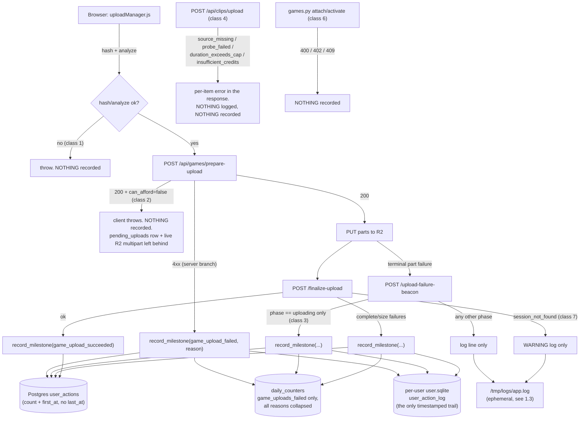
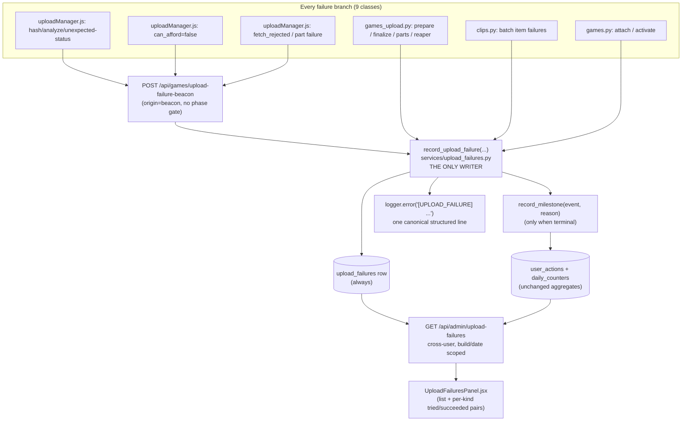

# T10270 Design: Upload-failure observability

**Task:** [T10270-upload-failure-observability.md](T10270-upload-failure-observability.md)
**Stage:** 2 (Architecture). **Status: WAITING ON USER** (design gate).
**Author:** Architect agent, 2026-09-17. Audited against HEAD `58645ae2`.

> **The one thing the user must rule on:** section 2 asks whether the new per-event
> upload-failure record lives in **Postgres** (recommended) or in a new
> **`upload_failures.sqlite` on R2**, because a standing 2026-08-20 directive for the
> Investor-Grade Analytics epic says new per-event state must NOT go into Postgres.
> Everything else in this document is the same either way.

---

## 1. Current state

### 1.1 What exists today



### 1.2 Code smells in the current shape

| Smell | Location | Impact |
|---|---|---|
| Shotgun surgery / missing seam | Every failure branch decides for itself whether to log, whether to record a milestone, and with what reason | 9 classes drifted out of sync; 4 of them do neither |
| Success-only denominator (reintroduced) | `clips.py:1953,1973,1978,2027` record nothing while `clip_uploaded` IS recorded | Clip-upload success is 100% by construction, the exact T7970 defect |
| Write-only dimension | `clip_upload_failed` has `daily_col: None` and no admin read surface (`analytics.py:214`) | Data is written and never read |
| Duplicated gate logic | `games_upload.py:736` hardcodes "the server saw preparing/finalizing" | False for `reason:'fetch_rejected'` (`uploadManager.js:194-199`), where no response ever arrived |
| Misattribution by omission | Class 2 leaves a `pending_uploads` row, which the reaper later labels `user_abandoned` (`games_upload.py:856-862`) | A billing/credit refusal is counted as a user who walked away |
| Copy-paste key derivation | `admin.py:984` hardcodes `games/{hash}.mp4`; its `SELECT` at :951 also omits `kind` | Live clip uploads are reported dead (the T8370 "column list omitting `kind`" landmine, again) |
| Aggregate cannot answer the operational question | `user_actions` has `count` + `first_at`, no `last_at`; `daily_counters` has no user and no reason | "Which uploads failed since build X, for whom, why" is unanswerable |

### 1.3 Why the logs did not save us

`main.py:66-79` writes `app.log` to **`/tmp/logs`** with `TimedRotatingFileHandler(when="midnight", backupCount=1)`.
That is at most 2 days of history, on a path that a Fly machine restart, suspend-resume, or deploy
wipes. `fly.production.toml` has no drain. `/api/_debug/logs` reads only the machine it lands on and
is gated by `DEBUG_ENDPOINTS_ENABLED`. So the richest channel (`[UPLOAD_BEACON]` /
`[UPLOAD_LIFECYCLE]`) is structurally unable to survive a deploy, which is exactly what the
2026-09-17 investigation hit.

---

## 2. THE DESIGN-GATE DECISION: where does the per-event record live

### 2.1 The conflict, stated plainly

**The directive (binding, 2026-08-20, Investor-Grade Analytics EPIC.md lines 15-20):**

> 3. **No data blow-up.** Aggregates only. Never store per-event rows in any shared store.
> 4. **No new Postgres data.** Postgres is the costliest part of the stack. Reports READ existing
>    PG tables; all NEW analytics state lives in a flat `analytics.sqlite` (drip.sqlite precedent:
>    env-prefixed R2 key, single-writer, etag-asserted upload, never enters the per-user CAS/sync
>    machinery).

**The counter-context:** a separate, earlier, more general "no new Postgres state" rule was
explicitly scope-corrected by the user on 2026-08-19 to NOT be a global architecture rule (new
cross-account/coordination state MAY use Postgres when it is the right tool). So Postgres is not
globally forbidden. But the analytics directive is narrower, more recent, and was stated for two
reasons: Postgres cost at scale, and a kids-privacy stance against accumulating per-event trails.

**The collision:** `upload_failures` is, literally, a new per-event Postgres table.

**The task author's argument:** it is a bounded operational record, not analytics (append-only,
90-day TTL, closed reason vocabulary, small, diagnostic). Evaluated below.

### 2.2 Option A: a Postgres table `upload_failures` (RECOMMENDED)

One append-only table in the shared Fly Postgres (schema in 3.2), written by one function called
from each of the 9 failure branches, expired after 90 days by the existing hourly cleanup loop, and
read by one new admin endpoint. The aggregates (`user_actions` / `daily_counters`) keep working
exactly as they do today; this table sits beside them as the per-event operational detail, in the
same file and the same style as the existing `bug_reports` table.

### 2.3 Option B: `upload_failures.sqlite` on R2 (the analytics.sqlite / drip.sqlite pattern)

A flat SQLite file at an env-prefixed R2 key, opened locally, appended to, and re-uploaded with an
etag compare-and-swap, never entering the per-user CAS/sync machinery. This is what the analytics
directive prescribes for new state. Two things to know before choosing it: the precedent module
does not exist yet (`services/analytics_store.py` from T7400 and `services/drip_store.py` from
T7230 are both still TODO, neither file is in the repo), and T7467 explicitly says a new table
should go into T7400's module rather than into a second parallel sqlite file. So Option B means
either landing T7400 first or building the store here, plus a write buffer and a CAS-conflict
policy for burst writes (see the comparison).

### 2.4 Option C: no new store at all (aggregates plus a log drain)

Extend what exists: emit `clip_upload_failed` from the 4 clip branches, add a
`clips_upload_failed` daily column, add reason-encoded actions for the attach/activate branches,
and put per-event detail only in a log drain. The cheapest option and the only one that keeps both
rules untouched; listed so the full spectrum is visible.

### 2.5 Comparison

| Dimension | A: Postgres table | B: sqlite on R2 | C: aggregates only |
|---|---|---|---|
| **Answers AC1** ("which uploads failed since build X, for whom, at what stage, why") | Yes, one SQL query | Yes, one SQL query against the downloaded file | **No.** `user_actions` has no `last_at` and cannot be date-scoped; `daily_counters` has no user and no reason |
| **Write pattern fit** | Many small independent writers (7+ request handlers, the beacon, the batch endpoint) each doing one INSERT. This is the shape Postgres exists for. Bounded by the existing `BoundedSemaphore(maxconn=10)` checkout gate in `pg.py` | Read-modify-write of a whole file under etag CAS. **Contention peaks exactly during an outage**, when 50 failures arrive in a minute. Needs a batching buffer (a second `_DailyCounterBuffer`) plus a conflict policy that either drops failure records or blocks an already-failing request | No new write path |
| **Multi-machine safety** | Safe by construction | "Single writer" is an assumption, not a guarantee: `fly.production.toml` has `auto_start_machines = true` and `hard_limit = 250`, so a second machine can exist. Two machines writing means a CAS refusal storm or silent loss | n/a |
| **Infrastructure readiness** | Table plus one migration. Everything else already exists | **The store does not exist.** T7400 and T7230 are both TODO. Option B either blocks on T7400 or builds the second parallel sqlite file T7467 warned against | Nothing to build |
| **Read path** | Existing admin handler shape (plain `def`, psycopg2, `_require_admin()`) | Needs download-if-newer on every admin read, per machine, before querying | Existing |
| **Precedent in this codebase** | `bug_reports` (pg.py:318-348) is ALREADY a per-event, per-row operational table in Postgres, with user text, a user agent, a build string, an admin list, filters and pagination. `upload_failures` is the same species with a shorter life | `analytics.sqlite` is the precedent for ANALYTICS state (cohorts, rollups, deploy log), which this is not | `user_actions` / `daily_counters` |
| **Storage cost (honest numbers)** | A row is roughly 300-400 bytes. A bad day is a few hundred failures; the T8160 outage would have produced low thousands over 2 days. Steady state at a 90-day TTL is single-digit MB; a pathological sustained outage is tens of MB. Relative to a Fly PG volume this is noise. The real Postgres cost is the machine, not the rows | Bytes in R2, effectively free | Zero |
| **Privacy / deletion guarantee** | `DELETE ... WHERE user_id = %s` inside the existing `_purge_user_data` chokepoint, plus a TTL sweep in the existing hourly loop. Auditable | Same TTL logic, but a delete means rewriting and re-uploading a blob, and older R2 object versions of that file can outlive the delete | Nothing per-event to delete |
| **Rule compliance** | **Violates the letter** of directive 4, arguably not its purpose | Complies | Complies |
| **Reversibility if it becomes a firehose** | Shorten the TTL (one constant) or drop the table (one migration) | Same | n/a |

### 2.6 Recommendation: Option A, fenced

Recommended, for four reasons:

1. **The rule's purpose is not what this table is.** Directive 4 was written for the analytics
   epic, whose per-event pressure is a general event firehose feeding cohort/retention reports
   (unbounded dimensions, unbounded time, growing with every user session). This table is a
   closed-vocabulary incident record for one funnel step, with a hard 90-day expiry, that no
   analytics report reads. The costed slope the rule guards against (rows growing with engagement)
   does not exist here: rows grow with FAILURES, and the entire point of the feature is to drive
   that number down.
2. **The precedent already sits in the same file.** `bug_reports` is a per-event Postgres
   operational record with more per-row text, no TTL, and an admin list. Ruling this table out
   while `bug_reports` stands would make the rule inconsistent rather than principled.
3. **Option B's write story is wrong for this workload, on the worst day.** Single-writer
   etag-CAS is correct for an admin-triggered full-rebuild rollup (T7400's actual design). It is
   the wrong primitive for many concurrent request handlers appending during an incident. Building
   a batching buffer plus a conflict policy to make it survivable is new machinery whose failure
   mode is losing the very records we are adding it for.
4. **Option B is not available yet.** Both precedent stores are unimplemented. Choosing B means
   either blocking a P1 observability fix behind T7400, or creating the second parallel sqlite file
   T7467 told us not to create.

**The fence (non-negotiable if A is approved; these are what make "bounded" true rather than
asserted):**

- **F1. Closed vocabularies.** `stage` and `reason` are frozensets validated by the writer. An
  unknown value is logged loudly and coerced to `unknown`; it never coins a new dimension.
- **F2. TTL is code, not a chore.** `DELETE FROM upload_failures WHERE occurred_at < now() -
  INTERVAL '90 days'` runs in the existing hourly `cleanup._do_cleanup()` (no new scheduler).
- **F3. One writer, no generic sink.** Exactly one function inserts (`record_upload_failure`).
  There is deliberately no `record_event(table, payload)`; a future "let's log X here too" needs
  its own task and its own review.
- **F4. It is purged with the user.** Added to `auth._purge_user_data` and to
  `scripts/delete_user.py`'s explicit table list (the T6090 lesson).
- **F5. Scope fence written down.** A line in `investor-analytics/EPIC.md` and in
  `.claude/knowledge/backend-services.md`: `upload_failures` is an operational incident record,
  NOT analytics; new ANALYTICS state still goes to `analytics.sqlite`, and no analytics report may
  read this table.

**If the user rules for Option B instead:** only sections 3.2 (storage) and 3.6 (read query)
change. The writer signature, the vocabularies, all 9 call sites, the admin surface, the
stuck-uploads fix, and the log drain are identical. To keep that true, the design puts all storage
access behind two functions in one module (`services/upload_failures.py`:
`record_upload_failure()` and `query_upload_failures()`), and nothing else touches the store. That
is a module boundary, not an abstraction layer: no interface, no strategy class, no registry (the
"abstract on the 3rd duplication" rule). Option B would additionally require landing T7400 first, a
write buffer with a flush interval, a documented CAS-conflict policy, and a decision about what
happens to failure records that lose a CAS race.

---

## 3. Target architecture (Option A)

### 3.1 Shape



**Design principles applied**

- [x] **DRY:** one writer fans out to the three sinks. A failure branch can no longer record a row
      without its log line, or a milestone without its row.
- [x] **Single code path:** `games_upload._record_upload_failure` (the current private helper) is
      replaced by the shared writer, so milestone emission lives in exactly one place.
- [x] **Minimal branches:** the beacon phase allowlist (`if phase == "uploading"`) is replaced by
      ONE boolean expression (3.4).
- [x] **No redundant state:** no new `clips_upload_failed` daily column. Failure counts come from
      the table; success counts keep coming from `daily_counters`.
- [x] **Data always ready at the view:** the admin endpoint returns rows AND both denominators;
      `UploadFailuresPanel` renders what it is given and never computes a rate from a missing half.

### 3.2 Schema

The same DDL text goes in BOTH `services/pg.py` `_SCHEMA_DDL` (fresh deployments) and the migration
file.

```sql
CREATE TABLE IF NOT EXISTS upload_failures (
    id                BIGSERIAL PRIMARY KEY,
    occurred_at       TIMESTAMPTZ NOT NULL DEFAULT now(),
    -- WHO. No FK to users(user_id): X-User-ID/e2e users legitimately have no
    -- Postgres users row (same reasoning as the credits table). A NULL user_id is
    -- an anonymous beacon, recorded honestly rather than dropped.
    user_id           TEXT,
    profile_id        TEXT,
    -- WHAT, closed vocabularies validated by the writer
    kind              TEXT NOT NULL,          -- UploadKind: 'game' | 'clip'
    stage             TEXT NOT NULL,          -- UPLOAD_STAGES (3.3)
    reason            TEXT NOT NULL,          -- UPLOAD_FAILURE_REASONS (3.3)
    terminal          BOOLEAN NOT NULL,       -- did this END the attempt (3.4)
    origin            TEXT NOT NULL,          -- 'server' | 'beacon'
    impersonated      BOOLEAN NOT NULL DEFAULT FALSE,
    -- DIAGNOSIS
    http_status       INTEGER,
    error_text        TEXT,                   -- writer-capped at 300 chars
    blake3_hash       TEXT,
    upload_session_id TEXT,
    r2_upload_id      TEXT,
    file_size         BIGINT,
    original_filename TEXT,                   -- writer-capped at 120 chars
    parts_total       INTEGER,
    parts_completed   INTEGER,
    attempt_no        INTEGER,
    elapsed_ms        INTEGER,
    platform          TEXT,                   -- get_current_platform()
    user_agent        TEXT,                   -- writer-capped at 200 chars
    -- WHICH BUILD (version.py). app_build is the ORDERABLE integer used for
    -- "since the last deploy"; commit_sha is for human correlation only.
    app_build         INTEGER NOT NULL DEFAULT 0,
    commit_sha        TEXT
);
CREATE INDEX IF NOT EXISTS idx_upload_failures_occurred ON upload_failures(occurred_at DESC);
CREATE INDEX IF NOT EXISTS idx_upload_failures_build    ON upload_failures(app_build, occurred_at DESC);
CREATE INDEX IF NOT EXISTS idx_upload_failures_user     ON upload_failures(user_id);
CREATE INDEX IF NOT EXISTS idx_upload_failures_kind     ON upload_failures(kind, reason);
```

**Refinements against the task file's sketch, and why:**

| Task sketch | Design | Reason |
|---|---|---|
| `build_sha` | `app_build INTEGER` plus `commit_sha TEXT` | `version.py` already documents that a git sha is NOT orderable and that `APP_BUILD` (`git rev-list --count HEAD`) is the monotonic truth. "Since the last deploy" needs the orderable one. Keeping the sha too costs nothing and is what `/api/version` reports |
| (absent) | `terminal BOOLEAN` | The honest split between "a failure event was observed" and "this attempt is over". It is what keeps rates from double-counting once the beacon phase gate is removed (3.4) |
| (absent) | `impersonated BOOLEAN` | `record_milestone` DROPS everything during impersonation (correctly, for analytics). An admin reproducing an upload failure is diagnostically valuable, so the ROW is written with the flag set while the aggregate is still skipped. The admin list filters it out by default |
| `reason` = `MILESTONE_REASONS` plus extras | Two vocabularies plus a total mapping (3.3) | Passing `probe_failed` to `record_milestone` today logs "Unknown failure reason" and silently degrades to `unknown` (`analytics.py:603-607`). The precise reason belongs in the row; the coarse one belongs in the aggregate |

### 3.3 Vocabularies (in `services/upload_failures.py`, next to the writer)

```python
UPLOAD_STAGES = frozenset({
    "hashing",     # client: hash / faststart analyze, before any server call
    "preparing",   # POST /prepare-upload, and the client-side checks on its response
    "uploading",   # part PUTs to R2, PATCH /upload/{id}/parts
    "finalizing",  # POST /finalize-upload
    "creating",    # POST /api/games (pending insert)
    "attaching",   # POST /api/games/{id}/videos
    "activating",  # game activation
    "batching",    # POST /api/clips/upload (per item)
})

UPLOAD_FAILURE_REASONS = frozenset({
    # carried over from analytics.MILESTONE_REASONS
    "timeout", "network", "refused", "sync_failed", "user_abandoned",
    "r2_rejected", "unknown",
    # precise operational reasons (new; NEVER passed to record_milestone directly)
    "hash_timeout", "analyze_failed", "unexpected_status", "fetch_rejected",
    "insufficient_credits", "probe_failed", "source_missing",
    "duration_exceeds_cap", "size_over_cap", "session_not_found",
    "size_mismatch", "game_not_ready",
})

# TOTAL map: every UPLOAD_FAILURE_REASONS member has an entry. A test asserts
# totality, so adding a reason without deciding its coarse bucket fails RED.
MILESTONE_REASON_BY_UPLOAD_REASON = {
    "hash_timeout": "timeout",          "analyze_failed": "unknown",
    "unexpected_status": "refused",     "fetch_rejected": "network",
    "insufficient_credits": "refused",  "probe_failed": "refused",
    "source_missing": "sync_failed",    "duration_exceeds_cap": "refused",
    "size_over_cap": "refused",         "session_not_found": "refused",
    "size_mismatch": "network",         "game_not_ready": "refused",
    # identity for the seven carried-over reasons
}
```

`size_over_cap` is reserved for T10250 (the task file names it as a feeder); registering it now
costs nothing and prevents an "unknown reason" drop when T10250 lands.

### 3.4 The writer, and the one boolean that replaces the phase gate

```pseudo
def record_upload_failure(
        *, kind, stage, reason, terminal, origin="server",
        user_id=None, http_status=None, error_text=None, blake3_hash=None,
        upload_session_id=None, r2_upload_id=None, file_size=None,
        original_filename=None, parts_total=None, parts_completed=None,
        attempt_no=None, elapsed_ms=None, user_agent=None):
    # CONTRACT: never raises, never retries. Observability must never break the
    # upload's own error path (the existing _record_upload_failure contract,
    # preserved). Every failure inside is swallowed and logged.
    validate stage in UPLOAD_STAGES else log + "unknown"        # F1
    validate reason in UPLOAD_FAILURE_REASONS else log + "unknown"
    user_id = user_id or current user (may be None: anon beacon)
    profile_id = current profile, or None   # descriptive field; its absence is a
                                            # real unknown, stored as NULL, not faked
    impersonated = get_current_impersonator_id() is not None

    1. INSERT one row (always)                       -> the durable record
    2. if terminal and not impersonated:             -> the aggregate, unchanged
           record_milestone(
               "clip_upload_failed" if kind == CLIP else "game_upload_failed",
               reason=MILESTONE_REASON_BY_UPLOAD_REASON[reason])
    3. logger.error("[UPLOAD_FAILURE] " + the same fields, one canonical line)
```

**Where the beacon's phase gate goes.** Today: `if phase == "uploading"` (a hardcoded allowlist
that is wrong for `fetch_rejected`). Target: the beacon ALWAYS writes a row, and the aggregate
question becomes a single expression:

```pseudo
# The failure is already counted by a server branch IFF the server actually
# answered. That is the real invariant the old allowlist was approximating.
server_responded = payload.get("server_responded")
if server_responded is None:
    # Back-compat for clients built before this change: exactly reproduces the
    # old gate. Delete once builds roll over (the T5070 build gate nudges reloads).
    server_responded = phase in ("preparing", "finalizing")
record_upload_failure(..., origin="beacon", terminal=not server_responded)
```

The client sets `server_responded: true` at its two response-driven beacon sites
(`uploadManager.js:714` prepare `!res.ok`, and the finalize equivalent) and `false` everywhere
else. One boolean, one expression, no allowlist, no per-phase branching.

**Loop-safety.** `record_upload_failure` is a plain synchronous function (blocking psycopg2).
`async def` handlers MUST call it as `await run_in_context(record_upload_failure, ...)` per the
T6200 cardinal rule; plain `def` handlers call it directly (they are already on the anyio pool).
`run_in_context` takes positional args only, so the call site passes a prepared payload rather than
keywords. This is stricter than the status quo (`finalize_upload` calls `record_milestone` inline
on the loop today); the new writer must not widen that existing violation.

### 3.5 Call-site wiring: all 9 classes

| # | Class | Where | Call |
|---|---|---|---|
| 1 | Pre-prepare client death | `uploadManager.js:605-615` (`hashAndAnalyze` timeout), `analyzeMp4Faststart` throw, `:755` unexpected status | Beacon, `stage=hashing` / `preparing`, `reason=hash_timeout` / `analyze_failed` / `unexpected_status`, `server_responded=false` |
| 2 | `can_afford === false` after a successful prepare | `uploadManager.js:727-733` | Beacon, `stage=preparing`, `reason=insufficient_credits`, `server_responded=false`. **Plus:** call the existing `DELETE /api/games/upload/{session_id}` so the R2 multipart and the `pending_uploads` row are cancelled honestly instead of being reaped later as `user_abandoned` |
| 3 | Beacon phase gate | `games_upload.py:736` | Replaced by the `server_responded` expression (3.4). The row is always written |
| 4 | Clip batch endpoint | `clips.py:1953,1973,1978,2027` | Server, `kind=clip`, `stage=batching`, reasons `source_missing` / `probe_failed` / `duration_exceeds_cap` / `insufficient_credits`, `terminal=true`, ONE ROW PER FAILED ITEM (a 5-item batch with 5 bad items is 5 rows; the denominator is items, and the admin UI says so) |
| 5 | `clip_upload_failed` write-only | `analytics.py:214` | No new daily column. The admin list is the read surface, scoped by `kind='clip'` |
| 6 | Attach / activate | `games.py:354-361` (`_validate_video_in_r2` 400), `:726-732` (409 `game_not_ready`), `:760-767` (402), `:949-955` | Server, `stage=attaching` / `activating`, reasons `source_missing` / `game_not_ready` / `insufficient_credits`, `terminal=true` |
| 7 | Warning-only server branches | `games_upload.py:507-512` (finalize `session_not_found`), `:653` (PATCH parts 404) | Server, `stage=finalizing` / `uploading`, `reason=session_not_found`, `terminal=true` (the client cannot resume either one) |
| 8 | No filename and no size in any failure line | writer plus beacon payload | `original_filename` and `file_size` become row columns; the client adds `original_filename` to every beacon payload (it has `file.name` at every one of those sites) |
| 9 | `stuck-uploads` clip-key bug | `admin.py:951,984` | See 3.7 |

Existing server branches that already call `_record_upload_failure` (finalize complete-failure,
size mismatch, prepare validation, cancel) switch to the shared writer with their precise reason.
Net effect: the private helper in `games_upload.py` is deleted, not duplicated.

### 3.6 Admin read surface

`GET /api/admin/upload-failures` (plain `def`, `_require_admin()` as the first line, per T8020):

| Param | Default | Meaning |
|---|---|---|
| `since_build` | current `APP_BUILD` | "Since the last deploy", using the orderable build number. This deliberately does NOT depend on T7467's deploy log (still TODO) |
| `since` / `until` | derived from `since_build` | Explicit UTC date window; overrides `since_build` when given |
| `kind`, `stage`, `reason`, `user_id`, `origin` | none | Filters |
| `include_impersonated` | `false` | Keeps admin reproductions out of the default view |
| `limit` / `offset` | 100 / 0 | Pagination (the list is a drill-down, so it stays OUT of the combined `/api/admin/dashboard` fetch) |

Response:

```jsonc
{
  "window": { "since_build": 4812, "commit_sha": "58645ae2",
              "since_date": "2026-09-16", "until_date": "2026-09-17",
              "rows_at_this_build": 37 },
  "rows": [ /* newest first, one object per upload_failures row */ ],
  "total": 37,
  "rates": {
    "game": { "attempts": 61, "succeeded": 54, "failed": 7,  "rate_pct": 88.5 },
    "clip": { "attempts": 22, "succeeded": 18, "failed": 4,  "rate_pct": 81.8,
              "denominator_note": "outcome-based: clip_upload_attempted is not emitted yet (T8380)" }
  }
}
```

The default window resolves as `MIN(occurred_at)::date` among rows at the current `app_build`,
falling back to today when there are none yet (an honest "no failures recorded on this build").

**Honesty rules baked into the shape (per `feedback_tries_vs_success_must_both_show`):**

- `game` and `clip` are SEPARATE objects. They are never summed into one "upload success" number.
- Every rate ships with `attempts`, `succeeded` and `failed`. A rate never travels alone.
- `rate_pct` is `null` when `attempts == 0`, so the UI renders "--" rather than a fake 0% or 100%
  (the existing pulse-card convention, `admin.py:2097-2100`).
- **Mixed-grain disclosure.** Successes come from `daily_counters` (day-keyed:
  `game_uploads_succeeded`, `clips_uploaded`); failures come from `upload_failures` (exact
  timestamps, counted with `terminal = true`). So the RATE window is whole UTC days while the LIST
  is exact. The response says so in `window`, and the UI prints it. This is the same day-granularity
  ceiling T7467 documented; we disclose it rather than pretend precision.
- The clip denominator is outcome-based because `clip_upload_attempted` exists in `FLOW_EVENTS`
  but is not emitted anywhere yet (T8380 owns that gesture). The note ships with the number.

**Pre-migration tolerance.** The handler wraps its query in a `to_regclass('upload_failures')`
check (the T6090 pattern) and returns `{"migrated": false}` instead of a 500 if the deploy has
landed but `POST /api/admin/migrate-postgres` has not run yet.

**Frontend:** a new `components/admin/UploadFailuresPanel.jsx` (table plus filter chips plus the two
rate pairs), fed by a new `adminStore.fetchUploadFailures` action, rendered on `AdminScreen` beside
the existing Pulse cards. Container/view split as usual: the panel receives rows and rates as props,
does no fetching, and does no null-guarding of the rate halves.

### 3.7 The `stuck-uploads` clip-key bug (class 9)

```pseudo
// admin.py:951  SELECT id, blake3_hash, ... FROM pending_uploads
- explicit column list that omits `kind`   // the exact T8370 landmine: the column
                                           // exists in the TABLE but not in the ROW,
                                           // so any kind-aware read silently sees 'game'
+ SELECT *                                 // matches finalize_upload's pattern

// admin.py:984
- r2_key = f"games/{row['blake3_hash']}.mp4"
+ kind   = _pending_kind(row)              // reuse games_upload's existing helper
+ r2_key = upload_object_key(kind, row["blake3_hash"], user_id)
```

Also return `kind` in each result object so the operator can see what they are looking at.

### 3.8 Log drain

The table makes the LOGS non-critical for diagnosis: every fact the `[UPLOAD_BEACON]` and
`[UPLOAD_LIFECYCLE]` lines carried is now a queryable column with a 90-day life. That covers
"diagnose a failure four days later" with no new infrastructure.

What it does NOT cover is AC4 as literally written ("`[UPLOAD_*]` log lines survive a deploy and
are readable 7 days later"), which is about raw log retention generally. Options:

| Option | What it is | Cost |
|---|---|---|
| **D1 (in scope)** | One canonical `[UPLOAD_FAILURE]` line emitted by the writer, carrying the same fields as the row, so log and row can never disagree | Zero. Included in 3.4 |
| **D2 (recommended as a separate task)** | A real drain: `fly-log-shipper` (a separate Fly app running Vector, consuming the org's NATS log stream) with an **R2 sink** using credentials we already have, under a `logs/` prefix with a lifecycle expiry | A new deployed app, its own secrets, its own failure mode. No new vendor and no subscription, which fits the in-house stance better than Axiom or Better Stack |
| **D3** | Third-party sink (Axiom or Better Stack free tier) | Fastest to stand up; adds a vendor and a data-egress question the kids-privacy stance makes worth discussing |

**Recommendation:** ship D1 in this task and file D2 as a follow-up infra task. The drain is a
different kind of work (a Fly app plus Vector config, no application code) and it is not what makes
the acceptance criteria answerable. Open question Q3 asks the user to confirm this split.

---

## 4. Implementation plan (slices)

Each slice is independently reviewable and under roughly 200 lines of meaningful diff.

| Slice | Content | Files |
|---|---|---|
| **A. Store plus writer** | Vocabularies, `record_upload_failure`, the migration, `_SCHEMA_DDL`, the TTL sweep, purge wiring | `services/upload_failures.py` (new), `migrations/postgres/v0NN_upload_failures.py` (new), `services/pg.py`, `services/cleanup.py`, `routers/auth.py` (`_purge_user_data`), `scripts/delete_user.py` |
| **B. Server call sites** | Replace `games_upload._record_upload_failure`; wire classes 4, 6 and 7; beacon gate becomes `server_responded` | `routers/games_upload.py`, `routers/clips.py`, `routers/games.py` |
| **C. Client call sites** | Beacon payload gains `original_filename` and `server_responded`; new beacons for classes 1 and 2; cancel the session on `can_afford === false` | `services/uploadManager.js`, `hooks/useClipUpload.js` |
| **D. Admin read** | Endpoint plus rates plus the `to_regclass` guard; `UploadFailuresPanel`; the `adminStore` action | `routers/admin.py`, `components/admin/UploadFailuresPanel.jsx` (new), `stores/adminStore.js`, `screens/AdminScreen.jsx` |
| **E. Bug fix** | `stuck-uploads` clip key plus `kind` in the SELECT and the response | `routers/admin.py` |

Slices A and E are independent of the rest; E could ship first as its own commit (it is a live
misreporting bug).

**Test scope (the relevant set, roughly 10 tests, not a suite):**
`tests/test_t10270_upload_failures.py` (new: vocabulary totality, the writer's "never raises"
contract, terminal gating, the impersonation flag, the TTL sweep, purge), `tests/test_admin.py`
(the new endpoint plus the stuck-uploads clip key), `tests/test_analytics_dashboards.py` (rates stay
paired, pulse card unchanged), `tests/test_migrations.py` (head derived from the registry, never
hardcoded), `uploadManager.test.js` (beacon payload fields plus `server_responded`),
`AdminScreen.test.jsx` (the panel does not join the single mount fetch).

---

## 5. What the Migration agent must do

1. **Verify the head number before choosing one.** The postgres track head on this branch is
   **v028** (`migrations/postgres/v028_bug_reports_client_id.py`, the last entry in `MIGRATIONS`;
   `RUNNER = MigrationRunner(MIGRATIONS, floor=0)`). There is no v029 in the postgres track today.
   **Do not assume v029 is free:** an unmerged sibling branch may have claimed it (this has bitten
   the project twice: T7510 had to land at v024 because T7550 took v023; T5770 had to land at v022).
   Before numbering, run:
   ```bash
   git fetch --all --prune
   git log --all --diff-filter=A --name-only -- 'src/backend/app/migrations/postgres/*' | sort -u
   ```
   and take the lowest free number above the current head. Never renumber below an applied version.
2. **New file** `src/backend/app/migrations/postgres/v0NN_upload_failures.py`, a `BaseMigration`
   subclass with `version`, `description` and `up(conn)` running the 3.2 DDL (idempotent
   `CREATE TABLE IF NOT EXISTS` plus `CREATE INDEX IF NOT EXISTS`).
3. **Register it** in `migrations/postgres/__init__.py`: import plus append to `MIGRATIONS` in
   ascending order. Leave `floor=0` (postgres is exempt from the floor mechanism by design).
4. **Mirror the DDL in `_SCHEMA_DDL`** (`services/pg.py`) so fresh deployments get the table
   without running migrations. The two texts must match.
5. **No hardcoded head in tests.** Derive the head from the registry (`test_migrations.py` already
   uses dynamic invariants). A test asserting "head == 29" is the fragility pattern this project has
   already been burned by.
6. **Post-deploy, per environment:** `POST /api/admin/migrate-postgres` with an admin session
   (staging first, then prod). Postgres is the one track that does NOT self-migrate; there is no JIT
   seam for it.
7. **Deploy-window behavior is safe by construction, and must be proven:** the writer swallows all
   exceptions, so a pre-migration `UndefinedTable` degrades to a logged warning and the upload's own
   error path is unaffected; the admin endpoint's `to_regclass` guard returns `{"migrated": false}`
   instead of a 500. Add a test for both.

---

## 6. Risks

| Risk | Mitigation |
|---|---|
| The table becomes the camel's nose for per-event Postgres state | Fence F3 (one writer, no generic sink) plus F5 (the scope line written into EPIC.md and the knowledge doc). A second table needs its own design gate |
| Removing the beacon phase gate double-counts failures in the aggregate | `terminal = not server_responded` is the single gate; the back-compat default reproduces today's behavior exactly for old clients. Regression test: a prepare-failure beacon plus its server branch produces TWO rows and ONE milestone |
| An upload outage floods the table | Rows are bounded by real failures and expire at 90 days; the insert is one statement under the existing `maxconn` semaphore. If a pathological burst ever matters, the TTL constant is the knob |
| PII in `original_filename` and `user_agent` | Capped lengths, admin-only read, 90-day TTL, deleted on account delete. Flagged as open question Q2, since it is the one genuinely child-identifying field and the user owns that stance |
| A new blocking PG call on the event loop in `async` handlers | `run_in_context` at every async call site; a concurrency test in the spirit of `test_t9130_publish_burst_concurrency.py` |
| The new admin panel slows the admin dashboard | It is a separate fetch with pagination, deliberately not folded into `/api/admin/dashboard`; `AdminScreen.test.jsx` keeps asserting exactly one mount request for the combined endpoint |
| Migration version collision with an unmerged sibling | Section 5 step 1 makes verification mandatory, not assumed |
| Scope creep from the class-2 cancel call | Limited to calling an endpoint that already exists (`DELETE /api/games/upload/{session_id}`); no new server behavior |

---

## 7. Open questions for the design gate

- [ ] **Q1 (the ruling that matters): a Postgres table (Option A, recommended, fenced) or
      `upload_failures.sqlite` on R2 (Option B)?** Section 2 has the full comparison. Option B also
      means blocking this task behind T7400, which has not started.
- [ ] **Q2: store `original_filename` and `user_agent`?** They are the highest-value diagnostic
      fields (matching a user's report to a row) and the only privacy-sensitive ones. Recommended:
      store both, capped, admin-only, TTL'd and purged with the account. Alternative: store only the
      file extension and the size.
- [ ] **Q3: split the log drain (D2) into its own task?** Recommended yes; this task then ships D1
      (one canonical structured line whose facts are all in the table) and AC4 is re-scoped to "the
      upload-failure facts survive a deploy and are readable 90 days later".
- [ ] **Q4: is the class-2 fix (cancel the upload session when `can_afford === false`) in scope?**
      It is about 5 lines on the client and it stops a credit refusal being mislabeled
      `user_abandoned`. Recommended: yes.
- [ ] **Q5: 90 days, or shorter?** 30 days answers "since the last deploy" for every realistic
      deploy cadence and cuts the stored footprint by two thirds. 90 gives a quarter of history for
      trend questions. Recommended: 90, revisit if the volume ever surprises us.

---

## 8. Acceptance criteria mapping

| Criterion | Covered by |
|---|---|
| A single query answers "which uploads failed since build X, for whom, at what stage, why" | 3.2 schema (`app_build`, `user_id`, `stage`, `reason`) plus the 3.6 endpoint |
| Every failure branch writes a row (test each with a forced failure) | The 3.5 table (all 9 classes) plus slice B and C tests |
| The admin list is date-scoped and cross-user; clip and game rates separate and paired | The 3.6 response shape plus the honesty rules |
| `[UPLOAD_*]` lines survive a deploy and are readable 7 days later | D1 in scope; D2 pending Q3 (the proposed re-scope is stated explicitly) |
| Migration file plus `_SCHEMA_DDL`; Migration agent included | Section 5 |
