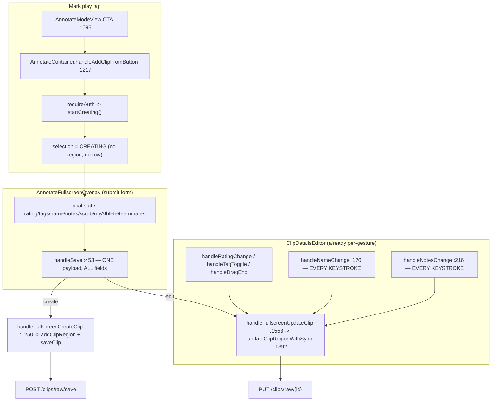
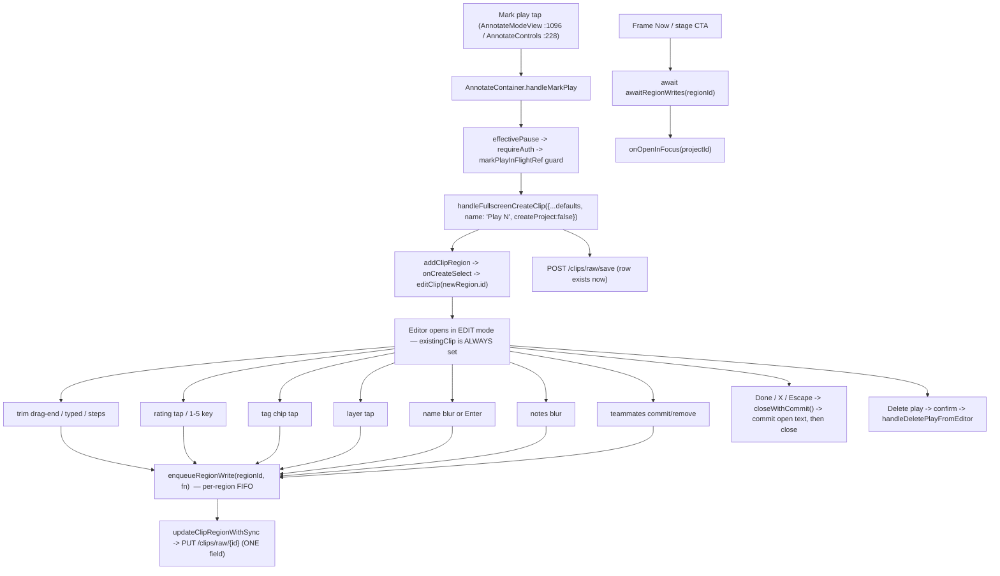

# T10600 Design: per-gesture autosave model for the play editor

**Status:** APPROVED (v2)
**Approved:** 2026-09-19 by the user, after the v2 review below was folded in
**Author:** Architect Agent; v2 revisions by the supervisor review 2026-09-19
**Created:** 2026-09-19
**Revision log:** v2 folds in seven review findings, each verified against the code before
being applied: (1) the create POST is queued as the head of the region chain — the editor
opens with the POST in flight, so the v1 "guaranteed by construction" claim in § C.3 was
false; (2) `rawClipId` is recorded in a ref-owned map synchronously on the SAVE path, because
`setRawClipId` is React state and a re-read of `clipRegionsRef` in the next microtask is not
guaranteed fresh; (3) failure tracking is per payload key, not per region, and Retry routes
THROUGH the queue — otherwise a successful rating write after a failed trim let Frame
navigate on stale bounds; (4) Delete is queued behind pending writes; (5) every commit
handler carries a clean-check, not just the text ones; (6) ONE Escape rule across every
layout and both editors; (7) the sidebar `(auto)` label must read `isDefaultPlayName`.
**Epic:** [play-editor-autosave/EPIC.md](play-editor-autosave/EPIC.md) (task 1 of 4)
**Implements the mechanism for:** EPIC decisions D1-D8 (already user-approved; this doc does not revisit them)
**Sole consumer:** T10610 (L-tier implementation). Every instruction below is binding on T10610 unless the user changes it here.

---

## 0. Binding constraints (read before anything else)

1. **Zero `useEffect`-driven backend/store writes.** Every write in this design is named
   with its gesture in § 2.2. A `useEffect` that seeds *local component state* from props
   (the `[region.id]` re-seed, `currentTimeRef` mirrors) is NOT a write and is explicitly
   allowed — it is the pattern `ClipDetailsEditor.jsx:125-128` already uses. A `useEffect`
   that calls `onUpdate` / `updateClipRegionWithSync` / any API is a design rejection.
2. **No debounce timers.** Commit points are blur / Enter / drag-end / tap only (D3).
3. **One seam, not two.** Every write routes through the existing
   `AnnotateContainer.updateClipRegionWithSync` -> `useRawClipSave.updateClip` ->
   `PUT /api/clips/raw/{id}` path. No new persistence mechanism, no backend change.
4. **One text-commit pattern for BOTH editors.** The overlay and the sidebar
   (`ClipDetailsEditor`) get the *same* local-echo + commit-on-blur shape (§ B). A
   `{persist:false}` option on `updateClipRegionWithSync` is REJECTED: it would add a second
   code path through the one seam and hide "does this write?" behind an argument.
5. **Abstract on the 2nd copy only where the copy is literal.** One extraction is sanctioned
   here (`DeletePlayButton`, § D); everything else stays in place.
6. **Every commit handler is a no-op when clean.** Text, trim, rating, tags, category,
   teammates: each compares the gesture's value to the stored region value and returns without
   enqueuing when equal. A no-op tap on a touch trim handle must not cost a durable PUT + R2
   round trip (v2 finding 5).
7. **Every write, delete, and retry on a region goes through that region's queue.** The create
   POST is the chain head; the DELETE is the chain tail; Retry re-enqueues. Nothing touches
   `raw_clips` for a region outside its chain (v2 findings 1, 3, 4).
8. **ONE Escape rule, everywhere.** Escape inside a focused text field reverts that field's
   draft to the stored value and blurs WITHOUT writing (the only discard that survives D1).
   Escape anywhere else = `closeWithCommit`. Same rule in all four overlay layouts and in the
   sidebar (v2 finding 6).

---

## 1. Current State ("As Is")

### 1.1 Data flow today



### 1.2 Current behavior (pseudo)

```pseudo
tap "Mark play":
    pause; requireAuth: startCreating()          // nothing exists yet
open editor in CREATE mode (existingClip === null)
user edits N fields -> N setState calls, ZERO writes
click "Save play":
    saveInFlightRef guard
    build ONE payload with all 9 fields (even the 8 untouched ones)
    await create-or-update                        // create/edit fork inside the editor
    on success: setSaveStatus('saved'); onResume() -> closes
    on failure: setSaveStatus('error'); stay open
click "Cancel" / X / Escape:
    onClose()  -> in create mode the whole play is DISCARDED

sidebar name field:
    every keystroke -> onUpdate({name}) -> PUT + durable R2 round trip  // ~66-205ms each
```

### 1.3 Code smells being paid off

| Smell | Location | Impact |
|---|---|---|
| Submit-form in an autosave app | `AnnotateFullscreenOverlay.handleSave` :453-565 | Two persistence models in one screen; "unsaved" states that nothing else in the app has |
| Two create paths for one object | `handleFullscreenCreateClip` :1250 vs `updateClipRegionWithSync` SAVE branch :1454-1494 | Divergent behavior; T10240 had to build a shared return shape to paper over it |
| Per-keystroke durable write | `ClipDetailsEditor.handleNameChange` :170, `handleNotesChange` :216 | One PUT + R2 upload **per character**; typing serializes behind R2 (T4320: p95 66-205ms) |
| Whole-payload write on a one-field edit | `handleSave` :496-521 | A notes edit re-sends `name`, `rating`, `tags`, trim — last-write-wins clobber surface |
| Temporal coupling, no ordering guarantee | `updateClipRegionWithSync` is fire-per-call | Trim drag-end + Frame 100ms later can land out of order |
| Speculative generality left inert | `focusPending` / `stagePendingCta` / `pendingProjectClipId` / `onResumePlaybackOnly` (T9330, dead since T10290) | Dead branches still rendered + still tested via direct prop injection |
| Stale-closure read in the unsaved-clip SAVE path | `updateClipRegionWithSync` :1460-1470 reads `region` captured at call time | Flagged by T9630 as a real (unconfirmed) race; **§ C fixes it structurally** |
| Constant duplicated with two different values | `DEFAULT_RATING` = 4 (`AnnotateFullscreenOverlay.jsx:63`, `useAnnotate.js:218`) vs `DEFAULT_RATING` = 3 (`clipConstants.js:51`) | Same name, different numbers, three files — a landmine for anyone "single-sourcing" it naively |

### 1.4 Limitations this epic removes

- A play does not exist until Save, so Cancel/Escape/close silently destroys work (D1/D6).
- The editor carries a create/edit fork that every feature since T9330 has had to special-case.
- No ordering guarantee between a trim and a Frame (D4).
- The sidebar's per-keystroke write is a live performance/consistency landmine (D3).

---

## 2. Target State ("Should Be")

### 2.1 Data flow after T10610



### 2.2 The gesture -> write table (this IS the persistence contract)

| Control | Named gesture | Handler (after T10610) | Payload sent |
|---|---|---|---|
| Mark play | tap | `AnnotateContainer.handleMarkPlay` | `POST /clips/raw/save` full create row (the tap IS the gesture) |
| Trim start/end (drag, typed `TrimTimeField`, step chevron) | `ClipScrubRegion.onDragEnd(finalStart, finalEnd)` (typed/steps arrive via `onCommitComplete`, T9480) | overlay `handleTrimCommit` / sidebar `handleDragEnd` :210 | `{startTime, endTime}` |
| Rating | tap in `RatingBadge` popup, or `1`-`5` key | `handleRatingChange` | `{rating}` |
| Tags | chip tap | `handleTagToggle` | `{tags}` (full array — it is one field) |
| Play category | segmented-control tap | `LayerSegmentedControl.onChange` | `{my_athlete}` or `{my_athlete:true, tagged_teammates:[]}` (T5725, one gesture) |
| Clip name | input **blur**, or **Enter** | `commitName` | `{name}` |
| Notes | textarea **blur** | `commitNotes` | `{notes}` |
| Teammates | Enter-commit / remove chip | `handleTeammatesChange` | `{tagged_teammates}` |
| Frame Now / Frame Later / stage CTA | click | `handleFrameNow` / `handleFrameLater` (unchanged seam) | `{createProject:true}` |
| Delete play | click -> confirm click | `handleDeletePlayFromEditor` | `DELETE /clips/raw/{id}` (queued behind pending writes) |
| Done / X / Escape (no text field focused) | click / key | `closeWithCommit` | commits any dirty text field, then closes. **No other write.** |
| Escape (inside a focused text field) | key | `onTextFieldKeyDown` | **nothing** — reverts the draft to the stored value and blurs. The one discard that survives D1. |

Nothing else writes. There is no effect, no timer, no unmount-flush, no "save on close" full-state PUT.
Every handler above is a no-op when the gesture's value equals the stored value (binding constraint 6).

### 2.3 Target behavior (pseudo)

```pseudo
tap "Mark play":
    pause
    requireAuth:
        if markPlayInFlightRef: return          // synchronous double-tap guard
        recordAchievement('add_clip_opened')    // unchanged: fires at the TAP
        create region + row (name = "Play N")   // announcePlaySaved fires here, ONCE
        editor opens EDITING on the new region  // via addClipRegion's onCreateSelect

each field gesture:
    setLocalEcho(value)                          // text only; other controls read region
    if (value === stored) return                 // clean -> no write (constraint 6)
    updateClipRegionWithSync(regionId, { onlyThisField })   // local now, network queued behind
                                                            // the create POST (chain head)

Escape inside a text field:
    revert draft to stored; blur                 // no write; editor stays open

Done / X / Escape (no text field focused):
    commitName(); commitNotes();                 // both no-op when clean
    onClose()                                    // EDITING -> SELECTED. Nothing is discarded.

Delete play -> confirm:
    close editor; enqueue DELETE behind pending writes; forget(regionId)

Frame:
    ok = await awaitRegionWrites(regionId)        // chain tail settled
    if (!ok) return                               // error toast/badge already up, do NOT navigate
    onOpenInFocus(projectId)
```

---

## A. Create-at-tap seam

### A.1 Exact call sequence

New container handler (replaces the body of `handleAddClipFromButton`,
`AnnotateContainer.jsx:1217-1228`; keep the exported prop name `onAddClip` so no render site
changes):

```pseudo
// AnnotateContainer.jsx — replaces handleAddClipFromButton :1217
const markPlayInFlightRef = useRef(false);          // T9830/T10450 convention: ref, not state

handleAddClipFromButton = () => {
    effectivePause();
    if (selectionState.type === 'SELECTED') { editClip(selectionState.clipId); return; }
    if (selectionState.type === 'EDITING')  { return; }   // editor already open (fullscreen
                                                          // AnnotateControls :228 can still fire)
    requireAuth(async () => {
        if (markPlayInFlightRef.current) return;
        markPlayInFlightRef.current = true;
        useQuestStore.getState().recordAchievement('add_clip_opened');   // unchanged, at the tap
        try {
            const t   = effectiveCurrentTime;
            const s   = Math.max(0, t - DEFAULT_CLIP_BEFORE);
            const e   = Math.min(t + DEFAULT_CLIP_AFTER, annotateVideoDuration || Infinity);
            await handleFullscreenCreateClip({
                startTime: s,                 // VIRTUAL time — the seam converts (see A.2)
                duration:  e - s,
                rating:    NEW_PLAY_DEFAULT_RATING,
                tags:      [],
                name:      defaultPlayName(clipRegionsRef.current.length + 1),
                notes:     '',
                tagged_teammates: [],
                my_athlete: newClipLayerIsMine,
                createProject: false,
            });
        } finally { markPlayInFlightRef.current = false; }
    });
};
```

`editClip(newRegion.id)` is **not called explicitly** — `addClipRegion`
(`useAnnotate.js:447`) already routes the create edge through `onCreateSelect`, wired to
`editClip` at `AnnotateContainer.jsx:565`. That existing wiring is what makes the editor open
in EDIT mode on the new region, atomically, with no SELECTED flash. Do not add a second call.

**The create POST is the head of the region's write chain (v2 finding 1).** `addClipRegion`
(:1281) is synchronous and opens the editor BEFORE `await saveClip` (:1317) resolves, so the
editor is live with the POST in flight (66-205ms+). Without queuing, a trim drag-end in that
window finds no `rawClipId`, takes the SAVE path, and POSTs a second row (the natural key
includes `end_time`, so a moved trim does not dedupe) — two rows for one region. Inside
`handleFullscreenCreateClip`, keep `addClipRegion` synchronous (the editor must open
instantly) and wrap ONLY the network half:

```pseudo
// handleFullscreenCreateClip :1281-1378, network half only
const newRegion = addClipRegion(...);                      // sync, opens the editor
if (!annotateGameId) return { saveOk: true, projectId: null };   // no-game case unchanged
return writeQueueRef.current.enqueue(newRegion.id, async () => {
    const result = await saveClip(annotateGameId, {...});  // existing :1317 body
    if (result?.raw_clip_id) {
        rawClipIdByRegionRef.current.set(newRegion.id, result.raw_clip_id);  // § C.3
        setRawClipId(newRegion.id, result.raw_clip_id);
    }
    ... existing announcePlaySaved / notifyReelCreated branches ...
    return { saveOk, projectId };
});
```

Every field write on that region now chains behind the create, and `sendRegionUpdate` reads
the ref map (§ C.3) so the second write sees the id the first stored, regardless of React's
render timing. `markPlayInFlightRef` still guards the tap itself.

`startCreating()` is never called again (see A.3).

### A.2 The multi-video / angle branch is free

`handleFullscreenCreateClip` :1251-1279 already performs the whole virtual->actual conversion
(`fullTimeline`, `isOverlapTimeline`, `virtualToSource`, `activeSourceSequence`, `clampToSource`,
`segmentDuration`) **before** `addClipRegion`. Because the tap now calls that same function with
the same `{startTime (virtual), duration}` shape the overlay used to pass, that branch runs
unchanged and needs zero edits. **Requirement on T10610:** pass VIRTUAL `startTime` (the raw
playhead-derived value), exactly as `handleSave` did — do not pre-convert in the tap handler.

### A.3 `useClipSelection` state table after the change

`CREATING` **collapses into `EDITING` and is deleted.** After this change `startCreating` has no
producer: the auth interstitial needs no state of its own because `requireAuth` already defers
the *entire* creation until auth succeeds (that is true today too — `startCreating` lives inside
the `requireAuth` callback at :1222-1226).

| State | Before | After | Notes |
|---|---|---|---|
| `NONE` | no selection | unchanged | |
| `SELECTED` | clip highlighted, Edit Play row visible | unchanged | |
| `EDITING` | overlay open on an existing clip | overlay open on a clip — **the only editor state** | reached by `editClip` from the T10310 row, the fullscreen toolbar, AND the create edge |
| `CREATING` | overlay open, no clipId | **DELETED** | no producer remains |

Edits required in `useClipSelection.js`:

| Line | Change |
|---|---|
| :9 | drop the `CREATING` doc line |
| :15 | drop `CREATING: 'CREATING'` |
| :30 | drop `{ type: 'CREATING' }` from the shape doc |
| :48-50 | delete `startCreating` |
| :57-59 | delete the `CREATING -> NONE` branch in `closeOverlay` (EDITING -> SELECTED remains) |
| :67 | `deselectClip` immunity reduces to `EDITING` only |
| :79 | `isOverlayOpen = state.type === EDITING` |
| :87 | drop `startCreating` from the return |

Container follow-ups: :529 (destructure), :1181, :1641, :1690 drop their `|| 'CREATING'` arms.
`useClipSelection.test.js` and `e2e/clip-selection-state-machine.spec.js` must be rewritten to
the 3-state machine (see § E).

### A.4 The `!annotateGameId` branch (upload still in progress) — no double-create

Behavior is deliberately **unchanged** (EPIC D2): with no game row, `handleFullscreenCreateClip`
skips `saveClip` entirely (:1373-1378, `saveOk = true`), so the tap creates a **local region
only**. The first field gesture then hits `updateClipRegionWithSync`'s no-`rawClipId` SAVE path
(:1454-1494), which sends the merged row.

Double-create safety, stated explicitly so T10610 does not "fix" a non-bug:

- The tap issued **no** POST, so there is nothing for the first field write to duplicate.
- `saveClip`'s frontend dedup key is `${gameId}-${start_time}-${end_time}`
  (`useRawClipSave.js:129`) — it only suppresses a *concurrent in-flight* save of the same span.
- The backend natural key is `game_id + end_time + video_sequence AND source='game'`
  (`clips.py:1277-1287`), so even two regions with the same span converge on ONE row (UPDATE,
  not INSERT).
- The § C per-region chain guarantees the *second* field write on that region cannot start
  before the first one has resolved, and `sendRegionUpdate` reads `rawClipIdByRegionRef`
  (written synchronously on the SAVE path, § C.3) — NOT `region.rawClipId` alone, because
  `setRawClipId` (:1481) is React state and is not guaranteed flushed by the time the next
  chained `.then` runs (v2 finding 2). So the second write takes the UPDATE path. This is
  the race T9630 flagged as "theoretical"; chain + ref map together close it.
- `markPlayInFlightRef` prevents two taps from creating two regions inside one round trip.

### A.5 Where the "Play N" default name is computed now

| | Before | After |
|---|---|---|
| Counter | `AnnotateModeView.jsx:278` `nextClipNumber = clipRegions.length + 1`, threaded as a prop | `AnnotateContainer.handleAddClipFromButton`, `defaultPlayName(clipRegionsRef.current.length + 1)` |
| Template | `AnnotateFullscreenOverlay.jsx:187` `defaultClipName = isEditMode ? '' : defaultPlayName(nextClipNumber)` | **deleted** — the editor is always edit mode, so `defaultClipName` is always `''` |
| Recognizer | `playProgress.isDefaultPlayName` | **unchanged** — still excludes "Play N" from the `named` badge |

Consequences (all additive retirements, listed in § E): the `nextClipNumber` prop on
`AnnotateFullscreenOverlay` (:138) and its 4 render-site passes
(`AnnotateModeView.jsx:852/976/1264` + fullscreen dock), the `nextClipNumber` memo at
`AnnotateModeView.jsx:277-278`, and the overlay's `defaultClipName` (:187) all go.

`defaultPlayName` stays in `playProgress.js:54` (one owner for template + recognizer, T10410).
It is sent as a **real** name, so `has_custom_name` (`clips.py:956`, derived as `bool(name)`)
is true for EVERY play after this change — same as today's one-tap save; `isDefaultPlayName`
is what keeps the `named` badge honest.

**Sidebar `(auto)` label (v2 finding 7):** `ClipDetailsEditor.jsx:318` renders "(auto)" off
`isAutoGenerated`. If that flag is derived from `has_custom_name` / a non-empty `region.name`,
it silently never shows again once every play carries "Play N". T10610 must make it read
`isDefaultPlayName(region.name)` — the same recognizer the badge uses — and add the assertion
to `ClipDetailsEditor`'s test: a freshly marked play shows "(auto)"; a user-renamed one does not.

### A.6 `add_clip_opened` and `announcePlaySaved`

| Signal | Before | After | Fires how often |
|---|---|---|---|
| `add_clip_opened` (quest achievement, `AnnotateContainer.jsx:1225`) | at the tap, inside `requireAuth` | **unchanged** — same line, same place | once per tap |
| `announcePlaySaved(name)` ("Play saved" toast, :1370) | after the Save click's `saveClip` resolves with a `raw_clip_id` and no project | **unchanged code**, but now that branch runs at the **tap's** create | once per created play (D5) |
| `notifyReelCreated` (:1362) | at Save when `create_project` was requested | unchanged; the tap passes `createProject:false`, so it does **not** fire at the tap — only from Frame Now/Later | once per project creation |
| `add_clip_opened_no_save` beacon (`AnnotateFullscreenOverlay.jsx:378-389`) | on a create-open that closed without a save | **DELETED** — its premise (an open that ends without a save) no longer exists (D7) | never |

Per-field writes fire **no toast** — only the existing `SaveStatusBadge` (D5).

---

## B. One text-commit pattern for both editors

### B.1 The pattern (identical in both files — this is the DRY requirement)

```pseudo
// LOCAL ECHO, seeded from the region, re-seeded ONLY on identity change.
const [nameDraft, setNameDraft] = useState(seed);
// re-seed on a REAL clip switch only (local state, not a write — allowed)
on region.id change: setNameDraft(region.name || '')

const commitName = () => {
    const next = nameDraft;
    if (next === (region.name || '')) return;        // clean -> no write, so calling it
    onUpdate({ name: next });                        // twice is harmless
};

<input value={nameDraft}
       onChange={e => setNameDraft(e.target.value)}   // NO write
       onBlur={commitName}                            // THE gesture
       onKeyDown={e => { if (e.key === 'Enter') { e.preventDefault(); e.currentTarget.blur(); } }} />
```

Enter deliberately routes **through blur** so there is exactly ONE commit call site per field.
Notes is the same minus Enter (Enter is a newline in a textarea): `onBlur={commitNotes}` only.

### B.2 Overlay (`AnnotateFullscreenOverlay.jsx`)

- `clipName` (:208) and `notes` (:251) already ARE the local echo. **Keep them.**
- The re-seed already exists: the `[existingClip]` reset effect (:300-351) with its `samePlay`
  guard (:309-318). **Do not add a second seeding effect** and do not weaken the guard — T10410's
  rule (identity churn after a surgical write must NOT re-seed) is what makes this safe.
- Add `commitName()` / `commitNotes()` next to `handleNameChange` (:443). `handleNameChange`
  keeps `setIsNameManuallyEdited(true)`? **No** — see § E: `isNameManuallyEdited` is retired; the
  auto-generate-name effect (:356-363) is deleted with it (it is create-mode machinery and is
  already inert once `existingClip.name` is always non-empty).
- Wire: `formBody` name input (:758-765) gets `onBlur`/`onKeyDown`; the strip's inline name input
  (:1032-1049) replaces its `onKeyDown` Enter/Escape "close the inline editor" handler with
  Enter -> blur -> commit, Escape -> the ONE Escape rule below (then close the inline editor).
- **The ONE Escape rule (v2 finding 6, binding constraint 8).** v1 had Escape mean "abandon"
  in the strip's inline input but "commit and close" everywhere else (the window handler at
  :403-411 catches the bubble). Replace with one shared `onTextFieldKeyDown` used by EVERY text
  input/textarea in the overlay (formBody name, strip inline name, notes in all three
  `DetailsFields` hosts) AND in the sidebar:

  ```pseudo
  onTextFieldKeyDown(e, { draftSetter, storedValue, allowEnterCommit }):
      if (e.key === 'Escape') {
          e.stopPropagation();              // the window handler must NOT also close the editor
          draftSetter(storedValue || '');   // revert — the only discard that survives D1
          e.currentTarget.blur();           // blur AFTER revert, so commitX() sees clean -> no write
      } else if (allowEnterCommit && e.key === 'Enter') {
          e.preventDefault(); e.currentTarget.blur();   // commit via the one blur call site
      }
  ```

  Ordering matters: revert the draft FIRST, then blur — the blur-commit compares draft to
  stored, finds them equal, and writes nothing. Escape with NO text field focused still reaches
  the window handler and means `closeWithCommit`. Test: type, press Escape -> zero writes, field
  shows the stored value, editor still open; press Escape again -> editor closes.
- `DetailsFields` notes textarea is rendered from 3 hosts (strip :1191, formBody :831,
  `AddDetailsPopup` :1324) and all three pass `onNotesChange={(e) => setNotes(...)}` today.
  Add a sibling `onNotesCommit={commitNotes}` prop threaded to the textarea's `onBlur` in
  `DetailsFields.jsx` — one prop, one wiring, three hosts. `AddDetailsPopup`'s **Done** button
  must call `commitNotes()` before `onDone()` (the textarea unmounts without blurring otherwise).

### B.3 Sidebar (`ClipDetailsEditor.jsx`) — the same pattern, not a second one

This is the per-keystroke landmine. The file **already** demonstrates the target pattern for
trim (`scrubStartTime`/`scrubEndTime`, :119-128). Extend that exact block:

```pseudo
// :119-128 — extend the existing local-state block
- const [scrubStartTime, setScrubStartTime] = useState(region.startTime);
- const [scrubEndTime,   setScrubEndTime]   = useState(region.endTime);
+ const [scrubStartTime, setScrubStartTime] = useState(region.startTime);
+ const [scrubEndTime,   setScrubEndTime]   = useState(region.endTime);
+ const [nameDraft,  setNameDraft]  = useState(region.name || '');
+ const [notesDraft, setNotesDraft] = useState(region.notes || '');

  useEffect(() => {
      setScrubStartTime(region.startTime);
      setScrubEndTime(region.endTime);
+     setNameDraft(region.name || '');
+     setNotesDraft(region.notes || '');
  }, [region.id]);        // SAME dep, SAME effect — no new effect, no write

// :170-173
- const handleNameChange = (e) => { onUpdate({ name: e.target.value }); };   // per keystroke
+ const commitName = () => { if (nameDraft !== (region.name || '')) onUpdate({ name: nameDraft }); };

// :216-219
- const handleNotesChange = (e) => { onUpdate({ notes: e.target.value.slice(0, max) }); };
+ const commitNotes = () => { if (notesDraft !== (region.notes || '')) onUpdate({ notes: notesDraft }); };
```

Render changes:
- Name input :320-326 — `value={nameDraft}` (NOT the derived `displayName`), `onChange` sets the
  draft, `onBlur={commitName}`, `onKeyDown` = the shared `onTextFieldKeyDown` from § B.2 (Enter
  -> blur -> commit; Escape -> revert + blur, no write). Same handler on the notes textarea with
  `allowEnterCommit: false`.
  **Display rule preserved:** `displayName` (:167) is the auto-generated fallback for an empty
  stored name. Seed the draft from `region.name || ''` (the RAW stored value) so an auto-derived
  display name is never accidentally promoted to a custom name by a stray focus+blur. The
  `(auto)` label (:318) keeps reading `isAutoGenerated` off `region`. The placeholder shows
  `displayName` when the draft is empty, so the user still sees what the clip is called.
- Notes textarea :338-344 — `value={notesDraft}`, `onChange` sets the draft (keep the
  `slice(0, maxNotesLength)` clamp on the draft so the counter stays honest), `onBlur={commitNotes}`.
  The `notesLength` counter (:148) reads `notesDraft.length` instead of `region.notes?.length`.

**Rejected alternative:** a `{persist:false}` option on `updateClipRegionWithSync`. It puts the
"is this durable?" decision in a call argument (invisible to grep at the write site), doubles the
paths through the one seam, and would still need the blur commit anyway.

### B.4 Escape / X / Done while a text field is focused

Named handler: **`closeWithCommit`** in `AnnotateFullscreenOverlay.jsx`.

```pseudo
const closeWithCommit = useCallback(() => {
    commitName();      // both are no-ops when the draft equals the stored value,
    commitNotes();     // so no focus tracking is needed
    onClose();
}, [commitName, commitNotes, onClose]);
```

Wire `closeWithCommit` at **every** close site, replacing bare `onClose`:
`formBody` header X (:713), strip header X (:1081), landscape-inline X (:1272), the inline
footer's Done button (was Cancel, :876-881), and the window keydown Escape branch (:409).
`keepMarkingCta`'s `onClick={onClose}` (:959) also becomes `closeWithCommit`.

Why an explicit commit is still needed even though pointer-down blurs first: a **click** on X
does blur the input first (so the commit has already happened and `closeWithCommit` no-ops), but
a **programmatic** close (the stage CTA's navigation, `handleDeletePlayFromEditor`) and React
unmount do not fire `blur`. The explicit call is the only thing that saves a note typed and then
closed by code. Note the interaction with the Escape rule (§ B.2): Escape INSIDE a text field
never reaches `closeWithCommit` (it reverts + blurs and stops propagation); Escape OUTSIDE one
reaches it with every draft already clean. Sidebar has no close chrome; its inputs blur
naturally when the user clicks another clip (pointer-down blur precedes the selection click), and
its `[region.id]` re-seed runs after that blur — noted as a risk in § 4.

---

## C. Per-region ordered delivery + Frame await

### C.1 Where the chain lives

New file: **`src/frontend/src/modes/annotate/regionWriteQueue.js`** — a plain factory, no React,
unit-testable in isolation. Modelled on `api/actionClient.js:80-95` (the FIFO idea) but
**without** version threading, without `expected_version`, and without 409 handling (EPIC
non-goal: `raw_clips` has no version counter and is not getting one).

```js
// regionWriteQueue.js
export function createRegionWriteQueue() {
  const chains = new Map();       // regionId -> Promise (tail)
  const failedKeys = new Map();   // regionId -> Set<fieldKey> whose LAST attempt did not land

  // `keys` = the payload's field names for this write (['startTime','endTime'], ['rating'],
  // ['__create'], ['__delete']). Failure tracking is PER KEY, not per region (v2 finding 3):
  // v1 cleared a region-level flag on ANY later success, so a failed trim followed by a
  // successful rating tap let Frame navigate on stale bounds — the exact D4 scenario.
  function enqueue(regionId, keys, fn) {
    const prev = chains.get(regionId) ?? Promise.resolve();
    // Link BEFORE awaiting so a synchronous A,B pair on one region serializes
    // (actionClient.js:84-87). The STORED tail is .catch()'d so a failure can
    // never wedge the chain; the REAL result still propagates to the caller.
    const task = prev.catch(() => {}).then(async () => {
      const result = await fn();
      record(regionId, keys, !(result && result.saveOk === false));
      return result;
    });
    chains.set(regionId, task.catch(() => { record(regionId, keys, false); }));
    return task;
  }

  function record(regionId, keys, ok) {
    const set = failedKeys.get(regionId) ?? new Set();
    for (const k of keys) ok ? set.delete(k) : set.add(k);
    set.size ? failedKeys.set(regionId, set) : failedKeys.delete(regionId);
  }

  // Resolves after the region's tail settles. `true` = every field's LAST attempt landed.
  async function settle(regionId) {
    await (chains.get(regionId) ?? Promise.resolve());
    return !failedKeys.has(regionId);
  }

  function forget(regionId) { chains.delete(regionId); failedKeys.delete(regionId); }
  return { enqueue, settle, forget };
}
```

`regionWriteQueue.test.js` must cover: FIFO order within a region; cross-region independence; a
rejected write does not wedge later writes; **trim fails then rating succeeds -> `settle` is
`false`**; a later successful write of the SAME keys clears them -> `settle` is `true`; `forget`.

Owned by `AnnotateContainer` as `const writeQueueRef = useRef(null); writeQueueRef.current ??= createRegionWriteQueue();`
(a ref, so it survives re-renders and is never re-created).

### C.2 `updateClipRegionWithSync` splits into local-now / network-queued

**Critical:** do NOT enqueue the whole function — the local `updateClipRegion` call (:1441) must
stay synchronous or the UI lags behind typing and dragging. Split at that line:

```pseudo
// AnnotateContainer.jsx :1392
updateClipRegionWithSync(regionId, updates):
    region = clipRegionsRef.current.find(r => r.id === regionId)   // ref, not closure (see C.3)
    if (!region) return { saveOk:false, projectId:null }
    actualUpdates = virtualToActual(updates)          // :1416-1438, unchanged
    if (isCleanAgainst(region, actualUpdates)) return { saveOk:true, projectId: region.autoProjectId }
                                                      // clean-check (binding constraint 6): a no-op
                                                      // drag-end / re-tap costs nothing
    updateClipRegion(regionId, actualUpdates)         // LOCAL, SYNCHRONOUS, not queued
    return writeQueueRef.current.enqueue(regionId, Object.keys(actualUpdates),
                                         () => sendRegionUpdate(regionId, actualUpdates))

// NEW private function — the existing :1443-1537 body, verbatim, with TWO changes:
sendRegionUpdate(regionId, actualUpdates):
    region = clipRegionsRef.current.find(r => r.id === regionId)   // re-read at EXECUTION time
    rawClipId = rawClipIdByRegionRef.current.get(regionId) ?? region.rawClipId   // ref map FIRST (C.3)
    ... existing no-game / SAVE / UPDATE branches, branching on `rawClipId` ...
    on the SAVE path, after saveClip resolves:
        rawClipIdByRegionRef.current.set(regionId, result.raw_clip_id)   // sync, before resolve
        setRawClipId(regionId, result.raw_clip_id)                       // existing :1481
```

The clean-check lives in the container (one place) rather than in each component handler, so
`ClipScrubRegion.onDragEnd` (:305, which fires on every pointer-up whether or not the handle
moved) and the sidebar's `handleDragEnd` get it for free. The backend already refuses to bump
`boundaries_version` on identical times (`clips.py:1471`), so this only removes the wasted PUT +
R2 round trip, never a real change. `{createProject:true}` is never "clean" (it is an action,
not a field) — exclude it from the comparison.

The caller-facing contract (`Promise<{saveOk, projectId}>`) is **unchanged**, so
`handleFullscreenUpdateClip` (:1553), `handleFrameNow`/`handleFrameLater`
(`AnnotateModeView.jsx:203-232`), `ClipDetailsEditor.handleCreateClip` (:136-145) and the clip
badge (`AnnotateFullscreenOverlay.jsx:665-677`) all keep working untouched.

### C.3 `clipRegionsRef` + `rawClipIdByRegionRef` — the structural fix for the T9630 stale-closure race

Add to `AnnotateContainer`, both refs, no effect:

```js
const clipRegionsRef = useRef(clipRegions);
clipRegionsRef.current = clipRegions;                 // assigned during render
const rawClipIdByRegionRef = useRef(new Map());       // regionId -> raw_clip_id, written SYNCHRONOUSLY
```

`clipRegionsRef` alone is NOT enough (v2 finding 2): `setRawClipId` (`useAnnotate.js:553`) is
`setClipRegions` React state, so `clipRegionsRef.current` only carries the new `rawClipId` after
React re-renders. The next chained `.then` runs as a microtask the moment the previous write
resolves; React's flush is scheduled separately and may not have happened yet. A second write
re-reading only the region would still take the SAVE path. Hence the map: the SAVE path (and
the queued create, § A.1) writes `rawClipIdByRegionRef` synchronously before resolving, and
`sendRegionUpdate` reads the map first, falling back to `region.rawClipId` for regions restored
from the DB (which never went through the SAVE path in this session). Chain (ordering) + map
(freshness, independent of render timing) together close the race the T9630 entry documented as
"needs the Expert agent if confirmed live" — no expert escalation needed. `forget(regionId)`
also clears the map entry.

`handleFullscreenCreateClip`'s POST **is queued** as the chain head (§ A.1). v1 claimed it did
not need to be because "the editor only opens once `addClipRegion` has returned" — that is true
of `addClipRegion` (sync) but the POST it precedes is not awaited before the editor is
interactive. Queue it.

### C.4 The Frame await

Exposed as **`awaitRegionWrites(regionId): Promise<boolean>`** on the container API
(`writeQueueRef.current.settle`), added to the container's returned object (~:1973-2005),
threaded `AnnotateScreen.jsx` -> `AnnotateModeView` (prop `onAwaitRegionWrites`) ->
`AnnotateFullscreenOverlay` (prop `onAwaitWrites`, all 4 render sites).

Yes — it must be on the container API, because the T10310 main-screen Frame row
(`AnnotateModeView.jsx:1034-1094`) needs it too, and that row lives outside the editor.

Await sites:

| Site | Change |
|---|---|
| `AnnotateModeView.openExistingProjectStage` (:195-199) | `if (!(await onAwaitRegionWrites(selectedRegion.id))) return;` before `onOpenClipInFocus/Overlay` — this is the pure-navigation path, nothing else orders it |
| `AnnotateModeView.handleFrameNow` (:203-218) | await first (covers the already-has-project branch); the create branch is ordered by the queue itself since `onFullscreenUpdateClip` now enqueues |
| `AnnotateModeView.handleFrameLater` (:222-232) | no explicit await needed (its write is queued), but keep the `frameCreateInFlightRef` guard |
| Overlay `stageCta` onClick (:902-910) | `const ok = await onAwaitWrites(existingClip.id); if (!ok) return; ...navigate` — and the `hasUnsavedEdits()` branch that opened `focusConfirmDialog` is DELETED (§ D7) |
| `ClipDetailsEditor` stage button (:431-435) | same await via a new `onAwaitWrites` prop (sidebar Frame is the same hazard) |

**Failure semantics (D5).** A queued write that fails:
1. keeps the user's value in local state (no rollback — matches today's failed-save behavior),
2. leaves `SaveStatusBadge` in `error` (see § C.5),
3. has already surfaced `surfaceClipSyncFailed(gesture, retry)` (`useRawClipSave.js:55-64`) whose
   Retry re-fires **that** gesture's payload,
4. marks that payload's KEYS in `failedKeys` for the region, so `awaitRegionWrites` resolves
   `false` until a later write carrying those same keys lands.

**The Frame CTA on a rejected tail: do NOT navigate.** The persistent Retry toast is already on
screen; navigating would carry the user into Framing on a clip whose trim never reached the
server. No new dialog, no new copy.

**Retry goes THROUGH the queue (v2 finding 3 — reverses v1's "accepted deviation").** v1 had
`surfaceClipSyncFailed`'s Retry call `useRawClipSave.updateClip` directly. With per-key failure
tracking that cannot work: a successful direct Retry never clears the keys, so Frame would refuse
to navigate forever after one blip. The `retry` closure passed to `surfaceClipSyncFailed` must be
`() => writeQueueRef.current.enqueue(regionId, keys, () => sendRegionUpdate(regionId, payload))`
— the same enqueue the original gesture used. This also gives Retry the ordering guarantee
(a Retry fired while a newer write is in flight lands after it, never before). One enqueue path,
not two.

### C.5 Status feedback with no Save button

`saveStatus` (the state variable, :297) is retired along with `handleSave`, but the
`SaveStatusBadge` **component + copy map survive** (D5). It is driven instead by a small
container-owned, gesture-scoped counter exposed as `writeStatus`:

```pseudo
// AnnotateContainer — memory-only view state, set by the SAME handler that enqueues
const [writeStatus, setWriteStatus] = useState('idle');   // 'idle' | 'saving' | 'saved' | 'error'
// inside updateClipRegionWithSync, around the enqueue:
setWriteStatus('saving')
... on settle: setWriteStatus(result.saveOk === false ? 'error' : 'saved')
```

This is not reactive persistence — it is the *result* of a write being reflected in view state,
the same shape `saveStatus` had. The `'unsaved'` entry of `SAVE_STATUS_COPY` (:89) is deleted:
nothing is ever unsaved anymore. `displayStatus`'s `hasUnsavedEdits()` branch (:608-616) goes
with it.

---

## D. Delete instead of Cancel

### D.1 Extraction (the one sanctioned abstraction)

New component **`src/frontend/src/modes/annotate/components/DeletePlayButton.jsx`** — a literal
move of `ClipDetailsEditor.jsx:443-468` (the inline confirm swap) plus its `showDeleteConfirm`
state (:109) and the three handlers (:225-236). This is the 2nd copy of a byte-identical dialog,
which the refactoring rules allow ("abstract on the 2nd copy here is fine, it is the same
dialog" — T10600 task file § D).

```pseudo
DeletePlayButton({ hasProject, onDelete, variant = 'full' | 'icon' })
  local: showConfirm
  full : [Trash2] {hasProject ? ANNOTATE.DELETE_CLIP : ANNOTATE.DELETE_PLAY}
         -> confirm swap: [Confirm Delete] [Cancel]     // "Cancel" here cancels the DELETE,
  icon : [Trash2] (landscape-inline)                    // not the edit — unambiguous
         -> confirm swap: same two buttons, compact
```

`ClipDetailsEditor` renders `<DeletePlayButton hasProject={!!region.autoProjectId} onDelete={onDelete} />`
and deletes its local copy (mechanical move; behavior identical, same strings, same testids).

### D.2 Overlay wiring

New prop `onDeleteClip` on `AnnotateFullscreenOverlay`, rendered in all 4 layouts where Cancel
used to be:

| Layout | Cancel today | After |
|---|---|---|
| `formBody`/`inline` footer (`actionsFooter` :856-884) | green Save + gray Cancel | `<DeletePlayButton variant="full">` + primary **Done** (`ANNOTATE.DONE`, calls `closeWithCommit`) |
| `strip` controls row (:1158-1174) | Save + Cancel in the right group | `<DeletePlayButton variant="full">` + **Done** in the same right group |
| `landscape-inline` bar (:1264-1277) | Save + X | `<DeletePlayButton variant="icon">` + the existing X (now `closeWithCommit`) |
| `overlay` dock footer (:1354) | shares `actionsFooter` | inherits the change |

Thread: `AnnotateModeView` already receives `onDeleteRegion` (:76) and passes it to
`ClipsSidePanel` (:812/894/936). Pass `onDeleteClip={() => onDeletePlayFromEditor(existingClip.id)}`
at all 4 `AnnotateFullscreenOverlay` render sites (:834, :958, :1246, and the strip site).

### D.3 Container: deleting the play the editor is open on must also close it

`deleteClipRegion` (:1560-1572) leaves the selection pointing at a now-missing id. Harmless from
the sidebar (the panel falls back to the list), **not** harmless from the editor: `existingClip`
would become `null` while `EDITING` -> the overlay would render an impossible create form.

```pseudo
// AnnotateContainer — new, next to deleteClipRegion
handleDeletePlayFromEditor = async (regionId) => {
    closeOverlay();        // EDITING -> SELECTED
    deselectClip();        // SELECTED -> NONE  (both are functional setState, order holds)
    // The DELETE is the chain TAIL (v2 finding 4): a name blur enqueues a PUT, the user taps
    // Delete + confirm 300ms later — unqueued, the DELETE can land first, the PUT 404s, and
    // surfaceClipSyncFailed raises a Retry toast for a play that no longer exists.
    await writeQueueRef.current.enqueue(regionId, ['__delete'], () => deleteClipRegion(regionId));
    writeQueueRef.current.forget(regionId);
};
```

`deleteClipRegion` (:1560-1572) removes the local region immediately as today (the list updates
without waiting) — only its network half rides the queue. Closing never deletes (D6). Delete is
the only destructive action and it always confirms.

---

## E. Retirement list (D7) with the test file that pins each symbol

**Rule for T10610: every row below is a REWRITE, not a delete.** The behavior each test
protected is still a real requirement stated in its "Replacement assertion" column.

| # | Retired symbol | Location | Pinned today by | Replacement assertion |
|---|---|---|---|---|
| 1 | `handleSave` + `handleSaveRef` | `AnnotateFullscreenOverlay.jsx:453-566` | `AnnotateFullscreenOverlay.explicitOutcomes.test.jsx` (all 9), `.saveStatus.test.jsx` (all 6), `.oneTap.test.jsx:54,65,72,134`, `.namePreservation.test.jsx:53`, `.keys.test.jsx:106`, `.stripLayout.test.jsx:90-113`, `.stayOpen.test.jsx:47`, `.focusPrompt.test.jsx:103`, `.mobileStageCta.test.jsx:105`, `.layer.test.jsx:107-126` | rewrite `explicitOutcomes` -> **noSaveButton.test.jsx**: no `Save play`/`Update play`/`Save and Frame` button in ANY of the 4 layouts; each field's gesture fires ONE `onUpdateClip(id, {thatField})` |
| 2 | `saveInFlightRef` | :286, :459-463, :560-564 | `.explicitOutcomes.test.jsx:64,77` (double-click = one create) | move the assertion to the TAP: `markPlayInFlightRef` -> a double Mark-play tap creates ONE region/row |
| 3 | `hasUnsavedEdits` + `'unsaved'` status + `displayStatus`'s dirty branch | :575-596, :88-93, :608-616 | `.saveStatus.test.jsx:85,98`, `.focusPrompt.test.jsx:71,80,91,103,173`, `.mobileStageCta.test.jsx:85` | rewrite `saveStatus.test.jsx` -> badge shows saving/saved/error from a FIELD gesture; assert `Unsaved changes` never renders |
| 4 | `focusConfirmOpen` + `focusConfirmDialog` ("Save this play first?") | :270, :971-1001, rendered :1211/:1339 | `.focusPrompt.test.jsx` (whole file, 9 tests), `.mobileStageCta.test.jsx:85`, e2e `T8730-focus-dirty-check.qa.spec.js` | rewrite `focusPrompt.test.jsx` -> **frameOrdering.test.jsx**: the stage CTA awaits `onAwaitWrites` and does NOT navigate when it resolves false; no confirm dialog ever appears |
| 5 | `focusPending` prop, `stagePendingCta`, `clip-preparing-note`, `pendingProjectClipId`, `onResumePlaybackOnly`, `handleOverlayResumePlayback` | overlay :152, :921-939; container :1244, :1311-1313, :1338, :1596-1598 | `.stayOpen.test.jsx:87,108`, `.firstClipInvitation.test.jsx:79`, `.progressBadges.test.jsx` (`creating: focusPending \|\| clipCreating`) | delete `stayOpen.test.jsx` (its premise — a create that stays open — is now the ONLY behavior and is covered by the create-at-tap container test); rewrite `firstClipInvitation.test.jsx:79` to drive `clipCreating` (the badge's own in-flight flag, which SURVIVES) |
| 6 | `add_clip_opened_no_save` beacon + `savedThisOpenRef` + the `surface` prop | :287-290, :369-389, :155; 4 render-site passes in `AnnotateModeView.jsx` | `.oneTap.test.jsx:125-190` (4 beacon + 2 surface tests), **`AnnotateModeView.beaconSurfaces.test.jsx` (whole file)** | rewrite `beaconSurfaces.test.jsx` -> **renderSiteInventory.test.jsx**: keep the T8590 invariant it really guards (every render site passes `existingClip` AND now `onDeleteClip`/`onAwaitWrites`); delete the 6 beacon tests in `oneTap` |
| 7 | Enter-to-save shortcut | :414-419 (`Enter` branch of the window keydown) | `.keys.test.jsx:106` ("Enter (not typing) triggers Save") | rewrite: Enter **in the name input** commits the name (one `{name}` write); Enter outside inputs does nothing. The `1`-`5` branch STAYS and now PERSISTS `{rating}` — add that assertion |
| 8 | `ANNOTATE.SAVE_PLAY`, `ANNOTATE.UPDATE_PLAY`, `ANNOTATE.SAVE_AND_FRAME` | `displayNames.js:26,28,86` | `.explicitOutcomes/.stripLayout/.saveStatus/.layer` (by label), e2e T8490/T9480/T9580 | `SAVE_AND_FRAME` has ZERO production callers (verified: only a negative assertion in `layer.test.jsx:109`) — delete all three. **Keep** `SAVE_PLAY_AND_CLIP` (:27) and `CREATE_EDITABLE_CLIP` (:24): still used by `questDefinitions.jsx:174` |
| 9 | `MARKING_PLAY_TITLE` + the create-mode strip header branch | `displayNames.js:20`; overlay :1090-1094 | `.stripLayout.test.jsx:48-76` ("create mode shows…", "centers the Marking a play title") | rewrite `stripLayout.test.jsx` -> the strip only ever renders the EDIT header (there is no create mode); the name+pencil affordance assertions stay |
| 10 | `isNameManuallyEdited` + the auto-generate-name effect | :209, :330, :341, :356-363, :443-446, :491, :583 | `.namePreservation.test.jsx` (3), `.oneTap.test.jsx:72`, `.progressBadges.test.jsx` (`named`) | rewrite `namePreservation.test.jsx` -> committing notes sends ONLY `{notes}` (structurally true now); `named` keeps using `loadedHasCustomName`/`isDefaultPlayName` |
| 11 | `isRatingManuallyEdited` + `getPlayProgress`'s `isRatingManuallyEdited` param | :214, :321, :430; `playProgress.js` | `.progressBadges.test.jsx` (T10520 block) | `rated` is unconditionally true in the editor now (always edit mode). Rewrite the create-mode `rated` cases; keep the param out of the signature |
| 12 | `defaultClipName` + `nextClipNumber` prop + `AnnotateModeView.nextClipNumber` memo | overlay :138, :187; view :277-278 + 4 passes | `.oneTap.test.jsx:54,65` ("Play N" default, memory-only until Save) | rewrite `oneTap.test.jsx` -> **markPlayDefaults.test.jsx** at the CONTAINER level: the tap creates a row named `Play N`; `isDefaultPlayName` keeps it out of the `named` badge |
| 13 | `SELECTION_STATES.CREATING` + `startCreating` | `useClipSelection.js:15,48-50,57-59,67,79,87` | `useClipSelection.test.js`, e2e `clip-selection-state-machine.spec.js` (REQ 8 block) | rewrite both to the 3-state machine; the e2e REQ 8 no-auto-open assertion (T10400) must be preserved verbatim |
| 14 | `handleOverlayResume`'s use as the save-close path | container :1584-1587 | `.saveStatus.test.jsx:76` ("successful save closes/resumes") | `onResume` is no longer called by the editor at all; Done -> `closeWithCommit` -> `onClose`. `handleOverlayResume` itself may stay if another caller remains — T10610 greps; if none, retire it too |
| 15 | `AnnotateContainer.reelCreated` coverage | `AnnotateContainer.reelCreated.test.jsx` | the file's `announcePlaySaved` describe (:97-118) | the pure-function tests stay VALID (the function is unchanged). ADD one container test: a Mark play tap fires `announcePlaySaved` exactly once and `announceReelCreated` zero times |

Symbols explicitly **kept**: `SaveStatusBadge` + its copy map minus `unsaved`, `clipCreating`,
`PlayProgressBadges` + `getPlayProgress`, `defaultPlayName`/`isDefaultPlayName`,
`announcePlaySaved`, `announceReelCreated`/`notifyReelCreated`, `getClipStage`, `stageCta`,
`keepMarkingCta`, `detailsOpen`/`AddDetailsPopup`, `surfaceClipSyncFailed`, the T5725 layer->
teammates clearing rule, `frameCreateInFlightRef`, `creatingRef`.

---

## F. Knowledge-doc and e2e impact

### F.1 `.claude/knowledge/annotate.md` entries to rewrite (at Stage 7 of T10610)

| Entry | Line (current file) | What must change |
|---|---|---|
| T8140 | `AnnotateModeView.jsx:1230-1233` rationale + the doc's T8140 references | The pinned-footer rationale ("Save is ALWAYS visible without scrolling") is VOID — there is no Save footer. Note that T10620 depends on this and that the `fixed`-positioning need (and with it the T10420 backdrop-filter containing-block landmine for this surface) disappears with it. The `add_clip_opened_no_save` beacon is DELETED; `surface` is no longer a required prop |
| T9330 | :657-700 | "Stay-open after create" is superseded: there is no create mode. `focusPending`/`stagePendingCta`/`pendingProjectClipId`/`onResumePlaybackOnly` are DELETED (T10290 flagged them inert; T10610 removes them). The `onCreateSelect -> editClip` wiring SURVIVES and is now the create-at-tap mechanism |
| T9630 | :542-605 | The tri-state is now per-GESTURE, not per-Save: `'unsaved'` is gone. The three missing-`return` fixes still matter (the seam still resolves `{saveOk, projectId}`). **The "found but NOT fixed" stale-closure race (:565-570) is now FIXED** by `clipRegionsRef` + the FIFO chain — update that paragraph, do not leave it reading as open |
| T9830 | :395-436 | The two-outcome buttons are gone (T10310 already reduced them to one; T10600 removes the last). `saveInFlightRef` -> `markPlayInFlightRef` at the tap |
| T10290 | :144-191 | "SAVE NOW CLOSES EDIT MODE" is superseded by "there is no save"; Done closes, nothing is discarded |
| NEW entry | top of file | The play-editor persistence contract: the § 2.2 gesture table, the per-region FIFO + `awaitRegionWrites`, create-at-tap, Delete-not-Cancel, and the `DEFAULT_RATING` 4-vs-3 landmine |

Also update `.claude/knowledge/persistence-sync.md`: a short cross-reference under T4330 noting
that Annotate has its OWN per-region FIFO (`regionWriteQueue.js`) which deliberately does NOT
thread versions, so nobody "unifies" it into `actionClient.js`.

### F.2 e2e specs that click Save

| Spec | Line | New interaction to drive |
|---|---|---|
| `T8490-star-semantics-caption.qa.spec.js` | :163-165, :188-189 | Replace "footer Save button in viewport" with: the strip footer shows **Delete play + Done** and NO `Save play`. The star-semantics caption assertion is unchanged — drive the rating via the `RatingBadge` popup and assert the caption + that a `PUT /clips/raw/{id}` with only `{rating}` fires |
| `T9480-one-time-format.qa.spec.js` | :184-186 | Drop `plainSaveButton`. Typed trim entry -> Enter (`TrimTimeField`) must PERSIST via `onCommitComplete -> onDragEnd -> {startTime,endTime}`; assert the formatted readout AND that reopening the play shows the committed value (the format rule is what this spec is really about) |
| `T9580-first-clip-invitation-qa.spec.js` | :92 | Replace `Save play and create clip` with: Mark play tap -> the "Play saved" toast fires once -> the invitation (`Frame this clip` + `Keep marking plays`) renders; Frame uses the T10310 row |
| `T8730-focus-dirty-check.qa.spec.js` | whole spec | The dirty-check dialog no longer exists. Rewrite as the **ordering** spec: drag a trim handle, immediately click Frame, assert the request order (trim PUT before navigation) and that Framing opens on the committed bounds |
| `T8600-inline-play-editor.spec.js`, `T8960-play-editor-strip-layout.qa.spec.js`, `T8760-annotate-clip-editor-qa.spec.js` | Save/Cancel locators | Mechanical: Cancel -> Done; Save -> (removed). T10610 greps these for `Cancel`/`Save play` locators before touching layouts |
| `clip-selection-state-machine.spec.js` | REQ blocks | 3-state machine; **keep** REQ 8 (fullscreen must not auto-open the editor, T10400) verbatim |

---

## 3. Implementation Plan for T10610 ("Will Be")

### 3.1 Files to modify (in this order — each step is independently green)

| # | File | Change |
|---|---|---|
| 1 | `components/shared/clipConstants.js` | ADD `export const NEW_PLAY_DEFAULT_RATING = 4;` beside `DEFAULT_CLIP_BEFORE/AFTER` with a comment that the pre-existing `DEFAULT_RATING = 3` (:51) is the legacy DISPLAY fallback and is NOT this value |
| 2 | `modes/annotate/hooks/useAnnotate.js` | :218 import `NEW_PLAY_DEFAULT_RATING` instead of its local `DEFAULT_RATING = 4` (mechanical, no behavior change) |
| 3 | `modes/annotate/regionWriteQueue.js` | NEW — `createRegionWriteQueue()` (§ C.1, per-KEY failure tracking) + `regionWriteQueue.test.js` (FIFO order, cross-region independence, failure does not wedge, trim-fails-then-rating-succeeds -> `settle` false, same-keys success clears, `forget`) |
| 4 | `modes/annotate/hooks/useClipSelection.js` | delete `CREATING`/`startCreating` (§ A.3) |
| 5 | `containers/AnnotateContainer.jsx` | `clipRegionsRef` + `rawClipIdByRegionRef`; `writeQueueRef`; `handleAddClipFromButton` -> create-at-tap with the POST queued as chain head (§ A.1); split `updateClipRegionWithSync` into clean-check + local + queued `sendRegionUpdate` reading the ref map (§ C.2/C.3); Retry closure re-enqueues (§ C.4); `awaitRegionWrites` + `writeStatus` on the returned API; `handleDeletePlayFromEditor` with the DELETE queued (§ D.3); retire `pendingProjectClipId`/`handleOverlayResumePlayback` |
| 6 | `modes/annotate/components/DeletePlayButton.jsx` | NEW — mechanical move of `ClipDetailsEditor.jsx:443-468` + its confirm state (§ D.1) |
| 7 | `modes/annotate/components/ClipDetailsEditor.jsx` | local-echo name/notes + the shared `onTextFieldKeyDown` (§ B.3); `(auto)` label reads `isDefaultPlayName` (§ A.5); render `DeletePlayButton`; `onAwaitWrites` before the stage button |
| 8 | `modes/annotate/components/AnnotateFullscreenOverlay.jsx` | the big one: per-field commits, the ONE Escape rule via `onTextFieldKeyDown` on every text field (§ B.2), `closeWithCommit`, Delete+Done footers in 4 layouts, delete `handleSave`/`hasUnsavedEdits`/`focusConfirmDialog`/beacon/`stagePendingCta`/create-mode branches (§ E) |
| 9 | `modes/annotate/components/DetailsFields.jsx` + `AddDetailsPopup.jsx` | thread `onNotesCommit`; `Done` commits before closing |
| 10 | `modes/AnnotateModeView.jsx` | drop `nextClipNumber` memo + passes + `surface` passes; add `onDeleteClip`/`onAwaitWrites` at all 4 overlay sites; await in `openExistingProjectStage`/`handleFrameNow` |
| 11 | `screens/AnnotateScreen.jsx` | thread `awaitRegionWrites`, `writeStatus`, `onDeletePlayFromEditor` |
| 12 | `config/displayNames.js` | delete `SAVE_PLAY`/`UPDATE_PLAY`/`SAVE_AND_FRAME`/`MARKING_PLAY_TITLE`; add `ANNOTATE.DONE = 'Done'` |
| 13 | tests | per § E (rewrite, do not delete) |
| 14 | `.claude/knowledge/annotate.md` + `persistence-sync.md` | per § F.1 |

**Backend: zero changes.** `RawClipUpdate` (`clips.py:171-182`) already has every field optional;
`update_raw_clip` (:1395) already does a partial update with range normalization and a
`boundaries_version` bump; both routes are already `Depends(durable_sync)`. Confirmed: no gap.

### 3.2 Red-green test plan (Stage 3 of T10610)

Per-field write tests (one per row of § 2.2) driving REAL clicks/blurs against the rendered
component, asserting `onUpdateClip` was called exactly once with exactly the one field, plus:
`regionWriteQueue.test.js` (ordering + per-key failure), a container test for create-at-tap
(region + POST + EDITING + one `announcePlaySaved` + double-tap = one row), a Frame-after-trim
ordering test (PUT resolves before `onOpenInFocus` is called; rejected tail = no navigation), and a
`ClipDetailsEditor` regression test that typing N characters produces **zero** `onUpdate` calls
and blur produces exactly one.

v2 additions, each pinning a finding that the v1 design would have shipped:
- **Create-then-trim race (finding 1):** hold the create POST unresolved with a deferred mock,
  fire a trim drag-end, resolve the create; assert exactly ONE `POST /clips/raw/save` and ONE
  `PUT /clips/raw/{id}` with the trim, in that order — never two POSTs.
- **Ref-map freshness (finding 2):** no-game path; first write's SAVE resolves with an id; the
  second queued write (already enqueued before the first resolved) must hit `updateClip` with
  that id, with React's render deliberately NOT flushed between them (assert inside the
  same microtask tick, or mock `setRawClipId` to a no-op).
- **Per-key failure (finding 3):** trim PUT rejects, rating PUT resolves, `awaitRegionWrites`
  -> `false`; Retry (through the queue) resolves -> `true`.
- **Queued delete (finding 4):** name blur then Delete+confirm with the PUT held; assert the
  DELETE is not sent until the PUT settles, and no `surfaceClipSyncFailed` call.
- **Clean-check (finding 5):** pointer-down + pointer-up on a trim handle with no movement ->
  zero `onUpdateClip` calls; re-tapping the already-selected rating -> zero calls.
- **One Escape rule (finding 6):** type in name, Escape -> zero writes, value reverted, editor
  still open; Escape again -> editor closed. Same test against the sidebar and against the
  notes textarea in `AddDetailsPopup`.
- **`(auto)` label (finding 7):** fresh "Play 3" shows "(auto)"; renamed play does not.

---

## 4. Risks

| Risk | Mitigation |
|---|---|
| A field gesture fires while the create POST is still in flight (the editor opens before the POST resolves) and POSTs a duplicate row | § A.1: the create is the queued chain head; every field write chains behind it. Pinned by the create-then-trim race test |
| A field gesture fires while the region still has no `rawClipId` (no-game upload case) and re-saves a stale merged row | § C.2/C.3: FIFO ordering + `rawClipIdByRegionRef` written synchronously on the SAVE path (React state alone is not fresh enough); the SAVE path runs at most once per region |
| Frame navigates after a failed trim because a later unrelated write "cleared" the failure | § C.1: per-key failure tracking; § C.4: Retry re-enqueues so a real fix clears the key |
| Delete lands before a pending PUT; the PUT 404s and raises a Retry toast for a deleted play | § D.3: the DELETE is the queued chain tail |
| Text lost when the editor unmounts without a blur (programmatic close) | `closeWithCommit` (§ B.4) wired at every close site; commits are idempotent no-ops when clean |
| Escape means "abandon" in one field and "save and close" in another | § B.2: one shared `onTextFieldKeyDown`; Escape-in-field always reverts + blurs, never writes |
| Every touch of a trim handle costs a durable PUT + R2 round trip even when nothing moved | § C.2: clean-check in `updateClipRegionWithSync`, one place, covers every gesture |
| Sidebar text lost when the user switches clips (the `[region.id]` re-seed could beat the blur) | Pointer-down blur precedes the click that changes selection in every browser; covered by an explicit test ("type, then click another clip in the list -> one `{name}` write with the typed value") |
| `DEFAULT_RATING` collision (4 in two files, 3 in `clipConstants.js`) causes a silent rating change for new plays | Step 1 introduces the distinctly named `NEW_PLAY_DEFAULT_RATING`; a test asserts a freshly marked play has `rating === 4` |
| Create-at-tap makes accidental plays cheap -> clutter | D6: Delete play is one tap + confirm, in every layout; `markPlayInFlightRef` + the backend natural key stop double rows |
| A user marks a play, edits nothing, closes — a row now exists where none did before | Intended (D2). `announcePlaySaved` makes it visible, and Delete play removes it |
| Losing the "unsaved changes" safety net before navigation | Replaced by a stronger guarantee: `awaitRegionWrites` blocks navigation on an in-flight or failed write (§ C.4) |
| Clearing the name commits `''` (backend derives) while the local region keeps `''` | Pre-existing (today's `nameToSave` does the same); the UI already falls back to `generateClipName`. **No read-back is added** — out of scope, noted for the follow-up |
| T10610 and T10620 both own `AnnotateFullscreenOverlay.jsx`/`AnnotateModeView.jsx` | Strict order per EPIC; never concurrent |
| Diff size (> 200 lines) | Land as the ordered commits in § 3.1 (constants -> queue -> selection -> container -> components -> tests -> docs); steps 1-4 are mechanical and independently green |

---

## 5. Open Questions

- [ ] **Q1.** `AnnotateControls`' fullscreen "Add play (A)" button (:223-243) currently shares
      `onAddClip`. Under create-at-tap, pressing it while EDITING is a no-op (§ A.1). Should it
      instead create a SECOND play (close the current editor, mark a new one)? Recommendation:
      **no-op for now** — a second create while an editor is open is not an expressed need and a
      silent close-and-create is surprising.
- [ ] **Q2.** The "Play saved" toast now fires on every Mark play tap. Too chatty once a user is
      marking rapidly? Recommendation: **keep it for this epic** (it is the only confirmation the
      row exists, and D5 pins it at exactly once per creation); revisit with real usage.
- [ ] **Q3.** `handleOverlayResume` (close + resume playback) loses its caller. Should Done also
      resume playback, or just close? Recommendation: **just close** (`closeWithCommit` ->
      `onClose`), matching the T10400 "explicit entry/exit" direction; the user can press play.
- [ ] **Q4.** Should `writeStatus` be per-region or global-per-editor? Recommendation:
      **global-per-editor** (one editor is open at a time; the badge is a local affordance) —
      simplest, matches today's `saveStatus`.
