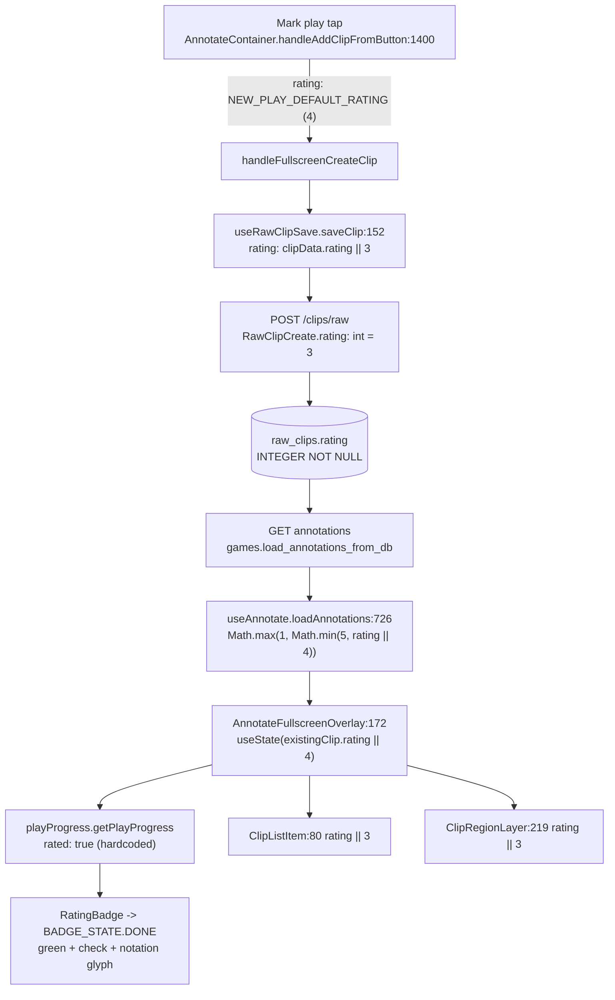
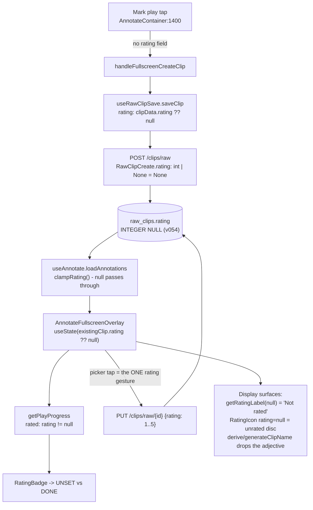

# T10690 Design: true "unset" rating state (nullable `raw_clips.rating`)

**Status:** DRAFT (awaiting user approval at the design gate)
**Author:** Architect agent
**Created:** 2026-09-19
**Task file:** [T10690-rating-unset-architecture-design.md](T10690-rating-unset-architecture-design.md)
**Decision artifact:** [T10690-decision-artifact.html](T10690-decision-artifact.html)

---

## 0. Framing (read this before the plan)

**This is a DOMAIN WIDENING, not a data correction.** Every existing `raw_clips.rating` value is a
real 1-5 star the product intended; none of it is wrong and none of it gets rewritten. The
migration makes `NULL` a *newly legal* value so the app can say "this play has no rating on
record" — a statement it cannot make today. This is deliberately NOT the CLAUDE.md
"correct data via migration" case (§ *Correct data, not workarounds*); there is **no backfill**,
and anyone reading `v054` later should not look for one.

**What it reverses.** T10610 (merged 2026-09-19, PR #470) made Mark-play create the row with
`NEW_PLAY_DEFAULT_RATING = 4` and hardcoded `getPlayProgress().rated = true`. That half is
reversed here per the user's explicit ruling ("true null rating", chosen over a session-only
`touched` flag, with the T10610 conflict stated up front). **T10610's create-at-tap model itself
stays** — the play row is still created at the tap, it just carries no rating until the user gives
it one.

**The new invariant (goes into `.claude/knowledge/annotate.md` at Stage 7):**

> **N-rating:** `raw_clips.rating` is `NULL` or `1..5`. `NULL` means *no rating on record* and is a
> legitimate, user-visible state — never an anomaly, never a value to substitute. No code path may
> invent a star for a `NULL` rating; display surfaces render an explicit "not rated" treatment, and
> rating-driven behaviour (5-star clip nudge, auto-export, recap counts) treats `NULL` as "not
> eligible", never as a number. Exactly one gesture writes a rating: the rating picker.

---

## 1. Current State ("As Is")

### 1.1 Flow



### 1.2 Current behaviour

```pseudo
user taps "Mark play"
    -> row created with rating = 4 (nobody asked)
    -> badge renders DONE (green + check + "!" glyph)
    -> list row renders a green "!" disc, label "4 stars . Good"
    -> user: "why does it say I've rated this?"
```

### 1.3 Code smells in today's code

| Smell | Location | Impact |
|-------|----------|--------|
| **Lie in the data** | `AnnotateContainer.jsx:1400` + `RawClipCreate.rating: int = 3` | The DB asserts a judgment the user never made. Every downstream reader (recap counts, game stats badges, auto-export "brilliant" selection, derived names) treats an invented 4 as a real one. |
| **Hardcoded predicate** | `playProgress.js:100` `rated: true` | A "progress" badge that can never be incomplete is not progress; the field exists only to keep the call shape. |
| **Four divergent default ratings** | `clipConstants.DEFAULT_RATING = 3`, `NEW_PLAY_DEFAULT_RATING = 4`, `AnnotateFullscreenOverlay.jsx:52 DEFAULT_RATING = 4` (a *third*, file-local copy the T10610 note missed), `queries.UNRATED_RATING = 3` | T4280 collapsed three backend fallbacks into one; the frontend then grew three more. Whichever one a surface happens to import decides what an absent rating "means". |
| **Coercion at every hop** | `useRawClipSave:152`, `useAnnotate:311/434/726`, `AnnotateFullscreenOverlay:172/237`, `ClipListItem:80`, `ClipRegionLayer:219`, `RatingIcon:59`, `getRatingLabel:120`, `getRatingDisplay:131` | Nine independent `|| DEFAULT` sites. Any one of them left alone silently re-invents a star and defeats this whole task. This is the DRY problem of the change, and the reason § D is an exhaustive table rather than prose. |
| **`normalize_rating` encodes the repealed rule** | `queries.py:25-38` | Its whole contract is "`NULL` is a data bug, log ERROR, substitute 3". After this task that statement is false, and its log would fire on ordinary use. |
| **Three-rule churn in four days** | `playProgress.js:7-15` | T10520 -> T10610 -> T10690. The comment block must carry the *reasoning*, not just the current rule, or the next change re-derives it from git log. |

### 1.4 What is already `NULL`-ready (do not "fix" these)

Backend code written during the T4280 audit and T3630 ranking work already anticipates a missing
rating. These sites need **no change**, and the design depends on them:

| Site | Existing handling |
|------|-------------------|
| `collection_metadata.compute_project_clip_stats:184` | `rows[0][1] is not None` -> `quality_score = None` |
| `collection_metadata.compute_archive_clip_stats:201` | same |
| `glicko.seed_rating:30-36` | `quality_score is None` -> neutral `SEED_BASE` ("no silent star guess") |
| `auto_export._fetch_annotated_clips:241` | `WHERE rc.rating IS NOT NULL` already in the SQL |
| `materialization.py:933` | `clip["rating"] == 5` -> `False` for `None` |
| `ClipSelectorSidebar.jsx:208` | `const hasRating = clip.rating != null` |
| `NotesOverlay.jsx:29-30` | `rating ? ... : ''` (no notation when absent) |
| `questAchievements.maybeRecordRatedAndTagged:9` | `rating >= 1` -> `false` for `null` |

**Name collision warning for implementers:** `rank.py` (47 hits), `glicko.py`, `collection_metadata`'s
ordering SQL and `final_videos.rating`/`rating_counts` are **Glicko** ratings (an Elo-like float),
NOT star ratings. Grepping `rating` across the backend drowns in them. Only `raw_clips.rating` and
its response/DTO copies are in scope.

---

## 2. Target State ("Should Be")

### 2.1 Flow



### 2.2 Target behaviour

```pseudo
user taps "Mark play"
    -> row created with rating = NULL
    -> badge renders UNSET  (see  C1 - open decision)
    -> list row / timeline render the unrated disc, label "Not rated"
    -> derived name is "Goal and Dribble", not "Interesting Goal and Dribble"
    -> clip badge stays DORMANT (NULL != CLIP_NUDGE_RATING)

user taps a star in the picker
    -> PUT /clips/raw/{id} { rating: 5 }   (the single write path, unchanged)
    -> badge -> DONE (green + check + "!!"), everything downstream lights up

user has no way back to NULL   (C2 - open decision; recommended: none in v1)
```

---

## 3. Implementation Plan ("Will Be")

Ordered so each step is independently reviewable. **Ship order matters: the backend migration must
be live before the frontend stops sending a rating**, or create-at-tap 500s on `NOT NULL`. See
§ 5 R1.

---

### A. Backend

#### A.1 Migration `v054_raw_clips_rating_nullable.py` (profile_db track)

**File:** `src/backend/app/migrations/profile_db/v054_raw_clips_rating_nullable.py`
**Register:** import + append `V054RawClipsRatingNullable()` in `migrations/profile_db/__init__.py`
(v053 is head on master today — **re-check unmerged sibling branches for a v054 claim at
implementation time**, per the known version-collision landmine).
**Also update:** `database.py:1182` `rating INTEGER NOT NULL` -> `rating INTEGER` (fresh DBs get the
head shape and skip the migration entirely, since `ensure_database` stamps
`user_version = RUNNER.latest_version` at `database.py:1715`).

SQLite cannot `ALTER COLUMN ... DROP NOT NULL`. There is **no rebuild precedent in `profile_db/`**
(every existing migration is `ADD COLUMN` / `DROP COLUMN`), so this one follows SQLite's official
12-step ALTER procedure verbatim. The hazards, each of which the sequence below handles explicitly:

| Hazard | Why it bites here | Handling |
|--------|-------------------|----------|
| `DROP TABLE` fires FK cascades | Three tables reference `raw_clips(id) ON DELETE CASCADE` (`working_clips` `database.py:1256`, `modal_tasks:1519`, `clip_teammates:1690`). With `foreign_keys=ON` a `DROP TABLE` is an implicit `DELETE FROM` and **would cascade-delete every working clip in the profile.** | `PRAGMA foreign_keys=OFF` around the rebuild. The seam's own connection (`migrations/__init__.py:183` plain `sqlite3.connect`) happens to default to OFF, but the migration must **not** depend on its caller — `materialization.py:63` and `database.py:1753` open with `foreign_keys=ON` and both can reach the JIT primitive. |
| `PRAGMA foreign_keys` is a silent no-op inside a transaction | `MigrationRunner.run` may have an implicit transaction open from a preceding migration's DML | Commit first if `conn.in_transaction`, then set the pragma, then `BEGIN IMMEDIATE` the rebuild. |
| Indexes die with the table | `idx_raw_clips_game_id`, `idx_raw_clips_rating`, unique `idx_raw_clips_game_end_time_seq` (`database.py:1491-1501`) | Capture `sql` from `sqlite_master WHERE type='index' AND tbl_name='raw_clips' AND sql IS NOT NULL` **before** the drop; replay verbatim after the rename. Never re-declare them from `database.py` (a profile may legitimately carry a variant). |
| `AUTOINCREMENT` sequence reset | `DROP TABLE` deletes the `sqlite_sequence` row. If rows were ever deleted, the new sequence lands at `MAX(id)` and **ids get reused** — and `final_videos.source_clip_id` (T3630 ranking) holds frozen raw-clip ids with no cascade, so a reused id silently re-attributes a published reel. | Read the old `sqlite_sequence.seq` before the drop; after the rename `UPDATE sqlite_sequence SET seq = MAX(old, new)`. |
| Schema drift between profiles | A DB running v054 is by construction at post-v053 shape (fresh DBs skip; the runner applies in order), but test fixtures can be minimal | Guard on `sqlite_master` (table missing -> return, same as v049/v053) and assert the column set matches the literal DDL; a surplus column raises rather than silently dropping data. |

**Sequence (`up(conn)`):**

```pseudo
# 1. Guards (idempotent, cheap, in this order)
if no table 'raw_clips' in sqlite_master:           return   # minimal fixture (v049/v053 precedent)
cols = PRAGMA table_info(raw_clips)                          # tuple rows! row[1]=name, row[3]=notnull
if cols['rating'].notnull == 0:                     return   # already nullable -> no-op re-run
assert set(col names) == set(EXPECTED_COLUMNS)               # else raise: unknown shape, refuse

# 2. Capture what DROP TABLE will destroy
index_sqls = SELECT sql FROM sqlite_master
             WHERE type='index' AND tbl_name='raw_clips' AND sql IS NOT NULL
old_seq    = SELECT seq FROM sqlite_sequence WHERE name='raw_clips'   (may be absent)
old_count  = SELECT COUNT(*) FROM raw_clips

# 3. FK-safe window  (pragma cannot take effect inside a transaction)
if conn.in_transaction: conn.commit()
prior_fk = PRAGMA foreign_keys
PRAGMA foreign_keys = OFF
try:
    BEGIN IMMEDIATE

    # 4. New table: byte-identical to database.py's raw_clips DDL EXCEPT
    #    `rating INTEGER NOT NULL` -> `rating INTEGER`
    CREATE TABLE raw_clips_v054 ( ...full column list..., rating INTEGER, ... )

    # 5. Copy, naming every column explicitly (never SELECT *)
    INSERT INTO raw_clips_v054 (id, filename, rating, ...) SELECT id, filename, rating, ... FROM raw_clips
    assert COUNT(raw_clips_v054) == old_count          # fail loud, rollback

    # 6-7. Swap. FK clauses in OTHER tables name 'raw_clips' (not the temp name),
    #      so with foreign_keys=OFF the rename edits nothing and they stay correct.
    DROP TABLE raw_clips
    ALTER TABLE raw_clips_v054 RENAME TO raw_clips

    # 8. Restore what the drop destroyed
    replay index_sqls verbatim
    if old_seq is not None: UPDATE sqlite_sequence SET seq = max(old_seq, seq) WHERE name='raw_clips'

    # 9. Verify before committing (official step 10)
    if PRAGMA foreign_key_check returns rows: raise -> rollback
    COMMIT
except: ROLLBACK; raise
finally: PRAGMA foreign_keys = prior_fk
```

**Crash safety.** This is the first `profile_db` migration that commits inside `up()`. If the
process dies between that commit and the runner's `PRAGMA user_version = 54`, the DB is nullable at
v053 and v054 simply re-runs — guard #1 sees `notnull == 0` and returns. Document that in the
docstring.

**No backfill. No data is touched.** Existing `1..5` values copy across unchanged; the only
difference after the migration is what the column *permits*.

**Dedicated test** (precedent: `test_t4330_migration_v044.py`, `test_t5195_migration_v034.py`):
`tests/test_t10690_migration_v054.py` — build a v053-shaped DB with rated clips + child
`working_clips`/`clip_teammates` rows, run v054, assert (a) rating accepts NULL, (b) every raw clip
AND every child row survived (the cascade trap), (c) all three indexes exist, (d) `sqlite_sequence`
did not go backwards, (e) re-running is a no-op, (f) `foreign_key_check` is clean.

#### A.2 `clips.py` request/response models — every `rating` field, ruled

| Line | Model / param | Today | Target | Why |
|------|---------------|-------|--------|-----|
| 135 | `RawClipResponse.rating` | `int` | **`int \| None`** | **Mandatory.** Pydantic would raise on a NULL row and 500 the library/list endpoints. |
| 162 | `RawClipCreate.rating` | `int = 3` | **`int \| None = None`** | The create-at-tap path; absent means "no rating on record". |
| 174 | `RawClipUpdate.rating` | `int \| None = None` | **unchanged** (`None` = field absent = leave alone) — *unless C2 = "allow clear"*, see A.6 | Today `None` already means "absent" for every field on this model; keep the convention. |
| 237 | `WorkingClipResponse.rating` | `int \| None` | **unchanged** | Already nullable (joined from `raw_clips`, could always miss). |
| 892/916 | `list_raw_clips(min_rating)` query param + `AND rating >= ?` | `int \| None` | **unchanged**, add a comment | SQL `NULL >= n` is NULL -> unrated clips are excluded by any `min_rating` filter. That is the correct semantic. |
| 1972 | `ClipUploadItem.rating` (bulk import) | `int \| None = None` | **unchanged**; **keep the `or 5` default at 2152** | A bulk-imported clip is the user's own curated file with no annotate step — there is no "unset" affordance anywhere in that flow, so a NULL there would be unreachable-by-UI dead state. Decision: bulk import keeps defaulting to 5. |
| 2200 | `upload_clip_with_metadata(rating: int = Form(3))` | `int = Form(3)` | **unchanged** | Same reasoning; the video-upload form has no unrated affordance. Keeping these two as-is confines the NULL domain to *annotate-created plays*, which is the only surface with a picker. |

#### A.3 Delete `normalize_rating` / `UNRATED_RATING` (`queries.py:16-38`)

Its entire contract ("`raw_clips.rating` is NOT NULL so a NULL is a data bug -> log ERROR ->
substitute 3") is exactly the rule this task repeals. Keeping it would (a) spam ERROR logs on
ordinary use and (b) re-invent a 3 at three read sites. It has exactly three callers:

| Caller | Today | Target |
|--------|-------|--------|
| `clips.py:1090` (auto-project name) | `rating = normalize_rating(clip_data['rating'], ...)` | Pass `clip_data['rating']` (may be `None`) straight into `derive_clip_name` — A.4 makes it adjective-free. |
| `clips.py:1752` (`clip_list`) | `rating = normalize_rating(clip['raw_rating'], ...)` | `rating = clip['raw_rating']`; flows into the now-nullable response field and `derive_clip_name`. |
| `games.py:1355` (`game_stats` rating counts) | `rating = normalize_rating(row['rating'], ...)` then `if rating == 5 ... elif == 3 ...` | `rating = row['rating']`; `if rating is None: continue` **before** the ladder. Counting an unrated play as a 3-star badge is the exact bug this task exists to stop. |

Update `tests/test_t4280_silent_fallbacks.py:142-151` (`test_normalize_rating_single_semantics`) to
assert the *new* rule instead — rename it to something like
`test_null_rating_is_carried_not_substituted` and assert the three call sites above return/count
`None` rather than 3. T4280's principle ("one documented semantic for a missing rating, decided
once") is upheld, not violated: the semantic is now "NULL means unrated, everywhere".

#### A.4 `derive_clip_name` (`queries.py:41-87`) and its frontend twin

```pseudo
- def derive_clip_name(stored_name, rating: int, tags, notes='', generated_title='') -> str
+ def derive_clip_name(stored_name, rating: int | None, tags, notes='', generated_title='') -> str
      ...unchanged through the stored-name / notes / TF-IDF branches...
-     adjective = get_rating_adjective(rating)
-     return f"{adjective} {tag_part}"
+     # T10690: NULL rating -> no adjective. get_rating_adjective would invent
+     # "Interesting" (its 1-5 lookup default), silently un-blanking a rating the
+     # user deliberately never gave.
+     if rating is None:
+         return tag_part
+     return f"{get_rating_adjective(rating)} {tag_part}"
```

Mirror **exactly** in `src/frontend/src/utils/clipDisplayName.js:37` (`generateClipName`), which is
the documented frontend twin:

```pseudo
- const adjective = RATING_ADJECTIVES[rating] || 'Interesting';
- return `${adjective} ${tagPart}`;
+ if (rating == null) return tagPart;            // T10690: no invented adjective
+ return `${RATING_ADJECTIVES[rating]} ${tagPart}`;
```

Callers that pre-coerce must stop, or the branch is unreachable:
`projects.py:299` `raw_clip['rating'] or 0`, `projects.py:779` `clip['rating'] or 0`,
`projects.py:1594` `row['rating'] or 3` -> pass the raw value.

#### A.5 Clip-picker filter semantics — `projects.py:715-735` `_build_clips_filter_query`

`WHERE COALESCE(rc.rating, 0) >= ?` with the default `min_rating = 1` makes **every unrated clip
invisible** in the multi-clip project pickers (`GameClipSelectorModal`, `ClipLibraryModal`). Today
that branch is unreachable (no NULLs exist); after v054 it silently hides plays.

```pseudo
- if min_rating <= 0:   # "All clips"
+ # T10690: 1 is the minimum real star, so "1+" has never excluded a RATED clip.
+ # Treat <= 1 as "no rating filter" so unrated plays stay reachable; a genuine
+ # 2+/3+/4+/5+ filter still excludes them (NULL is not >= 2).
+ if min_rating <= 1:
      ...unfiltered branch...
```

#### A.6 Other backend touch points

| Site | Change |
|------|--------|
| `clips.py:1303-1326` (`save_raw_clip`, EXISTING-clip idempotent-retry branch) | `SET ... rating = ?` -> **`rating = COALESCE(?, rating)`** + comment. Otherwise a retried create with no rating field NULLs a rating the user set in between. |
| `clips.py:1367` (new-clip INSERT) | No SQL change (`clip_data.rating` is now `None`-able and the column accepts it). |
| `clips.py:1382` `record_milestone(..., "rating": clip_data.rating)` | No change; `None` serialises fine. Analytics readers see `null` = unrated. |
| `materialization.py:680` `clip.get("rating", 3)` | -> `clip.get("rating")`. The `, 3` default is already ineffective when the key exists with a `None` value, so this is honesty rather than behaviour change; a shared unrated play stays unrated for the recipient (target DB is migrated by the same seam). |
| `games.py:2457` `generate_clip_name(row['rating'], tags)` + `games.py:199-215` | `get_rating_adjective(None)` returns "Interesting". Same fix as A.4: `if rating is None: return tag_part`. |
| `constants.get_rating_adjective` / `get_rating_notation` / `get_rating_color_*` | **Unchanged.** They stay 1-5 lookups with a documented default; callers must branch on `None` *before* calling. Do not teach the lookup tables about NULL — that is how a fallback becomes invisible again (`test_constants.py:155-163` asserts all four dicts share keys 1-5; keep it). |

---

### B. Create-at-tap stops seeding a rating (and every coercion between)

| # | File:line | Today | Target |
|---|-----------|-------|--------|
| B1 | `AnnotateContainer.jsx:1400` | `rating: NEW_PLAY_DEFAULT_RATING,` | **Delete the line** (omit the field) — the payload literally says "no rating was given". Also drop `NEW_PLAY_DEFAULT_RATING` from the `clipConstants` import at line 37. |
| B2 | `useRawClipSave.js:152` | `rating: clipData.rating \|\| 3,` | `rating: clipData.rating ?? null,` |
| B3 | `useAnnotate.js:397` | `addClipRegion(..., rating = DEFAULT_RATING, ...)` | `rating = null` |
| B4 | `useAnnotate.js:434` | `rating: rating \|\| DEFAULT_RATING,` | `rating: rating ?? null,` |
| B5 | `useAnnotate.js:726` (**`loadAnnotations` — the critical one**) | `rating: Math.max(1, Math.min(5, annotation.rating \|\| DEFAULT_RATING)),` | `rating: clampRating(annotation.rating),` where `clampRating(r) => r == null ? null : Math.max(1, Math.min(5, r))` (one small module-local helper, used by B5 + B6 — the 3rd-duplication rule is satisfied by two *plus* the intent to have exactly one clamp). Leaving this site alone re-invents a 4 on every page load and defeats the entire task. |
| B6 | `useAnnotate.js:311` (pending/TSV annotations) | same clamp with `\|\| DEFAULT_RATING` | `clampRating(annotation.rating)` |
| B7 | `useAnnotate.js:3, 218, 827` | imports/aliases `NEW_PLAY_DEFAULT_RATING as DEFAULT_RATING`, deps array | Remove. |
| B8 | `AnnotateFullscreenOverlay.jsx:52` | `const DEFAULT_RATING = 4;` (third copy) | **Delete the constant.** |
| B9 | `AnnotateFullscreenOverlay.jsx:172, 237` | `useState(existingClip.rating \|\| DEFAULT_RATING)` / `setRating(existingClip.rating \|\| DEFAULT_RATING)` | `existingClip.rating ?? null` in both. The editor's local echo must be able to hold `null`. |
| B10 | `clipConstants.js:53-58` | `export const NEW_PLAY_DEFAULT_RATING = 4;` | **Delete** — zero callers after B1/B3/B7 (verified by grep: its only consumers are `AnnotateContainer:37/1400` and `useAnnotate:3`). The bulk-import `5` and upload-form `3` are separate backend literals and are unaffected. `DEFAULT_RATING = 3` also goes — see D. |
| B11 | `useAnnotate.js:81` `generateTsvContent` | `const rating = region.rating \|\| DEFAULT_RATING;` | `region.rating ?? ''` (empty cell), **and** `validateTsvContent:156-161` accepts an empty rating cell as `null` while still rejecting a non-empty non-1-5 value. Keeps TSV round-trip fidelity instead of inventing a star on export. *(Smallest deferrable slice if the user wants this task tighter — say so and the writer keeps `|| 3` with an "external format" comment.)* |

**Rating-driven branches under `rating == null`:**

| Branch | Behaviour with `null` | Verdict |
|--------|----------------------|---------|
| `playProgress.js:92` `rating === CLIP_NUDGE_RATING` | `null === 5` -> `false` -> `CLIP_BADGE.DORMANT` | **Correct as written, no change.** An unrated play does not nudge. |
| `questAchievements.js:9` `rating >= 1` | `null >= 1` -> `false` | **Correct as written.** Add a one-line comment so nobody "fixes" it. |
| `AnnotateFullscreenOverlay:288/298`, `ClipDetailsEditor:204/216` `maybeRecordRatedAndTagged(...)` | passes `null` through to the above | No change. |
| Auto `my_athlete` flip / T9830 rating-driven auto-flip sites | Confirmed **non-existent**: `clips.py:1218-1222` and `update_raw_clip`'s docstring state project creation is driven ONLY by the explicit `create_project` flag, never by the rating; `useRawClipSave.js:119-121` says the same on the client. Nothing to change. |
| `auto_export.py:164-166` `c['rating'] == 5` / `== 4` | `false`; and the fetch at `:241` already filters `rating IS NOT NULL` | No change. |

---

### C. The badge

#### C.1 `playProgress.js` — real predicate + a comment that survives the next change

```pseudo
  export const BADGE_STATE = {
    UNDONE: 'undone',
+   UNSET: 'unset',        // ONLY if C1-B is chosen (see Open Questions)
    DONE: 'done',
    NUDGE: 'nudge',
    PENDING: 'pending',
    DORMANT: 'dormant',
  };

  export function getPlayProgress({ rating, ... }) {
-   rated: true,
+   rated: rating != null,     // `!=` is deliberate: covers null AND undefined
  }
```

Replace the `RATED` bullet in the header comment (lines 8-15) with the **full rule history**, so the
next person does not re-derive it from git log (this file has changed rule three times in four
days):

```pseudo
 *   - RATED (T10690, 2026-09-19): true exactly when the play has a rating ON
 *     RECORD -- `rating != null`. `raw_clips.rating` is NULLABLE (migration
 *     v054): a play created by Mark-play carries NO rating until the user
 *     picks one, and NULL is a legitimate state, never an anomaly.
 *     History, so this does not get re-litigated a fourth time:
 *       T10520  "differs from the untouched default 4" -> rejected live by the
 *               user: "green doesn't mean not 4, it just means it's been set."
 *       T10610  create-at-tap seeded rating=4, so `rated` was hardcoded true ->
 *               rejected: the badge claimed credit before the user touched it.
 *       T10690  the seed was removed and the column made nullable, so the
 *               predicate is finally a real read of real data. A session-only
 *               "touched" flag was explicitly considered and REJECTED by the
 *               user in favour of the schema change.
```

#### C.2 `PlayProgressBadges.jsx` — the unset treatment

The badge state mapping lives at line 359: `state={progress.rated ? BADGE_STATE.DONE : BADGE_STATE.UNDONE}`.

- **If C1-A (recommended):** *no code change here at all.* `rated: false` already routes to
  `UNDONE` -> amber dashed ring + hollow `Star` icon (the `glyph` prop is `undefined` unless `DONE`,
  `PlayProgressBadges.jsx:227`, so the disc already shows a star outline and no notation). The only
  edit is copy: `title` becomes `ANNOTATE.PLAY_NOT_RATED` ("Not rated yet") instead of reusing the
  generic rate-prompt, plus a comment in the header block explaining that unset deliberately shares
  UNDONE's treatment.
- **If C1-B:** add `BADGE_STATE.UNSET` (above), add one row to `DISC_STATE` (line 58-64), and change
  line 359 to `progress.rated ? DONE : BADGE_STATE.UNSET`. Concrete class string:
  `'border-dashed border-amber-500/50 bg-transparent text-amber-300/70 hover:border-amber-300 hover:text-amber-300'`
  — same hue family (so it never reads disabled, the T10440 regression), lower emphasis than the two
  action badges. Disc glyph: hollow `Star`, no notation, no check.
- **Not recommended (C1-C):** a gray/slate treatment. T10440 already moved UNDONE off gray precisely
  because *"gray read as disabled"* (`PlayProgressBadges.jsx:26-27`). Re-introducing gray for the one
  badge the user is supposed to tap first would re-run that regression.

`RATING_VALUES` / the picker rows are **unchanged** in either case: `aria-checked={rating === value}`
is already false for every row when `rating` is `null`, so the picker opens with nothing selected —
which is exactly right.

#### C.3 "Clear rating" (C2) — plumbing, only if the user says yes

If clearing is approved, the *only* correct wiring (stated here so the decision is costed, not
half-specified):

1. `PlayProgressBadges.RatingBadge`: one extra row above/below `RATING_VALUES` ("No rating yet"),
   `onClick={() => { onRatingChange(null); setOpen(false); }}` — a real tap, same setter, so the
   gesture-based-persistence rule holds with no new write path.
2. `AnnotateFullscreenOverlay.handleRatingChange` / `ClipDetailsEditor.handleRatingChange`: no
   change (they forward whatever value they are given).
3. **`clips.py:1499`** `if update.rating is not None:` can never express "set to NULL" —
   `RawClipUpdate` uses `None` to mean *absent* for all ten fields. Change **only** the rating check
   to `if 'rating' in update.model_fields_set:` with a comment naming the asymmetry, so an explicit
   `{"rating": null}` body clears and an omitted field still leaves it alone. (The alternative —
   a dedicated `POST /clips/raw/{id}/clear-rating` endpoint mirroring `LinkClipToGameRequest`'s
   one-gesture-one-endpoint shape — is *more* code and a second write path for one field; rejected.)

If clearing is declined, **none** of the above is built and `rating` stays `1..5` on every write.

---

### D. Every other rating-display call site

`getRatingLabel` is the N35 single descriptor function, so the null branch lands **there**, not in
its five callers. Same idea for `RatingIcon`: it is the one drawn disc, used by three surfaces, so
the unrated visual is defined once.

#### D.1 Shared primitives — these get the explicit `null` branch

| File:line | Today | Target |
|-----------|-------|--------|
| `clipConstants.js:119-123` `getRatingLabel` | `const r = rating \|\| DEFAULT_RATING` -> "3 stars . Interesting" for an unrated clip | `if (rating == null) return 'Not rated';` then the existing body with the raw value. **The single string every surface shows for unrated.** |
| `clipConstants.js:130-137` `getRatingDisplay` | `rating \|\| DEFAULT_RATING` + three `\|\| ..[DEFAULT_RATING]` fallbacks | `if (rating == null) return { notation: '', badgeColor: UNRATED_BADGE_COLOR, backgroundColor: UNRATED_BACKGROUND_COLOR };` Add those two constants (a neutral slate, e.g. `#64748b` / `rgba(100,116,139,0.15)`) next to the palettes. |
| `clipConstants.js:51` `DEFAULT_RATING = 3` | display-only fallback | **Delete** once `getRatingLabel`/`getRatingDisplay`/`RatingIcon` stop using it (the only three consumers). Deleting it is the structural guarantee that no surface can silently re-invent a star. |
| `clipConstants.js:80-91` `getRatingCaption` | `if (!rating) return 'How good was this play? Rate it 1 to 5 - ${outcome}'` | **Already correct** (`!rating` covers `null`). Change the comment only: the no-rating branch is now a real, reachable state rather than a create-form transient. |
| `clipConstants.js:98-112` `getEditRatingCaption` | `if (!rating) return 'How good was this play? Rate it 1 to 5.'` | **Already correct**; same comment update. |
| `RATING_NOTATION` / `RATING_ADJECTIVES` / `RATING_BADGE_COLORS` / `RATING_BACKGROUND_COLORS` | 1-5 maps | **Unchanged.** No `null`/`0` key. Callers branch before indexing — a lookup-table default is exactly the invisible fallback this task removes. |
| `RatingIcon.jsx:58-91` | `const r = RATING_NOTATION[rating] ? rating : DEFAULT_RATING` -> unrated draws the blue `!?` disc | `if (rating == null)` -> render an **unrated disc**: dashed `#64748b` ring, transparent face, no glyph, `data-rating="unrated"`, `<span className="sr-only">Not rated</span>`. One definition, inherited by all three consumers below. |

#### D.2 Display surfaces

| File:line | Can it see `null`? | Action |
|-----------|--------------------|--------|
| `ClipListItem.jsx:80` `const rating = region.rating \|\| 3` | **Yes** — the annotate play list is the primary unrated surface | Drop the coercion: `const rating = region.rating ?? null`. `getRatingDisplay`/`getRatingLabel`/`RatingIcon` then do the right thing via D.1. Line 96's `generateClipName(rating, ...)` gets the adjective-free name via A.4. |
| `ClipRegionLayer.jsx:219-222, 274-277` `region.rating \|\| 3` + `RATING_COLORS[rating]` | **Yes** — timeline markers for unrated plays | `const rating = region.rating ?? null; const color = ratingMarkerColor(rating)` -> use `getRatingDisplay(rating).badgeColor` instead of the local `RATING_COLORS[...]` index (removes a second indexing path into the palette). Desktop disc + tooltip inherit D.1. |
| `NotesOverlay.jsx:29-30` | **Yes** (in-video overlay while scrubbing an unrated play) | `notation`/`RatingIcon` guard is already correct. One change: `borderColor` falls back to `RATING_COLORS[3]` (blue = "Interesting") for an unrated clip -> use the neutral `UNRATED_BADGE_COLOR`. |
| `ClipDetailsEditor.jsx:40-52` local `StarRating` (sidebar editor) | **Yes** | `title`/`aria-label` already route through `getRatingLabel` -> "Not rated" for free. Verify the fill comparison is `i <= rating` (false for all when `null` -> zero filled stars, correct). No structural change; this stays a separate component per the T9630 N35 note (one *descriptor function*, not one component). |
| `components/shared/StarRating.jsx:38-41` (used by `AnnotateFullscreenOverlay:838`, landscape-inline layout) | **Yes** | Same as above: label comes from `getRatingLabel`, zero filled stars. Note for the implementer: the landscape-inline layout **does** still have a second rating control despite `PlayProgressBadges`' comment claiming the picker is the only one — it writes through the same `handleRatingChange`, so no new write path, but it must render `null` sanely. |
| `ClipSelectorSidebar.jsx:208-209` (Focus mode) | **Yes** | **No change** — already `clip.rating != null`. |
| `ShareGameModal.jsx:55-61` `RATING_ADJECTIVES[c.rating]` (x4) | **Yes** — a shared game can contain unrated plays | Needs a branch: skip the rating chip entirely when `c.rating == null` (cleanest for a compact chip row), or render the unrated disc. Recommend skip + a "Not rated" title on the row. |
| `RecapPlayerModal.jsx`, `recap/RecapClipsSidebar.jsx` | **Yes** (recap plays a game's clips) | Audit during implementation; both render through `RatingIcon`/`getRatingLabel`, so D.1 covers them if they do not pre-coerce. Any `|| 3` found gets the B-table treatment. |
| `GameClipSelectorModal.jsx`, `ClipLibraryModal.jsx`, `ProjectCreationSettings.jsx` | **Yes**, and they also *filter* | Display via the shared primitives; filtering is fixed server-side in A.5. Verify no client-side `rating >= min` duplicate exists (if one does, it needs the same `<= 1` rule — a second filter code path would be a new smell). |
| `ClipLibraryModal`/`PublishedReelsPanel`/`useCollections`/`reelOrder`/`useRanking`/`RankingGame` | **No (Glicko)** | These read `final_videos.rating` (Glicko float) or `quality_score`. **Out of scope.** Listed so the implementer does not "fix" them. |
| `OverlayModeView`, `CropOverlay`, `useHighlightRegions`, `uploadManager`, `VideoPlayer`, `cacheWarming`, `projectDataStore` | **Pass-through only** | They carry `rating` in objects without rendering a star. No change. |

---

### E. Tests to add / update (Stage 3 + Stage 5 scope)

| Test | Change |
|------|--------|
| `tests/test_t10690_migration_v054.py` | **New** — the six assertions in A.1. |
| `tests/test_t4280_silent_fallbacks.py:142` | Rewrite for the repealed rule (A.3). |
| `tests/test_clips.py` (or a new `test_t10690_nullable_rating.py`) | POST `/clips/raw` with no rating -> row is NULL, 200; GET list returns `rating: null`; PUT `{rating: 5}` sets it; retried create does not clobber an existing rating (the `COALESCE` in A.6). |
| `playProgress.test.js` | `rated` is false for `null`/`undefined`, true for 1-5; clip badge stays `DORMANT` at `null`. |
| `AnnotateContainer.createAtTap.test.jsx` | The create payload carries **no** `rating` key. |
| `AnnotateFullscreenOverlay.progressBadges.test.jsx` | Fresh play -> `badge-rated` has `data-state="undone"` (or `"unset"` under C1-B); after picking 5 -> `"done"` + `!!` glyph. |
| `clipConstants.test.js` | `getRatingLabel(null) === 'Not rated'`; `getRatingDisplay(null).notation === ''`; `generateClipName(null, ['Goal'])` has no adjective. |
| `useAnnotate.test.js` | `loadAnnotations` preserves a `null` rating (the B5 regression guard). |
| e2e | Mark play -> the rated badge is not green; pick a rating -> it turns green. |

---

## 4. Design Decisions

| # | Decision | Options considered | Choice | Rationale |
|---|----------|--------------------|--------|-----------|
| 1 | How to express "unrated" | (a) nullable column (b) session `touched` flag (c) sentinel `0` in a NOT NULL column | **(a) nullable** | **User's explicit ruling.** (b) is what T10610 just removed and dies on reload; (c) avoids the table rebuild but is a magic value that every `rating >= n` filter and every lookup table would have to know about — a silent fallback wearing a different hat. |
| 2 | Migration mechanics | (a) SQLite 12-step rebuild (b) `PRAGMA writable_schema` hack | **(a)** | (b) edits schema text under the engine's feet; unreviewable and corrupts on any mistake. (a) is SQLite's documented procedure and per-profile tables are small (hundreds of rows). |
| 3 | New-table DDL source | (a) literal head DDL in the migration (b) text-rewrite the existing `sqlite_master.sql` | **(a) literal + column-set assertion** | Any DB that reaches v054 is by construction at post-v053 shape; a literal DDL is greppable and reviewable, while regex-rewriting live schema text is not. The assertion turns the assumption into a loud failure instead of silent data loss. |
| 4 | Where the NULL domain stops | (a) everywhere a rating exists (b) annotate-created plays only | **(b)** | Bulk import and direct upload have **no unrated affordance in the UI**, so a NULL there would be unreachable dead state. Keeping their `5`/`3` defaults confines the new state to the one surface with a picker (`clips.py:2152`, `:2200` unchanged). |
| 5 | `normalize_rating` | (a) keep, pass `None` through (b) delete | **(b) delete** | With `None` passed through it is an identity function; with its ERROR log kept it spams on ordinary use. Its three callers each need a *different*, explicit treatment (name, response, stats-skip) — one shared coercer cannot express that. |
| 6 | Where the `null` display branch lives | (a) in each of ~8 display sites (b) in `getRatingLabel` / `getRatingDisplay` / `RatingIcon` | **(b)** | N35's "ONE rating descriptor function". Call sites just stop coercing; the three shared primitives define the unrated look/label once. Deleting `DEFAULT_RATING` makes re-introducing a per-site fallback require a new literal, which review catches. |
| 7 | Derived name for an unrated clip | (a) keep "Interesting" (b) drop the adjective | **(b)** | "Interesting Goal" asserts a judgment. "Goal" is honest and still useful. Backend + frontend twins change together. |
| 8 | Ship order | (a) one PR (b) backend PR then frontend PR | **(b)** | See R1. Backend-first is compatible in both directions; frontend-first 500s every Mark-play tap until the migration lands. |

---

## 5. Risks

| # | Risk | Severity | Mitigation |
|---|------|----------|------------|
| R1 | **Frontend ships before the migration** -> `NOT NULL constraint failed: raw_clips.rating` on every Mark-play tap | High | Land A (migration + nullable models, fully backward compatible: an old client still sends a rating) **first**, verify on staging, then land B/C/D. Two commits minimum, and the `profile_db` JIT seam migrates each profile on its next access with no operator step. |
| R2 | **The rebuild cascade-deletes `working_clips`** if `foreign_keys` is ON on the caller's connection | Critical (silent data loss) | A.1's explicit `PRAGMA foreign_keys=OFF` + `foreign_key_check` before commit + the dedicated test asserting child rows survive. Never rely on the seam connection's default. |
| R3 | **`sqlite_sequence` reset -> raw-clip id reuse** -> a published reel's frozen `source_clip_id` re-points to a different play | Medium (silent mis-attribution) | Capture and restore `seq` (A.1 step 8) + test (d). |
| R4 | **One missed `\|\| DEFAULT` re-invents a star** (nine sites; `useAnnotate:726` alone would undo the whole task) | High | The B/D tables are exhaustive and line-numbered; deleting `NEW_PLAY_DEFAULT_RATING` *and* `DEFAULT_RATING` makes a missed site a build error rather than a silent 3. Post-implementation grep gate: `rg "rating \|\| " src/frontend/src` must return nothing outside the Glicko files. |
| R5 | **Unrated plays vanish from clip pickers** (`min_rating = 1` default) | Medium | A.5. Explicitly covered by a backend test. |
| R6 | **Migration version collision** with an unmerged sibling branch claiming v054 | Low but recurring (known landmine) | Re-check `origin` branches at implementation time; renumber before merge, never after. |
| R7 | **Scope creep into the Glicko `rating` namespace** | Medium (wasted work / regressions) | § 1.4's collision warning + the D table's explicit "No (Glicko)" rows. |
| R8 | **A fourth rule change** on `playProgress.rated` | Medium (process) | C.1's comment carries the whole history and the rejected alternatives, so the next reader does not re-derive it. |
| R9 | Recap/share surfaces not enumerated here render `undefined` for an unrated clip | Low | D.1 makes the shared primitives safe by default; the D table names the two files to audit during implementation. |

---

## 6. Open Questions (the design gate)

- [ ] **C1 — Unset badge visual.** **(A, recommended)** reuse `UNDONE`'s amber dashed ring + hollow
      star, changing only the copy to "Not rated yet"; **(B)** a new `BADGE_STATE.UNSET` with a
      lower-emphasis amber (`border-amber-500/50`, `text-amber-300/70`); **(C)** a gray/neutral
      treatment — *not recommended*, T10440 already reverted gray because it read as disabled.
      **Honest note the user should weigh:** the premise that the other three badges "default to
      something" does not quite hold — an unnamed play has no custom name and an un-noted play has
      no note, exactly the same shape as an unrated play. If they are genuinely the same thing, A is
      the coherent answer (a fresh play then shows three amber "to do" badges and one dormant clip
      badge). If the user wants the rating to feel *optional* rather than *pending*, B.
- [ ] **C2 — Can a rating be cleared back to unset?** **Recommended: NO in v1** — unset is reachable
      only before the first rating. Rationale: keeps `rating` a `1..5` int on every write, avoids
      the absent-vs-explicit-null ambiguity in `RawClipUpdate` (`model_fields_set` plumbing, C.3),
      and "I rated it and want it to be un-rated again" is a rare need. Cost if the user wants it:
      one picker row + one changed condition in `clips.py:1499` (fully specced in C.3), about 10 LOC.
- [ ] **D — Derived name for an unrated, tagged play.** Recommended "Goal and Dribble" (no adjective,
      § A.4). The alternative is keeping "Interesting Goal", which re-asserts a rating in the one
      place users actually read it. Confirm.
- [ ] **B11 — TSV round-trip.** Include the empty-rating-cell import/export fix (~6 LOC, preserves
      fidelity) or defer it and keep an explicit `|| 3` coercion in the TSV writer only?
- [ ] **Scope confirmation.** Is `ShareGameModal`'s rating chip being *omitted* for unrated plays
      (rather than showing an unrated disc) acceptable?

---

## 7. Follow-up

On approval: file the implementation task (Tier **L** — schema change + `profile_db` migration,
three stack layers, 15+ files; needs the **Migration agent**, Tester Phase 1, and a Reviewer
fan-out), split as:

1. **Backend/compat** — v054 + nullable models + `normalize_rating` removal + name derivation +
   filter semantics + tests. Ships alone, changes no behaviour for existing clients.
2. **Frontend** — B (stop seeding + remove all coercions), C (badge + comment), D (display sites),
   tests.

Stage 7 updates `.claude/knowledge/annotate.md` (the N-rating invariant, the deleted
`NEW_PLAY_DEFAULT_RATING`/`DEFAULT_RATING` landmine note, the T10520/T10610/T10690 rule history) and
`persistence-sync.md` (v054 is the first `profile_db` table rebuild — record the FK/sequence traps).
