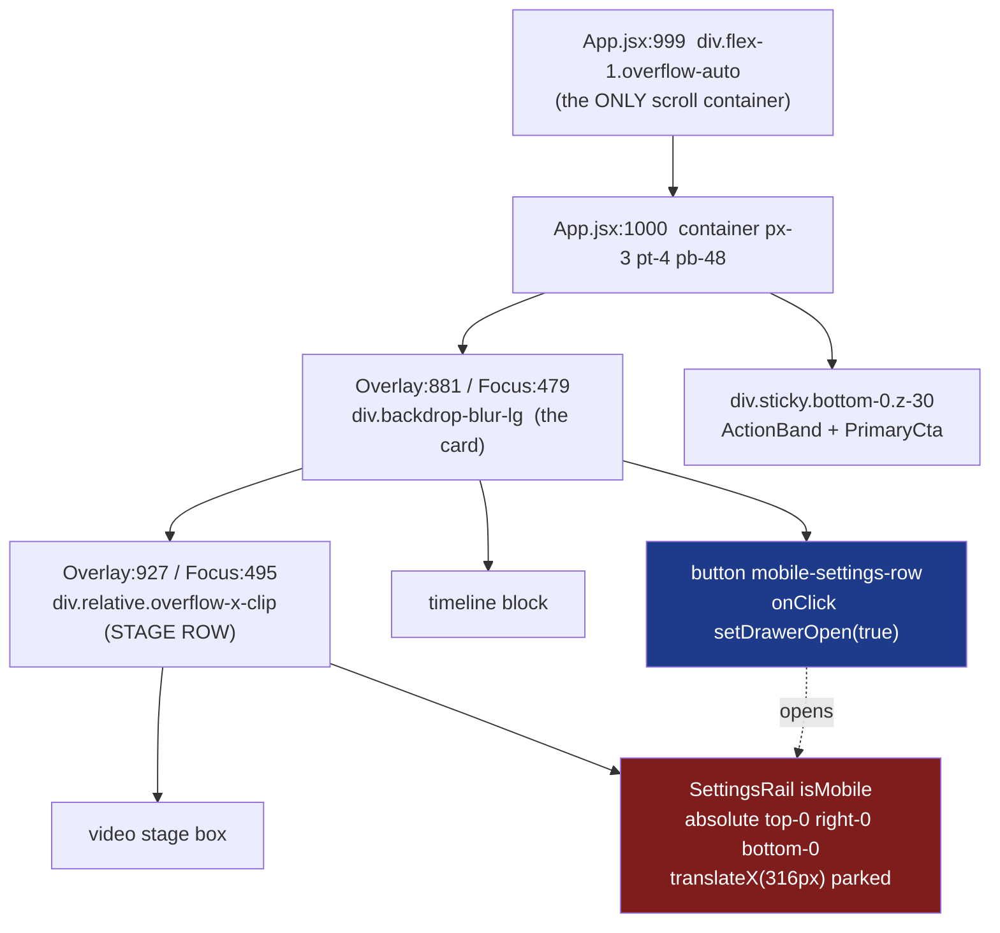
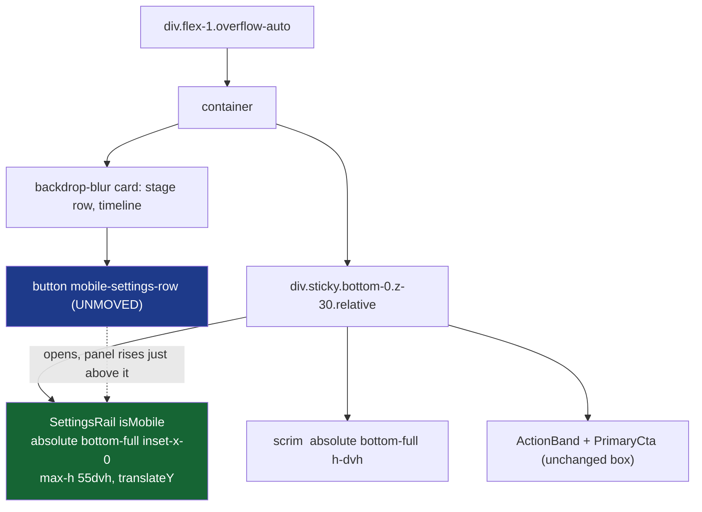

# T10820 Design: mobile settings panel anchored where the user tapped

**Task:** [T10820-mobile-settings-drawer-anchored-to-button.md](T10820-mobile-settings-drawer-anchored-to-button.md)
**Stage:** 2 (Architecture). **Design gate: user approval required before implementation.**
**Created:** 2026-09-20

---

## 1. Current State Analysis

### 1.1 What ships today

`SettingsRail.jsx` is one component with two fully separate JSX branches selected by an early
`if (isMobile)` return. Desktop (lines 159-226) is a 380px in-flow width-tweening box. Mobile
(lines 89-153) is a 316px `position:absolute` drawer parked at `translateX(316px)` and slid to
`translateX(0)` on `open`, plus a `pointer-events-none` scrim. A mobile-only change cannot touch
desktop, so "desktop byte-identical" is structurally guaranteed in every option below.

Both hosts mount that mobile drawer INSIDE the stage row, and render the entry row that opens it
as a later sibling OUTSIDE that row:



The drawer's containing block is the stage row at the TOP of the scrollport. The entry row is far
below it. On a phone the user has scrolled the stage row out of view before they can tap the row,
so the panel animates open entirely above the visible viewport.

### 1.2 Current behavior (pseudo)

```pseudo
user scrolls down ~400px so `mobile-settings-row` is reachable
user taps the row
    setDrawerOpen(true)
    drawer transform: translateX(316px) -> translateX(0)
    // drawer's top/bottom are the STAGE ROW's top/bottom, which are now
    // at viewport y = -400..-40  =>  nothing visible changes on screen
result: zero feedback. The user taps again, or leaves.
```

### 1.3 Code smells and traps in the current surface

| Smell / trap | Location | Impact |
|---|---|---|
| Panel anchored to a box unrelated to its trigger | `SettingsRail.jsx:107` + `OverlayModeView.jsx:964`, `FocusModeView.jsx:900` | The bug. Anchor is the stage row; trigger is 400px lower. |
| Magic literal `316` repeated 3x (className, transform, docstring) with no exported const | `SettingsRail.jsx:107,112` + docstring | Desktop has `RAIL_WIDTH_PX` / `RAIL_COLLAPSED_WIDTH_PX` / `RAIL_TWEEN`; mobile has nothing. Any geometry change is a 3-site grep. |
| **`position:fixed` is NOT viewport relative inside these hosts** | `Overlay:881` / `Focus:479` carry `backdrop-blur-lg` in windowed mobile | A `backdrop-filter` ancestor becomes the containing block for fixed descendants. Already documented in `T10420-mobile-edit-sheet-viewport-fix.md` (18-35) and `.claude/knowledge/annotate.md` (193-205), which names these exact two files and predicts: "any new fixed element added inside one of these three wrappers in windowed mode will hit this same trap." T10820 is that new element. |
| Docstring hard-codes a contract the fix invalidates | `SettingsRail.jsx:3-35` ("translateX ONLY, never width tween, never alters stage box") | Code/doc contradiction the moment geometry changes. Must be rewritten in the same commit. |
| Two knowingly-red e2e assertions on this exact surface | `docs/testing/known-failures.md` rows 31-32 (Focus only) | Focus CTA shifts y when the drawer opens; one Focus drawer control is 28px tall. This task rewrites the surface, so they must be resolved deliberately, not rediscovered. |
| Vestigial-after-the-move positioning | `Focus:488-494` `relative` was added by T9920 solely to be this drawer's containing block; `overflow-x-clip` on both stage rows exists solely to contain the parked `translateX(316px)` | Once the mount moves, both comments become false. |

### 1.4 The load-bearing geometric fact

App's `flex-1 overflow-auto` (App.jsx:999) is the only scroll container, and each view's action band
is already `sticky bottom-0 z-30` inside it (`Overlay:1231`, `Focus:958`), OUTSIDE the
`backdrop-blur-lg` card. That wrapper is therefore:

- permanently pinned to the bottom of the viewport,
- already a positioned element (sticky counts as positioned, so it can be an `absolute` containing block),
- outside the blur wrapper, so nothing inside it inherits the fixed-positioning trap,
- immediately below the entry row in reading order.

Every option below (except the accordion) anchors the panel to that wrapper with
`absolute bottom-full`, which means: pinned to the viewport bottom, stacked exactly on top of the
action band, **with zero height measurement** (`bottom-full` is 100% of the wrapper's own height, so
the band's unknown mobile height resolves itself) and **zero `position:fixed`**, so the
backdrop-filter trap is dodged by construction rather than worked around.

---

## 2. Target Architecture

### 2.1 Shared by all options (not a decision)

| Change | Reason |
|---|---|
| Export `MOBILE_PANEL_*` geometry consts from `SettingsRail.jsx`, delete the `316` literals | Parity with the desktop consts; one grep-able source. |
| Rewrite the `SettingsRail` docstring mobile paragraph | Code/doc contradiction rule. |
| Keep `data-testid="settings-drawer"` on the mobile panel whatever its geometry | Preserves every locator in the e2e spec and the touch-target sweep; only the geometry assertions need to change. |
| Keep the mobile panel permanently mounted (parked, not conditionally rendered) | Two e2e tests wait for `state: 'attached'`; also keeps the open transition animatable. |
| Keep `drawerOpen` as host-local `useState` set only by gesture handlers, and close it from the fullscreen-enter handler (never a `useEffect`) | No-persisted-view-state + no reactive writes. |
| Keep close-only-from-the-panel's-own-control and the `pointer-events-none` scrim semantics | House rule `feedback_no_backdrop_close`, asserted by a unit test. |
| Do NOT duplicate `data-testid="mobile-settings-summary"` into the panel header | Playwright strict mode fails on two matches; the summary stays on the row, which is the point of the row. |
| Copy the host render gate verbatim when the mount moves (`...VideoUrl && !isFullscreen && !mobileFs && isMobile`) | The current mount inherits `!isFullscreen` from the stage-row branch it lives in; the new site does not. |
| Leave `relative` / `overflow-x-clip` on the stage rows in place but correct their comments | Other children may rely on them; comment correction is mandatory, removal is a separate cleanup. |

### 2.2 Option 1 (recommended): full-width sheet anchored above the action band

**Positioning:** inside the existing `sticky bottom-0` band wrapper, which becomes `relative`:

```
<div className="sticky bottom-0 z-30 mt-4 sm:mt-6 -mx-3 sm:-mx-4 relative overflow-x-clip">
    <SettingsRail isMobile open={drawerOpen} ... />   // absolute bottom-full inset-x-0
    <ActionBand/ExportButtonSection ... />            // unchanged, in flow
</div>
```

SettingsRail's mobile branch renders:

```
scrim:  absolute bottom-full inset-x-0 h-dvh z-30 bg-black/45 pointer-events-none
        (dims the page above the band; never dims the CTA, which is below it)
panel:  absolute bottom-full inset-x-0 z-40 flex flex-col
        max-height: min(55dvh, MOBILE_PANEL_MAX_PX)
        transform: open ? translateY(0) : translateY(100%)
        opacity / visibility parked when closed (stays ATTACHED)
        transition: transform 320ms cubic-bezier(.2,.8,.2,1)
header: 56px, title + 44x44 drawer-close (unchanged markup)
tabs:   unchanged
body:   flex-1 min-h-0 overflow-y-auto p-4 space-y-6 (unchanged)
```

**Trap handling:** nothing is `position:fixed`. `absolute` resolves against the sticky wrapper, which
lives outside the `backdrop-blur-lg` card, so neither the trap nor a portal is in play. No band height
is ever measured. No page height change (the panel is out of flow), so opening and closing cannot
move the scroll position.

**Video coverage:** capped at ~55dvh with an internal scroll, versus T10620's deleted 85vh sheet.
Critically, this differs from the T10620 failure mode in kind: there the sheet was pinned under a
video that could not be scrolled away from, leaving a thumbnail sliver. Here the page scrolls
independently behind a bottom-pinned panel, so the user scrolls the stage back up and drags a
stroke/fill/dim slider with the video occupying the top ~40% of the screen. That is what T9270's
"the drawer must stay open while the user drags on the stage" line asks for, and the scrim stays
`pointer-events-none` so stage drags still land.

**"Grows from the row":** the panel's bottom edge is the band's top edge, which is the line the entry
row sits immediately above. `translateY(100%) -> translateY(0)` sweeps its top edge upward past the
row. The row stays exactly where it is, flips `aria-expanded` to true, rotates its chevron from
`ChevronLeft` to `ChevronDown`, and takes an active border so it reads as the thing that opened.
(Alternative available if the user wants a more literal grow: animate `max-height 0 -> 55dvh`
instead of translateY; bottom-anchored, so it literally unfurls upward. Slightly more reflow.)



### 2.3 Option 2: in-flow accordion directly under the row

**Positioning:** no `fixed`, no `absolute`, no portal. The mobile SettingsRail renders in flow as the
immediate next sibling of the entry row, inside the card. This is exactly the shape T10620 shipped
for Annotate after the 85vh sheet was deleted.

```
<button data-testid="mobile-settings-row" aria-expanded={drawerOpen} ... />   // rounded-b-none when open
{isMobile && <SettingsRail isMobile open={drawerOpen} ... />}                  // in-flow panel, border-t-0
```

Panel is `w-full`, `max-height: 70dvh` with internal scroll, animated with `max-height` + opacity (no
transform), visually welded to the row (shared border radius, no gap).

**Trap handling:** nothing out of flow, so the backdrop-filter containing block is irrelevant. This is
precisely why T10620 chose it.

**Video coverage:** zero. The page just gets longer; the sticky band stays pinned regardless of content
height above it, so the task file's stated objection to option C ("the band must stay pinned") does not
hold mechanically.

**"Grows from the row":** literally true, downward. Because the row is at the bottom of the viewport
when tapped, the click handler must also run `rowRef.current.scrollIntoView({ block: 'start', behavior: 'smooth' })`
so the row rises to the top of the viewport and the panel fills the space below it. That is a scroll
inside the user's own gesture handler, not a reactive effect. Cost: the stage scrolls out of view while
the panel is open, so live slider preview requires scrolling back, and the panel then sits partly
off-screen. Page height changes on open and close (a jump is possible if the user is scrolled to the
very bottom when they close).

### 2.4 Option 3: re-anchored side drawer (minimum change, minimum feedback)

Identical mechanism to Option 1, but the panel keeps its current shape and animation axis: it moves
from the stage row into the sticky band wrapper as
`absolute bottom-full right-0 w-[316px] max-w-full h-[70dvh]`, parked at `translateX(316px)` exactly
as today, with `overflow-x-clip` on the wrapper to contain the parked transform (Tailwind sets only
`overflow-x`, leaving `overflow-y: visible`, so the upward `bottom-full` overflow is preserved).

**Trap handling:** same as Option 1, still `absolute`, no portal, no measurement.
**Video coverage:** covers the right 316px of the bottom 70dvh; stage remains visible on the left.
**"Grows from the row":** NOT satisfied in the sense the task's acceptance criterion states. It fixes
the real defect (the panel is now always inside the viewport, rising from the corner immediately
beside/below the row) but the row itself does not visibly become anything.

### 2.5 Explicitly rejected: the task file's literal Option A (portal'd `fixed` bottom sheet)

`createPortal(document.body)` plus `fixed inset-x-0 bottom-0` is the pattern in 10 files
(`AddDetailsPopup.jsx`, `GameTile.jsx`, ...) and it does dodge the blur trap. It is rejected because it
buys nothing over Option 1 and costs three things Option 1 does not pay: (a) it must MEASURE the action
band to know where "above the band" is, since `ActionBand` has no fixed mobile height
(`sm:min-h-[76px]` does not apply on a phone), which means a ref plus a ResizeObserver plus derived
state; (b) portaling to `document.body` leaves the card's stacking context, so the panel's z-index must
be managed explicitly against the band, modals, and toasts instead of inheriting a working order; and
(c) the "grow from the row" origin has to be computed from a `getBoundingClientRect()` of the row
rather than inherited from the anchor. Option 1 gets the same visual result from one `relative` class
and one `bottom-full`.

---

## 3. Option Comparison

| | **1. Anchored bottom sheet** | **2. In-flow accordion** | **3. Re-anchored side drawer** |
|---|---|---|---|
| Positioning | `absolute bottom-full inset-x-0` in the sticky band wrapper | in flow, sibling of the row | `absolute bottom-full right-0 w-316` in the sticky band wrapper |
| Blur trap | dodged (no `fixed`) | dodged (in flow) | dodged (no `fixed`) |
| Portal / measurement needed | no / no | no / no | no / no |
| Always inside the viewport | yes, by construction | only after a scrollIntoView | yes, by construction |
| Covers the video | bottom ~55dvh, scrollable away | never | bottom-right 316 x 70dvh |
| Page height / scroll pos changes | no | yes (on open and close) | no |
| "Row visibly grew" (acceptance 1) | yes (rises from the row line, row flips state) | yes, literal, but downward + forced scroll | no |
| Live slider preview on the stage | yes, scroll stage up, panel stays pinned | awkward (stage scrolled off) | yes (left of the drawer) |
| Unit tests (4 mobile cases) | 2 rewritten, 2 kept | 2 rewritten, 1 kept, scrim case deleted | all 4 kept as-is |
| e2e T9270 spec | tests 1 + 3 rewritten, 2 kept | tests 1 + 3 rewritten, 2 kept | all 3 kept as-is |
| Style-guide contract edit | medium | large (mobile stops being a layer) | small |
| Tablet widths (mobile branch runs to 1023px) | full-width 55dvh sheet, acceptable, optionally `sm:max-w-[520px] sm:ml-auto` | fine | unchanged from today |
| Risk | bleed width at 768/1024 (T9920 class) | scroll choreography, closing jump | does not meet acceptance 1 as written |

**Recommendation: Option 1.** It is the only option that satisfies the user's ruling (panel builds
upward from the row, row does not move) while keeping the video reachable for live preview, and it does
so without a portal, without measuring the action band, and without introducing a single `position:fixed`
into a `backdrop-filter` subtree. Option 2 is the honest fallback if the user, after seeing it, judges
that any coverage of the stage is unacceptable (the T10620 verdict); Option 3 is the fallback if the
user decides "always visible" is enough and wants the smallest possible diff.

---

## 4. Refactoring Plan (Option 1)

### 4.1 Before the behavior change (mechanical commit)

| Change | Reason |
|---|---|
| Add `export const MOBILE_PANEL_MAX_VH` / `MOBILE_PANEL_TWEEN` (rename `DRAWER_TWEEN`), delete the three `316` literals | Single source for mobile geometry, matching the desktop consts. |
| No code motion beyond that | Keeps the behavior commit reviewable on its own. |

### 4.2 The task itself

| File | Change |
|---|---|
| `src/frontend/src/components/settings/SettingsRail.jsx` | Mobile branch only: scrim becomes `absolute bottom-full inset-x-0 h-dvh` (still `pointer-events-none`); panel becomes `absolute bottom-full inset-x-0 z-40 max-h-[55dvh]` with `translateY(100%) -> translateY(0)` plus parked `opacity-0 invisible pointer-events-none` (transition `visibility 0s linear 320ms` on close so the slide-out is still seen); header/tabs/body markup unchanged; `data-testid` values unchanged. Docstring rewritten. Desktop branch untouched. |
| `src/frontend/src/modes/OverlayModeView.jsx` | Delete the `isMobile` SettingsRail mount from the stage row (964-978). Add `relative overflow-x-clip` to the sticky band wrapper (1231) and mount the same `SettingsRail isMobile` as its first child, with the band's own gate plus `&& isMobile`. Entry row (1199-1215) keeps its position, class list, testids and summary; gains `aria-expanded={drawerOpen}`, a chevron that rotates when open, and an open-state border. Correct the stage row's `relative`/`overflow-x-clip` comment. Close `drawerOpen` in the fullscreen-enter handler. |
| `src/frontend/src/modes/FocusModeView.jsx` | Same five edits at 900-912 / 958 / 918-936 / 488-494. `focusRailBody(false)` keeps feeding the panel unchanged, so `FocusClipsPanel` (the tall one) simply scrolls inside the 55dvh body. |
| `.claude/references/ui-style-guide.md` (~417-425) | Rewrite the mobile sentence of the `SettingsRail` bullet (see 4.4). |
| `.claude/knowledge/annotate.md` (193-205) | Append: T10820 hit the predicted trap in Overlay/Focus and resolved it by anchoring to the sticky band wrapper instead of portaling, so the prediction line stays true and now has a second worked answer beside T10420's relocation. |
| `.claude/knowledge/keyframes-framing.md` | Add the missing short entry for Focus's mobile settings panel (the task file's pointer to this doc is currently stale: it says nothing about the rail). |

### 4.3 Pseudo diff

```pseudo
// SettingsRail.jsx, mobile branch ONLY
- <div className="absolute inset-0 z-30 bg-black/45 ... pointer-events-none" />
+ <div className="absolute bottom-full inset-x-0 h-dvh z-30 bg-black/45 ... pointer-events-none" />

- className="absolute top-0 right-0 bottom-0 z-40 flex flex-col w-[316px] max-w-full"
- transform: open ? 'translateX(0)' : 'translateX(316px)'
+ className="absolute bottom-full inset-x-0 z-40 flex flex-col"
+ maxHeight: `min(${MOBILE_PANEL_MAX_VH}dvh, ${MOBILE_PANEL_MAX_PX}px)`
+ transform: open ? 'translateY(0)' : 'translateY(100%)'
+ visibility/opacity parked when !open   // stays ATTACHED for the e2e waits

// OverlayModeView.jsx / FocusModeView.jsx (identical shape in both)
- <div className="relative overflow-x-clip lg:flex ...">   // stage row
-     ...
-     {isMobile && <SettingsRail isMobile ... />}           // REMOVED from here
-   </div>
+ <div className="sticky bottom-0 z-30 mt-4 sm:mt-6 -mx-3 sm:-mx-4 relative overflow-x-clip">
+     {gate && isMobile && <SettingsRail isMobile open={drawerOpen} ... />}
      <ExportButtonSection ... />                          // unchanged
  </div>

// entry row: position, classes, testids, summary all UNCHANGED, state only
+ aria-expanded={drawerOpen}
+ chevron rotates / active border when drawerOpen
```

### 4.4 Style-guide contract, after

Replace the mobile sentence with: mobile renders the SAME `SettingsRail` as a full-width panel
anchored to the top edge of the sticky action band (`absolute bottom-full` inside the band wrapper, so
it is pinned to the viewport bottom without `position:fixed` and without measuring the band), capped at
55dvh with an internal scroll, sliding up with `transform: translateY()` only. It never alters the stage
box, never changes page height, and never covers the CTA. It is opened by the unmoved 64px
`mobile-settings-row` below the timeline and closed only by the 44x44 `drawer-close` in its own header.
Scrim stays `pointer-events-none` (no backdrop-tap close) and stops at the band's top edge so the CTA is
never dimmed. Add the rationale line: **never use `position:fixed` inside Focus/Overlay/Annotate's
`backdrop-blur-lg` card; a backdrop-filter ancestor becomes the containing block (T10420, T10820).**

---

## 5. Test Plan

| Suite | Option 1 impact |
|---|---|
| `SettingsRail.test.jsx` mobile cases 1-2 (translateX values, transition matches `/transform/` not `/width/`) | Rewritten to `translateY(100%)` / `translateY(0)`; the `/transform/` and not-`/width/` assertions survive verbatim. |
| mobile case 3 (`drawer-close` is 44x44 and fires the callback) | Unchanged. |
| mobile case 4 (scrim exists and is `pointer-events-none`) | Unchanged in substance; the selector `[aria-hidden="true"].bg-black\/45` still matches. |
| New unit cases | Panel carries `bottom-full` and no `fixed`; panel is attached while closed; `max-height` honours the exported const; entry row carries `aria-expanded`. |
| e2e test 1 (drawer closed on load, opens from the row, CTA unchanged, no backdrop close) | Rewritten: `translateXOf` becomes `translateYOf`; add the assertion that does not exist anywhere today, **the open panel's bounding box is fully inside the viewport**; keep the CTA byte-identical + in-viewport checks; keep backdrop-tap no-op; keep 44x44 close re-parks. |
| e2e test 2 (44px touch-target sweep inside `settings-drawer`) | Unchanged (testid preserved). |
| e2e test 3 (parked-drawer horizontal overflow sweep at 360/390/699/768/1023/1024/1440) | Precondition changes from "parked at translateX > 100" to "parked (translateY)"; **extend the sweep to run with the panel OPEN as well**, because `inset-x-0` inside the `-mx-3 sm:-mx-4` bled wrapper is the exact T9920 leak geometry at the 768 and 1024 boundaries. |
| e2e test 4 (Overlay stage height > 0.4 VP) | Unchanged (panel is out of the stage row entirely). |
| NEW e2e, the acceptance criterion | At 393x852 and 360x740, Overlay and Focus: scroll until `mobile-settings-row` is near the bottom of the viewport, record the row's box, tap, then assert (a) the panel box is fully inside the viewport, (b) the panel's top is ABOVE the row's recorded top (it grew upward past the tap point), (c) the CTA box is unchanged and not covered, (d) the stage box is unchanged, (e) the close control returns to the parked state with the scroll position unchanged. |
| known-failures rows 31-32 | Row 31 (Focus CTA y shifts on open) is expected to RESOLVE, since the panel leaves the stage row and the CTA's ancestry no longer changes with `drawerOpen`; re-measure and delete the row if green. Row 32 (a 28px control inside Focus's panel body) is content, not geometry, and will still fail. See Open Questions. |

Relevant set to run (curated, ~10): `SettingsRail.test.jsx`, the Overlay and Focus mode-view tests that
render the entry row or the rail mount, the e2e `T9270-mobile-drawer.qa.spec.js` (4 tests x 2 screens),
and the new T10820 spec. Branch CI is the full-sweep verdict.

---

## 6. Design Decisions

| Decision | Options considered | Choice | Rationale |
|---|---|---|---|
| How to escape the stage row | portal to body / relocate JSX and use `fixed` / anchor `absolute` to the sticky band wrapper | anchor to the sticky wrapper | Only one that needs neither a portal nor a band-height measurement, and it cannot hit the backdrop-filter trap because nothing is `fixed`. |
| How "above the action band" is computed | ResizeObserver on the band / hardcoded 76px / `bottom-full` | `bottom-full` | The band's own height IS the offset. No measurement code, no derived state, correct at every width and on the tablet widths the mobile branch also serves. |
| Sheet vs accordion | 55dvh anchored sheet / in-flow accordion | sheet (recommended), accordion documented as Option 2 | T10620's deletion of an 85vh sheet was about a video that could not be scrolled away from; here the page scrolls behind a capped, bottom-pinned panel, which preserves T9270's live-preview requirement better than an accordion that scrolls the stage off. |
| Animation axis | translateY / max-height grow / keep translateX | translateY (max-height offered as a variant) | Cheapest to composite, keeps the existing tween language and the "transform only, never width" half of the contract; bottom-anchored so it still reads as growing upward. |
| Does the entry row move or change shape | becomes the sheet header / stays and flips state / hides while open | stays, flips `aria-expanded` + chevron + border | User ruled the row must not move; a duplicated header row would also duplicate `mobile-settings-summary` and break Playwright strict-mode locators. |
| Panel testid | new `settings-sheet` / keep `settings-drawer` | keep | Preserves the touch-target sweep and every locator; only geometry assertions change. |
| Scrim | drop it / `fixed inset-0` / `absolute bottom-full h-dvh` | `absolute bottom-full h-dvh` | Keeps the existing unit test and the no-backdrop-close rule, dims the page without ever dimming the CTA, and avoids `fixed`. |
| Where `drawerOpen` lives | host `useState` (today) / store | unchanged host `useState` | Ephemeral view state, gesture-set only, never persisted. |

---

## 7. Risks

| Risk | Mitigation |
|---|---|
| Horizontal overflow at the 768 / 1024 container boundaries from `inset-x-0` inside the `-mx-3 sm:-mx-4` bled wrapper (the exact T9920 failure class) | `overflow-x-clip` on the wrapper (Tailwind sets only `overflow-x`, so the upward `bottom-full` overflow is preserved) plus the extended e2e sweep with the panel OPEN at all seven widths. |
| Stacking: the panel now shares the band wrapper's z-30 root-level stacking context instead of the card's | Wrapper z-index is left at 30 and internal z-30 (scrim) / z-40 (panel) are unchanged, so the relationship with modals and toasts is exactly what the band already has today. Verify a modal opened over the screen still paints above the panel during the live drive. |
| iOS Safari dynamic toolbar versus `dvh` | Playwright cannot reproduce it (T4880 caveat). Flag the real-device check as an owed staging step, not as done. |
| Mobile branch also renders on tablets up to 1023px, where a full-width sheet is a different object than on a phone | Screenshot at 768 and 1023 during the drive; `sm:max-w-[520px] sm:ml-auto` is a one-line mitigation held in reserve. |
| Focus's `FocusClipsPanel` is genuinely tall inside a 55dvh body | It already scrolls (`flex-1 min-h-0 overflow-y-auto`); verify the scroll reaches the last clip with the soft keyboard closed and open. |
| Known-failures rows 31-32 quietly reappear as "new" failures | Explicitly re-measure both before and after on this branch and update the rows in the same commit. |
| Scope creep into the stage rows' now-vestigial `relative` / `overflow-x-clip` | Comments corrected, code left alone; removal, if wanted, is a separate task. |

---

## 8. Open Questions (for the approval gate)

- [ ] Option 1, 2 or 3. If any coverage of the stage is unacceptable in principle (the T10620 verdict applied strictly), say so and Option 2 ships instead.
- [ ] Sheet height cap: 55dvh, or lower (48dvh keeps more stage) / higher (65dvh shows more settings without scrolling)? Easy to tune, but it is the one number the whole feel hangs on.
- [ ] Animation: translateY slide-up (recommended) or a literal max-height unfurl from the row line?
- [ ] While the panel is open, should the entry row stay fully visible (recommended) or dim to `invisible` so the panel reads as the row itself having lifted?
- [ ] known-failures row 32 (a 28px control inside Focus's panel body, under the 44px floor): fix it inside this task, since this task rewrites the surface and its e2e sweep, or leave it red and file a follow-up?
- [ ] Should the `316px` side-drawer geometry be deleted outright (Options 1 and 2 retire it), or retained behind the const for tablet widths?
