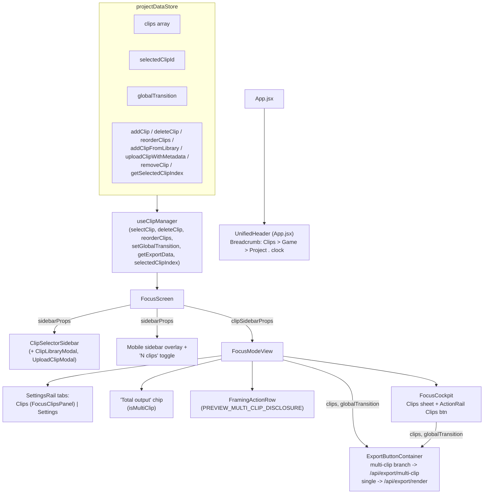
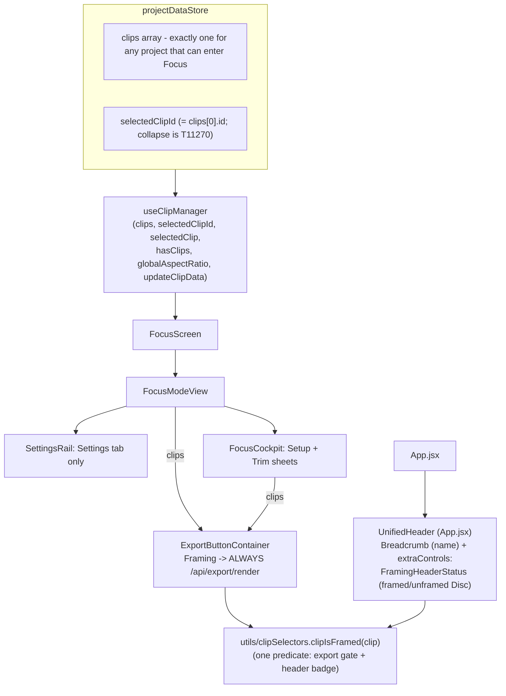

# T11240 Design: Remove multi-clip UI from Framing and Spotlight

**Status:** APPROVED
**Author:** Architect Agent
**Approved:** 2026-09-27 (user approved via chat; Q1 accepted, Q2 deferred to T11280 per recommendation)
**Task:** [T11240-remove-multiclip-editor-ui.md](single-clip-editor/T11240-remove-multiclip-editor-ui.md)
**Epic:** [Single-Clip Editor](single-clip-editor/EPIC.md) (R3, R8, R9 apply; all owner-approved 2026-09-24/25)
**Base revision:** master `a9555c0b` (T11220 PR #517 and T11230 PR #520 landed)
**Knowledge docs:** `keyframes-framing.md`, `export-pipeline.md`, `persistence-sync.md`

---

## 0. Summary

A project is now exactly one clip. T11220 already stops every Framing entry for a legacy
multi-clip draft (`allowEnterFraming`, `clip_count > 1`), so every multi-clip branch inside Focus
is unreachable in practice. T11240 deletes those branches and the UI around them. It does this
as a leaf-first series of commits, with characterization tests first, one behavior change per
commit, and pure deletions kept apart from behavior changes.

Three places need more than a plain deletion:

1. **The clip-switch restore effect** (`FocusScreen.jsx:716-791`) is live for single-clip
   projects. It fires on mount and again whenever `selectedClipId` changes to a new version id.
   It gets characterized first, then deleted in its own commit. The existing init effect
   (:640-705) becomes the only path that restores hook state.
2. **R9 (header status)** is handled through `UnifiedHeader`'s existing, currently unused
   `extraControls` slot: a small `FramingHeaderStatus` badge, shown in Framing only. This is not
   option (c) from the code map. See section 4.1.
3. **Export** always posts `/api/export/render`. The pre-flight credit check and the estimate
   use the one clip. Watch the naming trap: `isMultiClipMode` (`ExportButtonContainer.jsx:1119`)
   is true for every single clip too, and it drives the real single-clip "unframed" gate.

---

## 1. Current State ("As Is")

### 1.1 Data flow (Focus, today)



### 1.2 Clip-restore behavior today (the one piece that is not dead code)

```pseudo
FocusScreen mount (clips already in store, selectedClipId = clips[0].id via setProjectClips):
  useLayoutEffect (mount-only, :617)
      await getClipVideoConfig(clip) -> loadVideoFromStreamingUrl; lastLoadedUrlRef = url
  init effect (:640, deps [clips, clipMetadataCache, ...])
      await getClipVideoConfig(clips[0])            # T10740 foreign-clip guard lives here
      if url and stateRestoredForUrlRef != urlPath and clipDuration(from metadata cache):
          restoreSegmentState / restoreCropState; previousClipIdRef = clip.id
      if lastLoadedUrlRef == urlPath: return        # skip duplicate load
  clip-switch effect (:719, deps [selectedClipId, clips, clipMetadataCache, ...])
      if selectedClipId == previousClipIdRef: return  # ref is null on first run -> falls through
      if isClipFromAnotherProject(clip): return       # T10740 early bail
      previousClipIdRef = selectedClipId               # stamped synchronously, first
      duration = clipMetadataCache[selectedClipId]?.duration
      if segments and duration: restoreSegmentState else: resetSegments(); if duration: initializeSegments
      if cropKfs and duration:  restoreCropState    else: resetCrop()
      await getClipVideoConfig -> loadVideoFromStreamingUrl   # NOT guarded by lastLoadedUrlRef
      clipHasUserEditsRef = false                     # FocusScreen's own ref: write-only (dead)

Version bump (explicit export gesture: saveCurrentClipState -> saveFramingEdits -> refresh_required
-> fetchClips; old id gone -> selectedClipId = data[0].id = NEW id):
  init effect: same URL path -> no restore, no load
  clip-switch effect: previousClipIdRef != new id -> RUNS.
      Production metadata cache is keyed by the OLD id (filled only in useProjectLoader.js:204),
      so duration is undefined -> resetSegments() + resetCrop() (no initialize), then reloads the
      same URL. Crop self-heals through useCrop's savedKeyframes layout effect
      (machineState 'uninitialized' -> re-restore). Segments/trim: suspected NOT re-seeded
      (matches the T4020 comment at FocusScreen.jsx:1063-1066: "useCrop/useSegments have
      re-initialized to defaults"). To be confirmed by characterization CH3.
```

### 1.3 What is dead or unreachable today (evidence)

| Item | Why dead | Evidence |
|---|---|---|
| Every `clips.length > 1` branch in Focus | T11220 `allowEnterFraming` refuses `clip_count > 1` at every Framing entry | `utils/reelReEditable.js:59-65`; `useProjectLoader.js:133`; DraftTile :285-338 |
| `handleFileSelect` / `FileUpload` early return / `onFileSelect` | early return needs `!projectId`, and the handler is a no-op without one; `VideoPlayer` gets `allowUpload={false}` | `FocusScreen.jsx:1021-1031,1407-1414`; `FocusModeView.jsx:683-684` |
| `isRestoringClipStateRef`, FocusScreen `clipHasUserEditsRef` | written, never read | grep: only :140/:144/:433/:738/:784/:786 |
| `useClipManager.getExportData`, `selectedClipIndex` | no consumers (FocusContainer destructures `getClipExportData` but never calls it) | `FocusContainer.jsx:115-122` |
| `addClip`, `getSelectedClipIndex`, `useGlobalTransition` | zero callers | grep across `src/`, `e2e/`, `scripts/` |
| `clipIndex` deep link | `setProjectClips` ignores it (always `clips[0]`); nothing passes `onClipsLoaded` | `projectDataStore.js:118-121`; `useProjectLoader.js:224-233` |
| `reorderClips` persistence | drag-reorder was never saved (EPIC finding 3) | T11210 removed `reorderClipsOnServer` |

### 1.4 Limitations

- Copy that is now false: "N clips" toggle, "N clips in this reel." (FocusClipsPanel), "on every
  clip", "(x/N)" CTA suffix, "Your clips are joined at export.", the transition selector (Modal
  never renders fade/dissolve, EPIC finding 3).
- A second, unguarded export endpoint (`/api/export/multi-clip`) is still called by the
  frontend. T11250 cannot delete it until this task lands.
- Version-bump restore resets hook state (suspected, see CH3). This is a latent defect that
  multi-clip plumbing hides.

---

## 2. Target State ("Should Be")

### 2.1 Updated flow



### 2.2 Target behavior

```pseudo
Open a single-clip project in Framing (desktop, 393px portrait, landscape cockpit):
    no clip list, no "N clips" toggle, no Clips rail tab, no cockpit Clips button/sheet
    header shows the clip's project name (unchanged) + a framed/unframed Disc (FRAMING only)
    export CTA label never carries "(x/N)"; caption is "Set at least one focus point to export"
    credit estimate = required credits for clips[0]'s effective duration (fail-closed to null)
    Export click -> saveCurrentClipState -> POST /api/export/render    (never /multi-clip)

Clip restore:
    mount: init effect restores crop/segments once the URL resolves and the duration is known
           (unchanged; the T10740 guard at the getClipVideoConfig choke point stays)
    version bump (selectedClipId -> new id, same URL): NO reset, NO reload; hook state stays
           as the user left it (it equals what was just saved). Crop/rotation still re-seed
           through useCrop's own savedKeyframes/savedRotation sync if the persisted values change.

Legacy multi-clip draft (clip_count > 1):
    Framing entry refused with LEGACY_MULTICLIP_REFRAME_MESSAGE (T11220, untouched)
    Spotlight + publish unchanged (OverlayScreen/OverlayContainer/OverlayModeView multi-clip
    code is T11260 scope and is NOT touched)
    Drafts tile: SegmentedProgressStrip + T8350 stale badge unchanged; a segment click goes
    through allowEnterFraming as today, and no longer forwards a clipIndex
```

### 2.3 Non-goals (explicitly out of scope)

| Not doing | Owner |
|---|---|
| Spotlight multi-clip gates (`OverlayScreen.jsx:1366-1386`, `OverlayContainer.jsx:120-133,586`, `OverlayModeView.jsx:259,275,1198-1200`), `highlightCarryNote` `multiclip_reset`, `buildClipMetadata` + its duplicate in `useProjectLoader.js:47` | T11260 |
| `ExportTooLargeModal` multi-contributor copy | T11250 |
| Backend `/api/export/multi-clip`, clip-management endpoints | T11250 |
| Collapsing `selectedClipId` / `clips[]` into "the clip"; `useSelectedClipId`; the `useClipManager` first-clip auto-select effect; `latestSelectedClipIdRef`; the `handleProceedToOverlayInternal` duration-sum fallback | T11270 |
| `utils/reelStaleness.js` (kept: `DraftTile.jsx:30,395`, `SegmentedProgressStrip.jsx:4,68`) | stays (T11220/R3) |
| `SegmentedProgressStrip` component and its test | stays (section 4.4) |
| Modal `process_clips_ai` concat branch | R10: leave |
| Focus settings "Reel" / "This clip" group labels | Open question Q2 |
| Undo entries becoming no-ops after a version bump (id-keyed guard in `applyInverseKeyframeState`) | pre-existing; note for T11270 |
| `T5700-two-lanes.qa.spec.js:114` (`clip-item` in an Annotate spec) | already stale before this task |

---

## 3. Recommended Approach and Alternatives

### 3.1 Clip-switch restore effect: characterize, then delete (no replacement)

**Recommendation:** delete the effect together with `previousClipIdRef`, `isRestoringClipStateRef`
and FocusScreen's write-only `clipHasUserEditsRef`. Keep the init effect unchanged as the only
restore path. Before any deletion, a characterization commit pins mount, foreign-clip and
version-bump behavior.

Why the effect is not needed for one clip:

- **Mount.** The init effect restores the same data once the URL resolves. The clip-switch
  effect's synchronous restore only runs one tick earlier. The timeline is gated on `videoUrl`
  (`FocusModeView.jsx:458`), and `useCrop` seeds crop from `savedKeyframes` in a layout effect
  whatever the timing. So nothing visible depends on that earlier tick. The effect's duplicate,
  unguarded `loadVideoFromStreamingUrl` also goes away.
- **Foreign clip (T10740).** The init effect restores only after `getClipVideoConfig` has run
  its foreign-clip guard. So "a foreign clip's keyframes never reach the hooks" still holds by
  construction. It is simpler, because there is no longer a path that restores before resolving
  the URL. All three existing `focusScreenStaleClipGuard.test.jsx` cases must stay green unchanged.
- **Version bump.** The new version's persisted data equals the hook state that was just
  saved. Crop and rotation already re-seed through `useCrop` (`useCrop.js:89-95,206-219`) if the
  persisted values change, for example after the aspect-ratio re-fit. Segments are never changed
  server-side by a version bump. Re-restoring is at best a no-op. In production it is a reset,
  because the metadata cache has no entry for the new id.

**Alternative considered: fold the effect into the init effect**, re-keying the restore guard
from URL path to clip id and hoisting the restore above the `await`. Rejected as the default:
it keeps the version-bump re-restore (and in production the reset) that the single-clip world
does not need, and it is a larger behavior diff. It stays as the **pre-specified fallback** if
CH2/CH5 or the live drive show a real regression, for example an expired-source clip whose
segments never restore because the URL never resolves (Risk R5).

### 3.2 R9: `UnifiedHeader.extraControls` framing badge (option a)

See section 4.1 for the full comparison. Summary: the name is already in the header at every
width. The status is the only thing that has no home. `extraControls` is an existing, unused
slot in the one "existing header" R9 names, and it covers desktop and mobile with a single
insertion point.

### 3.3 Export: always `/render`, credit math on the one clip

**Recommendation:** delete the `isMultiClip` branch (:628-670) and the now-unreachable framing
half of the shared multipart tail (:820-865). The tail remains only for overlay's legacy
no-`projectId` blob path, so `responseType` simplifies to `'blob'`. Replace
`sumEffectiveDurations` with a single-clip fail-closed helper, `knownEffectiveDuration(clip)`
(null when unknown/NaN/non-positive), used by `estimateExportCredits`, `estimatedSeconds` and the
pre-flight credit check (which already falls back to `clips[0].duration`, unchanged).

**Alternative: keep `sumEffectiveDurations`**, since it is numerically identical for one clip.
Rejected: the task says "Simplify". A "sum" that is only ever called on a one-element list is
the misleading-name problem this epic removes. With one fewer caller after the Total chip goes,
a single-clip helper is the smaller surface. The fail-closed-to-null contract (EPIC "no
fabricated numbers") carries over exactly.

A `clips.length > 1` array reaching Framing is an internal bug (T11220 guards every entry).
The frontend does **not** add a defensive branch. `/api/export/render` already refuses more
than one clip loudly (`routers/export/framing.py:214`), which is the correct fail-visible
behavior under the coding standards.

### 3.4 Abstraction check (third-duplication rule)

- `clipIsFramed(clip)` is extracted because there are **two live copies of one predicate**
  (sidebar `hasUserSegmentEdits` + crop check; export `clipsNotFramed` filter) and T11240
  adds a third consumer (the header badge). This meets the third-duplication rule, and it
  guarantees the badge and the export gate can never disagree.
- No other new abstraction. `FramingHeaderStatus` is a leaf presentational component, not a
  registry or slot system.

---

## 4. Decisions on the Caller's Specific Questions

### 4.1 R9 resolved: option (a), `UnifiedHeader.extraControls`

| Option | Name | Status | Desktop | Mobile | Cockpit | Cost | Verdict |
|---|---|---|---|---|---|---|---|
| (a) `extraControls` (App.jsx:1010-1025) | already in breadcrumb / mobile title | new Disc badge | yes | yes (`UnifiedHeader.jsx:56`) | header covered by cockpit; stage chip already shows name | ~40 LOC: 1 component + 1 prop + predicate move | **Chosen** |
| (b) Breadcrumb `itemMeta` | - | string slot only | yes | **no** (mobile ignores it) | - | slot already holds the game clock (`App.jsx:1016`) | Rejected: occupied, desktop-only, text-only |
| (c) widen `FocusModeView.jsx:811-829` row to all widths | **duplicates** breadcrumb name on desktop | Disc in row | yes | yes | chip already mirrors | similar LOC | Rejected: undoes the user's 2026-09-18 T10310 request (desktop identity moved OFF FocusModeView onto the breadcrumb; pinned by `FocusModeView.clipIdentity.test.jsx:101-108`), and it is not "the existing header" |

**Design of (a):**

```pseudo
// utils/clipSelectors.js  (moved predicate, one source of truth)
clipIsFramed(clip):
    hasCrop = clip.cropKeyframes?.length > 0 or clipCropKeyframes(clip).length > 0
    if hasCrop: return true
    s = clip.segments or clip.segments_data
    if not s: return false
    return keys(s.segmentSpeeds).length > 0 or !!s.trimRange or s.userSplits?.length > 0

// components/FramingHeaderStatus.jsx  (new, presentational, ~30 LOC)
FramingHeaderStatus({ editorMode, clip }):
    if editorMode != FRAMING or not clip: return null
    framed = clipIsFramed(clip)
    <span role="img" data-testid="clip-framing-badge" data-state={framed ? DONE : UNDONE}
          title={framed ? EDITOR_PANELS.CLIP_FRAMED : EDITOR_PANELS.FRAME_CLIP_HINT}
          aria-label={framed ? EDITOR_PANELS.CLIP_FRAMED : ANNOTATE.FRAME_CLIP}>
        <Disc state=... size="sm" Icon={Crop}/>          // same markup the sidebar used (T10980)

// App.jsx (the existing framing/overlay UnifiedHeader mount)
+ extraControls={<FramingHeaderStatus editorMode={editorMode} clip={selectedClipForAnnotate} />}
```

- **Data source:** `selectedClipForAnnotate` (App.jsx:126-133, already derived from
  `projectDataStore`). That is the same persisted `crop_data` / `segments_data` the sidebar read.
  Surgical gesture handlers already update the store optimistically "so sidebar framing
  indicator reflects the change immediately" (`FocusContainer.jsx:457-465`, :609, :674, :740,
  :1034), so the badge has the same liveness the sidebar had. It is read-only derivation: no
  state, no persistence.
- **Reuses** `EDITOR_PANELS.CLIP_FRAMED` / `FRAME_CLIP_HINT` (so they do not become orphans)
  and the `clip-framing-badge` testid, so existing e2e habits carry over.
- **Deliberately not carried** from the sidebar: the rating icon (an Annotate concept, still
  shown there) and the T8350 stale dot. For single-clip projects, framing staleness is already
  shown by `deriveFramingCtaState` ("Generate Framing" vs "Back to Preview",
  `FocusScreen.jsx:1299-1306`). `reel_source_*` staleness is a multi-clip reel concept, and those
  drafts cannot enter Framing.
- **Cockpit:** the cockpit is fixed full-bleed over the header (`FocusCockpit.jsx:137-146`).
  Its stage chip already shows the name, and its CTA and caption carry the framed gate. No
  cockpit change for R9.

### 4.2 FocusClipsPanel (T9270): in scope, no separate design note needed

`components/settings/FocusClipsPanel.jsx` and the rail's `{ id: 'clips' }` tab
(`FocusModeView.jsx:14,418-421,435-437`) are Focus multi-clip UI. The copy "N clips in this reel."
and "Select, reorder, and trim clips on the timeline below the video." is false for a
single-clip project. It is not T11260 (Spotlight carry/gates) and not T11270 (mechanical
selection collapse). It is deleted in the UI-deletion commit alongside the sidebar. After deletion:

- `focusRailTabs = [{ id: 'settings', ... }]`. Keep the single tab: on desktop the collapsed
  64px strip uses tab icons as its expand affordance (`SettingsRail.jsx:230-247`). On mobile the
  tablist already hides itself when there is at most one tab (`SettingsRail.jsx:162`).
  `railTab` already defaults to `'settings'` (`FocusModeView.jsx:344`), so no initial-state
  change is needed.
- No test references `settings-tab-clips` (grep-verified).

### 4.3 Clip-switch effect: characterization before deletion

Covered in 3.1 and 5 (commit C1 then C4). Characterization cases:

| ID | Scenario (render real FocusScreen, `focusScreenStaleClipGuard` harness pattern) | Pins |
|---|---|---|
| CH1 | Mount: 1 clip, own project, metadata cached | restoreCropState + restoreSegmentState called with the clip's parsed data; playback-url fetched; video loaded with the clip URL |
| CH2 | Mount: 1 clip, own project, **no** metadata-cache entry | record current calls (expected: no restore; resets only) |
| CH3 | Version bump: rerender with the same clip under a NEW id, same URL, **new id absent from metadata cache** (production shape) | record reset/restore/load calls (suspected: `resetSegments` + `resetCrop` + extra load) |
| CH4 | Version bump with the new id present in the cache | record (expected: re-restore with identical data + extra load) |
| CH5 | Source URL unresolvable (playback-url 410/expired), metadata cached | record whether segments restore (clip-switch restores before the URL; init effect does not) |
| T10740 x3 | existing cases | must stay green, unchanged, through every commit |

**Rule for C4:** CH1, CH2 and T10740 x3 must be green before and after with identical
assertions. CH3/CH4 are expected to change (no reset, no reload after C4). The same test file
therefore carries the C4 red-to-green proof: the target assertions are written in C1, observed
red on C1's revision, and observed green on C4's revision. CH5: if C4 changes it (segments no
longer restored while the source is expired), apply the pre-specified fold fallback from 3.1
in C4 rather than accepting the regression.

### 4.4 SegmentedProgressStrip: untouched

- The strip draws per-clip segments and the T8350 stale state for legacy multi-clip drafts on
  the Drafts tile. That is data display for R3-option-A drafts, which T11220 deliberately kept.
  It is not editing UI.
- The only T11240 change in its neighborhood is in **DraftTile**: `handleClipClick(clipIndex)`
  (:287-293) stops forwarding `clipIndex` (`onSelectWithMode({ mode: 'framing' })`), and :335
  drops `clipIndex: 0`. The strip keeps calling `onClipClick(clipIndex)`; the handler ignores
  the argument. Narrowing the strip's callback signature is T11270 tidy-up, not needed here.
- `SegmentedProgressStrip.test.jsx` has **no** `onClipClick` / `clipIndex` assertions
  (grep-verified). The task's "rewrite `SegmentedProgressStrip.test.jsx`" item is **dropped**:
  there is nothing multi-clip-editing in it to rewrite. Its `clip_count: 2` case (:67) is a
  legacy-draft display case and stays valid.

---

## 5. Implementation Plan ("Will Be"), commit by commit

Order is foundation before consumer and leaf before store: every commit builds, and every
characterization test stays green at every commit. "Pure deletion" commits may exceed ~200 lines.
"Behavior" commits stay under ~200 lines of meaningful diff. Commit subjects start `T11240:`.

### C1: Tests first (no production change)

| File | Change |
|---|---|
| `src/screens/__tests__/focusScreenClipRestore.characterization.test.jsx` (new) | CH1-CH5 per 4.3, reusing the `focusScreenStaleClipGuard.test.jsx` mock harness. CH3/CH4 assert the TARGET (no reset, no extra load) and are observed red here |
| `src/stores/T11240.multiclip-store-removed.test.js` (new) | T11210 pattern: assert `projectDataStore` no longer exposes `globalTransition`, `setGlobalTransition`, `addClip`, `deleteClip`, `reorderClips`, `addClipFromLibrary`, `uploadClipWithMetadata`, `removeClip`, `getSelectedClipIndex`; `stores/index.js` no longer exports `useGlobalTransition`. Red here |
| `src/containers/ExportButtonContainer.renderOnly.test.jsx` (new) | Framing export with `clips` of length 2 posts `/api/export/render` and never `/api/export/multi-clip` (red on master: it posts multi-clip). Single-clip case posts `/render` (green both sides, characterization) |
| `src/components/FramingHeaderStatus.test.jsx` (new) | renders null outside FRAMING / with no clip; `data-state` DONE for crop, for trim-only, for speed-only; UNDONE for an untouched clip. Red (module absent) |
| `src/modes/FocusModeView.noClipList.test.jsx` (new) | with 1 clip: no `settings-tab-clips`, no "clips in this reel", no `project-output-length-chip`. Red on master for the Clips tab |
| `src/modes/focus/cockpit/__tests__/FocusCockpit.test.jsx` | add: no `cockpit-clips-btn` (red) |

### C2: R9 foundation (behavior add, ~60-80 LOC)

| File | Change |
|---|---|
| `src/utils/clipSelectors.js` | add `clipIsFramed(clip)` (predicate moved verbatim from `ExportButtonContainer.jsx:1120-1130`; semantics identical to the sidebar's `hasCrop || hasUserSegmentEdits`) |
| `src/containers/ExportButtonContainer.jsx` | `clipsNotFramed` filter calls `clipIsFramed` (behavior-neutral) |
| `src/components/FramingHeaderStatus.jsx` (new) | section 4.1 |
| `src/App.jsx` | `extraControls={<FramingHeaderStatus editorMode={editorMode} clip={selectedClipForAnnotate} />}` on the framing/overlay `UnifiedHeader` mount (:1010-1025) |

Lands **before** the sidebar deletion so there is no revision where the status disappears.
FramingHeaderStatus tests go green.

### C3: UI deletion (pure deletion, large)

| File | Change |
|---|---|
| `src/components/ClipSelectorSidebar.jsx` + `.test.jsx` | delete |
| `src/components/ClipLibraryModal.jsx` + `ClipLibraryModal.honestZero.test.jsx` | delete (sidebar-only importer, verified) |
| `src/components/UploadClipModal.jsx` + `__tests__/UploadClipModal.noSport.test.jsx` | delete (sidebar-only importer, verified) |
| `src/components/settings/FocusClipsPanel.jsx` | delete |
| `src/screens/FocusScreen.jsx` | remove imports `List,X` (:2), `ClipSelectorSidebar` (:14), `FileUpload` (:15); selectors `addClipFromLibraryAction`/`uploadClipWithMetadataAction`/`removeClipFromServer` (:84,:85,:88); `showMobileSidebar` (:112); `handleFileSelect` (:1020-1031); handlers `handleSelectClip`, `handleDeleteClip`, `handleAddClipFromSidebar`, `handleUploadWithMetadata`, `handleAddFromLibrary` (:1335-1378); FileUpload early return (:1407-1414); `sidebarProps` (:1416-1429); desktop sidebar + skeleton + mobile overlay + "N clips" toggle (:1433-1486, keeping the outer flex wrapper and the `CollectionPlayer` block); props `onFileSelect`, `clipSidebarProps` to FocusModeView. **KEEP** `selectedClipGameName` (:1328-1333), the T10190 shaper (:1382-1405, :1611-1621) and `extractVideoMetadata` (still used :1086) |
| `src/containers/FocusContainer.jsx` | delete `clearFramingHistory` (:398-406, :1196; its only caller was `handleSelectClip`); update the :360 comment (the id guard stays, still relevant across version bumps) |
| `src/modes/FocusModeView.jsx` | remove `FocusClipsPanel` import (:14), Clips tab (:419), `focusRailBody` clips branch (:435-437); props `onFileSelect` (:203, :683) and `clipSidebarProps` (:306, :569) |
| `src/modes/focus/cockpit/FocusCockpit.jsx` | remove `ClipSelectorSidebar` import (:7), `clipSidebarProps` prop (:56-57), `onOpenClips` (:262), Clips `CockpitSheet` (:280-287); `activeSheet` comment |
| `src/modes/focus/cockpit/ActionRail.jsx` | remove `onOpenClips` prop (:41) and `cockpit-clips-btn` (:95-101) |
| `src/config/displayNames.js` | remove `FOCUS_COCKPIT.CLIPS` (:514), `SHEET_CLIPS` (:524) |
| tests | `FocusCockpit.test.jsx` (:11-12 mock, :51 prop, :103, :110-117), `ActionRail.test.jsx` (:7,:28,:43), `focusCompletionPlayerProps.test.jsx` (:48 `clearFramingHistory`, :104 mock), `focusScreenStaleClipGuard.test.jsx` (:62, :198 mock, :261,:265 store stubs; update header comment that cites the clip-switch effect in C4) |

### C4: Delete the clip-switch restore effect (behavior, small)

| File | Change |
|---|---|
| `src/screens/FocusScreen.jsx` | delete the effect (:716-791), `previousClipIdRef` (:143, :678-680), `isRestoringClipStateRef` (:144), FocusScreen's `clipHasUserEditsRef` (:140) and its `onUserEdit` writer (:433; FocusContainer's own ref is separate and stays) |
| `src/screens/__tests__/focusScreenStaleClipGuard.test.jsx` | header comment only (the ordering claim moves to "restore happens only after the choke-point guard"); assertions unchanged |

Proof: CH1, CH2 and T10740 x3 unchanged-green; CH3/CH4 red at C1, green here; CH5 per 4.3.

### C5: Export always `/render` (behavior)

| File | Change |
|---|---|
| `src/utils/effectiveDuration.js` | replace `sumEffectiveDurations` with `knownEffectiveDuration(clip)` (fail-closed null). **Do not touch** `buildClipMetadata` (T11260) |
| `src/containers/ExportButtonContainer.jsx` | `estimateExportCredits(clip)` on `knownEffectiveDuration` (:42-48; update JSDoc :30); drop `globalTransition` prop (:95); credit check uses `calculateEffectiveDuration(clips?.[0])`, dropping the multi reduce (:523-529; keep the fallback + fail-closed block); delete the multi-clip branch (:629-670) so the framing path is the `/render` block unconditionally; delete the framing half of the shared tail (:820-865), `responseType: 'blob'`; `estimatedCredits`/`estimatedSeconds` pass `clips?.[0]` (:1080-1096); `sourceFps` becomes `clips?.[0]?.fps` with the same null rule (:1102-1114, rewrite the comment); unframed: `hasUnframedClips = clips?.length > 0 ? !clipIsFramed(clips[0]) : (!cropKeyframes || cropKeyframes.length === 0)`; delete `isMultiClipMode`, `unframedCount`, `totalClips` and the "every clip" title branch (:1119-1156); return object drops `unframedCount`, `totalExtractedClips`, `isMultiClipMode`. **Naming trap:** the old `isMultiClipMode` was true for one clip; the `clipsNotFramed` path IS the single-clip gate. Preserve it via `clipIsFramed(clips[0])` |
| `src/components/ExportButtonView.jsx` | drop props (:46-48), the "(x/N)" label (:112-113) and the "every clip" caption (:166-168); label = `job.action` |
| `src/modes/FocusModeView.jsx` | `ExportButtonSection` drops `globalTransition` (:71, :96, :1053) and `unframedCount`/`totalExtractedClips`/`isMultiClipMode` passthrough (:120-122); drop the `globalTransition` prop (:281) and cockpit passthrough (:576) |
| `src/modes/focus/cockpit/FocusCockpit.jsx` | drop `globalTransition` (:62, :93) |
| `src/modes/OverlayModeView.jsx` | drop the no-op `unframedCount`/`totalExtractedClips`/`isMultiClipMode` props (:78-80) |
| `src/screens/FocusScreen.jsx` | drop `globalTransition={globalTransition}` to FocusModeView (:1575) |
| tests | `ExportButtonContainer.test.js` (:149-206: single-clip `estimateExportCredits`; delete the 23-credit multi-clip sum and the NaN-in-list case, keeping a single NaN case), `effectiveDuration.test.js` (:94-118 to `knownEffectiveDuration`), `ExportButtonView.test.jsx` (:21-22, :107-113, :221-222), `ExportButtonView.billableDisclosure.test.jsx` (:26-27) |

Credit AC test: `estimateExportCredits(clip)` equals `getRequiredCredits(effective duration of
that clip)` for plain, trimmed and slow-mo clips (the existing :162-185 single-clip cases, ported).

### C6: Total chip, disclosure, project total (behavior, small)

| File | Change |
|---|---|
| `src/modes/FocusModeView.jsx` | delete `isMultiClip` (:451-452), `isMultiClip` to FramingActionRow (:866), Total chip block (:936-949), `projectEffectiveDuration` prop (:278) |
| `src/modes/focus/FramingActionRow.jsx` | drop `isMultiClip` (:19, :60) |
| `src/config/displayNames.js` | delete `EDITOR_PANELS.PREVIEW_MULTI_CLIP_DISCLOSURE` (:717) and its comment (:712) |
| `src/containers/FocusContainer.jsx` | delete `projectEffectiveDuration` (:292-302, :1175), `sumEffectiveDurations` import; drop the unused destructured props `globalTransition`, `addClip`, `deleteClip`, `selectClip`, `reorderClips`, `setGlobalTransition`, `getClipExportData` (:115-122) |
| `src/screens/FocusScreen.jsx` | drop `projectEffectiveDuration` destructure (:441) and prop (:1570); stop passing the dead props into `FocusContainer` (:424-430) |
| tests | `FramingActionRow.test.jsx` (:61-63), `FocusModeView.framingActionRow.test.jsx` (:97), `focusCompletionPlayerProps.test.jsx` (:32), `focusScreenStaleClipGuard.test.jsx` (:46) |

### C7: Store and hook shrink (pure deletion)

| File | Change |
|---|---|
| `src/stores/projectDataStore.js` | delete `globalTransition` (:51-55, :414), `setGlobalTransition` (:73), `addClip` (:83-85), `deleteClip` (:87-96), `reorderClips` (:104-109), `addClipFromLibrary` (:279-299), `uploadClipWithMetadata` (:301-327), `removeClip` (:329-350), `getSelectedClipIndex` (:377-381), `useGlobalTransition` (:425). Keep `useSelectedClipId` (T11270) and `setProjectClips` |
| `src/stores/index.js` | drop the `useGlobalTransition` re-export (:14) |
| `src/hooks/useClipManager.js` | drop `globalTransition`, `setGlobalTransition`, `deleteClip`, `reorderClips`, `selectClip`, `getExportData`, `selectedClipIndex`, and the `clipCropKeyframes` import; KEEP the auto-select effect (:55-59, T11270) and `updateClipData` |
| `src/screens/FocusScreen.jsx` | `useClipManager` destructure = `clips, selectedClipId, selectedClip, hasClips, globalAspectRatio, updateClipData` |
| tests | `useClipManager.aspectRatio.test.js` (check it only asserts `globalAspectRatio`), `focusScreenStaleClipGuard.test.jsx` / `focusCompletionPlayerProps.test.jsx` `useClipManager` mocks (:184-191 / :96-98). The C1 store-removal test goes green |

### C8: `clipIndex` deep link (pure deletion; it is already inert)

| File | Change |
|---|---|
| `src/hooks/useProjectLoader.js` | drop `clipIndex`, `onClipsLoaded` (:99-100, :223-233) and `selectedClipIndex` in both return objects (:135, :277) |
| `src/utils/pendingNavigation.js` | drop `PROJECT_CLIP_KEY` (:25) and its read/write/clear (:149-176). A stale `pendingProjectClipIndex` sessionStorage key from a pre-deploy tab is never read and dies with the tab: no shim |
| `src/screens/ProjectsScreen.jsx` | drop `clipIndex` pass-through (:288, :318) |
| `src/components/DraftTile.jsx` | `handleClipClick` ignores its argument (:287-293); :335 `{ mode: 'framing' }` |
| `src/components/ProjectManager.jsx` | JSDoc at :500 (`clipIndex?`) |
| tests | `pendingNavigation.test.js` (:69-105), `DraftTile.test.jsx` (:508, :561 `toHaveBeenCalledWith({ mode: 'framing' })`) |

### C9: e2e specs + knowledge docs

`e2e/` is never run by Branch CI (CLAUDE.md refactoring rule 7), so these are updated by grep and
then live-driven, never assumed.

| File | Change |
|---|---|
| `e2e/T5790-export-credit-cost-estimate.qa.spec.js` | delete the multi-clip Total test (:259-299) and the `PROJ_CHIP` const (:42) |
| `e2e/T8350-multiclip-staleness-cue.qa.spec.js` | delete AC2 "Focus clip-list dot" (:202-243); tile ACs stay |
| `e2e/T10840-focus-landscape-cockpit.qa.spec.js` | remove the Clips-sheet step and `cockpit-clips-btn` from the target list (:73-81) |
| `e2e/regression-tests.spec.js` | delete "per-clip edits persist after switching clips" (:1603 block, uses `clip-item` :1713, :1810); Full Pipeline (:1971-1975): replace the sidebar check with `clip-framing-badge` visible |
| `e2e/T8510-export-guard.qa.spec.js` | header comment (:11 "multi-clip partial") only |
| `e2e/tutorial-capture-framing.spec.js` | :200 "Clips" click is wrapped in try/catch, so it silently no-ops. Leave it; flag to T10320 (reshoot) since the line-14 script ("frame another") is multi-clip narration |
| `.claude/knowledge/keyframes-framing.md` | :45 (cockpit sheets no longer reuse the sidebar), :174, :248-252 and :293 (single-clip credit math), :275/:282/:319 (Total chip, multi-clip sum), :340 (T10740: the clip-switch-effect clause goes; restore happens only after the choke-point guard) |
| `.claude/knowledge/export-pipeline.md` | the frontend no longer calls `/api/export/multi-clip` (T11250 deletes it) |
| `.claude/knowledge/annotate.md` | :696 `sumEffectiveDurations` reference; :1258 stale "Annotate's ClipSelectorSidebar" claim |

### 5.1 Size estimate

~30 production files touched or deleted. Roughly -2,300 production LOC and -1,500 test LOC, plus
about 400 new test LOC. Meaningful behavior-change diff: C2 about 80, C4 about 90 (mostly
deletion), C5 about 180, C6 about 60. All under the ~200 cap.

---

## 6. Verification

### 6.1 Acceptance criteria mapping

| AC | Evidence |
|---|---|
| Red-then-green: Framing on a single-clip project renders no clip list and exports via `/render` | `FocusModeView.noClipList.test.jsx`, `FocusCockpit.test.jsx` no-Clips-button (red C1, green C3); `ExportButtonContainer.renderOnly.test.jsx` (red C1, green C5) |
| Credit estimate equals the single clip's cost (test) | ported `estimateExportCredits(clip)` cases (C5); characterization, green on both sides |
| Legacy multi-clip draft opens, re-framing refused with the T11220 message | existing T11220 suite stays green, untouched: `reelReEditable.test.js`, `useProjectLoader.reframeGuard.test.jsx`, `multiClipReframeEntryPoints.test.jsx`, `ModeSwitcher.test.jsx`, `DraftTile.test.jsx`, `resumeFocusCompletion.test.js`; plus a live drive: open a legacy multi-clip draft with a working video -> Spotlight -> publish path reachable; Framing tab refused with the message |
| Live-driven desktop, 393px portrait and landscape cockpit | live drive per criterion: no list, no toggle, no Clips tab/button; header badge flips UNDONE -> DONE on the first focus point, trim-only and speed-only (desktop + 393px); cockpit Setup/Trim sheets still open; export runs and completes via `/render` (network log) |

### 6.2 Relevant local test set (curated; Branch CI runs the full frontend suite)

New: `focusScreenClipRestore.characterization.test.jsx`, `T11240.multiclip-store-removed.test.js`,
`ExportButtonContainer.renderOnly.test.jsx`, `FramingHeaderStatus.test.jsx`,
`FocusModeView.noClipList.test.jsx`.
Updated regression guards: `focusScreenStaleClipGuard.test.jsx`, `focusCompletionPlayerProps.test.jsx`,
`FocusCockpit.test.jsx`, `ActionRail.test.jsx`, `ExportButtonContainer.test.js`,
`ExportButtonView.test.jsx`, `ExportButtonView.billableDisclosure.test.jsx`, `effectiveDuration.test.js`,
`FramingActionRow.test.jsx`, `FocusModeView.framingActionRow.test.jsx`, `FocusModeView.clipIdentity.test.jsx`,
`useClipManager.aspectRatio.test.js`, `pendingNavigation.test.js`, `DraftTile.test.jsx`.
T11220 guards (unchanged, must stay green): listed in 6.1.
e2e (live, targeted): `T5790`, `T8510`, `T10840`, `T8350` (tile ACs), `regression-tests` Full Pipeline.

### 6.3 Failure behavior

- A `clips.length > 1` array reaching Framing (an internal bug): the estimate reflects
  `clips[0]` and `/render` refuses with a 4xx, so the export fails visibly with the backend error.
  No frontend defensive branch.
- Unknown duration: the estimate is hidden (null) and the pre-flight check blocks with the
  existing "Cannot determine video duration" error (unchanged).
- Header badge with no clip loaded: renders nothing (no placeholder, no fabricated state).

---

## 7. Risks

| # | Risk | Mitigation |
|---|---|---|
| R1 | Deleting the clip-switch effect changes mount or version-bump restore for single-clip projects | C1 characterization before C4; CH1/CH2/T10740 must be identical before and after; CH3/CH4 changes are the intended red-to-green; live drive: open, frame, export (version bump), keep editing, confirm trim/speed and crop survive |
| R2 | Regressing legacy multi-clip drafts in Spotlight/publish (T11220/R3) | Overlay files untouched (T11260 scope); the overlay export path in `ExportButtonContainer` keeps the `/render-overlay` path and the legacy blob tail; T11220 suite green; live drive of one legacy draft through Spotlight -> publish |
| R3 | `isMultiClipMode` naming trap: deleting the `clipsNotFramed` path removes the real single-clip unframed gate (T8510) | C5 rewrites the gate as `!clipIsFramed(clips[0])`; `ExportButtonView.test.jsx` + `T8510` e2e caption/disabled matrix |
| R4 | A "zero callers" claim misses e2e/scripts (CLAUDE.md rule 7) | every deletion commit's grep covers `src/`, `e2e/`, `scripts/`; the C9 list above is that grep's result |
| R5 | Restore now waits for URL resolution: an expired-source clip (T8310) may not restore segments until the source is re-resolved | CH5 pins current behavior; if C4 changes it, apply the pre-specified fold fallback (3.1) in C4; live check with an expired-source clip if one is available |
| R6 | Header badge lags a gesture that does not update the store optimistically | same data source and liveness as the deleted sidebar badge (parity, not a new gap); live drive checks crop add, delete last focus point, trim, speed |
| R7 | Badge shows outside Framing | the component gates on `editorMode === FRAMING` (unit-tested); Annotate's own `UnifiedHeader` mount (`AnnotateScreen.jsx:720`) is untouched |
| R8 | Stale frontend tabs still call `/api/export/multi-clip` after this deploys | T11250 is sequenced after T11240 and removes the endpoint; the backend refuses a >1-clip `/render` regardless |
| R9 | A large pure-deletion commit hides a behavior change | C3/C7/C8 contain deletions only; each behavior change lives in C2/C4/C5/C6 with its own proof; the reviewer checks C3 for non-deletion lines |
| R10 | Line numbers drift as C3 deletes around the T10190 completion-preview shaper | after C3 and C4, grep `T10190` in `FocusScreen.jsx` and confirm `focusCompletionPlayerProps.test.jsx` stays green (it pins the shaper) |

---

## 8. Open Questions

Both resolved by the user (chat, 2026-09-27):

- [x] **Q1:** If CH3 confirms that today's export-time version bump resets segments/trim in the
      hooks, T11240 removes that reset as a side effect of deleting the clip-switch effect
      (hooks keep the user's just-saved state). **Accepted.** It is the correct single-clip
      behavior and is proven red-to-green in C4.
- [x] **Q2:** The Focus settings rail still groups controls as **"Reel"** (aspect, audio) vs
      **"This clip"** (straighten) (`FocusSettingsPanel.jsx:15,44,78`). **Deferred to T11280**
      (Reel vocabulary sweep) rather than done here — it is a copy/grouping decision, not
      multi-clip editing machinery.

R9 is resolved (option a, section 4.1). FocusClipsPanel scope (4.2) and SegmentedProgressStrip
scope (4.4) are decided and need no user call.
