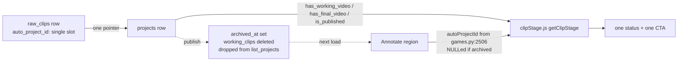
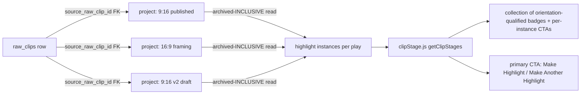

# T11430 Design: Multiple highlights per play + aspect-qualified status

**Status:** DRAFT (awaiting user approval — design gate)
**Author:** Architect (design phase dispatch)
**Tier:** L (cross-layer + data-model change, design-gated)
**Task file:** `docs/plans/tasks/T11430-multiple-highlights-per-play-aspect-status.md`
**Code audit:** see Appendix A (Code-Expert findings, all file:line verified read-only in this container)

---

## 0. Classification

```
Tier: L
Stack Layers: Frontend + Backend + Database (profile_db migration)
Files Affected: ~10-13 files
LOC Estimate: ~450-650 lines (incl. migration + tests)
Test Scope: Frontend Unit (clipStage), Frontend E2E (annotate status flow), Backend (read + create + migration)
Knowledge Docs: annotate.md, persistence-sync.md, backend-services.md, keyframes-framing.md (aspect only)
```

| Agent | Include? | Justification |
|-------|----------|---------------|
| Code Expert | Yes (done) | Mapped root cause + all status surfaces + schema (Appendix A). |
| Architect | Yes (this doc) | New durable data-model + read contract. |
| Tester | Yes | Migration/backfill + regression matrix required by ACs. |
| Reviewer | Yes (parallel fan-out, L-tier) | Schema + persistence + multi-surface change. |
| Migration | Yes | New profile_db migration v056 (additive column + backfill). |

---

## 1. Problem restated

A play (`raw_clip`) that already produced and **published** a highlight still renders the CTA
**Make Highlight** and the badge **Highlight Not Started**. Two defects, one of which is a missing
product model:

1. **Status bug (regression):** publishing *archives* the play's project, and both Annotate read
   paths treat an archived project as "no project" — so a published play reads NOT_STARTED.
2. **Missing model:** the UI reasons from a single `raw_clips.auto_project_id` + one `linkedProject`.
   One pointer cannot express *N* highlights per play, or a published vertical + a not-started
   horizontal, or multiple versions of either orientation.

---

## 2. Root cause (verified from code, Appendix A §A)

Publishing a highlight calls `publish_to_my_reels` → `archive_project` (`project_archive.py:119`),
which sets `projects.archived_at = CURRENT_TIMESTAMP` **and deletes the project's `working_clips`
rows** (`project_archive.py:122`). Then on the next Annotate load:

- `load_annotations_from_db` (`games.py:2506`) force-NULLs the region's `auto_project_id` for any
  archived project:
  ```sql
  CASE WHEN p.id IS NOT NULL AND p.archived_at IS NULL
       THEN rc.auto_project_id ELSE NULL END AS auto_project_id
  ```
- `list_projects` (`projects.py:496`) returns only `WHERE p.archived_at IS NULL`, so the published
  project is not even in the `projectsList` the frontend reads.

Net: `region.autoProjectId` arrives `null` → `getClipStage` takes the `!hasProject` branch
(`clipStage.js:64-72`) → **"Highlight Not Started" / "Make Highlight"**. The DB pointer column may
even still be intact; the display layer erases it.

**Secondary orphaning mechanisms** (any of which can also break the pointer durably — Appendix A §A):
re-"Make Highlight" after publish repoints `auto_project_id` to a fresh empty project
(`clips.py:1481-1495`), project deletion/FK `SET NULL` clears it (`projects.py:914-919`,
`database.py:1211`), and `_delete_auto_project` can null it. All are symptoms of **one mutable
single-slot pointer standing in for what is really a one-to-many history.**

> The production record for the reported play (`imankh@gmail.com`, `Great Goal` ~24:01, game
> `at Oceanside Breakers Aug 30`) will be inspected read-only by the supervisor before
> implementation to confirm *which* of these mechanisms applied — but the design does not depend
> on that answer: the fix (durable one-to-many link + archived-aware read) repairs all of them.

---

## 3. Current State ("As Is")

### 3.1 Data flow



### 3.2 Current behavior (pseudocode)

```pseudo
load region:
  autoProjectId = (project exists AND project.archived_at IS NULL) ? rc.auto_project_id : NULL
linkedProject = projectsList.find(id == region.autoProjectId)   # list excludes archived
stage = getClipStage(region, linkedProject)                      # ONE status, ONE cta
```

### 3.3 Limitations

- One `auto_project_id` ⇒ one status ⇒ cannot represent N highlights or two orientations.
- Published ⇒ archived ⇒ invisible to Annotate ⇒ reads NOT_STARTED (the reported bug).
- No orientation in the status vocabulary; no ordinals.
- No durable link that survives archive: for a published project the raw-clip association exists
  only via `final_videos.source_clip_id` (working_clips are gone) — not read by Annotate at all.

---

## 4. Target State ("Should Be")

### 4.1 The durable one-to-many link — **`projects.source_raw_clip_id`** (recommended)

Add a nullable **`projects.source_raw_clip_id INTEGER`** column (FK → `raw_clips(id)`
`ON DELETE SET NULL`). The "many" side (projects) holds the FK — the canonical relational
one-to-many. One raw play → N highlight projects, each project exactly one source play.

Why a column on `projects`, not a new join table:

- A project (post-single-clip-editor) **is** exactly one highlight version of exactly one play, so
  the relationship is 1-play-to-N-projects — a FK on the child is the normal form, not a many-to-many.
- It is **durable across every state**: projects are archived, never deleted, on publish — the FK
  survives (unlike `working_clips.raw_clip_id`, deleted on archive).
- It is forward-compatible with the single-clip-editor epic's "one project = one clip = one
  highlight" end state (§8) — no structure to unwind later.
- No `auto_project_id` list-encoding (forbidden by design req #1).

`raw_clips.auto_project_id` is **retained but demoted**: it stops being the display source and
becomes, at most, an "active draft" hint (§4.5). It is no longer the history.

> **Open Question A — persisted ordinal column.** If the user chooses strict ordinal stability
> under deletion (§4.4 Option 1), this migration also adds `projects.highlight_ordinal INTEGER`.
> If display-time derivation is acceptable (Option 2), no second column is added. Defaulting to
> **Option 1 (persisted)** pending the user's call, because the task's AC literally requires
> stability "after deletion of an unrelated version."

### 4.2 Target data flow



### 4.3 Orientation (design req #4)

Orientation is derived from the **project's canonical aspect ratio**, never source-video dims:

| Instance state | Orientation source | Rationale |
|---|---|---|
| Published | `final_videos.aspect_ratio` (frozen at export, `publish_final_video.derive_aspect_ratio_label`) | The actual rendered artifact is the truth. |
| Unpublished | `projects.aspect_ratio` | The intended output; the only aspect that exists yet. |

Mapping: `'9:16'` → **Vertical**, `'16:9'` → **Horizontal**. `derive_aspect_ratio_label`
(`publish_final_video.py:91`) already returns only these two (or `None`); a `None`/unexpected value
is surfaced loudly as an un-oriented instance, never silently defaulted (CLAUDE.md "no silent
fallbacks").

### 4.4 Ordinals (design req #5) — **DECISION REQUIRED (Open Question A)**

Per-orientation, one-based, assigned within `(source_raw_clip_id, orientation)`.

**Option 1 — persisted `highlight_ordinal` (recommended).** Assigned at project creation as
`MAX(highlight_ordinal)+1` over same `(source_raw_clip_id, orientation)`, inside the creation
handler's `BEGIN IMMEDIATE` transaction (the T4360 RMW-atomicity pattern, `persistence-sync.md`)
so two concurrent "Make Another" clicks cannot collide. Deleting an unrelated version leaves every
other ordinal untouched (gaps are fine) — **fully satisfies the AC "stable … after deletion of an
unrelated version."** Cost: must recompute/renormalise if a project's aspect ratio is later changed
(it jumps orientation buckets) — handled in the existing `POST /projects/{id}/aspect-ratio` gesture.

**Option 2 — display-time dense rank by `projects.id`.** `ordinal = row_number() over (partition by
orientation order by id)`. No new column, simpler. **But** deleting an earlier same-orientation
version renumbers the survivors (V3 → V2), which violates the literal stability AC. Acceptable only
if the user confirms that same-orientation deletion renumbering is fine.

Either way ordinals are **1-based and only shown when >1 instance of that orientation exists**
(AC: "stable one-based ordinals when more than one exists").

### 4.5 Active-work rule (design req #3) — **DECISION POINT (Open Question B)**

Each highlight instance renders its **own** badge + CTA, and clicking an instance's CTA opens
**that** project (deterministic — "open the specifically selected status entry," not "guess the most
recent"). The only ambiguity is the **primary** CTA when the user taps the play itself (not a
specific instance):

- **Primary CTA label:** `Make Highlight` while the play has *zero* highlight instances;
  `Make Another Highlight` once *any* instance exists (published or in-progress). (Task wording:
  "Make Another Highlight once at least one output has been published" — we recommend flipping to
  "once any instance exists" so an in-progress first highlight isn't offered as a duplicate "Make
  Highlight"; **confirm with user**.)
- **Primary CTA action:** always *create a new project* (new orientation defaults to the user's
  current aspect toggle / last-used, per existing `_create_auto_project_for_clip` default `'9:16'`).
- **Tie-break for "resume work":** if there are multiple *unfinished* instances and the user taps a
  generic "continue" affordance, which opens? **Recommendation:** we do **not** add a generic
  "continue" button — every unfinished instance is individually clickable, so there is nothing to
  tie-break. If the user wants a single "resume" affordance, define its rule (most-recently-opened
  `last_opened_at`? lowest ordinal?). **This is a product decision (Open Question B).**

### 4.6 clipStage.js new input/output (design req #6)

`clipStage.js` stays the single source of stage labels/actions, but its surface grows from one
status to a **collection**, keeping the existing per-instance core intact:

```pseudo
# existing core, unchanged logic, renamed/kept as the per-instance evaluator:
getClipInstanceStage(region, project, {framingInProgress})  ->  {stage, status, label, action}
   # EXCEPT: a PUBLISHED instance ignores the T8070 staleness gate (see §4.7)

# NEW collection wrapper (the shape surfaces consume):
getClipStages(region, instances, {activeExports}) -> {
  instances: [{
    projectId, orientation: 'vertical'|'horizontal', ordinal|null,
    stage, status, label, action, aspectRatio, archivedAt
  }],              # ordered: published first, then by orientation+ordinal (display order TBD)
  primaryCta: { label: 'Make Highlight' | 'Make Another Highlight', action: 'focus-new' },
  hasAnyPublished: bool
}
```

Orientation-qualified `status` strings replace the bare `HIGHLIGHT_STATUS` values, composed from the
existing vocabulary so copy stays single-sourced:

```
`${Vertical|Horizontal} Video${ordinal>1 ? ' '+ordinal : ''} ${Not Started|Clipped|Framing|Framed|Overlaid|Published}`
```

e.g. `Vertical Video Published`, `Horizontal Video Not Started`, `Vertical Video 2 Framing`.
(Spelling **Vertical**, never "Veridical" — report typo.) The per-orientation "counterpart
opportunity" ("Horizontal Video Not Started" after a vertical publish) is a **synthesised**
instance the wrapper emits when an orientation has zero instances but the opposite orientation has a
published one — it is not a DB row; its CTA is `focus-new` pre-seeded to that orientation.

### 4.7 Per-instance staleness (design req #8)

Each in-progress instance keeps its own T8070 staleness semantics against **its own** project's
`reel_source_*` snapshot vs the play's current boundaries. **Change:** a **published** instance is
*frozen* — it always reads `… Video Published` regardless of boundary drift. Editing play
boundaries must never relabel a published artifact as not-started (AC + design req #8). Concretely:
the published branch in `getClipInstanceStage` is evaluated **before** the `projectReflectsClip`
staleness gate.

### 4.8 Target behavior (pseudocode)

```pseudo
load region:
  instances = GET highlight instances for rc.id        # archived-INCLUSIVE, see §5.2
stages = getClipStages(region, instances, {activeExports})
render: one badge+CTA per stages.instances[i]  +  one primary CTA = stages.primaryCta
click instance CTA   -> open instances[i].projectId at its stage (focus/overlay/preview/published)
click primary CTA    -> create NEW project for rc.id (orientation = current toggle) -> open Focus
```

---

## 5. Implementation Plan ("Will Be")

### 5.1 Database — migration v056 (profile_db)

`projects`/`raw_clips`/`working_clips`/`final_videos` are all **profile_db** (per-user-per-profile
SQLite; schema in `database.py::ensure_database`, migrations in
`src/backend/app/migrations/profile_db/v{NNN}_*.py`, head **v055**, JIT runner `floor=0`). **No
Postgres / `pg.py` change** (none of these tables are Postgres).

| File | Change |
|------|--------|
| `src/backend/app/database.py` (`ensure_database`, `projects` DDL ~1216) | Add `source_raw_clip_id INTEGER REFERENCES raw_clips(id) ON DELETE SET NULL` (+ `highlight_ordinal INTEGER` if Option 1). Index `idx_projects_source_raw_clip ON projects(source_raw_clip_id)`. |
| `src/backend/app/migrations/profile_db/v056_project_source_raw_clip.py` (**Migration agent writes after approval**) | Additive `ALTER TABLE` guarded by `PRAGMA table_info` (idempotent), tuple row-factory, bump `user_version`, create index, then backfill (§5.1.1). |
| `src/backend/app/migrations/profile_db/__init__.py` | Register `V056…`, `latest_version` → 56. |

#### 5.1.1 Backfill semantics (design req #7; AC "migration/backfill tests")

For every existing project, set `source_raw_clip_id` from the **first available** of (priority
order), covering all three association chains so nothing is missed:

```pseudo
for each project P without source_raw_clip_id:
  src = rc.id WHERE rc.auto_project_id = P.id                       # (a) legacy single pointer
     ?? working_clips.raw_clip_id WHERE project_id = P.id (any row) # (b) in-progress link
     ?? final_videos.source_clip_id WHERE project_id = P.id        # (c) published-only link (req #7)
  if src: UPDATE projects SET source_raw_clip_id = src WHERE id = P.id
```

This repairs the three backfill cases the ACs demand:
- **(a) legacy single `auto_project_id`:** linked normally.
- **(b) published orphaned/stale pointer:** the published project is relinked via `working_clips`
  (if any survived) or `final_videos.source_clip_id` even though `auto_project_id` no longer points
  at it — this is the fix for the reported production play.
- **(c) mixed vertical/horizontal history:** each project links independently; orientation derived
  per §4.3; ordinals (Option 1) assigned per orientation during backfill via a windowed
  `ROW_NUMBER() OVER (PARTITION BY source_raw_clip_id, orientation ORDER BY id)`.

Multi-clip legacy reels (`final_videos.clip_count > 1`) are **excluded** from per-play highlight
collections (they are not single-play, not re-editable per T11220); backfill may still set their
link for completeness but the read (§5.2) filters them out. (Precedent: v020
`archive_published_auto_projects`, v022 `repoint_orphaned_final_video` — healing migrations of this
exact family already exist.)

### 5.2 Backend — read path (archived-inclusive highlight instances)

| File | Change |
|------|--------|
| `src/backend/app/routers/projects.py` or `clips.py` | New read: given a game (or raw_clip set), return per `raw_clip_id` a list of highlight instances — projects WHERE `source_raw_clip_id = rc.id` **including `archived_at IS NOT NULL`**, each with `{project_id, aspect_ratio, final_aspect_ratio, has_working_video, has_final_video, is_published, archived_at, created_at, highlight_ordinal?}`. Excludes `clip_count>1` legacy reels. Reuses the existing `has_working_video/has_final_video/is_published` derivation (`projects.py:441-457`). |
| `src/backend/app/routers/games.py` (`load_annotations_from_db` ~2506) | **Stop force-NULLing** `auto_project_id` on archive; instead attach the per-region `highlight_instances` collection (or the frontend fetches it alongside). Keep `auto_project_id` only as an optional "active draft" hint. |

Read is **read-only** — no write-back (restore stays read-only; no reactive persistence).

### 5.3 Backend — create path ("Make Another Highlight")

| File | Change |
|------|--------|
| `src/backend/app/routers/clips.py` (`_create_auto_project_for_clip` ~1073; `update_raw_clip` stale-pointer branch ~1481; `save_raw_clip` skip-creation branch ~1344) | Set `source_raw_clip_id` (+ `highlight_ordinal` under `BEGIN IMMEDIATE`) on every new project. **Remove the "skip creation while a pointer exists" blocking** so "Make Another Highlight" always mints a new project; creating a new highlight must **never** mutate/detach/archive an older one (design req #2) — it only INSERTs. |

Gesture-based persistence (CLAUDE.md §Persistence): project creation is a **named user gesture**
("Make Highlight" / "Make Another Highlight" click) → surgical create. `source_raw_clip_id` and
`highlight_ordinal` are **write-once at creation**. No `useEffect`/reactive write. The migration
backfill is an authorized lifecycle op (JIT seam), not reactive editor persistence. Standard
profile_db → R2 CAS/sync applies unchanged (additive migration bumps `user_version`;
`persistence-sync.md` JIT-seam rules).

### 5.4 Frontend

| File | Change |
|------|--------|
| `src/frontend/src/modes/annotate/clipStage.js` | Add `getClipStages` collection wrapper (§4.6); keep per-instance core; add orientation-qualified status composition; published-before-staleness ordering (§4.7). Add `ORIENTATION` + label constants (`as const`, no magic strings). |
| `src/frontend/src/modes/AnnotateModeView.jsx` (~219, ~446) | Replace single `selectedRegionProject`/`getClipStage` with the instances collection + `getClipStages`; render N badges + per-instance nav; primary CTA. |
| `src/frontend/src/modes/annotate/AnnotateScreen.jsx` (~234, ~685) | Thread the instances collection; `openClipInEditorMode` targets a chosen instance's projectId. |
| `src/frontend/src/modes/annotate/AnnotateFullscreenOverlay.jsx` (~161,403) | `highlightMade` → derived from instances; strip CTA shows collection (desktop + portrait). |
| `src/frontend/src/.../ClipDetailsEditor.jsx` (~127) | Sidebar/details: render instance collection (desktop sidebar). |
| `src/frontend/src/.../NotesOverlay.jsx` (~36) | Status mark from the primary/active instance. |
| `src/frontend/src/config/displayNames.js` (~52,82,98) | Add `MAKE_ANOTHER_HIGHLIGHT`; keep `Make Highlight`. |
| data hook (`useAnnotate.js` ~747) | Load `highlight_instances` per region instead of (or alongside) single `auto_project_id`. |

All four device surfaces (desktop, portrait mobile, landscape phone, details/sidebar) are covered
(design req #9) — the audit enumerates each in Appendix A §B.

---

## 6. Risks

| Risk | Mitigation |
|------|------------|
| Backfill misses the reported play if none of (a)/(b)/(c) link it | Union of all three chains; supervisor confirms the prod record first; migration dry-run script (v048 precedent) before staging. |
| Ordinal renumbering on deletion (Option 2) violates AC | Recommend Option 1 (persisted) — Open Question A. |
| Aspect-ratio change moves a project between orientation buckets, breaking persisted ordinal | Recompute `highlight_ordinal` inside `POST /projects/{id}/aspect-ratio` under `BEGIN IMMEDIATE`. |
| Removing `games.py:2506` archived-NULLing could resurface legacy multi-clip reels into Annotate | Read filters `clip_count>1` and non-`is_auto_created` reels (single-clip epic guard, T11220). |
| Collides with T11250/T11260 (not yet landed) | §8 — design builds on `_create_auto_project_for_clip` (single-clip) only, touches no multi-clip endpoint; recommend NOT blocking on them, but see Open Question C. |
| Concurrent "Make Another" double-creates / ordinal collision | `BEGIN IMMEDIATE` RMW (T4360) around ordinal assignment; region write queue already serialises per-region raw_clip writes (T10610). |
| CAS/sync conflict on the new column write | Additive, write-once-at-create via the existing action/sync path — no new sync call site; migration follows JIT-seam CAS rules. |

---

## 7. Mapping to acceptance criteria

| AC | Addressed by |
|----|--------------|
| Published play no longer shows only NOT_STARTED | §2 root cause + §5.2 archived-inclusive read |
| Orientation-qualified **Video Published** badge | §4.3 + §4.6 |
| Primary CTA **Make Another Highlight** after a publish | §4.5 (confirm "any instance" vs "any published") |
| Creating another preserves + can open every prior output | §5.3 (INSERT-only, never mutate older); §4.6 per-instance nav |
| Arbitrary N vertical + N horizontal, no cap | §4.1 one-to-many; §4.4 per-orientation ordinals |
| Correct nav target at every stage | §4.5 per-instance CTA + existing `action` tokens |
| Stable one-based ordinals when >1 | §4.4 (Option 1 recommended) |
| Orientation from `projects.aspect_ratio` incl. after reload/publish/archive | §4.3 (published → frozen `final_videos.aspect_ratio`) |
| Migration/backfill tests (legacy / orphaned / mixed) | §5.1.1 three cases |
| Regression tests (v-pub+h-not-started, h-pub+v-not-started, 2× vertical, mixed, nav) | Tester matrix (Stage 3) |
| Staging live-verify production-shaped play | Stage 6 human verify |

---

## 8. Compatibility with the single-clip-editor epic (T11220–T11280) — REQUIRED STATEMENT

Current transitional state (per kickoff): **T11200–T11240, T11280 are STAGING; T11250 (remove
multi-clip backend) and T11260 (remove multi-clip highlight carry / clip boundaries / Spotlight
gates) are TODO; T11270 blocked on them.** Multi-clip backend code is still present.

**Verdict: T11430's model sits comfortably alongside BOTH the current transitional state and the
post-T11250/T11260 end state, and needs no rework when they land** — *provided* it is built only on
single-clip primitives:

- The new model is **one play → N single-clip projects**, which is *exactly* the epic's
  "one project = one clip = one highlight" end state extended across versions. It does not
  reintroduce multi-clip-per-project.
- Creation reuses `_create_auto_project_for_clip`, which already makes a **one-working-clip**
  project (Appendix A §E: the "one working clip per project" invariant T11250 enforces). T11430
  adds **no** clip to a project and touches **none** of the endpoints T11250 deletes
  (`POST /projects/{pid}/clips`, `upload-with-metadata`, `clips/reorder`, `DELETE clips/{cid}`).
- T11430 touches **none** of the export-N>1 / highlight-carry / clip-boundary / Spotlight-gate code
  T11260 removes. Ordinals key off per-project rows + `final_videos.version`, never multi-clip
  `clip_count`.
- The read (§5.2) **excludes** legacy multi-clip reels (`clip_count>1`) from per-play collections —
  consistent with T11220 (such reels are not re-editable) — so removing the `games.py:2506`
  archived-NULLing cannot resurface them into the single-clip editor.
- Vocabulary is already "highlight" (T11280 swept "reel"→"highlight"); clipStage.js copy matches
  (`clipStage.js:6-9`).

> **Open Question C — sequencing.** We recommend **not** blocking T11430 on T11250/T11260. The only
> residual coupling is the `is_auto_created` Clips/Reels split in `ProjectManager.jsx` (Appendix A
> §E); implementation must verify the new per-play collection does not double-count a project in
> both the Annotate badge and the Clips list. If the user prefers zero overlap risk, sequence
> T11430 **after** T11250 lands (smaller multi-clip surface to reason about). Needs a user call.

---

## 9. Gesture-based persistence compliance (CLAUDE.md §Persistence)

| New write path | Gesture | Compliance |
|----------------|---------|------------|
| Create project with `source_raw_clip_id` (+`highlight_ordinal`) | "Make Highlight" / "Make Another Highlight" click | Surgical create on a named gesture; write-once fields; no reactive/`useEffect` write. |
| Recompute `highlight_ordinal` on aspect change | "Change aspect ratio" click (`POST /projects/{id}/aspect-ratio`) | Named gesture; surgical. |
| Backfill `source_raw_clip_id` | Migration v056 (JIT seam) | Authorized lifecycle op, not reactive editor persistence; idempotent; monotonic (`PRAGMA user_version`). |
| Highlight-instances read | Annotate load / fetch | **Read-only**; no write-back; restore stays read-only. |

No full-state saves, no reactive persistence, single write path per datum. Standard profile_db → R2
CAS/sync unchanged.

---

## 10. Open Questions (require user decision before/at implementation)

- **A. Ordinal stability model:** Option 1 persisted `highlight_ordinal` (strict stability under
  deletion, recommended, adds a column) vs Option 2 display-time dense rank by id (simpler, but
  same-orientation deletion renumbers survivors — violates the literal AC). **Recommend Option 1.**
- **B. Primary/active-work CTA semantics:** (i) Does "Make Another Highlight" appear after *any*
  instance exists (recommended) or strictly after a *published* one (task wording)? (ii) Do you
  want a single generic "resume" affordance when multiple unfinished instances exist, and if so
  what is its tie-break (`last_opened_at`? lowest ordinal?) — current recommendation is no generic
  resume (every instance is individually clickable).
- **C. Sequencing vs single-clip epic:** land T11430 now on the transitional state (recommended) or
  after T11250/T11260 remove multi-clip backend?

---

## Appendix A — Code-Expert audit (read-only, file:line verified)

### §A Root-cause candidates (backend)
- `_create_auto_project_for_clip` (`clips.py:1073-1134`) is the only creator; always
  `aspect_ratio='9:16'`, `is_auto_created=1`, and overwrites the single `raw_clips.auto_project_id`
  (`clips.py:1121-1131`).
- **Primary cause is the read path:** `load_annotations_from_db` (`games.py:2506`) NULLs
  `auto_project_id` for archived projects; publish archives the project
  (`downloads.py:2537`→`project_archive.py:119`, also deletes `working_clips` at
  `project_archive.py:122`). `list_projects` excludes archived (`projects.py:496`).
- Secondary pointer-orphaning: re-make after publish repoints to a fresh project
  (`update_raw_clip` `clips.py:1481-1495`); `_delete_auto_project` can null
  (`clips.py:1190-1192`, preserves published at `:1174-1177`); `delete_project`
  (`projects.py:914-919`) + FK `ON DELETE SET NULL` (`database.py:1211`). `save_raw_clip`
  skip-creation branch (`clips.py:1344-1352`) ignores `archived_at` (asymmetric with
  `update_raw_clip`). Re-export mints a new `final_videos` version under the same project
  (`publish_final_video.py:210-231`), not a new project.

### §B Frontend status/CTA surfaces
`clipStage.js` is the single source. `getClipStage(region, linkedProject, {framingInProgress})`
(`:63`) returns `{stage, status, label, action}` for ONE project; target id read by callers from
`region.autoProjectId`. Surfaces: `AnnotateModeView.jsx:219-225` (desktop under-canvas + all),
`:446-452` (playback banner), `:243-246` (nav); `AnnotateScreen.jsx:234-290,685-686`;
`AnnotateFullscreenOverlay.jsx:161,403` (strip desktop + portrait);
`ClipDetailsEditor.jsx:127` (sidebar); `NotesOverlay.jsx:36,42` (on-video mark);
`displayNames.js:52,82,98` (labels). Region `autoProjectId` from `useAnnotate.js:747`.
No "Make Another" exists yet.

### §C Schema (all profile_db; head v055)
- `projects` (`database.py:1216-1233`): `id`, `name`, `aspect_ratio TEXT NOT NULL`,
  `working_video_id`, `final_video_id`, `is_auto_created`, `last_opened_at`, `current_mode`,
  `archived_at`, `restored_at`, `created_at`, `poster_marker_time`. **No stage column** (derived).
- `raw_clips` (`database.py:1178-1213`): `…, game_id, auto_project_id (FK projects ON DELETE SET
  NULL), reel_source_start_time/end_time (T8070 snapshot), source ('game'|'upload'), …`.
- `working_clips` (`database.py:1236-1258`): `project_id (FK ON DELETE CASCADE)`,
  `raw_clip_id (FK ON DELETE CASCADE)`, … — **deleted on publish/archive**.
- `final_videos` (`database.py:1291-1324`): `project_id`, `version`, `published_at`,
  `aspect_ratio` (frozen), `source_clip_id` (frozen raw-clip link), `clip_count`. Index
  `idx_final_videos_published_ratio(published_at, aspect_ratio)`.
- Migrations: `src/backend/app/migrations/profile_db/v{NNN}_*.py`, head v055, runner `floor=0`.
  Postgres `_SCHEMA_DDL` in `pg.py` does NOT own these tables.

### §D Aspect & stage vocabulary
`projects.aspect_ratio` literal `'9:16'` at create (`clips.py:1107`), changed only by
`POST /projects/{id}/aspect-ratio` (`clips.py:796`). `derive_aspect_ratio_label`
(`publish_final_video.py:91`) → `'9:16'`/`'16:9'`/`None`. `final_videos.aspect_ratio` frozen per
published version. Stage vocabulary + `HIGHLIGHT_STATUS`/`CLIP_STAGE` only in `clipStage.js`;
`has_working_video`/`has_final_video`/`is_published` derived in `projects.py:441-457`
(`is_published` = EXISTS final_video `published_at IS NOT NULL`). Staleness: exact-equality
`start/end` vs `reel_source_*` (`clipStage.js:86-90`); editing boundaries bumps `boundaries_version`
without touching `reel_source_*`, demoting in-progress to FOCUS.

### §E Single-clip-epic collision
EPIC: T11250/T11260 TODO. "One working clip per project" enforced at
`_create_auto_project_for_clip` (`clips.py:1105-1112`), `auto_export.py:495`,
`project_archive.py:251`. T11250 deletes `POST /projects/{pid}/clips` (`clips.py:1828`),
`upload-with-metadata` (`:2200`), `clips/reorder` (`:2316`), `DELETE clips/{cid}` (`:2900`).
`_insert_working_clip_with_dims` frozen. `is_auto_created` Clips/Reels split in
`ProjectManager.jsx:559,565,578`; re-edit guard `CollectionPlayer.jsx:566`. Vocabulary already
"highlight" (T11280).
