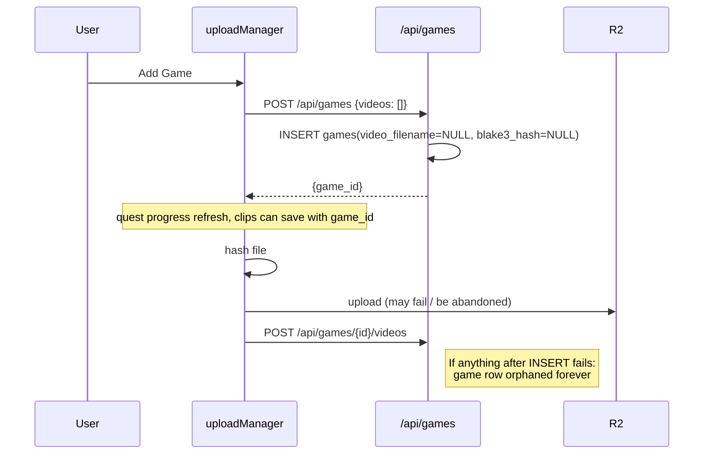
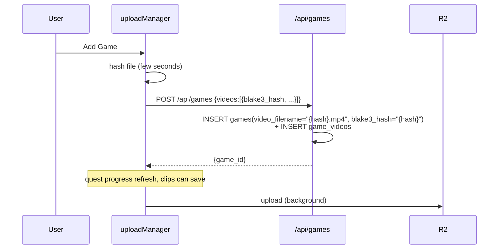

# T1180 — Root Cause of NULL `games.video_filename` (Stage 2 Design)

**Status:** APPROVED — implementing

## Decisions (2026-04-13)

- UX delay acceptable; show an **accurate** progress bar during hash (hash-wasm sampling emits percent).
- Multi-video: preserve per-file progress — create game after **first** video hash, then `addVideosToGame` per subsequent half with its own progress bar.
**Branch:** `feature/T1180-null-video-filename-root-cause`

## Classification

**Stack Layers:** Backend + Frontend (+ Database migration/cleanup script)
**Files Affected:** ~4 files (backend: `routers/games.py`; frontend: `services/uploadManager.js`, tests; cleanup script)
**LOC Estimate:** ~80 lines (small net add; mostly reordering the upload flow)
**Test Scope:** Backend (pytest for create_game rejection), Frontend Unit (uploadManager flow)

| Agent | Include? | Justification |
|-------|----------|---------------|
| Code Expert | No | Already traced; entry points identified below |
| Architect | No | Design covered here; small scope |
| Tester | Yes | Regression test required per task brief |
| Reviewer | Yes (light) | Cross-layer change — verify the UX contract doesn't regress |

---

## Root Cause

**The `uploadGame` and `uploadMultiVideoGame` frontend flows deliberately commit a `games` row with zero videos (`POST /api/games` body `{videos: []}`), then separately upload to R2, then `POST /api/games/{id}/videos` to populate.**

Evidence:
- [`src/frontend/src/services/uploadManager.js:444-447`](src/frontend/src/services/uploadManager.js#L444-L447): `Flow: 1. Create game immediately via POST /api/games (no videos) 2. Hash...upload 3. Attach video to game via POST /api/games/{id}/videos`.
- [`src/backend/app/routers/games.py:184`](src/backend/app/routers/games.py#L184): `videos: List[VideoReference] = Field(default_factory=list, ...)` — empty list accepted.
- [`src/backend/app/routers/games.py:317-318`](src/backend/app/routers/games.py#L317-L318): `single_hash = ... if len(request.videos) == 1 else None; single_filename = f"{single_hash}.mp4" if single_hash else None` — when `videos=[]`, both are NULL.
- [`src/backend/app/routers/games.py:333-352`](src/backend/app/routers/games.py#L333-L352): INSERT commits with `video_filename=NULL, blake3_hash=NULL`.
- Commit `daed361` "Create game in DB immediately on Add Game, upload video in background" introduced the two-step flow for UX (quest progress + clip saves during upload).

The gap: if Step 2 (R2 upload) or Step 3 (attach) fails, errors, or the tab closes — the row in Step 1 is already committed and **never cleaned up**. No rollback exists. `uploadManager.js:508` catches errors but only notifies the UI; it does not delete the half-created game.

This matches the observed state for game id=4 (`video_filename=NULL, blake3_hash=NULL`, raw_clip id=5 `filename=''`).

### Write-path enumeration

| Path | File | Writes `video_filename`? |
|------|------|--------------------------|
| `POST /api/games` (create_game) | `routers/games.py:333` | **Only if `len(videos)==1`**; NULL otherwise |
| `POST /api/games/{id}/videos` (add_game_videos) | `routers/games.py:426` | Only if post-add `total_videos==1` |
| `PUT /api/games/{id}` (rename) | (doesn't touch this field) | No |
| Migration `migrate_games_to_global.py` | script | Only updates `blake3_hash`, never clears |
| Test helpers / standalone utilities | tests | Only tests |

Confirmed: no silent NULL writes from migrations or helpers. The only production path that leaves NULL is `create_game` with empty `videos`.

---

## Current State



## Target State

Eliminate the empty-videos branch. The `games` row is only created once we know the blake3 hash of at least one video — which is cheap (hash completes in seconds, before upload). R2 upload can still proceed in the background after the row is created; readers who access the row before upload finishes get a clean 404 from R2 (not a `None.mp4` path).



**Invariant:** a `games` row is only committed when `video_filename` (single-video) or `game_videos` rows (multi-video) exist in the same transaction. NULL on both is rejected.

---

## Implementation Plan

### 1. Backend: reject empty `videos` in `create_game`

[`src/backend/app/routers/games.py:252`](src/backend/app/routers/games.py#L252)

```python
@router.post("")
async def create_game(request: CreateGameRequest):
    if not request.videos:
        raise HTTPException(
            status_code=400,
            detail="At least one video reference is required. Hash the video before creating the game."
        )
    ...
```

Also tighten `CreateGameRequest.videos` docstring to remove "0" from "0-N".

### 2. Frontend: hash before create

[`src/frontend/src/services/uploadManager.js:457`](src/frontend/src/services/uploadManager.js#L457) (`uploadGame`) and [`:526`](src/frontend/src/services/uploadManager.js#L526) (`uploadMultiVideoGame`)

- Move hash step before `createGame(options, [])`.
- Pass `[{blake3_hash, sequence:1, duration, width, height, file_size}]` to `createGame`.
- After game row exists, still run `ensureVideoInR2` (upload if R2 HEAD misses). Drop the separate `addVideosToGame` step — no longer needed since videos are attached in the create call.
- Keep `onGameCreated`, quest refresh, and games-list invalidation right after `createGame` so the UX signal still fires early.

The UX window shrinks from "0s after click" to "a few seconds after click" (hash duration). For the common dedup case (R2 already has the video), hash is the dominant step anyway, so this is negligible.

### 3. One-off cleanup script

`scripts/cleanup_null_video_games.py`:
- Connect to a user DB (`--user-id`, `--env`).
- `SELECT id, name FROM games WHERE video_filename IS NULL AND blake3_hash IS NULL` and any game with zero `game_videos` rows.
- List them with counts, prompt before deleting.
- DELETE the orphan `games` rows (cascades to `raw_clips`, `working_clips`, etc. via existing FKs).

Run once for imankh's dev DB to clear game id=4. Log loudly in backend (`logger.warning`) if future code ever observes such a state — but no startup reaper.

### 4. Test

`tests/test_games_create_requires_video.py`:
- `test_create_game_rejects_empty_videos` — POST with `{videos: []}` returns 400, no row inserted.
- `test_create_game_single_video_persists_filename` — POST with one video, assert `video_filename = "{hash}.mp4"` and `blake3_hash` populated.
- `test_create_game_multi_video_persists_game_videos` — POST with two, assert `game_videos` has 2 rows and `games.blake3_hash` is NULL but `game_videos` is non-empty.

Frontend test update: `uploadManager.test.js` currently asserts the 3-step flow (POST /api/games with `videos: []` then POST /api/games/{id}/videos). Update to assert single create-with-videos call.

### 5. Files changed

- `src/backend/app/routers/games.py` — validation in `create_game`; docstring tweak.
- `src/backend/tests/test_games_create_requires_video.py` — new.
- `src/frontend/src/services/uploadManager.js` — reorder hash/create; drop addVideosToGame in single-video path.
- `src/frontend/src/services/uploadManager.test.js` — update expectations.
- `scripts/cleanup_null_video_games.py` — new, one-off.

---

## Risks & Open Questions

1. **UX regression**: game row no longer appears the instant the user clicks Add. It appears after hashing (few seconds for typical clip, longer for large files). Mitigation: frontend can show a spinner during hash; the current code already shows upload phase UI. Question for user: acceptable tradeoff?

2. **Clip-save during upload**: the flow supports saving annotation clips against a game while its video is still uploading. That still works — the game row exists after hash (just a few seconds later than before). Need to verify the Annotate screen doesn't race on hash.

3. **`uploadMultiVideoGame`**: per decision — create after first hash, then `addVideosToGame` per subsequent half. Preserves per-file progress visibility.

4. **Backwards compat / in-flight uploads**: shipping this while a user has an in-progress upload mid-old-flow doesn't break anything — old frontend → old backend works, new frontend → new backend works. Only mixed old-FE-against-new-BE would get a 400 during a rare redeploy window.

5. **Alternative considered: rollback-on-error (option b)**. Adds `try/catch` in `uploadManager` that calls `DELETE /api/games/{id}` on Step 2/3 failure. Doesn't handle browser-close/abandonment. Rejected: doesn't close the hole, and the user explicitly excluded startup reapers.

6. **Alternative considered: NOT NULL constraint (option c)**. The schema genuinely needs `video_filename` to be NULL for multi-video games (where videos live in `game_videos`). A CHECK constraint like `video_filename IS NOT NULL OR EXISTS (game_videos row)` isn't expressible in SQLite. Rejected.

---

## Acceptance Criteria (maps to task)

- [x] Root-cause write path identified → `create_game` accepts `videos=[]`, driven by frontend `uploadManager.js` two-step flow.
- [ ] Fix prevents NULL commit → 400 at API; frontend refactored to always hash first.
- [ ] Regression test → `test_games_create_requires_video.py`.
- [ ] Existing broken row cleaned up → `cleanup_null_video_games.py` run once against imankh dev.
- [ ] No defensive guards added to export/read paths.

**Awaiting user approval before implementation.**
