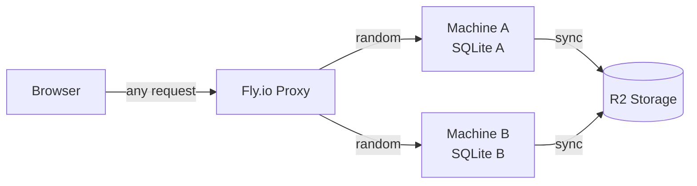
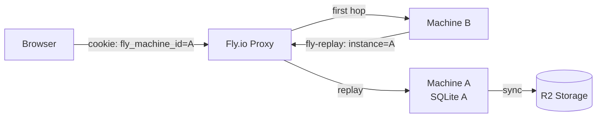

# T1190 Design: Session & Machine Pinning via Fly.io Replay Headers

**Status:** APPROVED
**Author:** Architect Agent
**Approved:** 2026-05-10

## Current State ("As Is")

### Request Flow (Multi-Machine)


### Current Behavior
```
when user makes HTTP request:
    Fly proxy picks random machine (round-robin)
    middleware authenticates via rb_session cookie
    middleware restores user DB from R2 if not local (~600ms penalty)
    handler processes request, writes to local SQLite
    middleware syncs SQLite to R2

when user starts export:
    WebSocket connects to random machine A
    machine A sends machineId via WS message
    frontend stores machineId
    export POST includes fly-force-instance-id: machineId header
    Fly proxy routes POST to machine A (export hack)

when user makes WebSocket connection:
    browser connects to random machine
    no cookie-based routing
    progress updates only received if WS and export on same machine
```

### Limitations
- Non-export requests land on random machines, causing ~600ms R2 restore per cold hit
- Database version conflicts when two machines write for the same user
- WebSocket progress lost when WS and export are on different machines
- Export pinning is a frontend hack (fly-force-instance-id header), not server-side
- No single-session enforcement -- user can have 30+ active sessions

## Target State ("Should Be")

### Request Flow (Pinned)


### Target Behavior
```
when user logs in:
    invalidate all existing sessions for this user
    create new session, set rb_session cookie
    set fly_machine_id cookie = current FLY_MACHINE_ID

when authenticated request arrives (HTTP):
    middleware reads fly_machine_id cookie
    if cookie absent:
        proceed normally, set fly_machine_id cookie on response
    if cookie matches current machine:
        proceed normally
    if cookie mismatches current machine:
        if fly-replay-src header present (circuit-breaker):
            log warning: target machine unavailable
            clear stale cookie, set new cookie, proceed locally
        else:
            return Response with fly-replay: instance=<cookie_value>
            (Fly proxy replays request to correct machine)

when WebSocket upgrade request arrives:
    ASGI middleware reads fly_machine_id cookie from upgrade headers
    same replay logic as HTTP (mismatch -> fly-replay, circuit-breaker -> local)
    ensures WS connects to same machine as HTTP requests

when pinned machine is destroyed:
    request replayed to dead machine -> Fly falls back to another machine
    fallback machine sees fly-replay-src header + cookie mismatch
    circuit-breaker: clears cookie, re-pins to fallback machine
    one-time R2 restore penalty, then all subsequent requests pinned
```

## Implementation Plan ("Will Be")

### Files to Modify

| File | Change | LOC |
|------|--------|-----|
| `src/backend/app/middleware/db_sync.py` | Add replay logic at top of `_dispatch_impl()` | ~35 |
| `src/backend/app/middleware/fly_replay.py` | New: ASGI middleware for WebSocket replay | ~45 |
| `src/backend/app/main.py` | Wrap app with FlyReplayMiddleware | ~3 |
| `src/backend/app/routers/auth.py` | Add `invalidate_user_sessions()` + `fly_machine_id` cookie in `_issue_session_cookie()` | ~10 |
| `src/backend/app/websocket.py` | Remove machineId sending (lines 168-174) | -7 |
| `src/frontend/src/services/ExportWebSocketManager.js` | Remove machineId field + getMachineId() | -15 |
| `src/frontend/src/containers/ExportButtonContainer.jsx` | Remove fly-force-instance-id header usage | -15 |
| `src/backend/tests/test_session_pinning.py` | New: tests for replay middleware | ~120 |

### Change 1: HTTP Replay in `_dispatch_impl()` (db_sync.py)

Insert at top of `_dispatch_impl()`, before line 358 (user context setup):

```python
FLY_MACHINE_ID = os.getenv("FLY_MACHINE_ID", "")

async def _dispatch_impl(self, request, call_next, meta):
    # --- T1190: Fly.io machine pinning ---
    should_set_machine_cookie = False
    if FLY_MACHINE_ID:
        pinned = request.cookies.get("fly_machine_id")
        if pinned and pinned != FLY_MACHINE_ID:
            if request.headers.get("fly-replay-src"):
                logger.warning(
                    f"[Replay] Circuit-breaker: machine {pinned} unavailable, "
                    f"handling on {FLY_MACHINE_ID}"
                )
                should_set_machine_cookie = True
            else:
                logger.info(f"[Replay] Replaying to {pinned} (current: {FLY_MACHINE_ID})")
                return Response(
                    status_code=200,
                    headers={"fly-replay": f"instance={pinned}"},
                )
        elif not pinned:
            should_set_machine_cookie = True

    # --- existing auth logic (unchanged) ---
    ...

    # Before returning response, set cookie if needed
    response = <result from existing flow>
    if should_set_machine_cookie and FLY_MACHINE_ID:
        response.set_cookie(
            key="fly_machine_id",
            value=FLY_MACHINE_ID,
            max_age=30 * 24 * 60 * 60,
            httponly=True,
            samesite=_SAMESITE,
            secure=APP_ENV == "production",
            path="/",
        )
    return response
```

**Cookie setting touch points in `_dispatch_impl`:**
- Line 389: allowlisted paths (`return await call_next(request)`) -- these are auth/health paths, no pinning needed (login sets its own cookie)
- Line 396-399: 401 rejection -- no pinning for unauthenticated requests
- Line 434-435: skip-sync paths -- need cookie (e.g., `/api/quests/achievements`)
- Line 441-442: normal sync flow -- need cookie

Only the last two return points need the `set_cookie` call. A helper function `_apply_machine_cookie(response)` keeps it DRY.

### Change 2: ASGI Middleware for WebSocket Replay (new file)

`src/backend/app/middleware/fly_replay.py`:

```python
import os
import logging
from http.cookies import SimpleCookie

logger = logging.getLogger(__name__)
FLY_MACHINE_ID = os.getenv("FLY_MACHINE_ID", "")

class FlyReplayMiddleware:
    """ASGI middleware: replays WebSocket upgrades to the pinned machine.

    HTTP requests pass through untouched -- RequestContextMiddleware
    handles their replay via fly-replay headers in _dispatch_impl().
    This middleware exists solely because BaseHTTPMiddleware (which
    RequestContextMiddleware extends) does not see WebSocket scopes.
    """

    def __init__(self, app):
        self.app = app

    async def __call__(self, scope, receive, send):
        if not FLY_MACHINE_ID or scope["type"] != "websocket":
            return await self.app(scope, receive, send)

        pinned = self._get_cookie(scope, "fly_machine_id")
        if not pinned or pinned == FLY_MACHINE_ID:
            return await self.app(scope, receive, send)

        # Check circuit-breaker (replayed request that still mismatches)
        replay_src = self._get_header(scope, b"fly-replay-src")
        if replay_src:
            logger.warning(
                f"[Replay/WS] Circuit-breaker: {pinned} unavailable, "
                f"accepting WS on {FLY_MACHINE_ID}"
            )
            return await self.app(scope, receive, send)

        # Reject WebSocket upgrade with fly-replay header
        logger.info(f"[Replay/WS] Replaying WS to {pinned}")
        await send({
            "type": "websocket.http.response.start",
            "status": 400,
            "headers": [
                (b"fly-replay", f"instance={pinned}".encode()),
            ],
        })
        await send({"type": "websocket.http.response.body", "body": b""})

    @staticmethod
    def _get_cookie(scope, name):
        for key, val in scope.get("headers", []):
            if key == b"cookie":
                cookies = SimpleCookie(val.decode())
                morsel = cookies.get(name)
                return morsel.value if morsel else None
        return None

    @staticmethod
    def _get_header(scope, name):
        for key, val in scope.get("headers", []):
            if key == name:
                return val.decode()
        return None
```

**Registration in `main.py`:**
```python
from app.middleware.fly_replay import FlyReplayMiddleware

# After creating FastAPI app, before add_middleware calls:
app = FastAPI(...)

# T1190: ASGI-level WebSocket replay (must be outermost)
# Wraps the ASGI app so it intercepts WebSocket scopes that
# BaseHTTPMiddleware (RequestContextMiddleware) cannot see.
app = FlyReplayMiddleware(app)  # NOTE: see risk section
```

**Important:** FastAPI's `add_middleware()` wraps the app from inside out. The ASGI wrapper needs to be the outermost layer. However, wrapping `app` directly may break FastAPI's reference. Instead, we'll use Starlette's middleware stack -- add it as a raw ASGI middleware via `app.add_middleware()` with the `cls` parameter, which Starlette supports for raw ASGI middleware.

### Change 3: Single-Session + Machine Cookie on Login (auth.py)

In `_issue_session_cookie()` (line 278):

```python
def _issue_session_cookie(user_id: str, payload: dict) -> JSONResponse:
    invalidate_user_sessions(user_id)   # T1190: one session per user
    session_id = create_session(user_id)
    response = JSONResponse(content=payload)
    response.set_cookie(
        key="rb_session",
        value=session_id,
        max_age=30 * 24 * 60 * 60,
        httponly=True,
        samesite=_SAMESITE,
        secure=_SECURE_COOKIES,
        path="/",
    )
    # T1190: pin to this machine
    fly_machine_id = os.getenv("FLY_MACHINE_ID", "")
    if fly_machine_id:
        response.set_cookie(
            key="fly_machine_id",
            value=fly_machine_id,
            max_age=30 * 24 * 60 * 60,
            httponly=True,
            samesite=_SAMESITE,
            secure=_SECURE_COOKIES,
            path="/",
        )
    return response
```

### Change 4: Remove Export Pinning Hack

**websocket.py** -- Delete lines 168-174 (machineId sending):
```python
# DELETE THIS BLOCK:
fly_machine_id = os.getenv("FLY_MACHINE_ID", "")
if fly_machine_id:
    try:
        await websocket.send_json({"type": "connected", "machineId": fly_machine_id})
    except Exception:
        pass
```

**ExportWebSocketManager.js** -- Remove:
- Line 40: `this.machineId = null;`
- Lines 197-202: machineId handling in message handler
- Lines 594-600: `getMachineId()` method

**ExportButtonContainer.jsx** -- Remove at three locations:
- Lines 674-676: `const machineId = ...` + `const pinHeaders = ...`
- Line 683: `{ headers: pinHeaders }` -> `{}`
- Lines 729-730: `const overlayMachineId = ...` + `const overlayPinHeaders = ...`
- Line 735: `{ headers: overlayPinHeaders }` -> `{}`
- Lines 781-789: Legacy export machineId + header

### Change 5: Admin Impersonation (NO CHANGES)

`_clear_machine_pin_cookie()` in admin.py (lines 611-616) already deletes the `fly_machine_id` cookie. No modifications needed. After impersonation swap, the cleared cookie causes the next request to land on any machine and re-pin -- correct behavior since the target user's DB may be cached on a different machine.

## Risks

| Risk | Mitigation |
|------|------------|
| `websocket.http.response` ASGI event not supported by Fly's proxy | Test on staging with 2 machines. If unsupported, WS falls back to random machine (same as today without hack). Export POST is still correctly routed via HTTP middleware. |
| Requests >1MB cannot be replayed by Fly | Only affects multipart uploads. Current export flow sends JSON params, not video data. Video uploads go to R2 directly. |
| Wrapping FastAPI app with ASGI middleware breaks `app.add_middleware()` | Use Starlette's middleware stack (`app.add_middleware(FlyReplayMiddleware)`) instead of wrapping `app` directly. |
| `invalidate_user_sessions()` on every login adds latency | Already implemented and used by admin impersonation. Deletes from SQLite + cache + R2. Typically 1 session to delete. Acceptable cost. |
| Cookie not sent on cross-origin requests | `samesite=lax` allows cookies on same-site navigations. Our frontend and backend share the same origin in production. Dev uses CORS with `allow_credentials=True`. |
| Circuit-breaker false positive: fly-replay-src present on normal replay | Normal replay: target machine receives request, cookie matches, proceeds. Circuit-breaker only triggers when cookie mismatches AND fly-replay-src is present -- meaning the request was replayed but didn't reach the intended target. |

## Open Questions

- [x] **Session inactivity TTL**: Deferred to T2270 (standalone task). Single-session enforcement limits sprawl; 30-day absolute TTL provides a ceiling.

- [x] **ASGI middleware registration**: Use `app.add_middleware(FlyReplayMiddleware)` (Option A). Keeps `app` as a FastAPI instance for TestClient and IDE support. Place after `RequestContextMiddleware` to be outermost.
