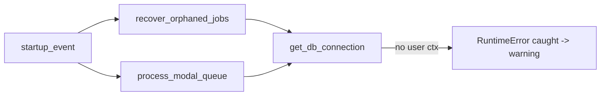
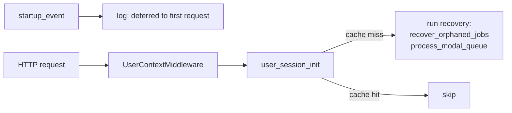

# T1380 + T1390 — Per-User Startup Recovery & Modal Queue Drain

**Status:** DESIGN (awaiting approval)
**Branch:** `feature/T1380-T1390-startup-per-user-recovery`

## Shared Root Cause

Both routines are invoked from `app/main.py` `startup_event` with no user/profile context:

- [app/main.py:284](src/backend/app/main.py#L284) → `await recover_orphaned_jobs()`
- [app/main.py:291-298](src/backend/app/main.py#L291-L298) → `await process_modal_queue()`

Each routine eventually calls `get_db_connection()` (per-user SQLite), which reaches into
`get_current_user_id()` / `get_current_profile_id()`. Both raise `RuntimeError("No user
context set...")` because nothing has set the ContextVars yet. The outer `try/except` in
`startup_event` swallows the error as a warning, so startup "succeeds" but neither routine
ever touches user data.

Result: orphaned `processing` export jobs stay stuck until a user happens to refresh, and
queued Modal tasks never drain at boot.

## Current Behavior



Pseudo:
```python
# main.py
await recover_orphaned_jobs()      # one call, no context -> throws, logged as warning
await process_modal_queue()        # same
```

`recover_orphaned_jobs()` and `process_modal_queue()` both use `get_db_connection()`
which resolves the per-user SQLite path via ContextVars. Neither is user-scoped today.

## Target Behavior — Lazy, Per-User, On First Request

Scale concern: iterating every user at boot doesn't scale to millions and wastes R2
egress on users with no pending work. Instead, **remove the boot-time calls entirely**
and piggyback on `user_session_init`, which already runs exactly once per user per
server process (gated by `_init_cache`). The recovery runs the moment the user's first
request arrives — which is the only moment their orphaned state is observable to them.

Tradeoff accepted: a user who never returns never has their orphan reconciled. That's
fine — nobody is watching that job. Boot cost is O(0) regardless of user count.



Context is already correct at this point: the middleware set `user_id`, and
`user_session_init` sets `profile_id` before the recovery block runs.

## Files Touched

| File | Change |
|------|--------|
| [app/main.py](src/backend/app/main.py#L282-L298) | Delete the two boot-time calls; replace with a one-line log that recovery is deferred to first-request |
| [app/session_init.py](src/backend/app/session_init.py#L120) | Add a new step after existing cleanup: run `recover_orphaned_jobs()` and `process_modal_queue()` inside try/except, log per-user outcome. Runs once per user per process (inside the slow-path block, before the cache write) |
| [app/services/export_worker.py](src/backend/app/services/export_worker.py#L590) | No change — already consumes context-bound DB |
| [app/services/modal_queue.py](src/backend/app/services/modal_queue.py#L33) | No change |
| `tests/test_session_init_recovery.py` (new) | Seed orphaned job + queued task for a user, call `user_session_init(user_id)` under that user's context, assert recovery ran |

### Pseudo code

`main.py` (replaces lines 282-298):
```python
logger.info(
    "[Startup] orphaned-job recovery + modal queue drain deferred to "
    "per-user first request (runs once per user via user_session_init)"
)
```

`session_init.py` (inside the slow path, after backfills/cleanup, before cache write):
```python
# T1380 + T1390: Run per-user startup recovery on the user's first request of this
# server process. Deferred from boot because iterating all users at boot does not
# scale (R2 egress, cold-start latency). Each routine needs user+profile context
# which is now correctly set above. This whole block runs once per user per server
# process thanks to _init_cache.
import asyncio
from .services.export_worker import recover_orphaned_jobs
from .services.modal_queue import process_modal_queue

try:
    asyncio.run(recover_orphaned_jobs())
    logger.info(f"[SessionInit] orphaned-jobs recovery ok for user {user_id}")
except Exception as e:
    logger.warning(f"[SessionInit] recover_orphaned_jobs failed for {user_id}: {e}")

try:
    result = asyncio.run(process_modal_queue())
    if result.get("processed", 0) > 0:
        logger.info(
            f"[SessionInit] modal queue for {user_id}: "
            f"{result['succeeded']} ok, {result['failed']} failed"
        )
except Exception as e:
    logger.warning(f"[SessionInit] process_modal_queue failed for {user_id}: {e}")
```

**Async concern:** `user_session_init` is sync today, called from sync middleware and
routes. Both target routines are `async`. We can't `asyncio.run` inside an already-running
loop. Resolution: use `run_queue_processor_sync` (already exists in `modal_queue.py`) for
the queue, and add a similar sync wrapper for `recover_orphaned_jobs`. **Better**: since
`user_session_init` is called from an async context (middleware dispatch is async, and
the recovery slow-path only runs on first request), schedule the work as a background
task instead so it doesn't block the user's first request:

```python
# Fire-and-forget background recovery for this user.
# Does not block the request. Runs under the current (user-scoped) context,
# which asyncio.create_task propagates automatically.
async def _deferred_recovery(uid: str):
    try:
        await recover_orphaned_jobs()
    except Exception as e:
        logger.warning(f"[SessionInit] recover_orphaned_jobs failed for {uid}: {e}")
    try:
        result = await process_modal_queue()
        if result.get("processed", 0) > 0:
            logger.info(f"[SessionInit] modal queue for {uid}: "
                        f"{result['succeeded']} ok, {result['failed']} failed")
    except Exception as e:
        logger.warning(f"[SessionInit] process_modal_queue failed for {uid}: {e}")

try:
    loop = asyncio.get_running_loop()
    loop.create_task(_deferred_recovery(user_id))
except RuntimeError:
    # Called from a sync context with no running loop (e.g. tests) — run inline.
    asyncio.run(_deferred_recovery(user_id))
```

`asyncio.create_task` copies the current context, so `user_id` + `profile_id`
ContextVars propagate into the background task.

## Risks & Open Questions

1. **User never returns → never recovered.** Accepted: no observer means no value.
2. **First-request latency.** Eliminated by `create_task` — recovery is fire-and-forget.
3. **Test environments without a running loop.** Handled by `RuntimeError` fallback to
   `asyncio.run`.
4. **Parallel recovery if a user hits the server from two tabs simultaneously on first
   boot.** `_init_cache` is written *after* the recovery is scheduled, so there's a
   narrow window where two tasks could be queued. Fix: write the cache entry first, then
   schedule. Worst case, recovery is skipped on subsequent calls — that's the intent.
5. **Context leak into the background task.** `create_task` copies context; the user's
   ContextVars are exactly what we want. No leak into other requests (each request has
   its own ContextVar copy).

## Test Plan

`tests/test_session_init_recovery.py`:
- Set user + profile context for user `u1`; ensure DB; insert one `export_jobs` row
  with `status='processing'` and one `modal_tasks` row with `status='pending'`.
- Invalidate `_init_cache` for `u1` to force slow path.
- Call `user_session_init('u1')` from a sync test (no running loop → inline path).
- Assert `export_jobs` row transitioned out of `processing` and `modal_tasks` row is
  no longer `pending`.
- Assert a second `user_session_init('u1')` call does NOT rerun recovery (cache hit).

## Acceptance

- Startup logs show per-user recovery lines, no "No user context set" warnings.
- Orphaned jobs for every known user are reconciled.
- Queued Modal tasks for every known user drain.
- New test passes; existing suite stays green.
- PLAN.md marks T1380 and T1390 as TESTING after commit.
