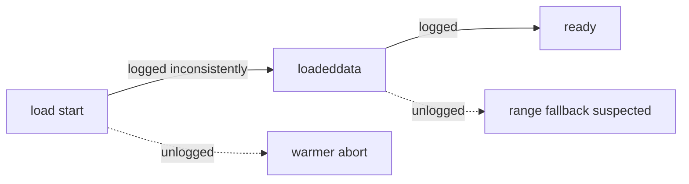
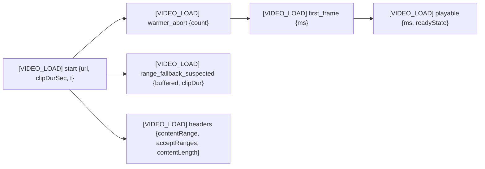

# T1400 Design — Video Load Observability (narrowed post-T1410)

**Status:** AWAITING APPROVAL
**Branch:** `feature/T1400-video-load-contention`
**Scope change:** T1410 already shipped warmer-abort + StrictMode dedup. Remaining value is **observability + measurement**, not another speedup.

## Current State

T1410 landed:
- `cacheWarming.js` → `WARMUP_PRIORITY.FOREGROUND_ACTIVE` with AbortController wiring
- `useVideo.loadVideoFromStreamingUrl` + `handleLoadStart` enter foreground mode; clear on `loadeddata`/`error`
- `FramingScreen` / `AnnotateScreen` init effects return `AbortController.abort` from cleanup
- `lastLoadedUrlRef` dedup guard in `useVideo`

Existing log points in `useVideo.js`:
- L213 `[useVideo] loadVideoFromStreamingUrl (RANGE REQUESTS) called`
- L528–530 `[VIDEO] Loading / Mode / networkState` on `loadstart`
- L563/565 `[VIDEO] SLOW LOAD` (>N ms) or `[VIDEO] Loaded in Xms` on `loadeddata`
- L586 `[VIDEO] Buffering: X%` progress
- L593 `[VIDEO] Waiting...`

**Gaps:**
1. No greppable structured prefix. Logs mix `[useVideo]` and `[VIDEO]`; no single tag you can `grep [VIDEO_LOAD]` against in prod.
2. No **range-fallback watchdog**: when the player buffers >>clip duration (e.g. 2152s buffered for an 8s clip), nothing flags it.
3. No **response-header capture**: `Content-Range` / `Accept-Ranges` / `Content-Length` from the initial range fetch aren't recorded, so we can't tell post-hoc whether R2 served 206 or 200.
4. No before/after protocol. T1410's verification was a single ad-hoc range, not median/p95 over N iterations.



## Target State

Single greppable channel `[VIDEO_LOAD]` with structured events. Range-fallback watchdog emits one warning per load. Response headers from the probe fetch captured. Measurement harness produces median + p95 across 5 cold loads.



### Event schema

| Event | Fires when | Fields |
|---|---|---|
| `start` | `loadVideoFromStreamingUrl` entry | `url` (first 60 chars), `clipDurationSec`, `loadId` |
| `warmer_abort` | after `setWarmupPriority(FOREGROUND_ACTIVE)` | `abortedCount` (returned from cacheWarming) |
| `headers` | probe fetch resolves | `contentRange`, `acceptRanges`, `contentLength`, `status` |
| `first_frame` | `loadedmetadata` | `elapsedMs`, `loadId` |
| `playable` | `loadeddata` | `elapsedMs`, `readyState`, `bufferedSec`, `loadId` |
| `range_fallback_suspected` | watchdog: 5s after start AND `buffered > 3 × clipDur` AND `readyState < HAVE_ENOUGH` | `bufferedSec`, `clipDurSec`, `elapsedMs`, `networkState`, `readyState` |
| `error` | existing error path | existing fields + `loadId` |

`loadId` is a monotonic counter so concurrent/serial loads are distinguishable in logs.

### Watchdog placement

Inline in `useVideo.js` as a `setTimeout(5000)` started in `loadVideoFromStreamingUrl`, cleared on `loadeddata`/`error`/unmount. Reads `videoRef.current.buffered` and compares to `clipRange.duration` (or `preloadedMetadata.duration` fallback; log `null` if neither). One fire only — self-clearing timeout. No separate file needed (LOC too small to justify).

### Response-header capture

`videoMetadata.probeVideoUrlMoovPosition` (via `probeVideoUrl.js`) already does a `fetch` with a Range header. Extend to return `{contentRange, acceptRanges, contentLength, status}` alongside existing metadata. `useVideo` logs them under `[VIDEO_LOAD] headers`. If probe is skipped (preloadedMetadata path), emit `headers skipped`.

### cacheWarming: abort count

`setWarmupPriority(FOREGROUND_ACTIVE)` currently returns void. Change to return `{abortedCount}` so `useVideo` can log it. Purely additive — existing callers ignore the return.

## Measurement Protocol

Script: `scripts/measure-cold-load.md` (instructions, not automation — requires real browser + fresh profile + large source video on R2).

Per iteration (5 on master, 5 on branch, same clip):
1. DevTools → Network → "Disable cache", Fast 3G throttle off (baseline).
2. Fresh profile / hard reload.
3. Open clip in Framing.
4. Capture `[VIDEO_LOAD] start` → `[VIDEO_LOAD] playable` delta = total load-to-playable.
5. `[VIDEO_LOAD] start` → `[VIDEO_LOAD] first_frame` delta = TTFP.

Result table in task file:

| Metric | Master median | Master p95 | Branch median | Branch p95 |
|---|---|---|---|---|
| TTFP (ms) | | | | |
| Load-to-playable (ms) | | | | |
| `range_fallback_suspected` fires | | | | |
| StrictMode double-mount logs | | | | |

**Merge gate:** if branch median is not <2× master median *and* no new observability value lands that closes out an open question, do not merge — investigate.

Since T1410 already banked the speedup, branch-vs-master **is expected to be near-parity**. The merge justification then rests entirely on (a) range-fallback watchdog firing on real content (proving it's useful), (b) persistent greppable logs.

## Implementation Plan

### Files

1. **`src/frontend/src/utils/cacheWarming.js`**
   - `setWarmupPriority(FOREGROUND_ACTIVE)` returns `{abortedCount}` (count of inflight AbortControllers aborted).

2. **`src/frontend/src/utils/probeVideoUrl.js`**
   - Extend `probeVideoUrlMoovPosition` return shape to include `{contentRange, acceptRanges, contentLength, status}`.

3. **`src/frontend/src/hooks/useVideo.js`**
   - Introduce `loadIdRef` (monotonic counter).
   - Replace scattered `[VIDEO]` / `[useVideo]` log prefixes on the load path with `[VIDEO_LOAD] <event>` structured entries. Keep the text human-readable; include `loadId`.
   - Add watchdog `setTimeout(5000)` in `loadVideoFromStreamingUrl`; clear on `loadeddata`, `error`, cleanup.
   - Log `[VIDEO_LOAD] warmer_abort` using the new return value from `setWarmupPriority`.
   - Log `[VIDEO_LOAD] headers` from probe result.
   - Log `[VIDEO_LOAD] first_frame` on `loadedmetadata`, `playable` on `loadeddata`.

4. **`src/frontend/src/hooks/__tests__/videoLoadWatchdog.test.jsx`** (new)
   - Mock `<video>` with `buffered.length=1, end(0)=2152, duration=5390`.
   - Trigger `loadVideoFromStreamingUrl`, advance timers 5s.
   - Assert one `[VIDEO_LOAD] range_fallback_suspected` log with bufferedSec=2152, clipDurSec=8 (from passed `clipRange`).
   - Assert no second fire when advancing further.

5. **`src/frontend/src/utils/__tests__/cacheWarming.test.js`** (extend existing)
   - Assert `setWarmupPriority(FOREGROUND_ACTIVE)` returns `{abortedCount: N}` matching inflight aborts.

6. **`docs/plans/tasks/video-load-reliability/T1400-video-load-contention.md`**
   - Fill Result table with 5-iteration median + p95 after measurement.

### Pseudo

```js
// useVideo.js
const loadIdRef = useRef(0);
const watchdogRef = useRef(null);

function loadVideoFromStreamingUrl(url, preloadedMetadata, clipRange) {
  const loadId = ++loadIdRef.current;
  const t0 = performance.now();
  console.log(`[VIDEO_LOAD] start id=${loadId} clipDurSec=${clipRange?.duration} url=${url.slice(0,60)}`);

  const { abortedCount } = setWarmupPriority(WARMUP_PRIORITY.FOREGROUND_ACTIVE);
  if (abortedCount > 0) console.log(`[VIDEO_LOAD] warmer_abort id=${loadId} count=${abortedCount}`);

  // existing probe call, now returns headers
  probeVideoUrlMoovPosition(url).then(({ contentRange, acceptRanges, contentLength, status }) => {
    console.log(`[VIDEO_LOAD] headers id=${loadId} status=${status} contentRange=${contentRange} acceptRanges=${acceptRanges} contentLength=${contentLength}`);
  });

  watchdogRef.current = setTimeout(() => {
    const v = videoRef.current;
    if (!v || v.readyState >= 3) return;
    const bufferedSec = v.buffered.length ? v.buffered.end(v.buffered.length-1) : 0;
    const clipDur = clipRange?.duration;
    if (clipDur && bufferedSec > 3 * clipDur) {
      console.warn(`[VIDEO_LOAD] range_fallback_suspected id=${loadId} bufferedSec=${bufferedSec.toFixed(1)} clipDurSec=${clipDur} elapsedMs=${Math.round(performance.now()-t0)} networkState=${v.networkState} readyState=${v.readyState}`);
    }
  }, 5000);

  // on loadeddata: clearTimeout + [VIDEO_LOAD] playable
  // on error: clearTimeout + [VIDEO_LOAD] error
}
```

## Risks & Open Questions

1. **Is the speedup already banked?** Expected yes per T1410. Before/after will confirm. If master is already <10s on the repro clip, the task's explicit speedup goal is closed; merge justification is observability only — flag to user.
2. **`probeVideoUrl` header capture** — the existing implementation may use `no-cors` or HEAD. Need to confirm it has access to response headers; if not, either (a) switch that one fetch to `cors` mode (it's same-origin to R2 which has CORS configured), or (b) drop header capture and rely on the watchdog alone. Will verify when implementing; if blocked, the watchdog is the primary signal and headers are nice-to-have.
3. **Log volume in prod** — `[VIDEO_LOAD]` events are per-load, bounded (~5 lines). Safe. No per-tick chatter added.
4. **StrictMode in test** — watchdog test uses fake timers; double-mount not exercised (already covered in T1410's tests).
5. **Measurement variance** — 5 iterations may be too few for p95 stability on a network-bound metric. If variance is wild, bump to 10 before drawing conclusions.

## Out of scope

- Fragmenting source mp4s / moov atom relocation (T1380 / separate).
- Warmer priority during scrubs (T1410 open item #3).
- Automated cold-load harness in CI (requires real browser + fixture).

---

**Awaiting approval before Stage 3.**
