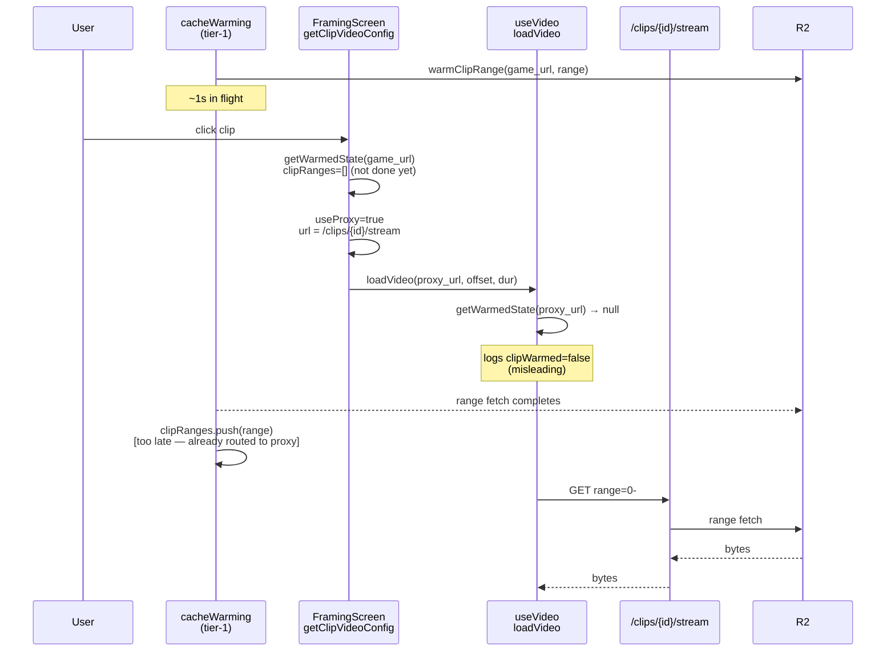
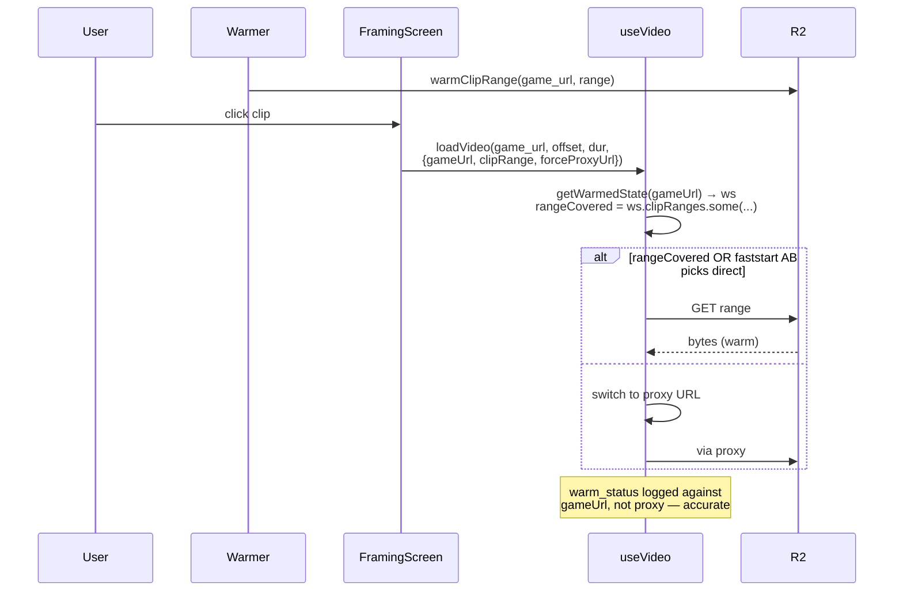

# T1460 Design — Warm-Path Parity + Faststart Route Choice

**Status:** DRAFT — awaiting approval
**Branch:** `feature/T1460-warm-path-parity`
**Task:** [T1460](video-load-reliability/T1460-warm-path-parity-faststart.md)

---

## Findings from Stage 1 audit

The post-T1450 log symptom has **three independent causes**, not one.

### Cause A — `clipId=null` in warmer log (cosmetic)

Backend `/storage/warmup` builds `project_clips[].clips[]` without selecting
`wc.id`. Frontend reads `clip.id ?? null` → always `null`.

- [storage.py:298-316](src/backend/app/routers/storage.py#L298-L316) — SELECT omits `wc.id`
- [storage.py:358-364](src/backend/app/routers/storage.py#L358-L364) — clip dict omits `id`
- [cacheWarming.js:502](src/frontend/src/utils/cacheWarming.js#L502) — reads `clip.id ?? null`

**Impact:** log-only. Matching between warmer and loader is by URL
(`stableUrlKey`), not `clipId`. Fixing this makes `[CacheWarming] Warmed clip`
lines greppable by clip but does not change warm-path behavior.

### Cause B — useVideo's `warm_status` looks up the wrong URL (the real bug)

`FramingScreen.getClipVideoConfig` decides proxy-vs-direct based on warm state
at render time, then passes one chosen URL down. `useVideo.loadVideo` logs
`warm_status` keyed on **that URL**:

```javascript
// useVideo.js:243
const ws = getWarmedState(url);  // url is proxy URL when rangeCovered=false
```

If the warmer hadn't finished populating `clipRanges` at the moment
`getClipVideoConfig` ran (common — warm takes ~1s, user click beats it),
FramingScreen picks the proxy URL. The warmer then completes and writes
`clipRanges` keyed on `game_video_url`. But `useVideo` is looking up the
**proxy URL**, which was never warmed → `clipRanges=0 urlWarmed=false` even
when the underlying R2 bytes are now warm.

This is why we see `Warmed clip ... elapsedMs=1336` **followed by**
`warm_status clipRanges=0` — warm happened, just not visible because the
proxy URL is unkeyed in warmedState.

### Cause C — one-shot route decision (the structural bug)

- [FramingScreen.jsx:374-405](src/frontend/src/screens/FramingScreen.jsx#L374-L405)
  evaluates `useProxy = !rangeCovered` **once** per clip-select gesture, using
  warm state at that instant. If the warmer finishes 200ms later, the route
  choice is not reconsidered. The URL we load is frozen as the proxy URL even
  though direct-to-R2 would now be the correct choice.

Combined: warmer races user → picks proxy → warm completes too late → we
under-observe the warm-path hit rate AND we use the proxy even when direct
would work.

### Issue 2 restated — proxy vs direct for faststart

Separately from the observability/race bugs, for **faststart** files
(moov-at-head), the proxy adds one Fly→R2 hop and Fly's PoP may be cold even
when the browser's PoP is warm. We need A/B data to choose.

---

## Current State



## Target State



Key change: **route decision moves into `useVideo.loadVideo`**, where it can
read the freshest warm state and log `warm_status` against the real R2 URL,
not the chosen URL.

---

## Implementation Plan

### Step 1 — Fix warm-state lookup (Cause B + C)

**File:** [src/frontend/src/hooks/useVideo.js](src/frontend/src/hooks/useVideo.js)

- Add optional `gameUrl` param to `loadVideo` (or to the config object it
  already takes). This is the raw R2 presigned URL that the warmer used.
- `warm_status` lookup uses `gameUrl ?? url`.
- Route decision (direct-vs-proxy) moves here: if `rangeCovered`, load
  `gameUrl` directly; else load caller-supplied proxy URL.

**File:** [src/frontend/src/screens/FramingScreen.jsx](src/frontend/src/screens/FramingScreen.jsx)

- `getClipVideoConfig` stops picking proxy vs direct. It returns
  `{ gameUrl, proxyUrl, clipRange }` and lets `useVideo` choose at load
  time using the freshest `getWarmedState`.

### Step 2 — Populate `clipId` in warmup payload (Cause A)

**File:** [src/backend/app/routers/storage.py](src/backend/app/routers/storage.py)

- Add `wc.id AS clip_id` to the SELECT at line 298.
- Add `"id": row['clip_id']` to the clip dict at line 358.

**Test:** one backend unit test asserting `/storage/warmup` returns `id` on
each `project_clips[].clips[]` entry.

### Step 3 — A/B flag for proxy vs direct on faststart (Issue 2)

**File:** [src/frontend/src/hooks/useVideo.js](src/frontend/src/hooks/useVideo.js)

- Honor a URL query-string flag `?direct=1` (or an env-like build flag) that
  forces direct-to-R2 for faststart files even when not warm.
- Log both `elapsedMs` to first-playable AND the route chosen
  (`route=direct|proxy|warm-direct`) so we can compare post-hoc.

No route logic change shipped yet — just the flag + logging. User collects
5-10 samples each, picks winner, then Step 4 wires the default.

### Step 4 — Route faststart default based on measurement (held)

Only after Step 3 samples are collected. Likely: `faststart + rangeCovered →
direct`, `faststart + cold → proxy` (matches existing default), but data
decides.

---

## Test Scope

| Test | Layer | Purpose |
|------|-------|---------|
| `warmClipRange` populates `clipRanges` and `getWarmedState(url).clipRanges.length > 0` | Frontend unit | Regression guard |
| `loadVideo(proxyUrl, { gameUrl })` logs warm_status against `gameUrl` | Frontend unit | Cause B fix |
| `/storage/warmup` returns `id` on project_clips clips | Backend unit | Cause A fix |
| Manual: open Trace framing after warmer finishes → expect `clipWarmed=true rangeCovered=true route=warm-direct`, load ≤ 1s | Manual | Acceptance |
| Manual: open Trace framing cold (warmer aborted) → collect elapsedMs with `?direct=1` and without | Manual | Issue 2 data |

---

## Risks & Open Questions

1. **Warm completion timing.** If warmer consistently loses the race to user
   clicks on tier-1, the "direct" branch is rarely taken regardless of
   correctness. Measurement in Step 3 will reveal this.
2. **Moving route decision into useVideo** means FramingScreen no longer
   knows which URL got loaded. Harmless today but worth noting for any
   caller that wanted to know (none found in audit).
3. **Query-string flag plumbing.** `?direct=1` on app URL is easy but
   ergonomic only for manual testing. Fine for Step 3; Step 4 makes it
   automatic.

---

## Out of Scope

- Altering proxy windowing (T1430 three-window logic unchanged).
- Speeding up the warmer itself.
- Server-side R2 edge prewarming.
