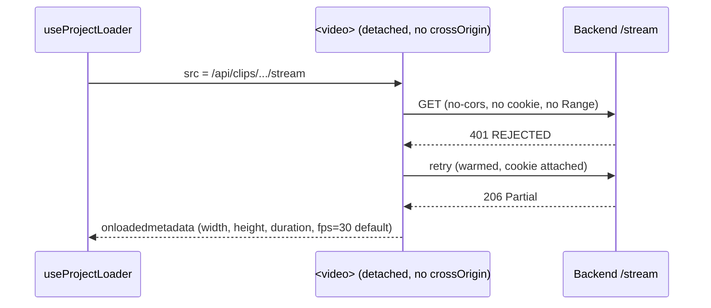
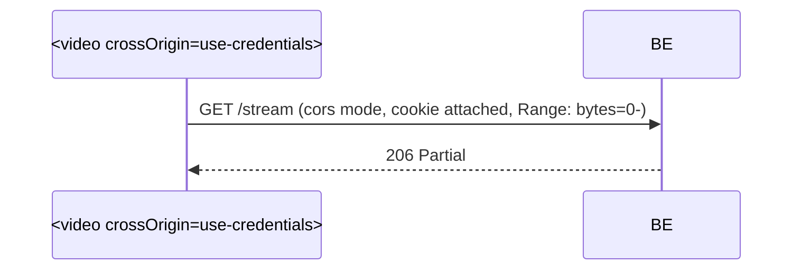

# T1490 Design — First /stream request 401

## Problem

On every cold clip load, backend logs show paired requests:

```
GET /api/clips/projects/N/clips/M/stream  REJECTED — no session cookie or X-User-ID  → 401
GET /api/clips/projects/N/clips/M/stream  user=X (via session)                        → 206
```

The first request has no `Range`, `Sec-Fetch-Mode: no-cors`, no cookie. The browser silently retries on a warmed connection and succeeds. Net effect: ~680ms stall per cold clip, and a false 401 in every log that makes real auth failures un-greppable.

## Root cause

[`extractVideoMetadataFromUrl`](../../../src/frontend/src/utils/videoMetadata.js#L9) creates a detached `<video preload="metadata">` and assigns a proxy `/stream` URL to `src`. The element has no `crossOrigin` attribute, so the browser issues a **no-cors** media probe — which strips cookies even on same-origin requests. The inline comment at [videoMetadata.js:13](../../../src/frontend/src/utils/videoMetadata.js#L13) documents this was intentional for presigned R2 URLs (auth in URL, not cookie). It is wrong for proxy URLs.

Primary caller: [useProjectLoader.js:151](../../../src/frontend/src/hooks/useProjectLoader.js#L151) — probes `clip.game_video_url` (a proxy `/stream` URL) during project load, once per unique URL.

## Current state



Metadata consumed: [useClipManager.js:44-46,143-186](../../../src/frontend/src/hooks/useClipManager.js#L44) uses `width`, `height`, `framerate` for crop defaults. Duration is usually overridden by `end_time - start_time` at [useProjectLoader.js:141](../../../src/frontend/src/hooks/useProjectLoader.js#L141). Backend already persists `video_duration` but **not** width/height/fps ([clips.py:155-179](../../../src/backend/app/routers/clips.py#L155)).

## Fix directions

### Direction A — Send credentials on the detached probe (recommended)

Set `video.crossOrigin = 'use-credentials'` inside `extractVideoMetadataFromUrl` **only for same-origin proxy URLs**. CORS middleware already allows credentials globally ([main.py:92-99](../../../src/backend/app/main.py#L92)), so no backend change needed.

The previously-tested change on the rendered `<video>` in `VideoPlayer.jsx` did not fix request #0 because #0 is fired by the detached element in `videoMetadata.js` — that is exactly where the fix belongs.



**Pros:** minimal LOC (~5 lines), no schema migration, no backfill, zero behavior change for presigned R2 URLs (skip the flag when URL is not same-origin).
**Cons:** still fires a media probe per unique clip URL at load time. Not a latency win beyond the 680ms first-stall.
**Risk:** must branch on URL origin — setting `use-credentials` on an R2 presigned URL would cause a CORS failure.

### Direction B — Eliminate the probe, use backend fields

Persist `width`, `height`, `fps` on the clip record; return them from `GET /clips`; skip `extractVideoMetadataFromUrl` for clips that already have these fields.

**Pros:** kills the probe entirely for existing clips — fastest project load.
**Cons:** requires (1) schema migration on `working_clips`, (2) re-extraction for existing rows, (3) fallback to probe for old clips until backfill completes. Larger surface, multi-session task.

### Direction C — fetch + moov parser

Replace `<video>` probe with `fetch(url, {credentials: 'include'})` + manual MP4 moov box parse.
**Cons:** largest LOC, new dependency or custom parser. Rejected.

## Recommendation

**Direction A**, bundled with sub-issue B (401 visibility).

Direction B is the right long-term architecture but out of scope for a 401 fix — file as follow-up (T14xx: persist clip dimensions backend-side).

## Implementation plan

### 1. Fix the probe ([videoMetadata.js](../../../src/frontend/src/utils/videoMetadata.js))

```js
// Same-origin proxy URLs need credentials; presigned R2 URLs must not have it.
const isSameOrigin = url.startsWith('/') || url.startsWith(window.location.origin);
if (isSameOrigin) {
  video.crossOrigin = 'use-credentials';
}
```

### 2. Sub-issue B — surface 401 loudly ([useVideo.js:721](../../../src/frontend/src/hooks/useVideo.js#L721))

`MediaError` does not expose HTTP status. To distinguish 401 from generic NETWORK_ERROR, pre-flight the URL in `loadVideoFromUrl` with a lightweight `HEAD` (or let the first failure trigger a `fetch` status probe) before the generic `[VIDEO_LOAD] error` path. If status is 401, emit `[VIDEO_LOAD] auth_fail` and show a user-visible "Your session expired, please refresh" error.

Simplest: in the existing error handler, fire one `fetch(video.src, {method:'HEAD', credentials:'include'})` on MediaError code 2 (NETWORK). If 401, classify as `auth_fail`.

### 3. Tests

- **Backend**: `tests/test_stream_auth.py` — assert `/stream` with cookie returns 206; without returns 401 (guard against regression in middleware).
- **Frontend E2E**: `playwright/stream-no-401.spec.js` — log network requests during project load, assert zero 401 responses on `/stream`.
- **Unit**: `videoMetadata.test.js` — given same-origin URL, `crossOrigin` is `'use-credentials'`; given `https://r2.example/...`, it is unset.

## Files to change

| File | Change | LOC |
|------|--------|-----|
| [videoMetadata.js](../../../src/frontend/src/utils/videoMetadata.js) | Branch `crossOrigin` on origin | ~5 |
| [useVideo.js](../../../src/frontend/src/hooks/useVideo.js) | HEAD status probe on NETWORK_ERROR, emit `auth_fail` | ~15 |
| `tests/test_stream_auth.py` (new) | 401/206 guard | ~30 |
| `playwright/stream-no-401.spec.js` (new) | No 401s during load | ~25 |
| `videoMetadata.test.js` (new) | crossOrigin branching unit test | ~20 |

## Risks & open questions

- **Q1:** Are there any deployment configurations where the frontend is served from a different origin than `/api`? If yes, `isSameOrigin` check needs to consider the configured `API_BASE` origin too.
- **Q2:** Does the vite dev proxy correctly forward cookies when `crossOrigin=use-credentials` is set? Should work (proxy is transparent), but verify during manual test.
- **R1:** Setting `crossOrigin` on a detached element that later gets presigned URLs in other callers is safe because the branch skips non-same-origin URLs. All existing callers reviewed ([Code Expert audit](./T1490-audit.md)).

## Acceptance

- Fresh clip selection produces one 206 per clip (no paired 401/206).
- 401s on `/stream` surface as `[VIDEO_LOAD] auth_fail` + user-visible error.
- ~680ms first-clip stall eliminated.
