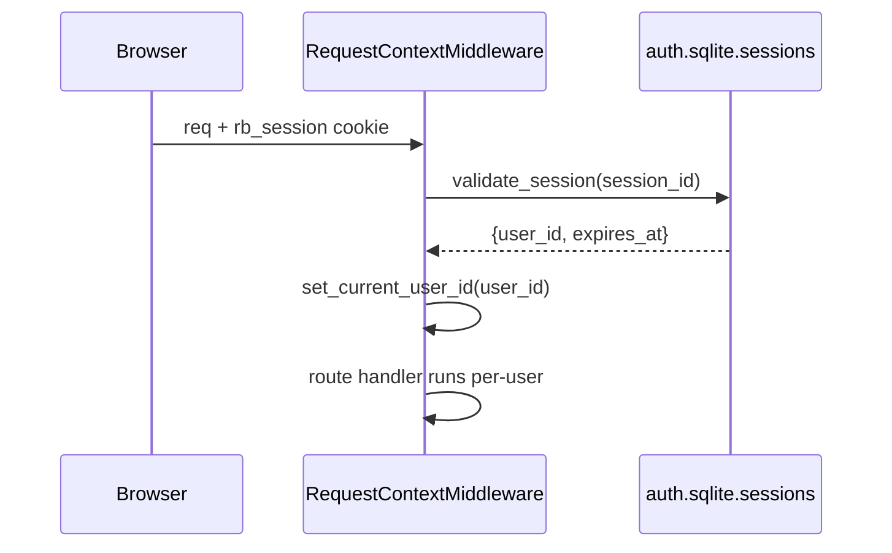
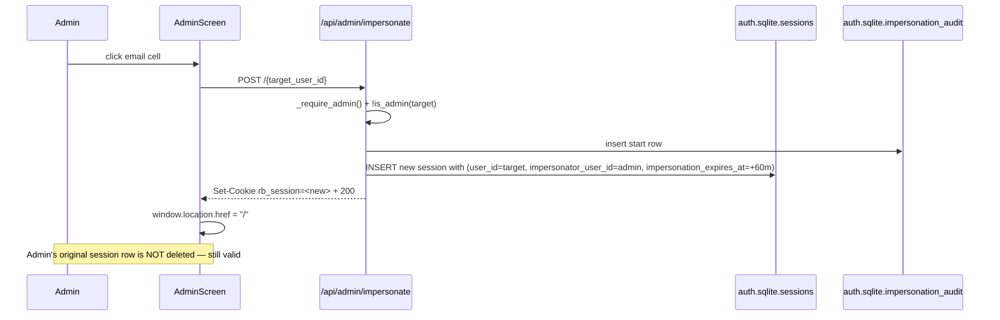

# T1510 Design — Admin Impersonation

## 1. Audit summary (answers to open questions)

### Q1 — Session mechanism: **server-side (already)**

Current auth is **not stateless JWT**. It is:

- `rb_session` HttpOnly cookie = `secrets.token_urlsafe(32)` random token
- `sessions` table in `auth.sqlite` — columns `(session_id, user_id, expires_at, created_at)`
- Resolved per-request by `RequestContextMiddleware` ([db_sync.py:178-181](src/backend/app/middleware/db_sync.py#L178-L181)) → `validate_session()` → `set_current_user_id(user_id)` (ContextVar)
- Revocation primitives already exist: `invalidate_session(session_id)` ([auth_db.py:565](src/backend/app/services/auth_db.py#L565)) and `invalidate_user_sessions(user_id)` ([auth_db.py:575](src/backend/app/services/auth_db.py#L575))

**Implication:** we do **not** need to invent a new session layer. We extend the existing `sessions` row with two nullable columns so an impersonation session is just a regular session that happens to carry an `impersonator_user_id` and `impersonation_expires_at`. This is the minimum viable change and cleanly inherits every existing auth path.

**Reviewer's prompt re: "signed impersonation token wrapping the admin's existing token"** — not applicable. That pattern is correct for stateless JWT systems; we are already stateful, so the cleaner design is to add two columns to `sessions` and mint a new session row on start (keeping the admin's original session untouched and re-attachable on stop).

### Q2 — Schema migrations: follow the established pattern

Pattern in [auth_db.py:85-114](src/backend/app/services/auth_db.py#L85-L114): `init_auth_db()` runs `db.executescript("CREATE TABLE IF NOT EXISTS …")` at startup; additive columns use `ALTER TABLE … try/except sqlite3.OperationalError`. This design uses **that pattern only** — no ad-hoc `CREATE TABLE IF NOT EXISTS` at request time.

### Q3 — T1190 machine pinning

T1190 ([docs/plans/tasks/for-launch/T1190-session-machine-pinning.md](docs/plans/tasks/for-launch/T1190-session-machine-pinning.md)) proposes a `fly_machine_id` cookie + `fly-replay` header for per-session Fly machine affinity. When impersonation starts, the admin's current `fly_machine_id` cookie likely points at the admin's own machine; the target user's DB may live on a different machine. **This design reserves two hooks** (§6) so T1510 composes cleanly once T1190 lands, even though T1510 ships first.

### Q4 — WebSocket reconnect

Only WS in the app is export progress ([websocket.py:154](src/backend/app/websocket.py#L154)), keyed by `export_id`, **not session-authenticated**. An in-flight WS connection does not carry user identity, so the swap does not corrupt it. Nonetheless **we require a full page reload** on start/stop to reset Zustand stores ([profileStore.js:203](src/frontend/src/stores/profileStore.js#L203)) — cheapest correct option for an admin-only flow.

### Q5 — Admin cannot impersonate admin

Enforced server-side in `POST /api/admin/impersonate/{target_user_id}` via `is_admin(target_user_id)` pre-check. Returns `403 impersonate_admin_forbidden`. Explicit test coverage is required (§8).

---

## 2. Current state



Today `sessions` row = `(session_id, user_id, expires_at, created_at)`. One identity per session. No concept of "acting-as".

## 3. Target state



Stop flow:

```mermaid
sequenceDiagram
  participant B as Browser
  participant API as /api/admin/impersonate/stop
  participant SessDB as sessions
  participant Audit
  B->>API: POST (sends impersonation session cookie)
  API->>API: validate session has impersonator_user_id
  API->>Audit: insert stop row
  API->>SessDB: DELETE current session; look up admin's most recent non-expired, non-impersonation session OR issue fresh one for impersonator_user_id
  API-->>B: Set-Cookie rb_session=<admin session>
  B->>B: reload → admin view
```

## 4. Schema changes — auth.sqlite

All changes added inside `init_auth_db()` in [auth_db.py](src/backend/app/services/auth_db.py), following the existing pattern.

### 4a. Extend `sessions` table (two nullable columns)

```python
# T1510: impersonation columns
try:
    db.execute("ALTER TABLE sessions ADD COLUMN impersonator_user_id TEXT")
except sqlite3.OperationalError:
    pass
try:
    db.execute("ALTER TABLE sessions ADD COLUMN impersonation_expires_at TEXT")
except sqlite3.OperationalError:
    pass
```

Rationale: 99% of request-path code reads only `user_id` from the session — unchanged. New code reads `impersonator_user_id` for the `/me` response and the stop endpoint. `impersonation_expires_at` is checked in `validate_session()` and, if passed, the row is treated as expired (drops to no-session, forcing the admin to re-auth — or optionally restored; see §5).

### 4b. New `impersonation_audit` table

```python
db.executescript("""
    CREATE TABLE IF NOT EXISTS impersonation_audit (
        id INTEGER PRIMARY KEY AUTOINCREMENT,
        admin_user_id TEXT NOT NULL,
        target_user_id TEXT NOT NULL,
        action TEXT NOT NULL CHECK (action IN ('start', 'stop', 'expire')),
        ip TEXT,
        user_agent TEXT,
        created_at TEXT DEFAULT (datetime('now'))
    );
    CREATE INDEX IF NOT EXISTS idx_impersonation_audit_admin ON impersonation_audit(admin_user_id);
    CREATE INDEX IF NOT EXISTS idx_impersonation_audit_target ON impersonation_audit(target_user_id);
""")
db.commit()
```

Lives in `auth.sqlite` (global), not per-user DB — per scope in task file.

## 5. Backend — endpoints & helpers

### 5a. `app/services/auth_db.py` (new helpers)

```python
def create_impersonation_session(target_user_id: str, impersonator_user_id: str, ttl_minutes: int = 60) -> str:
    """Insert a sessions row flagged as impersonation. Returns session_id."""
    # INSERT with impersonator_user_id and impersonation_expires_at set;
    # expires_at still uses normal 30d TTL so the session cookie works normally
    # until impersonation_expires_at is hit.

def find_or_create_admin_restore_session(admin_user_id: str) -> str:
    """On stop: return session_id for the admin.
    Look for the most recent non-expired, non-impersonation session for admin_user_id;
    if none, mint a fresh session for the admin."""

def log_impersonation(admin_user_id: str, target_user_id: str, action: str, ip: str | None, user_agent: str | None) -> None:
    """INSERT into impersonation_audit."""

def get_impersonator(session_id: str) -> dict | None:
    """Return {impersonator_user_id, impersonator_email, expires_at} or None."""
```

`validate_session()` gains a TTL check: if `impersonation_expires_at` is set and in the past, insert an `expire` audit row and treat the session as invalid.

### 5b. `app/routers/admin.py` (new endpoints)

```python
@router.post("/impersonate/{target_user_id}")
def impersonate(target_user_id: str, request: Request, response: Response):
    admin_id = _require_admin()
    if admin_id == target_user_id:
        raise HTTPException(400, "cannot_impersonate_self")
    if is_admin(target_user_id):
        raise HTTPException(403, "impersonate_admin_forbidden")
    # Verify target exists
    if not get_user_by_id(target_user_id):
        raise HTTPException(404, "target_not_found")

    log_impersonation(admin_id, target_user_id, "start",
                      request.client.host, request.headers.get("user-agent"))
    new_sid = create_impersonation_session(target_user_id, admin_id, ttl_minutes=60)
    response.set_cookie("rb_session", new_sid, httponly=True, samesite="lax", ...)
    return {"ok": True, "target_user_id": target_user_id}

@router.post("/impersonate/stop")
def stop_impersonation(request: Request, response: Response):
    session_id = request.cookies.get("rb_session")
    sess = validate_session(session_id)
    if not sess or not sess.get("impersonator_user_id"):
        raise HTTPException(400, "not_impersonating")
    admin_id = sess["impersonator_user_id"]
    target_id = sess["user_id"]
    log_impersonation(admin_id, target_id, "stop",
                      request.client.host, request.headers.get("user-agent"))
    invalidate_session(session_id)
    restore_sid = find_or_create_admin_restore_session(admin_id)
    response.set_cookie("rb_session", restore_sid, ...)
    return {"ok": True}
```

### 5c. `app/routers/auth.py` — extend `/me`

```python
@router.get("/me")
def me():
    user_id = get_current_user_id()
    imp = get_impersonator(current_session_id())  # None when not impersonating
    return {
        "user_id": user_id,
        "email": ...,
        "is_admin": is_admin(user_id),
        "impersonator": {"id": imp["impersonator_user_id"], "email": imp["impersonator_email"]}
                         if imp else None,
    }
```

### 5d. `app/user_context.py`

Add optional `get_current_impersonator_id()` ContextVar, set alongside `user_id` in `RequestContextMiddleware` when the session row has it. **Not used by any existing code path** — only by `/me` and the two new endpoints. This keeps the "target_user_id from path param, never client store" rule clean.

### 5e. Machine-pinning (T1190) hooks

Two explicit hooks, documented but no-op today:

1. On `POST /impersonate/{target}`, after issuing the new cookie, **also clear `fly_machine_id` cookie** (once T1190 ships, this forces Fly to re-route to the target's machine on next request).
2. On `POST /impersonate/stop`, same — clear `fly_machine_id` so the admin routes back to their own machine.

Add a one-line comment at both call sites: `# T1190: clear machine-pin cookie so target's machine is selected`. Also append a note to T1190's task file so its design accounts for T1510.

## 6. Frontend

### 6a. `stores/authStore.js`

```js
// state
impersonator: null,  // { id, email } | null
impersonationExpiresAt: null,

// actions
setImpersonator: (impersonator, expiresAt) => set({ impersonator, impersonationExpiresAt: expiresAt }),
startImpersonation: async (targetUserId) => {
  await fetch(`/api/admin/impersonate/${targetUserId}`, { method: 'POST', credentials: 'include' });
  // Reset all data stores THEN hard reload — same pattern as logout
  _resetDataStores();
  window.location.href = '/';
},
stopImpersonation: async () => {
  await fetch('/api/admin/impersonate/stop', { method: 'POST', credentials: 'include' });
  _resetDataStores();
  window.location.href = '/';
},
```

`setSessionState()` ([authStore.js:107-123](src/frontend/src/stores/authStore.js#L107-L123)) extended: `/me` response now includes `impersonator` → store it.

### 6b. `components/admin/UserTable.jsx`

Email cell ([UserTable.jsx:276-277](src/frontend/src/components/admin/UserTable.jsx#L276-L277)) becomes a `<button>` styled as a link that calls `authStore.startImpersonation(user.user_id)`. Hidden/disabled for rows where the target is admin (use `user.is_admin` — add to `/api/admin/users` response).

### 6c. NEW: `components/ImpersonationBanner.jsx`

```jsx
export function ImpersonationBanner() {
  const impersonator = useAuthStore(s => s.impersonator);
  const email = useAuthStore(s => s.email);
  const stop = useAuthStore(s => s.stopImpersonation);
  if (!impersonator) return null;
  return (
    <div role="alert" className="sticky top-0 z-[9999] w-full bg-red-600 text-white px-4 py-2 flex items-center justify-between border-b-4 border-red-900 font-semibold">
      <span>Impersonating <strong>{email}</strong> as admin {impersonator.email}</span>
      <button onClick={stop} className="bg-white text-red-700 px-3 py-1 rounded font-bold hover:bg-red-100">
        Stop impersonating
      </button>
    </div>
  );
}
```

**Not dismissable. Not a toast. Sticky, red, full-width, z-9999, role=alert.** Mounted in [App.jsx:504-505](src/frontend/src/App.jsx#L504-L505) alongside `<ConnectionStatus />` so it's above every screen including Admin.

### 6d. `App.jsx`

Render `<ImpersonationBanner />` at the root, outside any route/mode container, so it appears in every mode including Annotate, Framing, Overlay, Gallery, Admin.

## 7. Files changed (final list)

| File | Change |
|------|--------|
| `src/backend/app/services/auth_db.py` | +2 ALTER columns on `sessions`, +`impersonation_audit` table, +4 helpers, TTL check in `validate_session` |
| `src/backend/app/routers/admin.py` | +`POST /impersonate/{target_user_id}`, +`POST /impersonate/stop`, +`is_admin` on `/users` response |
| `src/backend/app/routers/auth.py` | Extend `GET /me` with `impersonator` field |
| `src/backend/app/user_context.py` | +`get_current_impersonator_id()` ContextVar |
| `src/backend/app/middleware/db_sync.py` | Populate impersonator ContextVar from session row |
| `src/frontend/src/stores/authStore.js` | +`impersonator`, `impersonationExpiresAt`, start/stop actions |
| `src/frontend/src/components/admin/UserTable.jsx` | Email cell → button |
| `src/frontend/src/components/ImpersonationBanner.jsx` | NEW |
| `src/frontend/src/App.jsx` | Mount banner |

Est. ~400 LOC.

## 8. Tests (required before implementation)

### Backend (pytest)

1. `test_impersonation_start_creates_session_and_audit` — admin → target, assert new session row exists with impersonator_user_id, audit row `action='start'`.
2. **`test_admin_cannot_impersonate_admin`** (security-critical) — admin A → admin B returns 403, no session created, no audit start row written (audit only on success).
3. `test_cannot_impersonate_self` — 400.
4. `test_impersonate_nonexistent_target` — 404.
5. **`test_impersonation_ttl_expiry`** (security-critical) — monkeypatch clock past `impersonation_expires_at`, next `validate_session` returns None, audit row `action='expire'` written.
6. `test_stop_impersonation_restores_admin_session` — start then stop, final cookie session resolves to admin_user_id.
7. `test_stop_when_not_impersonating_returns_400`.
8. `test_non_admin_cannot_call_impersonate` — 403.
9. `test_me_endpoint_includes_impersonator_when_active`.

### Frontend (Playwright E2E)

1. `admin-impersonation.spec.ts`:
   - Admin logs in, navigates to Admin, clicks a user's email.
   - Asserts URL is `/`, red banner visible, email in banner matches target.
   - Asserts projects list shows target user's projects.
   - Clicks "Stop impersonating", banner gone, back in Admin view.
2. Banner assertion is strict: role=alert, visible, not dismissable (no `×` button).

## 9. Risks & open items

| Risk | Mitigation |
|------|-----------|
| Stale admin session restored on stop is already expired | `find_or_create_admin_restore_session` mints fresh if no valid one found |
| Admin tab left open past TTL | `validate_session` treats expired impersonation as invalid → admin redirected to login; no crash |
| Zustand stores leak target data after stop | Explicit `_resetDataStores()` before reload |
| T1190 ships and breaks T1510 | Two `fly_machine_id` clear-cookie hooks already in place; also leave a note in T1190's task file |
| WS export in flight during swap | WS is not session-bound; export completes and writes to whoever owned it at POST time. Acceptable. |

## 10. Out of scope (unchanged from task file)

- Per-row `impersonator_id` tagging on DB writes
- Read-only impersonation mode
- Bulk impersonation

---

**Design review prompts answered:**
1. Q1 answered definitively — server-side sessions already exist. No new session table; extending existing `sessions` with 2 columns.
2. Uses `init_auth_db()` + `try/except OperationalError` pattern exclusively. No ad-hoc CREATE at request time.
3. `test_admin_cannot_impersonate_admin` + `test_impersonation_ttl_expiry` explicitly listed as security-critical test cases.
4. Banner is sticky, red, z-9999, role=alert, full-width, not dismissable, bordered — deliberately "ugly" per request.

**Awaiting approval before Stage 3 (test-first).**
