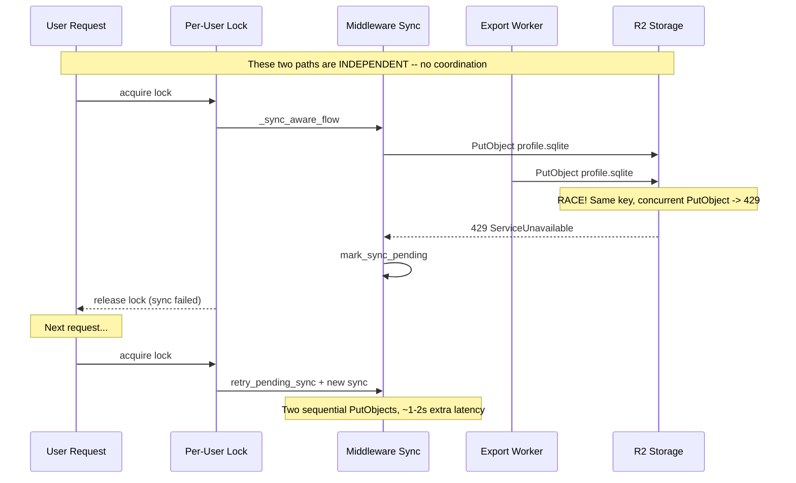
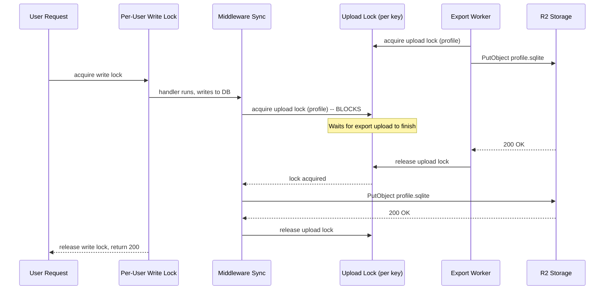

# T1539 Design: R2 Concurrent-Write Rate Limit

## Investigation Results

### Hypothesis Check: Does the per-user lock release before upload completes?

**No. The lock holds through the entire R2 upload.** The kickoff prompt's hypothesis is wrong.

Proof (tracing the lock lifecycle):

```
_dispatch_impl (db_sync.py:442)
  async with _maybe_write_lock(...)        # <-- asyncio.Lock acquired here
    _sync_aware_flow(...)                  # <-- entire body runs inside lock
      1. await asyncio.to_thread(retry_pending_sync)    # awaited, lock held
      2. response = await call_next(request)             # handler runs, lock held
      3. await asyncio.gather(                           # awaited, lock held
           loop.run_in_executor(None, _sync_profile),   #   PutObject profile.sqlite
           loop.run_in_executor(None, _sync_user),       #   PutObject user.sqlite
         )
                                           # <-- lock releases here (end of async with)
```

The `async with lock:` in `_maybe_write_lock` (line 149) holds until `yield` completes. Since `_sync_aware_flow` is `await`ed inside that yield, and `asyncio.gather` is `await`ed inside `_sync_aware_flow`, the lock doesn't release until both PutObject calls finish. Request B cannot enter `_sync_aware_flow` until Request A's uploads complete.

### Do the two parallel PutObjects target different R2 keys?

**Yes. Confirmed safe.**

- `profile.sqlite` key: `{env}/users/{uid}/profiles/{pid}/profile.sqlite` (storage.py:190-199)
- `user.sqlite` key: `{env}/users/{uid}/user.sqlite` (storage.py:888-890)

Different R2 keys. R2's "same object" rate limit is key-scoped. These cannot 429 each other.

### Actual Sources of Concurrent Same-Key PutObject

The middleware lock serializes **request-scoped** writes perfectly. But there are **non-request** sync paths that bypass the lock entirely:

#### Source 1: Export Worker (HIGH RISK)

`export_worker.py` calls `sync_db_to_r2_explicit()` directly after completing an export job (lines 129, 229). This runs in a FastAPI `BackgroundTask` -- outside the request middleware, outside the per-user write lock.

**Race scenario:**
```
t0: Export worker finishes, calls sync_db_to_r2_explicit(user, profile)
    -> PutObject profile.sqlite  (thread A, no lock)
t1: User clicks save, middleware acquires write lock
    -> handler writes to DB
    -> PutObject profile.sqlite  (thread B, inside lock)
t1+eps: Both PutObjects in flight on same key -> R2 429
```

This is the most likely source of the observed 429s. Export jobs take seconds to minutes; the user is very likely to perform another write action while an export is completing.

#### Source 2: Shutdown Sync (LOW RISK)

`main.py:206-227` syncs all user DBs during graceful shutdown. If a request is mid-upload when the shutdown handler fires, two PutObjects on the same key could overlap. This is low risk because shutdown is rare and short-lived.

#### Source 3: Stale `.sync_pending` + Export (MEDIUM RISK)

If a middleware sync fails (sets `.sync_pending`), then an export completes and syncs successfully, the marker remains stale. The next request does `retry_pending_sync` -- another PutObject that's technically redundant (export already pushed newer data) but still hits R2.

### Why cascading 429s happen

Even though the middleware lock prevents same-user request-to-request races, the export worker race creates this cascade:

1. Export sync races with request sync -> one gets 429
2. 429'd sync fails -> `.sync_pending` marker set
3. Next write request does `retry_pending_sync` PLUS its own sync = two sequential PutObjects in one request (inside the lock, so not concurrent, but adds ~600-2000ms latency)
4. If the retry itself 429s (R2 rate limit window not yet expired), both syncs fail
5. User sees stalled UI during the extended lock hold time

## Current State Diagram



## Target State Design

### Approach: Per-User Upload Semaphore

Introduce a **per-user upload lock** (not the existing request write lock) that ALL sync paths must acquire before uploading to R2. This includes middleware sync, export worker sync, and shutdown sync.

The key insight: we don't need to serialize the entire request -- just the R2 upload. The request handler can run freely; only the PutObject call needs coordination.

**Why not just extend the existing write lock?**

The existing write lock is an `asyncio.Lock` -- it only works within the asyncio event loop. Export workers run in background threads via `BackgroundTasks`, so they can't acquire an asyncio.Lock. We need a `threading.Lock` (or similar) that works across both the asyncio executor threads and the background task threads.

### Per-User Upload Lock

```python
# In storage.py (or a new sync_lock.py)

_USER_UPLOAD_LOCKS: dict[str, threading.Lock] = {}
_USER_UPLOAD_LOCKS_GUARD = threading.Lock()

def get_user_upload_lock(user_id: str) -> threading.Lock:
    """Per-user lock for R2 uploads. ALL sync paths must hold this."""
    with _USER_UPLOAD_LOCKS_GUARD:
        lock = _USER_UPLOAD_LOCKS.get(user_id)
        if lock is None:
            lock = threading.Lock()
            _USER_UPLOAD_LOCKS[user_id] = lock
        return lock
```

This is a `threading.Lock` because:
- Middleware sync runs on worker threads via `asyncio.to_thread` / `run_in_executor`
- Export worker sync runs in background task threads
- Shutdown sync runs on the main thread
- All three need the same lock

### Where the lock is acquired

**Option A: Inside `sync_database_to_r2_with_version` and `sync_user_db_to_r2_with_version`**

This is the narrowest, safest scope. Every path that uploads profile.sqlite or user.sqlite goes through these two functions. Wrapping the upload (not the HEAD check) in the per-user lock guarantees no concurrent PutObject on the same key, regardless of caller.

```python
# storage.py: sync_database_to_r2_with_version (profile.sqlite)
def sync_database_to_r2_with_version(user_id, local_db_path, current_version, skip_version_check=False):
    ...
    # HEAD check runs outside upload lock (safe: read-only)
    ...
    # Upload with per-user lock
    upload_lock = get_user_upload_lock(user_id)
    with upload_lock:
        retry_r2_call(client.upload_file, ...)
    ...
```

Wait -- profile.sqlite and user.sqlite are different keys. Do they need the same lock? No. R2's rate limit is per-key. We could use two separate locks per user. But since they're always uploaded together (in the `asyncio.gather`), and since the lock hold time is short (~300-1000ms), a single per-user lock is simpler and the cost is minimal (user.sqlite upload waits for profile.sqlite, adding ~300ms to the gather).

**Actually, separate locks per key is better.** The `asyncio.gather` in the middleware deliberately parallelizes profile + user uploads. A single per-user lock would serialize them, adding ~300-1000ms to every write. Two separate locks preserve the parallelism while preventing same-key races.

```python
_USER_UPLOAD_LOCKS: dict[str, threading.Lock] = {}  # key = f"{user_id}:{db_type}"
_USER_UPLOAD_LOCKS_GUARD = threading.Lock()

def get_upload_lock(user_id: str, db_type: str) -> threading.Lock:
    """Per-user, per-db-type lock for R2 uploads."""
    lock_key = f"{user_id}:{db_type}"
    with _USER_UPLOAD_LOCKS_GUARD:
        lock = _USER_UPLOAD_LOCKS.get(lock_key)
        if lock is None:
            lock = threading.Lock()
            _USER_UPLOAD_LOCKS[lock_key] = lock
        return lock
```

**Option B: At the caller level (middleware and export_worker)**

More code changes, more places to forget. Not recommended.

### Recommended: Option A with per-key locks

Place the lock inside `sync_database_to_r2_with_version` and `sync_user_db_to_r2_with_version`, wrapping only the `retry_r2_call(client.upload_file, ...)` call. This is:

- **Minimal scope**: Only the PutObject is serialized, not the HEAD check or version calculation
- **Universal**: Every sync path goes through these functions -- middleware, export worker, shutdown, retry_pending_sync
- **Safe**: `threading.Lock` works in all thread contexts
- **No behavior change for the happy path**: Single writes are unaffected (lock is uncontested). The only observable change is that concurrent syncs (export + request) serialize instead of racing.

### Eliminating retry_pending_sync as a separate path

With the upload lock in place, `retry_pending_sync` becomes less problematic (it can't race with the post-handler sync anymore). However, it's still wasteful: it does a full upload that may be redundant if the export worker already synced.

**Proposal: Keep retry_pending_sync but skip it if the upload lock is currently held.** If someone else is already uploading, their upload will clear the pending state (or fail and leave it for the next request). `tryLock` semantics:

```python
# In retry_pending_sync path (db_sync.py:466-479)
upload_lock = get_upload_lock(user_id, "profile")
if not upload_lock.acquire(blocking=False):
    logger.info(f"[SYNC] Skipping retry - upload already in progress for user {user_id}")
    # Don't clear marker -- let the in-progress upload handle it
else:
    try:
        # ... existing retry logic ...
    finally:
        upload_lock.release()
```

This is an optimization, not a requirement. The upload lock alone is sufficient for correctness.

## Target State Diagram



## Implementation Plan

### Files to Change

| File | Change |
|------|--------|
| `src/backend/app/storage.py` | Add `get_upload_lock()`, wrap upload in `sync_database_to_r2_with_version` and `sync_user_db_to_r2_with_version` |
| `src/backend/app/middleware/db_sync.py` | Optional: add tryLock optimization to `retry_pending_sync` path |

### Pseudo-code Changes

**storage.py** -- add upload lock infrastructure:

```python
# Near top of file, after existing imports
_USER_UPLOAD_LOCKS: dict[str, threading.Lock] = {}
_USER_UPLOAD_LOCKS_GUARD = threading.Lock()
UPLOAD_LOCK_WAIT_LOG_MS = 50  # log when upload waited for lock

def get_upload_lock(user_id: str, db_type: str) -> threading.Lock:
    lock_key = f"{user_id}:{db_type}"
    with _USER_UPLOAD_LOCKS_GUARD:
        lock = _USER_UPLOAD_LOCKS.get(lock_key)
        if lock is None:
            lock = threading.Lock()
            _USER_UPLOAD_LOCKS[lock_key] = lock
        return lock
```

**storage.py** -- `sync_database_to_r2_with_version`:

```python
# Wrap the upload_file call (lines ~822-828)
upload_lock = get_upload_lock(user_id, "profile")
lock_start = time.perf_counter()
with upload_lock:
    lock_wait_ms = (time.perf_counter() - lock_start) * 1000
    if lock_wait_ms >= UPLOAD_LOCK_WAIT_LOG_MS:
        logger.info(f"[UPLOAD_LOCK_WAIT] user={user_id} db=profile waited_ms={int(lock_wait_ms)}")
    retry_r2_call(
        client.upload_file,
        str(local_db_path), R2_BUCKET, key,
        ExtraArgs={"Metadata": {"db-version": str(new_version)}},
        operation=f"db_sync_upload {user_id}", **TIER_1,
    )
```

**storage.py** -- `sync_user_db_to_r2_with_version`:

Same pattern, with `db_type="user"`.

**db_sync.py** -- optional tryLock optimization for retry_pending_sync:

```python
# Before calling retry_pending_sync, check if upload is already in progress
from ..storage import get_upload_lock
profile_lock = get_upload_lock(user_id, "profile")
if not profile_lock.acquire(blocking=False):
    logger.info(f"[SYNC] Skipping retry - upload in progress for user {user_id}")
    # Another sync is running; it will either succeed (clearing the marker)
    # or fail (leaving it for the next request)
else:
    profile_lock.release()  # Release immediately; the actual lock is inside the upload function
    # ... existing retry_pending_sync logic ...
```

Note: The tryLock here is a "peek" -- it checks if someone is uploading, but the actual serialization happens inside `sync_database_to_r2_with_version`. This avoids duplicating the lock logic.

### Scenario Analysis

#### 1. Normal single write (happy path)
- Request enters, acquires write lock
- Handler writes to DB
- Upload lock acquired (uncontested), PutObject succeeds
- Upload lock released, write lock released, return 200
- **No change in behavior or latency**

#### 2. Two rapid writes from same user (lock contention)
- Request A acquires write lock, handler runs, PutObject starts (upload lock held)
- Request B waits on write lock
- Request A PutObject completes, upload lock released, write lock released
- Request B acquires write lock, handler runs, PutObject starts (upload lock held)
- **Same as today -- write lock already serializes this. Upload lock is uncontested.**

#### 3. Export worker sync races with request sync
- Export finishes, acquires upload lock, PutObject starts
- Request finishes handler, tries to acquire upload lock -- **blocks** (new behavior!)
- Export PutObject completes, upload lock released
- Request acquires upload lock, PutObject starts
- **429 eliminated. Request latency increases by export upload time (~300-1000ms). This is the trade-off.**

#### 4. Write fails mid-upload (crash recovery)
- Request acquires write lock, handler writes, `mark_sync_pending()`
- PutObject fails (network error) -- upload lock released, write lock released
- `.sync_pending` marker remains
- Next write request: acquires write lock, sees marker, runs `retry_pending_sync`
- `retry_pending_sync` acquires upload lock, PutObject succeeds
- **Same as today, plus upload lock guarantees retry doesn't race with export.**

#### 5. Write succeeds but retry_pending_sync fires on stale marker
- Export sync succeeds but doesn't clear `.sync_pending` (export doesn't touch it)
- Next request: retry_pending_sync runs, succeeds (redundant but correct), clears marker
- **With tryLock optimization**: if export is still uploading, retry is skipped (saves ~300-1000ms)

### Observability

New log line: `[UPLOAD_LOCK_WAIT]` when a sync waited for the upload lock. Format:
```
[UPLOAD_LOCK_WAIT] user={user_id} db={profile|user} waited_ms={N}
```

Existing `[R2_CALL]`, `[SYNC]`, `[WRITE_LOCK_WAIT]` logs unchanged.

### What about T1538 (Per-Resource Locks)?

T1538 proposes running handlers for disjoint table sets in parallel, then serializing the R2 push. The upload lock proposed here IS the "R2 push lock" that T1538 needs (its Option 2b). If T1538 ships, it can reuse `get_upload_lock()` directly.

## Risks

| Risk | Mitigation |
|------|------------|
| Upload lock adds latency when export races with request | Acceptable: ~300-1000ms delay is better than 429 cascade. Log `[UPLOAD_LOCK_WAIT]` to measure frequency. |
| `threading.Lock` deadlock if same thread tries to acquire twice | `sync_database_to_r2_with_version` is the only acquirer for `profile` key; `sync_user_db_to_r2_with_version` for `user` key. No nesting possible. |
| Lock dict grows unbounded | Same pattern as `_USER_WRITE_LOCKS` in db_sync.py -- one lock per active user is negligible memory. |
| Retry within upload lock extends lock hold time | Acceptable: TIER_1 retries up to 4 attempts with backoff. Worst case ~15s lock hold. But without the lock, the alternative is 429 cascade which is worse. |

## LOC Estimate

- storage.py: ~30 lines (lock infrastructure + wrapping two upload calls)
- db_sync.py: ~10 lines (optional tryLock optimization)
- Total: ~40 lines
