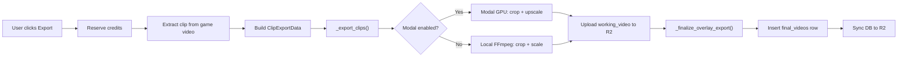
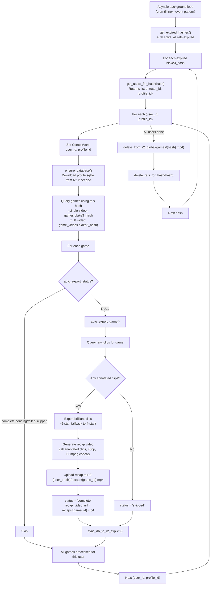
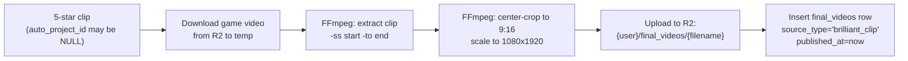
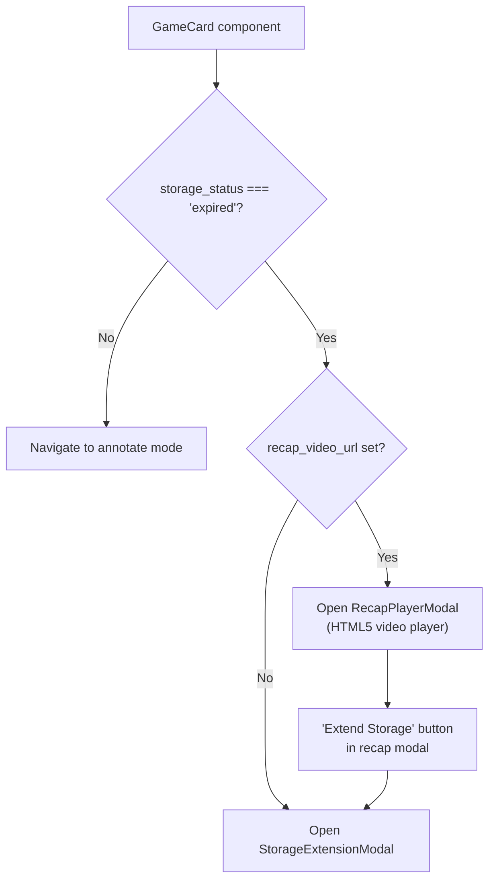

# T1583 Design: Auto-Export Pipeline (Recap + Brilliant Clips)

**Status:** APPROVED
**Author:** Architect Agent
**Approved:** 2026-05-02

## Current State ("As Is")

### Game Video Lifecycle

Today, game videos are uploaded, stored, and tracked — but never cleaned up. The cleanup functions exist but are never called.

```mermaid
flowchart TD
    Upload[User uploads game video] --> Hash[blake3 hash computed]
    Hash --> Dedup{Hash exists in R2?}
    Dedup -- No --> R2Upload[Upload to R2: games/{hash}.mp4]
    Dedup -- Yes --> Skip[Skip upload, reuse existing]
    R2Upload --> Ref[Insert game_storage_ref in auth.sqlite]
    Skip --> Ref
    Ref --> Game[Insert game row in profile.sqlite]
    Game --> Expire[storage_expires_at = now + 30 days]

    subgraph "Never Called (T1580 scaffolding)"
        Sweep[get_expired_hashes] --> Delete[delete_refs_for_hash]
        Delete --> R2Del[Delete R2 object]
    end
```

### Existing Export Pipeline

The export pipeline processes user-initiated framing exports through Modal GPU or local FFmpeg:



### Key Limitations

- **No cleanup:** `get_expired_hashes()` and `delete_refs_for_hash()` exist in `auth_db.py` but are never called. Expired game videos sit in R2 indefinitely.
- **No auto-export:** When a game video eventually gets deleted, all unannotated brilliant clips would be lost.
- **No recap:** Users have no way to watch a summary of their annotated clips after the game video expires.
- **No scheduler:** The backend has no cron/scheduler pattern. Only startup hooks exist.
- **No global R2 delete:** `delete_from_r2()` is user-scoped. Game videos are stored globally — a new `delete_from_r2_global()` function is needed.

---

## Target State ("Should Be")

### Auto-Export + Cleanup Sweep Flow



### Brilliant Clip Export (Detail)

For V1, brilliant clips are exported via **simple FFmpeg center-crop** — no GPU upscale:



**Rationale for FFmpeg-only (no GPU):**
- Auto-projects created by `_create_auto_project_for_clip()` have **no crop keyframes** — the project exists but has empty crop_data
- Running GPU upscale for background auto-export adds latency, cost, and complexity
- The 1-credit surcharge has 5-7x margin — future GPU upgrade is feasible without repricing
- Users get the clip preserved immediately; quality can improve in a later iteration

### Frontend: Expired Game with Recap



---

## Implementation Plan ("Will Be")

### A. Database Migration

**File:** `src/backend/app/database.py`

Add two columns to `games` table, following the T1580 `storage_expires_at` migration pattern:

```pseudo
// In run_migrations() section, after storage_expires_at migration (~line 1037):

game_cols = {c['name'] for c in cursor.execute("PRAGMA table_info(games)").fetchall()}

if 'auto_export_status' not in game_cols:
    cursor.execute("ALTER TABLE games ADD COLUMN auto_export_status TEXT")
    logger.info("[Migration T1583] Added auto_export_status to games")

if 'recap_video_url' not in game_cols:
    cursor.execute("ALTER TABLE games ADD COLUMN recap_video_url TEXT")
    logger.info("[Migration T1583] Added recap_video_url to games")
```

Also update the `CREATE TABLE games` statement to include the new columns in the schema definition (for new databases).

### B. R2 Storage: Global Delete Function

**File:** `src/backend/app/storage.py`

Add `delete_from_r2_global()` near the existing global functions (~line 1300):

```pseudo
def delete_from_r2_global(key: str) -> bool:
    """Delete a global R2 object (no user prefix). Used for cleanup sweep."""
    client = get_r2_client()
    if not client:
        return False
    full_key = r2_global_key(key)
    try:
        retry_r2_call(client.delete_object, Bucket=R2_BUCKET, Key=full_key, ...)
        return True
    except Exception:
        return False
```

### C. Auth DB: Get Users for Hash

**File:** `src/backend/app/services/auth_db.py`

Add function to retrieve all user/profile pairs for a hash (needed by sweep):

```pseudo
def get_users_for_hash(blake3_hash: str) -> list[dict]:
    """Get all (user_id, profile_id) pairs that reference this game hash."""
    with get_auth_db() as db:
        rows = db.execute(
            """SELECT user_id, profile_id FROM game_storage_refs
               WHERE blake3_hash = ?""",
            (blake3_hash,),
        ).fetchall()
    return [dict(r) for r in rows]
```

### D. Auto-Export Service

**New file:** `src/backend/app/services/auto_export.py`

Core service with two main functions:

#### `auto_export_game(user_id, profile_id, game_id) -> str`

Returns status: 'complete', 'skipped', 'failed'.

```pseudo
def auto_export_game(user_id, profile_id, game_id) -> str:
    """Auto-export brilliant clips and generate recap for a game."""

    # 1. Set ContextVars for DB/storage operations
    set_current_user_id(user_id)
    set_current_profile_id(profile_id)
    ensure_database()

    with get_db_connection() as conn:
        cursor = conn.cursor()

        # 2. Idempotency check
        game = cursor.execute(
            "SELECT auto_export_status, blake3_hash FROM games WHERE id = ?",
            (game_id,)
        ).fetchone()
        if game['auto_export_status'] in ('complete', 'pending'):
            return game['auto_export_status']

        # 3. Mark as pending
        cursor.execute(
            "UPDATE games SET auto_export_status = 'pending' WHERE id = ?",
            (game_id,)
        )
        conn.commit()

    try:
        # 4. Query annotated clips
        with get_db_connection() as conn:
            cursor = conn.cursor()
            annotated_clips = cursor.execute("""
                SELECT rc.*, COALESCE(gv.blake3_hash, g.blake3_hash) as video_hash
                FROM raw_clips rc
                LEFT JOIN games g ON rc.game_id = g.id
                LEFT JOIN game_videos gv ON gv.game_id = rc.game_id
                    AND gv.sequence = COALESCE(rc.video_sequence, 1)
                WHERE rc.game_id = ? AND rc.rating IS NOT NULL
                ORDER BY COALESCE(rc.video_sequence, 1), rc.start_time
            """, (game_id,)).fetchall()

        if not annotated_clips:
            _set_game_status(game_id, 'skipped')
            sync_db_to_r2_explicit(user_id, profile_id)
            return 'skipped'

        # 5. Export brilliant clips (5-star, fallback to 4-star)
        brilliant_clips = [c for c in annotated_clips if c['rating'] == 5]
        if not brilliant_clips:
            brilliant_clips = [c for c in annotated_clips if c['rating'] == 4]

        for clip in brilliant_clips:
            _export_brilliant_clip(user_id, profile_id, clip, game_id)

        # 6. Generate recap video (all annotated clips, 480p)
        recap_url = _generate_recap(user_id, profile_id, game_id, annotated_clips)

        # 7. Mark complete
        with get_db_connection() as conn:
            cursor = conn.cursor()
            cursor.execute(
                "UPDATE games SET auto_export_status = 'complete', recap_video_url = ? WHERE id = ?",
                (recap_url, game_id)
            )
            conn.commit()

        sync_db_to_r2_explicit(user_id, profile_id)
        return 'complete'

    except Exception as e:
        logger.error(f"[AutoExport] Failed for game {game_id}: {e}")
        _set_game_status(game_id, 'failed')
        sync_db_to_r2_explicit(user_id, profile_id)
        return 'failed'
```

#### `_export_brilliant_clip(user_id, profile_id, clip, game_id)`

Simple FFmpeg center-crop export (no GPU):

```pseudo
def _export_brilliant_clip(user_id, profile_id, clip, game_id):
    """Export a single brilliant clip via FFmpeg center-crop to 9:16 at 1080x1920."""

    video_hash = clip['video_hash']
    start_time = clip['start_time']
    end_time = clip['end_time']
    duration = end_time - start_time

    with tempfile.TemporaryDirectory() as temp_dir:
        # 1. Download source game video from R2
        source_path = Path(temp_dir) / "source.mp4"
        download_from_r2_global(f"games/{video_hash}.mp4", source_path)

        # 2. Extract clip segment
        extracted_path = Path(temp_dir) / "extracted.mp4"
        ffmpeg.input(str(source_path), ss=start_time, to=end_time) \
            .output(str(extracted_path), c='copy') \
            .run(quiet=True)

        # 3. Probe source dimensions
        probe = ffmpeg.probe(str(extracted_path))
        src_w = probe['streams'][0]['width']
        src_h = probe['streams'][0]['height']

        # 4. Calculate center-crop for 9:16
        target_ratio = 9 / 16
        src_ratio = src_w / src_h
        if src_ratio > target_ratio:
            # Source is wider: crop width
            crop_h = src_h
            crop_w = int(crop_h * target_ratio)
        else:
            # Source is taller: crop height
            crop_w = src_w
            crop_h = int(crop_w / target_ratio)
        crop_x = (src_w - crop_w) // 2
        crop_y = (src_h - crop_h) // 2

        # 5. Crop + scale to 1080x1920
        output_path = Path(temp_dir) / "output.mp4"
        ffmpeg.input(str(extracted_path)) \
            .filter('crop', crop_w, crop_h, crop_x, crop_y) \
            .filter('scale', 1080, 1920) \
            .output(str(output_path), vcodec='libx264', preset='medium',
                    crf=23, acodec='aac', movflags='+faststart') \
            .run(quiet=True)

        # 6. Upload to R2 as final_video
        filename = f"auto_{game_id}_{clip['id']}_{uuid.uuid4().hex[:8]}.mp4"
        r2_key = f"final_videos/{filename}"
        upload_to_r2(user_id, r2_key, output_path)

    # 7. Insert final_videos row
    with get_db_connection() as conn:
        cursor = conn.cursor()

        # Derive project name from clip (reuse existing naming logic)
        clip_name = derive_clip_name(clip['name'], clip['rating'],
                                     json.loads(clip['tags'] or '[]'),
                                     clip['notes'], '')

        cursor.execute("""
            INSERT INTO final_videos (project_id, filename, version, source_type,
                                      game_id, name, published_at, duration)
            VALUES (?, ?, 1, 'brilliant_clip', ?, ?, CURRENT_TIMESTAMP, ?)
        """, (clip['auto_project_id'], filename, game_id, clip_name, duration))
        conn.commit()
```

#### `_generate_recap(user_id, profile_id, game_id, clips) -> str`

CPU-only FFmpeg concat of all annotated clips at 480p:

```pseudo
def _generate_recap(user_id, profile_id, game_id, clips) -> str:
    """Generate a 480p recap video by concatenating all annotated clips."""

    with tempfile.TemporaryDirectory() as temp_dir:
        # 1. Group clips by video_hash (multi-video games)
        clips_by_hash = defaultdict(list)
        for clip in clips:
            clips_by_hash[clip['video_hash']].append(clip)

        # 2. For each source video, download once and extract all clips
        extracted_paths = []
        for video_hash, hash_clips in clips_by_hash.items():
            source_path = Path(temp_dir) / f"source_{video_hash[:12]}.mp4"
            download_from_r2_global(f"games/{video_hash}.mp4", source_path)

            for i, clip in enumerate(hash_clips):
                out_path = Path(temp_dir) / f"clip_{clip['id']}.mp4"
                # Extract + scale to 480p width, maintain aspect ratio
                ffmpeg.input(str(source_path), ss=clip['start_time'],
                             to=clip['end_time']) \
                    .filter('scale', 854, 480) \
                    .output(str(out_path), vcodec='libx264', preset='fast',
                            crf=28, acodec='aac', movflags='+faststart') \
                    .run(quiet=True)
                extracted_paths.append(out_path)

        # 3. Create FFmpeg concat list file
        concat_list = Path(temp_dir) / "concat.txt"
        with open(concat_list, 'w') as f:
            for path in extracted_paths:
                f.write(f"file '{path}'\n")

        # 4. Concatenate all clips
        recap_path = Path(temp_dir) / "recap.mp4"
        ffmpeg.input(str(concat_list), f='concat', safe=0) \
            .output(str(recap_path), c='copy', movflags='+faststart') \
            .run(quiet=True)

        # 5. Upload recap to R2 (user-scoped, not global)
        recap_r2_key = f"recaps/{game_id}.mp4"
        upload_to_r2(user_id, recap_r2_key, recap_path)

    return recap_r2_key
```

### E. Cleanup Sweep (Asyncio Background Loop)

**New file:** `src/backend/app/services/sweep_scheduler.py`

In-process asyncio background task with "cron till next event" pattern. Instead of a fixed daily cron, the sweep determines when the next game expires and sleeps until then.

```pseudo
_sweep_task = None

async def start_sweep_loop():
    """Start the sweep loop as a background task. Called from app startup."""
    global _sweep_task
    _sweep_task = asyncio.create_task(run_sweep_loop())

async def stop_sweep_loop():
    """Cancel the sweep loop. Called from app shutdown."""
    if _sweep_task:
        _sweep_task.cancel()

async def run_sweep_loop():
    """Self-scheduling sweep: runs, finds next expiry, sleeps until then."""
    # Wait 60s after startup to let the app stabilize
    await asyncio.sleep(60)

    while True:
        try:
            await do_sweep()

            # Determine next wake time
            next_expiry = get_next_expiry()  # auth_db function
            if next_expiry is None:
                delay = 86400  # Nothing pending, check back in 24h
            else:
                delay = (next_expiry - datetime.utcnow()).total_seconds()
                delay = max(delay, 60)    # Don't spin faster than 1min
                delay = min(delay, 86400) # Cap at 24h safety net

            logger.info(f"[Sweep] Next run in {delay/3600:.1f}h")
            await asyncio.sleep(delay)

        except asyncio.CancelledError:
            logger.info("[Sweep] Shutdown")
            break
        except Exception:
            logger.exception("[Sweep] Error, retrying in 1h")
            await asyncio.sleep(3600)

async def do_sweep():
    """Process all currently-expired game hashes."""
    expired_hashes = get_expired_hashes()
    if not expired_hashes:
        logger.info("[Sweep] No expired games")
        return

    for blake3_hash in expired_hashes:
        # Get all user/profile refs for this hash
        refs = get_users_for_hash(blake3_hash)

        for ref in refs:
            user_id = ref['user_id']
            profile_id = ref['profile_id']

            # Set ContextVars for per-user DB operations
            set_current_user_id(user_id)
            set_current_profile_id(profile_id)
            ensure_database()

            with get_db_connection() as conn:
                cursor = conn.cursor()
                # Single-video games
                games = cursor.execute(
                    """SELECT id FROM games
                       WHERE blake3_hash = ? AND auto_export_status IS NULL""",
                    (blake3_hash,)
                ).fetchall()
                # Multi-video games (only if ALL hashes for the game are expired)
                mv_games = cursor.execute(
                    """SELECT DISTINCT g.id FROM games g
                       JOIN game_videos gv ON gv.game_id = g.id
                       WHERE gv.blake3_hash = ? AND g.auto_export_status IS NULL
                       AND NOT EXISTS (
                           SELECT 1 FROM game_videos gv2
                           JOIN game_storage_refs gsr ON gsr.blake3_hash = gv2.blake3_hash
                               AND gsr.user_id = ? AND gsr.profile_id = ?
                           WHERE gv2.game_id = g.id
                           AND gsr.storage_expires_at > datetime('now')
                       )""",
                    (blake3_hash, user_id, str(profile_id))
                ).fetchall()
                all_game_ids = set(g['id'] for g in games + mv_games)

            for game_id in all_game_ids:
                try:
                    status = auto_export_game(user_id, profile_id, game_id)
                    logger.info(f"[Sweep] game={game_id} user={user_id[:8]} status={status}")
                except Exception as e:
                    logger.error(f"[Sweep] Auto-export failed: user={user_id} game={game_id}: {e}")

        # Delete R2 game video object (after ALL users processed)
        delete_from_r2_global(f"games/{blake3_hash}.mp4")
        delete_refs_for_hash(blake3_hash)
        logger.info(f"[Sweep] Deleted R2 object and refs for hash={blake3_hash[:12]}")
```

**New auth_db function: `get_next_expiry()`**

```pseudo
def get_next_expiry() -> datetime | None:
    """Return the earliest future expiry across all game storage refs."""
    now = datetime.utcnow().isoformat()
    with get_auth_db() as db:
        row = db.execute(
            """SELECT MIN(storage_expires_at) as next_expiry
               FROM game_storage_refs
               WHERE storage_expires_at > ?""",
            (now,),
        ).fetchone()
    if row and row['next_expiry']:
        return datetime.fromisoformat(row['next_expiry'])
    return None
```

**Hook into `main.py` startup/shutdown:**

```pseudo
from app.services.sweep_scheduler import start_sweep_loop, stop_sweep_loop

@app.on_event("startup")
async def startup_event():
    # ...existing startup code...
    await start_sweep_loop()

@app.on_event("shutdown")
async def shutdown_event():
    await stop_sweep_loop()
```

### F. Backend: Games API Update

**File:** `src/backend/app/routers/games.py`

Add `auto_export_status` and `recap_video_url` to the games list response:

```pseudo
// In list_games(), add to the SELECT query:
// g.auto_export_status, g.recap_video_url

// In the games.append() dict (~line 678):
'auto_export_status': row['auto_export_status'],
'recap_video_url': row['recap_video_url'],
```

Add recap presigned URL endpoint:

```pseudo
@router.get("/{game_id:int}/recap-url")
async def get_recap_url(game_id: int):
    """Get presigned URL for a game's recap video."""
    with get_db_connection() as conn:
        cursor = conn.cursor()
        game = cursor.execute(
            "SELECT recap_video_url FROM games WHERE id = ?",
            (game_id,)
        ).fetchone()

    if not game or not game['recap_video_url']:
        raise HTTPException(404, "No recap video")

    user_id = get_current_user_id()
    url = generate_presigned_url(user_id, game['recap_video_url'])
    return {"url": url}
```

### G. Frontend: GameCard with Recap

**File:** `src/frontend/src/components/ProjectManager.jsx`

Update `GameCard` click handler:

```pseudo
// GameCard component (~line 1118)

function GameCard({ game, onLoad, onDelete, onExtend, onPlayRecap }) {
    // ...existing code...
    const isExpired = game.storage_status === 'expired';
    const hasRecap = Boolean(game.recap_video_url);

    const handleClick = () => {
        if (isExpired) {
            if (hasRecap) {
                onPlayRecap?.();
            } else {
                onExtend?.();
            }
        } else {
            onLoad();
        }
    };

    // In the JSX, add a Play icon for expired games with recap:
    // {isExpired && hasRecap && <Play size={14} className="text-blue-400" />}
```

### H. Frontend: RecapPlayerModal

**New file:** `src/frontend/src/components/RecapPlayerModal.jsx`

Lightweight HTML5 video player modal:

```pseudo
function RecapPlayerModal({ game, onClose, onExtend }) {
    const [videoUrl, setVideoUrl] = useState(null);

    useEffect(() => {
        // Fetch presigned URL for recap
        fetch(`${API_BASE}/api/games/${game.id}/recap-url`, { credentials: 'include' })
            .then(r => r.json())
            .then(data => setVideoUrl(data.url));
    }, [game.id]);

    return (
        <Modal onClose={onClose}>
            <h2>{game.name} - Recap</h2>
            {videoUrl ? (
                <video src={videoUrl} controls autoPlay className="w-full rounded" />
            ) : (
                <LoadingSpinner />
            )}
            <div className="mt-4 flex gap-2">
                <Button onClick={onExtend}>Extend Storage</Button>
                <Button onClick={onClose} variant="secondary">Close</Button>
            </div>
        </Modal>
    );
}
```

### I. Frontend: ProjectManager Integration

**File:** `src/frontend/src/components/ProjectManager.jsx`

Add RecapPlayerModal state and rendering in the parent component that renders GameCard:

```pseudo
// In the parent component that manages games:
const [recapGame, setRecapGame] = useState(null);

// Pass onPlayRecap to GameCard:
<GameCard
    game={game}
    onPlayRecap={() => setRecapGame(game)}
    // ...existing props
/>

// Render RecapPlayerModal:
{recapGame && (
    <RecapPlayerModal
        game={recapGame}
        onClose={() => setRecapGame(null)}
        onExtend={() => {
            setRecapGame(null);
            // Open StorageExtensionModal for recapGame
        }}
    />
)}
```

---

## File Changes Summary

| File | Change | LOC Estimate |
|------|--------|-------------|
| `src/backend/app/database.py` | Add `auto_export_status`, `recap_video_url` columns + migration | ~15 |
| `src/backend/app/storage.py` | Add `delete_from_r2_global()` | ~20 |
| `src/backend/app/services/auth_db.py` | Add `get_users_for_hash()`, `get_next_expiry()` | ~20 |
| `src/backend/app/services/auto_export.py` | **NEW** — auto_export_game, _export_brilliant_clip, _generate_recap | ~250 |
| `src/backend/app/services/sweep_scheduler.py` | **NEW** — asyncio background loop with cron-till-next-event | ~80 |
| `src/backend/app/routers/games.py` | Add fields to games list response + recap-url endpoint | ~25 |
| `src/backend/app/main.py` | Start/stop sweep loop in startup/shutdown | ~6 |
| `src/frontend/src/components/ProjectManager.jsx` | GameCard click logic + RecapPlayerModal integration | ~30 |
| `src/frontend/src/components/RecapPlayerModal.jsx` | **NEW** — recap video player modal | ~60 |
| **Total** | | **~506** |

---

## Risks

| Risk | Impact | Mitigation |
|------|--------|------------|
| Auto-export takes too long, blocks sweep | High | Set per-game timeout (5 min). On timeout, mark `failed` and move on. R2 deletion is not blocked by export failure. |
| FFmpeg center-crop cuts off important action | Medium | Acceptable for V1 — users can extend storage and re-export with manual framing. Future: use auto-crop keyframes from YOLO. |
| Multi-video game recap downloads multiple large files | Medium | Download each source video once, extract all clips from it. Use streaming/temp dir cleanup. |
| Sweep processes many users concurrently | Medium | Process sequentially (one user at a time). Background loop has no user-facing latency requirement. Add progress logging. |
| App restart resets sweep timer | Low | Sweep is idempotent — on startup it re-queries `get_next_expiry()` and resumes correctly. 60s startup delay prevents thrashing. |
| Profile.sqlite not in local cache for background user | Medium | Call `ensure_database()` which downloads from R2 if not present locally. This is the existing pattern for background workers. |
| Global R2 delete while another region is still serving | Low | `get_expired_hashes()` only returns hashes where ALL refs expired. The ref system is the source of truth. |
| Recap presigned URL expires before user finishes watching | Low | Use 4-hour expiry (matching game video URLs). Recap videos are small (480p). |

---

## Open Questions

All resolved:

- [x] **Sweep trigger:** Asyncio background loop with "cron till next event" pattern (not external scheduler — Fly.io Scheduled Machines can't share the volume, and admin endpoints add unnecessary auth complexity).
- [x] **Multi-video game expiry:** Both halves of a multi-video game renew together. The sweep only processes a game when ALL of its hashes have expired. If half 1 is expired but half 2 was extended, the game is not swept.

---

## Testing Strategy

### Backend Unit Tests

**File:** `tests/test_auto_export.py`

| Test | What it verifies |
|------|-----------------|
| `test_auto_export_no_clips` | Game with no annotated clips -> status='skipped', no recap |
| `test_auto_export_brilliant_clips` | 5-star clips exported as final_videos with source_type='brilliant_clip' |
| `test_auto_export_fallback_to_4star` | No 5-star clips -> falls back to 4-star clips |
| `test_auto_export_recap_generated` | Recap video created and uploaded to R2 |
| `test_auto_export_idempotent` | Calling twice doesn't re-export (status='complete' on second call) |
| `test_auto_export_failure_doesnt_block` | Export failure -> status='failed', sweep continues |
| `test_auto_export_multi_video` | Multi-video game clips extracted from correct source video |
| `test_cleanup_sweep_deletes_r2` | Expired hash -> R2 object deleted after auto-export |
| `test_cleanup_sweep_preserves_active` | Hash with active ref -> not deleted |

### Backend Integration Tests

| Test | What it verifies |
|------|-----------------|
| `test_do_sweep_no_expired` | `do_sweep()` returns immediately when nothing expired |
| `test_do_sweep_processes_all_users` | Sweep processes all user/profile refs for an expired hash |
| `test_do_sweep_skips_partially_expired_multi_video` | Multi-video game with one active hash is NOT swept |
| `test_games_api_includes_new_fields` | `auto_export_status` and `recap_video_url` in response |
| `test_recap_url_endpoint` | Returns presigned URL for recap video |
| `test_get_next_expiry` | Returns earliest future expiry datetime |

### Frontend Tests

| Test | What it verifies |
|------|-----------------|
| `test_expired_game_with_recap_shows_play` | GameCard shows play icon when expired + has recap_video_url |
| `test_expired_game_click_opens_recap` | Clicking expired game with recap opens RecapPlayerModal |
| `test_expired_game_without_recap_opens_extend` | Clicking expired game without recap opens StorageExtensionModal |
| `test_recap_modal_has_extend_button` | RecapPlayerModal includes "Extend Storage" button |
