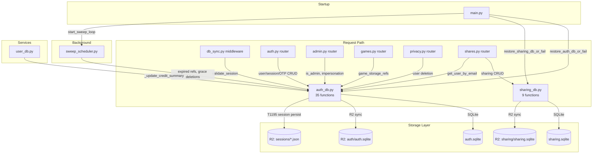
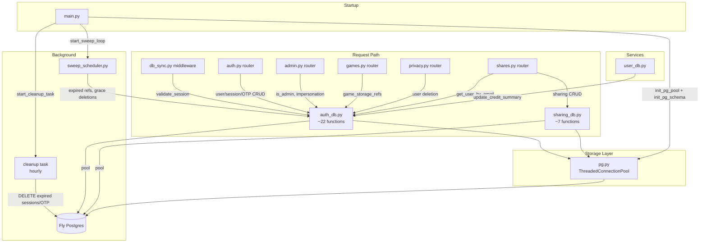

# T1960 Design: Migrate Global SQLite to Fly Postgres

**Status:** DRAFT
**Author:** Architect Agent
**Date:** 2026-05-11

## Current State ("As Is")

### Architecture



### Current Connection Pattern

```python
# auth_db.py -- SQLite context manager
@contextmanager
def get_auth_db():
    conn = sqlite3.connect(AUTH_DB_PATH, timeout=30)
    conn.row_factory = sqlite3.Row
    conn.execute("PRAGMA journal_mode=WAL")
    conn.execute("PRAGMA busy_timeout=30000")
    try:
        yield conn
    finally:
        conn.close()

# Callers:
with get_auth_db() as db:
    row = db.execute("SELECT ... WHERE email = ?", (email,)).fetchone()
```

### Problems

1. **New connection per call**: Each `get_auth_db()` opens and closes a SQLite connection
2. **Full-file R2 sync**: Every write to auth.sqlite uploads the entire file (~O(users))
3. **Session R2 persistence (T1195)**: Per-session R2 PutObject/GetObject/DeleteObject as workaround for restart fragility
4. **In-memory session cache**: Threading.Lock-based cache to avoid SQLite hits -- adds complexity
5. **Startup restore fragility**: `restore_auth_db_or_fail()` downloads entire SQLite file from R2 with 3x retry
6. **OTP inline SQL**: 5 raw SQL queries in auth.py router use `get_auth_db()` directly (not functions in auth_db.py)
7. **`_reset_test_account` uses raw sqlite3.connect**: Bypasses auth_db.py entirely

## Target State ("Should Be")

### Architecture



### Key Changes

| Aspect | Before | After |
|--------|--------|-------|
| Connection | New sqlite3.Connection per call | ThreadedConnectionPool (2-10 conns) |
| Auth DB restore | Download full file from R2 on startup | Pool connects to Fly Postgres |
| Sharing DB restore | Download full file from R2 on startup | Same Postgres, same pool |
| Session durability | T1195 per-session R2 JSON objects | Postgres rows (survive restarts natively) |
| Session cache | In-memory dict + threading.Lock | Removed -- Postgres indexed lookup ~5ms |
| R2 sync (auth) | Full-file upload after writes | Removed entirely |
| R2 sync (sharing) | Full-file upload after writes | Removed entirely |
| Session cleanup | Manual `cleanup_expired_sessions()` | Hourly asyncio task: `DELETE WHERE expires_at < now()` |
| OTP cleanup | None (accumulates forever) | Hourly asyncio task: `DELETE WHERE expires_at < now()` |
| SQL placeholders | `?` (sqlite3) | `%s` (psycopg2) |
| Row access | `sqlite3.Row['col']` | `RealDictRow['col']` (compatible) |
| auth_db.py functions | 35 (incl. 12 R2/cache) | ~22 (R2 + cache + T1195 removed) |

## Implementation Plan ("Will Be")

### New Module: `app/services/pg.py`

Central Postgres connection pool shared by auth_db.py and sharing_db.py.

```python
# app/services/pg.py
import os
import logging
from contextlib import contextmanager
from psycopg2.pool import ThreadedConnectionPool
from psycopg2.extras import RealDictCursor

_pool: ThreadedConnectionPool | None = None

def init_pg_pool():
    """Initialize pool from DATABASE_URL. Called once at startup."""
    global _pool
    _pool = ThreadedConnectionPool(
        minconn=2, maxconn=10,
        dsn=os.environ["DATABASE_URL"],
        cursor_factory=RealDictCursor,
    )

def close_pg_pool():
    """Close all connections. Called at shutdown."""
    global _pool
    if _pool:
        _pool.closeall()
        _pool = None

@contextmanager
def get_pg():
    """Yield a connection from the pool. Auto-commits on success, rolls back on error."""
    conn = _pool.getconn()
    try:
        yield conn
        conn.commit()
    except Exception:
        conn.rollback()
        raise
    finally:
        _pool.putconn(conn)

def init_pg_schema():
    """Run DDL to create tables + indexes. Idempotent (IF NOT EXISTS)."""
    # Execute the full DDL from the task file
    ...
```

### auth_db.py Changes

**Replace connection management:**
```python
# BEFORE
@contextmanager
def get_auth_db():
    conn = sqlite3.connect(AUTH_DB_PATH, timeout=30)
    ...

# AFTER
from .pg import get_pg

def get_auth_db():
    """Alias for Postgres pool connection. Preserves caller interface."""
    return get_pg()
```

**Migrate function internals (example):**
```python
# BEFORE
def get_user_by_email(email: str) -> Optional[dict]:
    with get_auth_db() as db:
        row = db.execute(
            "SELECT user_id, email, ... FROM users WHERE email = ?",
            (email,)
        ).fetchone()
        return dict(row) if row else None

# AFTER
def get_user_by_email(email: str) -> Optional[dict]:
    with get_auth_db() as conn:
        cur = conn.cursor()
        cur.execute(
            "SELECT user_id, email, ... FROM users WHERE email = %s",
            (email,)
        )
        return cur.fetchone()  # RealDictRow (dict-like) or None
```

**Remove entirely (13 functions + cache):**
- `_get_connection()` -- replaced by pool
- `_get_auth_db_r2_key()`, `_r2_enabled()` -- R2 sync removed
- `sync_auth_db_from_r2()`, `restore_auth_db_or_fail()`, `sync_auth_db_to_r2()` -- R2 sync removed
- `_get_session_r2_key()`, `persist_session_to_r2()`, `restore_session_from_r2()`, `delete_session_from_r2()` -- T1195 removed
- `_session_cache`, `_session_cache_lock` -- Postgres is fast enough
- `init_auth_db()` -- replaced by `init_pg_schema()` in pg.py

**Migrate (22 functions):**
- User ops: `get_user_by_email`, `get_user_by_google_id`, `get_user_by_id`, `create_user`, `link_google_to_user`, `link_email_to_user`, `update_picture_url`, `update_last_seen`
- Session ops: `create_session`, `validate_session`, `invalidate_session`, `invalidate_user_sessions`, `cleanup_expired_sessions`
- Admin: `is_admin`, `get_admin_emails`, `get_all_users_for_admin`
- Impersonation: `create_impersonation_session`, `find_or_create_admin_restore_session`, `log_impersonation`
- Game storage refs: `insert_game_storage_ref`, `get_game_storage_ref`, `get_all_ref_hashes`, `get_storage_refs_for_user`, `get_expired_refs`, `delete_ref`, `has_remaining_refs`, `get_next_expiry`
- Grace deletions: `insert_grace_deletion`, `get_expired_grace_deletions`, `get_grace_deletion_hashes`, `delete_grace_deletion`

**Keep as-is:**
- `generate_user_id()` -- pure UUID, no DB
- `IMPERSONATION_TTL_MINUTES` -- constant

### sharing_db.py Changes

Same pattern as auth_db.py:

**Replace:**
```python
# BEFORE
def get_sharing_db():
    conn = sqlite3.connect(SHARING_DB_PATH, ...)
    ...

# AFTER
from .pg import get_pg

def get_sharing_db():
    return get_pg()
```

**Remove:** `_get_connection`, `_get_sharing_db_r2_key`, `_r2_enabled`, `sync_sharing_db_from_r2`, `restore_sharing_db_or_fail`, `sync_sharing_db_to_r2`, `init_sharing_db`

**Migrate:** `create_shares`, `get_share_by_token`, `list_shares_for_video`, `update_share_visibility`, `list_contacts_for_user`, `revoke_share`

### main.py Changes

```python
# BEFORE (startup)
from app.services.auth_db import restore_auth_db_or_fail
restore_auth_db_or_fail()
from app.services.sharing_db import restore_sharing_db_or_fail
restore_sharing_db_or_fail()

# AFTER (startup)
from app.services.pg import init_pg_pool, init_pg_schema
init_pg_pool()
init_pg_schema()

# NEW: hourly cleanup task
_cleanup_task: asyncio.Task | None = None

async def _run_cleanup_loop():
    while True:
        await asyncio.sleep(3600)  # 1 hour
        try:
            from app.services.auth_db import cleanup_expired_sessions
            count = cleanup_expired_sessions()
            # Also clean OTP codes
            from app.services.pg import get_pg
            with get_pg() as conn:
                cur = conn.cursor()
                cur.execute("DELETE FROM otp_codes WHERE expires_at < now()")
        except asyncio.CancelledError:
            break
        except Exception:
            logger.exception("[Cleanup] Error in periodic cleanup")

# Shutdown: close pool
from app.services.pg import close_pg_pool
close_pg_pool()
```

### Caller Changes (Minimal)

**Callers that import R2 sync functions (must remove calls):**

| File | Remove |
|------|--------|
| `auth.py` | `sync_auth_db_to_r2` import + 2 call sites (lines 107, 174) |
| `privacy.py` | `sync_auth_db_to_r2` import + call site |
| `auth.py` | `get_auth_db` import (used for OTP queries -- see below) |
| `auth.py` | `AUTH_DB_PATH` import (used in `_reset_test_account`) |

**Callers that import only business functions (NO changes needed):**

| File | Imports | Change? |
|------|---------|---------|
| `admin.py` | `is_admin`, `get_all_users_for_admin`, etc. | No |
| `games.py` | `get_all_ref_hashes`, `insert_game_storage_ref`, etc. | No |
| `shares.py` | `get_user_by_email`, `get_user_by_id`, etc. | No |
| `db_sync.py` | `validate_session` | No |
| `sweep_scheduler.py` | 7 game_storage_ref functions | No |
| `user_db.py` | `get_auth_db` | No (get_auth_db still exists, returns Postgres conn) |

### OTP Queries in auth.py

5 inline SQL queries in auth.py use `get_auth_db()` directly. Since `get_auth_db()` now returns a Postgres connection, these need SQL syntax updates (`?` -> `%s`) and cursor usage:

```python
# BEFORE (auth.py)
with get_auth_db() as db:
    row = db.execute(
        "SELECT COUNT(*) as cnt FROM otp_codes WHERE email = ? AND created_at > ?",
        (email, one_hour_ago),
    ).fetchone()

# AFTER
with get_auth_db() as conn:
    cur = conn.cursor()
    cur.execute(
        "SELECT COUNT(*) as cnt FROM otp_codes WHERE email = %s AND created_at > %s",
        (email, one_hour_ago),
    )
    row = cur.fetchone()
```

### _reset_test_account in auth.py

```python
# BEFORE: direct sqlite3.connect
from app.services.auth_db import AUTH_DB_PATH
conn = sqlite3.connect(str(AUTH_DB_PATH))
for table, col in [("sessions", "user_id"), ("users", "user_id")]:
    conn.execute(f"DELETE FROM {table} WHERE {col} = ?", (user_id,))

# AFTER: use auth_db functions
from app.services.auth_db import invalidate_user_sessions
invalidate_user_sessions(user_id)
# User row deletion via Postgres
from app.services.pg import get_pg
with get_pg() as conn:
    cur = conn.cursor()
    cur.execute("DELETE FROM users WHERE user_id = %s", (user_id,))
```

### Scripts Migration

All 5 scripts that use `sqlite3.connect(AUTH_DB_PATH)` or import `AUTH_DB_PATH` + `sync_auth_db_to_r2` will be rewritten to connect directly to Postgres via `DATABASE_URL`:

```python
# BEFORE (scripts)
conn = sqlite3.connect(str(AUTH_DB_PATH))
conn.execute("DELETE FROM sessions WHERE user_id = ?", (user_id,))
sync_auth_db_to_r2()

# AFTER
import psycopg2
conn = psycopg2.connect(os.environ["DATABASE_URL"])
cur = conn.cursor()
cur.execute("DELETE FROM sessions WHERE user_id = %s", (user_id,))
conn.commit()
# No R2 sync needed
```

### Postgres DDL (Complete Schema)

Uses the DDL from the task file PLUS the two missing items discovered in audit:

```sql
-- Users (added: terms_accepted_at, terms_version from T1740)
CREATE TABLE IF NOT EXISTS users (
    user_id TEXT PRIMARY KEY,
    email TEXT UNIQUE NOT NULL,
    google_id TEXT UNIQUE,
    verified_at TIMESTAMPTZ,
    created_at TIMESTAMPTZ NOT NULL DEFAULT now(),
    last_seen_at TIMESTAMPTZ,
    picture_url TEXT,
    credit_summary JSONB,
    terms_accepted_at TIMESTAMPTZ,
    terms_version TEXT
);

-- Sessions
CREATE TABLE IF NOT EXISTS sessions (
    session_id TEXT PRIMARY KEY,
    user_id TEXT NOT NULL REFERENCES users(user_id),
    expires_at TIMESTAMPTZ NOT NULL,
    created_at TIMESTAMPTZ NOT NULL DEFAULT now(),
    impersonator_user_id TEXT,
    impersonation_expires_at TIMESTAMPTZ
);
CREATE INDEX IF NOT EXISTS idx_sessions_user_id ON sessions(user_id);
CREATE INDEX IF NOT EXISTS idx_sessions_expires_at ON sessions(expires_at);

-- OTP codes
CREATE TABLE IF NOT EXISTS otp_codes (
    id SERIAL PRIMARY KEY,
    email TEXT NOT NULL,
    code TEXT NOT NULL,
    expires_at TIMESTAMPTZ NOT NULL,
    used_at TIMESTAMPTZ,
    attempts INTEGER NOT NULL DEFAULT 0,
    created_at TIMESTAMPTZ NOT NULL DEFAULT now()
);
CREATE INDEX IF NOT EXISTS idx_otp_codes_email ON otp_codes(email);

-- Admin
CREATE TABLE IF NOT EXISTS admin_users (
    email TEXT PRIMARY KEY
);

-- Seed admin
INSERT INTO admin_users (email) VALUES ('imankh@gmail.com') ON CONFLICT DO NOTHING;

-- Impersonation audit
CREATE TABLE IF NOT EXISTS impersonation_audit (
    id SERIAL PRIMARY KEY,
    admin_user_id TEXT NOT NULL,
    target_user_id TEXT NOT NULL,
    action TEXT NOT NULL CHECK (action IN ('start', 'stop', 'expire')),
    ip TEXT,
    user_agent TEXT,
    created_at TIMESTAMPTZ NOT NULL DEFAULT now()
);
CREATE INDEX IF NOT EXISTS idx_impersonation_audit_admin ON impersonation_audit(admin_user_id);
CREATE INDEX IF NOT EXISTS idx_impersonation_audit_target ON impersonation_audit(target_user_id);

-- Game storage refs
CREATE TABLE IF NOT EXISTS game_storage_refs (
    id SERIAL PRIMARY KEY,
    user_id TEXT NOT NULL REFERENCES users(user_id),
    profile_id TEXT NOT NULL,
    blake3_hash TEXT NOT NULL,
    game_size_bytes BIGINT NOT NULL,
    storage_expires_at TIMESTAMPTZ NOT NULL,
    created_at TIMESTAMPTZ NOT NULL DEFAULT now(),
    UNIQUE(user_id, profile_id, blake3_hash)
);
CREATE INDEX IF NOT EXISTS idx_game_refs_hash ON game_storage_refs(blake3_hash);
CREATE INDEX IF NOT EXISTS idx_game_refs_user ON game_storage_refs(user_id);

-- R2 grace deletions (T2400 -- missing from task file DDL)
CREATE TABLE IF NOT EXISTS r2_grace_deletions (
    blake3_hash TEXT PRIMARY KEY,
    grace_expires_at TIMESTAMPTZ NOT NULL,
    created_at TIMESTAMPTZ NOT NULL DEFAULT now()
);

-- Shared videos
CREATE TABLE IF NOT EXISTS shared_videos (
    id SERIAL PRIMARY KEY,
    share_token TEXT UNIQUE NOT NULL,
    video_id INTEGER NOT NULL,
    sharer_user_id TEXT NOT NULL REFERENCES users(user_id),
    sharer_profile_id TEXT NOT NULL,
    video_filename TEXT NOT NULL,
    video_name TEXT,
    video_duration REAL,
    recipient_email TEXT NOT NULL,
    is_public BOOLEAN NOT NULL DEFAULT false,
    shared_at TIMESTAMPTZ NOT NULL DEFAULT now(),
    revoked_at TIMESTAMPTZ,
    watched_at TIMESTAMPTZ
);
CREATE UNIQUE INDEX IF NOT EXISTS idx_shared_videos_token ON shared_videos(share_token);
CREATE INDEX IF NOT EXISTS idx_shared_videos_video_sharer ON shared_videos(video_id, sharer_user_id);
CREATE INDEX IF NOT EXISTS idx_shared_videos_sharer ON shared_videos(sharer_user_id);
CREATE INDEX IF NOT EXISTS idx_shared_videos_recipient ON shared_videos(recipient_email);
```

### SQL Syntax Migration Reference

| SQLite | Postgres |
|--------|----------|
| `?` | `%s` |
| `datetime('now')` | `now()` |
| `INSERT OR REPLACE INTO` | `INSERT INTO ... ON CONFLICT (...) DO UPDATE SET ...` |
| `INSERT OR IGNORE INTO` | `INSERT INTO ... ON CONFLICT DO NOTHING` |
| `INTEGER PRIMARY KEY AUTOINCREMENT` | `SERIAL PRIMARY KEY` |
| `TEXT DEFAULT (datetime('now'))` | `TIMESTAMPTZ DEFAULT now()` |
| `db.execute(...).fetchone()` | `cur = conn.cursor(); cur.execute(...); cur.fetchone()` |
| `db.executescript(...)` | `cur.execute(...)` (one statement) or split into multiple `cur.execute()` |
| `cursor.rowcount` (after DELETE) | `cur.rowcount` (same) |
| `sqlite3.Row['col']` | `RealDictRow['col']` (compatible) |

### Test Strategy

**Fixture approach:** Create a `conftest.py` fixture that:
1. Reads `DATABASE_URL` (or `TEST_DATABASE_URL`) from env
2. Creates all tables via `init_pg_schema()`
3. Truncates all tables between tests
4. Closes pool after test session

```python
# tests/conftest.py
@pytest.fixture(autouse=True)
def clean_pg_tables():
    """Truncate all global tables before each test."""
    from app.services.pg import get_pg
    with get_pg() as conn:
        cur = conn.cursor()
        cur.execute("""
            TRUNCATE users, sessions, otp_codes, admin_users,
            impersonation_audit, game_storage_refs, r2_grace_deletions,
            shared_videos CASCADE
        """)
    yield
```

**Tests to remove:**
- `test_auth_db_restore.py` -- R2 restore no longer exists
- `test_auth_session_r2.py` -- T1195 session R2 persistence removed

**Tests to update:** All remaining 10+ test files -- replace `init_auth_db()` with pool setup, update SQL syntax where they use `get_auth_db()` directly.

### Data Migration Script

One-shot script (`scripts/migrate_to_postgres.py`):

```python
# 1. Download auth.sqlite + sharing.sqlite from R2
# 2. Open SQLite connections
# 3. Connect to Postgres (DATABASE_URL)
# 4. For each table:
#    - SELECT * FROM sqlite_table
#    - INSERT INTO postgres_table (with type conversions)
#    Type conversions:
#      - ISO datetime strings -> TIMESTAMPTZ (Postgres handles this natively)
#      - credit_summary INTEGER -> JSONB (wrap in json.dumps if needed)
# 5. Verify row counts match
# 6. Report results
```

### Files Changed Summary

| File | Action |
|------|--------|
| `app/services/pg.py` | **NEW** -- Postgres pool + schema |
| `app/services/auth_db.py` | Rewrite -- remove R2/cache/T1195, migrate 22 functions |
| `app/services/sharing_db.py` | Rewrite -- remove R2, migrate 6 functions |
| `app/main.py` | Replace restore calls with pool init, add cleanup task |
| `app/routers/auth.py` | Remove R2 sync imports/calls, update OTP SQL, rewrite `_reset_test_account` |
| `app/routers/privacy.py` | Remove `sync_auth_db_to_r2` import + call, remove `get_auth_db` import |
| `app/routers/admin.py` | No changes (imports only business functions) |
| `app/routers/games.py` | No changes |
| `app/routers/shares.py` | No changes |
| `app/middleware/db_sync.py` | No changes |
| `app/services/user_db.py` | No changes (get_auth_db still exported) |
| `app/services/sweep_scheduler.py` | No changes |
| `src/backend/scripts/reset_account.py` | Rewrite sqlite3 -> psycopg2 |
| `src/backend/scripts/reset_all_accounts.py` | Rewrite sqlite3 -> psycopg2 |
| `scripts/delete_user.py` | Rewrite sqlite3 -> psycopg2 |
| `scripts/reset_all_accounts.py` | Rewrite sqlite3 -> psycopg2 |
| `scripts/reset-test-user.py` | Rewrite sqlite3 -> psycopg2 |
| `scripts/migrate_to_postgres.py` | **NEW** -- data migration |
| `tests/conftest.py` | Add Postgres fixture |
| `tests/test_auth_db_restore.py` | **DELETE** |
| `tests/test_auth_session_r2.py` | **DELETE** |
| 10+ other test files | Update init + fixture usage |
| `requirements.txt` | Add `psycopg2-binary` |

## Design Decisions

| Decision | Options | Choice | Rationale |
|----------|---------|--------|-----------|
| DB driver | asyncpg vs psycopg2 | **psycopg2-binary** | All 35+ functions are synchronous. asyncpg would require making every function async + every caller awaiting. psycopg2 keeps existing signatures intact. |
| Pool type | SimpleConnectionPool vs ThreadedConnectionPool | **ThreadedConnectionPool** | FastAPI runs sync endpoints in threadpool -- need thread-safe pool |
| Pool location | In auth_db.py vs separate module | **Separate pg.py** | Both auth_db.py and sharing_db.py need the same pool. Single source of truth. |
| Context manager | Yield connection vs yield cursor | **Yield connection** | Callers sometimes need multiple cursors or transaction control. Connection is more flexible. Auto-commit on context exit. |
| Session cache | Keep vs remove | **Remove** | Postgres indexed lookup on `session_id` PK is ~1-5ms. Cache adds complexity (threading.Lock, TTL logic, impersonation special-casing). Not worth it. |
| get_auth_db() | Keep as alias vs remove | **Keep as alias** | `get_auth_db()` is imported by auth.py (OTP queries), user_db.py, privacy.py. Keeping it avoids touching those import sites. It just calls `get_pg()`. |
| credit_summary type | INTEGER vs JSONB | **JSONB** | Task file DDL uses JSONB. Current SQLite stores it as INTEGER. Migration script will handle conversion. |

## Risks

| Risk | Likelihood | Impact | Mitigation |
|------|-----------|--------|------------|
| Migration data loss | Low | High | Verify row counts, run on staging first, keep SQLite backups in R2 |
| Postgres connection exhaustion | Low | Medium | Pool max=10, monitor connections, add alerting |
| SQL syntax errors in migrated queries | Medium | Medium | Comprehensive test suite, import check after each file edit |
| Scripts break on prod | Medium | High | Test all 5 scripts on staging before prod migration |
| Downtime during migration | Expected | Low | Brief maintenance window (~5 min), communicate to users |
| `credit_summary` type mismatch | Low | Low | Current SQLite stores as INTEGER 0; Postgres JSONB accepts integers. Migration handles conversion. |

## Open Questions

1. **Local dev Postgres**: Do you want to install Postgres locally for dev, or should local dev fall back to SQLite? (Recommendation: require Postgres for dev -- parity with prod avoids "works on my machine" bugs. Can use Docker or direct install.)

2. **Fly Postgres app name**: The task file suggests `reelballers-db`. Confirm this is the desired name.

3. **Pool size**: Starting with min=2, max=10. Should we tune this based on expected concurrent connections?
