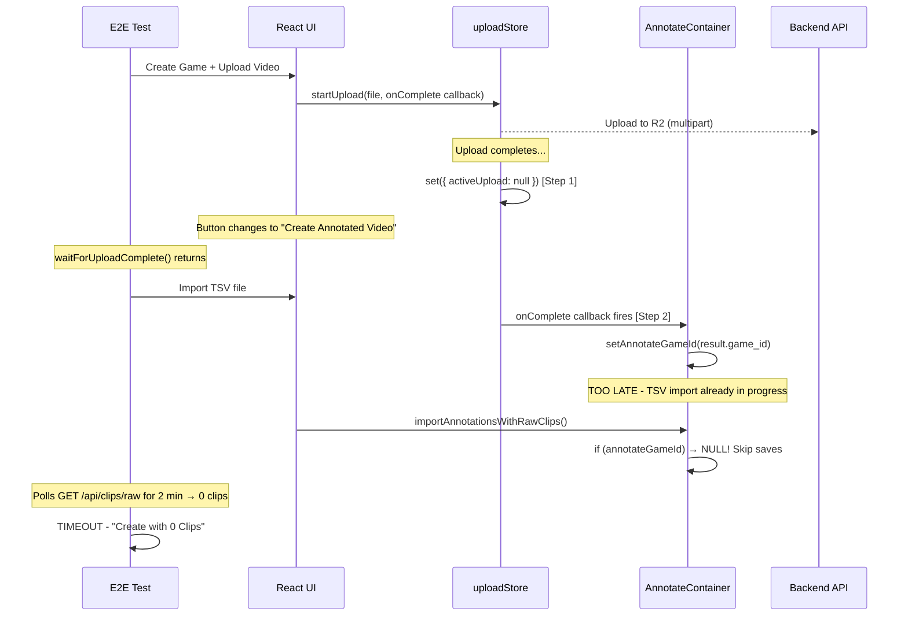
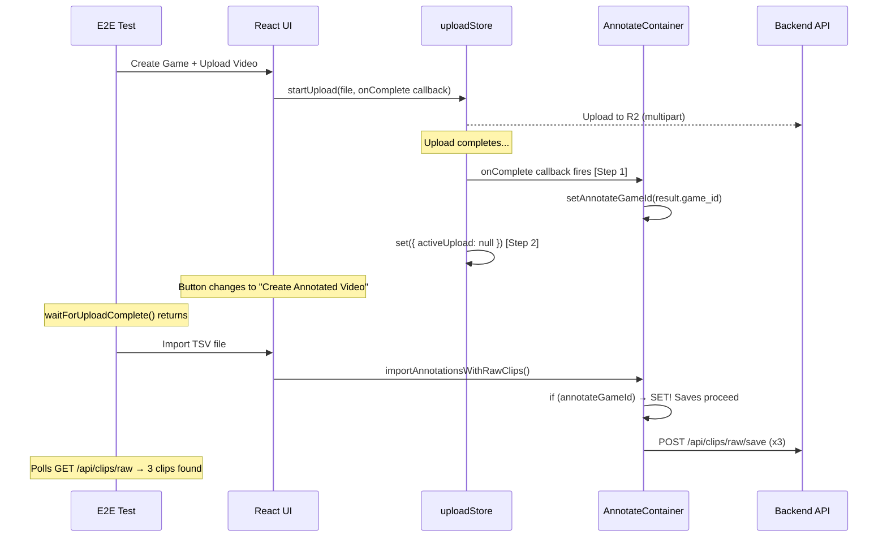

# T247 Design: Fix E2E Clip Extraction Timeout

## Current State



**Problem**: In `uploadStore.js:105`, `set({ activeUpload: null })` fires before the `onComplete` callback at line 108. This makes `isUploading()` return false (button changes) before `setAnnotateGameId()` runs. The E2E test sees the button change, imports TSV, but `annotateGameId` is still null so clips are never saved to the backend.

## Target State



## Implementation Plan

### Change 1: Fix callback ordering in uploadStore.js

**File**: `src/frontend/src/stores/uploadStore.js` (lines 101-113)

```javascript
// BEFORE (broken):
const onUploadComplete = (result) => {
  const callbacks = get().onCompleteCallbacks;
  set({ activeUpload: null, onCompleteCallbacks: [] });  // ← Clears FIRST
  callbacks.forEach(cb => { cb(result); });               // ← Callback SECOND
};

// AFTER (fixed):
const onUploadComplete = (result) => {
  const callbacks = get().onCompleteCallbacks;
  callbacks.forEach(cb => {                                // ← Callback FIRST
    try { cb(result); } catch (e) {
      console.error('[UploadStore] Callback error:', e);
    }
  });
  set({ activeUpload: null, onCompleteCallbacks: [] });    // ← Clears SECOND
};
```

**Why this is safe**: The callbacks set React state (`setAnnotateGameId`), which is synchronous in React 18 when called outside of event handlers. The Zustand `set()` then triggers re-renders with the game ID already in place.

### Change 2: Defense-in-depth in test helper

**File**: `src/frontend/e2e/regression-tests.spec.js` (~line 500)

After `waitForUploadComplete()` returns, add a wait for `annotateGameId` to be set before importing TSV. This protects against any future regressions.

```javascript
// After upload complete, wait for game ID to be set in React state
// (ensures the upload completion callback has fired)
await page.waitForFunction(() => {
  // Check that the game was created by looking for the game ID in the API
  return fetch('/api/games').then(r => r.json()).then(data =>
    data.games && data.games.length > 0
  );
}, { timeout: 10000 });
```

### Change 3: Remove stale poll in ensureAnnotateModeWithClips

**File**: `src/frontend/e2e/regression-tests.spec.js` (lines 512-536)

The 2-minute poll loop that checks `rawClips.length > 0` is unnecessary for the tests that just need clips in annotate mode (the 3 Framing smoke tests). Clips are saved to `raw_clips` asynchronously by the frontend — we don't need to wait for them here. The "Create Project from Clips" modal fetches clips from the API on open, and the clips will be there by then.

However, there IS a legitimate need to ensure clips are saved before creating a project. The fix in Change 1 ensures saves happen immediately after TSV import. We can reduce the poll timeout and add better logging.

## Risks & Open Questions

1. **React 18 batching**: `setAnnotateGameId` called in a Zustand callback should be synchronous, but React 18 may batch it. If so, the game ID might not be in state by the time `importAnnotationsWithRawClips` runs. The defense-in-depth in Change 2 handles this.

2. **Existing upload UX**: Reversing the callback/clear order means `isUploading()` returns true slightly longer (while callbacks run). This is negligible (callbacks are fast state setters) but worth noting.

3. **No backend changes needed**: The backend code is correct — `save_raw_clip` works fine when called. The issue is purely in the frontend callback ordering.
