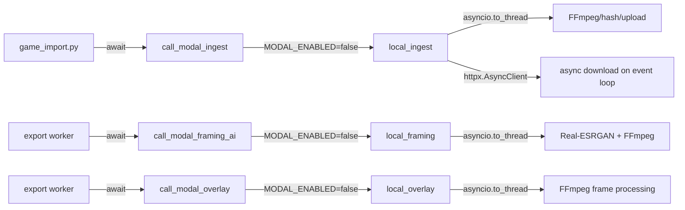
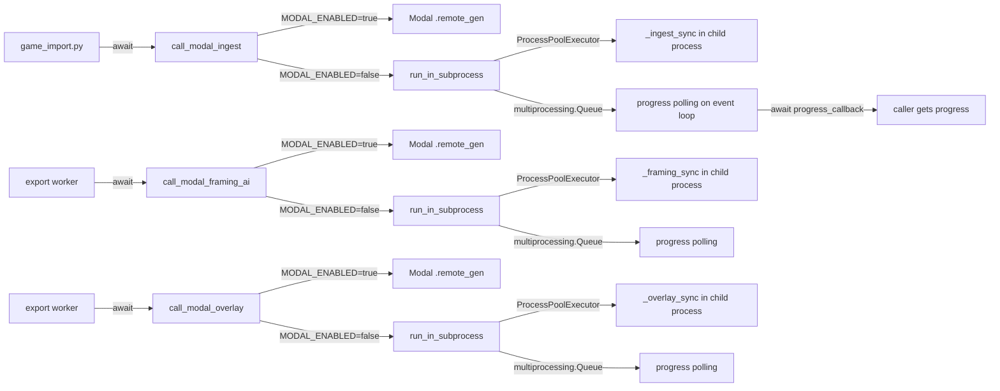

# T2640 Design: Local Processing Subprocess Isolation

**Status:** APPROVED
**Author:** Architect Agent
**Approved:** pending

## Current State ("As Is")

### Data Flow



### Current Behavior

```pseudo
# local_ingest (the worst offender):
async def local_ingest(source_url, source_type, progress_callback):
    if source_type == "direct":
        # PROBLEM: This async download runs on the event loop
        async with httpx.AsyncClient() as client:
            async with client.stream("GET", source_url) as resp:
                async for chunk in resp.aiter_bytes():  # blocks event loop
                    f.write(chunk)
                    hasher.update(chunk)
    
    # These run in thread pool (less bad, but still contend)
    hash = await asyncio.to_thread(_compute_hash)
    parts = await asyncio.to_thread(_upload_parts_parallel)

# local_framing / local_overlay:
async def local_framing(...):
    await asyncio.to_thread(download_from_r2, ...)       # thread
    result = await asyncio.to_thread(upscaler.process, ...) # thread - CPU heavy
    await asyncio.to_thread(upload_to_r2, ...)            # thread

# Progress bridging (thread -> async):
    loop = asyncio.get_running_loop()
    def sync_progress_callback(progress, message):
        asyncio.run_coroutine_threadsafe(
            progress_callback(scaled, message, phase), loop
        )
```

### Limitations

1. **Event loop saturation**: `local_ingest` uses `httpx.AsyncClient` for streaming downloads -- async I/O that monopolizes the event loop during 1.4GB downloads. GET /api/games/imports/{id}/progress took 7s during a Veo import.
2. **Thread pool contention**: `asyncio.to_thread()` uses the default ThreadPoolExecutor. CPU-heavy FFmpeg/Real-ESRGAN work in threads still holds the GIL for Python-level work and competes with the event loop's own thread pool.
3. **No process isolation**: All processing shares the same process as the FastAPI server. Memory pressure from Real-ESRGAN or large file I/O affects API serving.
4. **Divergent progress interfaces**: Local processors use `async progress_callback(pct, msg, phase)` called via `asyncio.run_coroutine_threadsafe()`. Modal uses a generator that yields `{"progress": int, "message": str, "phase": str}` dicts. The dispatch layer has separate code for each.

## Target State ("Should Be")

### Updated Flow



### Target Behavior

```pseudo
# Shared subprocess execution wrapper (in modal_client.py):
async def _run_in_subprocess(sync_fn, kwargs, progress_callback):
    queue = multiprocessing.Queue()
    loop = asyncio.get_running_loop()
    
    # Submit to process pool -- completely off the event loop
    future = loop.run_in_executor(
        _process_pool,
        _subprocess_worker, sync_fn, kwargs, queue
    )
    
    # Poll queue for progress (non-blocking, ~50ms intervals)
    while not future.done():
        try:
            msg = queue.get_nowait()
            if msg["type"] == "result":
                return msg["data"]
            if progress_callback:
                await progress_callback(msg["progress"], msg["message"], msg["phase"])
        except queue.Empty:
            await asyncio.sleep(0.05)
    
    return future.result()

# Subprocess worker (runs in child process):
def _subprocess_worker(sync_fn, kwargs, queue):
    def progress_sink(pct, msg, phase):
        queue.put({"type": "progress", "progress": pct, "message": msg, "phase": phase})
    
    result = sync_fn(**kwargs, progress_callback=progress_sink)
    queue.put({"type": "result", "data": result})
    return result

# Each local processor becomes a sync function:
def _ingest_sync(source_url, source_type, progress_callback):
    # Uses httpx.Client (sync) instead of httpx.AsyncClient
    # All I/O is sync -- runs in its own process
    # progress_callback writes to queue (sync)
    ...

def _framing_sync(job_id, user_id, ..., progress_callback):
    # Downloads from R2 (sync), processes with Real-ESRGAN (sync), uploads (sync)
    # Initializes AIVideoUpscaler inside the subprocess
    ...

def _overlay_sync(job_id, user_id, ..., progress_callback):
    # Downloads from R2 (sync), processes frames with FFmpeg (sync), uploads (sync)
    ...
```

## Implementation Plan ("Will Be")

### Files to Modify

| File | Change |
|------|--------|
| `src/backend/app/services/modal_client.py` | Add `_run_in_subprocess()` wrapper, module-level `ProcessPoolExecutor`, update local fallback paths in `call_modal_ingest`, `call_modal_framing_ai`, `call_modal_overlay` |
| `src/backend/app/services/local_processors.py` | Add sync versions of each processor (`_ingest_sync`, `_framing_sync`, `_overlay_sync`). Keep async wrappers as thin shells calling `_run_in_subprocess`. |
| `src/backend/app/services/game_import.py` | No changes needed -- calls `call_modal_ingest` which handles routing internally |

### Detailed Changes

#### 1. modal_client.py -- Subprocess execution infrastructure

```pseudo
import multiprocessing
from concurrent.futures import ProcessPoolExecutor

# Module-level process pool (1-2 workers, reused across calls)
_process_pool: ProcessPoolExecutor | None = None

def _get_process_pool() -> ProcessPoolExecutor:
    global _process_pool
    if _process_pool is None:
        _process_pool = ProcessPoolExecutor(max_workers=2)
    return _process_pool

def _subprocess_worker(sync_fn, kwargs, queue):
    """Top-level function (picklable) that runs in child process."""
    def progress_sink(pct, msg, phase):
        queue.put_nowait({"type": "progress", "progress": pct, "message": msg, "phase": phase})
    kwargs["progress_callback"] = progress_sink
    try:
        result = sync_fn(**kwargs)
        return result
    except Exception as e:
        return {"status": "error", "error": str(e)}

async def _run_in_subprocess(sync_fn, kwargs, progress_callback=None):
    """Execute sync_fn in a subprocess, bridging progress to async callback."""
    queue = multiprocessing.Queue()
    loop = asyncio.get_running_loop()
    pool = _get_process_pool()
    
    future = loop.run_in_executor(pool, _subprocess_worker, sync_fn, kwargs, queue)
    
    while not future.done():
        # Drain all available progress messages
        while True:
            try:
                msg = queue.get_nowait()
                if progress_callback and msg.get("type") == "progress":
                    await progress_callback(msg["progress"], msg["message"], msg["phase"])
            except queue.Empty:
                break
        await asyncio.sleep(0.05)
    
    # Drain remaining messages after process completes
    while True:
        try:
            msg = queue.get_nowait()
            if progress_callback and msg.get("type") == "progress":
                await progress_callback(msg["progress"], msg["message"], msg["phase"])
        except queue.Empty:
            break
    
    return future.result()
```

#### 2. modal_client.py -- Update dispatch in each `call_modal_*` function

```pseudo
# In call_modal_ingest, replace:
-   from app.services.local_processors import local_ingest
-   return await local_ingest(source_url=..., source_type=..., progress_callback=...)
# With:
+   from app.services.local_processors import _ingest_sync
+   return await _run_in_subprocess(
+       _ingest_sync,
+       {"source_url": source_url, "source_type": source_type},
+       progress_callback=progress_callback,
+   )

# Same pattern for call_modal_framing_ai and call_modal_overlay
```

#### 3. local_processors.py -- Sync versions of each processor

**_ingest_sync**: Convert `local_ingest` to fully sync:
- Replace `httpx.AsyncClient` with `httpx.Client` (sync streaming)
- Replace `await asyncio.to_thread(fn)` with direct `fn()` calls
- Replace `await progress_callback(...)` with `progress_callback(...)` (sync)
- All file I/O, hashing, R2 uploads are already sync under the hood

**_framing_sync**: Convert `local_framing` to fully sync:
- Direct call `download_from_r2()` / `upload_to_r2()` (already sync)
- Direct call `ffmpeg_lib.run()` (already sync)
- Initialize `AIVideoUpscaler` in the subprocess (avoids pickling torch objects)
- Direct call `upscaler.process_video_with_upscale()` (already sync)
- Remove `asyncio.run_coroutine_threadsafe` bridge -- just call `progress_callback()` directly

**_overlay_sync**: Convert `local_overlay` to fully sync:
- Direct call `download_from_r2()` / `upload_to_r2()` (already sync)
- Direct call `_process_frames_to_ffmpeg()` (already sync)
- Remove async progress bridge

**Keep the existing async functions as thin wrappers** for backward compatibility during testing:

```pseudo
async def local_ingest(source_url, source_type, progress_callback=None):
    """Async wrapper -- delegates to subprocess via modal_client."""
    from app.services.modal_client import _run_in_subprocess
    return await _run_in_subprocess(
        _ingest_sync,
        {"source_url": source_url, "source_type": source_type},
        progress_callback=progress_callback,
    )
```

### Key Design Decisions

1. **ProcessPoolExecutor over multiprocessing.Process**: Reuses a pool (avoids per-call process spawn overhead). Pool size of 2 allows concurrent framing + overlay during batch exports.

2. **multiprocessing.Queue for progress IPC**: Simple, well-tested, doesn't require shared memory or pipes. Queue is drained in a non-blocking loop with 50ms sleep intervals -- fast enough for smooth progress bars, light enough to not burden the event loop.

3. **Sync httpx.Client in subprocess**: `local_ingest`'s direct download path currently uses `httpx.AsyncClient`. In the subprocess, there's no event loop, so we switch to `httpx.Client` (sync). This is actually simpler and eliminates the event loop contention that caused the 7s progress endpoint latency.

4. **AIVideoUpscaler initialized in subprocess**: The upscaler has torch/CUDA dependencies that may not pickle cleanly. Initializing it fresh in the subprocess avoids serialization issues. This costs a few seconds of model loading per framing job, but framing jobs themselves take 30-120s so the overhead is negligible.

5. **`_subprocess_worker` as top-level function**: Must be defined at module level (not a closure/lambda) to be picklable for ProcessPoolExecutor.

6. **No changes to Modal path**: The `MODAL_ENABLED=true` code path is untouched. The subprocess wrapper only applies to the local fallback.

## Risks

| Risk | Impact | Mitigation |
|------|--------|------------|
| Pickling failures for function arguments | Subprocess crashes | All args are primitive types (str, int, list, dict). No complex objects passed. Verified by inspecting current signatures. |
| `app.storage` imports fail in subprocess | R2 operations fail | These imports are lazy (inside function bodies) and only depend on environment variables which are inherited by child processes. |
| CUDA/GPU not available in subprocess | `local_framing` fails | AIVideoUpscaler already handles missing GPU gracefully (returns error). On dev machines without GPU, it was already failing the same way. |
| Queue fills up if progress isn't drained | Backpressure / memory | Queue is unbounded but progress messages are tiny (~100 bytes). A 10-minute job at 10 updates/sec = ~6000 messages = ~600KB. Negligible. |
| ProcessPoolExecutor worker crashes | Orphaned resources | `_subprocess_worker` wraps everything in try/except and returns error dict. `concurrent.futures` handles process crashes by raising `BrokenProcessPool`. |
| `local_framing_mock` (test mode) still async | Tests may not exercise subprocess path | Test mode is separate from local fallback. `local_framing_mock` is called directly from `call_modal_framing_ai` when `test_mode=True`, bypassing the subprocess wrapper. This is fine -- test mode is fast and doesn't need isolation. |

## Open Questions

- [ ] **Pool size**: Should we use `max_workers=1` (serialize all local processing) or `max_workers=2` (allow concurrent framing + overlay)? Recommendation: start with 2, since framing and overlay are independent operations.
- [ ] **Subprocess for mock/test mode?**: Currently `local_framing_mock` runs directly on the event loop. Since it's only used in E2E tests and is fast (~2s), subprocess isolation is unnecessary. Confirm this is acceptable.
