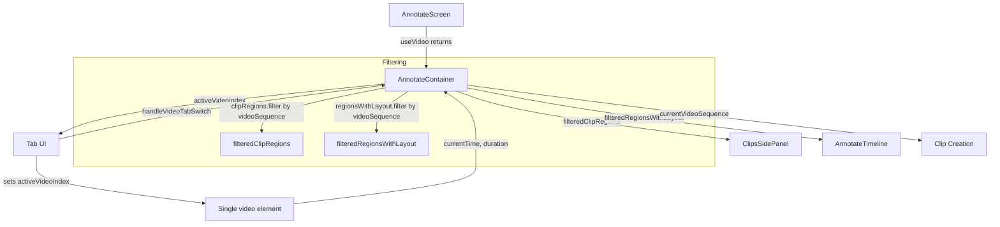
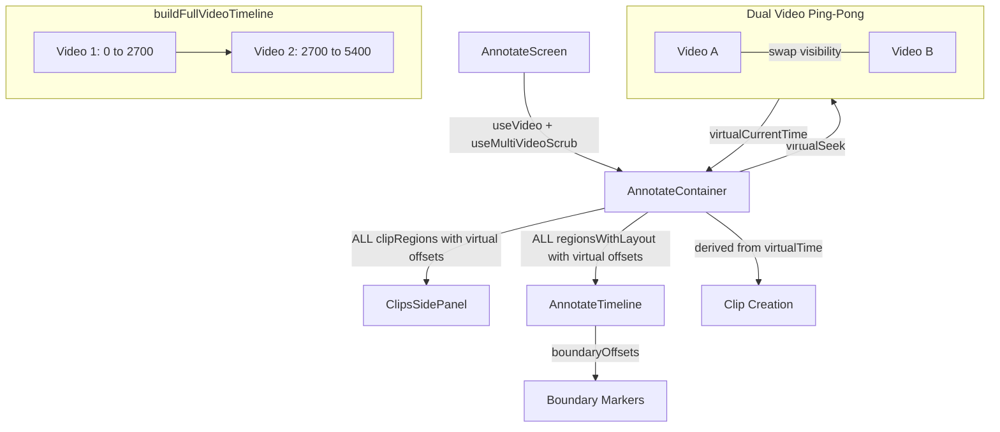

# T2750 Design: Unified Multi-Video Experience

**Status:** DRAFT
**Author:** Architect Agent
**Approved:** pending

## Current State ("As Is")

### Data Flow


### Current Behavior
```pseudo
when user loads multi-video game:
    show "First Half" / "Second Half" tab buttons
    set activeVideoIndex = 0
    filter clips to only show currentVideoSequence
    timeline shows duration of active video only

when user clicks tab:
    handleVideoTabSwitch(index)
        set activeVideoIndex = index
        set video URL to gameVideos[index].url
        update metadata with gameVideos[index].duration
        timeline resets to new video's duration
        clip list re-filters to new video's clips

when user creates clip:
    tag with currentVideoSequence (derived from activeVideoIndex)
    startTime/endTime are relative to current video file

when user scrubs:
    seek within single video element
    no concept of virtual/combined time
```

### Limitations
- User must manually switch between halves via tabs
- Clip list only shows clips for the active half
- No continuous timeline across videos
- Mental burden: user stitches the halves together in their head
- Timeline resets when switching tabs (disorienting)

## Target State ("Should Be")

### Updated Flow


### Target Behavior
```pseudo
when user loads multi-video game:
    NO tab buttons shown
    build fullVideoTimeline from gameVideos
    preload both videos into dual video elements
    timeline shows combined duration (sum of all video durations)
    clip list shows ALL clips with virtual timestamps

when user scrubs:
    virtualSeek(virtualTime)
        resolve (videoIndex, actualTime) from fullTimeline
        if videoIndex changed:
            swap active/inactive video (CSS opacity)
            seek inactive element to actualTime
        else:
            seek active element to actualTime
        report virtualCurrentTime = offset + actualTime

when user creates clip:
    derive videoSequence from current virtualTime position
    convert virtualTime back to actualTime for storage
    clamp to current video boundary (clip cannot span boundary)

when displaying clip times:
    virtualTime = actualTime + videoOffset[clip.videoSequence]
```

## Implementation Plan ("Will Be")

### New: `buildFullVideoTimeline` in useVirtualTimeline.js

Pure function alongside existing `buildVirtualTimeline`. Maps full video durations (not clips) to a virtual timeline.

```pseudo
function buildFullVideoTimeline(gameVideos):
    sort gameVideos by sequence
    offset = 0
    segments = gameVideos.map(video =>
        seg = { videoIndex, videoSequence, virtualStart: offset,
                virtualEnd: offset + video.duration, duration: video.duration }
        offset += video.duration
        return seg
    )

    function virtualToActual(vt):
        clamped = clamp(vt, 0, totalDuration)
        for seg in segments:
            if clamped in [seg.virtualStart, seg.virtualEnd):
                return { videoIndex, videoSequence, actualTime: clamped - seg.virtualStart }
        return last segment end

    function actualToVirtual(videoIndex, actualTime):
        seg = segments[videoIndex]
        return seg.virtualStart + clamp(actualTime, 0, seg.duration)

    function getVideoOffset(videoSequence):
        seg = segments.find(s => s.videoSequence === videoSequence)
        return seg?.virtualStart ?? 0

    return { segments, totalDuration, virtualToActual, actualToVirtual, getVideoOffset }
```

### New: `useMultiVideoScrub.js` hook

Location: `src/frontend/src/modes/annotate/hooks/useMultiVideoScrub.js`

Adapted from `useAnnotationPlayback`'s dual-video ping-pong pattern, but for full-video scrubbing instead of clip-to-clip playback. Manages two `<video>` elements, handles transparent switching, reports virtual time.

```pseudo
function useMultiVideoScrub({ gameVideos, singleVideoRef, singleCurrentTime, singleDuration }):
    if !gameVideos: return null  // no-op for single-video

    videoARef = useRef(null)
    videoBRef = useRef(null)
    activeVideo = useRef('A')  // which is visible
    currentVideoIndex = useRef(0)

    fullTimeline = useMemo(() => buildFullVideoTimeline(gameVideos), [gameVideos])

    // Initialize: load video A with first video, video B with second
    useEffect:
        videoA.src = gameVideos[0].url
        if gameVideos.length > 1:
            videoB.src = gameVideos[1].url

    // RAF-based time reporting (maps actual -> virtual)
    virtualTime state, updated via RAF when playing

    function seek(virtualTime):
        result = fullTimeline.virtualToActual(virtualTime)
        { active, inactive } = getVideos()

        if result.videoIndex !== currentVideoIndex:
            // Need to switch videos
            // Ensure inactive has the target video loaded
            targetUrl = gameVideos[result.videoIndex].url
            if inactive.src !== targetUrl:
                inactive.src = targetUrl
                inactive.load()
            inactive.currentTime = result.actualTime

            // Swap visibility
            swapVideos()
            currentVideoIndex = result.videoIndex

            // Preload adjacent video in now-inactive element
            preloadAdjacent(result.videoIndex)
        else:
            active.currentTime = result.actualTime

        setVirtualTime(virtualTime)

    function play/pause/togglePlay:
        // Same as useAnnotationPlayback but for continuous video
        // At boundary during playback: swap to next video, continue playing

    // Time update loop (RAF)
    function tick():
        active = getActiveVideo()
        actualTime = active.currentTime
        vt = fullTimeline.actualToVirtual(currentVideoIndex, actualTime)
        setVirtualTime(vt)

        // Check if approaching boundary during playback
        seg = fullTimeline.segments[currentVideoIndex]
        if actualTime >= seg.duration - 0.05:
            // Swap to next video
            nextIndex = currentVideoIndex + 1
            if nextIndex < gameVideos.length:
                swapToVideo(nextIndex, 0)

    return {
        videoARef, videoBRef,
        virtualTime,
        totalDuration: fullTimeline.totalDuration,
        seek,
        play, pause, togglePlay,
        isPlaying,
        currentVideoSequence: fullTimeline.segments[currentVideoIndex]?.videoSequence,
        activeVideoLabel: activeVideo.current,
        boundaryOffsets: fullTimeline.segments.slice(1).map(s => s.virtualStart),
        fullTimeline,  // exposed for clip offset computations
    }
```

### Modified: `AnnotateScreen.jsx`

```pseudo
// Always call the hook (no conditional hooks)
const multiVideo = useMultiVideoScrub({
    gameVideos: annotate.gameVideos,
    singleVideoRef: videoRef,
    singleCurrentTime: currentTime,
    singleDuration: duration,
});

// Choose virtual or actual based on multi-video
const effectiveCurrentTime = multiVideo?.virtualTime ?? currentTime;
const effectiveDuration = multiVideo?.totalDuration ?? duration;
const effectiveSeek = multiVideo?.seek ?? seek;
const effectiveTogglePlay = multiVideo?.togglePlay ?? togglePlay;
const effectiveIsPlaying = multiVideo?.isPlaying ?? isPlaying;

// Pass effective values to AnnotateContainer
<AnnotateContainer
    videoRef={multiVideo ? null : videoRef}  // multi-video manages its own refs
    currentTime={effectiveCurrentTime}
    duration={effectiveDuration}
    seek={effectiveSeek}
    togglePlay={effectiveTogglePlay}
    isPlaying={effectiveIsPlaying}
    ...
/>

// REMOVE: Tab UI block (lines 493-519)

// Render dual video elements when multi-video
{multiVideo && (
    <DualVideoPlayer
        videoARef={multiVideo.videoARef}
        videoBRef={multiVideo.videoBRef}
        activeVideoLabel={multiVideo.activeVideoLabel}
    />
)}
```

### Modified: `AnnotateContainer.jsx`

```pseudo
// REMOVE: filteredClipRegions, filteredRegionsWithLayout, filteredGetRegionAtTime
// REMOVE: handleVideoTabSwitch
// REMOVE: activeVideoIndex state (now in useMultiVideoScrub or derived)

// ADD: Derive currentVideoSequence from multiVideo hook or props
// The container receives virtual currentTime/duration/seek from screen

// ADD: getVideoOffset helper (for clip display)
// Uses fullTimeline from multiVideo to offset clip times

// MODIFY: handleFullscreenCreateClip
//   - Derive videoSequence from current virtual time (via fullTimeline.virtualToActual)
//   - Convert virtual startTime back to actual for storage
//   - Clamp clip end at video boundary

// MODIFY: handleAddClipFromButton (same as above)

// MODIFY: getAnnotateRegionAtTime
//   - When multi-video, convert currentTime to actual before matching
//   - OR match against virtual clip times

// REMOVE from return: handleVideoTabSwitch, activeVideoIndex, filteredClipRegions,
//   filteredRegionsWithLayout, isMultiVideo (no longer needed as separate concept)

// ADD to return: fullTimeline (for boundary offsets), getVideoOffset (for display)
```

#### Clip Creation with Boundary Clamping

```pseudo
function handleFullscreenCreateClip(clipData):
    if multiVideoTimeline:
        // Current virtual time tells us which video we're in
        result = fullTimeline.virtualToActual(currentTime)  // currentTime is virtual
        videoSequence = result.videoSequence
        actualStartTime = result.actualTime  // convert clip start to actual

        // Clamp clip end to current video boundary
        seg = fullTimeline.segments.find(s => s.videoSequence === videoSequence)
        maxActualEnd = seg.duration
        actualEndTime = min(actualStartTime + clipData.duration, maxActualEnd)

        addClipRegion(actualStartTime, actualEndTime - actualStartTime, ..., videoSequence)
    else:
        // Single video: unchanged
        addClipRegion(clipData.startTime, clipData.duration, ..., null)
```

#### Virtual Time Display for Clips

```pseudo
// Clips stored: { startTime: 300, endTime: 315, videoSequence: 2 }
// Video 1 duration: 2700
// Display: 3000-3015

// Helper function (pure, used by sidebar and timeline):
function getClipVirtualTimes(clip, fullTimeline):
    if !fullTimeline: return { startTime: clip.startTime, endTime: clip.endTime }
    offset = fullTimeline.getVideoOffset(clip.videoSequence)
    return { startTime: clip.startTime + offset, endTime: clip.endTime + offset }
```

### Modified: `AnnotateTimeline.jsx`

```pseudo
// ADD: boundaryOffsets prop (array of virtual times where videos meet)
// Render a subtle divider line at each boundary offset

// The timeline already accepts `duration` and `currentTime` as props
// These will now be virtual values -- no other changes needed for basic function

// ADD: Boundary markers
{boundaryOffsets?.map(offset => (
    <div
        key={offset}
        style={{ left: `${(offset / duration) * 100}%` }}
        className="absolute top-0 bottom-0 w-px bg-gray-500/30 pointer-events-none z-10"
    />
))}
```

### Modified: `ClipsSidePanel.jsx`

```pseudo
// Currently receives `clipRegions` filtered by video
// Now receives ALL clipRegions (no filtering)

// Clip timestamps displayed using virtual offsets
// The parent (AnnotateContainer/Screen) can either:
//   a) Pre-compute virtual times and pass them down
//   b) Pass getVideoOffset and let sidebar compute

// Option (a) is cleaner: add virtualStartTime/virtualEndTime to clip objects
// before passing to sidebar. The sidebar doesn't need to know about multi-video.

// REMOVE: allClipRegions prop (no longer needed since all clips are shown)
```

### Modified: `AnnotateModeView.jsx`

```pseudo
// For multi-video: render dual video elements instead of single VideoPlayer
// The DualVideoPlayer shows two overlapping <video> elements with opacity swap

// When multiVideo is active:
//   - Don't render standard VideoPlayer
//   - Render DualVideoPlayer with both video refs
//   - Only one is visible at a time

// When single-video:
//   - Render standard VideoPlayer (unchanged)
```

### Files to Modify

| File | Change | LOC |
|------|--------|-----|
| `useVirtualTimeline.js` | Add `buildFullVideoTimeline` function | ~60 |
| **NEW** `useMultiVideoScrub.js` | Dual-video scrub hook | ~200 |
| `AnnotateScreen.jsx` | Remove tabs, integrate multiVideo hook, render dual video | ~80 |
| `AnnotateContainer.jsx` | Remove filtering, add virtual time mapping, update clip creation | ~100 |
| `AnnotateModeView.jsx` | Conditionally render dual or single video player | ~30 |
| `AnnotateTimeline.jsx` | Add boundary marker lines | ~15 |
| `ClipsSidePanel.jsx` | Remove `allClipRegions` usage, show all clips | ~10 |
| `AnnotateMode.jsx` | Pass boundaryOffsets prop through | ~5 |
| **Total** | | ~500 |

## Design Decisions

| Decision | Options Considered | Choice | Rationale |
|----------|-------------------|--------|-----------|
| Virtual timeline approach | Modify useVideo vs. wrapper hook vs. new hook | New `useMultiVideoScrub` hook | `useVideo` is deeply coupled to `useVideoStore`; modifying it has wide blast radius. New hook isolates multi-video concerns. |
| Video element management | Single element + src swap vs. dual ping-pong | Dual ping-pong (like `useAnnotationPlayback`) | Instant visual switch, no loading delay. Proven pattern in this codebase. |
| Where virtual translation happens | View layer vs. container vs. screen | Screen level (`AnnotateScreen`) | Screen owns hooks; container and below receive virtual values transparently. |
| Clip time display | Compute in sidebar vs. pre-compute in container | Pre-compute virtual times in container | Sidebar doesn't need multi-video awareness; cleaner separation. |
| N-video preloading | All N elements vs. current + adjacent | Both loaded for 2; adjacent-only for N>2 | 2 videos is the common case; memory is manageable. Generalize later. |

## Risks

| Risk | Mitigation |
|------|------------|
| Breaking single-video games | All multi-video logic gated on `gameVideos !== null`. `useMultiVideoScrub` returns null when no gameVideos. Single-video path unchanged. |
| Breaking annotation playback | `useAnnotationPlayback` is independent -- it builds its own clip-based virtual timeline. Not modified. |
| Video memory with 2 loaded elements | Same pattern as annotation playback (already ships). Browser buffers only nearby data, not entire files. |
| RAF time update conflicts between useVideo and useMultiVideoScrub | When multi-video active, useVideo's currentTime is not used by downstream. useMultiVideoScrub's RAF loop reports virtual time directly. |
| Clip drag across boundary | Clamp in the drag handler. Same approach as clip creation clamping. |
| Viewed-duration tracking (T251) | Update `getViewedDuration` to track per-video high-water marks using the virtual timeline mapping. Currently keyed by `currentVideoSequence` -- this continues to work. |

## Open Questions

None -- all design decisions resolved in kickoff prompt.
