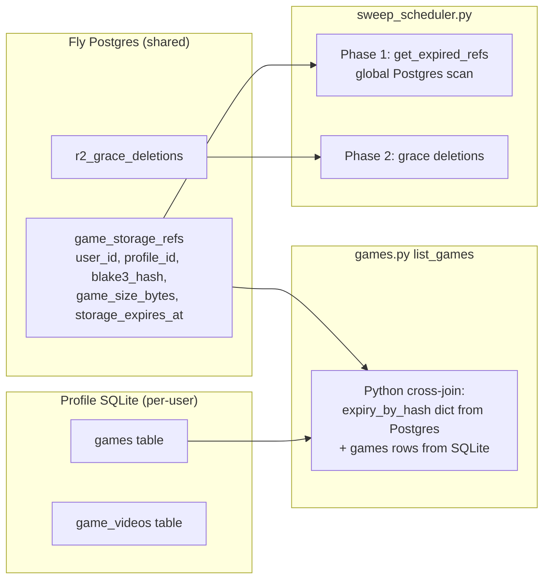
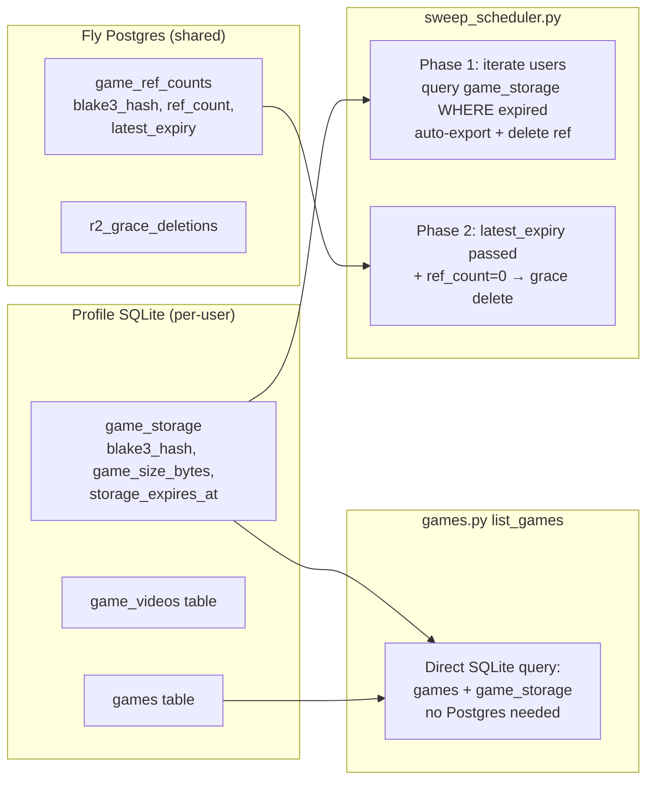

# T2930 Design: Postgres Data Locality Audit

## Current State



**Problem:** `game_storage_refs` stores per-user, per-profile data in Postgres. This violates the architectural rule (per-user data in profile.sqlite) and causes:
1. Cross-DB joins in Python (list_games, extend_storage)
2. Missing from R2 sync (Postgres per-user data doesn't auto-sync)
3. Script friction (debugging requires both systems)

## Target State



**Two expiry concepts:**
- **Per-user expiry** (SQLite `game_storage.storage_expires_at`): when the game expires for THIS user. Triggers auto-export.
- **Game expiry** (Postgres `game_ref_counts.latest_expiry`): the latest of all users' expiries. Tells the sweep when the R2 blob is definitely unreferenced and can be deleted.

## Implementation Plan

### 1. New SQLite table: `game_storage` (profile_db migration v002)

```sql
CREATE TABLE IF NOT EXISTS game_storage (
    id INTEGER PRIMARY KEY AUTOINCREMENT,
    blake3_hash TEXT NOT NULL UNIQUE,
    game_size_bytes INTEGER NOT NULL,
    storage_expires_at TEXT NOT NULL,
    created_at TEXT NOT NULL DEFAULT (datetime('now'))
);
```

No `user_id`/`profile_id` needed -- the database IS the user's profile.

### 2. New Postgres table: `game_ref_counts` (postgres migration v002)

```sql
CREATE TABLE IF NOT EXISTS game_ref_counts (
    blake3_hash TEXT PRIMARY KEY,
    ref_count INTEGER NOT NULL DEFAULT 0,
    latest_expiry TIMESTAMPTZ NOT NULL
);
```

- `ref_count`: how many users reference this hash (increment on new ref, decrement on delete)
- `latest_expiry`: the latest expiry across all users. Updated on insert/extend via `GREATEST`. Never decreased on delete (stale-high is safe -- keeps file longer, never deletes early).

Populated from existing data:
```sql
INSERT INTO game_ref_counts (blake3_hash, ref_count, latest_expiry)
SELECT blake3_hash, COUNT(*), MAX(storage_expires_at)
FROM game_storage_refs
GROUP BY blake3_hash
ON CONFLICT (blake3_hash) DO UPDATE
    SET ref_count = EXCLUDED.ref_count,
        latest_expiry = EXCLUDED.latest_expiry;
```

### 3. Data migration (postgres v002 `up()`)

The Postgres migration (v002) does two things:
1. Creates `game_ref_counts` and populates from `game_storage_refs`
2. Does NOT drop `game_storage_refs` yet (kept as read-only backup until validated)

The profile_db migration (v002) does:
1. Creates `game_storage` table
2. Copies this user's rows from Postgres `game_storage_refs` into it

**Ordering:** `run_all_migrations()` already runs Postgres first, then iterates users. This ensures `game_ref_counts` exists before per-user migrations run.

### 4. Function refactoring (`auth_db.py`)

| Function | Before | After |
|----------|--------|-------|
| `insert_game_storage_ref` | Upsert Postgres | Write SQLite `game_storage` + increment ref_count (new hash only) + update `latest_expiry` via GREATEST |
| `get_game_storage_ref` | Read Postgres | Read SQLite `game_storage` |
| `get_storage_refs_for_user` | Read Postgres | Read SQLite `game_storage` |
| `get_all_ref_hashes` | Read Postgres | Read SQLite `game_storage` |
| `delete_ref` | Delete from Postgres | Delete from SQLite + decrement ref_count (DON'T touch latest_expiry) |
| `has_remaining_refs` | COUNT(*) on Postgres | `SELECT ref_count FROM game_ref_counts` |
| `get_expired_refs` | Global Postgres scan | Iterate all users' profile DBs (via admin pattern) |
| `get_next_expiry` | MIN from Postgres refs + grace | `MIN(latest_expiry) FROM game_ref_counts` + `MIN(grace_expires_at) FROM r2_grace_deletions` (pure Postgres) |

### 5. Sweep scheduler redesign

**Phase 1 (auto-export individual users' expired games):**
- Iterates all users (same pattern as `run_all_migrations` in `__init__.py`):
  1. Get all users from `get_all_users_for_admin()`
  2. For each user, get profile IDs via `_get_profile_ids()`
  3. Download/open profile.sqlite
  4. Query `game_storage WHERE storage_expires_at < datetime('now')`
  5. Auto-export each game, delete from SQLite `game_storage`, decrement `game_ref_counts.ref_count`

**Phase 2 (R2 blob deletion):**
- Query Postgres: `SELECT blake3_hash FROM game_ref_counts WHERE latest_expiry < now() AND ref_count <= 0`
- These are hashes where the game expiry has passed AND no users reference them
- Start grace deletion for each (insert into `r2_grace_deletions`)

**Phase 3 (grace period cleanup) -- unchanged:**
- `get_expired_grace_deletions()` -- delete R2 objects whose grace period elapsed

**`get_next_expiry()` -- stays pure Postgres:**
```python
def get_next_expiry() -> Optional[datetime]:
    with get_pg() as conn:
        cur = conn.cursor()
        # Next game expiry (when some hash becomes deletable)
        cur.execute("SELECT MIN(latest_expiry) FROM game_ref_counts WHERE ref_count > 0")
        ref_row = cur.fetchone()
        # Next grace expiry (when some R2 object gets permanently deleted)
        cur.execute("SELECT MIN(grace_expires_at) FROM r2_grace_deletions")
        grace_row = cur.fetchone()
    candidates = []
    if ref_row and ref_row["min"]:
        candidates.append(ref_row["min"])
    if grace_row and grace_row["min"]:
        candidates.append(grace_row["min"])
    return min(candidates) if candidates else None
```
No user iteration needed -- `latest_expiry` in Postgres gives us exact scheduling.

### 6. games.py simplification

**list_games (lines 740-745):** Remove Postgres calls. Read expiry directly from SQLite:
```python
# Before: 3 Postgres calls
storage_refs = get_storage_refs_for_user(user_id)
grace_hashes = get_grace_deletion_hashes()
all_ref_hashes = get_all_ref_hashes(user_id)

# After: 1 SQLite query (same connection already open)
cursor.execute("SELECT blake3_hash, storage_expires_at FROM game_storage")
expiry_by_hash = {r['blake3_hash']: r['storage_expires_at'] for r in cursor.fetchall()}
# grace_hashes still from Postgres (global data)
grace_hashes = get_grace_deletion_hashes()
```

**extend_storage (line 964):** Read current expiry from SQLite instead of Postgres.

**activate_game (line 693):** Write to SQLite `game_storage` + increment ref count + update `latest_expiry` via GREATEST in Postgres.

### 7. Persistence model skill update

Add section documenting the data locality boundary:
- **Per-user data:** profile.sqlite (games, clips, projects, credits, game_storage)
- **Global/cross-user data:** Postgres (auth, sessions, shares, ref_counts, grace_deletions)
- **Exception:** `credit_summary` in Postgres `users` table is a deprecated cache for admin panel (source of truth is user.sqlite credits table)

---

## Postgres Table Audit

| Table | Per-user? | Cross-user need? | Verdict | Rationale |
|-------|-----------|------------------|---------|-----------|
| `users` | 1 row/user | Login, admin | **STAYS** | Auth is inherently cross-user |
| `sessions` | Yes | Any-machine validation | **STAYS** | Pre-sync accessibility |
| `otp_codes` | Yes | Email verification | **STAYS** | Ephemeral auth |
| `admin_users` | No | Yes | **STAYS** | Global admin list |
| `impersonation_audit` | Yes | Admin audit | **STAYS** | Cross-user admin oversight |
| `game_storage_refs` | **Yes** | R2 sweep | **MOVE** | Per-user expiry to SQLite; ref count stays |
| `r2_grace_deletions` | No | Cleanup sweep | **STAYS** | Global R2 lifecycle |
| `shares` | Yes (sharer) | Token lookup | **STAYS** | Recipients query by token/email |
| `share_videos` | Yes | Share token | **STAYS** | Follows shares |
| `share_games` | Yes | Share token | **STAYS** | Follows shares |
| `pending_teammate_shares` | Yes | Signup flow | **STAYS** | Queryable by email pre-signup |
| `schema_migrations` | No | Yes | **STAYS** | Operational |
| `credit_summary` (in users) | Yes | Admin analytics | **DOCUMENT** | Deprecated cache; source of truth is user.sqlite |

---

## Migration File Structure

```
src/backend/app/migrations/
  postgres/
    v001_baseline.py          (existing)
    v002_game_ref_counts.py   (NEW - create table + populate)
  profile_db/
    v001_baseline.py          (existing)
    v002_game_storage.py      (NEW - create table + copy from Postgres)
```

### v002_game_ref_counts.py (Postgres)

```python
class GameRefCountsMigration(BaseMigration):
    version = 2
    description = "Create game_ref_counts table from game_storage_refs"

    def up(self, conn):
        cur = conn.cursor()
        cur.execute("""
            CREATE TABLE IF NOT EXISTS game_ref_counts (
                blake3_hash TEXT PRIMARY KEY,
                ref_count INTEGER NOT NULL DEFAULT 0,
                latest_expiry TIMESTAMPTZ NOT NULL
            )
        """)
        cur.execute("""
            INSERT INTO game_ref_counts (blake3_hash, ref_count, latest_expiry)
            SELECT blake3_hash, COUNT(*), MAX(storage_expires_at)
            FROM game_storage_refs
            GROUP BY blake3_hash
            ON CONFLICT (blake3_hash) DO UPDATE
                SET ref_count = EXCLUDED.ref_count,
                    latest_expiry = EXCLUDED.latest_expiry
        """)
```

### v002_game_storage.py (profile_db)

```python
class GameStorageMigration(BaseMigration):
    version = 2
    description = "Create game_storage table and populate from Postgres"

    def up(self, conn):
        conn.execute("""
            CREATE TABLE IF NOT EXISTS game_storage (
                id INTEGER PRIMARY KEY AUTOINCREMENT,
                blake3_hash TEXT NOT NULL UNIQUE,
                game_size_bytes INTEGER NOT NULL,
                storage_expires_at TEXT NOT NULL,
                created_at TEXT NOT NULL DEFAULT (datetime('now'))
            )
        """)
        # Copy this user's data from Postgres
        from app.services.pg import get_pg
        from app.user_context import get_current_user_id
        from app.profile_context import get_current_profile_id

        user_id = get_current_user_id()
        profile_id = get_current_profile_id()

        with get_pg() as pg_conn:
            pg_cur = pg_conn.cursor()
            pg_cur.execute(
                """SELECT blake3_hash, game_size_bytes, storage_expires_at, created_at
                   FROM game_storage_refs
                   WHERE user_id = %s AND profile_id = %s""",
                (user_id, profile_id),
            )
            rows = pg_cur.fetchall()

        for row in rows:
            conn.execute(
                """INSERT OR IGNORE INTO game_storage
                   (blake3_hash, game_size_bytes, storage_expires_at, created_at)
                   VALUES (?, ?, ?, ?)""",
                (row['blake3_hash'], row['game_size_bytes'],
                 row['storage_expires_at'].isoformat(), row['created_at'].isoformat()),
            )
```

---

## Ref Count + Latest Expiry Atomicity

### Postgres operations

```sql
-- Increment ref count + update latest_expiry (on new hash for this user)
INSERT INTO game_ref_counts (blake3_hash, ref_count, latest_expiry)
VALUES (%s, 1, %s)
ON CONFLICT (blake3_hash) DO UPDATE
    SET ref_count = game_ref_counts.ref_count + 1,
        latest_expiry = GREATEST(game_ref_counts.latest_expiry, EXCLUDED.latest_expiry);

-- Update latest_expiry only (on extend -- user already has a ref, no new ref count)
UPDATE game_ref_counts
SET latest_expiry = GREATEST(latest_expiry, %s)
WHERE blake3_hash = %s;

-- Decrement ref count (on delete ref -- DON'T touch latest_expiry)
UPDATE game_ref_counts SET ref_count = ref_count - 1 WHERE blake3_hash = %s;
```

**Rule:** Every time a user's expiry is set (insert or extend), also update `latest_expiry` in Postgres via GREATEST. This ensures the game-level expiry is always >= the latest user expiry. On delete, don't recalculate -- stale-high is safe.

### SQLite insert logic

Detect whether this is a new ref (needs ref_count increment) or an update (just expiry change):

```python
cursor.execute(
    "INSERT OR IGNORE INTO game_storage (blake3_hash, game_size_bytes, storage_expires_at) VALUES (?, ?, ?)",
    (blake3_hash, game_size_bytes, storage_expires_at),
)
if cursor.rowcount == 1:
    # New hash for this user -- increment ref count + set latest_expiry
    _increment_ref_count(blake3_hash, storage_expires_at)
else:
    # Existing hash -- just update expiry in SQLite + update latest_expiry in Postgres
    cursor.execute(
        "UPDATE game_storage SET game_size_bytes = ?, storage_expires_at = ? WHERE blake3_hash = ?",
        (game_size_bytes, storage_expires_at, blake3_hash),
    )
    _update_latest_expiry(blake3_hash, storage_expires_at)
```

Both paths update `latest_expiry` via GREATEST -- whether it's a new ref or an extension.

---

## Risks & Open Questions

### Risk 1: `latest_expiry` stale-high after ref deletion
When a user's ref is deleted, we don't recalculate `latest_expiry` (would require iterating all users with that hash). If the deleted user had the latest expiry, the game-level expiry is now stale-high.

**Impact:** The sweep won't start grace deletion until `latest_expiry` passes, even if all remaining users expired earlier. Worst case: R2 keeps the file up to 30 days longer than needed.

**Mitigation:** Safe direction (wastes storage, never loses data). For the current user count this is negligible. If needed later, the sweep can reconcile: when `latest_expiry` passes and ref_count=0, it's always correct. When ref_count>0 at `latest_expiry`, the sweep re-queries remaining users' expiries to set a corrected value.

### Risk 2: Ref count drift
If a decrement fails (network error after SQLite delete), ref count stays too high. Same safe direction -- keeps file longer, never deletes early. Periodic reconciliation can fix drift.

### Risk 3: Migration failure mid-user
If profile_db migration fails for one user, their data stays in Postgres (still readable). The migration is idempotent (`INSERT OR IGNORE`), so re-running fixes it.

### Risk 4: Phase 1 sweep still iterates users
Auto-exporting individual users' expired games still requires iterating users' SQLite DBs (we need to know WHICH user expired to export their games). This is the same pattern as `run_all_migrations` and works fine for current user count (<100).

### Decision: `game_storage_refs` deprecation
Keep the table in Postgres schema but stop writing to it. Add a comment marking it deprecated. Drop in a future migration after confirming all data migrated successfully.

### Decision: Remove deprecated fields in same migration
The Postgres v002 migration also:
1. Drops `credit_summary` column from `users` table (never read by admin panel -- it uses `get_credit_stats_for_admin()` from user.sqlite directly)
2. Drops `watched_at` column from `shares` table (never read or written anywhere)
3. Removes `_update_credit_summary()` function from user_db.py and all call sites
