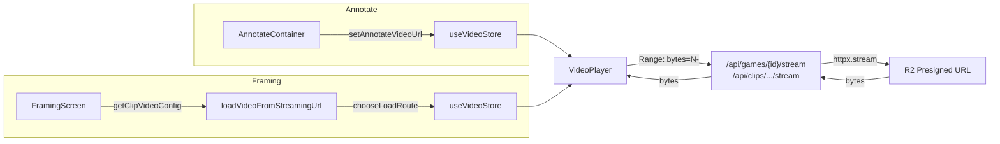
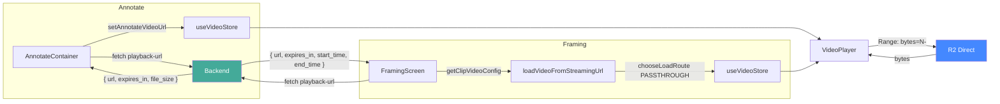

# T3250 Design: Direct R2 Video Streaming

**Status:** APPROVED
**Author:** Architect Agent
**Created:** 2026-06-02
**Approved:** 2026-06-02

## Current State ("As Is")

### Data Flow



### Current Behavior

```
Annotate single-video:
  proxyUrl = /api/games/{gameId}/stream
  setAnnotateVideoUrl(proxyUrl)
  → VideoPlayer <video src={proxyUrl}>
  → browser sends Range requests to Fly.io
  → Fly.io proxies to R2 via httpx.AsyncClient
  → 590 KB/s throughput, 25s stalls on 19MB chunks

Framing clip:
  getClipVideoConfig(clip):
    proxyUrl = /api/clips/projects/{pid}/clips/{id}/stream
    return { url: proxyUrl, gameUrl: clip.game_video_url, clipRange }
  → loadVideoFromStreamingUrl(url, meta, clipRange, { gameUrl })
  → chooseLoadRoute() → always returns PROXY route
  → VideoPlayer <video src={proxyUrl}#t=offset,end>
  → same proxy bottleneck
```

### Problems
1. **Throughput bottleneck**: Fly.io proxies every byte at ~590 KB/s
2. **25.9s receive stalls**: HAR shows 19.5MB chunk takes 26.1s
3. **Dead time**: 8s gaps with zero data transfer
4. **Bounded-range overhead**: ~200 lines of 3-window clamping logic per endpoint, no longer needed (R2 has $0 egress, videos are user-owned)

## Target State ("Should Be")

### Data Flow



### Target Behavior

```
Annotate single-video:
  response = await fetch(/api/games/{gameId}/playback-url)
  if (ok):
    setAnnotateVideoUrl(response.url)
    schedule refresh at 75% TTL
  else:
    console.warn("fallback to proxy")
    setAnnotateVideoUrl(/api/games/{gameId}/stream)
  → VideoPlayer <video src={presignedUrl}>
  → browser sends Range requests DIRECTLY to R2
  → >5 MB/s throughput, <100ms TTFB

Framing clip:
  response = await fetch(/api/clips/projects/{pid}/clips/{id}/playback-url)
  if (ok):
    return { url: response.url, gameUrl: null, clipRange: { response.start_time, ... } }
  else:
    console.warn("fallback to proxy")
    return { url: proxyUrl, gameUrl: null, clipRange }
  → loadVideoFromStreamingUrl(url, meta, clipRange)
  → chooseLoadRoute() → PASSTHROUGH (no gameUrl)
  → VideoPlayer <video src={presignedUrl}#t=offset,end>
  → direct R2, browser handles range requests natively
```

### Key Design Decisions

| Decision | Options | Choice | Rationale |
|----------|---------|--------|-----------|
| Where presigned URL comes from | Reuse `clip.game_video_url` from existing data vs. dedicated playback-url endpoint | Dedicated endpoint | Explicit contract, includes metadata (file_size, expires_in), supports independent refresh |
| Route through `chooseLoadRoute()` | New DIRECT route vs. PASSTHROUGH (set gameUrl=null) | PASSTHROUGH | Minimal change - when presigned URL is the main `url` and `gameUrl` is null, existing PASSTHROUGH logic does the right thing |
| Fallback mechanism | Retry presigned URL vs. fallback to proxy | Fallback to proxy | Proxy still works; different failure mode than retry same URL |
| URL refresh | storageUrls.js cache vs. container-level timer | Container-level timer | Game video playback is container-scoped; storageUrls.js is for storage file listings. Keep concerns separate. |
| Drop bounded-range proxy | Keep bounded + direct vs. direct only | Direct only (proxy as fallback) | R2 $0 egress, user-owned content, browser buffers ~30-60s naturally |

## Implementation Plan

### Backend: Two New Endpoints

**File: `src/backend/app/routers/games.py`**

```python
# Add near line 1310 (after existing game endpoints, before stream endpoint)

@router.get("/{game_id:int}/playback-url")
async def get_game_playback_url(game_id: int):
    """Return presigned R2 URL for direct browser playback."""
    with get_db_connection() as conn:
        cursor = conn.cursor()
        cursor.execute("""
            SELECT
                COALESCE(gv.blake3_hash, g.blake3_hash) AS blake3_hash,
                g.video_filename,
                COALESCE(gv.video_size, g.video_size) AS video_size
            FROM games g
            LEFT JOIN game_videos gv
                ON gv.game_id = g.id AND gv.sequence = 1
            WHERE g.id = ?
        """, (game_id,))
        row = cursor.fetchone()

    if not row:
        raise HTTPException(404, "Game not found")
    if not row['blake3_hash']:
        raise HTTPException(422, "Game video missing blake3 hash")

    url = get_game_video_url(row['blake3_hash'], row['video_filename'])
    if not url:
        raise HTTPException(502, "Failed to generate R2 URL")

    return {
        "url": url,
        "expires_in": 14400,
        "file_size": row['video_size'],
    }
```

**File: `src/backend/app/routers/clips.py`**

```python
# Add near existing clip endpoints, before stream endpoint

@router.get("/projects/{project_id}/clips/{clip_id}/playback-url")
async def get_clip_playback_url(project_id: int, clip_id: int):
    """Return presigned R2 URL + clip timing for direct browser playback."""
    with get_db_connection() as conn:
        cursor = conn.cursor()
        # Same join as stream endpoint
        cursor.execute("""
            SELECT
                rc.start_time, rc.end_time,
                COALESCE(gv.blake3_hash, g.blake3_hash) AS blake3_hash,
                g.video_filename,
                COALESCE(gv.video_size, g.video_size) AS video_size
            FROM working_clips wc
            JOIN raw_clips rc ON wc.raw_clip_id = rc.id
            LEFT JOIN games g ON rc.game_id = g.id
            LEFT JOIN game_videos gv
                ON gv.game_id = rc.game_id
                AND gv.sequence = COALESCE(rc.video_sequence, 1)
            WHERE wc.id = ? AND wc.project_id = ?
        """, (clip_id, project_id))
        row = cursor.fetchone()

    if not row:
        raise HTTPException(404, "Clip not found")
    if not row['blake3_hash']:
        raise HTTPException(422, "Game video missing blake3 hash")

    url = get_game_video_url(row['blake3_hash'], row['video_filename'])
    if not url:
        raise HTTPException(502, "Failed to generate R2 URL")

    return {
        "url": url,
        "expires_in": 14400,
        "file_size": row['video_size'],
        "start_time": row['start_time'],
        "end_time": row['end_time'],
    }
```

### Frontend: AnnotateContainer.jsx

```pseudo
// In loadGameForAnnotation (around line 487-492):

- const proxyBase = `${API_BASE}/api/games/${gameId}/stream`;
- const proxyUrl = pendingClipSeekTime != null
-   ? `${proxyBase}?t=${pendingClipSeekTime}#t=${pendingClipSeekTime}`
-   : proxyBase;
- setAnnotateVideoUrl(proxyUrl);

+ let videoUrl;
+ let playbackTtl = null;
+ try {
+   const res = await fetch(`${API_BASE}/api/games/${gameId}/playback-url`, { credentials: 'include' });
+   if (!res.ok) throw new Error(`${res.status}`);
+   const data = await res.json();
+   videoUrl = data.url;
+   playbackTtl = data.expires_in;
+ } catch (err) {
+   console.warn('[Annotate] Presigned URL fetch failed, falling back to proxy:', err.message);
+   videoUrl = `${API_BASE}/api/games/${gameId}/stream`;
+ }
+ if (pendingClipSeekTime != null) {
+   videoUrl = `${videoUrl}#t=${pendingClipSeekTime}`;
+ }
+ setAnnotateVideoUrl(videoUrl);
+
+ // Schedule presigned URL refresh at 75% TTL
+ if (playbackTtl) {
+   schedulePlaybackUrlRefresh(gameId, playbackTtl);
+ }
```

**URL refresh function (new, in AnnotateContainer):**

```pseudo
// Ref to hold the refresh timer
const playbackUrlRefreshTimerRef = useRef(null);

const schedulePlaybackUrlRefresh = useCallback((gameId, ttlSeconds) => {
  if (playbackUrlRefreshTimerRef.current) {
    clearTimeout(playbackUrlRefreshTimerRef.current);
  }
  const refreshMs = ttlSeconds * 0.75 * 1000;  // 3hr for 4hr TTL
  playbackUrlRefreshTimerRef.current = setTimeout(async () => {
    try {
      const res = await fetch(`${API_BASE}/api/games/${gameId}/playback-url`, { credentials: 'include' });
      if (!res.ok) throw new Error(`${res.status}`);
      const data = await res.json();
      setAnnotateVideoUrl(data.url);
      schedulePlaybackUrlRefresh(gameId, data.expires_in);
    } catch (err) {
      console.warn('[Annotate] Presigned URL refresh failed:', err.message);
    }
  }, refreshMs);
}, [setAnnotateVideoUrl]);

// Cleanup on unmount
useEffect(() => {
  return () => {
    if (playbackUrlRefreshTimerRef.current) {
      clearTimeout(playbackUrlRefreshTimerRef.current);
    }
  };
}, []);
```

### Frontend: FramingScreen.jsx

```pseudo
// In getClipVideoConfig (around line 376-395):
// Make it async, fetch presigned URL with proxy fallback

- const getClipVideoConfig = useCallback((clip) => {
+ const getClipVideoConfig = useCallback(async (clip) => {
    if (clip.game_video_url && clip.start_time != null && clip.end_time != null) {
-     const proxyUrl = `${API_BASE}/api/clips/projects/${projectId}/clips/${clip.id}/stream`;
-     return {
-       url: proxyUrl,
-       gameUrl: clip.game_video_url,
-       clipRange: {
-         clipOffset: clip.start_time,
-         clipDuration: clip.end_time - clip.start_time,
-       },
-     };
+     try {
+       const res = await fetch(
+         `${API_BASE}/api/clips/projects/${projectId}/clips/${clip.id}/playback-url`,
+         { credentials: 'include' }
+       );
+       if (!res.ok) throw new Error(`${res.status}`);
+       const data = await res.json();
+       return {
+         url: data.url,
+         gameUrl: null,  // direct load, no routing needed
+         clipRange: {
+           clipOffset: data.start_time,
+           clipDuration: data.end_time - data.start_time,
+         },
+       };
+     } catch (err) {
+       console.warn('[Framing] Presigned URL fetch failed, falling back to proxy:', err.message);
+       const proxyUrl = `${API_BASE}/api/clips/projects/${projectId}/clips/${clip.id}/stream`;
+       return {
+         url: proxyUrl,
+         gameUrl: null,  // proxy fallback also uses PASSTHROUGH
+         clipRange: {
+           clipOffset: clip.start_time,
+           clipDuration: clip.end_time - clip.start_time,
+         },
+       };
+     }
    }
    // Uploaded/extracted clip: unchanged
    const url = getClipFileUrlSelector(clip, projectId);
    return { url, gameUrl: null, clipRange: null };
  }, [projectId]);
```

### Frontend: Video Error Retry (AnnotateContainer + FramingScreen)

When `<video>` fires `onerror` and current src is a presigned URL (not proxy), attempt one automatic recovery:

```pseudo
// In container video error handler:

onVideoError = (event) => {
  if (hasRetriedPresignedRef.current) return;  // already retried once
  if (!isPresignedUrl(videoUrl)) return;       // only retry presigned URLs

  hasRetriedPresignedRef.current = true;
  try {
    const data = await fetch(playbackUrlEndpoint, { credentials: 'include' });
    const { url: freshUrl } = await data.json();
    setVideoUrl(freshUrl);
    // video element will reload; seek to currentTime on loadedmetadata
  } catch {
    // Fresh URL fetch also failed -- show error to user
    // (proxy fallback not attempted here since the original pre-load
    //  try/catch already chose presigned over proxy successfully;
    //  if R2 is down, proxy also fails)
  }
};

// Reset retry flag when loading a new video (new clip, new game)
hasRetriedPresignedRef.current = false;
```

### Frontend: videoLoadRoute.js (minimal change)

No structural changes needed. When `gameUrl` is null, `chooseLoadRoute()` already returns `PASSTHROUGH` which uses `url` directly. This works for both presigned URLs and proxy fallback URLs.

The only change: update the module comment to reflect that PROXY is no longer the default route (it's now fallback-only).

### Files Changed Summary

| File | Change | LOC |
|------|--------|-----|
| `src/backend/app/routers/games.py` | Add `GET /{game_id}/playback-url` endpoint | ~30 |
| `src/backend/app/routers/clips.py` | Add `GET /projects/{pid}/clips/{id}/playback-url` endpoint | ~35 |
| `src/frontend/src/containers/AnnotateContainer.jsx` | Fetch presigned URL, fallback to proxy, refresh timer, error retry | ~55 |
| `src/frontend/src/screens/FramingScreen.jsx` | Make `getClipVideoConfig` async, fetch presigned URL, error retry | ~40 |
| `src/frontend/src/utils/videoLoadRoute.js` | Update comment (PROXY is now fallback-only) | ~5 |
| **Total** | | **~165** |

## What Does NOT Change

1. **VideoPlayer.jsx** -- receives a URL string, doesn't care if it's presigned or proxy
2. **useVideo.js** -- `loadVideoFromStreamingUrl()` works unchanged; `chooseLoadRoute()` PASSTHROUGH handles direct URLs
3. **Existing stream endpoints** -- remain as-is for fallback
4. **Multi-video (Annotate)** -- already uses presigned URLs from `gameData.videos[].video_url`; unchanged
5. **Overlay step** -- uses `working_video_url` from project store; unrelated to game video streaming

## Failure Handling

### Pre-load failures (playback-url fetch fails)

Handled by try/catch in container code. Falls back to proxy URL. Already in the implementation plan above.

### Post-load failures (video element errors on presigned URL)

**Pattern: re-fetch and retry once, then surface to user.**

On `<video>` `onerror` when src is a presigned URL:
1. Fetch fresh playback-url endpoint
2. If fetch succeeds: swap `video.src`, seek to `currentTime` (fixes expired URL)
3. If fetch fails OR video errors again after swap: show error with retry button
4. Max 1 automatic retry to avoid loops

This single code path covers both expired URLs (fresh URL fixes it) and R2 outages (fresh URL doesn't help, detected on second error). ~15 LOC in the container error handler.

### Full Failure Matrix

| # | Failure | Likelihood | Handling | In T3250? |
|---|---------|------------|----------|-----------|
| 1 | Presigned URL expired | Medium | Auto-retry: fetch fresh playback-url, swap src, seek to currentTime. Max 1 retry. | Yes |
| 2 | R2 outage / 500 | Very low | Same auto-retry path as #1. Fresh URL won't help; second error surfaces error + retry button. | Yes (same code) |
| 3 | Network interruption | Low-medium | Existing stall watchdog (10s timeout in useVideo.js). Works unchanged. | No change needed |
| 4 | R2 rate limiting | Extremely low | Warmup pauses via FOREGROUND_DIRECT. Stall watchdog covers edge case. | No |
| 5 | Non-faststart file | Near zero | Accept risk. Stall watchdog triggers after 10s. T2580 validates at upload time. | No (T2580) |
| 6 | R2 range bug (off-by-64KB) | ~0.1-0.5% | Accept risk, monitor video error rates. Unactionable client-side. | No |
| 7 | CORS rejection | Near zero | N/A. `<video>` without `crossorigin` is CORS-exempt. | No |
| 8 | HTTP/1.1 connection exhaustion | Low | Warmup pause + stall watchdog. T2550 CDN resolves with HTTP/2. | No |
| 9 | Backend playback-url fails | Low | try/catch -> proxy fallback + console.warn | Yes |
| 10 | video_size/blake3_hash null | Very low | Backend returns 422 -> same as #9 | Yes |

## Resolved Questions

- **Faststart detection**: Skipped for T3250. Trust T1450 migration. Created T2580 (Faststart Upload Validation) in R2 CDN epic to validate at upload time and prevent regression.
- **Video error fallback**: Implemented as "re-fetch and retry once" pattern (see above). Covers expired URLs and R2 outages with one code path.
