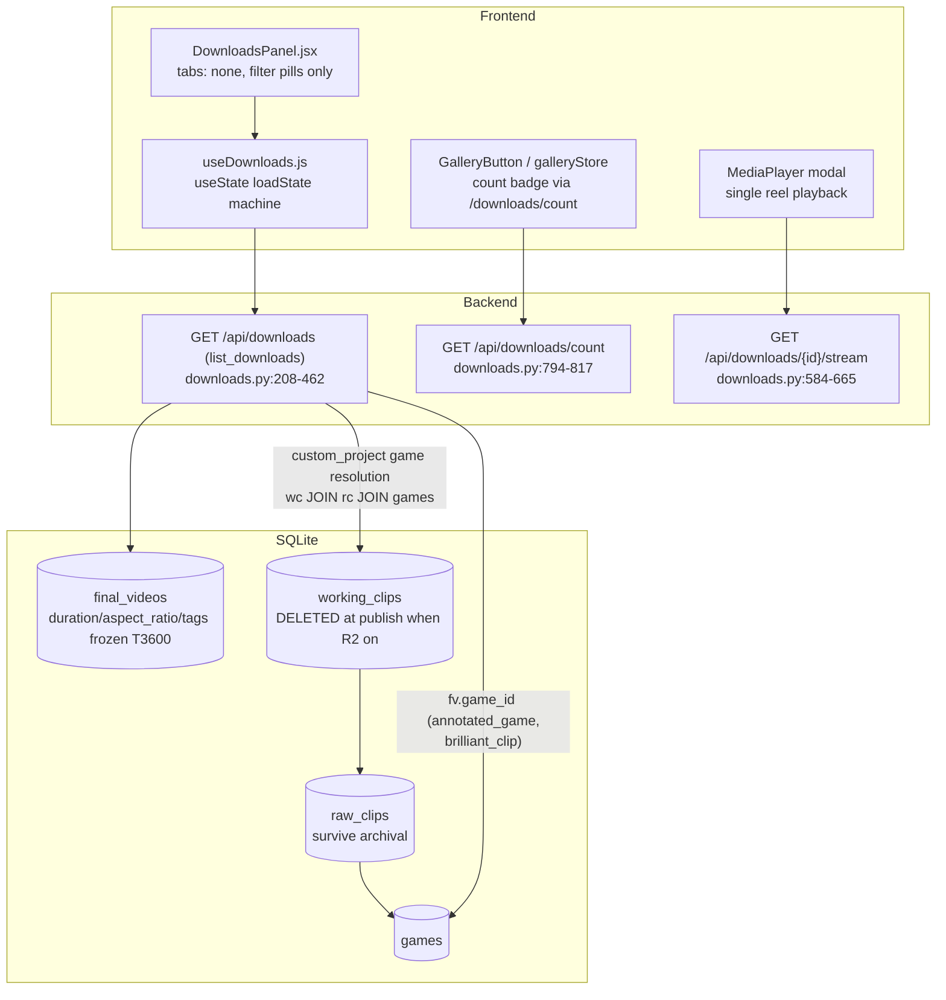
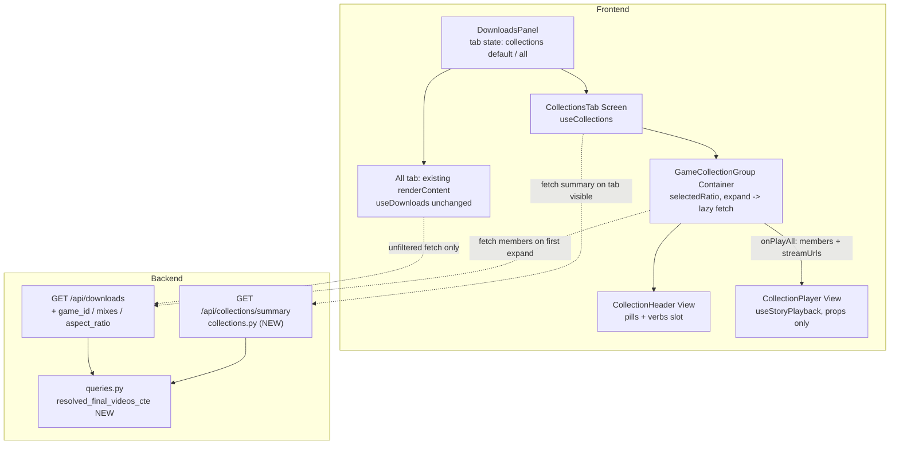

# T3610 Design: Collections Tab + Game Collections in My Reels

**Status:** AWAITING APPROVAL
**Task:** [T3610](tasks/season-highlights/T3610-collections-tab-game-collections.md) | **Epic:** [Season Highlights & Collections](tasks/season-highlights/EPIC.md)

## 1. Current State Analysis

### 1.1 Data flow today



### 1.2 Load-bearing fact (verified in source, twice)

**Published custom-project reels usually CANNOT resolve their games.** Verified chain:

- `downloads.py:749-791` (`publish_to_my_reels`) calls `archive_project` after setting `published_at`.
- `project_archive.py:122-124`: `archive_project` **deletes all `working_clips` and `working_videos`** for the project when R2 is enabled (i.e., always in production). `raw_clips` and `games` survive. (Matches EPIC decision #4: "publish archives + deletes working data".)
- `downloads.py:305-344`: `list_downloads` resolves custom-project games via `working_clips wc JOIN raw_clips rc JOIN games g WHERE wc.project_id IN (...)`. For archived (published) projects this join yields **nothing** → `game_ids = []` → `group_key` falls back to "Month Year" (`downloads.py:406-414`).
- T3600/v007 froze `duration`, `aspect_ratio`, `tags` onto `final_videos` precisely because of this archival deletion — but it did **not** freeze game ids. There is no frozen game data for custom projects on `final_videos`.

**Consequence:** the summary endpoint must mirror this exact resolution so summary counts always equal what `list_downloads` would attribute — meaning archived single-game custom reels go to the **Mixes & compilations** bucket (game-less), consistent with the All tab's existing fallback grouping. The proper fix (freeze `game_ids` at export-finalize like T3600, plus an archive-reading backfill) is out of T3610's scope (read-only task, no schema change) and is raised in Open Question 1.

Resolution rules in `list_downloads` (`downloads.py:380-404`), which the summary mirrors exactly:

| Row shape | Resolution |
|---|---|
| `source_type='annotated_game'`, `fv.game_id` set, game row exists | that game |
| `source_type='brilliant_clip'`, `fv.game_id` set, game row exists | that game |
| `fv.game_id` set but game row deleted | **no game** (elif chain does not fall through to project resolution) |
| `fv.game_id` NULL, `project_id` set | DISTINCT games via working_clips→raw_clips→games (all versions, INNER JOIN games) |

### 1.3 Smells / constraints observed

1. **Client-side aggregate temptation**: `DownloadsPanel` already reduces over `downloads[]` for unwatched counts (lines 70-76, 256-259). EPIC #13 hard rule forbids extending this pattern for Collections — aggregates must come from the new summary endpoint.
2. **`useEffect` store sync** (`DownloadsPanel.jsx:70-76`): writes `count`/`unwatchedCount` to `galleryStore` reactively on `loadState === 'ready'`. Memory-only store sync of server-derived data (not persistence), so it does not violate the gesture-persistence rule — but it silently depends on the full-list fetch happening. With Collections as the default tab the full list is no longer fetched on open. Handled in §3.7 / Decision 7.
3. **`CollapsibleGroup` is uncontrolled with no expand notification** (`CollapsibleGroup.jsx:29-34`): lazy member fetch needs an `onToggle` hook point.
4. **Recap playback hooks are not reusable as-is**: `useHighlightsPlayback.js:17` uses `clip.duration || 0` (silent fallback — breaks the no-silent-fallback rule for NULL frozen durations) and builds a virtual-time segment model for scrubbing we don't need.
5. **`groupByGame` sorts groups alphabetically** (`DownloadsPanel.jsx:537`) — Collections requires newest-first; do not reuse.
6. **Panel width**: `w-full max-w-md` (`DownloadsPanel.jsx:626`) is already effectively full-width below 448px; the 360px risk is inner row overflow, not panel width.
7. **T3600 shim** (`database.py:684-693`): ALTER-column shim slated for removal in a separate pre-step commit (keep the `idx_final_videos_published_ratio` index at 695-698).

### 1.4 Current grouping pseudo (All tab — stays unchanged)

```
useDownloads.groupedDownloads():
  partition downloads by created_at into today/yesterday/lastWeek/older
DownloadsPanel.renderGroup(title, items):
  groupByGame(items) by item.group_key  -> CollapsibleGroup per key
  defaultExpanded = group contains latestDownloadId
```

## 2. Target Architecture

### 2.1 Principles

- **Summary-first (EPIC #13)**: ONE summary endpoint computed in one DB pass; response O(games). The client never reduces over `downloads[]` to compute aggregates for Collections.
- **Single resolution truth**: the per-reel game-resolution SQL lives in one helper (`queries.py`) consumed by both `/api/collections/summary` and the new `game_id`/`mixes` filters on `/api/downloads` — expand results can never disagree with summary counts.
- **No silent fallbacks**: NULL durations excluded from sums and surfaced via `has_null_durations`; NULL `aspect_ratio` reported under an explicit `unknown` bucket, never coerced.
- **MVC**: `CollectionsTab` (Screen, guards readiness) → `GameCollectionGroup` (Container, ratio/expand/play state) → `CollectionHeader`/`CollectionPlayer` (Views, assume data).
- **Presentational player**: `CollectionPlayer` takes ordered reel descriptors + callbacks only; T3620's public viewer feeds it presigned URLs.
- **Transient UI state**: active tab, per-group ratio, expansion = component `useState`. Nothing persisted, no new Zustand state.

### 2.2 Target data flow



### 2.3 Summary endpoint pseudo (one DB pass)

```sql
-- helper: queries.resolved_final_videos_cte() returns this WITH body
WITH project_games AS (
    -- mirrors downloads.py:309-324 exactly: all working_clips versions,
    -- DISTINCT games, INNER JOIN games (deleted games drop out)
    SELECT wc.project_id,
           COUNT(DISTINCT rc.game_id) AS game_count,
           MIN(rc.game_id)            AS single_game_id
    FROM working_clips wc
    JOIN raw_clips rc ON wc.raw_clip_id = rc.id
    JOIN games g2     ON g2.id = rc.game_id
    GROUP BY wc.project_id
),
resolved AS (
    SELECT fv.id, fv.duration, fv.aspect_ratio, fv.tags,
           fv.created_at, fv.published_at, fv.watched_at,
           CASE
             WHEN fv.game_id IS NOT NULL THEN g.id          -- NULL if game deleted (mirrors elif chain: no fall-through)
             WHEN pg.game_count = 1     THEN pg.single_game_id
             ELSE NULL                                       -- multi-game or unresolvable -> mixes
           END AS resolved_game_id
    FROM final_videos fv
    LEFT JOIN games g          ON g.id = fv.game_id
    LEFT JOIN project_games pg ON pg.project_id = fv.project_id
                               AND fv.game_id IS NULL
    WHERE fv.id IN ({latest_final_videos_subquery()})        -- queries.py:104-131
      AND fv.published_at IS NOT NULL                        -- mirrors list_downloads WHERE exactly
)
SELECT r.*,
       rg.game_date, rg.opponent_name, rg.game_type,
       rg.tournament_name, rg.name AS game_raw_name
FROM resolved r
LEFT JOIN games rg ON rg.id = r.resolved_game_id
ORDER BY r.published_at DESC
```

```python
# collections.py — single Python pass over the (O(reels), <= ~500) result set
for row in rows:
    bucket = games[row.resolved_game_id] if row.resolved_game_id else mixes
    ratio = row.aspect_ratio or RATIO_UNKNOWN           # explicit 'unknown' bucket, never coerced
    bucket.reel_count += 1
    bucket.ratio_counts[ratio] += 1
    if row.duration is None: bucket.has_null_durations = True
    else:
        bucket.total_duration += row.duration
        bucket.ratio_durations[ratio] += row.duration
    bucket.latest_published_at = max(...)
    # season totals (T3640 shape): key = f"{_get_season_for_month(m)} {year}"
    #   from game_date when resolved, else created_at
    season_totals[(season_key, ratio)] += duration/count (NULLs excluded, flagged)
    # tag totals (T3670 shape): tags = decode_data(row.tags) or []  (NULL = no tags)
    for tag in tags: tag_totals[(tag, ratio)] += duration/count
# game display names: _generate_game_display_name(opponent, date, type, tournament, fallback)
# response: games sorted by latest_published_at DESC, mixes bucket, season_totals, tag_totals
```

Why the GROUP BY is in Python, not SQL: `tags` is a msgpack BLOB (`utils/encoding.decode_data`) — per-tag sums are impossible in SQLite GROUP BY. One SQL pass returning resolved per-reel rows + one linear Python pass keeps "one query, no N+1", and at the design scale (≤500 rows) is microseconds. Response stays O(games). This is the only deviation from the spec's literal "ONE SQL GROUP BY" wording and it is forced by the tags requirement (Decision 3).

### 2.4 Response contract (consumed by T3620/T3640/T3670/T3680)

```jsonc
GET /api/collections/summary
{
  "games": [
    {
      "game_id": 12,
      "game_name": "Vs Carlsbad Dec 6",        // server-side via _generate_game_display_name
      "game_date": "2025-12-06",
      "reel_count": 7,
      "ratio_counts":    { "9:16": 5, "16:9": 2 },          // 'unknown' key only when present
      "ratio_durations": { "9:16": 312.5, "16:9": 88.0 },   // NULL-excluded sums (header needs ratio-scoped duration without client math)
      "total_duration": 400.5,                              // NULL-excluded
      "has_null_durations": false,
      "latest_published_at": "2026-06-10T18:22:01Z"
    }
  ],                                            // sorted latest_published_at DESC
  "mixes": { /* same shape minus game_* fields; always present, may be reel_count: 0 */ },
  "season_totals": [
    { "season": "Fall 2025", "ratio": "9:16", "reel_count": 12,
      "total_duration": 700.0, "has_null_durations": true }
  ],
  "tag_totals": [
    { "tag": "Goal", "ratio": "9:16", "reel_count": 9, "total_duration": 520.0 }
  ],
  "total_reel_count": 23                        // equals list_downloads total_count by construction
}
```

```
GET /api/downloads?game_id=12            -> members of game 12 (resolved via same CTE)
GET /api/downloads?mixes=true            -> resolved_game_id IS NULL members
GET /api/downloads?game_id=12&aspect_ratio=9:16   -> ratio-scoped (param exists per spec;
                                                     Collections UI filters ratio client-side)
GET /api/downloads                        -> unchanged (All tab, its ONLY consumer)
```

### 2.5 Frontend component pseudo

```
DownloadsPanel (existing file, gains tab bar)
  [activeTab, setActiveTab] = useState(TAB.COLLECTIONS)
  header -> TabBar(Collections | All)   // 44px targets
  activeTab === ALL         -> existing pills + renderContent() (unchanged)
  activeTab === COLLECTIONS -> <CollectionsTab onPlayMembers={...} shared verbs/cards via renderDownloadCard />

CollectionsTab (Screen)
  { summary, summaryState, members, fetchMembers } = useCollections(isOpen && activeTab===COLLECTIONS)
  if loading -> spinner; if error -> retry; if empty -> empty state
  [player, setPlayer] = useState(null)   // { reels, title, initialIndex }
  render summary.games.map((g, i) =>
    <GameCollectionGroup collection={g} groupKey={`game:${g.game_id}`}
        defaultExpanded={i === 0} members={members[`game:${g.game_id}`]}
        onExpand={() => fetchMembers({game_id: g.game_id})}
        onPlayAll={(reels) => setPlayer({reels, title: g.game_name})} />)
  + <GameCollectionGroup collection={summary.mixes} groupKey="mixes" .../>  // bottom
  + player && <CollectionPlayer {...player} onClose={() => setPlayer(null)} />

GameCollectionGroup (Container)
  [selectedRatio, setSelectedRatio] = useState(dominantRatio(collection.ratio_counts))
  <CollapsibleGroup defaultExpanded={defaultExpanded} onToggle={(open)=> open && onExpand()}>
    <CollectionHeader ...collection selectedRatio onSelectRatio onPlayAll actions={null} />
    members ? cards.filter(ratio).map(renderCard) : <MemberSkeleton/>
```

## 3. Refactoring Plan (file-by-file)

### 3.0 Pre-step (separate commit, before feature work)

**`src/backend/app/database.py`** — remove the T3600 ALTER shim block (lines ~684-693), keep `CREATE INDEX idx_final_videos_published_ratio` (~695-698). v007 remains canonical.

### 3.1 `src/backend/app/queries.py` (modify)

Add the shared resolution helper next to `latest_final_videos_subquery`:

```python
def resolved_final_videos_cte() -> str:
    """WITH-body resolving each published latest-version final_video to a
    single game_id or NULL (mixes). Mirrors list_downloads' resolution
    (downloads.py game-info chain) exactly:
    - fv.game_id set -> that game iff the games row exists (no fall-through)
    - else project working_clips -> raw_clips -> games; exactly 1 distinct
      game -> that game; 0 (archived working data) or >1 -> NULL
    Used by GET /api/collections/summary and the game_id/mixes filters on
    GET /api/downloads so expand results always match summary counts."""
```

### 3.2 `src/backend/app/routers/collections.py` (NEW)

```python
router = APIRouter(prefix="/api/collections", tags=["collections"])
RATIO_UNKNOWN = "unknown"   # explicit bucket for NULL aspect_ratio (legacy annotated_game)

class RatioBucketed(BaseModel):
    reel_count: int
    ratio_counts: dict[str, int]
    ratio_durations: dict[str, float]
    total_duration: float
    has_null_durations: bool
    latest_published_at: Optional[str]

class GameCollection(RatioBucketed):
    game_id: int
    game_name: str
    game_date: Optional[str]

class SeasonTotal(BaseModel):  # T3640 shape
    season: str; ratio: str; reel_count: int
    total_duration: float; has_null_durations: bool

class TagTotal(BaseModel):     # T3670 shape
    tag: str; ratio: str; reel_count: int; total_duration: float

class CollectionsSummaryResponse(BaseModel):
    games: List[GameCollection]; mixes: RatioBucketed
    season_totals: List[SeasonTotal]; tag_totals: List[TagTotal]
    total_reel_count: int

@router.get("/summary", response_model=CollectionsSummaryResponse)
async def collections_summary():
    # ONE cursor.execute of the §2.3 query, then the §2.3 Python pass.
    # Display names + seasons via downloads helpers:
    from app.routers.downloads import _generate_game_display_name, _get_season_for_month
    # created_at normalized to '...Z' same as downloads.py:432-435
```

(Importing router-level helpers from `downloads.py` follows existing precedent — `downloads.py:781` imports from `app.routers.auth`. See Decision 2.)

### 3.3 `src/backend/app/routers/downloads.py` (modify)

`list_downloads` signature becomes:

```python
async def list_downloads(source_type: Optional[str] = None,
                         game_id: Optional[int] = None,
                         aspect_ratio: Optional[str] = None,
                         mixes: bool = False):
    # game_id and mixes are mutually exclusive (400 if both)
    # When either is set, wrap with the shared CTE:
    #   WITH {resolved_final_videos_cte()}
    #   ... existing SELECT ... WHERE fv.id IN (
    #       SELECT id FROM resolved WHERE resolved_game_id = ?      -- game_id
    #       / SELECT id FROM resolved WHERE resolved_game_id IS NULL -- mixes
    #   )
    # aspect_ratio: AND fv.aspect_ratio = ?   (uses idx_final_videos_published_ratio)
    # Everything else (batch game lookups, response model, ordering) unchanged.
```

Existing unfiltered call path is untouched; the All tab remains its only unfiltered consumer.

### 3.4 `src/backend/app/main.py` (modify)

`app.include_router(collections_router)` next to `downloads_router` (line ~146), import alongside the others.

### 3.5 `src/frontend/src/hooks/useCollections.js` (NEW — Decision 4)

```javascript
export function useCollections(isActive) {
  const [summary, setSummary] = useState(null);
  const [summaryState, setSummaryState] = useState('idle'); // idle|loading|ready|error
  const [members, setMembers] = useState({});        // { 'game:12': DownloadItem[], 'mixes': [...] }
  const [memberStates, setMemberStates] = useState({}); // per-key idle|loading|ready|error
  // AbortController per concern, profile-switch reset (same pattern as useDownloads.js:280-290)

  fetchSummary()  // GET /api/collections/summary; runs when isActive becomes true (tab visible gesture)
  fetchMembers({ gameId, mixes })  // GET /api/downloads?game_id=N | ?mixes=true
    // no-op if memberStates[key] is 'loading' or 'ready'  -> lazy, fetch-once cache
    // NO aspect_ratio param: ratio pills filter the cached cards client-side (Decision 4)
  return { summary, summaryState, members, memberStates, fetchSummary, fetchMembers };
}
```

State is `useState`, mirroring `useDownloads` (panel-scoped, cleared on profile switch — same accepted pattern, see Decision 7).

### 3.6 `src/frontend/src/components/shared/CollapsibleGroup.jsx` (modify — Decision 6)

Add optional `onToggle` while staying uncontrolled (smallest change, no parallel component):

```jsx
export function CollapsibleGroup({ ..., onToggle }) {
  <button onClick={() => {
    const next = !isExpanded;
    setIsExpanded(next);
    onToggle?.(next);          // notification only; existing consumers unaffected
  }} className="... min-h-11"  // bump header to 44px touch target
```

Note: the `defaultExpanded` sync effect (lines 32-34) will re-expand the first group if summary refetches — acceptable (matches current All-tab behavior). `GameCollectionGroup` must also trigger the initial member fetch for the `defaultExpanded` group on mount (an `onToggle` never fires for the initial state): one `useEffect(() => { if (defaultExpanded) onExpand(); }, [])` — a fetch trigger, not persistence.

### 3.7 `src/frontend/src/components/DownloadsPanel.jsx` (modify)

- Add `const TABS = { COLLECTIONS: 'collections', ALL: 'all' }` (typed constants rule) and `const [activeTab, setActiveTab] = useState(TABS.COLLECTIONS)` — transient, resets every mount (Decision 7).
- Tab bar between header and content: two 44px-min buttons, REEL accent active state; source-type filter pill row (lines 648-667, incl. the Star pill) renders **only** on the All tab.
- `useDownloads(isOpen)` becomes `useDownloads(isOpen && activeTab === TABS.ALL)` so the full-list fetch fires only for the All tab. The count-sync effect (lines 70-76) keeps its `loadState === 'ready'` guard and therefore simply doesn't fire until the All tab is visited; the badge keeps coming from `galleryStore.fetchCount` (bootstrap + export-complete WS, `useDownloads.js:308-330`) which is unaffected. No new sync path (Decision 7).
- Pass `renderDownloadCard` down to `CollectionsTab` as a render prop (`renderCard={renderDownloadCard}`) so member cards reuse the existing card with all verbs (play/share/overflow) and rename/watched behavior without duplication. (`handlePlay`/`markWatched` etc. operate on the download object and remain panel-owned.)
- Mobile: panel stays `w-full max-w-md` (already full-width ≤428px); audit inner rows at 360px (tab bar + pills `flex-wrap`, `min-w-0` on title cells) per responsiveness skill.

### 3.8 `src/frontend/src/components/collections/CollectionsTab.jsx` (NEW — Screen)

Per §2.5 pseudo. Guards: `summaryState` loading/error/empty (`games.length === 0 && mixes.reel_count === 0`). Owns `player` state and renders the single `CollectionPlayer` instance, mapping members → player reels:

```javascript
const toPlayerReels = (items) => items.map(d => ({
  id: d.id, name: d.project_name,
  streamUrl: getStreamingUrl(d.id),     // T3620 passes presigned URLs instead
  aspect_ratio: d.aspect_ratio, duration: d.duration,  // may be null
}));
```

"Play all" before members are fetched: the verb triggers `fetchMembers` and opens the player when the members promise resolves (loading affordance on the button; no store coupling in the player).

### 3.9 `src/frontend/src/components/collections/GameCollectionGroup.jsx` (NEW — Container)

Per §2.5. `dominantRatio(ratio_counts)` = highest count; tie → `'9:16'` (portrait-first product). Filters cached members by `selectedRatio` client-side (cards are not aggregates; allowed). `unknown`-ratio reels appear under an "Other" pill only when `ratio_counts.unknown` exists.

### 3.10 `src/frontend/src/components/collections/CollectionHeader.jsx` (NEW — View; contract for T3640/T3670)

```jsx
/**
 * Presentational. Reused by Season (T3640) and Smart (T3670) headers.
 * @param {string}  name
 * @param {string=} subtitle            // e.g. game date; seasons pass range text
 * @param {number}  reelCount
 * @param {Object}  ratioCounts         // { '9:16': 5, '16:9': 2, 'unknown': 1 }
 * @param {Object}  ratioDurations      // NULL-excluded sums from summary
 * @param {number}  totalDuration
 * @param {boolean} hasNullDurations    // subtle marker: "~" prefix + title tooltip
 * @param {string}  selectedRatio       // controlled
 * @param {Function} onSelectRatio      // (ratio) => void
 * @param {Function} onPlayAll          // scoped to selectedRatio by the container
 * @param {ReactNode=} actions          // verbs slot — Share (T3620) / Video (T3680) drop in
 */
```

Layout: identity line (name · ratio glyph+word for selected ratio · `reelCount` reels · `formatDuration(ratioDurations[selectedRatio])` with `~` marker when `hasNullDurations`); pill row ("Portrait 5" / "Landscape 2", 44px targets, REEL palette); verbs row (`Play all` Button + `{actions}`). Ratio glyph/word mapping comes from new `src/frontend/src/constants/aspectRatios.js` (`RATIO = { PORTRAIT: '9:16', LANDSCAPE: '16:9', UNKNOWN: 'unknown' }` + label/glyph map) — none exists today (verified).

### 3.11 `src/frontend/src/components/collections/useStoryPlayback.js` (NEW — Decision 8)

Minimal hook modeled on `useHighlightsPlayback` but decoupled from frozen durations and virtual time:

```javascript
useStoryPlayback(videoRef, reels, { onAllEnded, onReelChange }) =>
  { activeIndex, activeReel, isPlaying, segmentProgress /*0..1 of CURRENT video element*/,
    next, prev, togglePlay }
// - auto-advance on 'ended'; last reel -> onAllEnded
// - segmentProgress = video.currentTime / video.duration (element metadata,
//   never reel.duration -> NULL frozen durations cannot break it)
// - rAF time tick + play/pause/ended listeners (pattern from useHighlightsPlayback.js:52-86)
```

### 3.12 `src/frontend/src/components/collections/CollectionPlayer.jsx` (NEW — View; contract for T3620)

```jsx
/**
 * Story player. STRICTLY presentational: no stores, no fetching.
 * @param {Array}   reels        // ordered [{ id, name, streamUrl, aspect_ratio, duration|null }]
 * @param {number=} initialIndex // default 0
 * @param {string}  title        // group name in chrome
 * @param {Function} onClose     // REQUIRED. X button only — NO backdrop close (project rule)
 * @param {Function=} onReelChange // (index, reel) — T3620 hooks watched/analytics here
 * @param {Function=} onEnded      // all reels finished
 */
```

- Modal: `fixed inset-0 z-[70]` full-bleed black on mobile; `md:inset-12 md:rounded-xl` desktop chrome for 16:9; 9:16 stays full-bleed vertical story layout (video `h-full`, centered, `object-contain`). Layout branches on `activeReel.aspect_ratio` (`unknown` → 16:9 layout).
- Segmented progress bar: equal-width segments (one per reel), past = filled, active = `segmentProgress` fill, future = empty.
- Per-reel title overlay: fades in for ~2s on `activeIndex` change.
- Touch: container `onPointerUp` zones — left third `prev`, right third `next`, center `togglePlay`; horizontal swipe (pointer delta > 48px) navigates. Desktop: `←`/`→`/`Space` keydown (window listener while mounted, pattern from `RecapPlayerModal.jsx:87-100`).
- 16:9 desktop adds an up-next strip (remaining reel names, click = jump).
- Uses a raw `<video playsInline>` + `useStoryPlayback` (not `MediaPlayer` — its single-src controls fight story navigation).

### 3.13 Tests (new files)

- `src/backend/tests/test_collections_summary.py` — reuses `full_schema_db`, `_seed_custom_project`, `_seed_auto_project` patterns from `test_collection_metadata.py` (extend seeds with `games` rows + `rc.game_id` + publish/version stamping); calls `asyncio.run(collections_summary())` / `asyncio.run(list_downloads(...))` directly like `TestDownloadsResponse`.
- `src/frontend/src/hooks/__tests__/useCollections.test.js` (Vitest — mock fetch).
- `src/frontend/e2e/collections.spec.js` (Playwright, auth bypass pattern from `e2e/new-user-flow.spec.js`).

## 4. Design Decisions

| # | Decision | Choice | Rationale |
|---|---|---|---|
| 1 | Summary SQL strategy | One query: `project_games` + `resolved` CTEs (per-reel resolved game) returning per-reel rows; all aggregation in a single Python pass. `fv.game_id` rows never fall through to working-clip resolution (mirrors the `elif` chain at `downloads.py:385-404`). Archived custom projects (working_clips deleted at publish — `project_archive.py:122`) resolve NULL → **mixes**, exactly as the All tab fails to attribute them today. CTE shared via `queries.resolved_final_videos_cte()` with `list_downloads` filters so expand counts always equal summary counts by construction. | The load-bearing question: there is no frozen game data; the only honest source is the same one `list_downloads` uses. Diverging (e.g., reading R2 archives) would be N+1 over the network and break count parity. |
| 2 | Router placement | New `app/routers/collections.py` (`/api/collections`); imports `_generate_game_display_name`/`_get_season_for_month` from `downloads.py` | Collections grows with T3640/T3670 (season/tag summaries already in this response); keeps downloads.py from bloating past ~900 lines. Router→router import has precedent (`downloads.py:781`). |
| 3 | Tags aggregation | Python, over the single per-reel result set (`decode_data` per row, NULL → no tags) | msgpack BLOBs cannot GROUP BY in SQLite. One DB pass preserved; ≤500 rows is trivial; response stays O(games). |
| 4 | Hook split | New `useCollections` hook; `useDownloads` untouched except its activation condition. Members cached per group key in `useCollections`; fetched once per expand, **no** refetch on ratio change — pills filter cached cards client-side (cards are members, not aggregates; the no-client-aggregation rule applies to sums/counts, which always come from summary). | Separate state machines (summary vs list) — bolting modes onto `useDownloads`' single `loadState` would create the exact "two variables disagree" smell coding-standards bans. The All tab keeps its only-consumer guarantee. |
| 5 | Component contracts | `CollectionHeader` (§3.10) and `CollectionPlayer` (§3.12) prop lists frozen as documented; `actions` slot + `streamUrl`-in-props are the T3620/T3680 extension points | Four downstream tasks consume these; ratio-scoped durations included in summary so the header never computes them. |
| 6 | CollapsibleGroup lazy fetch | Extend with optional `onToggle(isExpanded)`; stays uncontrolled | Smallest surface; zero impact on existing consumers; controlled `expanded` prop would force every consumer to own state it doesn't care about. Initial `defaultExpanded` fetch handled by the container's mount effect. |
| 7 | Tab state + count sync | `activeTab`/`selectedRatio`/expansion = `useState` (transient, no persistence). Existing galleryStore count-sync effect kept as-is; it simply doesn't fire until the All tab loads. Badge truth remains `galleryStore.fetchCount`. `useCollections` uses `useState` like `useDownloads` — panel-scoped hook state, consistent with the existing pattern. | No new stored state (EPIC rule); no second write path for counts; the effect is memory-only store sync, not reactive persistence (flagged, accepted). |
| 8 | Auto-advance | New minimal `useStoryPlayback` (~80 lines) in `components/collections/`; do **not** reuse recap hooks | `useHighlightsPlayback` hard-codes `clip.duration \|\| 0` (silent fallback that breaks with NULL frozen durations) and a virtual-time scrub model we don't need; progress derives from the video element's own metadata instead. |
| 9 | Mobile strategy | Panel keeps `w-full max-w-md` (already full-width ≤448px); fix inner overflow at 360px (`min-w-0`, `flex-wrap`, `truncate`). Player: CSS-only takeover — `fixed inset-0` mobile, `md:inset-12` desktop; no `requestFullscreen` (iOS Safari unreliable; CSS matches existing playingVideo modal at `DownloadsPanel.jsx:710`). 44px targets on tabs/pills/verbs; pill labels collapse to glyph+count if needed at 360px. | Responsiveness skill: CSS-only, no JS detection; test 360/390/428/1280. |

## 5. Risks

1. **Mixes bucket dominates for existing users** (HIGH, product not technical): every previously published custom reel whose project was archived lands in "Mixes & compilations" even if single-game. Counts stay consistent with the All tab (which shows them under month-year fallbacks), but the Collections tab's value is reduced until game ids are frozen (Open Question 1).
2. **Count parity drift**: any future edit to `list_downloads`' WHERE or the elif resolution that doesn't go through the shared CTE breaks summary↔All agreement. Mitigation: parity test asserting `summary.total_reel_count == list_downloads().total_count` and per-game member-count equality over a mixed seed.
3. **`project_games` CTE scans all working_clips**: in practice working_clips only holds unpublished drafts (archival deletes the rest), so the scan is small; verify with `EXPLAIN QUERY PLAN` during implementation, add index only if needed.
4. **CollapsibleGroup `defaultExpanded` sync effect** re-expands group #1 on summary refetch (profile switch, reopen) — may retrigger a member fetch; harmless because `memberStates` caches 'ready'.
5. **iOS autoplay policy**: auto-advance `video.play()` after `ended` is user-gesture-chained and generally allowed with `playsInline`; test on real mobile Safari at 390px.
6. **`published_at` ordering**: `latest_published_at` uses `published_at`, while All tab orders by `created_at`; for restored-and-republished reels group order may differ from card order inside All. Cosmetic; documented.
7. **Render-prop reuse of `renderDownloadCard`** keeps one card code path but threads panel handlers through Collections; if it gets unwieldy, extracting `DownloadCard.jsx` is the fallback (larger diff, same behavior).

## 6. Test Plan

**Backend (`tests/test_collections_summary.py`, fixtures from `test_collection_metadata.py`):**
- Single-game custom project (working_clips intact) → attributed to its game; `reel_count`/`ratio_counts`/`ratio_durations` correct.
- Multi-game custom project (working_clips across two games) → mixes bucket, **excluded** from both games' rows.
- Archived published custom project (delete its working_clips to simulate `archive_project`) → mixes (game-less), with a test docstring documenting the §1.2 behavior.
- `brilliant_clip` with `fv.game_id` → its game; deleted game row → mixes (no fall-through).
- Legacy `annotated_game` (project_id NULL, game_id set, aspect_ratio NULL) → its game, counted under `unknown` ratio.
- NULL duration: excluded from `total_duration`/`ratio_durations`/`season_totals`/`tag_totals`; `has_null_durations` true only on affected buckets.
- Latest-version-only + `published_at IS NOT NULL`: older versions and unpublished rows excluded; **parity**: `total_reel_count == asyncio.run(list_downloads(None)).total_count`.
- `list_downloads(game_id=X)` members == summary count for X; `mixes=True` == mixes count; `aspect_ratio` filter; `game_id`+`mixes` → 400.
- `tag_totals`: msgpack decode, NULL tags contribute nothing, per-ratio split; `season_totals` keyed by game_date season, created_at fallback for mixes.

**Vitest (`useCollections.test.js`):**
- Summary fetched once when activated; not when inactive.
- `fetchMembers` network assertion: first expand → exactly one `GET /api/downloads?game_id=12`; second expand of same group → **zero** additional requests (cache); ratio change → zero requests.
- Error states isolated per group key; profile switch resets all state.

**Playwright (`e2e/collections.spec.js`, desktop 1280 + mobile 390x844):**
- Open My Reels → Collections is default tab → newest game group auto-expanded with header (name, pills, Play all) → Mixes group at bottom.
- Ratio pill click filters cards without a network request (assert via `page.on('request')`).
- Play all → CollectionPlayer opens (full-viewport at 390px), segmented progress bar segment count == reel count, right-third tap advances, X closes (backdrop click does NOT).
- All tab: date groups + source-type pills incl. Star pill behave exactly as before.
- 360px overflow check: `scrollWidth === clientWidth` with panel open on both tabs.

## 7. Implementation Order

1. Pre-step commit: remove T3600 shim from `database.py` (keep index).
2. `queries.resolved_final_videos_cte()` + backend resolution tests (red→green).
3. `collections.py` summary endpoint + Pydantic models + summary tests; register in `main.py`.
4. `list_downloads` `game_id`/`mixes`/`aspect_ratio` params + parity tests.
5. `constants/aspectRatios.js`, `CollapsibleGroup` `onToggle`, `useCollections` + Vitest.
6. `CollectionHeader`, `useStoryPlayback`, `CollectionPlayer` (contract-first, presentational).
7. `CollectionsTab` + `GameCollectionGroup`; `DownloadsPanel` tab bar + render-prop card reuse.
8. Mobile pass (360/390/428/1280 per responsiveness skill) + Playwright e2e.

## 8. Open Questions (for the user)

1. **Game attribution for already-published custom reels (the big one):** because publish archives and deletes working_clips, most existing single-game custom reels will land in "Mixes & compilations". Should we schedule a follow-up task (T3600-style) that (a) freezes `game_ids` onto `final_videos` at export-finalize and (b) backfills from R2 archives in a v008 migration? This design's resolution CTE would then read the frozen column first with the working-clips path as the pre-freeze fallback — no API contract change. Recommended: yes, before T3640 (season headers inherit the same gap).
2. **"Mixes & compilations" membership for game-less reels:** includes unresolvable (archived) reels per the spec's "game-less" clause — should the group get a subtitle hinting "includes reels we couldn't link to a game" until Q1 lands, or stay silent?
3. **Dominant-ratio tie-break** (equal portrait/landscape counts): design says portrait wins. Confirm.
4. **`unknown` ratio pill label**: "Other" pill shown only when legacy NULL-ratio reels exist in a group. Acceptable, or hide those reels from Collections entirely (they'd still show in All)?
5. **Badge count source while Collections is default**: design keeps `galleryStore.fetchCount` as badge truth (no change visible to users). Confirm no requirement for the badge to update from the summary fetch.
