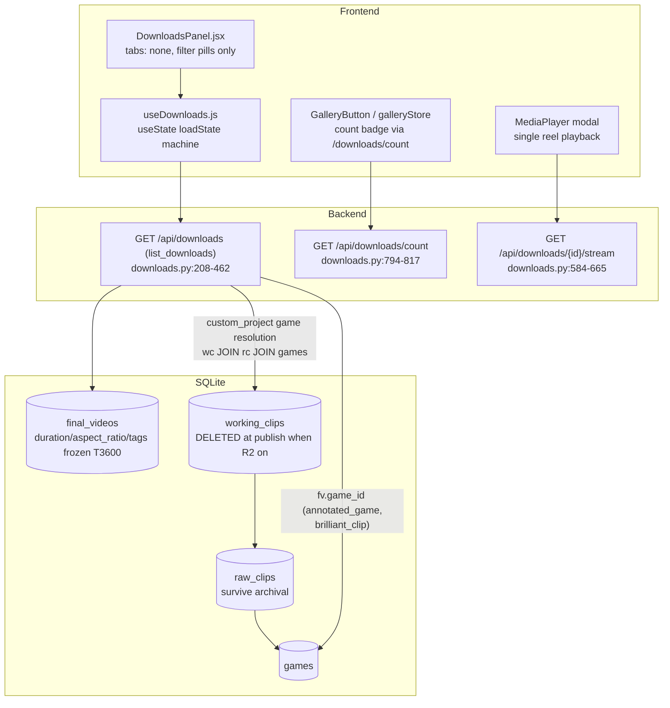
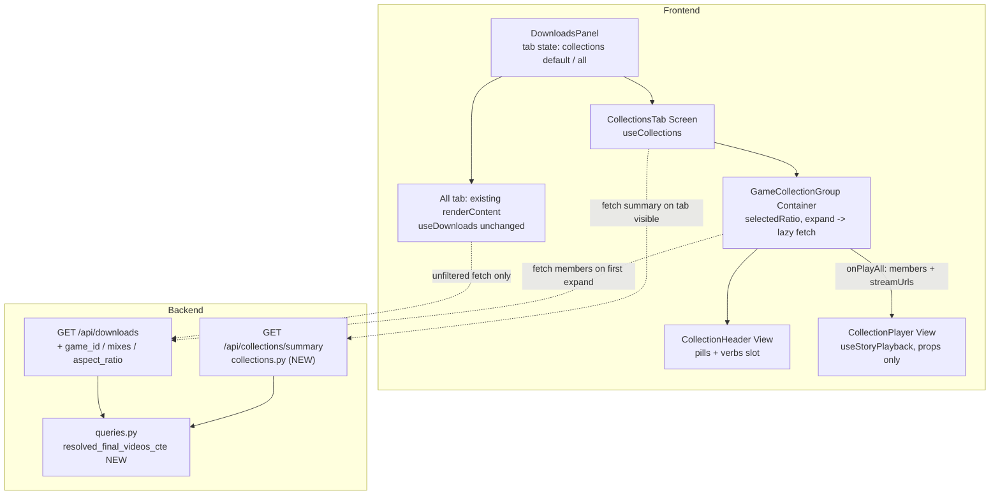

# T3610 Design: Collections Tab + Game Collections in My Reels

**Status:** NEEDS RE-APPROVAL (data layer reshaped by the T3605 prerequisite + user decisions)
**Task:** [T3610](tasks/season-highlights/T3610-collections-tab-game-collections.md) | **Epic:** [Season Highlights & Collections](tasks/season-highlights/EPIC.md)

## 0. Design Amendments (AUTHORITATIVE)

This section is the single source of truth for T3610. It fully supersedes any conflicting
text in sections 1-8. Sections 1-8 are retained ONLY for rationale; wherever their
data-layer (resolution CTE, working-clips join, `unknown` ratio bucket) or rendering
specifics (dominant-ratio default, ratio-toggle pills) contradict this section, THIS
section wins. The obsolete-subsection map at §0.9 lists exactly which subsections are dead
and what replaces them.

### 0.1 game_ids is a frozen column — read it directly, NO resolution CTE
`final_videos.game_ids` is a msgpack BLOB of sorted distinct game ids, frozen at
export-finalize and backfilled by v008 (T3605, shipped + migrated dev/staging/prod).
See `database.py:681` (column) and `v008_freeze_game_ids.py` (backfill incl. R2 archive
recovery). The summary endpoint and the member filters read this column **directly** via
`utils/encoding.decode_data`:

- `decode_data(fv.game_ids)` -> list of game ids.
- `len == 1` -> that single game (a Game collection candidate).
- `len > 1` -> Mixes & compilations (multi-game; EPIC #11).
- `NULL` or `[]` -> Mixes (game-less). For a PUBLISHED reel this should not normally be
  empty post-backfill; if it is, it is still routed to Mixes but see §0.4 (no silent
  coercion of NULL aspect_ratio; game_ids `[]` is a legitimate mixes signal, not a bug).

**DELETE entirely** from the design: the `resolved_final_videos_cte`, the `project_games`
CTE, the `working_clips JOIN raw_clips JOIN games` resolution, and all live game
resolution. There is no live working_clips resolution anymore — working data is deleted at
publish (`project_archive.py`), which is exactly why T3605 froze `game_ids`. The
"single resolution truth" is now a tiny Python helper that decodes one BLOB, NOT a SQL CTE.

### 0.2 JSON over the wire (msgpack-over-HTTP REJECTED)
The summary endpoint returns a normal Pydantic JSON response, like every other data
endpoint. Re-verified: `utils/apiFetch.js` is a bare `fetch` passthrough, `@msgpack/msgpack`
is not a frontend dep, and the backend emits zero `application/x-msgpack` responses. So:
no content negotiation, no `apiFetch` change, no new frontend dependency. On-disk msgpack
(`final_videos.game_ids` / `tags` BLOBs) is DB STORAGE, decoded in Python — unaffected by
this transport decision. This applies to ALL remaining epic tasks (T3640 season_totals,
T3670 tag_totals): JSON over the wire. (User decision, 2026-06-12; reverses handoff #4.)

### 0.3 Ratio is collection IDENTITY, gated at >= COLLECTION_MIN_DURATION_SEC (30s)
A `(game, ratio)` pair is its own independent collection **iff** that ratio's total
duration within the game is `>= COLLECTION_MIN_DURATION_SEC`. There is NO "dominant ratio"
default and NO ratio-toggle pill that re-scopes a single header (that model is dead).

- A game with 40s portrait + 10s landscape -> ONE collection (Portrait). The landscape
  reels still appear, browsable + individually playable, but get NO collection-level verbs.
- A game with 40s portrait + 35s landscape -> TWO independent collection cards, each with
  its own `CollectionHeader`, its own Play-all / Share / Video verbs, its own play/share
  scope.
- Ratio appears in the name as glyph + word ("Vs Carlsbad Dec 6 - Portrait"), never "9:16"
  (EPIC #2).

**Eligibility is computed SERVER-SIDE** so the client stays dumb. Define a named server
constant `COLLECTION_MIN_DURATION_SEC = 30` (in `collections.py`). The summary surfaces,
per game / mixes bucket (and per season_totals / tag_totals bucket for T3640/T3670), a
`ratio_eligible` map: `{"9:16": true, "16:9": false}` — `true` when that ratio's
NULL-excluded duration sum `>= COLLECTION_MIN_DURATION_SEC`. This is a threshold compare on
a server-provided sum (allowed under EPIC #13 — NOT a client aggregate derivation). The
client renders one collection card per ratio whose `ratio_eligible[ratio] === true`, and
lists the remaining (sub-30s) reels as a plain browsable group under the game with no verbs.

### 0.4 No `unknown` ratio bucket, no "Other" pill, no legacy buckets
Every published reel has non-NULL `aspect_ratio` and frozen `game_ids` post-migration.
There is NO `RATIO_UNKNOWN` / `"unknown"` ratio bucket and NO "Other" ratio pill anywhere
(backend or frontend). The only valid ratios are `9:16` (Portrait) and `16:9` (Landscape).
If a published reel ever reads NULL `aspect_ratio`, that is a BUG: log it
(`logger.warning`) and surface it — do NOT add a defensive `unknown` branch or coerce it.
This deletes every `RATIO_UNKNOWN` / `"unknown"` / "Other" reference in §2.3, §3.2, §3.9,
§3.10, §3.12, and the §6 test that asserts an `unknown` bucket.

### 0.5 Mixes group: silent (EPIC #11, user decision #2)
The Mixes & compilations group renders with no explanatory subtitle.

### 0.6 Badge unchanged (user decision #5)
The gallery count badge stays sourced from `galleryStore.fetchCount` (bootstrap +
export-complete WS). The summary fetch does NOT feed the badge. No new count write path.

### 0.7 Component tree (one card per eligible ratio; sub-30s reels browsable)
MVC, Screen -> Container -> View. The change from the old §2.5 is that the CONTAINER
renders N CollectionHeaders (one per eligible ratio) instead of one header with a toggle.

```
DownloadsPanel (existing; gains TabBar)
  TAB = { COLLECTIONS: 'collections', ALL: 'all' } (typed const)
  activeTab === ALL         -> existing pills + renderContent() (unchanged)
  activeTab === COLLECTIONS -> <CollectionsTab renderCard={renderDownloadCard} ... />

CollectionsTab (Screen — guards readiness)
  { summary, summaryState, members, fetchMembers } = useCollections(isOpen && active)
  loading -> spinner; error -> retry; empty -> empty state
  owns player state; renders ONE <CollectionPlayer/> instance
  summary.games.map(g => <GameCollectionGroup collection={g} .../>) + mixes group

GameCollectionGroup (Container — owns expand + play state)
  eligibleRatios = RATIO_ORDER.filter(r => collection.ratio_eligible[r])  // server truth
  // one card per eligible ratio:
  eligibleRatios.map(ratio =>
    <CollectionHeader name={`${collection.game_name} - ${label(ratio)}`}
        ratio={ratio} reelCount={ratio_counts[ratio]}
        duration={ratio_durations[ratio]} hasNullDurations={...}
        onPlayAll={() => playRatio(ratio)} actions={null} />)
  // sub-30s ratios: ONE labeled sub-list per ratio, with an unlock progress bar (see §0.10):
  RATIO_ORDER.filter(r => !collection.ratio_eligible[r] && collection.ratio_counts[r] > 0)
    .map(ratio =>
      <RatioUnlockGroup label={label(ratio)}              // "Portrait" / "Landscape"
          progressPct={min(100, ratio_durations[ratio] / COLLECTION_MIN_DURATION_SEC * 100)}
          captionText="Build more reels to unlock game highlights"
          reels={membersForRatio(ratio)} renderCard={renderCard} />)   // browsable, no verbs
  // members fetched lazily on first expand (CollapsibleGroup onToggle); cards filtered
  // by ratio client-side from the single cached member list (cards are members, NOT
  // aggregates — counts/durations always come from summary).

CollectionHeader (View — presentational, props only; STABLE contract for T3640/T3670)
CollectionPlayer (View — presentational, props only; STABLE contract for T3620)
```

A "collection" in the UI is now a `(game, ratio)` pair; Play/Share scope is that single
ratio. The container maps `eligibleRatios -> one card each`; it never renders a ratio
toggle. The only `CollectionHeader` contract delta: it is fed a single fixed `ratio` prop
instead of `selectedRatio` + `onSelectRatio` (drop those two). Response stays O(games),
summary-first, one DB pass + one Python pass.

### 0.8 Response contract (JSON; ratio_eligible + ratio-scoped shape)

```jsonc
GET /api/collections/summary  ->  200 application/json
{
  "games": [
    {
      "game_id": 12,
      "game_name": "Vs Carlsbad Dec 6",        // _generate_game_display_name (server)
      "game_date": "2025-12-06",
      "reel_count": 7,
      "ratio_counts":    { "9:16": 5, "16:9": 2 },          // keys only 9:16 / 16:9
      "ratio_durations": { "9:16": 312.5, "16:9": 22.0 },   // NULL-excluded sums
      "ratio_eligible":  { "9:16": true, "16:9": false },   // SERVER: sum >= 30s
      "total_duration": 334.5,                              // NULL-excluded
      "has_null_durations": false,
      "latest_published_at": "2026-06-10T18:22:01Z"
    }
  ],                                            // sorted latest_published_at DESC
  "mixes": {                                    // same shape minus game_* fields
    "reel_count": 0,
    "ratio_counts": {}, "ratio_durations": {}, "ratio_eligible": {},
    "total_duration": 0.0, "has_null_durations": false,
    "latest_published_at": null
  },                                            // always present, may be reel_count: 0
  "season_totals": [                            // T3640 consumer
    { "season": "Fall 2025", "ratio": "9:16", "reel_count": 12,
      "total_duration": 700.0, "has_null_durations": true, "eligible": true }
  ],
  "tag_totals": [                               // T3670 consumer
    { "tag": "Goal", "ratio": "9:16", "reel_count": 9,
      "total_duration": 520.0, "has_null_durations": false, "eligible": true }
  ],
  "total_reel_count": 23                        // == list_downloads().total_count
}

GET /api/downloads?game_id=12          -> members of game 12 (game_ids decode, len==1, ==12)
GET /api/downloads?mixes=true          -> game_ids len>1 OR [] / NULL members
GET /api/downloads?game_id=12&aspect_ratio=9:16  -> ratio-scoped members (server filter
                                                    on fv.aspect_ratio; index-backed)
GET /api/downloads                      -> unchanged (All tab, its ONLY consumer)
```

Notes on the contract:
- `ratio_eligible` (per game + mixes) and `eligible` (per season_total / tag_total row,
  which are already ratio-scoped) are the SAME server threshold compare against
  `COLLECTION_MIN_DURATION_SEC`. The client never recomputes them.
- No `"unknown"` ever appears as a ratio key (§0.4).
- **Member-count parity invariant:** the game/mixes routing in the summary and in the
  `/api/downloads` filters MUST share ONE decode-and-route helper over `game_ids`, so
  `len(GET /api/downloads?game_id=12)` always equals `games[12].reel_count`, and the
  ratio-scoped member fetch count equals `ratio_counts[ratio]`.

### 0.9 Obsolete-subsection map (sections 1-8)

| Subsection | Verdict | What changes |
|---|---|---|
| §1.2 Load-bearing fact (custom reels can't resolve) | DELETE | Obsolete since T3605 froze `game_ids`. No archival-deletion attribution gap; frozen BLOB is the source. Keep only a one-line pointer to §0.1. |
| §1.3 item 4 (`clip.duration \|\| 0` smell) | KEEP | Still valid rationale for the new `useStoryPlayback` (no silent fallback on NULL frozen durations). |
| §2.1 Principles | REPLACE | Drop "NULL `aspect_ratio` -> explicit `unknown` bucket"; replace "single resolution truth = SQL helper" with "single decode-and-route helper over frozen `game_ids`". Keep summary-first, MVC, presentational-player, transient-UI-state. |
| §2.2 Target data flow (mermaid) | REPLACE | Remove the `resolved_final_videos_cte`/`Q` resolution node; summary + filters read `game_ids` directly. Container renders N ratio cards, not a toggle group. |
| §2.3 Summary endpoint pseudo (SQL CTE + Python pass) | REPLACE | DELETE the `project_games` + `resolved` CTEs. New SQL = single SELECT of latest published `final_videos` (`latest_final_videos_subquery()` + `published_at IS NOT NULL`) incl. `game_ids`/`aspect_ratio`/`duration`/`tags`. Python pass: `decode_data(game_ids)` -> route game (len==1)/mixes; `ratio = row.aspect_ratio` (NO `or RATIO_UNKNOWN`); accumulate `ratio_durations`; compute `ratio_eligible[r] = sum >= COLLECTION_MIN_DURATION_SEC`. Season/tag aggregation shape unchanged, now also stamping `eligible`. |
| §2.4 Response contract | REPLACE | Superseded by §0.8 (`ratio_eligible` on game+mixes, `eligible` on season/tag; remove the `'unknown'`-key comment). |
| §2.5 Frontend component pseudo | REPLACE | Superseded by §0.7. Container maps `eligibleRatios -> one CollectionHeader each` (no `selectedRatio`/`dominantRatio`/toggle); sub-30s reels = browsable no-verb list. |
| §3.1 `queries.py` resolved_final_videos_cte() | DELETE | No CTE. Replace with a small Python decode-and-route helper (e.g. `route_game_ids(blob) -> game_id \| None`) shared by `collections.py` and the `/api/downloads` `game_id`/`mixes` filters for count parity. |
| §3.2 `collections.py` (NEW) | REPLACE | Keep router placement + Pydantic models + helper imports. DELETE `RATIO_UNKNOWN`. ADD `COLLECTION_MIN_DURATION_SEC = 30`, `ratio_eligible: dict[str,bool]` on `RatioBucketed`, `eligible: bool` on `SeasonTotal`/`TagTotal`. No SQL CTE call; one plain SELECT + Python pass. |
| §3.3 `list_downloads` filters | REPLACE | `game_id`/`mixes`/`aspect_ratio` params stay, resolution via the shared `game_ids` decode helper (NOT a CTE wrap). `aspect_ratio` -> direct `AND fv.aspect_ratio = ?` (index-backed). `game_id`+`mixes` -> 400. |
| §3.4 `main.py` register router | KEEP | Unchanged. |
| §3.5 `useCollections.js` (NEW) | KEEP | Unchanged. Confirm it does NOT request `aspect_ratio` for lists; Play-all for a ratio uses cached members filtered by ratio (no extra fetch). |
| §3.6 `CollapsibleGroup onToggle` | KEEP | Unchanged. |
| §3.7 `DownloadsPanel` tab bar | KEEP | Unchanged. |
| §3.8 `CollectionsTab` (Screen) | KEEP | Unchanged in role; guards + owns single `CollectionPlayer`. |
| §3.9 `GameCollectionGroup` (Container) | REPLACE | DELETE `dominantRatio` + `selectedRatio` state + "Other" pill. Map `ratio_eligible` true-ratios -> one `CollectionHeader` card each; sub-30s reels = browsable no-verb list. |
| §3.10 `CollectionHeader` (View) | REPLACE (contract delta) | Mostly STABLE. DROP `selectedRatio` + `onSelectRatio` props and the scope-switching pill row; ADD a single fixed `ratio` prop. Keep `name`/`subtitle`/`reelCount`/`ratioDurations`/`hasNullDurations`/`onPlayAll`/`actions`. Remove `'unknown'` from JSDoc. |
| §3.11 `useStoryPlayback.js` | KEEP | Unchanged (progress from video element metadata). |
| §3.12 `CollectionPlayer` (View) | REPLACE (minor) | Contract STABLE for T3620. Remove `unknown -> 16:9` branch; layout branches only on `9:16` vs `16:9`. Player scope = a single ratio's reels (all reels in one player share a ratio). |
| `constants/aspectRatios.js` (NEW, §3.10/§3.12) | REPLACE | `RATIO = { PORTRAIT:'9:16', LANDSCAPE:'16:9' }` only (drop `UNKNOWN`). Add `RATIO_ORDER = ['9:16','16:9']` (portrait-first) + label/glyph map. |
| §4 Decision table | REPLACE rows 1,5; KEEP 2,3,6,7,8,9 | Row 1 -> "read frozen `game_ids` BLOB, route in Python; shared decode helper for parity". Row 5 -> note `selectedRatio`/toggle removal + `ratio` prop add; contracts otherwise frozen. Decision 3 (tags in Python) KEEP. |
| §6 `unknown` ratio test | DELETE | Remove the `unknown`-bucket assertion. Replace: NULL `aspect_ratio` on a published reel is logged as a bug, not bucketed. |
| §6 ratio eligibility tests | ADD | (a) 40s portrait + 10s landscape -> `ratio_eligible={9:16:true,16:9:false}`, one Portrait card, landscape sub-list with progress; (b) both >=30s -> two cards; (c) parity: member fetch count == `ratio_counts[ratio]` == `reel_count`; (d) progress pct = `min(100, dur/30*100)`. |

### 0.10 Sub-30s ratio presentation (unlock progress, per-ratio labeled sub-lists)
(User decisions, 2026-06-12.) A ratio within a game that has reels but `< COLLECTION_MIN_DURATION_SEC`
of content produces NO collection card. Instead, under the game, render ONE labeled sub-list
**per sub-30s ratio**, in `RATIO_ORDER` (Portrait before Landscape):

- **Label:** the ratio word ("Portrait" / "Landscape") — never "9:16".
- **Progress bar:** `progressPct = min(100, ratio_durations[ratio] / COLLECTION_MIN_DURATION_SEC * 100)`.
  A display computation off a server-provided sum (`ratio_durations[ratio]`) + the server
  constant — allowed (not a client aggregate derivation; the sum comes from the summary). Show
  the percentage on/near the bar.
- **Caption:** the exact copy **"Build more reels to unlock game highlights"**.
- **Reels:** the ratio's members, browsable + individually playable via `renderCard`. NO
  collection-level Play-all / Share / Video verbs.

A single game can therefore show, top to bottom: a Portrait collection card (if `>=30s`), then a
Landscape sub-list with a progress bar (if `<30s`) — or any mix. A game with reels but EVERY
ratio sub-30s shows only the per-ratio unlock sub-lists (no cards). New presentational component
`RatioUnlockGroup` (progress bar + caption + `renderCard` list), beside `GameCollectionGroup`;
the bar uses the REEL palette per the UI style guide.

## 0B. Restructure amendment (AUTHORITATIVE, 2026-06-13)

User direction after reviewing the two-tab build: collapse to a single view and pull the
smart-collection + time-budget mechanics forward. Supersedes the tab-bar / All-tab parts of
§0.7, §3.7, §3.8. All earlier §0 decisions (frozen game_ids read path, JSON, ratio-as-identity
>=30s, no unknown bucket, silent mixes, badge) still hold.

### 0B.1 Single view, no switcher, "Collection" never surfaced
Remove the Collections|All tab bar AND the source-type filter pills. "My Reels" is one
scrollable view. The All-tab full-list path (`useDownloads` fetch on open, date grouping,
`renderGroup`) is removed from the open flow; `renderDownloadCard` + its handlers stay (reused
for in-place reel cards). Every published reel remains reachable: under its game (eligible-ratio
card list or sub-30s unlock list) or under Mixes. Smart collections are additional lenses on top.

### 0B.2 Section order (top -> bottom)
1. **Smart collections** — Top Plays / Top Goals & Assists / Top Dribbles. Card-only (header +
   budget slider + verbs); no inline clip list (their reels live in the game sections below).
2. **Game by game** — per game: per-ratio highlights collection(s) + that game's clips, plus
   sub-30s unlock groups (unchanged from §0.7/§0.10).
3. **Multi-game mixes** — the silent Mixes group (also holds game-less reels).

### 0B.3 Smart collections (pulls T3670 forward; data already in summary)
Server-defined groups (a constant in `collections.py`):
`top_plays` (tags=None -> all reels), `top_goals_assists` (tags={Goal, Assist}),
`top_dribbles` (tags={Dribble}). The summary gains `smart_collections: List[SmartCollection]`
(a RatioBucketed + key + name), computed in the SAME Python pass: each reel joins a group iff
`group.tags is None OR reel.tags ∩ group.tags` — membership is a per-reel boolean, so a
Goal+Assist reel is counted ONCE (dedup is automatic). Per (group, ratio): reel_count,
ratio_durations, `ratio_eligible` (>=30s), has_null_durations. Below-30s smart ratios render as
LOCKED progress cards (EPIC #6 near-miss), not browsable lists. `season_totals`/`tag_totals`
remain in the response (other potential consumers); the UI now reads `smart_collections`.

### 0B.4 Smart member fetch (`?tags=` filter on /api/downloads)
New `tags` query param (comma-separated, OR semantics, decode-and-filter in Python over the
frozen `tags` BLOB; a reel matches if it has ANY listed tag — deduped by construction). Member
keys: `smart:top_plays` -> `GET /api/downloads` (no filter, all reels); `smart:top_goals_assists`
-> `?tags=Goal,Assist`; `smart:top_dribbles` -> `?tags=Dribble`. Same parity discipline as
game_id/mixes: the member count for a smart group equals its summary reel_count.

### 0B.5 Collection actions + duration budget (pulls T3640's time-budget forward; EPIC #7)
Revised 2026-06-13 (user, after review). Every ELIGIBLE collection card (smart, game, mixes) has:
- **Play all** (primary button) + a **"..." overflow menu**: `Play all`, `Set Duration`, then
  `Share` / `Copy link` / `Download` shown **disabled with a "Coming soon" tooltip** until T3620
  (share/copy link) and T3680 (download) ship (§0B.7). This is the "all the options" affordance.
- **Set Duration** reveals the budget slider (hidden by default — not always-on).

Duration budget:
- **Default = ALL clips** (the full collection). The card shows the **actual selected duration**,
  which equals the full ratio duration by default and updates to the real summed length of the
  selected clips once trimmed.
- **Range:** `30s` -> the collection's **full ratio duration** (NO 5m cap — "all clips" must always
  be reachable). Cap + default come from the summary (`ratio_durations[ratio]`); no member fetch to
  render the card.
- **Precision:** snaps to **15s steps**; the cap (full) is always reachable at the top.
  (Overrides EPIC #7's 30s/1m/2m/3m/5m detents.)
- **Membership:** the reels that fit the budget, **greedy-with-skip** over members ordered by the
  canonical rule. Until T3630 ranking exists, order = member-list order (recency); becomes true
  rank order when T3630 lands. NULL-duration members can't be budgeted -> excluded from the subset.
- **State:** transient per-collection `useState` (no persistence, EPIC #5). The subset + actual
  duration are computed client-side over the lazily-loaded member list (fetched when Set Duration
  opens / budget changes / Play all); displayed aggregates still come from the server summary
  (EPIC #13 intact — playback selection, not an aggregate derivation).
- **Play all** plays exactly the budgeted subset, in order.

### 0B.6 Member-card mutation sync (single-view correctness)
With the only view sourcing member lists from `useCollections` (not `useDownloads`), per-reel
mutations must update the right store. `useCollections` is lifted to `DownloadsPanel` (Screen owns
data) and exposes member-aware updates:
- **delete** -> remove the reel from any cached member list, then refetch the summary (counts +
  eligibility change) and invalidate affected member keys.
- **rename / mark-watched** -> optimistic patch of the reel in the cached member lists.
`renderDownloadCard`'s handlers call these (in addition to the existing backend calls).

### 0B.7 Deferred (unchanged)
Collection-level **Share / Copy link** = T3620 (share backend + public viewer + Postgres v016).
Collection-level **Download** (stitched mp4) = T3680. **Ranking** for true "Top"/budget order =
T3630. Per-REEL share/copy-link/download remain on each card now.

### 0B.8 Task-tracking note
This push absorbs T3610's restructure + **T3670's smart-collection UI** + **T3640's time-budget
mechanic** (minus T3640's unlock modal/season scope and minus T3630 ranking). PLAN.md/EPIC.md
should be updated to reflect the pull-forward (user applies status changes).

## 1. Current State Analysis

### 1.1 Data flow today



### 1.2 Load-bearing fact (verified in source, twice)

**Published custom-project reels usually CANNOT resolve their games.** Verified chain:

- `downloads.py:749-791` (`publish_to_my_reels`) calls `archive_project` after setting `published_at`.
- `project_archive.py:122-124`: `archive_project` **deletes all `working_clips` and `working_videos`** for the project when R2 is enabled (i.e., always in production). `raw_clips` and `games` survive. (Matches EPIC decision #4: "publish archives + deletes working data".)
- `downloads.py:305-344`: `list_downloads` resolves custom-project games via `working_clips wc JOIN raw_clips rc JOIN games g WHERE wc.project_id IN (...)`. For archived (published) projects this join yields **nothing** → `game_ids = []` → `group_key` falls back to "Month Year" (`downloads.py:406-414`).
- T3600/v007 froze `duration`, `aspect_ratio`, `tags` onto `final_videos` precisely because of this archival deletion — but it did **not** freeze game ids. There is no frozen game data for custom projects on `final_videos`.

**Consequence:** the summary endpoint must mirror this exact resolution so summary counts always equal what `list_downloads` would attribute — meaning archived single-game custom reels go to the **Mixes & compilations** bucket (game-less), consistent with the All tab's existing fallback grouping. The proper fix (freeze `game_ids` at export-finalize like T3600, plus an archive-reading backfill) is out of T3610's scope (read-only task, no schema change) and is raised in Open Question 1.

Resolution rules in `list_downloads` (`downloads.py:380-404`), which the summary mirrors exactly:

| Row shape | Resolution |
|---|---|
| `source_type='annotated_game'`, `fv.game_id` set, game row exists | that game |
| `source_type='brilliant_clip'`, `fv.game_id` set, game row exists | that game |
| `fv.game_id` set but game row deleted | **no game** (elif chain does not fall through to project resolution) |
| `fv.game_id` NULL, `project_id` set | DISTINCT games via working_clips→raw_clips→games (all versions, INNER JOIN games) |

### 1.3 Smells / constraints observed

1. **Client-side aggregate temptation**: `DownloadsPanel` already reduces over `downloads[]` for unwatched counts (lines 70-76, 256-259). EPIC #13 hard rule forbids extending this pattern for Collections — aggregates must come from the new summary endpoint.
2. **`useEffect` store sync** (`DownloadsPanel.jsx:70-76`): writes `count`/`unwatchedCount` to `galleryStore` reactively on `loadState === 'ready'`. Memory-only store sync of server-derived data (not persistence), so it does not violate the gesture-persistence rule — but it silently depends on the full-list fetch happening. With Collections as the default tab the full list is no longer fetched on open. Handled in §3.7 / Decision 7.
3. **`CollapsibleGroup` is uncontrolled with no expand notification** (`CollapsibleGroup.jsx:29-34`): lazy member fetch needs an `onToggle` hook point.
4. **Recap playback hooks are not reusable as-is**: `useHighlightsPlayback.js:17` uses `clip.duration || 0` (silent fallback — breaks the no-silent-fallback rule for NULL frozen durations) and builds a virtual-time segment model for scrubbing we don't need.
5. **`groupByGame` sorts groups alphabetically** (`DownloadsPanel.jsx:537`) — Collections requires newest-first; do not reuse.
6. **Panel width**: `w-full max-w-md` (`DownloadsPanel.jsx:626`) is already effectively full-width below 448px; the 360px risk is inner row overflow, not panel width.
7. **T3600 shim** (`database.py:684-693`): ALTER-column shim slated for removal in a separate pre-step commit (keep the `idx_final_videos_published_ratio` index at 695-698).

### 1.4 Current grouping pseudo (All tab — stays unchanged)

```
useDownloads.groupedDownloads():
  partition downloads by created_at into today/yesterday/lastWeek/older
DownloadsPanel.renderGroup(title, items):
  groupByGame(items) by item.group_key  -> CollapsibleGroup per key
  defaultExpanded = group contains latestDownloadId
```

## 2. Target Architecture

### 2.1 Principles

- **Summary-first (EPIC #13)**: ONE summary endpoint computed in one DB pass; response O(games). The client never reduces over `downloads[]` to compute aggregates for Collections.
- **Single resolution truth**: the per-reel game-resolution SQL lives in one helper (`queries.py`) consumed by both `/api/collections/summary` and the new `game_id`/`mixes` filters on `/api/downloads` — expand results can never disagree with summary counts.
- **No silent fallbacks**: NULL durations excluded from sums and surfaced via `has_null_durations`; NULL `aspect_ratio` reported under an explicit `unknown` bucket, never coerced.
- **MVC**: `CollectionsTab` (Screen, guards readiness) → `GameCollectionGroup` (Container, ratio/expand/play state) → `CollectionHeader`/`CollectionPlayer` (Views, assume data).
- **Presentational player**: `CollectionPlayer` takes ordered reel descriptors + callbacks only; T3620's public viewer feeds it presigned URLs.
- **Transient UI state**: active tab, per-group ratio, expansion = component `useState`. Nothing persisted, no new Zustand state.

### 2.2 Target data flow



### 2.3 Summary endpoint pseudo (one DB pass)

```sql
-- helper: queries.resolved_final_videos_cte() returns this WITH body
WITH project_games AS (
    -- mirrors downloads.py:309-324 exactly: all working_clips versions,
    -- DISTINCT games, INNER JOIN games (deleted games drop out)
    SELECT wc.project_id,
           COUNT(DISTINCT rc.game_id) AS game_count,
           MIN(rc.game_id)            AS single_game_id
    FROM working_clips wc
    JOIN raw_clips rc ON wc.raw_clip_id = rc.id
    JOIN games g2     ON g2.id = rc.game_id
    GROUP BY wc.project_id
),
resolved AS (
    SELECT fv.id, fv.duration, fv.aspect_ratio, fv.tags,
           fv.created_at, fv.published_at, fv.watched_at,
           CASE
             WHEN fv.game_id IS NOT NULL THEN g.id          -- NULL if game deleted (mirrors elif chain: no fall-through)
             WHEN pg.game_count = 1     THEN pg.single_game_id
             ELSE NULL                                       -- multi-game or unresolvable -> mixes
           END AS resolved_game_id
    FROM final_videos fv
    LEFT JOIN games g          ON g.id = fv.game_id
    LEFT JOIN project_games pg ON pg.project_id = fv.project_id
                               AND fv.game_id IS NULL
    WHERE fv.id IN ({latest_final_videos_subquery()})        -- queries.py:104-131
      AND fv.published_at IS NOT NULL                        -- mirrors list_downloads WHERE exactly
)
SELECT r.*,
       rg.game_date, rg.opponent_name, rg.game_type,
       rg.tournament_name, rg.name AS game_raw_name
FROM resolved r
LEFT JOIN games rg ON rg.id = r.resolved_game_id
ORDER BY r.published_at DESC
```

```python
# collections.py — single Python pass over the (O(reels), <= ~500) result set
for row in rows:
    bucket = games[row.resolved_game_id] if row.resolved_game_id else mixes
    ratio = row.aspect_ratio or RATIO_UNKNOWN           # explicit 'unknown' bucket, never coerced
    bucket.reel_count += 1
    bucket.ratio_counts[ratio] += 1
    if row.duration is None: bucket.has_null_durations = True
    else:
        bucket.total_duration += row.duration
        bucket.ratio_durations[ratio] += row.duration
    bucket.latest_published_at = max(...)
    # season totals (T3640 shape): key = f"{_get_season_for_month(m)} {year}"
    #   from game_date when resolved, else created_at
    season_totals[(season_key, ratio)] += duration/count (NULLs excluded, flagged)
    # tag totals (T3670 shape): tags = decode_data(row.tags) or []  (NULL = no tags)
    for tag in tags: tag_totals[(tag, ratio)] += duration/count
# game display names: _generate_game_display_name(opponent, date, type, tournament, fallback)
# response: games sorted by latest_published_at DESC, mixes bucket, season_totals, tag_totals
```

Why the GROUP BY is in Python, not SQL: `tags` is a msgpack BLOB (`utils/encoding.decode_data`) — per-tag sums are impossible in SQLite GROUP BY. One SQL pass returning resolved per-reel rows + one linear Python pass keeps "one query, no N+1", and at the design scale (≤500 rows) is microseconds. Response stays O(games). This is the only deviation from the spec's literal "ONE SQL GROUP BY" wording and it is forced by the tags requirement (Decision 3).

### 2.4 Response contract (consumed by T3620/T3640/T3670/T3680)

```jsonc
GET /api/collections/summary
{
  "games": [
    {
      "game_id": 12,
      "game_name": "Vs Carlsbad Dec 6",        // server-side via _generate_game_display_name
      "game_date": "2025-12-06",
      "reel_count": 7,
      "ratio_counts":    { "9:16": 5, "16:9": 2 },          // 'unknown' key only when present
      "ratio_durations": { "9:16": 312.5, "16:9": 88.0 },   // NULL-excluded sums (header needs ratio-scoped duration without client math)
      "total_duration": 400.5,                              // NULL-excluded
      "has_null_durations": false,
      "latest_published_at": "2026-06-10T18:22:01Z"
    }
  ],                                            // sorted latest_published_at DESC
  "mixes": { /* same shape minus game_* fields; always present, may be reel_count: 0 */ },
  "season_totals": [
    { "season": "Fall 2025", "ratio": "9:16", "reel_count": 12,
      "total_duration": 700.0, "has_null_durations": true }
  ],
  "tag_totals": [
    { "tag": "Goal", "ratio": "9:16", "reel_count": 9, "total_duration": 520.0 }
  ],
  "total_reel_count": 23                        // equals list_downloads total_count by construction
}
```

```
GET /api/downloads?game_id=12            -> members of game 12 (resolved via same CTE)
GET /api/downloads?mixes=true            -> resolved_game_id IS NULL members
GET /api/downloads?game_id=12&aspect_ratio=9:16   -> ratio-scoped (param exists per spec;
                                                     Collections UI filters ratio client-side)
GET /api/downloads                        -> unchanged (All tab, its ONLY consumer)
```

### 2.5 Frontend component pseudo

```
DownloadsPanel (existing file, gains tab bar)
  [activeTab, setActiveTab] = useState(TAB.COLLECTIONS)
  header -> TabBar(Collections | All)   // 44px targets
  activeTab === ALL         -> existing pills + renderContent() (unchanged)
  activeTab === COLLECTIONS -> <CollectionsTab onPlayMembers={...} shared verbs/cards via renderDownloadCard />

CollectionsTab (Screen)
  { summary, summaryState, members, fetchMembers } = useCollections(isOpen && activeTab===COLLECTIONS)
  if loading -> spinner; if error -> retry; if empty -> empty state
  [player, setPlayer] = useState(null)   // { reels, title, initialIndex }
  render summary.games.map((g, i) =>
    <GameCollectionGroup collection={g} groupKey={`game:${g.game_id}`}
        defaultExpanded={i === 0} members={members[`game:${g.game_id}`]}
        onExpand={() => fetchMembers({game_id: g.game_id})}
        onPlayAll={(reels) => setPlayer({reels, title: g.game_name})} />)
  + <GameCollectionGroup collection={summary.mixes} groupKey="mixes" .../>  // bottom
  + player && <CollectionPlayer {...player} onClose={() => setPlayer(null)} />

GameCollectionGroup (Container)
  [selectedRatio, setSelectedRatio] = useState(dominantRatio(collection.ratio_counts))
  <CollapsibleGroup defaultExpanded={defaultExpanded} onToggle={(open)=> open && onExpand()}>
    <CollectionHeader ...collection selectedRatio onSelectRatio onPlayAll actions={null} />
    members ? cards.filter(ratio).map(renderCard) : <MemberSkeleton/>
```

## 3. Refactoring Plan (file-by-file)

### 3.0 Pre-step (separate commit, before feature work)

**`src/backend/app/database.py`** — remove the T3600 ALTER shim block (lines ~684-693), keep `CREATE INDEX idx_final_videos_published_ratio` (~695-698). v007 remains canonical.

### 3.1 `src/backend/app/queries.py` (modify)

Add the shared resolution helper next to `latest_final_videos_subquery`:

```python
def resolved_final_videos_cte() -> str:
    """WITH-body resolving each published latest-version final_video to a
    single game_id or NULL (mixes). Mirrors list_downloads' resolution
    (downloads.py game-info chain) exactly:
    - fv.game_id set -> that game iff the games row exists (no fall-through)
    - else project working_clips -> raw_clips -> games; exactly 1 distinct
      game -> that game; 0 (archived working data) or >1 -> NULL
    Used by GET /api/collections/summary and the game_id/mixes filters on
    GET /api/downloads so expand results always match summary counts."""
```

### 3.2 `src/backend/app/routers/collections.py` (NEW)

```python
router = APIRouter(prefix="/api/collections", tags=["collections"])
RATIO_UNKNOWN = "unknown"   # explicit bucket for NULL aspect_ratio (legacy annotated_game)

class RatioBucketed(BaseModel):
    reel_count: int
    ratio_counts: dict[str, int]
    ratio_durations: dict[str, float]
    total_duration: float
    has_null_durations: bool
    latest_published_at: Optional[str]

class GameCollection(RatioBucketed):
    game_id: int
    game_name: str
    game_date: Optional[str]

class SeasonTotal(BaseModel):  # T3640 shape
    season: str; ratio: str; reel_count: int
    total_duration: float; has_null_durations: bool

class TagTotal(BaseModel):     # T3670 shape
    tag: str; ratio: str; reel_count: int; total_duration: float

class CollectionsSummaryResponse(BaseModel):
    games: List[GameCollection]; mixes: RatioBucketed
    season_totals: List[SeasonTotal]; tag_totals: List[TagTotal]
    total_reel_count: int

@router.get("/summary", response_model=CollectionsSummaryResponse)
async def collections_summary():
    # ONE cursor.execute of the §2.3 query, then the §2.3 Python pass.
    # Display names + seasons via downloads helpers:
    from app.routers.downloads import _generate_game_display_name, _get_season_for_month
    # created_at normalized to '...Z' same as downloads.py:432-435
```

(Importing router-level helpers from `downloads.py` follows existing precedent — `downloads.py:781` imports from `app.routers.auth`. See Decision 2.)

### 3.3 `src/backend/app/routers/downloads.py` (modify)

`list_downloads` signature becomes:

```python
async def list_downloads(source_type: Optional[str] = None,
                         game_id: Optional[int] = None,
                         aspect_ratio: Optional[str] = None,
                         mixes: bool = False):
    # game_id and mixes are mutually exclusive (400 if both)
    # When either is set, wrap with the shared CTE:
    #   WITH {resolved_final_videos_cte()}
    #   ... existing SELECT ... WHERE fv.id IN (
    #       SELECT id FROM resolved WHERE resolved_game_id = ?      -- game_id
    #       / SELECT id FROM resolved WHERE resolved_game_id IS NULL -- mixes
    #   )
    # aspect_ratio: AND fv.aspect_ratio = ?   (uses idx_final_videos_published_ratio)
    # Everything else (batch game lookups, response model, ordering) unchanged.
```

Existing unfiltered call path is untouched; the All tab remains its only unfiltered consumer.

### 3.4 `src/backend/app/main.py` (modify)

`app.include_router(collections_router)` next to `downloads_router` (line ~146), import alongside the others.

### 3.5 `src/frontend/src/hooks/useCollections.js` (NEW — Decision 4)

```javascript
export function useCollections(isActive) {
  const [summary, setSummary] = useState(null);
  const [summaryState, setSummaryState] = useState('idle'); // idle|loading|ready|error
  const [members, setMembers] = useState({});        // { 'game:12': DownloadItem[], 'mixes': [...] }
  const [memberStates, setMemberStates] = useState({}); // per-key idle|loading|ready|error
  // AbortController per concern, profile-switch reset (same pattern as useDownloads.js:280-290)

  fetchSummary()  // GET /api/collections/summary; runs when isActive becomes true (tab visible gesture)
  fetchMembers({ gameId, mixes })  // GET /api/downloads?game_id=N | ?mixes=true
    // no-op if memberStates[key] is 'loading' or 'ready'  -> lazy, fetch-once cache
    // NO aspect_ratio param: ratio pills filter the cached cards client-side (Decision 4)
  return { summary, summaryState, members, memberStates, fetchSummary, fetchMembers };
}
```

State is `useState`, mirroring `useDownloads` (panel-scoped, cleared on profile switch — same accepted pattern, see Decision 7).

### 3.6 `src/frontend/src/components/shared/CollapsibleGroup.jsx` (modify — Decision 6)

Add optional `onToggle` while staying uncontrolled (smallest change, no parallel component):

```jsx
export function CollapsibleGroup({ ..., onToggle }) {
  <button onClick={() => {
    const next = !isExpanded;
    setIsExpanded(next);
    onToggle?.(next);          // notification only; existing consumers unaffected
  }} className="... min-h-11"  // bump header to 44px touch target
```

Note: the `defaultExpanded` sync effect (lines 32-34) will re-expand the first group if summary refetches — acceptable (matches current All-tab behavior). `GameCollectionGroup` must also trigger the initial member fetch for the `defaultExpanded` group on mount (an `onToggle` never fires for the initial state): one `useEffect(() => { if (defaultExpanded) onExpand(); }, [])` — a fetch trigger, not persistence.

### 3.7 `src/frontend/src/components/DownloadsPanel.jsx` (modify)

- Add `const TABS = { COLLECTIONS: 'collections', ALL: 'all' }` (typed constants rule) and `const [activeTab, setActiveTab] = useState(TABS.COLLECTIONS)` — transient, resets every mount (Decision 7).
- Tab bar between header and content: two 44px-min buttons, REEL accent active state; source-type filter pill row (lines 648-667, incl. the Star pill) renders **only** on the All tab.
- `useDownloads(isOpen)` becomes `useDownloads(isOpen && activeTab === TABS.ALL)` so the full-list fetch fires only for the All tab. The count-sync effect (lines 70-76) keeps its `loadState === 'ready'` guard and therefore simply doesn't fire until the All tab is visited; the badge keeps coming from `galleryStore.fetchCount` (bootstrap + export-complete WS, `useDownloads.js:308-330`) which is unaffected. No new sync path (Decision 7).
- Pass `renderDownloadCard` down to `CollectionsTab` as a render prop (`renderCard={renderDownloadCard}`) so member cards reuse the existing card with all verbs (play/share/overflow) and rename/watched behavior without duplication. (`handlePlay`/`markWatched` etc. operate on the download object and remain panel-owned.)
- Mobile: panel stays `w-full max-w-md` (already full-width ≤428px); audit inner rows at 360px (tab bar + pills `flex-wrap`, `min-w-0` on title cells) per responsiveness skill.

### 3.8 `src/frontend/src/components/collections/CollectionsTab.jsx` (NEW — Screen)

Per §2.5 pseudo. Guards: `summaryState` loading/error/empty (`games.length === 0 && mixes.reel_count === 0`). Owns `player` state and renders the single `CollectionPlayer` instance, mapping members → player reels:

```javascript
const toPlayerReels = (items) => items.map(d => ({
  id: d.id, name: d.project_name,
  streamUrl: getStreamingUrl(d.id),     // T3620 passes presigned URLs instead
  aspect_ratio: d.aspect_ratio, duration: d.duration,  // may be null
}));
```

"Play all" before members are fetched: the verb triggers `fetchMembers` and opens the player when the members promise resolves (loading affordance on the button; no store coupling in the player).

### 3.9 `src/frontend/src/components/collections/GameCollectionGroup.jsx` (NEW — Container)

Per §2.5. `dominantRatio(ratio_counts)` = highest count; tie → `'9:16'` (portrait-first product). Filters cached members by `selectedRatio` client-side (cards are not aggregates; allowed). `unknown`-ratio reels appear under an "Other" pill only when `ratio_counts.unknown` exists.

### 3.10 `src/frontend/src/components/collections/CollectionHeader.jsx` (NEW — View; contract for T3640/T3670)

```jsx
/**
 * Presentational. Reused by Season (T3640) and Smart (T3670) headers.
 * @param {string}  name
 * @param {string=} subtitle            // e.g. game date; seasons pass range text
 * @param {number}  reelCount
 * @param {Object}  ratioCounts         // { '9:16': 5, '16:9': 2, 'unknown': 1 }
 * @param {Object}  ratioDurations      // NULL-excluded sums from summary
 * @param {number}  totalDuration
 * @param {boolean} hasNullDurations    // subtle marker: "~" prefix + title tooltip
 * @param {string}  selectedRatio       // controlled
 * @param {Function} onSelectRatio      // (ratio) => void
 * @param {Function} onPlayAll          // scoped to selectedRatio by the container
 * @param {ReactNode=} actions          // verbs slot — Share (T3620) / Video (T3680) drop in
 */
```

Layout: identity line (name · ratio glyph+word for selected ratio · `reelCount` reels · `formatDuration(ratioDurations[selectedRatio])` with `~` marker when `hasNullDurations`); pill row ("Portrait 5" / "Landscape 2", 44px targets, REEL palette); verbs row (`Play all` Button + `{actions}`). Ratio glyph/word mapping comes from new `src/frontend/src/constants/aspectRatios.js` (`RATIO = { PORTRAIT: '9:16', LANDSCAPE: '16:9', UNKNOWN: 'unknown' }` + label/glyph map) — none exists today (verified).

### 3.11 `src/frontend/src/components/collections/useStoryPlayback.js` (NEW — Decision 8)

Minimal hook modeled on `useHighlightsPlayback` but decoupled from frozen durations and virtual time:

```javascript
useStoryPlayback(videoRef, reels, { onAllEnded, onReelChange }) =>
  { activeIndex, activeReel, isPlaying, segmentProgress /*0..1 of CURRENT video element*/,
    next, prev, togglePlay }
// - auto-advance on 'ended'; last reel -> onAllEnded
// - segmentProgress = video.currentTime / video.duration (element metadata,
//   never reel.duration -> NULL frozen durations cannot break it)
// - rAF time tick + play/pause/ended listeners (pattern from useHighlightsPlayback.js:52-86)
```

### 3.12 `src/frontend/src/components/collections/CollectionPlayer.jsx` (NEW — View; contract for T3620)

```jsx
/**
 * Story player. STRICTLY presentational: no stores, no fetching.
 * @param {Array}   reels        // ordered [{ id, name, streamUrl, aspect_ratio, duration|null }]
 * @param {number=} initialIndex // default 0
 * @param {string}  title        // group name in chrome
 * @param {Function} onClose     // REQUIRED. X button only — NO backdrop close (project rule)
 * @param {Function=} onReelChange // (index, reel) — T3620 hooks watched/analytics here
 * @param {Function=} onEnded      // all reels finished
 */
```

- Modal: `fixed inset-0 z-[70]` full-bleed black on mobile; `md:inset-12 md:rounded-xl` desktop chrome for 16:9; 9:16 stays full-bleed vertical story layout (video `h-full`, centered, `object-contain`). Layout branches on `activeReel.aspect_ratio` (`unknown` → 16:9 layout).
- Segmented progress bar: equal-width segments (one per reel), past = filled, active = `segmentProgress` fill, future = empty.
- Per-reel title overlay: fades in for ~2s on `activeIndex` change.
- Touch: container `onPointerUp` zones — left third `prev`, right third `next`, center `togglePlay`; horizontal swipe (pointer delta > 48px) navigates. Desktop: `←`/`→`/`Space` keydown (window listener while mounted, pattern from `RecapPlayerModal.jsx:87-100`).
- 16:9 desktop adds an up-next strip (remaining reel names, click = jump).
- Uses a raw `<video playsInline>` + `useStoryPlayback` (not `MediaPlayer` — its single-src controls fight story navigation).

### 3.13 Tests (new files)

- `src/backend/tests/test_collections_summary.py` — reuses `full_schema_db`, `_seed_custom_project`, `_seed_auto_project` patterns from `test_collection_metadata.py` (extend seeds with `games` rows + `rc.game_id` + publish/version stamping); calls `asyncio.run(collections_summary())` / `asyncio.run(list_downloads(...))` directly like `TestDownloadsResponse`.
- `src/frontend/src/hooks/__tests__/useCollections.test.js` (Vitest — mock fetch).
- `src/frontend/e2e/collections.spec.js` (Playwright, auth bypass pattern from `e2e/new-user-flow.spec.js`).

## 4. Design Decisions

| # | Decision | Choice | Rationale |
|---|---|---|---|
| 1 | Summary SQL strategy | One query: `project_games` + `resolved` CTEs (per-reel resolved game) returning per-reel rows; all aggregation in a single Python pass. `fv.game_id` rows never fall through to working-clip resolution (mirrors the `elif` chain at `downloads.py:385-404`). Archived custom projects (working_clips deleted at publish — `project_archive.py:122`) resolve NULL → **mixes**, exactly as the All tab fails to attribute them today. CTE shared via `queries.resolved_final_videos_cte()` with `list_downloads` filters so expand counts always equal summary counts by construction. | The load-bearing question: there is no frozen game data; the only honest source is the same one `list_downloads` uses. Diverging (e.g., reading R2 archives) would be N+1 over the network and break count parity. |
| 2 | Router placement | New `app/routers/collections.py` (`/api/collections`); imports `_generate_game_display_name`/`_get_season_for_month` from `downloads.py` | Collections grows with T3640/T3670 (season/tag summaries already in this response); keeps downloads.py from bloating past ~900 lines. Router→router import has precedent (`downloads.py:781`). |
| 3 | Tags aggregation | Python, over the single per-reel result set (`decode_data` per row, NULL → no tags) | msgpack BLOBs cannot GROUP BY in SQLite. One DB pass preserved; ≤500 rows is trivial; response stays O(games). |
| 4 | Hook split | New `useCollections` hook; `useDownloads` untouched except its activation condition. Members cached per group key in `useCollections`; fetched once per expand, **no** refetch on ratio change — pills filter cached cards client-side (cards are members, not aggregates; the no-client-aggregation rule applies to sums/counts, which always come from summary). | Separate state machines (summary vs list) — bolting modes onto `useDownloads`' single `loadState` would create the exact "two variables disagree" smell coding-standards bans. The All tab keeps its only-consumer guarantee. |
| 5 | Component contracts | `CollectionHeader` (§3.10) and `CollectionPlayer` (§3.12) prop lists frozen as documented; `actions` slot + `streamUrl`-in-props are the T3620/T3680 extension points | Four downstream tasks consume these; ratio-scoped durations included in summary so the header never computes them. |
| 6 | CollapsibleGroup lazy fetch | Extend with optional `onToggle(isExpanded)`; stays uncontrolled | Smallest surface; zero impact on existing consumers; controlled `expanded` prop would force every consumer to own state it doesn't care about. Initial `defaultExpanded` fetch handled by the container's mount effect. |
| 7 | Tab state + count sync | `activeTab`/`selectedRatio`/expansion = `useState` (transient, no persistence). Existing galleryStore count-sync effect kept as-is; it simply doesn't fire until the All tab loads. Badge truth remains `galleryStore.fetchCount`. `useCollections` uses `useState` like `useDownloads` — panel-scoped hook state, consistent with the existing pattern. | No new stored state (EPIC rule); no second write path for counts; the effect is memory-only store sync, not reactive persistence (flagged, accepted). |
| 8 | Auto-advance | New minimal `useStoryPlayback` (~80 lines) in `components/collections/`; do **not** reuse recap hooks | `useHighlightsPlayback` hard-codes `clip.duration \|\| 0` (silent fallback that breaks with NULL frozen durations) and a virtual-time scrub model we don't need; progress derives from the video element's own metadata instead. |
| 9 | Mobile strategy | Panel keeps `w-full max-w-md` (already full-width ≤448px); fix inner overflow at 360px (`min-w-0`, `flex-wrap`, `truncate`). Player: CSS-only takeover — `fixed inset-0` mobile, `md:inset-12` desktop; no `requestFullscreen` (iOS Safari unreliable; CSS matches existing playingVideo modal at `DownloadsPanel.jsx:710`). 44px targets on tabs/pills/verbs; pill labels collapse to glyph+count if needed at 360px. | Responsiveness skill: CSS-only, no JS detection; test 360/390/428/1280. |

## 5. Risks

1. **Mixes bucket dominates for existing users** (HIGH, product not technical): every previously published custom reel whose project was archived lands in "Mixes & compilations" even if single-game. Counts stay consistent with the All tab (which shows them under month-year fallbacks), but the Collections tab's value is reduced until game ids are frozen (Open Question 1).
2. **Count parity drift**: any future edit to `list_downloads`' WHERE or the elif resolution that doesn't go through the shared CTE breaks summary↔All agreement. Mitigation: parity test asserting `summary.total_reel_count == list_downloads().total_count` and per-game member-count equality over a mixed seed.
3. **`project_games` CTE scans all working_clips**: in practice working_clips only holds unpublished drafts (archival deletes the rest), so the scan is small; verify with `EXPLAIN QUERY PLAN` during implementation, add index only if needed.
4. **CollapsibleGroup `defaultExpanded` sync effect** re-expands group #1 on summary refetch (profile switch, reopen) — may retrigger a member fetch; harmless because `memberStates` caches 'ready'.
5. **iOS autoplay policy**: auto-advance `video.play()` after `ended` is user-gesture-chained and generally allowed with `playsInline`; test on real mobile Safari at 390px.
6. **`published_at` ordering**: `latest_published_at` uses `published_at`, while All tab orders by `created_at`; for restored-and-republished reels group order may differ from card order inside All. Cosmetic; documented.
7. **Render-prop reuse of `renderDownloadCard`** keeps one card code path but threads panel handlers through Collections; if it gets unwieldy, extracting `DownloadCard.jsx` is the fallback (larger diff, same behavior).

## 6. Test Plan

**Backend (`tests/test_collections_summary.py`, fixtures from `test_collection_metadata.py`):**
- Single-game custom project (working_clips intact) → attributed to its game; `reel_count`/`ratio_counts`/`ratio_durations` correct.
- Multi-game custom project (working_clips across two games) → mixes bucket, **excluded** from both games' rows.
- Archived published custom project (delete its working_clips to simulate `archive_project`) → mixes (game-less), with a test docstring documenting the §1.2 behavior.
- `brilliant_clip` with `fv.game_id` → its game; deleted game row → mixes (no fall-through).
- Legacy `annotated_game` (project_id NULL, game_id set, aspect_ratio NULL) → its game, counted under `unknown` ratio.
- NULL duration: excluded from `total_duration`/`ratio_durations`/`season_totals`/`tag_totals`; `has_null_durations` true only on affected buckets.
- Latest-version-only + `published_at IS NOT NULL`: older versions and unpublished rows excluded; **parity**: `total_reel_count == asyncio.run(list_downloads(None)).total_count`.
- `list_downloads(game_id=X)` members == summary count for X; `mixes=True` == mixes count; `aspect_ratio` filter; `game_id`+`mixes` → 400.
- `tag_totals`: msgpack decode, NULL tags contribute nothing, per-ratio split; `season_totals` keyed by game_date season, created_at fallback for mixes.

**Vitest (`useCollections.test.js`):**
- Summary fetched once when activated; not when inactive.
- `fetchMembers` network assertion: first expand → exactly one `GET /api/downloads?game_id=12`; second expand of same group → **zero** additional requests (cache); ratio change → zero requests.
- Error states isolated per group key; profile switch resets all state.

**Playwright (`e2e/collections.spec.js`, desktop 1280 + mobile 390x844):**
- Open My Reels → Collections is default tab → newest game group auto-expanded with header (name, pills, Play all) → Mixes group at bottom.
- Ratio pill click filters cards without a network request (assert via `page.on('request')`).
- Play all → CollectionPlayer opens (full-viewport at 390px), segmented progress bar segment count == reel count, right-third tap advances, X closes (backdrop click does NOT).
- All tab: date groups + source-type pills incl. Star pill behave exactly as before.
- 360px overflow check: `scrollWidth === clientWidth` with panel open on both tabs.

## 7. Implementation Order

1. Pre-step commit: remove T3600 shim from `database.py` (keep index).
2. `queries.resolved_final_videos_cte()` + backend resolution tests (red→green).
3. `collections.py` summary endpoint + Pydantic models + summary tests; register in `main.py`.
4. `list_downloads` `game_id`/`mixes`/`aspect_ratio` params + parity tests.
5. `constants/aspectRatios.js`, `CollapsibleGroup` `onToggle`, `useCollections` + Vitest.
6. `CollectionHeader`, `useStoryPlayback`, `CollectionPlayer` (contract-first, presentational).
7. `CollectionsTab` + `GameCollectionGroup`; `DownloadsPanel` tab bar + render-prop card reuse.
8. Mobile pass (360/390/428/1280 per responsiveness skill) + Playwright e2e.

## 8. Open Questions

### Resolved (by user, 2026-06-12 — see section 0)
1. **Game attribution for already-published custom reels** — RESOLVED. Shipped as the **T3605**
   prerequisite (freeze `game_ids` at export + v008 archive-recovery backfill), deployed and
   migrated on dev/staging/prod. The summary reads the frozen column; no CTE/fallback.
2. **Mixes subtitle** — RESOLVED: silent.
3. **Dominant-ratio tie-break** — OBSOLETE: replaced by ratio-as-identity with a >=30s gate
   (section 0 #3). No single default ratio; qualifying ratios are independent collections.
4. **`unknown` ratio handling** — RESOLVED: no legacy data, no legacy code (section 0 #2).
5. **Badge source** — RESOLVED: stays `galleryStore.fetchCount`.

### Still open (needs user answer before T3610 implementation)
- **(none)** — all open questions resolved.

### Resolved (by user, 2026-06-12, cont.)
6. **msgpack-over-wire scope** (was section 0 #4) — RESOLVED: **rejected entirely; keep JSON.**
   Verified every endpoint is JSON today; user chose to keep it that way. Summary endpoint returns
   plain JSON. On-disk msgpack (game_ids/tags) unaffected. See section 0 #4.
