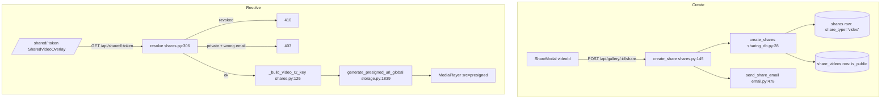
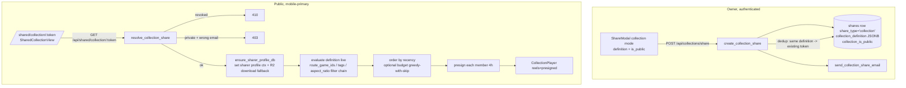

# T3620 Design: Collection Share Links + Public Viewer

**Status:** AWAITING APPROVAL
**Branch:** `feature/T3620-collection-share-links`
**Epic:** Season Highlights & Collections (task 4 of 9; T3610 merged to master)
**Task spec:** [season-highlights/T3620-collection-share-links.md](season-highlights/T3620-collection-share-links.md)
**Authoritative decisions:** [EPIC.md](season-highlights/EPIC.md) #1/#2/#9/#13/#14; this session's two user calls (below).

---

## 0. Decisions locked for this task (user, 2026-06-13)

These resolve the two open questions the post-T3610 handoff flagged. They are authoritative for T3620.

1. **Optional frozen budget in the link.** A collection link MAY carry a fixed `budget_sec`. The
   resolver applies greedy-with-skip (Python port of `budget.js::selectWithinBudget`) to trim the live
   membership to that budget. No budget => the link shows the full live collection. Until T3630 ranking
   exists, both the member order and the budget trim use **recency** (newest-first), matching the in-app
   behavior. The frozen `title` gets a duration suffix when a budget is set.
2. **Share is wired on game, smart, AND mixes collections** (user, 2026-06-13). All map onto the same
   `(scope, filter, ratio)` pipeline, evaluated live:
   - **Game** -> `scope:{type:'game', game_id}`, no tag filter.
   - **Top Plays** -> `scope:{type:'all'}`, no tag filter.
   - **Top Goals & Assists** -> `scope:{type:'all'}`, `filter:{tags:['Goal','Assist']}`.
   - **Top Dribbles** -> `scope:{type:'all'}`, `filter:{tags:['Dribble']}`.
   - **Mixes** -> `scope:{type:'mixes'}`, no tag filter. Evaluated as `route_game_ids(...) is None`
     (multi-game OR game-less), exactly mirroring `list_downloads?mixes=true`. (User approved adding
     this primitive.)

**No `season` scope.** There is no season concept in the product yet, so scope types are
`game | all | mixes` only. The all-time / smart cards use `scope:'all'`. T3640 will add `scope:'season'`
to this same pipeline when the Season card ships (no other share plumbing needed then). (User, 2026-06-13.)

---

## 1. Current State

### 1.1 What exists (verified, file:line)

Sharing today is **per-video** and per-game-teammate. There is no multi-reel, live-membership share.



| Capability | Artifact | Notes |
|---|---|---|
| `shares` table | `pg.py:98-110` | cols: `share_token, share_type CHECK(video/game/annotation_playback), sharer_user_id, sharer_profile_id, recipient_email, shared_at, revoked_at`. Detail per type: `share_videos` (has `is_public`), `share_games`. |
| Highest PG migration | `migrations/postgres/v015_platform_normalize.py` | **v016 is next.** CHECK-edit template = `v003_annotation_playback_share_type.py` (drop + re-add). |
| Create endpoint | `create_share` `shares.py:145-225` | body `{recipient_emails, is_public}`; empty emails + public => self-share; per-recipient `uuid4` token. |
| Resolve (model to copy) | `get_shared_teammate` `shares.py:249-303` | revoked->410, share_type gate; closest structural sibling. |
| Auth gates | `_get_email_from_request` `shares.py:100`; `is_public` on `share_videos` | private => email match else 403. |
| Public route allowlist | `db_sync.py:293` `'/api/shared/'` prefix | **new `/api/shared/collection/{token}` is covered automatically; no edit.** Also in `SKIP_SYNC_PATHS` (`db_sync.py:282`). |
| Presign | `generate_presigned_url_global(key, expires_in=14400)` `storage.py:1839` | 4h default; caller passes the FULL key. final_videos key = `{APP_ENV}/users/{uid}/profiles/{pid}/final_videos/{filename}` (`shares.py:126-131`). |
| Member query chain | `list_downloads` `downloads.py:209-293` | `game_id` via `route_game_ids` (`collection_metadata.py:44`), `mixes`, `tags` (OR-decode), `aspect_ratio` (indexed). Member shape `downloads.py:477-496`: `name=fv.name`, `duration=fv.duration` (nullable), `filename`. |
| Email | `send_share_email` `email.py:478`, `_build_share_email` `email.py:33`, `_get_share_url` `email.py:469`, sender-name `email.py:132-147` | Resend; dev (no key) logs URL. |
| Player (presentational) | `CollectionPlayer.jsx:28-37` | props: `reels:[{id,name,streamUrl,aspect_ratio,duration}], title, onClose, initialIndex?, onReelChange?, onEnded?, onDownload?`. Feed `streamUrl=presigned`. |
| Public page pattern | `SharedVideoOverlay.jsx` | state machine `loading/ready/forbidden/revoked/not_found/error`; 403->forbidden, 410->revoked. |
| Route detect/mount | `App.jsx:342-353` (regex), `App.jsx:611-626` (mount before auth wall) | |
| Share UI | `ShareModal.jsx` (toggle/copy/revoke/dedup, no backdrop close), `CollectionHeader.jsx:11-14,95` (disabled Share menu item + Copy-link button slots ready to wire) | |
| Profile-context for R2 (precedent) | `set_current_profile_id` (`app/profile_context.py`) used by `auto_export.py:43`, `modal_queue.py:200`, `sweep_scheduler.py:116` | established way to scope R2 ops to a profile outside request context. |

### 1.2 The two load-bearing gaps (from Code Expert audit)

1. **Opening the *sharer's* profile DB on a public request.** `_open_profile_db` (`materialization.py:24`)
   does NOT download from R2 — it returns `None` if the local cache is evicted (e.g. after a Fly machine
   restart). And `sync_database_from_r2_if_newer`/`download_from_r2`/`get_db_version_from_r2`
   (`storage.py:734/244/684`) derive `profile_id` from the **request ContextVar** (`r2_key` reads
   `get_current_profile_id()` at `storage.py:223-224`). A public collection resolve has no such context
   (and if it did, it'd be the viewer's). **The new capability** is a read-only helper that drives the
   *sharer's* `profile_id` into the ContextVar (precedent: background workers above), downloads if
   missing/stale, opens read-only, and never writes back or bumps the sharer's sync counters.
2. **No `min_rating` on the published-member path.** `list_downloads` has no rating filter. The task
   spec's `filter.min_rating` is inert today. v1 ships game + smart (tag) + season scopes only; the
   definition schema keeps a `min_rating` slot but the resolver ignores it until a rating filter exists.

---

## 2. Target State



### 2.1 Principles applied
- **Live membership, frozen title** (EPIC #1/#9, explicit-names-after-archive): only the display `title`
  is frozen into the definition; scope/filter/ratio are re-evaluated every view.
- **Read-only resolver** (CLAUDE.md persistence rule): the public resolve NEVER writes to the sharer's
  DB or bumps their sync version. Downloading the DB to local cache is a read population, not a write to
  authoritative data.
- **Reuse, don't fork** (EPIC, "leverage existing systems"): the resolver replicates the *exact*
  `list_downloads` filter chain (same `route_game_ids`, same tag decode, same `aspect_ratio` SQL) so a
  shared link and the in-app card always agree on membership (the count-parity discipline from §0.8).
- **Mobile-PRIMARY** (EPIC #14): the public viewer is designed at 360-428px first.

---

## 3. Implementation Plan

### 3.1 Database — Postgres v016 (Migration agent)

**`src/backend/app/migrations/postgres/v016_collection_shares.py`** (NEW), modeled on
`v003_annotation_playback_share_type.py`:

```python
def up(cur):
    cur.execute("ALTER TABLE shares DROP CONSTRAINT IF EXISTS shares_share_type_check")
    cur.execute("""ALTER TABLE shares ADD CONSTRAINT shares_share_type_check
                   CHECK (share_type IN ('video','game','annotation_playback','collection'))""")
    cur.execute("ALTER TABLE shares ADD COLUMN IF NOT EXISTS collection_definition JSONB")
    cur.execute("ALTER TABLE shares ADD COLUMN IF NOT EXISTS collection_is_public BOOLEAN NOT NULL DEFAULT false")
```

> **Deviation from spec, flagged:** the task spec lists only `collection_definition JSONB`. Collection
> shares still need a public/private flag for the same email-gating UX as video shares. Rather than a new
> `share_collections` detail table (heavier; the only type-specific data is one JSONB + one bool), I add
> **`collection_is_public`** directly on `shares`. The frozen `title` and `budget_sec` live *inside*
> `collection_definition`, so no extra columns. (Alternative = `share_collections` detail table to match
> `share_videos`/`share_games`; called out in §6 for your call.)

- Mirror both changes into **`_SCHEMA_DDL`** (`pg.py:101`) so fresh deploys match.
- Register `V016CollectionShares` in `migrations/postgres/__init__.py` `MIGRATIONS`.

`collection_definition` JSONB shape (single source of truth for a link):
```jsonc
{
  "scope":  { "type": "game" | "all" | "mixes", "game_id": 12 },  // no season yet (T3640)
  "filter": { "tags": ["Goal","Assist"], "min_rating": null },    // min_rating inert in v1 (§1.2)
  "aspect_ratio": "9:16",
  "budget_sec": 90,                                              // optional; null/absent => full live
  "title": "Vs Carlsbad - Portrait (1:30)"                      // frozen at create
}
```

### 3.2 Backend — `sharing_db.py`
- **`create_collection_share(sharer_user_id, sharer_profile_id, recipient_email, definition: dict, is_public: bool) -> token`**:
  insert one `shares` row (`share_type='collection'`, `collection_definition`, `collection_is_public`,
  `recipient_email`), return `uuid4` token. Mirrors `create_game_share` (`sharing_db.py:141`).
- **`find_collection_share(sharer_user_id, definition, is_public) -> token | None`**: dedup — return the
  newest non-revoked collection share whose normalized definition + visibility match (compare canonical
  JSON, ignoring `title`/`budget_sec`? **No** — title+budget are part of identity here; compare the whole
  object). Used so re-sharing the same card surfaces the existing link (task spec).
- **`get_collection_share_by_token(token)`**: row + definition (reuse `get_share_by_token`).

### 3.3 Backend — sharer-DB ensure helper (the new capability)
New read-only helper (location: `services/materialization.py` next to `_open_profile_db`, or a neutral
`services/profile_db_access.py` — picking `materialization.py` to keep DB-open logic together):

```python
def ensure_profile_db_local(user_id: str, profile_id: str) -> Path | None:
    """Read-only: guarantee the profile DB is present in the local cache, downloading
    from R2 if missing/stale. Does NOT write to the DB or bump the sharer's sync version.
    Returns the path, or None if R2 has no DB for this profile."""
    path = get_database_path(user_id, profile_id)        # database.py:401
    token = set_current_profile_id(profile_id)           # scope R2 key derivation to the SHARER
    try:
        local_v = get_local_db_version(user_id, profile_id)         # database.py:290
        downloaded, _new_v, was_error = sync_database_from_r2_if_newer(user_id, path, local_v)
        if was_error and not path.exists():
            return None
    finally:
        reset_current_profile_id(token)                  # restore (try/finally; ContextVar is task-local)
    return path if path.exists() else None
```
- Opens the resulting SQLite **read-only** (`?mode=ro` / existing read connection helper) in the resolver.
- `set_current_profile_id` returns a reset token (confirm the `profile_context` API; if it takes none,
  capture+restore the prior value). ContextVars are per-async-task, so this never leaks to other requests.

### 3.4 Backend — `routers/collections.py`
Reuse the merged module (already has `route_game_ids`, the constant, the decode helpers).

- **`POST /api/collections/share`** (auth), body `CollectionShareRequest {definition: CollectionDefinition,
  recipient_emails: list[str] = [], is_public: bool = False}`:
  - Validate definition (scope.type in {game,season,all}; ratio in {9:16,16:9}; tags subset of known).
  - Compute/confirm the frozen `title` server-side (game name via `_generate_game_display_name`, ratio
    word, optional `(m:ss)` budget suffix) — explicit-names convention; don't trust client title.
  - Empty `recipient_emails` => require `is_public=True`, self-share to sharer email (mirror
    `create_share` `shares.py:163-190`).
  - Dedup via `find_collection_share`; else `create_collection_share` per recipient.
  - `send_collection_share_email` for non-self recipients.
  - Response mirrors `ShareCreateResponse` (token, recipient, email_sent) + the public link URL.

- **`GET /api/shared/collection/{token}`** (public — under `/api/shared/` allowlist):
  - `get_collection_share_by_token` -> 404 if missing.
  - `revoked_at` -> **410**.
  - not `collection_is_public` -> `_get_email_from_request`; **403** unless matches `recipient_email`.
  - `path = ensure_profile_db_local(sharer_user_id, sharer_profile_id)`; if None -> 200 empty members
    (DB gone) — but log a warning (should not happen for a live share).
  - Open read-only; **evaluate definition** via a shared `evaluate_collection_members(conn, definition)`
    that runs the same filter chain as `list_downloads` (published-only; per scope:
    `game` -> `route_game_ids(blob)==game_id`; `mixes` -> `route_game_ids(blob) is None`; `all` -> no
    game filter; plus tag OR-decode for `filter.tags` and `aspect_ratio` SQL in every scope) and returns
    `[{id, name, duration, filename}]` ordered by **recency** (`created_at DESC` = `list_downloads` order;
    T3630 swaps in rank).
  - If `definition.budget_sec`: apply Python `select_within_budget(members, budget_sec)` (port of
    `budget.js`, same greedy-with-skip + "at least one" guard).
  - Presign each: `generate_presigned_url_global(f"{APP_ENV}/users/{uid}/profiles/{pid}/final_videos/{filename}")`.
  - Return `{title, context_line, aspect_ratio, members: [{id, name, duration, presigned_url}]}`.
    `context_line`: live copy, e.g. "Always shows the current reels for this game." Empty membership ->
    200 with `members: []` + a "no highlights yet" title (NOT 404), per spec.

- **`evaluate_collection_members`** is the single membership truth shared by create-preview (optional) and
  resolve. Keep it in `collections.py` beside the summary so future T3640/T3670/T3680 reuse it.

### 3.5 Backend — `services/email.py`
- **`send_collection_share_email(recipient_email, sharer_email, share_token, collection_title, sender_name="", is_first_touch=True)`**
  modeled on `send_share_email` (`email.py:478`). Subject/heading use `collection_title`.
- Extend `_get_share_url(token, share_type)` with a `collection` branch -> `/shared/collection/{token}`.

### 3.6 Frontend — public viewer
- **`App.jsx`**: add `collectionShareToken` via `/^\/shared\/collection\/([a-f0-9-]+)$/i`; add the
  `collection` exclusion to the video regex guard (`App.jsx:350`); mount `<SharedCollectionView token>`
  in the pre-auth-wall block (`App.jsx:619-625` pattern).
- **`components/SharedCollectionView.jsx`** (NEW, mobile-primary): state machine mirroring
  `SharedVideoOverlay` (loading/ready/forbidden/revoked/not_found/error); `apiFetch('/api/shared/collection/'+token)`
  mapping 403->forbidden, 410->revoked; build `reels = members.map(m => ({id, name, streamUrl: m.presigned_url,
  aspect_ratio: data.aspect_ratio, duration: m.duration}))`; render `<CollectionPlayer reels title={data.title}
  onClose={...}/>`; header with frozen title + context line + ratio glyph; native re-share button
  (`navigator.share({title, url})`, falling back to clipboard — generalize/copy `useWebShare`'s URL path,
  NOT its download-centric `createShareUrl`). Forbidden state offers Sign-In (mirror SharedVideoOverlay).

### 3.7 Frontend — share creation UI
- **`ShareModal.jsx`**: add a **collection mode**. New props `mode: 'video'|'collection'` (or a
  `shareTarget` object). In collection mode:
  - list/dedup: `GET` existing collection shares (add a lightweight `GET /api/collections/shares?...`
    OR return existing token from the create call's dedup — prefer the latter to avoid a new list endpoint;
    the modal shows the link returned by create).
  - create: `POST /api/collections/share` with `{definition, recipient_emails, is_public}`.
  - public toggle / copy link: build `${origin}/shared/collection/{token}`.
  - revoke: reuse `DELETE /api/shared/{token}`.
  - copy line: "this link always shows the current reels for this {game|collection}."
  - **No backdrop close** (existing modal already complies — memory: no-backdrop-close).
- **`CollectionHeader.jsx`**: enable the currently-disabled Share menu item + standalone Copy-link button
  (remove "Soon"/"coming soon"); accept `onShare`/`onCopyLink` props (presentational — parent owns modal).
- **`CollectionCard.jsx`** (+ smart/mixes card wiring): build the `definition` for game, smart, AND mixes
  cards (per §0.2 mapping), own the ShareModal open state, pass `onShare`/`onCopyLink`. Optionally let the
  share UI carry the current `budget_sec` if "Set Duration" is active — include it in the definition only
  when the user opted into a non-default duration.

### 3.8 Files (3 new, ~8 modified)
| File | Change |
|---|---|
| `migrations/postgres/v016_collection_shares.py` | NEW migration |
| `migrations/postgres/__init__.py` | register v016 |
| `services/pg.py` | `_SCHEMA_DDL`: CHECK + 2 columns |
| `db/sharing_db.py` | `create_collection_share`, `find_collection_share`, `get_collection_share_by_token` |
| `services/materialization.py` | `ensure_profile_db_local` (read-only R2 fallback) |
| `routers/collections.py` | create + resolve endpoints, `evaluate_collection_members`, `select_within_budget` |
| `services/email.py` | `send_collection_share_email`, `_get_share_url` collection branch |
| `src/frontend/src/App.jsx` | route + mount |
| `src/frontend/src/components/SharedCollectionView.jsx` | NEW public viewer |
| `src/frontend/src/components/ShareModal.jsx` | collection mode |
| `src/frontend/src/components/collections/CollectionHeader.jsx` | enable Share + Copy-link |
| `src/frontend/src/components/collections/CollectionCard.jsx` | build definition, own modal, smart+game wiring |

---

## 4. Test Plan

**Backend (`tests/test_collection_shares.py`, NEW):**
1. Definition round-trip: create -> stored JSONB equals input (title frozen server-side).
2. Live evaluation: create game share with 2 members; publish a 3rd for that game+ratio; resolve returns 3.
3. Smart (tags) evaluation: `filter:{tags:['Goal','Assist']}` returns OR-union, deduped.
4. Budget: `budget_sec` trims via greedy-with-skip; "at least one" guarantee; NULL-duration excluded.
5. Revoke -> 410. Private + wrong email -> 403; correct email -> 200. Public -> 200 no email.
6. Empty membership -> 200 with `members: []` + title (not 404).
7. **R2 fallback:** delete the local profile DB file -> resolve still returns members (downloads from R2).
   Assert no write to the sharer DB and sync version unchanged.
8. Count parity: resolve member count == `/api/downloads?game_id=..&aspect_ratio=..` count == summary `reel_count`.

**Frontend unit (Vitest):** definition-builder for game vs smart cards; budget inclusion only when opted in.

**E2E (`e2e/collection-share.spec.js`, NEW, mobile viewport 390px):** owner creates a game share ->
copy link -> open `/shared/collection/{token}` logged out -> reels play; private link blocked without email.

---

## 5. Risks

| Risk | Mitigation |
|---|---|
| **ContextVar leak / wrong-profile R2 read** | `set_current_profile_id` inside try/finally with reset; ContextVars are task-local; precedent in auto_export/modal_queue. Test 7 asserts isolation. |
| **Resolver writes to sharer DB (corruption)** | Open read-only (`mode=ro`); helper only downloads + reads; Test 7 asserts version unchanged. CLAUDE.md persistence rule. |
| **Membership drift between link and in-app card** | One shared `evaluate_collection_members` reusing the same `route_game_ids`/tag-decode/`aspect_ratio` chain as `list_downloads`; Test 8 parity. |
| **Presign latency on every public view (N presigns + DB ensure)** | Acceptable now (spec). `generate_presigned_url_global` is memoized; DB ensure is a no-op when cache warm. Short-TTL token cache noted, not built. |
| **Definition validation / injection** | Pydantic model with enum-constrained scope.type + ratio; tags validated against known set; no raw SQL from definition (filters are parameterized / Python-side). Reviewer to scrutinize. |
| **min_rating in schema but inert** | Documented (§1.2); resolver ignores it; no UI exposes it in v1. |

---

## 6. Open Questions — RESOLVED (user, 2026-06-13)

1. **Mixes share.** RESOLVED: add the `scope:{type:'mixes'}` primitive; enable Mixes card Share.
2. **Schema shape.** RESOLVED (default accepted): `collection_is_public` column directly on `shares`.
3. **Dedup identity.** RESOLVED (default accepted): full definition (incl. `title` + `budget_sec`) is the
   identity; a different budget yields a different link.
4. **Season scope.** RESOLVED: no `season` scope yet — scope types are `game | all | mixes`. The
   all-time/smart cards use `scope:'all'`; T3640 adds `season` to the same pipeline later.

---

## 7. Implementation Order
1. v016 migration + `_SCHEMA_DDL` + register (Migration agent).
2. `ensure_profile_db_local` + read-only open (the risky helper first; unit test isolation).
3. `evaluate_collection_members` + `select_within_budget` (Python).
4. create + resolve endpoints; `sharing_db` helpers.
5. `send_collection_share_email` + `_get_share_url` branch.
6. Backend tests (1-8) green.
7. `SharedCollectionView` + `App.jsx` route.
8. `ShareModal` collection mode + `CollectionHeader`/`CollectionCard` wiring (game + smart).
9. Vitest + E2E green; build.
10. Reviewer pass; then deploy checklist (staging migrate -> verify -> prod migrate).

**Deploy note:** unlike T3610, T3620 HAS a migration (Postgres v016). After merge: staging auto-deploys
-> `POST /api/admin/migrate` on staging -> verify -> prod deploy -> `POST /api/admin/migrate` on prod.
