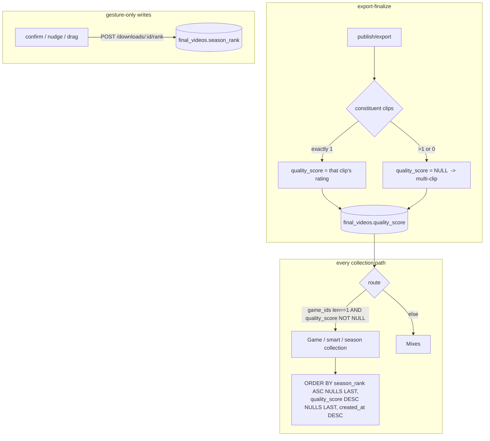

# T3630 Design: Reel Ranking Model + Insertion UX

**Status:** AWAITING APPROVAL
**Branch:** `feature/T3630-reel-ranking`
**Epic:** Season Highlights & Collections (task 5 of 9; T3610 + T3620 merged + deployed)
**Task spec:** [season-highlights/T3630-reel-ranking.md](season-highlights/T3630-reel-ranking.md)
**Authoritative:** [EPIC.md](season-highlights/EPIC.md) #3/#5/#13; the decisions in §0 below (user, 2026-06-14) refine/override the spec where they conflict.

---

## 0. Decisions locked this session (user, 2026-06-14)

1. **Unranked ordering = rating, then recency.** The canonical comparator used by EVERY
   collection read-path: `season_rank ASC NULLS LAST, quality_score DESC NULLS LAST, created_at DESC`.
2. **`quality_score` is the reel's clip rating, frozen at export-finalize** (working clips are
   deleted at publish — same reason T3600/T3605 froze duration/game_ids). It is acknowledged coarse
   (ratings saturate at 5★); it mainly floats 4★ reels below 5★. Fine-grained order is `season_rank`.
3. **Collections are single-clip reels ONLY** (game / smart / season). A single-clip reel has exactly
   one constituent clip, so `quality_score = that clip's rating` — no averaging. **Multi-clip reels get
   `quality_score = NULL` and are NOT collection-eligible; they live in Mixes.** This *tightens* the
   membership shipped in T3610/T3620 (which routed by `game_ids` only) and is implemented here.
   - Invariant: `rating` is `NOT NULL`, so a single-clip reel always gets a non-null score →
     **`quality_score IS NOT NULL` ⟺ single-clip reel**. quality_score doubles as the single-clip marker
     (no separate column).
4. **Ranking is DECOUPLED from `seasonHighlightsChoice`** (T3640's opt-in). The insertion prompt shows
   after publish when the profile has **≥2 published single-clip reels of that ratio** and the user hasn't
   dismissed it (a per-profile "don't ask again" in `user_settings`). T3640's unlock moment is about the
   Season Highlights *collection*, not about enabling ranking.

**Version correction:** the spec says "profile_db v008"; v008 is taken by T3605. This is **v009**
(EPIC.md:53 is authoritative).

---

## 1. Current State (verified, file:line)

### 1.1 Ratings & the freeze pipeline
- `raw_clips.rating INTEGER NOT NULL`, **scale 1–5** (`database.py:574`; clamp at `useAnnotate.js:492`).
- `final_videos` frozen columns (T3600/T3605): `duration`, `aspect_ratio`, `tags` BLOB, `game_ids` BLOB
  (`database.py:666-684`), stamped at export-finalize at **three INSERT sites**:
  `routers/export/overlay.py:89-99` (overlay), `overlay.py:1141-1152` (final export),
  `services/auto_export.py:180-209` (brilliant-clip auto-export).
- Constituent-clip resolution helpers (`services/collection_metadata.py`):
  - `compute_project_metadata` (live: `raw_clips` where `auto_project_id=pid OR id IN (latest working_clips)`),
  - `compute_archive_metadata` (archive `working_clips[].raw_clip_id → raw_clips`),
  - `compute_annotated_game_metadata` (`raw_clips WHERE game_id=? AND rating>=3`).
  - `route_game_ids(blob) -> game_id|None` (`collection_metadata.py:44`) — the shared game/mixes router.
- `final_videos.rating_counts` (annotated_game only) already yields a weighted average (`downloads.py:405-407`).

### 1.2 The three collection read-paths (must adopt the comparator + single-clip filter)
- `list_downloads` (`downloads.py:210`): `ORDER BY fv.created_at DESC` (line 273); game_id/mixes/tags
  filters applied in Python (lines 282-293) via `route_game_ids`.
- `evaluate_collection_members` (T3620 resolver, `collections.py:428`): `ORDER BY fv.created_at DESC`
  (line 450) — docstring already says "T3630 swaps in rank".
- `collections_summary` (`collections.py:192`): the one Python pass that buckets reels into
  games/mixes/season/smart via `route_game_ids` + tag decode.
- Frontend trusts server order (`useDownloads.js:69`, `useCollections.js:79-81` set rows directly; no
  client sort). `budget.js::selectWithinBudget` is order-preserving (consumes whatever order arrives).

### 1.3 Surgical write pattern + persistence
- `rename_download` (`downloads.py:770-786`): `UPDATE final_videos SET name=? WHERE id=? AND
  published_at IS NOT NULL`; 404 on rowcount 0; commit. **Copy verbatim for rank.**
- Middleware auto-syncs to R2 after any committed write on POST/PUT/PATCH/DELETE
  (`middleware/db_sync.py:548-631`) — the rank POST gets R2 sync for free.
- No reactive write-back anywhere in `useDownloads.js` (EPIC #5 intact).

### 1.4 Publish flow + prefs
- `publishProject()` (`ProjectManager.jsx:1762-1789`): on success → `galleryStore.fetchCount` +
  `fetchProjects`, then (if `openGallery`) reopens the panel. **Rank prompt inserts after publish
  confirmed (~line 1772), before gallery nav.**
- Per-profile prefs: `user_settings` (single-row JSON, `database.py:872`) via `/api/settings` +
  `stores/settingsStore.js` (optimistic + PUT + R2 sync). The "don't ask again" dismiss lives here.
- `collection_settings` (new v009 table) has no consumers yet — reserved for T3640's
  `season_target_duration` (created now so v009 is the epic's last profile_db migration).

### 1.5 profile_db migration system
- `migrations/profile_db/__init__.py` (RUNNER + MIGRATIONS, v008 highest). v007/v008 backfill pattern:
  ALTER (idempotent try/except) → `_backfill` over rows missing the column → per-row resolve via
  live helper, else **R2 archive recovery** (`load_archive(project_id)` when `archived_at` set), else
  warn + leave NULL. Migration runner sets user/profile context before `up()` (needed for R2 reads).

---

## 2. Target State



### 2.1 Membership rule (single source of truth, parity-critical)
A published reel is a **collection member** iff it is **single-clip** (`quality_score IS NOT NULL`).
Routing of a single-clip reel:
- `route_game_ids(game_ids) == G` → **game G** collection (a single clip is inherently single-game).
- tag match → **smart** collection(s); season bucket by date.
- game-less single-clip → Mixes (no game home), still surfaced in smart collections if tagged.

A **multi-clip** reel (`quality_score IS NULL`) and any multi-game/game-less reel → **Mixes** only.

This rule is encoded in ONE helper reused by `collections_summary`, `list_downloads`, and
`evaluate_collection_members`, preserving the count-parity invariant (member fetch count ==
summary count) from T3610 §0.8.

### 2.2 The comparator (one definition, backend SQL + frontend JS)
SQLite has no `NULLS LAST`, so the fragment is explicit:
```sql
ORDER BY (season_rank IS NULL), season_rank ASC,
         (quality_score IS NULL), quality_score DESC,
         created_at DESC
```
Frontend JS mirror (for optimistic re-sort after a rank gesture; fresh fetches use server order):
```js
// compareReels(a, b): rank asc (nulls last) -> quality desc (nulls last) -> created_at desc
```

---

## 3. Implementation Plan

### 3.1 Database — profile_db v009 (Migration agent)
**`migrations/profile_db/v009_season_rank.py`** (NEW, `version = 9`), mirroring v008:
- `ALTER TABLE final_videos ADD COLUMN season_rank REAL` (idempotent try/except).
- `ALTER TABLE final_videos ADD COLUMN quality_score REAL` (idempotent).
- `CREATE TABLE IF NOT EXISTS collection_settings (key TEXT PRIMARY KEY, value TEXT)`.
- **Backfill `quality_score`** over `WHERE quality_score IS NULL` published rows: resolve constituent
  clips per the 3-way pattern (live `compute_*`, else `load_archive` for `archived_at` rows, else
  annotated_game); **if exactly one constituent clip → that clip's rating; else leave NULL** (multi-clip).
  Per-row try/except, no abort (v008 pattern). No `season_rank` backfill (unranked by design).
- Register in `migrations/profile_db/__init__.py`.
- `database.py:666-684`: add `season_rank REAL`, `quality_score REAL` to the fresh-DB `final_videos`
  CREATE; add the `collection_settings` CREATE alongside the other tables.

### 3.2 Backend — freeze quality_score at export-finalize
- New helper in `collection_metadata.py`: `compute_quality_score(cursor, clip_ids: list[int]) -> float|None`
  → `AVG(rating)` over the clip set **only when `len(clip_ids) == 1`** (returns that single rating);
  `None` otherwise. Plus thin wrappers `compute_project_quality_score(cursor, project_id)` and
  `compute_archive_quality_score(cursor, archive)` that resolve the SAME constituent clip sets used for
  game_ids/tags, then call `compute_quality_score`. (Single-clip-only keeps it dead simple: count==1.)
- Stamp at the **three INSERT sites** (`overlay.py:92/99`, `overlay.py:1144/1152`, `auto_export.py:209`):
  add `quality_score` to the column list + value. auto_export (brilliant clip) is inherently single-clip
  → its one clip's rating.

### 3.3 Backend — ordering + single-clip membership (parity)
- `collection_metadata.py`: add `ORDER_BY_RANK` SQL fragment constant (the §2.2 fragment) and extend the
  routing helper, e.g. `route_collection(game_ids_blob, quality_score) -> ('game', gid) | ('mixes',)`:
  single-clip + len==1 → game; else mixes. Shared by all three paths.
- `list_downloads` (`downloads.py`): swap line 273 for `ORDER_BY_RANK`; SELECT `season_rank, quality_score`;
  apply single-clip filter inside the `game_id`/`tags` branches (collection fetches return single-clip
  only); `mixes=true` returns the multi-clip + multi-game + game-less set. Add an explicit
  `aspect_ratio`-scoped path already exists. (All-tab/unfiltered `GET /api/downloads` stays full-list.)
- `collections_summary`: in the Python pass, treat `quality_score IS NULL` reels as Mixes (skip
  game/smart/season accumulation); single-clip reels bucket as today. `total_reel_count` unchanged.
- `evaluate_collection_members` (T3620 resolver): SELECT + `ORDER_BY_RANK`; apply the single-clip filter
  for game/smart/season scopes (mixes scope unaffected). Game/season/smart share links now reflect rank.

### 3.4 Backend — surgical rank endpoint
- `POST /api/downloads/{final_video_id}/rank`, body `{rank: float | null}`. Copy `rename_download`:
  `UPDATE final_videos SET season_rank=? WHERE id=? AND published_at IS NOT NULL`; 404 on rowcount 0;
  commit (middleware syncs R2). `rank=null` unranks.
- **Fractional-exhaustion guard:** the endpoint computes the insertion value when given neighbors
  (optional body `{before_id, after_id}` → midpoint) OR accepts an explicit `rank`. If the gap between
  adjacent ranks `< 1e-6`, lazily renumber that ratio's ranked reels to integers in the same txn
  (documented + tested). At user scale this is theoretical.

### 3.5 Frontend — ordering selector + optimistic update
- `utils/reelOrder.js` (NEW): `compareReels(a,b)` implementing §2.2; used to re-sort cached
  `downloads`/`members` after a rank gesture (no refetch). Fresh fetches keep server order.
- `useDownloads.js` / `useCollections.js`: a `setRank(id, rank)` optimistic helper that patches the
  cached row and re-sorts via `compareReels`, firing the POST from the gesture handler (no reactive effect).

### 3.6 Frontend — insertion UX (decoupled; §0.4)
- `components/collections/RankInsertionPrompt.jsx` (NEW): single + batch modes; shows the new reel
  slotted at its suggested position (by `compareReels`) with 1–2 neighbors, up/down nudges, "Looks right"
  confirm, dismiss. **Suggested position is memory-only; only confirm/nudge POSTs.** Bottom sheet at
  ≤428px (EPIC #14, `responsiveness` skill).
- `components/collections/RankEditList.jsx` (NEW): "Edit ranking" repair list — **top ~50 by current
  order** + **search-to-place** for the tail; reorder via drag (desktop) AND per-row up/down nudge
  buttons (all widths); each change = one rank POST. (Entry point wired by T3640; component lives here.)
- `ProjectManager.jsx`: after publish success (~line 1772, before gallery nav), if the published reel is
  single-clip and the profile has **≥2 published single-clip reels of that ratio** and not dismissed →
  show `RankInsertionPrompt`. **Gating count source:** read the published reel's `aspect_ratio` from the
  publish response and the per-ratio count from `useCollections` summary (fetch if absent). **Batch
  guard:** ≥3 publishes in one session → suppress per-reel prompts, offer one "Rank your N new reels"
  swipe-through.
- `settingsStore.js`: add `rankPromptDismissed` (bool) to `user_settings` JSON for "don't ask again".

### 3.7 Files (3 new FE, 1 new migration, ~9 modified)
| File | Change |
|---|---|
| `migrations/profile_db/v009_season_rank.py` | NEW (cols + table + quality_score backfill) |
| `migrations/profile_db/__init__.py` | register v009 |
| `database.py` | fresh-DB schema: 2 cols + collection_settings |
| `services/collection_metadata.py` | quality_score helpers + `ORDER_BY_RANK` + `route_collection` |
| `routers/export/overlay.py` (×2 sites), `services/auto_export.py` | stamp quality_score |
| `routers/downloads.py` | rank endpoint; ordering + single-clip filter in list |
| `routers/collections.py` | summary single-clip routing; resolver ordering + filter |
| `src/frontend/src/utils/reelOrder.js` | NEW comparator |
| `hooks/useDownloads.js`, `hooks/useCollections.js` | optimistic setRank + re-sort |
| `components/collections/RankInsertionPrompt.jsx`, `RankEditList.jsx` | NEW |
| `components/ProjectManager.jsx` | publish-success prompt + batch detection |
| `stores/settingsStore.js` | dismiss pref |

---

## 4. Test Plan
**Backend (`tests/test_reel_ranking.py`, NEW):**
1. Rank endpoint: sets/clears `season_rank`; `published_at IS NOT NULL` precondition; 404 on bad id; midpoint insert; renumber on `<1e-6` gap.
2. Comparator: ranked-before-unranked; among unranked, higher quality first, then recency; NULLS-LAST correctness.
3. **quality_score freeze**: single-clip reel → its rating; multi-clip reel → NULL (at all 3 INSERT sites — unit via the helper).
4. **v009 backfill**: single-clip archived reel gets its rating; multi-clip gets NULL; missing archive → NULL + warn.
5. **Single-clip membership + parity**: a single-game *multi-clip* reel is excluded from the game collection and appears in Mixes; `list_downloads(game_id=..)` count == summary `reel_count` (parity holds with the filter).
6. T3620 resolver orders by rank and excludes multi-clip for game/smart/season scopes.

**Frontend (Vitest):** `compareReels` (rank/quality/recency interleave, nulls); prompt suggested-position + batch threshold; search-to-place; optimistic re-sort.

**E2E (`e2e/reel-ranking.spec.js`, mobile + desktop):** publish a 2nd single-clip reel → prompt → confirm → order changes in the collection; repair list reorders via nudge buttons.

---

## 5. Risks
| Risk | Mitigation |
|---|---|
| Reactive rank write (T350 corruption class) | Every POST traces to confirm/nudge/drag; suggested position memory-only; Reviewer checks against EPIC #5; no `useEffect`-writes. |
| Membership parity breaks with the single-clip filter | ONE shared `route_collection` helper + `quality_score IS NOT NULL` applied identically in summary/list/resolver; parity test (#5). |
| Membership change moves existing reels (T3610/T3620 behavior) | Intended (user decision §0.3). Backfill makes multi-clip reels NULL → they drop to Mixes deterministically. Documented; no data loss. |
| quality_score saturation (all 5★) | Accepted (user §0.2); season_rank is the fine-grained signal; quality only separates 4★ from 5★. |
| Fractional rank exhaustion | Lazy integer renumber at `<1e-6` gap in the endpoint; tested. |
| Gating count not on hand at publish | Use publish response `aspect_ratio` + `useCollections` summary (fetch if absent). |

## 6. Open Questions — RESOLVED (user, 2026-06-14)
1. Unranked order → rating then recency (§0.1). 2. quality_score → single clip's rating, frozen (§0.2/§0.3).
3. Collections single-clip only, tighten in T3630 (§0.3). 4. Ranking decoupled from `seasonHighlightsChoice` (§0.4).

## 7. Implementation Order
1. v009 migration (cols + table + quality_score backfill) + fresh-DB schema.
2. quality_score freeze helpers + stamp at the 3 export sites.
3. `route_collection` + `ORDER_BY_RANK`; adopt in summary + list_downloads + resolver (single-clip filter + ordering); parity tests.
4. Rank endpoint (+ renumber guard) + backend tests.
5. `compareReels` + optimistic `setRank` in hooks.
6. `RankInsertionPrompt` + publish hook + batch + dismiss pref.
7. `RankEditList` (top-50 + search-to-place + nudge/drag).
8. Vitest + E2E; Reviewer (persistence scrutiny).

**Deploy:** profile_db **v009** — after merge, `POST /api/admin/migrate` (or `fly ssh` runner) on staging → verify → prod. (Per-user SQLite sweep IS needed this time, unlike T3620, because v009 backfills profile DBs.)
