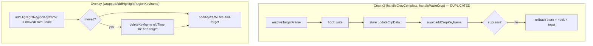
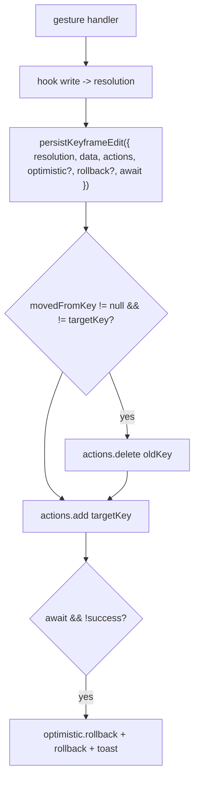

# T3800 Design — Shared Keyframe Persist Wrapper

**Stage:** 2 (Architecture) — **awaiting approval before any implementation**
**Branch:** `feature/T3800-shared-keyframe-persist-wrapper`
**Type:** DRY consolidation. **No behavior change.** Existing keyframe unit tests are the contract.

---

## 1. Current State

Three gesture handlers hand-roll the same "persist a keyframe edit" sequence. Two are
byte-for-byte twins (crop); the third (overlay) is the same shape with a different key type
and a move path.

### 1.1 Crop — `handleCropComplete` (FramingContainer.jsx:302) and `handlePasteCrop` (:648)

These two are **structurally identical**, differing only in data source (`cropData` vs
`copiedCrop`), the hook call (`addOrUpdateKeyframe` vs `pasteCropKeyframe`), and toast text.

```
1. RESOLVE identity (the fix's core):
     frame       = Math.round(time * framerate)            // raw clicked frame
     targetFrame = resolveTargetFrame(keyframes, frame)    // snap to existing kf (≤10 frames) or raw
2. CAPTURE rollback snapshot:
     previousKfData     = getCropDataAtTime(time)
     previousKf         = keyframes.find(kf => kf.frame === targetFrame)   // may be null
     previousStoreKfs   = clipCropKeyframes(selectedClip) || []
     origin             = previousKf?.origin || 'user'     // preserve boundary origin on snap
3. OPTIMISTIC hook write (UI):  addOrUpdateKeyframe / pasteCropKeyframe(time, ...)
4. OPTIMISTIC store write (sidebar indicator):
     newKf       = { frame: targetFrame, ...cropData, origin }
     updatedKfs  = [...previousStoreKfs.filter(kf => kf.frame !== targetFrame), newKf]   // surgical replace
     updateClipData(callerClipId, { crop_data: updatedKfs })
5. SURGICAL backend call (AWAITED):
     result = await framingActions.addCropKeyframe(projectId, clipId, { frame: targetFrame, ...cropData, origin })
6. ROLLBACK on !result.success:
     updateClipData(callerClipId, { crop_data: previousStoreKfs })       // store: always safe (keyed by clip id)
     if (latestSelectedClipIdRef.current === callerClipId) {              // hook: only if still on same clip
       previousKf ? addOrUpdateKeyframe(time, previousKfData, dur, previousKf.origin)
                  : removeKeyframe(time, dur)
       clear edited flags
     }
     toast.error(...)
```

### 1.2 Overlay — `wrappedAddHighlightRegionKeyframe` (OverlayScreen.jsx:631)

```
1. region = getRegionAtTime(time)
2. RESOLVE + OPTIMISTIC hook write in one call (identity lives INSIDE the hook):
     result = addHighlightRegionKeyframe(time, data)        // returns { movedFromFrame } | false
3. SURGICAL backend calls (FIRE-AND-FORGET, not awaited):
     if (result.movedFromFrame != null) {                   // hook MOVED a nearby kf onto this frame
       oldTime = frameToTime(result.movedFromFrame, framerate)
       overlayActions.deleteKeyframe(projectId, region.id, oldTime).catch(log)   // delete OLD first
     }
     overlayActions.addKeyframe(projectId, region.id, { time, ...data }).catch(log)   // add NEW
4. return !!result      // NO rollback — failures are logged only
```

### 1.3 The shared identity rule — `resolveTargetFrame` (keyframeUtils.js:87)

```js
resolveTargetFrame(keyframes, frame, tolerance = FRAME_TOLERANCE /* =10 */) => number
// i = findKeyframeIndexNearFrame(keyframes, frame, tolerance);
// return i >= 0 ? keyframes[i].frame : frame
```
Documented as the **single source of truth for keyframe identity**; the reducer and every
persist path must resolve through it. Crop uses it directly. Overlay's equivalent snap/move
logic lives in `addHighlightRegionKeyframe` and is surfaced as `movedFromFrame`.

### 1.4 Action clients (verified signatures)

```
framingActions.addCropKeyframe(projectId, clipId, { frame, x, y, width, height, origin }) -> { success, error }
framingActions.deleteCropKeyframe(projectId, clipId, frame)                                -> { success, error }
overlayActions.addKeyframe(projectId, regionId, { time, ...data })                         -> Promise
overlayActions.deleteKeyframe(projectId, regionId, keyframeTime)                           -> Promise
frameToTime(frame, framerate=30)  // videoUtils.js:103
```

### 1.5 Current flow



### 1.6 Key differences (the abstraction must respect ALL of these)

| Aspect | Crop | Overlay |
|---|---|---|
| Backend key type | `frame` (int) | `time` (seconds) |
| Snap tolerance | 10 frames | 5 frames (inside hook) |
| Snap **direction** | update-in-place at the **existing** kf's frame | **moves** existing kf to the **clicked** frame |
| Move semantics | none (`movedFromKey` always null) | `delete(old) + add(new)` |
| Identity source | `resolveTargetFrame` in container | hook return `movedFromFrame` |
| Optimistic store | hook **+** `projectDataStore` (`updateClipData`) | hook only |
| Backend call | **awaited**, `.success` checked | **fire-and-forget** `.catch(log)` |
| Rollback | full (store always, hook if same clip) | **none** |
| Scope | whole clip | per region |

> **Out of scope (do NOT change):** the opposite snap directions are reconciled separately in
> **T3820**. The rollback asymmetry (crop rolls back, overlay logs) is **existing behavior** —
> unifying it would be a behavior change and is deferred (see Open Questions).

---

## 2. Target State

One shared async helper, `persistKeyframeEdit()`, owns the persistence sequence **after** the
optimistic hook write: optional optimistic store write, **move-aware** surgical backend calls,
and optional rollback. **The backend key can only come from the resolved identity** — there is
no parameter for a raw key, so the snap-vs-raw bug becomes unrepresentable.

### 2.1 Canonical key = frame; the adapter translates to the backend's key type

Keyframe identity is frame-based everywhere internally (crop `keyframes`, overlay
`movedFromFrame`). The helper works **only in frames**. Each site supplies an `actions`
adapter that maps `(frameKey, data) -> backend call`, so the overlay adapter is the single
place `frameToTime` conversion happens.



### 2.2 Contract

```js
// src/frontend/src/utils/persistKeyframeEdit.js  (new)
//
// Normalized resolution — caller maps its own mechanism into this shape:
//   crop:    { targetKey: targetFrame,  movedFromKey: null }            // snap = update in place
//   overlay: { targetKey: clickedFrame, movedFromKey: result.movedFromFrame ?? null }
//
// actions adapter (key space = FRAMES; adapter converts to backend key type):
//   crop:    { add:(f,d)=>framingActions.addCropKeyframe(pid,cid,{frame:f,...d}),
//              del:(f)  =>framingActions.deleteCropKeyframe(pid,cid,f) }       // del unused for crop (no moves)
//   overlay: { add:(f,d)=>overlayActions.addKeyframe(pid,rid,{time:frameToTime(f,fps),...d}),
//              del:(f)  =>overlayActions.deleteKeyframe(pid,rid,frameToTime(f,fps)) }
//
async function persistKeyframeEdit({
  resolution,           // { targetKey, movedFromKey }
  data,                 // payload merged into add() (x, y, width/height | radius..., origin?)
  actions,              // { add(frameKey, data) -> Promise<Result|any>, del(frameKey) -> Promise }
  optimistic = null,    // crop only: { apply(targetKey, data), rollback() }  (store write + revert)
  rollback   = null,    // crop only: () => void  (hook revert + flags, guarded by caller)
  awaited    = false,   // crop true (check success + rollback); overlay false (fire-and-forget)
  onError    = null,    // toast/log
}) {
  optimistic?.apply(resolution.targetKey, data);

  const { targetKey, movedFromKey } = resolution;
  if (movedFromKey != null && movedFromKey !== targetKey) {
    const p = actions.del(movedFromKey);          // delete OLD before add (mirror the move)
    if (!awaited) p.catch(e => onError?.(e));
  }
  const addP = actions.add(targetKey, data);

  if (!awaited) { addP.catch(e => onError?.(e)); return; }   // overlay: fire-and-forget, identical to today

  const result = await addP;                                  // crop: awaited
  if (result && result.success === false) {
    optimistic?.rollback();
    rollback?.();
    onError?.(result.error);
  }
  return result;
}
```

### 2.3 How each site collapses onto it

**Crop** (`handleCropComplete` / `handlePasteCrop`) — identical except data source / hook call /
toast, so both pass through the same helper call:

```js
const targetFrame = resolveTargetFrame(keyframes, frame);   // unchanged: single identity source
const callerClipId = selectedClipId;
const previousStoreKfs = clipCropKeyframes(selectedClip) || [];
const previousKf       = keyframes.find(kf => kf.frame === targetFrame);
const previousKfData   = getCropDataAtTime(time);
const origin           = previousKf?.origin || 'user';

hookWrite(time, ...);                 // addOrUpdateKeyframe | pasteCropKeyframe  (unchanged)
// ...edited flags / tracking (unchanged)

await persistKeyframeEdit({
  resolution: { targetKey: targetFrame, movedFromKey: null },
  data: { x, y, width, height, origin },
  actions: {
    add: (f, d) => framingActions.addCropKeyframe(selectedProjectId, clipId, { frame: f, ...d }),
    del: (f)    => framingActions.deleteCropKeyframe(selectedProjectId, clipId, f),
  },
  optimistic: callerClipId && {
    apply: (f, d) => updateClipData(callerClipId, {
      crop_data: [...previousStoreKfs.filter(kf => kf.frame !== f), { frame: f, ...d }] }),
    rollback: () => updateClipData(callerClipId, { crop_data: previousStoreKfs }),
  },
  rollback: () => {                    // guarded the same way as today
    if (latestSelectedClipIdRef.current !== callerClipId) return;
    previousKf && previousKfData
      ? addOrUpdateKeyframe(time, previousKfData, duration, previousKf.origin)
      : removeKeyframe(time, duration);
    clipHasUserEditsRef.current = false;
    setFramingChangedSinceExport?.(false);
  },
  awaited: true,
  onError: (err) => toast.error('Failed to save crop keyframe', { message: err }),
});
```
(Guard `selectedProjectId && clipId` around the call is preserved, exactly as today.)

**Overlay** (`wrappedAddHighlightRegionKeyframe`):

```js
const region = getRegionAtTime(time);
const result = addHighlightRegionKeyframe(time, data);
if (result && canSyncActions && region) {
  const clickedFrame = timeToFrame(time, highlightRegionsFramerate);
  persistKeyframeEdit({
    resolution: { targetKey: clickedFrame, movedFromKey: result.movedFromFrame ?? null },
    data,
    actions: {
      add: (f, d) => overlayActions.addKeyframe(projectId, region.id, { time: frameToTime(f, highlightRegionsFramerate), ...d }),
      del: (f)    => overlayActions.deleteKeyframe(projectId, region.id, frameToTime(f, highlightRegionsFramerate)),
    },
    awaited: false,                    // fire-and-forget — identical to today
    onError: (err) => console.error('[OverlayScreen] Failed to sync keyframe:', err),
  });
}
setOverlayChangedSinceExport(true);
return !!result;
```

> Overlay currently passes `time` straight to the backend `add` and `frameToTime(movedFromFrame)`
> to `delete`. To keep the helper single-key-space (frames), the `add` path round-trips
> `time -> clickedFrame -> frameToTime`. **Risk check below** confirms this must be exactly
> value-preserving; if `frameToTime(timeToFrame(time)) !== time` for the backend's 0.02s
> tolerance we keep overlay's `add` keyed by the original `time` (see Open Questions Q2).

---

## 3. Implementation Plan

| # | File | Change |
|---|---|---|
| 1 | `src/utils/persistKeyframeEdit.js` (**new**, ~60 LOC) | The helper in §2.2. Pure async fn; no React/store imports. |
| 2 | `src/utils/persistKeyframeEdit.test.js` (**new**, optional ~60 LOC) | Focused unit test: move emits `del(old)` before `add(new)`; no-move emits only `add`; awaited failure triggers `optimistic.rollback` + `rollback`; fire-and-forget never rolls back. |
| 3 | `containers/FramingContainer.jsx` | `handleCropComplete` + `handlePasteCrop` call the helper; delete the inline store-write/await/rollback blocks. Keep `resolveTargetFrame`, hook writes, flags, guards. |
| 4 | `screens/OverlayScreen.jsx` | `wrappedAddHighlightRegionKeyframe` calls the helper; delete the inline move/add fire-and-forget block. |

Net: ~120 new / ~90 deleted. No store, schema, or backend change.

### Verify unchanged (Stage 5)
`npm test` — `keyframeController`, `useKeyframeController`, `keyframeIntegration`, `CropLayer`,
`useHighlightRegions` must pass **unchanged**. These exercise the reducer/hooks, not the
container wiring, so they assert the identity/snap behavior the helper must not alter.

---

## 4. Why the bug becomes unrepresentable

The original bug = a persist path computing a raw key independent of the resolved identity.
After this change the **only** path to the backend is `persistKeyframeEdit`, whose keys come
solely from `resolution.{targetKey, movedFromKey}`. There is no raw-key parameter and no second
code path. A future edit cannot reintroduce the divergence without deleting the helper.

---

## 5. Risks & Open Questions

**R1 — Behavior drift.** The whole task is "no behavior change." Mitigation: the helper is a
mechanical extraction; crop keeps `await`+rollback, overlay keeps fire-and-forget; existing
tests are the guard. Reviewer to confirm no reactive-persistence violation (helper is called
only from gesture handlers; §CLAUDE.md persistence rule upheld).

**R2 — Snap-direction asymmetry preserved.** Crop snaps to the existing frame; overlay moves to
the clicked frame. The helper is direction-agnostic (it just consumes a resolution), so both are
preserved. Unifying them is **T3820**, not here.

**Q1 — Should overlay gain rollback?** Today it does not (fire-and-forget). Adding it would be a
behavior change and is out of scope. **Proposal: keep `awaited:false` for overlay; defer rollback
to a separate task.** Confirm.

**Q2 — Overlay key round-trip.** Single-key-space (frames) requires the overlay `add` to go
`time -> frame -> time`. If that is not exactly value-preserving against the backend's 0.02s
time tolerance, behavior could shift. **Proposal: keep the overlay `add` keyed by the original
`time`** (pass `time` through `data`/closure) and only the `del(movedFromKey)` uses
`frameToTime` — exactly mirroring today, where add already uses raw `time` and delete already
uses `frameToTime(movedFromFrame)`. This keeps the canonical-frame helper while not perturbing
the add key. Confirm this is acceptable (it slightly narrows the abstraction: overlay's
`targetKey` is informational and the add closure owns the real key).

**Q3 — Helper as plain fn vs hook.** Proposed a plain async fn (most testable; crop/overlay
build adapters inline). Alternative `useKeyframePersistence` hook could close over store/refs
but couples it to React and the crop store. **Proposal: plain fn.** Confirm.

---

## 6. Approval Gate

**Awaiting your approval of:** (a) plain-fn helper with normalized `{targetKey, movedFromKey}`
resolution + frames-canonical adapter; (b) Q1 keep overlay fire-and-forget (no new rollback);
(c) Q2 overlay `add` keeps the original `time` key. On approval → Stage 4 (implement) → Stage 5
(tests green unchanged) → Stage 4.5 (review).
