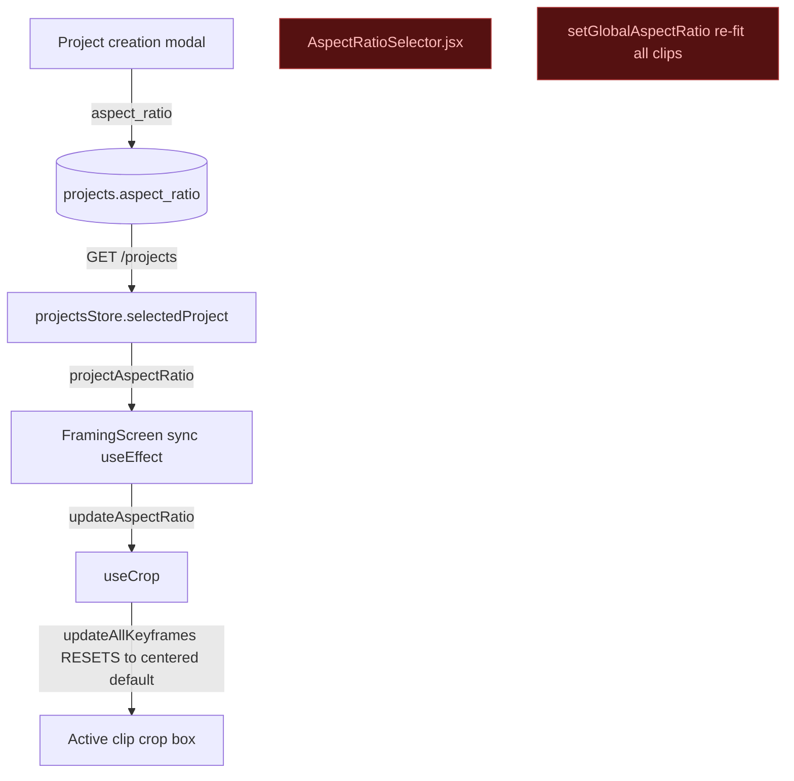
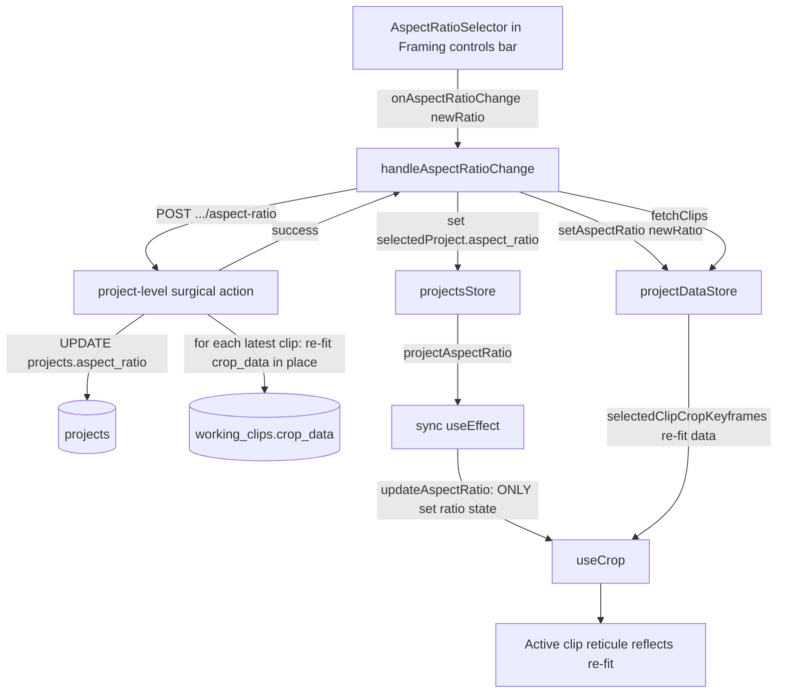

# T3910 Design: Multi-Clip Aspect Ratio Applies to All Clips

**Status:** DRAFT (awaiting approval)
**Author:** Implementor (Code Expert + Architect pass)
**Task:** [T3910-multiclip-aspect-ratio-all-clips.md](T3910-multiclip-aspect-ratio-all-clips.md)

---

## TL;DR of the Code Expert pass (important — scope is bigger than the task assumed)

The task assumes "the aspect-ratio selector applies to the current clip only." The actual
state of the code is different and more broken:

1. **There is no aspect-ratio selector rendered in Framing at all.**
   `AspectRatioSelector.jsx` and `CropControls.jsx` exist but are **never imported or
   rendered** anywhere (`grep` for `<AspectRatioSelector` / `<CropControls` → zero hits).
   The ratio is chosen at **project creation** (`GameClipSelectorModal` /
   `ProjectCreationSettings` → `projects.aspect_ratio`) and is effectively read-only in Framing.

2. **`setGlobalAspectRatio` (useClipManager.js:130) already implements a multi-clip re-fit**
   (offset-preserving, clamped) — but it is **never called** and only mutates the in-memory
   store (no persistence).

3. **The one live ratio code path is a load-time bug.** `FramingScreen.jsx:560` syncs
   `projectAspectRatio → updateAspectRatio()` (useCrop.js:261). `updateAspectRatio` calls
   `updateAllKeyframes(... newCrop)` which **overwrites every keyframe with the centered
   default**, discarding the user's framing. On any project whose ratio ≠ the hook default
   (`'9:16'`), opening a clip with custom framing resets that clip's crop to centered default.

So "settled: storage is per-reel" is **correct** (`projects.aspect_ratio`), but the change
gesture doesn't really exist yet — we are **adding** the selector + the whole gesture path,
and **fixing** the reset bug, not merely widening an existing per-clip gesture.

---

## Current State ("As Is")

### Three independent "aspect ratio" states

| State | Owner | Scope | Persisted? |
|-------|-------|-------|-----------|
| `projects.aspect_ratio` | SQLite `projects` | **per-reel (canonical)** | Yes (DB) |
| `projectDataStore.aspectRatio` (`globalAspectRatio`) | Zustand | per-reel (runtime) | No |
| `useCrop.aspectRatio` | React hook | active clip render | No |

`useProject().aspectRatio` (= `projectsStore.selectedProject.aspect_ratio`) is the DB value
surfaced to Framing as `projectAspectRatio`.

### Data flow today



### Per-clip crop storage (backend)

- Crop keyframes live in `working_clips.crop_data` (msgpack BLOB), **not** `segments_data`.
  Each keyframe: `{ frame:int, x, y, width, height, origin:'permanent'|'user'|'trim' }`.
- Surgical gesture endpoint: `POST /api/clips/projects/{project_id}/clips/{clip_id}/actions`
  (`clips.py:325`) with helpers `_get_clip_framing_data` / `_save_clip_framing_data`
  (in-place write, no version bump).
- `working_clips` also stores `width`, `height`, `fps` (T1500) — so the backend can re-fit any
  clip's crop **without** loading it in the UI.
- At export, clips with **empty** `crop_data` get a centered default for the project ratio
  (`default_crop.py` / `export/framing.py:554`). So **uncropped clips already follow the reel
  ratio** — only clips **with** crop keyframes fitted to the old ratio actually break.
- `GET /api/clips/projects/{id}/clips` returns every clip **with decoded `crop_data`**;
  `projectDataStore.fetchClips()` loads them into the store.

### Limitations

- No way to change the reel ratio from Framing.
- The only ratio path (`updateAspectRatio`) destroys the active clip's framing.
- The good re-fit logic (`setGlobalAspectRatio`) is dead and store-only (would not persist, and
  depends on `clipMetadataCache`, which is **not** populated for clips the user never opened).

---

## Target State ("Should Be")

A single reel-level gesture: pick a ratio in Framing → persist the reel ratio → re-fit **every**
clip's crop keyframes server-side (center-preserving) → refresh the UI from the authoritative
backend data. Single-clip is just N=1.



### Re-fit algorithm (center-preserving, per keyframe)

For each crop keyframe of a clip with known `width`/`height`:

```pseudo
old_center = (kf.x + kf.width/2, kf.y + kf.height/2)
(new_w, new_h) = default_crop_size(video_w, video_h, new_ratio)   # DEFAULT_CROP_SIZES or fit
new_x = clamp(round(old_center_x - new_w/2), 0, video_w - new_w)
new_y = clamp(round(old_center_y - new_h/2), 0, video_h - new_h)
result = { frame: kf.frame, origin: kf.origin, x:new_x, y:new_y, width:new_w, height:new_h }
```

- Preserves where the user pointed the crop (its center), swaps in the ratio-correct box,
  clamps to frame bounds. Matches the task's "preserve the crop CENTER and clamp."
- **Origins untouched** (`frame` and `origin` copied verbatim) → no keyframe-origin corruption
  (T350/T2000). Frame-0 permanent stays permanent.
- **Empty `crop_data` clips are left empty** — export already applies the new ratio's default,
  so re-fitting them would just duplicate the default and add churn. (No silent fallback: this
  is the documented product default in `default_crop.py`.)
- Clips with non-empty `crop_data` but missing `width`/`height`: **skip + log a warning**
  (can't re-fit without dimensions; visible, not silently wrong).

---

## Implementation Plan ("Will Be")

### Backend

| File | Change |
|------|--------|
| `app/services/default_crop.py` | Add `refit_crop_keyframes(keyframes, video_w, video_h, new_ratio)` (center-preserving, uses existing `default_crop_size`). |
| `app/routers/clips.py` | New endpoint `POST /api/clips/projects/{project_id}/aspect-ratio` body `{aspect_ratio}`: validate ratio; read old `projects.aspect_ratio`; `UPDATE projects.aspect_ratio`; for each **latest-version** working clip with non-empty `crop_data` + known dims, re-fit and write `crop_data` in place (reuse `_save_clip_framing_data` semantics — no version bump); return `{success, updated_clip_count}`. |

Notes:
- Iterate clips via `latest_working_clips_subquery()` (same as the clips list) so we only touch
  current versions.
- New box size depends only on `new_ratio`; old ratio is needed only conceptually (the center is
  ratio-independent), so we don't even need the old ratio for the center-preserving variant —
  simpler and avoids an extra read. (We still update `projects.aspect_ratio`.)
- All writes inside one connection/transaction.

### Frontend

| File | Change |
|------|--------|
| `src/modes/framing/hooks/useCrop.js` | `updateAspectRatio` → **only** `setAspectRatio(newRatio)` (+ analytics). Remove the `updateAllKeyframes` reset. Re-fit boxes now arrive via refreshed `savedKeyframes`; this also fixes the load-time reset bug. |
| `src/services/...` (or `projectDataStore`) | Add `changeProjectAspectRatio(projectId, newRatio)` → POST the new endpoint. |
| `src/screens/FramingScreen.jsx` | Add `handleAspectRatioChange(newRatio)`: skip if unchanged; `await changeProjectAspectRatio`; on success update `projectsStore` `selectedProject.aspect_ratio` + `projectDataStore.setAspectRatio(newRatio)` + `await fetchClips(projectId)`. Pass handler down to the view. |
| `src/modes/FramingModeView.jsx` | Render `AspectRatioSelector` in the desktop controls bar (~line 292) wired to `aspectRatio` (current) + `onAspectRatioChange={handleAspectRatioChange}`. |
| `src/components/AspectRatioSelector.jsx` | Reuse as-is (interactive mode). |

Single-clip projects: identical path; the action re-fits the one clip. No special-casing.

### Why server-side re-fit (not the existing `setGlobalAspectRatio`)

`setGlobalAspectRatio` re-fits from `clipMetadataCache`, which only has metadata for clips the
user has opened → unopened clips would be silently skipped. The backend has `width`/`height` for
every clip, so the server-side action re-fits **all** clips reliably, then the UI refetches the
authoritative result (single write path; no duplicated geometry in two languages drifting apart).

---

## Persistence compliance (CLAUDE.md "Gesture-Based, Never Reactive")

- The only write is fired from the **selector click handler** (a gesture). ✔
- No `useEffect` writes to backend. The sync `useEffect` only sets in-memory hook ratio state. ✔
- Surgical: sends just `{aspect_ratio}`; backend mutates only `crop_data` boxes + the ratio
  column. No full-state PUT of all keyframes. ✔
- Refetch-after-write keeps the store authoritative; runtime fixups (permanent boundaries) are
  never persisted (we copy `frame`/`origin` verbatim and don't re-run fixups server-side). ✔

---

## Risks

| Risk | Mitigation |
|------|------------|
| Active clip's framing reset on ratio change (the existing bug) | Remove the `updateAllKeyframes` reset from `updateAspectRatio`; active box now driven by refetched re-fit keyframes. |
| Keyframe-origin corruption | Re-fit copies `frame` + `origin` verbatim; only x/y/w/h change. |
| Clip missing stored `width`/`height` | Skip + warn (visible), leave its crop unchanged. |
| Exported-clip versioning | Aspect re-fit uses in-place save (no version bump), consistent with other gesture actions. |
| Refetch races with active-clip restore | `useCrop` restore effect dedupes on keyframe content and re-restores when content changes; new re-fit x/y differ → restore fires. |

---

## Resolved Decisions (user-approved 2026-06-24)

1. **Selector placement:** Framing desktop **controls bar** (`FramingModeView.jsx:292`,
   alongside Background/Zoom). Read-only ratio chip on mobile for now.
2. **Storage stays per-reel:** `projects.aspect_ratio`, no per-clip ratio column.
3. **Apply behavior:** apply **immediately** (non-destructive, center-preserving, reversible).
4. **Ratio update home:** new dedicated `POST /api/clips/projects/{id}/aspect-ratio` action
   (not folded into `PUT /projects/{id}`, which plain rename uses and must not re-fit).
