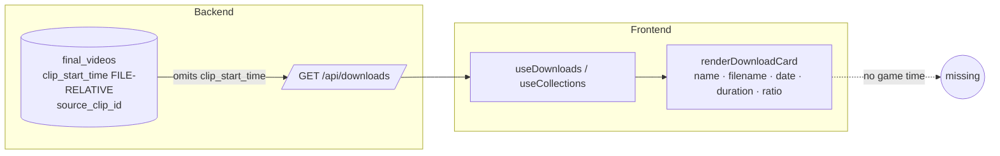

# T3920 Design: Reel Drafts Show Clip Game Time (Soccer Notation)

**Status:** Awaiting approval
**Stack:** Frontend + Backend
**Approved decisions (user):** DownloadsPanel card only · backend derives game-second · single shows / multi shows nothing · `MM'SS"` plain (no stoppage)

---

## 1. Problem

Reel Draft cards ([DownloadsPanel.jsx `renderDownloadCard`](../../../src/frontend/src/components/DownloadsPanel.jsx#L313)) show name, filename, date, duration, aspect ratio — but **not where in the game the clip came from**. Parents identify a play by its game time ("the goal at 38'"). We display each single-clip reel's start position in the source game, in soccer notation (`38'45"`).

---

## 2. Code Expert findings (what reframes this task)

### Finding A — the field already exists in the DB, just not on the payload
`final_videos` already stores **`clip_start_time REAL`** and **`source_clip_id INTEGER`**, populated at export for single-clip reels by [`compute_project_clip_identity()`](../../../src/backend/app/services/collection_metadata.py). [rank.py `_minute()`](../../../src/backend/app/routers/rank.py#L165-L169) already consumes them for the ranking card.

The gap: [`GET /api/downloads`](../../../src/backend/app/routers/downloads.py#L212) does **not** select or return `clip_start_time` / `source_clip_id`. The `DownloadItem` model ([downloads.py L182](../../../src/backend/app/routers/downloads.py#L182)) lacks them. **No new persisted column is needed** — we expose a read-time-derived field.

### Finding B — `clip_start_time` is FILE-RELATIVE, not unified game time
A clip 5 min into the 2nd half is stored as `raw_clips.start_time ≈ 300, video_sequence = 2`. The first-half duration offset is **never** applied:
- [AnnotateContainer.jsx L759-787](../../../src/frontend/src/containers/AnnotateContainer.jsx#L752) converts virtual→actual (`virtualToActual`) and stores the **per-file** time + `video_sequence`.
- [rank.py `_minute()`](../../../src/backend/app/routers/rank.py#L165-L169) adds no offset → it already mislabels 2nd-half clips (`6'` instead of `~50'`).

Correct game time = `clip_start_time + (sum of durations of game_videos before this half)`. The half durations live in `game_videos` (backend-only). This is why the derivation belongs on the backend, not the card. **We do not modify rank.py in this task** (user scoped to the DownloadsPanel card); the new offset helper is written reusably so ranking can adopt it later.

---

## 3. Current State



`raw_clips` (profile DB) carries `start_time`, `end_time`, `video_sequence`, `game_id`. `game_videos` (profile DB) carries `game_id`, `sequence`, `duration`. `final_videos.source_clip_id → raw_clips.id`.

---

## 4. Target State

```mermaid
flowchart LR
  subgraph Backend
    FV[(final_videos\nclip_start_time, source_clip_id)]
    RC[(raw_clips\nvideo_sequence, game_id)]
    GV[(game_videos\nsequence, duration)]
    H[compute_game_start_time\nstart_time + prior-half durations]
    GET[/GET /api/downloads/]
    FV --> H
    RC --> H
    GV --> H
    H -->|clip_game_start_time seconds, nullable| GET
  end
  subgraph Frontend
    GET --> DL[useDownloads / useCollections]
    DL --> CARD[renderDownloadCard]
    CARD --> FMT[formatGameClock seconds -> MM'SS\"]
    FMT --> BADGE([50'15\" badge])
  end
```

- **Single-clip reel** (`clip_start_time != null`): badge shows unified game time.
- **Multi-clip reel** (`clip_start_time == null`, the Mixes bucket today): backend returns `clip_game_start_time = null`; the card **omits** the badge. Consistent with existing data, no backfill.

---

## 5. Implementation Plan

### 5.1 Backend — expose a derived (non-persisted) unified game-second

**New helper** `src/backend/app/services/collection_metadata.py` (lives next to `compute_project_clip_identity`, reusable by ranking later):

```python
def game_offsets_for(cursor, game_ids: set[int]) -> dict[int, list[tuple[int, float]]]:
    """{game_id: [(sequence, duration), ...]} for the given games (one query)."""
    if not game_ids:
        return {}
    placeholders = ",".join("?" for _ in game_ids)
    cursor.execute(
        f"SELECT game_id, sequence, duration FROM game_videos "
        f"WHERE game_id IN ({placeholders})",
        list(game_ids),
    )
    out = {}
    for r in cursor.fetchall():
        out.setdefault(r["game_id"], []).append((r["sequence"], r["duration"] or 0.0))
    return out

def unified_game_start(clip_start_time, video_sequence, game_id, offsets) -> float | None:
    """File-relative start + sum of durations of halves before this one.
    None when clip_start_time is None (multi-clip / unknown). First/single
    video (sequence None or <=1) -> no offset."""
    if clip_start_time is None:
        return None
    if not video_sequence or video_sequence <= 1:
        return float(clip_start_time)
    prior = sum(d for seq, d in offsets.get(game_id, []) if seq is not None and seq < video_sequence)
    return float(clip_start_time) + prior
```

**`GET /api/downloads`** ([downloads.py](../../../src/backend/app/routers/downloads.py#L257)):
- Add to the SELECT: `fv.source_clip_id`, `fv.clip_start_time`, and via `LEFT JOIN raw_clips rc ON rc.id = fv.source_clip_id` → `rc.video_sequence AS clip_video_sequence`, `rc.game_id AS clip_game_id`.
- After fetching rows: collect `clip_game_id` for rows where `clip_video_sequence > 1`, call `game_offsets_for(...)` **once**, then compute `clip_game_start_time` per row via `unified_game_start(...)`.
- Add `clip_game_start_time: Optional[float] = None` to `DownloadItem` ([L182](../../../src/backend/app/routers/downloads.py#L182)) and pass it in the constructor.

No schema change, no migration. (We are NOT persisting a column — `clip_game_start_time` is computed per request.)

### 5.2 Frontend — formatter + badge

**`src/frontend/src/utils/timeFormat.js`** — new `formatGameClock`:

```javascript
/**
 * Soccer game-clock notation: MM'SS" (true elapsed, not the "Nth minute" +1
 * form used for minute-only display). 0s -> 0'00", 2325s -> 38'45".
 * @param {number|null|undefined} seconds - unified game seconds
 * @returns {string|null} formatted mark, or null when unknown
 */
export function formatGameClock(seconds) {
  if (seconds == null || isNaN(seconds) || seconds < 0) return null;
  const minutes = Math.floor(seconds / 60);
  const secs = Math.floor(seconds % 60);
  return `${minutes}'${String(secs).padStart(2, '0')}"`;
}
```

**`DownloadsPanel.jsx` `renderDownloadCard`** ([L392-400](../../../src/frontend/src/components/DownloadsPanel.jsx#L392)) — add the badge to the metadata row, mirroring ReelMatchCard's cyan mono minute style:

```jsx
{(() => {
  const mark = formatGameClock(download.clip_game_start_time);
  return mark ? (
    <>
      <span aria-hidden>·</span>
      <span className={`shrink-0 font-mono ${REEL.accent}`} title="Game time">{mark}</span>
    </>
  ) : null;
})()}
```

(Or a small `GameTimeBadge` inline — final placement is presentational, keeps the no-badge path clean when `mark` is null.)

**Display-only / no reactive persistence:** the card reads `download.clip_game_start_time` and formats it. No `useEffect`, no store write, no write-back. Compliant with the gesture-based-persistence rule.

---

## 6. The minute convention (deviation, called out)

The task grounding and the approved format option referenced `floor(sec/60)+1` "to match backend `_minute()`". That `+1` is the live-soccer "Nth minute" convention and is **only coherent for minute-only display**. With seconds shown, true elapsed is required: `38'45"` must equal 2325s = `floor(2325/60)=38` min + `45` s. Using `+1` would render 2325s as `39'45"`, contradicting the task's own example (`38'45"`). **Decision: `formatGameClock` uses `floor` (no `+1`).** rank.py's minute-only card is untouched and keeps its `+1`.

---

## 7. Tests (Stage 3)

**Frontend unit (Vitest)** — `src/frontend/src/utils/timeFormat.test.js` (or new file):
- `formatGameClock`: `0 -> "0'00\""`, `45 -> "0'45\""`, `60 -> "1'00\""`, `2325 -> "38'45\""`, `3015 -> "50'15\""`, `null -> null`, `undefined -> null`, `-5 -> null`, `NaN -> null`.
- **Card rendering** (DownloadsPanel): single-clip reel (`clip_game_start_time` set) renders the badge; multi-clip reel (`clip_game_start_time: null`) renders no badge.

**Backend (pytest)** — `unified_game_start`:
- 1st-half / single video (seq null or 1): returns `clip_start_time` unchanged.
- 2nd-half (seq 2, offsets `{game: [(1, 2715), (2, ...)]}`, start 300): returns `3015`.
- `clip_start_time = None` (multi-clip): returns `None`.
- `/api/downloads` integration: response includes `clip_game_start_time` correct for a 2nd-half single-clip reel and `null` for a multi-clip reel.

---

## 8. Risks & Open Questions

- **2nd-half data availability:** `game_videos.duration` must be populated for the offset to be correct. If a half's duration is missing, the offset under-counts. Per coding standards (no silent fallback for internal data), if `clip_video_sequence > 1` but no prior-half duration is found, the value is still returned (start_time only) — acceptable since it degrades to file-relative, but I'll `log`/warn server-side so it's visible rather than silently wrong. **Confirm this is the desired degrade behavior.**
- **`source_clip_id` null on older single-clip reels:** if `clip_start_time` was backfilled but `source_clip_id`/`video_sequence` can't be joined, offset defaults to 0 (file-relative). For single-video games this is correct; for multi-video it would under-count. Low incidence; flagged.
- **Scope:** ranking card (`ReelMatchCard` / rank.py `_minute`) keeps its existing 2nd-half mislabel — out of scope per the approved surface decision. The helper is written so a follow-up can fix it.

---

## 9. Files changed

| File | Change |
|------|--------|
| `src/backend/app/services/collection_metadata.py` | + `game_offsets_for`, `unified_game_start` helpers |
| `src/backend/app/routers/downloads.py` | SELECT + JOIN clip fields; compute + return `clip_game_start_time`; `DownloadItem` field |
| `src/frontend/src/utils/timeFormat.js` | + `formatGameClock` |
| `src/frontend/src/components/DownloadsPanel.jsx` | render game-time badge in `renderDownloadCard` |
| `src/frontend/src/utils/timeFormat.test.js` | formatter tests |
| backend test file | `unified_game_start` + endpoint tests |
| `src/frontend` card test | badge render / no-badge tests |
