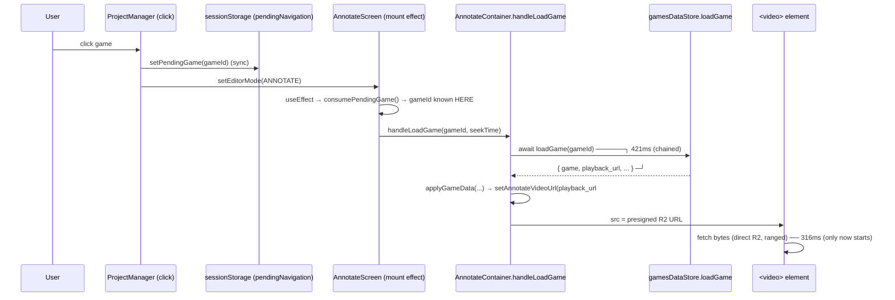
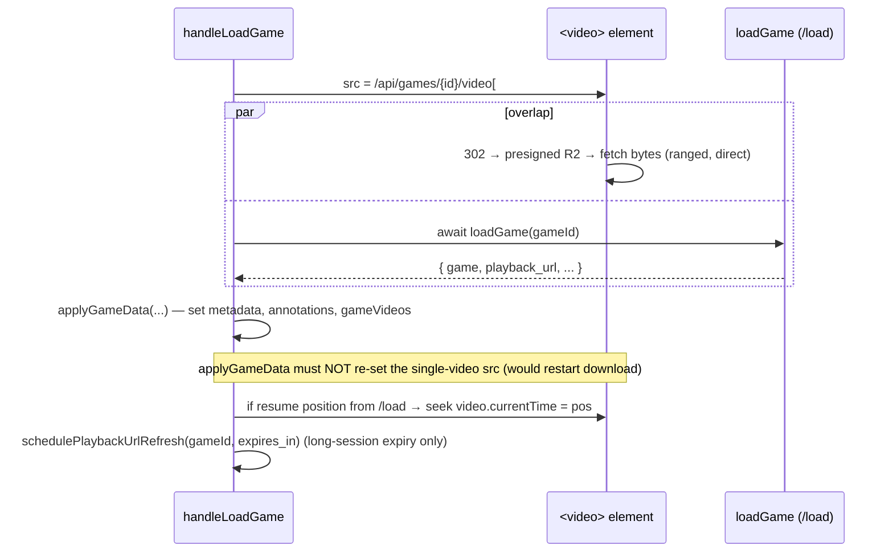

# T4000 Design — Parallelize Game Video Fetch With `/load`

**Status:** Awaiting architecture approval (design gate)
**Branch:** `feature/T4000-parallelize-game-video-fetch`
**Stack:** Frontend-only (both backend endpoints already exist)

## Problem (recap)

Opening a saved game is two **sequential** round-trips. The `<video>` src is set from
`/load`'s presigned `playback_url`, so the video byte fetch cannot begin until `/load`
returns. The two costs add (~421ms + ~316ms ≈ 762ms) instead of overlapping.

The durable, code-level win: set the video src from a **stable, gameId-only** URL at the
moment the game is opened, so the video fetch runs concurrently with `/load`.

---

## Current State

### Flow (single video, the common / measured case)



### Key code references (verified)

- **Earliest point gameId is known after navigation:** `AnnotateScreen.jsx:364-382`
  `useEffect` → `consumePendingGame()` returns `{ gameId, seekTime, sourceClipId }`, then
  calls `handleLoadGame(pending.gameId, pending.seekTime)`. This runs **before** any await.
- **src is set late:** `AnnotateContainer.jsx:514-537` inside `applyGameData`, which only
  runs **after** `await loadGame` (`AnnotateContainer.jsx:583`). `setAnnotateVideoUrl` at L537.
- **Today's src source:** `playbackUrlData.url` (presigned R2, direct) when present, else
  `${API_BASE}/api/games/{id}/stream` fallback (`AnnotateContainer.jsx:515-520`).
- **Resume / seek suffix:** `#t=` appended from `pendingClipSeekTime` (known at click time) OR
  `last_playhead_position` / `viewed_duration` (only known from `/load`)
  (`AnnotateContainer.jsx:521-536`).
- **Refresh:** `schedulePlaybackUrlRefresh` (`AnnotateContainer.jsx:124-140`) — timer at 75% of
  TTL re-fetches `/api/games/{id}/playback-url` and calls `setAnnotateVideoUrl(data.url)`.
  Depends only on `gameId` + `expires_in`, **not** on the presigned URL being first-paint src.
- **Backend endpoints (no change needed):**
  - `GET /api/games/{id}/load` (`games.py:2111`) → returns `playback_url`, `expires_in=14400`
    (4h), plus annotations/videos/teammate data (heavy multiplex).
  - `GET /api/games/{id}/video` (`games.py:1452`) → **302 redirect** to a freshly-minted
    presigned R2 URL, full video, serves `sequence=1`.
  - `GET /api/games/{id}/stream` (`games.py:2235`) → **bounded streaming proxy** (moov +
    clip-region windows), R2→Fly→client via httpx, Range/206 support, serves `sequence=1`.
- **Faststart confirmed:** all encode paths emit `-movflags +faststart`
  (`modal_functions/video_processing*.py`), and `storage.py:496-504` probes and logs an
  **error** on `MOOV-AT-END` before upload. So stored game MP4s have moov at the front.

---

## Target State

Set `annotateVideoUrl` to a **stable gameId-only URL** at the start of `handleLoadGame`,
**before** `await loadGame`. Let `/load` resolve in parallel; it no longer gates first paint.



### Pseudo code (single-video path)

```js
const handleLoadGame = async (gameId, pendingClipSeekTime = null) => {
  // NEW: stable, gameId-only first-paint src set immediately (gesture, no await)
  let earlySrc = `${API_BASE}/api/games/${gameId}/video`;
  if (pendingClipSeekTime != null) earlySrc += `#t=${pendingClipSeekTime}`;
  setAnnotateVideoUrl(earlySrc);            // fetch begins now, parallel with /load

  const loadResult = await loadGame(gameId); // unchanged, runs concurrently
  // ... applyGameData(...) but DO NOT overwrite the single-video src ...
  // resume position (from /load) applied via seek, not via a new src:
  if (!isMultiVideo && resumePos > 0 && pendingClipSeekTime == null) {
    seekVideoTo(resumePos); // currentTime = resumePos once metadata ready (read action)
  }
  schedulePlaybackUrlRefresh(gameId, loadResult.playback_url.expires_in);
};
```

`applyGameData` is changed so that, for the single-video case, it **does not** call
`setAnnotateVideoUrl` again (the src is already set). It still sets metadata, annotations,
`gameVideos`, shares, and schedules the refresh.

---

## Open Questions — Answers

### Q1. `/stream` (proxy) vs `/video` (302 → direct R2)? — **Recommendation: `/video`**

**Decision: use `/api/games/{id}/video` (302 → direct R2).**

Reasoning:

1. **Keeps bytes off the contended box — directly serves the goal.** The diagnosed cause is a
   transient **shared-vCPU contention spike on the Fly box**. `/stream` proxies the entire
   byte stream R2→Fly→client through that exact box (httpx `StreamingResponse`, 4MB chunks),
   so it loads the contended resource precisely when it's already stressed. `/video` touches
   Fly only for a sub-millisecond 302; all bytes flow **direct from R2**, bypassing Fly.

2. **Bounded windows buy little here, because the files are faststart and the browser ranges
   natively.** `/stream`'s value is bundling the moov + clip windows so a non-faststart MP4
   doesn't force a tail fetch. But every encode path emits `+faststart` and `storage.py`
   errors on `MOOV-AT-END`, so **moov is at the front**. Against a direct presigned R2 URL the
   `<video>` element issues its own HTTP Range requests and fetches only the moov + the played
   ranges — not the whole file. The HAR confirms this: game 7 transferred **1.24MB**, not the
   full game, over the existing direct-presigned (`playback_url`) path. So for first paint and
   normal playback, `/video` already transfers about what `/stream` would, without the Fly hop.

3. **Lowest risk: it reproduces the transport that already works.** Today's `playback_url` is a
   direct presigned R2 URL — functionally identical transport to what `/video` redirects to.
   We are not introducing a new byte path; we are moving the **same** direct-R2, ranged fetch
   **earlier** so it overlaps `/load`. `/stream` would be a new transport on the hot path.

**Quantification.** Bounded windows only shrink transfer materially for **large** games
(hundreds of MB / GB) AND only when the client would otherwise fetch the whole file — which a
faststart MP4 + native Range never does. Window budget per `/stream` request is moov (≤10MB) +
per-clip padded windows (2s pre / 5s post, ≥5MB each, overlaps merged) + 10MB tail. For the
measured 1.24MB game the "bounded" window is ≥ the whole file, so savings are zero while the
cost (Fly egress + contention) is non-zero. For large games, native ranging on `/video` already
fetches only what's watched, so `/stream`'s marginal saving is "ranges the user never seeks to"
— paid for with the very contention we're fixing. Net: `/video` wins on the metric that matters
(spike tolerance) and is no worse on bytes for faststart files.

**Caveat / fallback.** If a game's MP4 were ever **not** faststart (moov at end), `/video`'s
native ranging would force a large tail fetch on first paint, and `/stream`'s bundled moov would
win. Producer enforcement makes this unlikely, but `/stream` stays the documented fallback. The
`else`-branch fallback to `/stream` when there is no stable video (`applyGameData:519`) is
retained.

### Q2. Presigned `playback_url` becomes metadata/expiry-refresh only — refresh still works?

**Yes.** `schedulePlaybackUrlRefresh` (`AnnotateContainer.jsx:124-140`) needs only `gameId` and
`expires_in` from `/load`; it independently re-fetches `/api/games/{id}/playback-url` at 75% TTL.
It does **not** require the presigned URL to have been the first-paint src. First paint is the
stable `/video` URL; the presigned URL is captured from `/load` purely to schedule the long-
session (4h TTL) refresh.

**Must NOT switch src mid-load:** changing `annotateVideoUrl` after the fetch begins restarts the
download. So:
- `applyGameData` will **not** re-set the single-video src after `/load` lands.
- The refresh timer's `setAnnotateVideoUrl(data.url)` swap is unchanged from today — it fires
  only ~3h into a session (75% of 4h), long after first paint, and is pre-existing behavior. It
  is not a first-paint concern. (If we later want zero mid-session reloads, the stable `/video`
  endpoint could be kept as the permanent src and the refresh swap dropped — noted as a possible
  follow-up, **not** part of this task.)

### Q3. Where to set src + resume position

**Where:** inside `handleLoadGame`, **before** `await loadGame` (`AnnotateContainer.jsx:583`).
`handleLoadGame` already receives `gameId` and `pendingClipSeekTime`, runs on the open-game
gesture, and is the natural single place to set the early src without touching AnnotateScreen.

**Seek-to-clip (`#t=`) — preserved at click time.** `pendingClipSeekTime` is known at click time
(carried through `setPendingGame`/`consumePendingGame`). Append it to the early src:
`/api/games/{id}/video#t={seekTime}`. No regression.

**Resume position — start at t=0, seek when `/load` lands.** `last_playhead_position` /
`viewed_duration` are only known from `/load`, which by design now runs in parallel. So:
- If `pendingClipSeekTime` present → early src carries `#t={seekTime}` (clip seek wins).
- Else → early src has no suffix (first paint at **t=0**); when `/load` resolves, seek the
  element to `last_playhead_position` (fallback `viewed_duration`) via a one-shot
  `video.currentTime = pos` once metadata is ready. This is a **read** action, not persistence.

Net behavior change: resume position is applied ~one `/load` (~420ms) later instead of via the
initial `#t=`. Acceptable — the video is buffering during that window anyway, and the wall-clock
win is the whole point.

**Multi-video (`isMultiVideo`).** At click time we don't yet know arity. `/video` serves
`sequence=1`, which is the first video shown, so the early src is correct for the first paint of
both single- and multi-video games. `applyGameData` then populates `gameVideos` (per-video
presigned URLs) for the ping-pong path as today. **Open item to verify in implementation:**
confirm `useAnnotationPlayback` drives multi-video playback from `gameVideos[activeIndex]` (so
the early `annotateVideoUrl` is harmlessly superseded for video 1 rather than conflicting). If
the multi-video path keys off `annotateVideoUrl`, we scope the early-src optimization to the
single-video case only (the measured common case) and leave multi-video unchanged.

### Q4. Gesture-based, no reactive persistence

**Compliant.** Setting the early src is part of the open-game gesture chain
(user click → `setPendingGame` → `consumePendingGame` → `handleLoadGame`). It is a **read/load**
path: no DB/store writes, no `useEffect` watching state to persist. The post-`/load` resume seek
is also a read action (`currentTime = pos`). No reactive write-back is introduced. We will not
add any `useEffect` that watches `annotateVideoUrl` and writes.

---

## Implementation Plan (after approval)

Files to change (all frontend):

1. **`AnnotateContainer.jsx`**
   - In `handleLoadGame` (L576), set `setAnnotateVideoUrl(\`${API_BASE}/api/games/${gameId}/video\`
     [+ \`#t=${pendingClipSeekTime}\`])` **before** `await loadGame(gameId)`.
   - In `applyGameData` (L466), stop calling `setAnnotateVideoUrl` for the single-video case
     (keep the `/stream` `else`-branch only as the no-stable-URL fallback). Move resume-position
     handling to a post-load seek.
   - Add a one-shot resume seek (currentTime) for the single-video, non-clip-seek case.
2. **(verify only) `useAnnotationPlayback` / multi-video wiring** — confirm multi-video uses
   `gameVideos`, not `annotateVideoUrl`, for first paint (Q3 open item). Adjust scope if not.

Likely **no backend change** (both endpoints exist).

## Tests (after approval)

- **Failing-first unit:** assert `annotateVideoUrl` is set to a stable gameId-only URL
  **before** `loadGame` resolves (e.g. mock `loadGame` to a pending promise; assert
  `setAnnotateVideoUrl` already called with `/api/games/{id}/video`).
- Preserve: seek-to-clip (`#t=` from `pendingClipSeekTime`), resume position (post-load seek),
  multi-video playback.
- E2E: annotate open-game, resume position, seek-to-clip, multi-video.
- Manual: re-capture a HAR; assert the video request start is no longer gated by `/load`
  completion (the two overlap).

## Risks & Open Items

- **R1 — Multi-video first-paint source (Q3).** Verify `useAnnotationPlayback` drives multi-video
  from `gameVideos`. If it keys off `annotateVideoUrl`, scope early-src to single-video only.
- **R2 — Non-faststart games.** If any stored MP4 has moov-at-end, `/video` over-fetches on first
  paint; `/stream` is the fallback. Producer enforcement makes this low-risk.
- **R3 — Resume-position UX.** First paint at t=0 then a seek when `/load` lands (a ~420ms-late
  jump) instead of starting at the resume point. Acceptable trade for the parallelism win;
  confirm with user if undesirable.
- **R4 — Expiry on very long sessions.** Stable `/video` src + existing 75%-TTL refresh swap is
  unchanged; no new regression.
