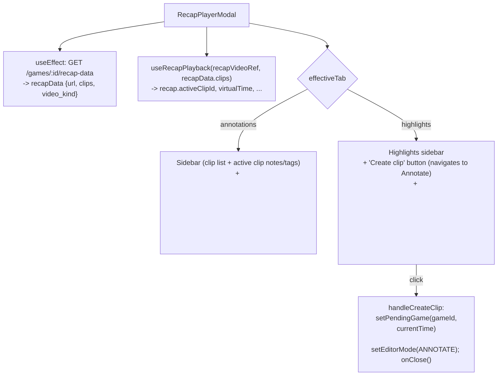
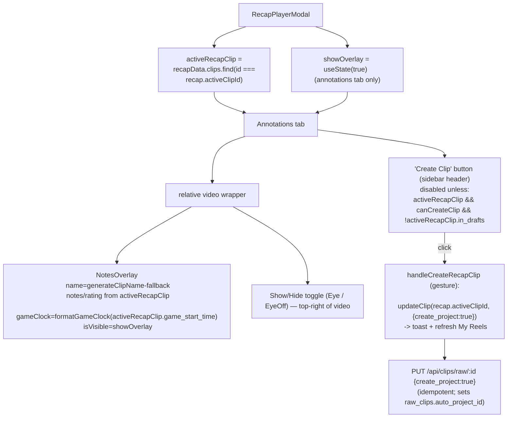

# T4130 — Recap Playback Annotations Overlay + Real "Create Clip" (Design)

> **Status: AWAITING ARCHITECTURE APPROVAL.** Stage 1–2 only. No feature code written.
> Branch: `feature/T4130-recap-annotations-overlay-and-create-clip`.

> ⚠️ **Spec note:** The kickoff referenced
> `docs/plans/tasks/T4130-recap-annotations-overlay-and-create-clip.md`, which does **not**
> exist in this clone (and T4130 is not in `PLAN.md`). This design is reconstructed from the
> kickoff's *Confirmed Decisions / Key Facts / 4 open questions* plus the live source. If a
> fuller spec exists on the supervisor side, reconcile before implementing.

## Scope (confirmed, not re-litigated)

- **UI only.** No storage / sweep / per-clip-source / R2 / grace-period changes. "Always
  preserve clip source" is a **deferred** follow-up, explicitly out of scope.
- Overlay: **visible by default**, with a show/hide toggle. **Annotations tab only.**
- Create Clip target = the currently-active recap clip (no new selection UI).
- Create Clip enabled only when: a clip is active **AND** a source exists (`canCreateClip` =
  `recapData.video_kind != null`) **AND** the active clip is **not already a draft**.

---

## Current State



Key facts about today's code (`src/frontend/src/components/RecapPlayerModal.jsx`):

- The **Annotations tab video has no overlay.** Active clip name/notes/tags are shown only in
  the left **sidebar** (lines ~268–305).
- `recap.activeClipId` (from `useRecapPlayback`) already tracks the active clip; the clip
  objects carry `{id, name, rating, tags, notes, recap_start, recap_end, game_start_time?}`
  where **`id` IS the `raw_clip` id** and `game_start_time` is the unified in-match start
  (added in T4080).
- `canCreateClip = recapData.video_kind != null` (line 118) already exists.
- `handleCreateClip` (line 161) is **not a real create** — it navigates to Annotate at the
  current time. It is only wired to the **Highlights** tab button (lines 372–382).
- `NotesOverlay` (`src/frontend/src/modes/annotate/components/NotesOverlay.jsx`) already
  renders name + rating notation + notes + game clock; it positions `absolute` and needs a
  positioned ancestor. Props: `{name, notes, rating, gameClock, isVisible, isFullscreen, isMobile}`.

Create-draft mechanics (backend `src/backend/app/routers/clips.py`):

- `PUT /api/clips/raw/{id}` with `{create_project: true}` (`update_raw_clip`, ~line 1062)
  creates the auto-project ("draft reel") for an **existing** clip by id, and is **idempotent**:
  if the clip already has `auto_project_id`, it skips and reports `project_created: false`.
- `POST /api/clips/raw/save` keys on the natural key `(game_id, end_time, video_sequence)`.

---

## Target State



Backend change (minimal): surface a per-clip **draft flag** on `recap-data` so the button's
disabled state is correct.

```python
# games.py get_recap_data enrichment loop (~1137) — already iterates raw_clips by clip id.
# Add auto_project_id to the SELECT and expose a boolean.
rc = _cur.execute(
    "SELECT start_time, auto_project_id FROM raw_clips WHERE id = ?", (c.get('id'),)
).fetchone()
if rc:
    if rc['start_time'] is not None:
        c['game_start_time'] = compute_unified_clip_start(_cur, c['id'], rc['start_time'])
    c['in_drafts'] = rc['auto_project_id'] is not None
```

Frontend pseudo (`RecapPlayerModal.jsx`, additions only):

```jsx
import { Eye, EyeOff } from 'lucide-react';
import { NotesOverlay } from '../modes/annotate/components/NotesOverlay';
import { formatGameClock } from '../utils/timeFormat';
import { generateClipName } from '../utils/clipDisplayName';
import { useRawClipSave } from '../hooks/useRawClipSave';
import { useProjectsStore } from '...';   // for fetchProjects (mirror AnnotateContainer)
import { toast } from './shared/Toast';

const [showOverlay, setShowOverlay] = useState(true);
const { updateClip, isSaving } = useRawClipSave();

const activeRecapClip = useMemo(
  () => (recapData?.clips || []).find(c => c.id === recap.activeClipId) || null,
  [recapData, recap.activeClipId]
);

const createClipEnabled = canCreateClip && !!activeRecapClip && !activeRecapClip.in_drafts;

const handleCreateRecapClip = useCallback(async () => {       // GESTURE handler — no useEffect
  if (!activeRecapClip || !createClipEnabled) return;
  const result = await updateClip(activeRecapClip.id, { create_project: true });
  if (result?.project_id) {
    toast.success(result.project_created ? 'Reel created!' : 'Reel already exists', { duration: 5000 });
    useProjectsStore.getState().fetchProjects({ force: true });
    // in_drafts is server-derived; refetch recap-data OR optimistically mark active clip.
  }
}, [activeRecapClip, createClipEnabled, updateClip]);

// In the Annotations-tab video block: make the wrapper `relative` (non-fullscreen branch
// currently is not) and mount the overlay + toggle:
{recapData?.url && (
  <div className="relative ...">
    <video ref={recapVideoRef} src={recapData.url} autoPlay ... />
    {activeRecapClip && (
      <NotesOverlay
        name={activeRecapClip.name ||
              generateClipName(activeRecapClip.rating, activeRecapClip.tags, activeRecapClip.notes)}
        notes={activeRecapClip.notes}
        rating={activeRecapClip.rating}
        gameClock={formatGameClock(activeRecapClip.game_start_time)}
        isVisible={showOverlay}
        isFullscreen={isFullscreen}
        isMobile={isMobile}
      />
    )}
    <button onClick={() => setShowOverlay(v => !v)} className="absolute top-2 right-2 z-50 ...">
      {showOverlay ? <EyeOff size={16}/> : <Eye size={16}/>}
    </button>
  </div>
)}

// In the Annotations-tab sidebar header (mirrors the Highlights tab's button placement):
{createClipEnabled && (
  <Button variant="ghost" size="sm" icon={Plus} onClick={handleCreateRecapClip}
          disabled={isSaving} title="Create a draft reel from this clip">
    Create clip
  </Button>
)}
```

---

## Implementation Plan (files + changes)

| # | File | Change | LOC |
|---|------|--------|-----|
| 1 | `src/backend/app/routers/games.py` | In `get_recap_data` enrichment loop, add `auto_project_id` to the existing `raw_clips` SELECT and set `c['in_drafts'] = auto_project_id is not None`. No new query/loop. | ~3 |
| 2 | `src/frontend/src/components/RecapPlayerModal.jsx` | Add `showOverlay` state (default true); derive `activeRecapClip`; wrap Annotations `<video>` in a `relative` container; mount `NotesOverlay` + Eye/EyeOff toggle; add `useRawClipSave` + `handleCreateRecapClip`; add Annotations-tab "Create clip" button gated on `createClipEnabled`. | ~70 |
| 3 | `src/frontend/src/components/RecapPlayerModal.test.jsx` | Add tests: overlay visible-by-default + toggle hides/shows; overlay Annotations-tab-only; Create Clip enable/disable matrix (no active clip / no source / `in_drafts` true → disabled); click fires `updateClip(id,{create_project:true})` once. | ~60 |
| 4 | (optional) backend test | If touching `recap-data`, assert `in_drafts` present + correct for a clip with/without `auto_project_id`. | ~20 |

**MVC / persistence guardrails honored:**
- Create Clip persists **from the click handler** (gesture), surgically (PUT by id). **No
  `useEffect` watching state to write.**
- No new write path: reuses `useRawClipSave.updateClip` (existing).
- `showOverlay` is ephemeral view state — never persisted.
- No `console.log` in committed code.
- After the backend edit: `cd src/backend && .venv/Scripts/python.exe -c "from app.main import app"`.

---

## Resolved Open Questions (recommended answers)

### Q1 — `in_drafts` detection → **surface `auto_project_id` as a boolean on each recap clip**
A "draft" is a Reel/project. A recap clip's `id` is its `raw_clip` id; a draft reel created
from it sets `raw_clips.auto_project_id`. **Recommend:** add `c['in_drafts'] = auto_project_id
is not None` in the recap-data enrichment loop (which already SELECTs that row). This mirrors
the backend's own dedup (`update_raw_clip` skips when `auto_project_id` is set), so the button
just reflects server truth and prevents a no-op click. Lightest correct option; no new query.
*Caveat:* this detects the **auto-project** draft only (the one Create Clip makes). A manually
created project referencing the same clip is not counted — acceptable, since the button's job
is to avoid creating a **duplicate auto-draft**.

### Q2 — game-relative times / `video_sequence` source → **avoid it: create the draft by `raw_clip` id**
**Recommend `updateClip(activeRecapClip.id, {create_project:true})` (PUT `/clips/raw/{id}`)
rather than `POST /clips/raw/save`.** Because the recap clip already *is* a `raw_clip` with a
known id, the id-based update needs **no** game-relative `start_time`/`end_time` and **no**
`video_sequence` — Q2 disappears. It is idempotent and **cannot create a duplicate `raw_clip`**.
> **Deviation flag:** the kickoff Key Facts named the `saveClip` → `POST /clips/raw/save`
> path. `updateClip` is still part of `useRawClipSave` (not a parallel path), and is the
> *correct* analogue here because the clip exists. The `saveClip` natural-key path
> `(game_id, end_time, video_sequence)` would require surfacing game-relative `end_time` +
> `video_sequence` on `recap-data` (heavier) **and** risks inserting a duplicate `raw_clip` if
> the 3-decimal-rounded `end_time` fails to match the stored value. **Please confirm the
> id-based path is acceptable.** If `saveClip` is mandated, scope grows to add
> `video_sequence` + game-relative `end_time` to `recap-data`.

### Q3 — Highlights-tab button fate → **leave it unchanged (out of scope)**
The Highlights tab plays `brilliant-clips`, a different entity (not the user's `raw_clips`),
so the inline "create a draft from this clip" semantics don't apply there. Its existing
"navigate to Annotate at this moment" affordance is still useful and is **not** part of this
task. **Recommend:** add the real inline Create Clip to the **Annotations tab only** (per the
confirmed decision) and **do not touch** the Highlights-tab button. *Minor UX note:* two tabs
will have a "Create clip" button with different behaviors — acceptable; flag for the user.

### Q4 — recap-source-only acceptability → **acceptable; gate on `video_kind != null` (existing `canCreateClip`)**
Per the confirmed decision, enable when a source exists (`video_kind` is `'recap'` **or**
`'game'`). When only the stitched recap survives (game video deleted in-grace), the draft's
edit/export source is degraded — but fixing that is the **deferred "always preserve clip
source" follow-up**, explicitly out of this UI-only scope. **Recommend:** accept recap-only as
the existing `canCreateClip` already allows; do not special-case `video_kind === 'recap'`.
Post-grace (`video_kind === null`) the button stays disabled, as intended.

---

## New Open Questions (for the supervisor)

1. **Spec file missing** — confirm there isn't a fuller T4130 spec to reconcile (see top note).
2. **Create-draft API path** — OK to use `updateClip` (PUT by id) instead of `saveClip` (Q2)?
3. **`in_drafts` freshness after create** — after a successful create, the active clip's
   `in_drafts` should flip to `true` so the button disables. Refetch `recap-data`, or
   optimistically mark the active clip in local `recapData`? Recommend optimistic local update
   (no extra round-trip), refetch as fallback. Confirm acceptable.
4. **Overlay toggle placement** — Eye/EyeOff button top-right of the video (works in fullscreen
   and windowed). Acceptable, or prefer it in the sidebar header (then it's hidden in fullscreen)?
5. **Toast on already-existing draft** — if a click lands on a clip whose draft was created
   elsewhere (race), backend returns `project_created:false`. Show "Reel already exists" vs
   silently disable? Recommend the informative toast.
