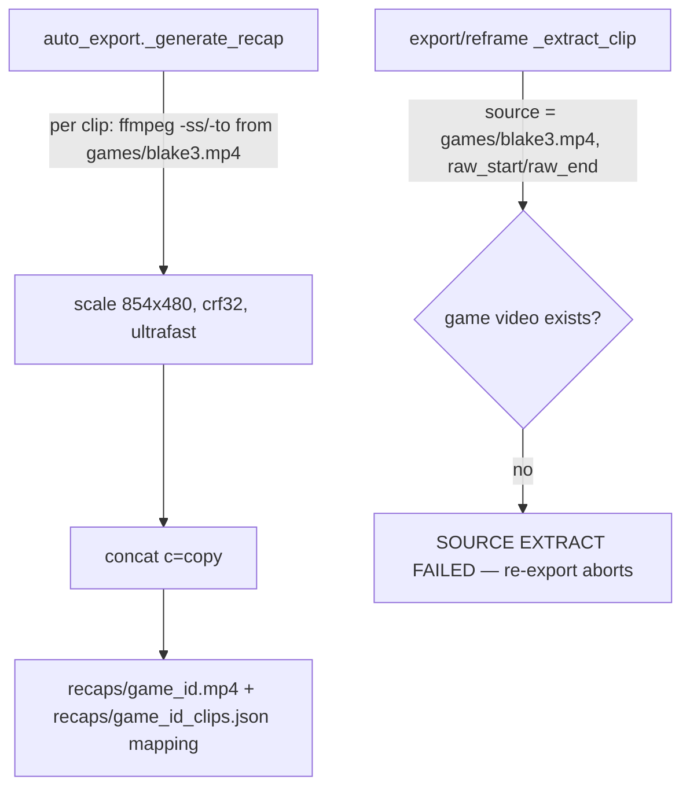
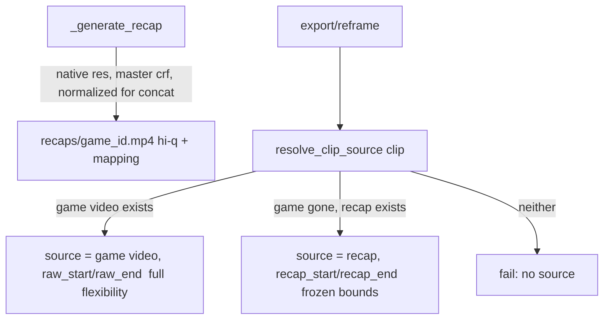

# T4140: Recap as Full-Quality Re-Edit Source (Create Clip survives game expiry)

**Status:** TODO
**Impact:** 7
**Complexity:** 7
**Created:** 2026-06-29
**Updated:** 2026-06-29

## Problem

After a game's storage expires, the sweep hard-deletes the original game video
(`games/{blake3}.mp4`), but a pre-rendered recap (`recaps/{game_id}.mp4`) survives and still
plays. T4130 shipped a real "+Create Clip" in the recap viewer, but the draft it creates
points back at the original game video, so **re-exporting/reframing that draft fails once the
game video is gone** ([framing.py:592-627](src/backend/app/routers/export/framing.py#L592-L627)) —
the clip can't be re-materialized.

The recap is the obvious surviving source — but today it's a **480p / crf-32 review proxy**
([auto_export.py:252-339](src/backend/app/services/auto_export.py#L252-L339)), too low-quality
to serve as an editing master (9:16 reframing crops into the frame and needs pixels; the
Real-ESRGAN upscale path expects real resolution).

**Goal:** make the recap a viable full-quality re-edit source so Create Clip (and edit-reel
re-export generally) keeps working after the game video is reclaimed.

## Decisions (confirmed with user)

- **Single upgraded recap.** One `recaps/{game_id}.mp4` serves playback, sharing, AND
  re-editing. No separate proxy. (Accepted: recap playback/sharing now stream the heavier
  file.)
- **Original resolution.** Store clip segments at the source's native resolution (no 480p
  downscale), at master-grade quality (low crf, real preset). Largest storage; best reframe +
  upscale compatibility.
- **Reframe only (frozen bounds).** The recap holds each clip exactly at its annotated
  start/end. After the game expires you can re-crop/zoom/re-export, but you **cannot widen the
  trim** beyond the original in/out points. No padding stored.

## Current State

- `_generate_recap` extracts each clip from the game video, scales to 854x480, crf32, concats
  (`c=copy`), uploads `recaps/{game_id}.mp4` + a `clip_mapping` with per-clip
  `recap_start`/`recap_end` offsets (`recaps/{game_id}_clips.json`).
- Export/reframe sources clips **only** from `games/{blake3}.mp4`. `raw_clips.filename` is
  always '' (no per-clip file). Game gone -> re-export fails.

## Target State

1. **High-quality recap generation** (`_generate_recap`): drop the 480p downscale; encode at
   native resolution, master-grade crf/preset. Keep the `recap_start`/`recap_end` mapping.
2. **Clip source resolver** used by export/reframe: prefer the game video when present
   (best quality, full trim flexibility); else fall back to the recap at the clip's
   recap-relative offsets (read from the frozen `recaps/{game_id}_clips.json` mapping by clip
   id); else fail.
3. With (1)+(2), Create Clip's draft re-exports cleanly from the recap after game expiry.

## Implementation Plan (architecture-gated — refine at the Stage 2 gate)

### A. Recap generation quality bump — `auto_export._generate_recap`
- Remove `.filter("scale", 854, 480)`; encode at native resolution.
- Raise quality: crf ~18 (from 32), preset `medium`/`fast` (from `ultrafast`). Bigger files,
  slower encode — acceptable for a master.
- **Mixed-resolution concat:** `concat c=copy` requires uniform codec/resolution. Single-source
  games are uniform. Multi-source games (two halves / different cameras) may differ — pick a
  canonical resolution and scale non-conforming segments to it. **Must preserve crop-keyframe
  validity** (see Risks): prefer each clip's native resolution; only normalize when forced.
- Keep audio, `+faststart`.

### B. Clip source resolver — new helper, used in `framing.py` (`_extract_clip` et al.)
- `resolve_clip_source(clip) -> (source_url, in_offset, out_offset, flexible: bool)`:
  - game video exists -> `(game_url, raw_start, raw_end, flexible=True)`
  - else recap exists -> look up `recap_start`/`recap_end` for this clip id from the recap
    mapping -> `(recap_url, recap_start, recap_end, flexible=False)`
  - else -> raise (visible failure, no silent fallback).
- Replace the direct `games/{blake3}.mp4` extraction in the re-export/reframe path with this
  resolver. Clip-internal framing keyframes stay valid because the clip's duration/content is
  identical whether sourced from game or recap (frozen bounds).

### C. Backfill — regenerate hi-q recaps before deletion
- New recaps are hi-q automatically. Existing recaps are 480p; they can only be upgraded for
  games whose **game video still exists**. Add a backfill (migration or admin-triggered job)
  that regenerates hi-q recaps for in-grace / not-yet-deleted games. Games already past grace
  (game gone) stay 480p — re-edit from those remains degraded; document it.
- Heavy job (re-encode per game) — throttle / batch; likely admin-endpoint-triggered, not a
  startup migration.

### D. Storage/credits accounting
- Hi-q recaps are materially larger. Ensure recap storage is counted in the storage-credits
  accounting (see Storage Credits epic). Confirm no double-count vs the game video.

### E. Frozen-bounds UX (frontend; may be a follow-up)
- When a draft is sourced from the recap (game gone, `flexible=False`), the framing UI should
  disable/hide "widen the trim" affordances (re-crop/zoom still allowed) or warn that the trim
  can't extend. Decide in-scope vs follow-up at the gate.

## Risks & Open Questions
1. **Crop-keyframe validity vs canonical resolution.** Verify whether crop keyframes are
   stored normalized (0-1) or in source pixels. If pixel-based, normalizing a clip's
   resolution during concat would shift its crop region. Prefer native resolution per clip;
   resolve the multi-source-mixed-resolution case carefully. **Blocking design check.**
2. **Playback/share weight.** A native-res (possibly 4K) recap is heavy to stream for
   playback and shared viewers. Confirm acceptable, or cap (user chose "original resolution";
   revisit only if 4K sources prove problematic).
3. **Compute cost.** Master-grade re-encode of every recap (and the backfill) is much heavier
   than the current 480p/ultrafast. Confirm the auto-export window/Modal/runner can absorb it.
4. **Backfill mechanism + throttling.** Migration vs admin job; how to avoid a thundering-herd
   re-encode across all users.
5. **Already-expired games.** Recaps whose game video is already gone cannot be upgraded —
   Create Clip from those stays degraded (480p) or unsupported. Document the cutoff.
6. **Two-half / multi-source games** (T2750/T82): per-source extraction + concat normalization
   correctness.

## Context

### Relevant Files (REQUIRED)
- `src/backend/app/services/auto_export.py` — `_generate_recap` (252-339); recap quality + mapping
- `src/backend/app/routers/export/framing.py` — `_extract_clip` / re-export source extraction (~584-632)
- `src/backend/app/routers/games.py` — `recap-data` + `_try_load_recap_mapping` / `_compute_recap_clips`
- `src/backend/app/services/sweep_scheduler.py` — grace + hard-delete order (don't change delete-game behavior)
- Crop keyframe model: `src/frontend/.claude/skills/keyframe-data-model` + framing reframe code

### Related Tasks
- **Follows / unblocks:** T4130 (recap Create Clip — created the draft but it can't re-export post-expiry).
- Related: T4010/T4050 (re-export source-extract failure), T4020 (shadow framing version),
  T2750/T82 (multi-source games), Storage Credits epic (accounting).

### Out of scope
- Changing the sweep to keep the game video (the recap replaces it as the surviving source).
- Storing per-clip padding / widening trims from the recap (explicitly reframe-only).

## Implementation Steps
1. [ ] (Stage 2 gate) Resolve Risks 1 & 4 (crop-keyframe validity; backfill mechanism); approve design.
2. [ ] Hi-q recap generation in `_generate_recap` (native res, master crf, concat normalization).
3. [ ] `resolve_clip_source` helper; wire into the re-export/reframe extraction path.
4. [ ] Backfill job/migration to regenerate hi-q recaps for not-yet-deleted games (throttled).
5. [ ] Storage/credits accounting for hi-q recaps.
6. [ ] Frozen-bounds UX (or split to follow-up).
7. [ ] Tests: recap quality/resolution; resolver prefers game then recap then fails;
       re-export of a Create-Clip draft after game deletion succeeds from the recap.

## Acceptance Criteria
- [ ] New recaps are generated at native resolution + master-grade quality, still concatenated
      + still produce the `recap_start`/`recap_end` mapping.
- [ ] Re-export/reframe sources from the game video when present, else from the recap at the
      clip's recap offsets, else fails visibly.
- [ ] A Create-Clip draft (T4130) can be re-exported after the game video is deleted, sourced
      from the recap.
- [ ] Backfill upgrades recaps for games whose game video still exists; already-gone games are
      handled/ documented, not crashed.
- [ ] Recap storage is accounted in credits; trims cannot widen beyond annotated bounds when
      recap-sourced.
- [ ] Backend tests pass.
