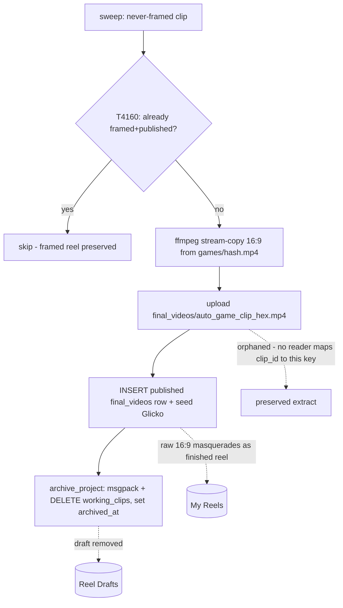
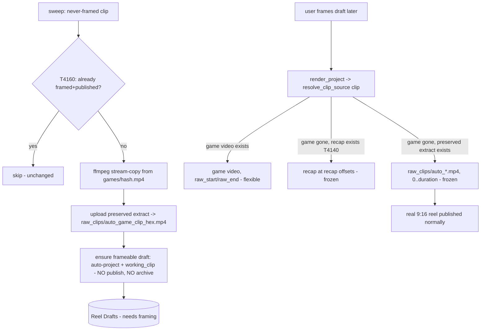

# T4175 Design — Sweep Preserves Never-Framed Clips as Reel Drafts

**Status:** Architecture (approval-gated)
**Task:** [T4175-sweep-preserve-unframed-clips-as-drafts.md](T4175-sweep-preserve-unframed-clips-as-drafts.md)
**Overlaps:** [T4140-recap-as-reedit-source.md](T4140-recap-as-reedit-source.md) (`resolve_clip_source`)

> Settled (do not re-open): never-framed clip at expiry = **draft-needs-framing** (leave/create a
> Reel Draft, no auto-crop, no raw publish). Scope = one task: (1) sweep behavior, (2) framing from
> the preserved extract, (3) remediation migration. MUST share T4140's `resolve_clip_source` — no
> parallel resolver.

---

## 1. Current State

### How the sweep handles a never-framed clip today

`auto_export._export_brilliant_clip` ([auto_export.py:169](../../../src/backend/app/services/auto_export.py#L169)):

1. Skips if the clip already has a framed published reel (T4160 guard, `auto_export.py:204-215`).
2. Stream-copies the clip range out of `games/{video_hash}.mp4` at native 16:9 (`auto_export.py:217-229`).
3. Uploads the extract to `final_videos/auto_{game}_{clip}_{hex}.mp4` (`auto_export.py:235-238`).
4. **INSERTs a published `final_videos` row** — `published_at = CURRENT_TIMESTAMP`, `version=1`,
   `source_type='brilliant_clip'`, seeded Glicko (`rating`, `rd=RD_MAX`, `match_count=0`), frozen
   `game_ids` blob (`auto_export.py:282-291`). The raw 16:9 extract now sits in **My Reels** as a
   finished reel.
5. **Archives the auto-project** (`auto_export.py:301-306`) → `archive_project` serializes
   `working_clips`/`working_videos` to `archive/{project_id}.msgpack`, then DELETES those rows and
   sets `archived_at` ([project_archive.py:47](../../../src/backend/app/services/project_archive.py#L47)).
   The draft leaves Reel Drafts.

### How framing resolves its source today (the enabler gap)

Both render paths build the source key **inline** and only ever look at the game video:

- `framing.py` `_run_render_background`: `source_key = f"games/{clip['game_blake3_hash']}.mp4"`,
  extract `-ss raw_start_time -to raw_end_time -c copy`
  ([framing.py:589-612](../../../src/backend/app/routers/export/framing.py#L589)). Non-game branch
  downloads `raw_clips/{raw_filename}` (`framing.py:632-634`). Duplicate key at the fps-probe
  (`framing.py:553-556`).
- `multi_clip.py` resolves identically inline
  ([multi_clip.py:2117](../../../src/backend/app/routers/export/multi_clip.py#L2117)).

`game_blake3_hash = COALESCE(gv.blake3_hash, g.blake3_hash)` (`framing.py:399`). When the game mp4 is
reclaimed, the extract fails loudly and re-export aborts (`framing.py:616-627`). `resolve_clip_source`
**does not exist in code** — only in T4140's planning doc.

### Why an expired-game draft is un-frameable

Even a restored draft points at a dead `games/{hash}.mp4`. There is no code path that maps a clip to
the surviving `auto_*.mp4` extract, so the extract preserved in step 3 is orphaned — nothing reads it.



---

## 2. Target State — draft-needs-framing

The sweep preserves the footage and leaves a **frameable Reel Draft**. Nothing unframed is published
or archived. Later the user frames the draft; `resolve_clip_source` finds the preserved extract because
the game video is gone.



### Preserved-extract KEY SCHEME (decision)

**Move the extract from `final_videos/auto_*` to a per-clip source namespace so it maps by clip id and
reads as a source, not a reel.**

| Option | Key | Verdict |
|---|---|---|
| A. Keep as-is | `final_videos/auto_{game}_{clip}_{hex}.mp4` | Reject. `final_videos/` is the published-reel namespace; leaving it there is what makes the extract look like a reel. Random `_{hex}` means the resolver can't derive the key from a clip id — it must query a `final_videos` row, coupling the source resolver to the publish table. |
| **B. raw_clips/ (chosen)** | **`raw_clips/{filename}` with `filename` stored on the `raw_clips` row** | **Choose.** This is exactly the per-clip source slot the non-game framing branch already reads (`framing.py:633`, `raw_clips/{raw_filename}`). `raw_clips.filename` already exists and is `''` for game clips (annotate.md: "new rows have empty filename until extraction"). The sweep fills it in — extraction is precisely what expiry forces. Closes the "clips have NO independent source" gap noted in T4130 with zero new columns. |
| C. Dedicated `clip_sources/` | `clip_sources/{clip_id}.mp4` | Reject. A parallel namespace + a new resolver branch for a slot `raw_clips/` already models. Adds surface for no benefit. |

**Mapping vs T4140's recap:** T4140 maps `clip_id -> recap_start/recap_end` via a **side-file**
(`recaps/{game_id}_clips.json`) because one recap file holds many clips at internal offsets. The
per-clip extract needs **no side-file**: one clip = one file, whole-file range `[0, duration]`, and the
key lives on `raw_clips.filename` — the same row the resolver already loads. This asymmetry is why the
resolver reads the extract from a DB column and the recap from a JSON mapping.

### "Needs framing" marker — NOT required (no redundant state)

Per the no-derivable-state rule, do **not** add a marker column. The frameable-draft-needing-framing
state is fully expressed by existing data:

> **needs-framing draft** = `projects.archived_at IS NULL` (in Reel Drafts, `projects.py:349`)
> AND a `working_clips` row exists (frameable, `framing.py:391-408` render join)
> AND `projects.final_video_id IS NULL` / no published `final_videos` row (never exported).

This is identical to a fresh `_create_auto_project_for_clip` draft ("Create Reel" before any export).
The frontend "needs framing" treatment (T3540 in-progress class) is driven by "draft with working_clip
but no final video," which already renders. No schema change; `_SCHEMA_DDL` untouched.

---

## 3. `resolve_clip_source` Design (single shared helper)

**Home:** `src/backend/app/services/export_helpers.py` (already the shared source-resolution home per
the task's file list and export-pipeline.md scope; avoids router→router imports flagged for T4200).

**Signature — reconciled with T4140's 4-tuple:**

```python
def resolve_clip_source(clip: dict) -> tuple[str, float, float, bool]:
    """Resolve a clip's editable source. Returns (source_url, in_offset, out_offset, flexible).

    clip must carry: game_id, game_blake3_hash, raw_start_time, raw_end_time,
                     raw_filename, id, game_id (for recap mapping).
    Resolution order (first hit wins), all visible-fail on miss:
      1. game video present   -> (game_url, raw_start_time, raw_end_time, flexible=True)
      2. preserved per-clip extract present (raw_clips.filename set)
                              -> (extract_url, 0.0, raw_duration, flexible=False)   # T4175
      3. recap present (T4140) -> (recap_url, recap_start, recap_end, flexible=False)
      4. none                 -> raise (no silent fallback)
    """
```

**Ordering rationale:** game video first (best quality, full trim flexibility, `flexible=True`). Then
the **per-clip extract before the recap** — the extract is native-resolution single-clip footage
(cheaper to fetch, exact bounds), strictly better than seeking into a concatenated recap when both
exist. Both post-expiry sources are `flexible=False` (frozen bounds; reframe-only, no wider trims —
matches T4140).

```pseudo
def resolve_clip_source(clip):
    # 1. game video (probe existence of games/{hash}.mp4 in the global namespace)
    if clip['game_id'] and clip['game_blake3_hash']:
        url = generate_presigned_url_global(f"games/{clip['game_blake3_hash']}.mp4")
        if url and object_exists_global(f"games/{clip['game_blake3_hash']}.mp4"):
            return (url, clip['raw_start_time'], clip['raw_end_time'], True)

    # 2. T4175 preserved per-clip extract (native-res single clip; whole-file range)
    if clip['raw_filename']:
        url = generate_presigned_url(user_id, f"raw_clips/{clip['raw_filename']}")
        if url:  # object presence checked by the caller's extract/download failure
            return (url, 0.0, clip['raw_start_time'] and (clip['raw_end_time'] - clip['raw_start_time']), False)

    # 3. T4140 recap fallback (game_id -> recaps/{game_id}_clips.json -> recap_start/recap_end)
    recap = load_recap_mapping(clip['game_id'])              # T4140 owns this
    if recap and clip['id'] in recap:
        return (recap_url, recap[clip['id']].start, recap[clip['id']].end, False)

    # 4. visible failure — no silent fallback (CLAUDE.md)
    raise SourceUnavailable(clip['id'])
```

**Two call sites it replaces** (both currently inline the game key):

| Site | Current | After |
|---|---|---|
| `framing.py:589-590` (+ probe dup at `:553-556`) | `source_key = games/{hash}.mp4`; extract `raw_start..raw_end` | `url, in_off, out_off, flexible = resolve_clip_source(clip)`; extract `in_off..out_off`. Probe uses the same `url`. |
| `multi_clip.py:2117` | `source_url = games/{hash}.mp4`; extract `raw_start..raw_end` | same resolver call; per-clip in/out offsets |

The `raw_filename` branches already in both files (`framing.py:632`, `multi_clip.py:2165/2179`) collapse
into the resolver — one source-resolution path, not four inline variants.

> **Note (see §6):** if T4175 lands before T4140, step 3 is a stub that returns `None`/raises; T4140
> extends step 3. The signature and ordering are fixed now so T4140 slots in without a rewrite.

---

## 4. Sweep Change — `_export_brilliant_clip`

Keep the extract and the T4160 skip. Change the tail: **upload to `raw_clips/`, ensure a frameable
draft, do NOT publish, do NOT archive.** Still an explicit synced writer (the one gesture-less writer;
`sync_db_to_r2_explicit` as today).

```pseudo
def _export_brilliant_clip(user_id, profile_id, clip, game_id):
    if not clip['auto_project_id']: return
    if invalid_range(clip): return

    # T4160 skip: already framed+published -> untouched  (UNCHANGED, auto_export.py:204-215)
    if published_final_video_for(clip['id']): return

    # extract (UNCHANGED ffmpeg stream-copy from games/{hash}.mp4)  (auto_export.py:217-229)
    output = ffmpeg_stream_copy(video_url, start_time, end_time)

-   # OLD: publish + archive
-   filename = f"auto_{game_id}_{clip['id']}_{hex}.mp4"
-   upload_to_r2(user_id, f"final_videos/{filename}", output)
-   aspect_ratio = _probe_aspect_ratio(output)
-   INSERT published final_videos row (seed Glicko, game_ids, published_at)   # auto_export.py:282-291
-   archive_project(clip['auto_project_id'], user_id)                          # auto_export.py:301-306

+   # NEW: preserve as per-clip source + leave a frameable draft
+   filename = f"auto_{game_id}_{clip['id']}_{hex}.mp4"
+   upload_to_r2(user_id, f"raw_clips/{filename}", output)          # source namespace, not final_videos/
+   with get_db_connection() as conn:
+       cur = conn.cursor()
+       # wire the extract as the clip's independent source
+       cur.execute("UPDATE raw_clips SET filename = ? WHERE id = ?", (filename, clip['raw_clip_id']))
+       # ensure the auto-project is a frameable draft (idempotent):
+       #   auto_project_id already exists (guarded above) with a working_clip from
+       #   _create_auto_project_for_clip at annotate time -> nothing to (re)create.
+       #   Guard for the rare no-working-clip case by (re)inserting via the blueprint.
+       if not working_clip_exists(cur, clip['auto_project_id']):
+           _insert_working_clip_with_dims(cur, clip['auto_project_id'], clip['raw_clip_id'], sort_order=0)
+       # NO publish, NO archive: archived_at stays NULL, final_video_id stays NULL
+       conn.commit()
+   sync_db_to_r2_explicit(...)   # unchanged: explicit sync for the gesture-less writer
```

Decisions embedded above:

- **Extract still uploads**, to **`raw_clips/{filename}`** (not `final_videos/`), and `raw_clips.filename`
  is set on the clip's own row — the resolver step 2 finds it by clip.
- **No new working_clip needed in the normal path.** The auto-project already carries a working_clip
  linking project→raw_clip (created by `_create_auto_project_for_clip`/`_insert_working_clip_with_dims`
  at annotate time; `clips.py:821`,`:800`). The sweep only needs to *not delete* it (i.e. not archive).
  The `if not working_clip_exists` guard re-uses the same blueprint helper for the degenerate case.
- **`auto_project_id` is reused as-is** — it already points at the frameable draft. No repoint.
- `_probe_aspect_ratio` is no longer called (no ratio to stamp — no reel row). The label is settled
  when the user actually frames+publishes.

---

## 5. Remediation Migration v021

Reverses the **publish (this task) AND the v020 archive** for every already-written sweep row. v020
archived these projects (msgpack + DELETE working_clips + `archived_at`), so a full reversal is
un-publish + restore working state + re-point the source to the preserved extract.

**Version:** highest on disk = v020 (authority is the `version=N` attr). T4175 = **v021**. Tuple
row-factory (index positionally), idempotent, table-guarded.

**Predicate (generic):** published `final_videos` rows, `source_type='brilliant_clip'`, filename
`LIKE 'auto\_%'` (the sweep's writer). Matches dev fv 37-57 (`auto_6_*`) and prod sarkarati fv 16-22.

```pseudo
class V021UnpublishUnframedSweepReels(BaseMigration):
    version = 21

    def up(self, conn):
        cur = conn.cursor()
        tables = {r[0] for r in cur.execute("SELECT name FROM sqlite_master WHERE type='table'")}
        if 'projects' not in tables or 'final_videos' not in tables or 'raw_clips' not in tables:
            return

        rows = cur.execute(
            "SELECT id, project_id, filename, source_clip_id "     # positional: r[0..3]
            "FROM final_videos "
            "WHERE source_type='brilliant_clip' AND published_at IS NOT NULL "
            r"AND filename LIKE 'auto\_%' ESCAPE '\'"
        ).fetchall()

        for r in rows:
            fv_id, project_id, filename, source_clip_id = r[0], r[1], r[2], r[3]

            # (a) re-point the preserved artifact as the clip's source.
            #     The final_videos/auto_*.mp4 object IS the native extract already.
            #     Copy R2 object final_videos/{filename} -> raw_clips/{filename}
            #     (or keep key + special-case; prefer copy so raw_clips/ is the single
            #     source namespace and delete of final_videos/ later is safe).
            copy_r2_object(user_id, f"final_videos/{filename}", f"raw_clips/{filename}")
            raw_clip_id = source_clip_id
            cur.execute("UPDATE raw_clips SET filename=? WHERE id=? AND (filename IS NULL OR filename='')",
                        (filename, raw_clip_id))

            # (b) restore the auto-project to a frameable draft (reverse v020 archive).
            #     Prefer restore_project (re-hydrate working_clips from archive/{project_id}.msgpack).
            #     If msgpack missing -> rebuild via the blueprint (see §6 rebuild path).
            if archive_exists(project_id):
                restore_project(project_id, user_id)     # sets archived_at=NULL, re-inserts working_clips
            else:
                cur.execute("UPDATE projects SET archived_at=NULL WHERE id=?", (project_id,))
                if not working_clip_exists(cur, project_id):
                    _insert_working_clip_with_dims(cur, project_id, raw_clip_id, sort_order=0)

            # (c) un-publish: delete the published reel row so it leaves My Reels.
            cur.execute("DELETE FROM final_videos WHERE id=?", (fv_id,))

        conn.commit()
        # idempotent: re-run matches nothing (rows deleted; drafts already un-archived).
```

**Glicko ratings / match history on these rows.** The sweep seeded each row as a published
ranking contestant (`rating`, `rd=RD_MAX`, `match_count=0`; `auto_export.py:277-290`). Deleting the
`final_videos` row **discards that seeded rating and any matches cast against it** — which is correct:
these are raw 16:9 clips that never should have entered the pool (the original bug). Any match history
referencing a deleted `final_video_id` is orphaned; **flag for the reviewer**: confirm the ranking
match table (Glicko history) either cascades or is swept — a dangling match row pointing at a deleted
contestant must not resurrect it. When the user later frames+publishes the draft, a fresh reel row is
seeded normally. Net: pre-framing ratings on unframed raw clips are intentionally dropped.

**`final_videos.game_ids` grouping (T4190).** The frozen `game_ids` blob lives on the deleted row, so
its My Reels group loses this member — correct, the reel is no longer a reel. The restored draft carries
`auto_project_id -> game_id`, so it groups correctly under Reel Drafts (and re-freezes `game_ids` when
re-published). No orphaning: T4190 resolves brilliant_clip attribution from `game_ids` with the
`auto_project_id` chain as fallback, both of which the draft still satisfies.

---

## 6. Risks & Open Questions

### LEAD: T4140 sequencing (needs a user decision)

T4140 (recap-as-source, TODO/arch-gated) and T4175 both need `resolve_clip_source` and both solve
"post-expiry source," but via **different artifacts**: T4140 = one whole-game recap at internal offsets
(`flexible=False`, side-file mapping); T4175 = per-clip native extract at whole-file range
(`flexible=False`, key on `raw_clips.filename`).

| Option | What | Tradeoff |
|---|---|---|
| **(a) Build resolver here; T4140 extends it (RECOMMENDED)** | T4175 lands `resolve_clip_source` in `export_helpers.py` with steps 1-2 (game, extract) + a stubbed step 3; T4140 fills step 3 (recap). | Unblocks T4175 now (it's the live bug — 21 dev reels + prod sarkarati already wrong). Fixed signature/ordering means T4140 is a drop-in. No parallel resolver. Minor: T4140's recap-quality bump ships later. |
| (b) Do T4140 first | Land the resolver + recap in T4140, T4175 adds step 2. | Couples the live remediation to T4140's heavy recap re-encode + backfill (Modal cost, throttling) — delays fixing the visible bug for scope T4175 doesn't need. |
| (c) Unify — extract may make recap-as-source redundant | If every clip gets a preserved per-clip extract at expiry, the recap-as-editing-source (T4140 step B/C) is arguably unnecessary — the extract is a better editing master (native res, exact bounds) than seeking into a concat. | Tempting, but the two solve different reach: T4175's extract only covers clips that reached the sweep unframed; T4140's recap also backs T4130 "+Create Clip" for clips created *from the recap viewer* post-expiry (no auto-project, no extract). They're **complementary**, not redundant — recap still needed for recap-born clips. |

**Recommendation: (a).** Build the shared resolver in T4175 with the recap branch stubbed; T4140 extends
step 3. This fixes the live bug immediately, honors "no parallel resolver," and keeps T4140's heavy
recap work independent. Treat (c)'s insight as scope-clarification for T4140: recap-as-source stays, but
its primary justification narrows to recap-born clips.

### Other risks

| Risk | Mitigation |
|---|---|
| **msgpack-missing rebuild path** | v020 archived best-effort; the sweep archive itself was best-effort (`auto_export.py:301-306`). If `archive/{project_id}.msgpack` is absent, `restore_project` returns False. v021 must fall back to **rebuild**: `archived_at=NULL` + `_insert_working_clip_with_dims` from the surviving `raw_clip_id` (the working_clip is trivially reconstructable — a 1-clip auto-project). Do NOT leave a bare `archived_at=NULL` (T4050 "Not Started" empty-draft signature). |
| **Storage cost — per-clip extracts vs one recap** | Per-clip extracts (native res, one file per swept clip) cost more than a single recap. Accepted for correctness: only clips that reached expiry unframed get an extract; the alternative (recap-only) can't back reframe at native quality (T4140's own reason for the quality bump). Flag for the Storage-Credits epic: count `raw_clips/auto_*` extracts in accounting (same note as T4140 §D). |
| **Reframe-only constraint** | Post-expiry the extract holds exactly `[raw_start, raw_end]` — frozen bounds, `flexible=False`. No wider trims (source outside the extract is gone). Matches T4140's reframe-only decision. Frontend frozen-bounds UX (disable "widen trim") is shared with T4140 §E — can be a follow-up; reframe/crop still works. |
| **Where to run remediation** | Run **dev first** (imankh Legends fv 37-57): verify the reels leave My Reels, land in Reel Drafts as needs-framing, and frame+render from the preserved extract end-to-end. Only then run staging + **prod** (sarkarati fv 16-22, plus any other users the generic predicate catches) via the admin migrate endpoint. Migrations don't auto-run (MEMORY) — explicit trigger per env. |
| **R2 object move (copy vs keep key)** | v021 copies `final_videos/{filename}` → `raw_clips/{filename}` so `raw_clips/` is the single source namespace and any later `final_videos/` cleanup is safe. Do the copy BEFORE deleting the `final_videos` row; a copy failure must abort that row (visible), not silently drop the source. |
| **Idempotency / row-factory** | Positional reads (v019/v020 pattern); table-guarded; predicate self-excludes on re-run (rows deleted, drafts un-archived). Copy step must tolerate an already-present `raw_clips/{filename}` (skip if exists). |

### Open questions for approval

1. **Confirm sequencing (a)** — build the shared resolver here with a stubbed recap branch, T4140 extends it. (Recommended.)
2. **Glicko cleanup scope** — confirm deleting the seeded `final_videos` row + orphaned matches is acceptable (these were never-legitimate contestants). Reviewer to verify match-history FK/cascade.
3. **v021 R2 strategy** — copy `final_videos/*` → `raw_clips/*` (recommended) vs keep the `final_videos/` key and special-case the resolver. Copy keeps one clean source namespace.
