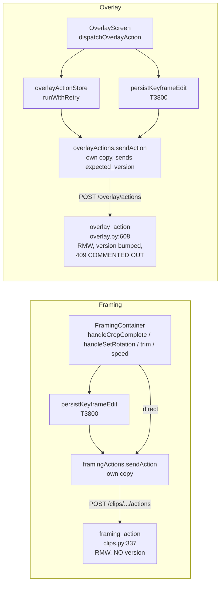
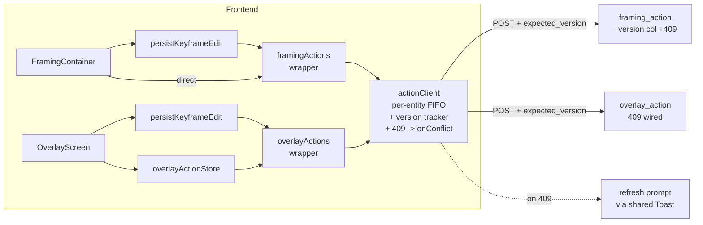
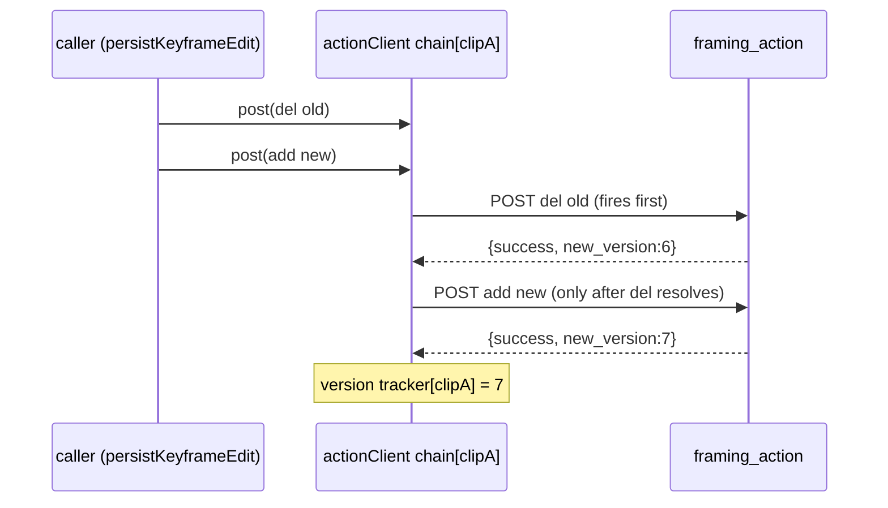
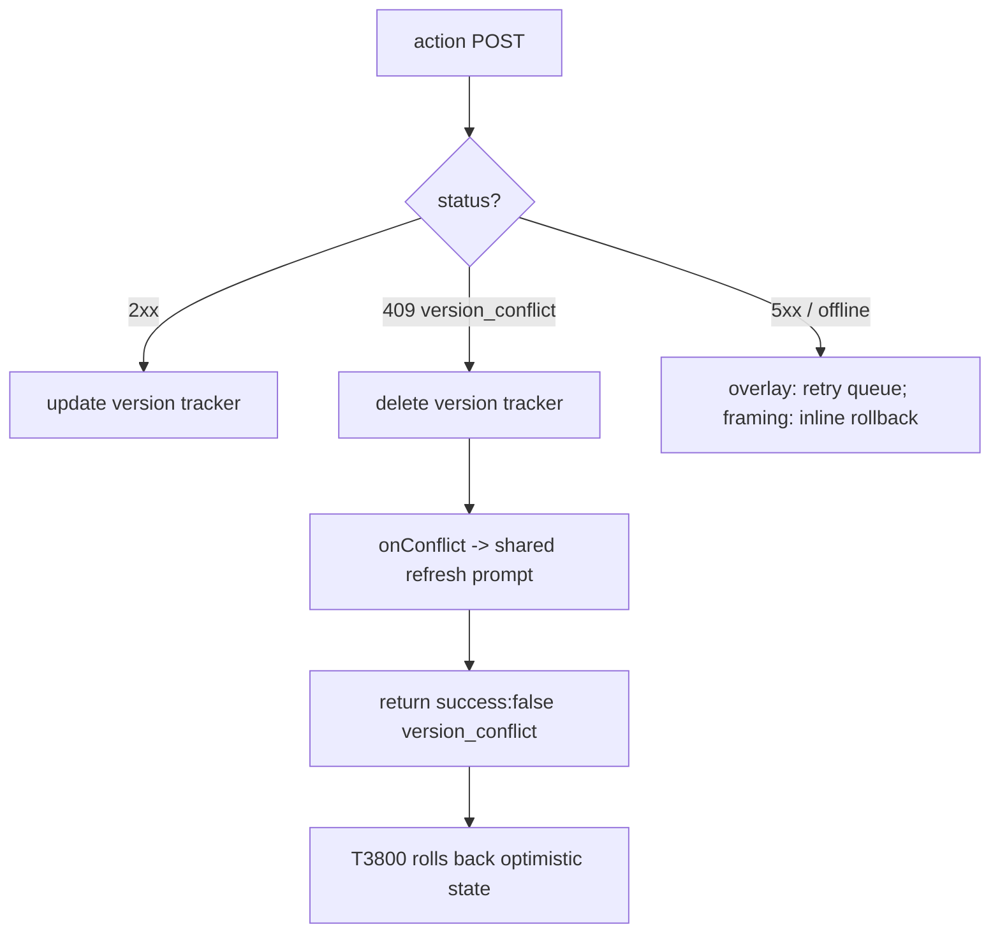

# T4330 — Unified Action Client: Serialization + Versioning + 409 Conflicts — Design

**Task:** [T4330](write-correctness/T4330-action-client-serialization-conflicts.md) · Epic [write-correctness](write-correctness/EPIC.md) · Audit C8 + G1 + B6
**Tier:** L (design-gated) · **Status of this doc:** awaiting approval
**Stack layers:** Frontend (transport + stores) · Backend (overlay + framing action endpoints) · Database (profile_db migration v044)

---

## 0. Summary

Three coupled gaps in the gesture-action transport, fixed as one unit:

1. **[DRY / C8]** `api/framingActions.js` and `api/overlayActions.js` each carry a near-identical private `sendAction`. Any transport concern (serialization, version threading, 409 handling, error taxonomy) must be written and maintained twice.
2. **[DEP / B6]** Actions are fire-and-forget POSTs. Two in-flight actions on the SAME entity can arrive **reordered on the wire**; the backend does whole-blob read-modify-write, so last-arrival wins — silent corruption with no user-visible cause. The T3800 snap-move `del(old) + add(new)` pair is exactly this hazard.
3. **[SYNC / G1]** Only overlay sends `expected_version`, and its backend check is **commented out** (overlay.py:645-652) — the plumbing exists end-to-end and protects nothing. Framing has no versioning at all.

The fix introduces **one transport primitive** (`api/actionClient.js`) that owns three concerns transparently: **per-entity FIFO serialization**, **version threading** (track last returned version, send as `expected_version`), and **409 conflict surfacing** (re-fetch + "someone else edited — refresh" prompt, no auto-rebase). The two existing action files become declarative wrappers that preserve their current return shapes so **no caller changes**. Backend gains the overlay 409 check (uncomment + wire) and a framing version column + 409 check (new v044 migration).

---

## 1. Current State Analysis

### 1.1 Architecture (today)



### 1.2 Verified facts (from source, this audit)

| Fact | Location | Detail |
|------|----------|--------|
| framing `sendAction` | framingActions.js:24-48 | `(projectId, clipId, action, target, data)` → POST `/api/clips/projects/{pid}/clips/{cid}/actions`; returns raw `{success, refresh_required?, new_clip_id?, error?}`. **No version, no `status` on error.** Entity = projectId+clipId. |
| overlay `sendAction` | overlayActions.js:25-55 | `(projectId, action, target, data, expectedVersion)` → POST `/api/export/projects/{pid}/overlay/actions`; sends `expected_version` when non-null; returns raw `{success, version, region_id?, error?, status?}`. Entity = projectId (one working_video). |
| Non-action overlay writes | overlayActions.js:289-331 | `setPosterTime` (`/poster-time`), `revertPoster` (`/poster/revert`) do NOT go through `sendAction`; no version, own try/catch. |
| No caller reads version | grep confirmed | Nobody reads `version` / `refresh_required` / `new_clip_id` off a surgical response. → the client can own version tracking transparently. |
| T3800 wrapper sits ABOVE transport | persistKeyframeEdit.js:44-72 | resolve identity → `optimistic.apply` → `del(movedFromKey)` then `add(targetKey)` → crop awaits + rolls back on `result.success===false`; overlay fire-and-forget with `onError`. The `del+add` pair is the reorder hazard the FIFO must close. |
| Framing callers | FramingContainer.jsx | `cropPersistActions` adapter (`add`/`del` → framingActions.*, :18-21); direct calls for rotation/trim/speed/split. **No failure store — crop uses inline rollback only.** |
| Overlay callers | OverlayScreen.jsx:575-745 | every write wrapped `dispatchOverlayAction(label, () => overlayActions.X())`. |
| `isRetryableFailure` bug for 409 | overlayActionStore.js:56-61 | 409 (< 500, not 408/429) classified NON-retryable → currently routes to `_surfaceRejectionToast` ("Undo it and try again") — the WRONG prompt for a concurrent-edit conflict. |
| Overlay backend version | overlay.py:444, 654 | `version = row['overlay_version'] or 0`; `new_version = version + 1`; written by `_save_overlay_data`/`_save_text_overlays` (text shares the same counter). |
| Overlay 409 scaffold | overlay.py:645-652 | commented: `if action.expected_version is not None and action.expected_version != version: return 409 {success, error:"version_conflict", current_version, message}`. |
| Overlay RMW atomicity | overlay.py:636-654 | read → mutate → commit with **NO `await`** between read and commit (persistence-sync.md invariant 6). Must not add awaits. |
| Framing backend, no CAS | clips.py:337 | `FramingAction.expected_version` field exists (:274) but is **never read**. `_save_clip_framing_data` (:299-319) in-place UPDATE, **no version bump**, returns `{success, refresh_required:False}`. |
| Framing 2nd write path | clips.py:573-595 | `set_rotation` branch does its own `UPDATE working_clips SET rotation` and `return`s early — bypasses `_save_clip_framing_data`. Must ALSO bump the counter. |
| `working_clips.version` is NOT reusable | database.py:985 | that column is the EXPORT version-row counter (one row per exported version), NOT a mutation counter. Framing needs a NEW column. |
| Migration head | profile_db/v043_drop_intro_min_duration.py | latest is **v043**; v037 and v039 are ABSENT (skipped, do not reuse). Next FREE = **v044**. |
| Rotation column precedent | v029_working_clips_rotation.py | template for the guarded `PRAGMA table_info` ALTER; migration `up(conn)` rows are TUPLES — index positionally. |

### 1.3 Code smells identified

| Smell | Location | Impact |
|-------|----------|--------|
| Duplicated logic | framingActions.js:24-48 ≡ overlayActions.js:25-55 | Every transport fix written twice; they have already drifted (overlay tracks `status`, framing doesn't). |
| Dead / commented code | overlay.py:645-652; `expected_version` fields never read (clips.py:274, overlay.py:398) | Version plumbing that protects nothing — a false sense of safety. |
| Multiple write paths on one endpoint | clips.py `set_rotation` (:573-595) vs `_save_clip_framing_data` (:299-319) | A version bump added to one is silently skipped by the other. |
| Misclassified failure | overlayActionStore.js:56-61 | 409 (a legitimate concurrent-edit conflict) routes to the "undo it" toast, not a refresh prompt. |

### 1.4 Current behavior (the two races)

```pseudo
# RACE 1 — network reorder of same-entity actions
user drags keyframe A, then B (same clip), fast:
    POST add(A)  --.
    POST add(B)  --|--> both in flight, no ordering
                    '-> B arrives first: RMW writes blob with B
                        A arrives second: RMW re-reads, writes blob with A  # B lost

# RACE 2 — two tabs on the same entity
tab1 edits region, tab2 edits region:
    tab1 POST -> RMW -> overlay_version 5->6
    tab2 POST (stale in-memory state) -> RMW -> overlay_version 6->7  # tab1's edit silently gone
    # expected_version is sent by overlay but the check is commented out -> no protection
```

---

## 2. Target Architecture

### 2.1 Design principles applied

- [ ] **DRY:** ONE transport (`api/actionClient.js`); both action files declarative wrappers over `createActionClient({...})`.
- [ ] **Single code path:** all action POSTs route through the client; grep proves no bypass.
- [ ] **No new branches in callers:** version threading + FIFO + 409 handled INSIDE the client; callers keep today's signatures and return shapes.
- [ ] **Data-always-ready / gesture-based:** the client fires only from gesture handlers (unchanged); NO reactive persistence introduced.
- [ ] **Correct data, fail loud:** a 409 refuses and surfaces a prompt; it never auto-merges or silently drops a side.

### 2.2 Target architecture



### 2.3 The client contract (`createActionClient`)

`createActionClient(config)` returns a `post(ids, action, target, data)` function. The wrapper files translate their public API to that single call.

**Config (declarative, per client):**

| Field | Framing value | Overlay value | Purpose |
|-------|---------------|---------------|---------|
| `url(ids)` | `` `${API_BASE}/api/clips/projects/${ids.projectId}/clips/${ids.clipId}/actions` `` | `` `${API_BASE}/api/export/projects/${ids.projectId}/overlay/actions` `` | endpoint per entity |
| `entityKey(ids)` | `` `${ids.projectId}:${ids.clipId}` `` | `` `${ids.projectId}` `` | FIFO chain + version-tracker key |
| `tag` | `'framingActions'` | `'overlayActions'` | log prefix (preserve today's `console.error` tags) |
| `mapResult(raw, status, ok)` | returns `{success, refresh_required, new_clip_id, error}` (today's framing shape) | returns `{success, version, region_id, error, status}` (today's overlay shape) | **preserve each client's exact return shape** so callers don't change |
| `onConflict(ids, current)` | injected refresh-prompt handler (§5) | injected refresh-prompt handler (§5) | routes a 409 to the UX |

**Per-client contract differences the client normalizes internally (documented in JSDoc):**

| Concern | Framing | Overlay |
|---------|---------|---------|
| Entity granularity | one chain per clip (projectId+clipId) | one chain per working_video (projectId) |
| Version field in success response | `new_version` (added by this task, from v044 counter) | `version` (already emitted) |
| Error `status` today | absent | present | (client always captures `response.status` now, so both gain it uniformly) |
| Caller-visible return shape | `{success, refresh_required?, new_clip_id?, error?}` | `{success, version?, region_id?, error?, status?}` | mapped by `mapResult`, unchanged for callers |

**Decision — non-action overlay endpoints stay OUTSIDE the client.** `setPosterTime` and `revertPoster` are NOT surgical blob RMW actions, carry no version, and are single, non-concurrent gestures on their own endpoints. Folding them into the FIFO/version machinery would require inventing a version they don't have and gain nothing (no reorder hazard, no whole-blob RMW). They remain their own small functions in `overlayActions.js`. Noted explicitly so a future reader doesn't "unify" them by reflex.

### 2.4 Per-entity FIFO

The client keeps a `Map<entityKey, Promise>` — the tail of each entity's chain. Each `post` awaits its predecessor before firing its POST, then becomes the new tail:

```pseudo
chains = new Map()            # entityKey -> Promise (tail of chain)
versions = new Map()          # entityKey -> last returned version (or undefined)

async function post(ids, action, target, data):
    key = entityKey(ids)
    prev = chains.get(key) ?? Promise.resolve()

    # link BEFORE awaiting so a synchronous A,B pair on the same key serializes
    task = prev
        .catch(() => {})                       # a failed predecessor must NOT wedge the chain
        .then(() => sendOne(ids, key, action, target, data))

    # store a tail that never rejects, so the NEXT action always runs (determinism)
    chains.set(key, task.catch(() => {}))
    return task                                # caller still sees the real result/rejection
```

Properties:
- **Cross-entity independence:** clip1 and clip2 (or two projects) have distinct keys → distinct chains → never block each other. Pinned by a test that interleaves two keys with deferred fetch mocks.
- **Wedge-proof:** the tail stored in `chains` is `task.catch(()=>{})`, so a rejected/rolled-back action leaves the chain in a deterministic ready state — the next action runs. The CALLER still receives the true result (the un-caught `task`), so T3800 rollback still sees `success:false`.
- **No coalescing in v1** (future option only; do not build). Each queued action fires its own POST in order.
- **Sits BELOW `persistKeyframeEdit`:** the T3800 `del(movedFromKey)` and `add(targetKey)` are two separate `post` calls on the SAME entity key, so the FIFO serializes them in emission order — the exact ordering T3800 relies on. The client does not know about optimistic apply/rollback; it only guarantees the two POSTs hit the wire in order and their results resolve in order.



### 2.5 Version threading

The client tracks the last returned version per entity key and sends it as `expected_version` on the NEXT action for that key.

```pseudo
async function sendOne(ids, key, action, target, data):
    body = { action }
    if target: body.target = target
    if data:   body.data = data
    expected = versions.get(key)
    if expected !== undefined: body.expected_version = expected   # omitted before first response

    resp = await apiFetch(url(ids), POST, body)
    raw  = await resp.json()

    if resp.status === 409:
        versions.delete(key)                 # tracker is now known-stale; reset
        onConflict(ids, raw.current_version) # §5 — surface refresh prompt
        return mapResult(raw, 409, false)

    if resp.ok:
        v = raw.version ?? raw.new_version   # overlay emits `version`; framing emits `new_version`
        if v !== undefined: versions.set(key, v)
    return mapResult(raw, resp.status, resp.ok)
```

Decisions:
- **Initial version:** OMIT `expected_version` before any response for that entity (do NOT seed from a GET). Backend treats a missing/null `expected_version` as "skip the check" (§4), so the first write of a session always lands — matching today's behavior and avoiding an extra round-trip on entry. The tracker is populated from the first success's echoed version and enforced from the second action onward. This is the intended two-tab guard: within one tab, actions serialize (FIFO) and thread versions monotonically; a SECOND tab's independent version tracker diverges the moment either tab writes, so the loser's next action carries a stale `expected_version` → 409.
- **On success:** overwrite the tracker with the echoed version (`version` for overlay, `new_version` for framing).
- **On 409:** DELETE the tracker entry (next action omits `expected_version`) AND fire `onConflict`. After the user refreshes (the only sanctioned resolution), the reloaded state re-seeds naturally from the next success. We intentionally do NOT auto-adopt `current_version` and retry — that would silently overwrite the other tab's edit, which is the loss this task exists to prevent.

### 2.6 Backend 409 (both endpoints, aligned)

**Overlay (overlay.py:645-652) — uncomment + wire:**

```pseudo
# after _get_overlay_data yields `version`, BEFORE new_version = version + 1
if action.expected_version is not None and action.expected_version != version:
    return JSONResponse(status_code=409, content={
        "success": False,
        "error": "version_conflict",
        "current_version": version,
        "message": "This project was edited elsewhere. Refresh to see the latest.",
    })
```
No `await` is added between the read and the commit — the check is pure comparison on the already-read `version`, so RMW atomicity (invariant 6) is preserved.

**Framing (clips.py:337) — add a version column + bump on EVERY write path + the same check:**

1. Read the new counter in `_get_clip_framing_data` (SELECT the new column; `version = clip['framing_version'] or 0`).
2. **Same 409 check** immediately after the read, before any mutation:
   ```pseudo
   if action.expected_version is not None and action.expected_version != version:
       return JSONResponse(status_code=409, content={
           "success": False, "error": "version_conflict",
           "current_version": version,
           "message": "This clip was edited elsewhere. Refresh to see the latest.",
       })
   ```
3. **Bump on both write paths:**
   - `_save_clip_framing_data` (crop/segments/trim): `SET crop_data=?, segments_data=?, framing_version=?` with `new_version = version + 1`; return `{success, refresh_required:False, new_version}`.
   - `set_rotation` branch (clips.py:573-595): its standalone `UPDATE working_clips SET rotation=?` must ALSO `SET framing_version=?` and return `new_version`. (This is the second write path the code-expert flagged; missing it means a rotation gesture doesn't advance the counter and a following crop edit from another tab wouldn't conflict.)
4. `expected_version` stays **OPTIONAL**: a null/missing value skips the check (back-compat for un-migrated callers and the first write of a session). No `await` between read and commit — the comparison is on the already-read value.

**Aligned response contract (both endpoints):** status **409**, body `{success:false, error:"version_conflict", current_version:<int>, message:<str>}`. Overlay success responses keep emitting `version`; framing success responses now emit `new_version`.

### 2.7 Migration (profile_db v044)

Framing needs a monotone mutation counter on `working_clips` — the `overlay_version` analogue.

- **Column:** `working_clips.framing_version INTEGER NOT NULL DEFAULT 0` (name TBD in Open Questions — proposed `framing_version` for symmetry with `overlay_version`).
- **Two edits, both required** (schema SSOT rule):
  1. `ensure_database()` DDL in `src/backend/app/database.py` — so fresh deploys have the column.
  2. New `src/backend/app/migrations/profile_db/v044_working_clips_framing_version.py` — guarded `PRAGMA table_info` ALTER, modeled on `v029_working_clips_rotation.py`. Migration `up(conn)` rows are TUPLES — index positionally, never by name.
- **DEFAULT 0** means every existing row reads `version 0`; the first action omits `expected_version` (initial) and lands, then threads from 1 onward. No backfill needed.
- **Runtime guard** mirroring rotation: if the column is absent (deploy→migrate window), the framing 409/bump path should degrade gracefully — either behave as pre-versioning (skip bump/check via `column_exists`) OR 503 like `set_rotation` does. Decision in Open Questions.
- **Number-collision caveat:** unmerged sibling branches may also claim v044. The supervisor MUST verify no collision at merge (grep `migrations/profile_db/v044_*` on the integration branch); renumber to the next free slot if taken. Do NOT reuse v037/v039 (absent by history).

---

## 3. Refactoring Plan

### 3.1 New module

| File | Change |
|------|--------|
| `src/frontend/src/api/actionClient.js` | NEW. `createActionClient({url, entityKey, tag, mapResult, onConflict})` → `{ post(ids, action, target, data) }`. Owns the per-entity `chains` Map, the `versions` Map, version threading, and 409 routing. |

### 3.2 The task itself

| File | Change |
|------|--------|
| `src/frontend/src/api/framingActions.js` | Replace private `sendAction` with a `createActionClient` instance; every exported fn becomes a thin call to `client.post({projectId, clipId}, action, target, data)`. Preserve today's return shape via `mapResult`. |
| `src/frontend/src/api/overlayActions.js` | Same, keyed on `{projectId}`; preserve `version`/`status` return shape. Wire `expected_version` through the client (delete the manual `expectedVersion` param — the client owns it). `setPosterTime`/`revertPoster` untouched. |
| `src/frontend/src/stores/overlayActionStore.js` | Fix `isRetryableFailure`/dispatch so a 409 routes to the refresh prompt, NOT the retry queue nor `_surfaceRejectionToast` (§5). |
| `src/backend/app/routers/export/overlay.py` | Uncomment + wire the 409 check (§2.6). |
| `src/backend/app/routers/clips.py` | Read `framing_version`; add the 409 check; bump the counter in BOTH `_save_clip_framing_data` and the `set_rotation` branch; return `new_version`. |
| `src/backend/app/database.py` | Add `framing_version` to `ensure_database()` DDL. |
| `src/backend/app/migrations/profile_db/v044_working_clips_framing_version.py` | NEW guarded ALTER (template v029). |

### 3.3 Ordered implementation steps

1. **Tests first** (Stage 3): FIFO ordering with deferred fetch mocks; cross-entity independence; version threading; 409→refresh prompt; rollback determinism. Backend two-writer 409 per endpoint.
2. **Overlay 409** — uncomment + wire the scaffold (smallest, lowest risk; the plumbing already exists). Backend two-writer test green.
3. **Framing column + migration + 409** — v044 migration + `ensure_database` DDL; read/bump/check in clips.py (both write paths). Backend two-writer test green.
4. **`actionClient.js`** — new module + its unit tests (FIFO, versions, 409) green in isolation.
5. **Migrate both wrappers** — framingActions + overlayActions become declarative; run existing action/keyframe tests to prove return shapes unchanged; wire `overlayActionStore` 409 routing.
6. **Grep for bypasses** — `apiFetch(.*/actions` and any direct action POST that skips the client; assert none remain (acceptance criterion).

---

## 4. Design Decisions

| Decision | Options | Choice | Rationale |
|----------|---------|--------|-----------|
| Where transport lives | duplicate in each file / shared helper fn / config-driven factory | **`createActionClient` factory** | The two clients differ only in url/key/result-shape — a factory keeps ONE serialization+version+409 implementation while callers keep their exact API. |
| Initial `expected_version` | seed from GET / omit until first success | **Omit until first success** | Avoids an extra round-trip on entry; matches today's "first write always lands"; the second action onward is guarded, which is where the two-tab race actually manifests. |
| Non-action overlay endpoints | fold into client / leave out | **Leave out** | No RMW-blob, no version, no reorder hazard — folding invents machinery they don't need (greppability > false uniformity). |
| Framing version column | reuse `working_clips.version` / new column | **New `framing_version`** | `version` is the export version-row counter (one row per exported version), not a mutation counter — overloading it would corrupt export versioning. |
| 409 resolution | auto re-fetch + rebase + retry / re-fetch + prompt, no rebase | **Re-fetch + prompt, no rebase** | Silent merge is explicitly out of scope; auto-retry with `current_version` would overwrite the other tab (the loss we're preventing). |
| Framing conflict UX home | new failure store / reuse overlay's / inline in container | **Small shared refresh-prompt helper** (§5) | Framing has no failure store; a dedicated `overlayActionStore`-style queue is overkill for a non-retryable prompt. One helper both modes call keeps it DRY. |
| Chain wedge on failure | store real task as tail / store `.catch()`ed tail | **Store `.catch()`ed tail** | A rejected action must not block the entity's next action forever; the caller still gets the true (un-caught) result for rollback. |

---

## 5. 409 UX

**Scenario:** two tabs editing the same clip/working-video. The losing tab's next action carries a stale `expected_version` → backend 409 → client re-fetches nothing itself beyond reading `current_version` from the 409 body, rebases NOTHING, and surfaces a single "someone else edited this — refresh" prompt via the existing shared `Toast`.

**Resolve the `isRetryableFailure` collision (overlayActionStore.js):** today a 409 is `< 500`, not 408/429 → `isRetryableFailure` returns false → `dispatch` calls `_surfaceRejectionToast` ("Undo it and try again"). That is wrong for a concurrent-edit conflict. Fix:
- A 409 must NOT enter the retry queue (re-sending the same `expected_version` re-fails), and must NOT show the "undo it" toast (nothing to undo — the other tab's edit is legitimate).
- Route a 409 to a **dedicated conflict path**: a persistent (`duration: 0`) `toast.error("This project was edited elsewhere", { message: "Refresh to load the latest.", action: { label: "Refresh", onClick: () => window.location.reload() } })`. The cleanest seam is the client's `onConflict` callback — both wrappers inject a shared `surfaceConflictPrompt(ids, currentVersion)` helper, so overlay and framing show the SAME prompt without each store re-implementing it. `overlayActionStore.dispatch` then never sees a 409 as a generic rejection because the client has already handled it and returns a `success:false` result the store treats as "handled, do not queue" (e.g. `error === 'version_conflict'` short-circuits before the queue).

**Framing (no failure store):** the client's `onConflict` fires the same shared prompt. `handleCropComplete`/`handleSetRotation` still roll back their optimistic state via T3800 (the 409 returns `success:false`), and the refresh prompt tells the user why. No new framing failure store is introduced.

**No automatic rebase/merge.** The only sanctioned resolution is a user-initiated refresh.



---

## 6. Risks

| Risk | Mitigation |
|------|------------|
| **T3800 rollback interaction** — the FIFO must not swallow the `success:false` crop path relies on for rollback. | The chain returns the REAL (un-caught) task to the caller; only the stored TAIL is `.catch()`ed. Characterization test: a failed `add` still returns `success:false` and triggers `optimistic.rollback()`. Do not change persistKeyframeEdit. |
| **FIFO wedge on failure** — a rejected action could block the entity's chain forever. | Stored tail is `task.catch(()=>{})`; test fires A (rejects) then B (same key) and asserts B still POSTs. |
| **RMW-no-await invariant** (persistence-sync inv 6) — adding `await` between read and commit breaks action-endpoint atomicity. | The 409 check is a pure comparison on the already-read version; no I/O added. Backend two-writer test also serves as a light race check. Do NOT insert awaits. |
| **Migration number collision** — sibling branches may also take v044. | Supervisor greps `migrations/profile_db/v044_*` at merge; renumber to next free if taken. v037/v039 stay unused. |
| **`isRetryableFailure` change** — must not regress the retryable (5xx/offline) path or the deterministic-4xx rejection path. | 409 gets its OWN branch (handled in-client via onConflict) BEFORE `isRetryableFailure`; existing 400/5xx/offline classification unchanged. Pin with tests for 400 (rejection toast), 500 (queue), offline (queue), 409 (refresh prompt). |
| **Version drift within one tab** — a fire-and-forget overlay action that fails could leave the tracker ahead of the server. | On any 409 the tracker is deleted (next action omits expected_version and re-seeds); on success the echoed version is authoritative. A failed non-409 leaves the tracker unchanged (server didn't advance), which is correct. |
| **Return-shape regression** — callers read specific fields. | `mapResult` preserves each client's exact shape; grep confirms no caller reads `version` today, so adding uniform `status` capture is additive. Existing framingActions/overlayActions unit tests must stay green. |
| **Scope creep** — tempting to also unify poster endpoints or add coalescing. | Explicitly OUT of scope (§2.3, §2.4); noted as future options only. |

---

## 7. Test Plan

**Frontend unit (`actionClient` + wrappers):**
- FIFO ordering: fire A then B on the SAME entity key with DEFERRED fetch mocks (manual `resolve`); assert B's fetch does not start until A resolves.
- Cross-entity independence: fire on key1 (held pending) and key2; assert key2 completes without waiting on key1.
- Version threading: first action omits `expected_version`; success echoes v=5; second action sends `expected_version:5`; success echoes v=6; third sends 6.
- 409 → refresh prompt: mock a 409 `{error:"version_conflict", current_version:9}`; assert `onConflict` fired, tracker deleted, shared refresh toast shown, result `success:false`, NOT queued in overlayActionStore.
- Rollback determinism: `add` rejects/`success:false`; assert caller receives `success:false` (T3800 rollback path) AND the same entity's next action still POSTs (chain not wedged).
- `overlayActionStore` classification: 400→rejection toast, 500→queue, offline→queue, 409→refresh prompt (not queue, not rejection).
- Wrapper shape parity: framingActions returns `{success, refresh_required?, new_clip_id?}`; overlayActions returns `{success, version?, region_id?}` — existing tests unchanged.

**Backend (`pytest`, two-writer per endpoint):**
- Overlay: read version v; writer A commits (v→v+1); writer B posts with `expected_version=v` → 409 `version_conflict` with `current_version=v+1`; a post with null `expected_version` still succeeds (back-compat).
- Framing: same two-writer 409 against the new `framing_version`; assert the counter bumps on crop/segment/trim AND on `set_rotation`; a null `expected_version` skips the check.
- Migration: `v044` applies idempotently (re-run no-op via `column_exists`/`PRAGMA table_info`), fresh `ensure_database` already has the column, existing rows default to 0.
- RMW atomicity unaffected: import check (`from app.main import app`) + existing framing/overlay action suites green.

**Test scope (relevant set, not everything):** the new `actionClient` unit tests + framingActions/overlayActions unit tests + overlayActionStore tests + the framing/overlay action backend tests + the migration runner test for v044. Branch CI runs each layer in full.

---

## 8. Open Questions (approval gate)

1. **Column name:** `framing_version` (symmetry with `overlay_version`) vs `clip_action_version` vs `mutation_version`. Preference?
2. **Framing pre-migration behavior:** if `framing_version` is absent (deploy→migrate window), should the action endpoint (a) skip the bump/check via `column_exists` and behave as pre-versioning (crop edits keep working, no conflict protection until migrated), or (b) 503 like `set_rotation` does today? Option (a) keeps editing alive during the window; (b) is louder. Recommend (a) for crop/segment/trim (high-frequency, must not break), matching the existing rotation 503 only for rotation itself — or make all consistent. Decide.
3. **Conflict prompt copy + action:** is a hard `window.location.reload()` acceptable, or should the refresh re-fetch the entity's data in place (framing: `invalidateClips`; overlay: the `/overlay-data` load effect) without a full reload? In-place is nicer UX but more surface; full reload is bulletproof. Preference?
4. **Shared prompt home:** put `surfaceConflictPrompt` in a small new `src/frontend/src/utils/` helper vs extend `overlayActionStore` (and have framing import from it). A neutral util avoids framing depending on an overlay store.
5. **Does the `set_rotation` early-return path also need the 409 check**, or only the counter bump? (Rotation is a scalar; a two-tab rotation race is low-value but the check is cheap and keeps all framing paths uniform.) Recommend: apply both check and bump to ALL framing write paths for uniformity — confirm.
6. **Text overlay actions** share `overlay_version` (overlay.py:489-496) and already flow through overlay `sendAction` — confirm they are automatically covered by the overlay client migration (they are, since they use the same `sendAction`), i.e. no separate handling needed.
