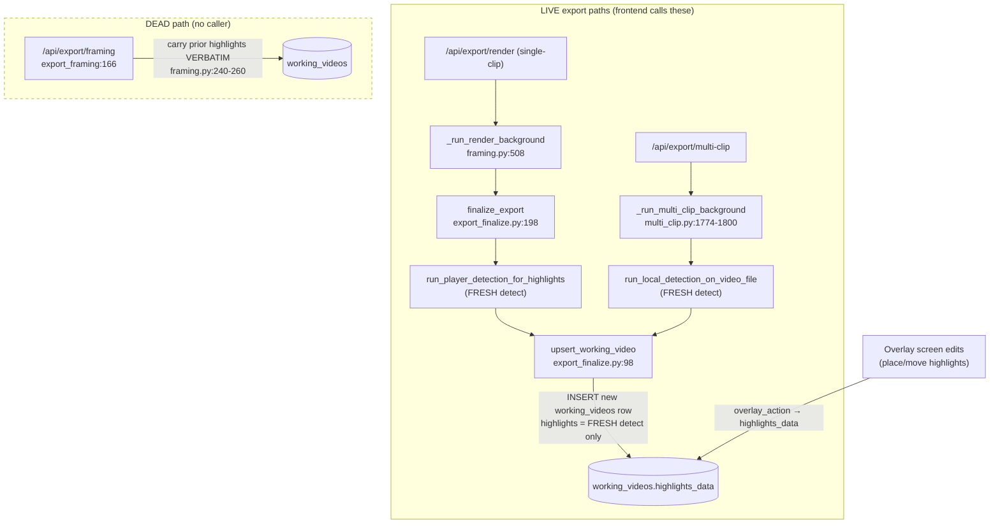

# T4350 — Design: Re-Export Must Re-Transform Carried-Forward Highlights

**Stage 2 (Architect) · Status at bottom.**
**Epic:** write-correctness · Audit item B7

---

## 0. HEADLINE — THE TASK PREMISE IS INVALID

> The task targets `routers/export/framing.py` `/framing` endpoint (~L240-260) carrying
> `working_videos.highlights_data` forward **verbatim**, and calls the bug **timing DRIFT**.
> **That endpoint is DEAD, and the real live bug is the opposite: DISCARD, not drift.**

Verified (Code Expert + re-verified here against source):

**The verbatim-carry site is a dead path.**
- `POST /api/export/framing` (`framing.py:166 export_framing`) is the ONLY carry-forward site
  (`framing.py:240-260`: reads prior `wv.highlights_data`, re-INSERTs it verbatim onto the new
  `working_videos` row).
- The frontend never calls it. `ExportButtonContainer.jsx` calls exactly three export endpoints:
  `/api/export/multi-clip` (`:569`), `/api/export/render` (`:627`), `/api/export/render-overlay`
  (`:684`). No `/api/export/framing` caller in frontend or backend (only a quest-step *string*
  `"export_framing"` + a poster comment reference the name).

**The LIVE finalizers do the opposite of carry-forward — they DISCARD and reseed.** Neither reads
the prior version's highlights; both run FRESH player detection and overwrite:
- Single-clip: `/render` → `_run_render_background` → `services/export_finalize.finalize_export`
  (`export_finalize.py:198`): `run_player_detection_for_highlights` (`:289`), fallback
  `generate_default_highlight_regions` (`:299`), then `upsert_working_video(highlights_data=encode_data(regions))`
  (`:305`).
- Multi-clip local branch: `multi_clip.py:1774-1800` — same fresh-detect-then-upsert shape, calling
  the SAME `upsert_working_video`.
- `upsert_working_video` (`export_finalize.py:98-195`) INSERTs a NEW `working_videos` row
  (`MAX(version)+1`, `:142-156`) with the freshly-detected `highlights_data`. It **NEVER reads the
  prior version's `highlights_data`** (confirmed: no SELECT of a prior wv row anywhere in the function).

**Consequence (the actual user-facing bug):** after a user places/edits highlights in the Overlay
screen and then does a Framing re-export (trim/speed/crop change → re-render), their edits are
**thrown away** and replaced by auto-detected regions (or default 2-second regions on detection
failure). `working_videos.highlights_data` is the SOLE home of user highlight edits, and
`transform_all_regions_to_raw` has **ZERO production callers** (grep: only tests), so edits are
never written back to per-clip raw space and cannot be recovered from there.

This is a *different, arguably worse* bug than the task's "verbatim drift": it is silent data LOSS,
not silent mis-timing. The design below is written against the REAL path.

---

## 1. Current-State Map (live paths)



**Where highlight edits live and how they die:**
- User edits are stored ONLY in `working_videos.highlights_data` (msgpack region dicts, times in
  concatenated **working-video seconds**). Written by overlay actions (`overlay.py overlay_action`).
- A Framing re-export creates a NEW `working_videos` version via `upsert_working_video`, whose
  `highlights_data` is **fresh detection output**. The prior version's edited `highlights_data` is
  never read. → edits lost.

**The one production transform caller — NOT a carry-forward:**
- `overlay.py:2100` `transform_all_regions_to_working` runs on the `/overlay-data` READ path, per
  `working_clips` row, projecting each clip's **raw DEFAULT regions** (`default_highlight_regions`,
  `:2078`) into working space for initial display. It is fed per-clip `crop_data`→crop_keyframes,
  `segments_data`, and one shared whole-video `working_video_dims` cv2 probe (`:2060`), framerate=30.0.
  It does not touch user-edited highlights and has no old↔new notion.

**Transform contracts** (`app/highlight_transform.py`, NOT `services/`):
- `transform_all_regions_to_raw(regions, crop_keyframes, segments_data, working_video_dims, framerate=30.0)` (`:909`)
- `transform_all_regions_to_working(raw_regions, crop_keyframes, segments_data, working_video_dims, framerate=30.0)` (`:935`)
- Out-of-range regions **DROP** (per-region helper returns None; the `_all_` wrappers filter None).
  Partial start/end clamps to the visible trim boundary.
- Neither canonicalizes internally — the caller MUST `canonicalize_segments_data(decoded, source_duration)`
  first (T4340 write-time-canonical; readers still defensively canonicalize — a known gap).
- Both are **single-clip and concat-offset-unaware**: they take ONE clip's crop/segments/dims and
  operate on region times as if in that clip's space.

---

## 2. What the fix actually requires (the linkage gap)

The intended correct behaviour is: on a Framing re-export, **preserve the user's edited highlights**,
mapping each region's times from the OLD timeline to the NEW timeline (transform what maps, drop what
was trimmed out). To do that on the live path we need to project OLD-working → (raw) → NEW-working.
Two structural gaps block the "clean" version of this:

**Gap A — no OLD↔NEW per-clip framing linkage.**
- NEW per-clip framing = the current latest `working_clips` (already updated to the new framing by
  the pre-export full-state `PUT /clips/{id}`).
- OLD per-clip framing = a *previous* `working_clips` version row. But there is **no linkage** from a
  `working_videos` version to the set of `working_clips` versions it was rendered from. `working_videos.version`
  and `working_clips.version` are independent counters; no snapshot rows record "wv v5 was rendered
  from wc {ids@versions}". So we cannot reconstruct the OLD crop/segments the edited highlight times
  were expressed against.
- Note the old highlights themselves ARE still readable at finalize time (the project still points at
  the old `working_video_id` until the repoint in `upsert_working_video`). The missing piece is the
  OLD FRAMING, not the old highlights.

**Gap B — multi-clip has no per-clip region attribution.**
- Multi-clip highlight regions carry `{id, start_time, end_time, enabled, keyframes, detections,...}`,
  all times in **concatenated working-video seconds**, with NO per-clip attribution. The transform
  fns are single-clip and concat-offset-unaware. Mapping a video-second `T` back through the correct
  per-clip transform needs (i) attributing `T` to a clip via old concat offsets, and (ii) re-emitting
  via new concat offsets — machinery that does not exist.

**Single-clip is materially simpler than multi-clip:** with one clip there is no concat offset and no
attribution problem; region times are just that clip's working seconds. Gap A still applies (we need
the OLD segments/crop), but for single-clip a lighter linkage suffices (see Options).

---

## 3. Target-State Options (against the REAL discard path)

All options share one premise correction: **there is no verbatim carry today to "fix" — carry itself
must be ADDED.** The task's "fast-path: no timing change → verbatim carry is correct" is only reachable
once we first stop discarding.

### Option (a) — Full re-transform (OLD-working → raw → NEW-working)
Snapshot OLD per-clip framing at export time, transform each edited region OLD→raw→NEW at the next
re-export.
- **Feasibility:** requires NEW machinery — (i) capture/persist an OLD-framing snapshot keyed to each
  `working_videos` version (closes Gap A: e.g. store the `{crop_keyframes, segments_data, dims}` used
  for the render alongside the wv row), and (ii) for multi-clip, per-region clip attribution + old/new
  concat-offset remapping (closes Gap B). Neither exists.
- **Single-clip vs multi-clip:** single-clip is achievable with a modest snapshot (one clip's
  crop+segments+dims per wv). Multi-clip needs BOTH new mechanisms and is a genuine new pattern.
- **Frontend surface:** "N highlights need re-placement" only when regions DROP (trimmed out).
- **Blast radius:** schema (snapshot storage), a new finalize step (capture on export) + a new
  transform step (project on re-export), changes to the SHARED `upsert_working_video` used by 2 live
  paths + recovery. **This is an L-tier, new-pattern change with a migration.**
- **Test shape:** transform fixtures (trim-shift, trim-removal, speed-scale) + finalize round-trip +
  multi-clip concat-offset fixtures.

### Option (b) — Drop + notify (stop discarding; keep only what maps trivially)
On re-export, carry the OLD edited highlights forward; drop any region whose bounds fall outside the
NEW duration; surface "N highlights need re-placement."
- **Feasibility:** carrying forward is trivial (read old `highlights_data`, pass through the same
  `upsert_working_video`). "What maps" without the OLD framing snapshot can only be evaluated crudely
  (e.g. region end ≤ new duration) — which is NOT correct across a trim/speed change (a region can be
  in-range numerically yet point at the wrong moment). So pure (b) without a snapshot risks re-introducing
  drift for the surviving regions.
- **Verdict:** only safe if "map" is defined as "no timing change at all" (fast-path), else it needs
  the same snapshot as (a).

### Option (c) — Hybrid (transform what maps cleanly, flag what doesn't)
= (a)'s transform + (b)'s notify. Same feasibility gates as (a) (needs the snapshot + multi-clip
attribution). Best END STATE; highest cost. This is the epic's eventual target.

### Option (d) — Carry-forward-or-drop with a fast-path, single-clip-first (RECOMMENDED shape)
Explicitly the option the task hints at, scoped to what is structurally sound TODAY:
1. **Stop discarding.** In `upsert_working_video` (or its callers), when a prior `working_videos`
   version with user-edited `highlights_data` exists, do NOT blindly reseed from detection.
2. **Fast-path (correct & cheap):** if the export carried NO timing change for the clip(s) — i.e.
   `segments_data`/`crop_data` unchanged since the version the highlights were authored against —
   carry the old highlights **verbatim** (they are already in the correct working seconds). This is
   the only case where verbatim carry is provably correct.
3. **Timing changed → transform-or-drop (single-clip only for this task):** with a per-version OLD
   FRAMING SNAPSHOT (Gap A closure, single-clip = one clip), transform OLD→raw→NEW; drop out-of-range;
   flag dropped count to the user. **Multi-clip timing-change is OUT OF SCOPE** (Gap B) — for multi-clip
   a timing change falls back to the current behaviour (fresh detect) BUT logs LOUDLY and surfaces a
   user-visible "highlights reset — re-place them" notice, so the loss is never silent.
- **Feasibility:** the fast-path and the "loud fallback for multi-clip" need no schema. The single-clip
  transform needs the OLD-framing snapshot (small migration). Whether to include even the single-clip
  transform in THIS task is the scope question for the user (see §6 Q2).
- **Blast radius:** touches the shared finalizer; if snapshot is included → migration + L-tier.

**Fast-path reconciliation (important):** "no timing change → verbatim carry" is correct, but note
there is no verbatim carry on the live path today — we are ADDING it. The task's framing ("never carry
verbatim across a timing change") describes a bug that does not exist on the live path; the real
banned outcome to prevent is **silent discard**.

---

## 4. Recommendation

**Recommend Option (d), single-clip-first, in two honestly-separated layers, and TREAT AS L-TIER.**

Rationale, against CLAUDE.md:
- **Correct-data-not-workarounds / no silent fallbacks:** the current fresh-detect-on-every-reexport
  is exactly a silent discard of canonical user data. The minimal correct move is: never silently
  replace user-edited highlights. Where we cannot correctly transform (multi-clip timing change), we
  must fail LOUDLY and visibly, not silently reseed.
- **No defensive fixes:** we are NOT patching symptoms — the root is "the finalizer has no concept of
  carrying user edits forward." (d) adds that concept.
- **Gesture-based persistence:** re-export is a named gesture (Export click). Carrying/transforming
  highlights happens inside that gesture's finalize path — no reactive write. The OLD-framing snapshot,
  if added, is written at export finalize (the same gesture), not reactively.
- **Abstract on the 3rd duplication / greppability:** `upsert_working_video` is already the single
  shared finalize writer (T5630) — the carry/transform logic belongs there or in one helper it calls,
  not duplicated per branch.

**Two layers, sequence-able:**
1. **L1 (must-have, no schema):** stop the silent discard. Add carry-forward of the prior version's
   `highlights_data` with the **verbatim fast-path** for the no-timing-change case, and a LOUD,
   user-visible fallback for every case we cannot yet transform (multi-clip timing change, and
   single-clip timing change if L2 is deferred). This alone converts silent data loss into either
   correct preservation (no-timing-change re-exports — the common "re-export to change nothing but
   re-render" case) or a visible "highlights reset" notice.
2. **L2 (correctness for single-clip timing changes, needs migration):** persist an OLD-framing
   snapshot per `working_videos` version and transform single-clip highlights OLD→raw→NEW with
   drop-and-notify. Multi-clip full attribution (Gap B) is a SEPARATE follow-up task, out of scope.

If the user wants the smallest correct increment, ship L1 only this task and file L2 + multi-clip as
follow-ups. If they want the single-clip drift fully fixed now, ship L1+L2.

---

## 5. Tier / Scope Reassessment (flag to supervisor)

The task was classified **M** (Architect + Tester). **That classification no longer holds.**

- The premise is invalid; the fix is a NEW capability (carry/transform user highlights across
  versions), not a line-edit to a carry site.
- Any correct transform (L2) requires **a profile_db migration** (OLD-framing snapshot column/table
  on `working_videos`) → schema change → **Migration agent required** and **L-tier** by the CLAUDE.md
  trigger ("schema changes, new patterns/abstractions").
- Even L1-only touches the SHARED finalizer used by 3 entry points (single-clip, multi-clip local,
  recovery) and introduces cross-version data flow — a new pattern, still L-tier by the "new
  abstraction / behaviour-adjacent risk on the export critical path" trigger.

**Verdict:** re-classify **L**. Add **Migration** agent IF L2 (snapshot) is in scope. Full staged
workflow (Architect gate — this doc — then Tester Phase 1, Implementor, Reviewer fan-out). The
`_SCHEMA_DDL` / fresh-DDL twin in `database.py` must be updated alongside any migration.

---

## 6. Open Questions for the User (THE GATE — ordered)

1. **Scope/product confirmation (blocking):** The real bug is that a Framing re-export **DISCARDS**
   overlay-edited highlights and reseeds auto-detected/default regions — it is NOT the verbatim
   timing-drift the task describes (that carry site, `/api/export/framing`, is dead). Confirm the
   intended fix is to **preserve** the user's edited highlights on re-export (verbatim when nothing
   timed-changed; transformed-or-dropped when it did), never silently reset them.

2. **Single-clip-first vs full multi-clip:** Confirm we scope THIS task to **single-clip** transform
   correctness (Option d, L1 + optionally L2), with multi-clip timing-change handled by a LOUD
   user-visible "highlights reset" fallback and a separate follow-up task for full multi-clip
   attribution. (Multi-clip full correctness = Gap B, a genuinely larger new mechanism.)

3. **L1-only vs L1+L2 this task:** Do you want the smallest correct increment now — **L1 only** (stop
   the silent discard: verbatim carry on no-timing-change + loud fallback otherwise, NO migration) —
   and file the single-clip transform (L2, needs a migration) as a follow-up? Or ship **L1+L2**
   together (adds a profile_db migration + Migration agent, larger diff)?

4. **Notification surface:** When highlights are dropped/reset, where should the "N highlights need
   re-placement" notice appear — the Overlay screen on next entry, an export-complete toast, or both?
   (Affects frontend scope; none exists today.)

5. **Detection interaction:** Today a re-export ALWAYS runs fresh player detection (tracking boxes +
   auto regions). If we carry user highlights forward, do we (a) skip detection entirely, or (b) keep
   running detection for `detections_data` (tracking) but NOT overwrite user regions? (b) is likely
   correct — tracking is video-level (T5600 `detections_data`), regions are user data — but it changes
   the finalize control flow and must be confirmed.

---

## 7. Risks

| Risk | Detail | Mitigation |
|------|--------|-----------|
| Lossy round-trip at trim boundaries | OLD→raw→NEW drops out-of-range regions and clamps partials; a region straddling a new trim edge shifts | Drop-and-NOTIFY (never silent); characterization fixtures for trim-shift / trim-removal / speed-scale before any structural change |
| Multi-clip offset correctness | Concat-offset + attribution machinery does not exist (Gap B); a naive transform would mis-map regions across clip boundaries | Keep multi-clip timing-change OUT of scope; loud fallback + follow-up task, never a silent best-effort |
| T4340 canonicalization requirement | Transform fns do NOT canonicalize; a non-canonical `segments_data` mis-computes boundaries | Caller MUST `canonicalize_segments_data(decoded, source_duration)` before transform (mirror overlay.py read path); assert in tests |
| Interaction with `/overlay-data` read-path transform | `overlay.py:2100` projects raw DEFAULTS to working; if L2 writes transformed user regions to `highlights_data`, ensure the read path still prefers saved edits over defaults (existing precedence) and does not double-transform | Verify `/overlay-data` saved-vs-default precedence; add a regression that a carried/transformed region survives a reload unchanged |
| Shared finalizer blast radius | `upsert_working_video` serves single-clip, multi-clip-local, and recovery; a change ripples to all three + the T7210 CAS / idempotency logic | Add carry logic as a thin, well-tested step; do not disturb the insert-once-per-job / CAS invariants; Reviewer fan-out |
| Detection still needed for tracking | Skipping detection to preserve regions could drop `detections_data` (tracking boxes) | Resolve via Q5 — likely keep detection for `detections_data`, skip only the region overwrite |
| Snapshot correctness (L2) | An OLD-framing snapshot must capture EXACTLY the crop/segments/dims used for that render, or the transform is wrong | Capture at the same finalize gesture from the same source the render used; pin with a round-trip test (export → edit → re-export-no-change → verbatim; → re-export-with-trim → shifted) |

---

## STATUS: APPROVED (2026-08-23) — proceed L1+L2, single-clip-first

User answers to the gate questions:
1. **YES** — redefine scope around the real bug (silent DISCARD), not the dead verbatim-drift endpoint.
2. **Single-clip-first.** Multi-clip timing/framing change stays a LOUD fallback notice THIS task.
   Full multi-clip attribution/remapping is filed as follow-up **T4355**
   (`docs/plans/tasks/write-correctness/T4355-multiclip-highlight-preservation.md`) — do NOT attempt
   multi-clip attribution here; just make the loud fallback solid + consistent for T4355 to build on.
3. **L1+L2** — ship full single-clip correctness incl. the OLD-framing snapshot migration. Migration
   agent added. Re-tiered **L**.
4. Notification surface = **BOTH** an export-complete toast AND a persistent Overlay-screen indicator.
5. **Keep player detection running for `detections_data` (tracking) ONLY** — its output must NOT
   overwrite carried/transformed user highlight regions.

## 8. Concrete implementation plan (L1 + L2)

### Schema (profile_db migration **v046**, head verified = v045; twin in `database.py` fresh DDL)
Two nullable columns on `working_videos`:
- `framing_snapshot BLOB` — msgpack of the per-clip framing THIS version was rendered with:
  `{clip_count, video_dims:{width,height}, clips:[{crop_keyframes, segments_data, width, height}]}`
  (single-clip = one entry; shape is multi-clip-ready for T4355). Written at every export finalize.
- `highlight_carry_note TEXT` — a short, greppable status code the frontend maps to user copy; NULL
  when nothing to surface. Codes (constants, no magic strings):
  `dropped:{n}` (n single-clip regions fell outside the new trim → "N highlights need re-placement"),
  `multiclip_reset` (multi-clip framing change → highlights re-detected, re-place them),
  `legacy_uncertain` (prior version had no snapshot → couldn't verify positions).
- **Backfill:** for each project's CURRENT `working_video_id`, snapshot the current latest
  `working_clips` framing into `framing_snapshot` (best-effort: the current wv was rendered from the
  current framing unless the user changed framing without re-exporting — an accepted legacy edge,
  covered by the loud notice). Non-current historical wv rows stay NULL. `highlight_carry_note` stays
  NULL for all existing rows. Idempotent; skips+logs projects with no derivable framing.

### Finalize control flow (`finalize_export` / `upsert_working_video`, the SHARED writer)
Detection ALWAYS runs (Q5) but only feeds `detections_data` + the first-export seed. Region source:
```
detected_regions, video_detections = <detect as today>            # for detections_data (+ seed)
new_framing = snapshot_current_framing(project_id)                # latest working_clips
prior_wv    = read project.working_video_id row BEFORE repoint    # highlights_data + framing_snapshot
if prior_wv has non-empty highlights:
    if new_framing == prior_wv.framing_snapshot (byte-equal msgpack):
        highlights = prior.highlights ; note = None                # FAST PATH (verbatim, correct)
    elif clip_count == 1 and prior_wv.framing_snapshot present:
        highlights, dropped = transform_single_clip_regions(       # OLD->raw->NEW
            prior.highlights, old=prior.framing_snapshot.clips[0], new=new_framing.clips[0])
        note = f"dropped:{dropped}" if dropped else None
    elif clip_count > 1:
        highlights = detected_regions ; note = "multiclip_reset"    # LOUD fallback (Gap B / T4355)
    else:  # single-clip but prior snapshot missing (legacy)
        highlights = prior.highlights ; note = "legacy_uncertain"   # carry + LOUD notice
else:
    highlights = detected_regions ; note = None                     # first export = seed (today's behaviour)
upsert_working_video(..., highlights_data=encode(highlights),
                     detections_data=encode(video_detections),
                     framing_snapshot=encode(new_framing),
                     highlight_carry_note=note)
```
`transform_single_clip_regions` = canonicalize BOTH segments_data (T4340 gotcha) →
`transform_all_regions_to_raw(old crop/segments/dims)` → `transform_all_regions_to_working(new ...)`;
`dropped` = count of regions the transform returned None for (out-of-range). No silent best-guess.

**Idempotency:** `upsert_working_video` is insert-once-per-job (`output_video_id` back-ref). The carry
decision is derived from the OLD wv (project pointer pre-repoint) + current working_clips — both stable
across a resume — and is recomputed identically, or simply UPDATEs the same row. Must not disturb the
`_claim_stage_for_finalize` CAS or the insert-once guard.

### Frontend (Q4) — notice surfacing (no new persistence beyond the column)
- Export-complete **toast**: the export status/response already returns the finalized working video;
  thread `highlight_carry_note` through to the completion payload → toast copy per code.
- Persistent **Overlay indicator**: `/overlay-data` read path returns `highlight_carry_note` → a
  dismissible banner/badge on the Overlay screen ("N highlights need re-placement"). Read-only surface;
  no reactive write. Dismissal is view-state only (not persisted) OR clears on next export.

### Detection interaction (Q5)
Detection output is used for `detections_data` (tracking, video-level) and ONLY seeds `highlights_data`
on a first export. When carrying/transforming, detected regions never overwrite user regions.

### Out of scope (T4355): multi-clip per-region attribution + concat-offset remapping. Multi-clip
framing change → `multiclip_reset` loud fallback only.

### §8.1 Expert-validated amendments (2026-08-23) — BINDING, supersede any conflicting text above

1. **[CRITICAL] Capture the NEW framing snapshot at export START, thread it through the job — NEVER
   re-read `working_clips` at finalize.** Finalize runs seconds-to-minutes after the render read; a
   pre-export `PUT /clips` (new `working_clips` version) or a concurrent edit can advance
   `latest_working_clips` between render and finalize, so a finalize-time re-read is NOT the framing
   the reel was rendered with → silent mis-transform (the exact bug we're killing, on the NEW side).
   - Build the snapshot in `_export_clips` (`multi_clip.py:1256`, the shared choke for BOTH backends —
     it already normalizes crop_keyframes + canonicalizes segments for the render), from the same
     `ClipExportData` the render uses.
   - `video_dims` comes from the **render target resolution** (e.g. `calculate_multi_clip_resolution`),
     NOT a cv2 file probe (the output file may not exist at capture time).
   - Persist the snapshot into `export_jobs.input_data` (sibling to `clips`) so the Modal/recovery
     `finalize_export` reconstructs it from the job (same way it reconstructs `source_clips`). Local
     in-band path passes it directly.
   - `upsert_working_video` receives the NEW snapshot as a PARAMETER. It does NOT compute it.
2. **[CRITICAL] The decision seam is a hybrid:** callers supply the NEW framing snapshot; the
   prior-wv read + carry DECISION stays INSIDE `upsert_working_video` (INSERT branch only — it needs
   the pre-repoint `projects.working_video_id`). Do not move the decision out; do not compute NEW
   framing inside upsert.
3. **[CRITICAL] UPDATE/recovery branch must physically NOT set `highlights_data`, `framing_snapshot`,
   or `highlight_carry_note`** — trim them from the SET list. Otherwise recovery-after-sync-failure
   re-seeds freshly-detected regions over the carried ones (the original bug, on the recovery path).
   Only filename/duration/detections_data refresh on UPDATE.
4. **[HIGH] Do NOT backfill `framing_snapshot` in v046 — leave it NULL.** A backfilled snapshot is a
   FABRICATED claim about what an old render used; for a user who changed framing without re-exporting
   it would make the byte-equal fast-path fire and carry verbatim against the WRONG framing (silent
   mis-timing — worse than NULL). NULL → first re-export takes the honest `legacy_uncertain` path
   (carry verbatim + LOUD "verify your highlights" notice). This is CLAUDE.md "no silent fallbacks /
   correct-data-not-workarounds." So **v046 only ADDS the two columns; no backfill.**
5. **[MED] `video_dims` sidedness:** feed OLD snapshot's `video_dims` to `transform_all_regions_to_raw`
   and NEW snapshot's `video_dims` to `transform_all_regions_to_working` (matters on aspect-ratio /
   output-resolution change; the two-sided transform re-scales keyframe pixels correctly only if both
   dims are right). Snapshot stores ONE video-level `video_dims` (the transform takes one
   whole-video dims, not per-clip); per-clip entries carry crop_keyframes + segments_data (+ their
   own source width/height for completeness, but the transform's dims arg is the video-level one).
6. **[MED] The `dropped:{n}` note derives ONLY from actual transform drops** (regions the transform
   returned None for), NEVER from a fast-path byte-compare miss. A byte-inequality that transforms to
   zero drops → note=None. Capture canonical segments at snapshot-write time (render start already
   canonicalizes); the transform's re-canonicalize is then a defensive no-op, not the guarantee.

**Idempotency (Q1), prior-pointer timing (Q2), CAS/lock invariants (Q4) validated correct as-is** —
no `await` between the prior-wv SELECT and commit inside upsert; the T7210 CAS + R2 upload lock are
separate layers and untouched.

### §8.2 Snapshot build — FINAL contract (crop-format correction)

The transform's `interpolate_crop_at_frame` (`highlight_transform.py`) reads `kf['frame']` — it needs
**frame-based** crop keyframes (the stored `working_clips.crop_data` form `{frame,x,y,width,height,origin}`).
The single-clip render path CONVERTS crop to time-based (`framing.py:595-599`) before building
`ClipExportData`, so the render-converted `clips_data[i]['cropKeyframes']` is time-based and would
mis-interpolate (all keys default to frame 0). **Therefore the snapshot must source crop from the
STORED `working_clips.crop_data` (frame-based), captured at export START in each router** (same rows
the render reads, so race-free), NOT from `_export_clips`'s converted `clips_data`.

- **Build site:** a shared helper `build_framing_snapshot(working_clip_rows, aspect_ratio)` (new, in
  `export_finalize.py` or `highlight_transform.py`), called in `render_project` (single-clip, from the
  `clip` row read at `framing.py:399-416`) and in the multi-clip export entry (from its working_clips
  resolve). `video_dims` = `calculate_multi_clip_resolution(clips_data, aspect_ratio)`.
- **Schema (msgpack):**
  `{clip_count:int, video_dims:{width,height}, clips:[{crop_keyframes:[frame-based], segments_data:{canonicalized full-list}, fps:float, raw_duration:float}]}`.
  `fps` stored per clip (single-clip render uses SOURCE fps, not 30) and fed to the transform's
  `framerate` arg on each side; for a single-clip re-export old fps == new fps (same source), so it is
  consistent — but storing it keeps the transform correct if they ever differ.
- **Threading:** encoded snapshot passed as `new_framing_snapshot: bytes|None` through
  `_run_render_background` → `_export_clips` → Modal `finalize_export` (persisted into
  `export_jobs.input_data` + `_persist_rendered_checkpoint` for recovery) and local `upsert_working_video`.
  `_export_clips` forwards the blob; it does NOT rebuild it.
- **Transform composition (single-clip carry):**
  `old = decode(prior_wv.framing_snapshot).clips[0]`, `new = decode(new_snapshot).clips[0]`;
  `raw = transform_all_regions_to_raw(old_regions, old.crop_keyframes, canonicalize(old.segments_data, old.raw_duration), old_video_dims, old.fps)`;
  `new_regions = transform_all_regions_to_working(raw, new.crop_keyframes, canonicalize(new.segments_data, new.raw_duration), new_video_dims, new.fps)`;
  `dropped = len(old_regions) - len(new_regions)` (regions the transform returned None for). Enabled-only
  regions participate (the transform already skips `enabled:false`).

---

_Original gate questions (now answered above):_
1. Confirm the fix is **preserve** overlay-edited highlights on re-export (not the dead verbatim-drift site).
2. Confirm **single-clip-first**, with multi-clip timing-change as a loud fallback + follow-up.
3. Choose **L1-only** (no migration) vs **L1+L2** (adds a profile_db migration + Migration agent) this task.
4. Where should the "N highlights need re-placement" notice surface?
5. On carry-forward, skip detection entirely, or keep detection for `detections_data` (tracking) only?
