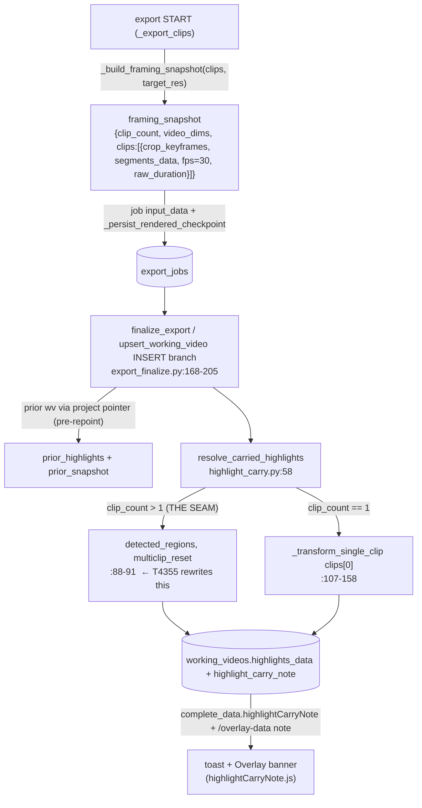

# T4355 — Design: Multi-Clip Highlight Preservation on Re-Export

**Stage 2 (Architect) · Status at bottom.**
**Epic:** write-correctness · follow-up from T4350
**Depends on:** T4350 (merged — reuse its snapshot + carry mechanism; do NOT duplicate)

---

## 0. HEADLINE — one seam to rewrite, and the crux is OLD concat offsets

T4350 already built the whole machine: a per-`working_videos`-version framing snapshot captured at
export START, threaded through the job (recovery-safe), decoded and fed to a PURE decision function
`resolve_carried_highlights` inside `upsert_working_video`'s INSERT branch. For MULTI-clip it stops
short — one branch (`highlight_carry.py:88-91`) returns `detected_regions, NOTE_MULTICLIP_RESET` and
the user must re-place every highlight.

T4355 replaces THAT branch with a per-clip transform. The single hard problem is that highlight
regions live in **concatenated working-video seconds with no clip attribution**, and the existing
transforms (`transform_all_regions_to_raw`/`_to_working`) are single-clip and concat-offset-unaware.
So we must (i) attribute each region to its OLD clip via OLD concat offsets, (ii) subtract that
offset, (iii) run the SAME two-step transform T4350 already composes but with `clips[i]` instead of
`clips[0]`, (iv) add the NEW clip's concat offset back. Everything else — snapshot capture, the
INSERT-branch-only decision seam, the UPDATE-must-not-touch invariant, note plumbing, frontend copy —
is already in place and MUST be reused verbatim.

**The crux (verified):** OLD concat offsets are `Σ` of per-clip OUTPUT durations, and per-clip output
duration is derivable from the snapshot's `{segments_data, raw_duration}` via
`highlight_transform.get_output_duration(segments_data, raw_duration)` (`:169-221`) — the SAME `Σ`
the NEW-side builder uses (`calculate_effective_duration` / `get_output_duration`). This is fully
self-sufficient for `cut` transitions. For `dissolve`, offsets need the OLD `transition` config, which
the snapshot does NOT currently persist. That single gap is the second design decision below.

---

## 1. Current-State Map



**Decision order today** (`resolve_carried_highlights`, `highlight_carry.py:58-104`):
1. `not prior_highlights` → `detected_regions, None` (first-export seed) `:78`
2. `prior_snapshot == new_snapshot` → `prior_highlights, None` (verbatim fast-path) `:85`
3. **`clip_count > 1` → `detected_regions, NOTE_MULTICLIP_RESET`** `:88-91` ← **THE SEAM**
4. single-clip `prior_snapshot is None` → `prior_highlights, NOTE_LEGACY_UNCERTAIN` `:98`
5. single-clip framing change → `_transform_single_clip`, `dropped:N` else None `:101-104`

**`_transform_single_clip` (`:107-158`), the shape we generalize:**
- HARD-INDEXES `prior_snapshot["clips"][0]` / `new_snapshot["clips"][0]` (`:120-121`).
- `canonicalize_segments_data` both segments (defensive no-op — snapshot is captured canonical).
- `transform_all_regions_to_raw(prior_highlights, old crop_keyframes, old_segments, prior_snapshot["video_dims"], old fps)`.
- `transform_all_regions_to_working(raw, new crop_keyframes, new_segments, new_snapshot["video_dims"], new fps)`.
- Merges geometry back onto the original region by id (`{**base, **region}`, `:149-154`) so labels /
  per-region overrides survive.
- `dropped = max(0, enabled_prior_count - len(new_regions))` — **ENABLED regions only** (`:156-157`).

**Framing snapshot shape** (`_build_framing_snapshot`, `multi_clip.py:95-124`) — already N entries for a
real multi-clip export:
```
{clip_count:int,
 video_dims:{width,height},            # render target_resolution (NOT a cv2 probe)
 clips:[{crop_keyframes:[frame-based]|[], segments_data:{canonical}, fps:30.0, raw_duration:float}, ...]}
```
**Does NOT store `transition`.** `fps` is fixed 30.0.

**Concat-offset builders** (`multi_clip.py`), both emit `source_clips:[{index,name,start_time,end_time,duration}]`
with running cumulative `current_time`; dissolve subtracts `transition_duration` per clip after the
first:
- `build_clip_boundaries_from_durations(clips_data, actual_durations, transition)` `:598` (measured, local path).
- `build_clip_boundaries_from_input(clips_data, transition)` `:642` (reconstruct-from-input, Modal/recovery).

**No per-region clip attribution exists.** `overlay.py` create/update stamp
`{id,start_time,end_time,enabled,keyframes,detections}` (+ optional label/geometry) — no clip index.
`OverlayActionData` has no clip field. Regions are in CONCATENATED working seconds.

---

## 2. The linkage gap this task closes (restated for multi-clip)

The old→raw→new transform is per-CLIP. A concatenated region time `T` cannot enter it until we know
**which clip** it belongs to and **where that clip's local timeline begins** — on BOTH the old and the
new side:

- **OLD attribution** needs OLD concat offsets = `Σ` per-clip OLD output durations. Derivable from the
  prior snapshot's `{segments_data, raw_duration}` for `cut`; needs OLD `transition` for `dissolve`.
- **NEW re-emission** needs NEW concat offsets = `Σ` per-clip NEW output durations. Derivable from the
  NEW snapshot's `{segments_data, raw_duration}` (same `get_output_duration` `Σ`); for `dissolve` needs
  the NEW `transition`, which the current export DOES have in scope (it built `source_clips` with it).

Both sets of offsets must come from **snapshot-derived data, never a finalize-time re-read of
`working_clips`** (the T4350 §8.1 pt1 invariant — a pre-export `PUT /clips` can advance
`latest_working_clips` between render and finalize).

---

## 3. Design decisions (the gate) — options + recommendation

### Decision 1 — Attribution mechanism: (a) persist-on-write vs (b) derive-at-transform-time

**Option (a) — stamp a clip reference on each region at write time.**
The Overlay screen knows which clip a highlight was placed on; write a `clip_index` (or clip id) onto
the region dict in `overlay.py create_region`/`update_region`, plumb a clip field through
`OverlayActionData` and the Overlay handler, and read it at transform time.
- Cost: new frontend plumbing (which clip is the cursor over?), a new region field, a model change to
  `OverlayActionData`, and a backend handler that currently has no clip index in scope.
- **Fatal flaw:** it only helps regions written AFTER the change. Every EXISTING user highlight (the
  data this task exists to preserve) has no stamp → still needs offset attribution. So (a) does not
  remove the offset machinery; it ADDS a second, parallel code path on top of it. That violates
  "one way to do each thing" and "abstract on the 3rd duplication, not the 1st."
- It also duplicates a fact already fully determined by `start_time` + offsets — a stored `clip_index`
  can drift out of sync with `start_time` after any edit that isn't perfectly transactional.

**Option (b) — derive attribution at transform time from OLD concat offsets + region `start_time`.**
Compute OLD concat offsets from the prior snapshot, then for each region find the clip bucket its
`start_time` falls into. No new field, no frontend change, works identically for existing and future
regions.

**RECOMMENDATION: Option (b).** It is the only mechanism that covers existing data, adds no plumbing,
keeps a single code path, and reuses machinery T4350 already ships. (a) is strictly more code for
strictly less coverage.

**The exact attribution rule (b), with edge cases resolved explicitly — no silent best-guess:**

Let OLD offsets give each clip `i` an output span `[off_i, off_i + dur_i)` in concatenated seconds
(`dur_i = get_output_duration(old_clips[i].segments_data, old_clips[i].raw_duration)`; for dissolve,
`off_i` already has the overlap subtracted — see Decision 2).

For each ENABLED region with `[start_time, end_time]`:
- **(rule) Attribute by `start_time`.** Clip `i` is the one with `off_i <= start_time < off_i + dur_i`.
  `start_time` is the anchor because a highlight's keyframes/geometry are authored against the moment
  it BEGINS; attributing by start keeps the region on its intended clip.
- **(i) Straddle (start in clip i, end in clip i+1).** Attribute to clip `i` (by start), then **clamp
  `end_time` to `off_i + dur_i`** (the attributed clip's OLD output span end) before subtracting the
  offset. Rationale: the transform is per-clip; the tail in clip i+1 has no meaning in clip i's local
  timeline. This mirrors the single-clip transform's existing partial-clamp behavior (it clamps a
  region straddling a trim edge to the visible boundary). The clamp is logged. If clamping leaves a
  degenerate region (`end <= start` after clamp), it DROPS + counts.
- **(ii) Exactly on a boundary (`start_time == off_i`).** Half-open interval `[off_i, off_i + dur_i)`
  attributes it to clip `i` (the clip it STARTS), never clip `i-1`. Deterministic, no ambiguity.
- **(iii) Dissolve-overlap window (a time that belongs to two clips visually).** With overlap-subtracted
  offsets the concatenated timeline is a strict partition (`off_{i+1} = off_i + dur_i - overlap`), so
  every `start_time` still lands in exactly one half-open bucket by the rule above — the region is
  attributed to whichever clip's bucket its start falls in. We do NOT attempt to represent a highlight
  as "spanning the dissolve"; it belongs to one clip, end clamped as in (i). Logged when the start
  falls inside an overlap window so the drop/clamp is never silent.

A DISABLED region is carried through untransformed by id-merge (as today the transform skips
`enabled:false`) and never counts toward `dropped`.

---

### Decision 2 — The dissolve / `transition` gap

OLD concat offsets are fully derivable for `cut`. For `dissolve`, the per-clip overlap subtraction
needs the OLD `transition.duration`, which the snapshot blob does NOT store.

**Option (i) — add `transition` to the framing_snapshot blob.**
One additive msgpack key (`"transition": {"type","duration"} | None`) written by `_build_framing_snapshot`.
- The column is already `working_videos.framing_snapshot BLOB` (msgpack, v046) → a new key is
  **additive, NO migration** (Code Expert confirmed; msgpack decode of an old blob simply lacks the key).
- Makes OLD offsets fully self-sufficient AND symmetric with the NEW side (which already has the
  transition in scope). This is the clean end state.
- **Caveat (must be spelled out to the user):** multi-clip snapshots ALREADY persisted by T4350 for
  existing projects were written BEFORE this key existed → they will lack `transition`. Those are
  LEGACY. A legacy prior snapshot on a `dissolve` re-export cannot derive OLD offsets → it takes the
  loud fallback (Decision 4's reset code), never a guess. A legacy `cut` project needs no transition,
  so it transforms fine. (We can detect "no transition key present" and treat it as `cut` ONLY when
  `clip_count`'s offsets don't depend on it — safest is: key absent → assume `cut`; if the true old
  transition was dissolve, offsets are off by the overlap and regions near boundaries may clamp/drop
  and get flagged, never silently mis-placed. Recommended: **absent key ⇒ treat as `cut`**, because
  dissolve overlap is ≤ ~0.5s and the drop/clamp+flag path is loud, not silent.)

**Option (ii) — accept dissolve → loud fallback; transform cut-only.**
Leave the snapshot unchanged; if `transition.type == 'dissolve'`, return the loud reset note; only
`cut` multi-clip re-exports get the transform.
- Zero snapshot change. But it permanently strands dissolve multi-clip projects on the reset path even
  for future exports, and it splits the code into "cut path transforms / dissolve path resets" — a
  second-class citizen with worse UX for no structural reason once (i) is essentially free.

**RECOMMENDATION: Option (i)** — add `transition` to the snapshot (no migration). It is a one-key,
migration-free change that makes both sides symmetric and future exports fully correct for dissolve.
LEGACY snapshots lacking the key take the honest path: `cut` transforms; a snapshot with no transition
key on a project we can't prove was cut is handled by the "absent ⇒ cut" rule above, with any resulting
boundary mismatch surfaced as a loud drop/clamp flag, never a silent mis-map.

**Schema verdict:** the ONLY schema-shaped change is this additive msgpack key inside an existing BLOB
column → **NO migration, NO new column, NO `_SCHEMA_DDL` change.** (See Decision 5.)

---

### Decision 3 — Per-clip transform composition (the generalized algorithm)

Replace `_transform_single_clip`'s `clips[0]` hard-index with a per-region loop. New pure helper
(same module, same test-without-DB property), e.g. `_transform_multi_clip(prior_highlights,
prior_snapshot, new_snapshot)`:

```
old_offsets = concat_offsets(prior_snapshot)   # [off_0, off_1, ...] from get_output_duration + OLD transition
new_offsets = concat_offsets(new_snapshot)     # same, NEW side
dropped = 0
out = []
for region in prior_highlights:
    if not region.enabled:            # carried untransformed by id-merge; never counted
        continue
    i = attribute(region.start_time, old_offsets, old_durs)   # Decision 1 rule (i/ii/iii)
    if i is None or i >= new_snapshot.clip_count:             # unattributable OR clip gone in NEW
        dropped += 1; continue                                 # DROP + count (loud)
    local = shift(region, by = -old_offsets[i], clamp_end_to = old_offsets[i] + old_durs[i])
    raw   = transform_all_regions_to_raw([local], old_clips[i].crop_keyframes,
                canonicalize(old_clips[i].segments_data, old_clips[i].raw_duration),
                prior_snapshot.video_dims, old_clips[i].fps)
    new_local = transform_all_regions_to_working(raw, new_clips[i].crop_keyframes,
                canonicalize(new_clips[i].segments_data, new_clips[i].raw_duration),
                new_snapshot.video_dims, new_clips[i].fps)
    if not new_local:                 # trimmed out on the NEW side
        dropped += 1; continue        # DROP + count (loud)
    out.append(shift(new_local[0], by = +new_offsets[i]))     # re-emit in NEW concatenated seconds
merged = id_merge(out, prior_highlights)   # SAME {**base, **region} merge as single-clip (:149-154)
return merged, dropped
```

**Details bound to existing contracts:**
- `concat_offsets(snapshot)` = the SAME `Σ get_output_duration` the boundary builders use, with the
  dissolve overlap subtraction from Decision 2. Prefer FACTORING the offset math out of
  `build_clip_boundaries_from_input` so there is ONE offset formula, not a copy (abstract-on-3rd:
  boundary builder + old-side + new-side = 3 uses → extract a shared `concat_offsets` helper).
- **`video_dims` sidedness** (T4350 §8.1 pt5): OLD `video_dims` → `to_raw`; NEW `video_dims` → `to_working`.
  Snapshot stores ONE video-level dims per side; per-clip `crop_keyframes`/`segments` do the rest.
- **`dropped` counts ENABLED regions only** and is the SAME contract as single-clip — see Decision 4.

**Failure sub-cases, all → DROP + count (never silent):**
- **Attributed OLD clip index no longer exists in NEW** (`i >= new_snapshot.clip_count` — clip removed,
  or the concat shrank): DROP + count.
- **Transform returns None** (region trimmed out of the NEW clip): DROP + count (same as single-clip).
- **Straddle clamp collapses the region** (`end <= start`): DROP + count.

**Reorder honesty (must be stated as a limitation).** The snapshot identifies clips only by
**positional index** (`clips[i]`) — there is **no stable clip id** in the snapshot shape. Therefore a
pure REORDER (clip A and clip B swap positions between exports) is INDISTINGUISHABLE from "clip i was
independently re-framed": position `i` in OLD and position `i` in NEW are treated as the same clip.

Consequence: on a reorder, a region attributed to OLD position `i` transforms against NEW position `i`
— which is now a DIFFERENT source clip. Its raw geometry will usually fall outside that clip's trim
→ the transform returns None → DROP + count (loud), OR it lands on the wrong clip's timeline. To avoid
a silent WRONG-clip landing we take the safe reading: **positional index is the only identity we have;
a reorder is handled as "same-position clip changed," and any region that doesn't cleanly survive the
positional transform DROPS + flags.** We do NOT attempt reorder detection in this task (it would need a
stable per-clip id persisted in the snapshot — a separate, larger change). This limitation is called
out to the user in the gate (Q3) and covered by a fixture (reorder → dropped+flagged, never silently
re-placed on the wrong clip). If the user wants true reorder-survival, that is a follow-up that adds a
clip id to the snapshot.

---

### Decision 4 — Note codes

**RECOMMENDATION: reuse `dropped:N` for the multi-clip success-with-drops case.** The user-facing
meaning is identical ("N highlights need re-placement"), the frontend copy already handles
`dropped:N` (`highlightCarryNote.js:18-23`), and `_transform_multi_clip` produces a `dropped` count on
the exact same contract as `_transform_single_clip`. No new code, no new copy mapping.

Keep `NOTE_MULTICLIP_RESET` ONLY for the genuinely-unmappable case that remains after this task:
- a LEGACY prior snapshot that is multi-clip but has no per-clip data we can transform against, OR
- a `dissolve` re-export whose prior snapshot lacks `transition` AND we cannot safely assume `cut`.

So the new decision order in `resolve_carried_highlights` becomes:
1. empty prior → seed detected (unchanged)
2. `prior_snapshot == new_snapshot` → verbatim (unchanged)
3. `prior_snapshot is None` (legacy, ANY clip_count) → verbatim carry + `legacy_uncertain`
   *(promote this above the clip_count branch so multi-clip legacy takes the honest verbatim+flag path,
   not a detection reset — carrying the user's real regions with a "verify positions" flag is strictly
   better than discarding them)*
4. `clip_count == 1` → `_transform_single_clip` (unchanged, `dropped:N`)
5. `clip_count > 1` → `_transform_multi_clip` (NEW), `dropped:N` else None
6. residual genuinely-unmappable multi-clip (e.g. dissolve with no derivable OLD offsets) →
   `detected_regions, NOTE_MULTICLIP_RESET`

No NEW note code is introduced. `highlightCarryNote.js` is UNCHANGED. Toast + Overlay banner plumbing
reused verbatim.

---

### Decision 5 — Migration: NO

Confirmed **no migration**:
- Regions need no new field (Decision 1 chose derive-at-transform, option b).
- `framing_snapshot` is already a `BLOB` (msgpack) at v046; adding the `transition` key (Decision 2)
  is additive inside the existing column — no DDL, no `PRAGMA user_version` bump, no `database.py`
  fresh-DDL twin change, no `_SCHEMA_DDL`/`pg.py` change.
- Legacy blobs lacking the key decode fine (msgpack) and route to the honest legacy/reset path.

The classification's "Migration: Probably No — confirm" resolves to **No.** (It flips to Yes ONLY if
the user rejects option b for option a, or picks a genuinely new persisted field — neither recommended.)

---

### Decision 6 — Recovery-safety (invariants preserved, not re-derived)

- **OLD-side offsets** derive from the PRIOR snapshot blob (already persisted, recovery-safe) — never a
  finalize-time re-read of `working_clips` (T4350 §8.1 pt1). ✔
- **NEW-side offsets** derive from the CURRENT export's own snapshot (captured at export START in
  `_build_framing_snapshot`, threaded via `input_data` + `_persist_rendered_checkpoint`), already
  available in the finalize path. If Decision 2 (i) is taken, `_build_framing_snapshot` also stores the
  transition it was invoked with — same START-time capture, same threading. ✔
- **INSERT-branch-only decision seam preserved:** the new branch lives entirely inside
  `resolve_carried_highlights`, called from `upsert_working_video`'s INSERT branch (`export_finalize.py:197`).
  No caller change beyond the snapshot now carrying `transition`. ✔
- **UPDATE/recovery branch must NOT touch `highlights_data`/`framing_snapshot`/`highlight_carry_note`**
  (`export_finalize.py:150-166`, T4350 §8.1 pt3) — UNCHANGED. ✔
- `_transform_multi_clip` is a PURE function (dicts in, dicts out), unit-testable without a DB, like its
  single-clip sibling. ✔

---

## 4. Recommendation (summary)

Rewrite the `clip_count > 1` seam into a per-clip transform:
1. **Attribution = derive-at-transform-time (option b)** from OLD concat offsets + region `start_time`,
   with explicit straddle-clamp / boundary / dissolve-window rules.
2. **Add `transition` to the framing snapshot** (additive msgpack key, no migration) so OLD offsets are
   self-sufficient and symmetric with NEW; legacy blobs without it route to the honest legacy/reset path.
3. **Generalize `_transform_single_clip` → `_transform_multi_clip`** (per-region loop, `clips[i]`),
   reusing the two existing transforms + the id-merge + the ENABLED-only `dropped` contract.
4. **Reuse `dropped:N`** for success-with-drops; keep `multiclip_reset` for the genuinely-unmappable
   residual; no new note code, no frontend change.
5. **No migration.**
6. **Extract ONE `concat_offsets` helper** (shared by the boundary builder + both transform sides) so
   the offset formula exists once.

Tier stays **L** by inheritance from T4350 (export critical path, new-pattern-adjacent), but the diff is
concentrated in `highlight_carry.py` + `_build_framing_snapshot` + one extracted offset helper.

---

## 5. Concrete implementation plan

| File | Change |
|------|--------|
| `services/highlight_carry.py` | Rewrite the `clip_count > 1` branch (`:88-91`) → `_transform_multi_clip`. Reorder rules so legacy (prior_snapshot None) is handled before the clip_count split (Decision 4 step 3). Add `_transform_multi_clip` (per-region attribute → offset-subtract → `to_raw` clips[i] → `to_working` clips[i] → offset-add → id-merge; ENABLED-only `dropped`). Residual unmappable dissolve/legacy-multiclip → `NOTE_MULTICLIP_RESET`. |
| `routers/export/multi_clip.py` | `_build_framing_snapshot`: add `"transition"` key (Decision 2). Extract a shared `concat_offsets(snapshot)` / offset formula from `build_clip_boundaries_from_input` and reuse it in `_transform_multi_clip` (abstract-on-3rd). |
| `services/export_finalize.py` | No behavioral change — INSERT-branch call unchanged; `clip_count` already passed. Verify the snapshot now carrying `transition` round-trips through decode. |
| `tests/test_t4355_multiclip_carry.py` (new) | Pure-function fixtures — see §6. |
| `tests/test_t4350_carry_finalize.py` | Extend: a multi-clip INSERT-branch round-trip carries transformed regions (not a reset). Assert UPDATE branch still leaves highlights/snapshot/note untouched. |

**Transforms (`app/highlight_transform.py`): UNCHANGED** — they stay single-clip/offset-unaware; the
per-clip loop wraps them. `get_output_duration` (`:169`) is reused as-is for the offset `Σ`.

**No frontend change** (`highlightCarryNote.js` unchanged; toast + banner reused).

---

## 6. Test plan (Tester Phase 1 — pure fixtures first)

Acceptance-criteria-driven, DB-free where possible (pure `_transform_multi_clip` / `resolve_carried_highlights`):
- **Offset-only shift:** highlight on clip 2 of 3, trim applied to clip 1 only → clip-2 region SURVIVES,
  re-emitted at the NEW offset (not reset). (AC-1)
- **Same-clip timing change:** highlight on the clip whose speed/trim changed → transforms old→raw→new
  exactly as the single-clip path does. (AC-2)
- **Clip removed:** highlight on a clip dropped from the concat → DROP + `dropped:N`, LOUD. (AC-3)
- **Reorder:** two clips swapped → region on the moved clip DROPs + flags (never silently re-placed on
  the wrong clip). (Decision 3 limitation)
- **Straddle:** region starting in clip i, ending in clip i+1 → attributed to i, end clamped, logged;
  drops if it collapses.
- **Boundary-exact:** `start_time == off_i` attributes to clip i (half-open).
- **Dissolve:** snapshot WITH `transition` → offsets subtract overlap correctly; LEGACY snapshot without
  `transition` on a dissolve project → `multiclip_reset` (loud), never a silent mis-map.
- **Disabled region:** carried untransformed by id-merge, not counted in `dropped`.
- **Finalize round-trip:** multi-clip INSERT branch carries transformed regions; UPDATE/recovery branch
  leaves highlights/snapshot/note untouched.

---

## 7. Risks

| Risk | Detail | Mitigation |
|------|--------|-----------|
| Reorder mis-attribution | Positional-only identity → a reorder can land a region on the wrong clip | Safe reading: any region that doesn't cleanly survive the positional transform DROPs + flags; fixture locks it; called out in gate Q3; true reorder-survival is a follow-up (needs a persisted clip id) |
| Dissolve offset drift | Legacy snapshot lacks `transition`; wrong overlap → boundary regions mis-bucketed | Decision 2: new key for future exports; legacy dissolve → loud `multiclip_reset`; absent-key ⇒ cut only where offsets don't depend on it, any mismatch surfaces as a loud drop/clamp, never silent |
| Straddle handling | A region spanning a clip boundary has no per-clip meaning | Attribute by start, clamp end to the attributed clip's OLD span, log; collapse → drop+count |
| Offset formula duplication | Three sites compute concat offsets (boundary builder, old side, new side) | Extract ONE `concat_offsets` helper (abstract-on-3rd), reuse everywhere |
| `dropped` semantics drift | Multi-clip must count ENABLED-only like single-clip | Reuse the exact `_transform_single_clip` counting contract; fixture asserts disabled not counted |
| Recovery re-seed | UPDATE branch touching carry fields would re-seed detection | T4350 §8.1 pt3 invariant unchanged; regression asserts UPDATE leaves carry fields alone |
| Snapshot decode of new key | Old blobs without `transition` must decode cleanly | msgpack tolerates missing key → `.get("transition")` → None → legacy/cut routing; fixture with a keyless blob |

---

## STATUS: AWAITING APPROVAL

### Open Questions for the User (THE GATE — ordered)

1. **Attribution mechanism (blocking).** Confirm we DERIVE each region's clip at transform time from
   OLD concat offsets + the region's `start_time` (Option b), rather than stamping a clip reference on
   regions at write time (Option a). Option (b) is recommended because it is the ONLY mechanism that
   preserves EXISTING user highlights (which carry no stamp), adds no frontend/model plumbing, and keeps
   a single code path. Straddle/boundary/dissolve-overlap edge cases are resolved by an explicit
   attribute-by-start + clamp-end rule (never a silent guess).

2. **Dissolve / transition (blocking).** Confirm we add a `transition` key to the existing
   `framing_snapshot` msgpack blob (ADDITIVE, **no migration**) so OLD concat offsets are self-sufficient
   and symmetric with the NEW side. LEGACY multi-clip snapshots already written by T4350 lack this key:
   on a `dissolve` re-export they take the LOUD `multiclip_reset` fallback (never a silent mis-map); on a
   `cut` re-export they transform fine. The alternative (accept dissolve → always loud fallback, transform
   cut-only) is rejected because option (i) is essentially free and avoids a permanent second-class path.

3. **Reorder honesty (confirm the limitation).** The snapshot identifies clips only by POSITION (no
   stable clip id). A true reorder is indistinguishable from "same-position clip re-framed," so a region
   on a moved clip DROPS + flags LOUDLY (never silently re-placed on the wrong clip). Confirm this is
   acceptable for T4355; true reorder-survival (persist a clip id in the snapshot) is filed as a
   follow-up. All other multi-clip cases (offset-only shift on unchanged clips, same-clip timing change,
   clip removal) are handled correctly.

4. **Note codes (confirm).** Multi-clip success-with-drops reuses the EXISTING `dropped:N` note (same
   copy, same frontend mapping — no new code, no UI change). `multiclip_reset` is kept ONLY for the
   genuinely-unmappable residual (legacy dissolve with no derivable OLD offsets). Confirm no new note
   code is desired.

5. **Migration = NO (confirm).** No column, no `PRAGMA user_version` bump, no `_SCHEMA_DDL` change — the
   only persisted change is an additive key inside the existing `framing_snapshot` BLOB. Confirm you
   agree no Migration agent / migration file is needed.
