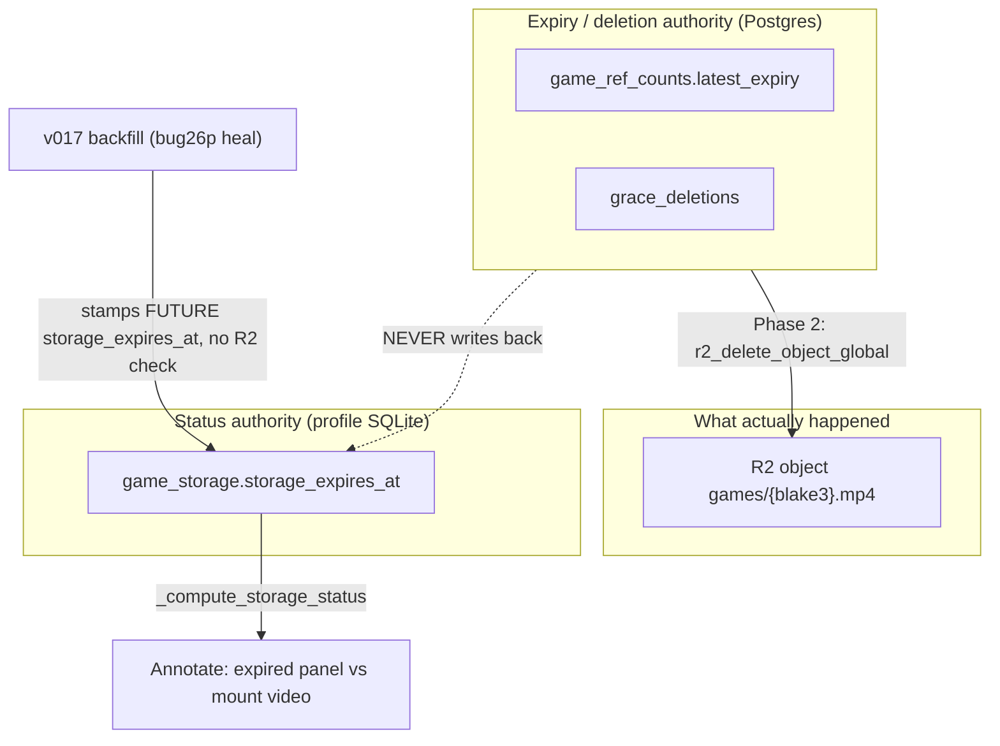
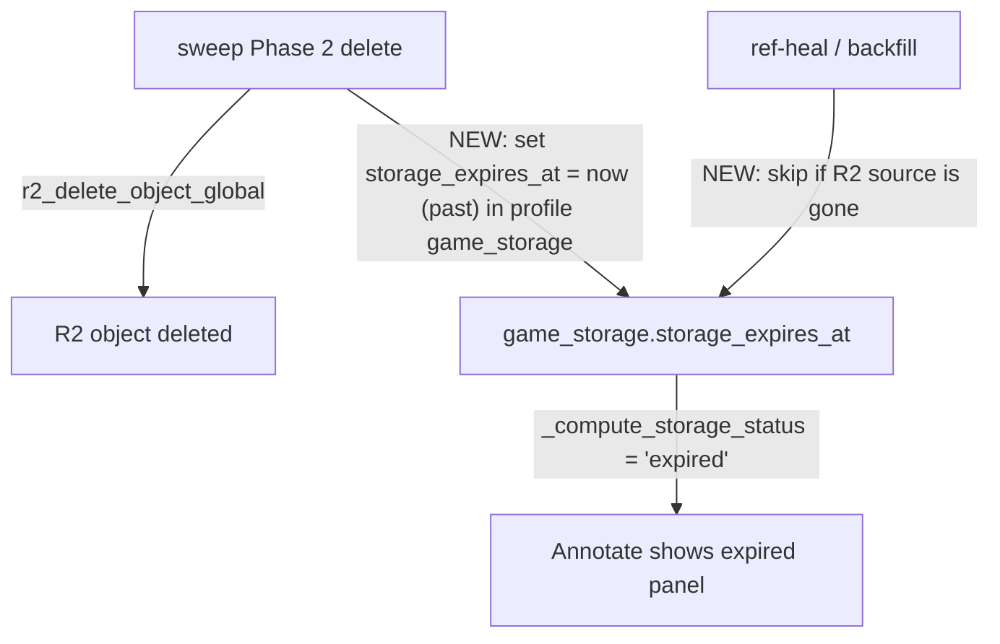

# T4820 Design — Expired-source status corruption (bug 27p/29p)

**Status:** Awaiting approval
**Scope:** Part 1 (data repair) is settled — documented here for completeness. Part 2 (root
cause) is the design decision requiring approval.

## Current State

Two independent facts about a game's source video live in **two unsynchronized stores**:



Pseudo (today):

```
# sweep_scheduler.py Phase 2
for hash in grace_expired:
    r2_delete_object_global(f"games/{hash}.mp4")   # source gone
    delete_grace_deletion(hash)
    # <-- profile game_storage.storage_expires_at is NOT touched

# v017 backfill (already ran on prod)
for game in ready_games_missing_a_storage_ref:      # includes games whose source was deleted
    insert_game_storage_ref(..., storage_expires_at = now + retention)   # FUTURE, no R2 check

# games.py read path
def _compute_storage_status(expires_at, auto_export_status):
    if expires_at:  return 'expired' if expires_at < now else 'active'   # future -> 'active'
    return 'expired' if auto_export_status else 'active'
```

Result: a game with **no R2 source** but a **future** `storage_expires_at` computes `'active'`
→ the frontend mounts a `<video>` against a 404 → bug 29p.

## Target State

`storage_expires_at` must tell the truth about the source. The delete path becomes a writer of
it, and no heal path may resurrect a future expiry for an already-deleted source.



## Implementation Plan

### Part 1 — data-repair migration (settled, no open questions)

`src/backend/app/migrations/profile_db/v0NN_repair_sourceless_active_games.py`:

- Guard: return early if `games` / `game_storage` tables absent (empty profile DBs).
- For each game: compute status from `game_storage.storage_expires_at` + `games.auto_export_status`.
  If `'active'`, gather source hashes (`game_videos.blake3_hash` for the game, else
  `games.blake3_hash`) and `head_object games/{hash}.mp4` (s3v4 + region='auto').
- If **any** source hash is missing → force expired: `UPDATE game_storage SET storage_expires_at = <past>`
  for the game's `blake3_hash`; `INSERT` a row with a past expiry when none exists (game 5 case).
- **Tuple row factory** — index positionally; test with populated rows.
- Idempotent; log per-user repaired count.

### Part 2 — root cause (needs approval)

**2a. Sweep writes truth on delete.** In `sweep_scheduler.py` Phase 2, when
`r2_delete_object_global(games/{hash}.mp4)` succeeds, also set the profile
`game_storage.storage_expires_at` to now (past) for every profile/game on that hash. Because the
sweep iterates per user/profile already, thread the write through the same per-profile context
(reuse the existing `auth_db`/`database` connection helpers; add e.g. `expire_game_storage(hash)`
next to `insert_game_storage_ref`). This makes the status store truthful the instant the source
dies — no dependence on a future read-time R2 check.

**2b. Heal path stops resurrecting.** In the ref-heal path (`v017`-style backfill and the
`activate_game` self-heal that writes refs), skip any game whose R2 source object is already
absent. A game missing its source is legitimately expired, not a missing-ref-but-present game.

## Risks & Open Questions

1. **Per-game R2 head in the repair migration** — 16 profiles / few games each, so trivial now,
   but the migration runs per user's R2 DB on trigger. Acceptable one-time cost; log counts.
2. **Sweep write scope (2a):** the delete is keyed by `blake3_hash`, which can be shared across
   profiles/games (ref-counted). Confirm we expire `storage_expires_at` for **all** games/profiles
   on that hash, and only when the object is actually deleted (grace elapsed), never on ref-drop
   while other refs remain.
3. **Past-timestamp sentinel:** use the deletion time (`now`) vs `game.created_at`. Prefer `now`
   (records when the source became unavailable); either computes 'expired' identically.
4. **Migration version number:** must be strictly greater than the current profile_db head; never
   reuse/collide (see [[reference_running_migrations]]). Confirm current head before authoring.
5. **Does `activate_game` self-heal actually re-stamp on prod today?** If yes, 2b prevents new
   corruption; if it only ran via v017 (one-time), 2b is belt-and-suspenders but still correct.

## Test plan

- Backend unit (`test_game_load.py`): `_compute_storage_status` cases; a game with future expiry
  but a **deleted-source fixture** repairs to 'expired' under the migration.
- Migration test with populated tuple rows (not just early-return) — the T4110 crash class.
- Sweep test: after Phase-2 delete, the profile `game_storage.storage_expires_at` is in the past.
- Heal test: backfill/self-heal with a deleted-source fixture does not write a future expiry.
