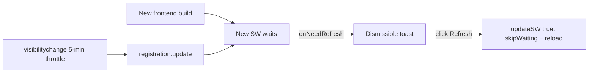
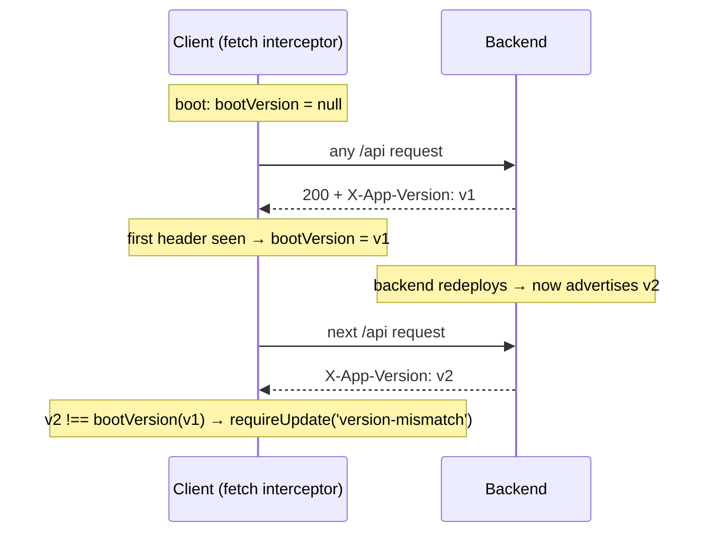
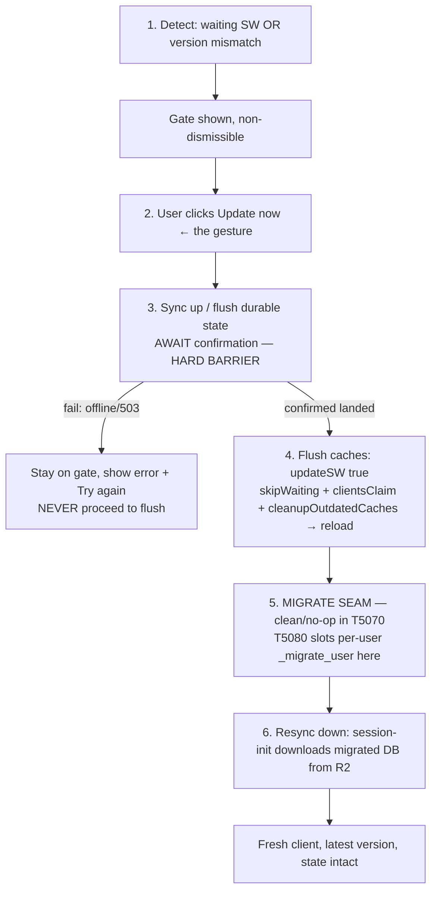

# T5070 Design — Blocking update gate + guaranteed cache flush + state sync flow

**Status:** DESIGN — awaiting user approval (do not implement past this gate)
**Task:** [T5070-blocking-update-gate.md](T5070-blocking-update-gate.md)
**Tier:** L (design-gated). **Layers:** Frontend (SW + gate + fetch interceptor) + Backend (version advertise + durable flush verify).
**Migration:** OUT OF SCOPE. This task leaves the step-5 JIT-migration seam clean and documented for **T5080**; it does NOT change how or when migrations run.

> Scope reconciliation with the task file: the task file's Parts 1/2/3 map 1:1 to §3 (gate), §4 (version handshake + cache flush) and §5 (state sync + persistence reconciliation) below. The step-5 migration is only a documented seam here (§6).

---

## 1. Problem restated

Three coupled deliverables around how a user lands on a new deploy:

1. **Blocking gate** — the dismissible "New version available / Refresh" toast
   ([pwaUpdate.js:41-54](../../src/frontend/src/utils/pwaUpdate.js#L41)) becomes a **non-dismissible
   full-screen modal** that blocks login and all interaction until the user updates.
2. **Guaranteed cache flush + version guarantee** — after update, no stale asset survives on any
   platform (PWA/iOS/macOS/Windows/Android), AND a **backend-only** deploy also raises the gate
   (today it can't — the prompt only fires on a new *service worker*; there is no version handshake).
3. **Ordered sync-up → flush → [migrate seam] → resync** — the update click flushes durable editing
   state to the backend (hard barrier), THEN caches flush, THEN (T5080) the user's DB migrates, THEN
   the fresh client resyncs the migrated state down. The flush must obey **Persistence:
   Gesture-Based, Never Reactive** (CLAUDE.md) — §5 proves it does.

---

## 2. Current State

### 2.1 Update mechanism (frontend only, today)



- `vite-plugin-pwa`, `registerType: 'prompt'` ([vite.config.js:17-51](../../src/frontend/vite.config.js#L17)).
  New build → new SW **waits**; `pwaUpdate.js` shows a non-blocking toast; Refresh → `updateSW(true)`.
- Workbox precaches `**/*.{js,css,html,svg,png,woff2}`, `navigateFallback: index.html`, one runtime
  cache (Google avatars, CacheFirst). **`cleanupOutdatedCaches` is NOT set explicitly** (Workbox
  default is on, but the audit requires we set it explicitly). `clientsClaim` not set.
- **Gap: a backend-only deploy produces no new SW → no prompt.** No version handshake exists
  (`__COMMIT_HASH__` is baked into the bundle, used only for bug-report metadata —
  [main.jsx:18](../../src/frontend/src/main.jsx#L18)). Backend logs `get_git_version_info()` at
  startup ([main.py:242](../../src/backend/app/main.py#L242)) but never advertises it on responses.
- Re-check rides `visibilitychange` with a 5-min gap ([pwaUpdate.js:7,23-37](../../src/frontend/src/utils/pwaUpdate.js#L7)) — reuse this throttle for the version check.
- **Reusable blocking-modal pattern:** [AuthGateModal.jsx](../../src/frontend/src/components/AuthGateModal.jsx)
  — `fixed inset-0 ... z-50`, mounted globally as a sibling of `<App/>` in
  [main.jsx:23-32](../../src/frontend/src/main.jsx#L23). (It IS dismissible today; the update gate
  reuses the *layout*, not the dismiss affordances.)

### 2.2 Persistence, today (the constraint the flush must satisfy)

- **All committed edits are already surgically persisted** per gesture (framing crop/segment actions
  `POST .../actions`; overlay via `overlayActionStore.dispatchOverlayAction`; annotations). Surgical
  actions do server-side read-modify-write on the blob — the app is durable server-side between
  gestures.
- Full-state save `saveCurrentClipState`
  ([FramingContainer.jsx:263-305](../../src/frontend/src/containers/FramingContainer.jsx#L263)) runs
  **only on the export gesture**, and carries the **T4020 shadow-save warning** (a redundant
  full-state save once wrote an empty "shadow" version → framing loss).
- Sync durability: default is fire-and-forget `asyncio.create_task(_background_sync)`; routes with
  `Depends(durable_sync)` AWAIT the R2 upload inside the write lock and return **503 `sync_failed`**
  (retryable) on failure instead of a lying 200 (persistence-sync.md invariant 6). `X-Sync-Status:
  failed` response header surfaces a persistent sync failure. There is a **0.5s defer window** where a
  fire-and-forget sync gives up on the upload lock — the silent-loss window a pre-flush must close.
- **Reactive persistence is BANNED and machine-enforced** — ESLint `local/no-persistence-in-effects`
  (error). Any write in the flush must be gesture-scoped (the update click), never a `useEffect`.

### 2.3 Backend version identity

- `get_git_version_info()` shells out to `git` at runtime; on Fly the git tree may be absent, so this
  is **unreliable as a runtime source**. Fly injects deploy-stamped env vars (`FLY_MACHINE_VERSION`,
  `FLY_IMAGE_REF`) that change on every deploy with zero build wiring. `deploy-backend.yml` runs a
  bare `flyctl deploy` (no `--build-arg`). → **version source is an open question (§7 Q1).**

---

## 3. Part 1 — Blocking update gate

### 3.1 Component

New `src/frontend/src/components/UpdateGateModal.jsx`, reusing AuthGateModal's full-screen pattern
but **non-dismissible**:

- Root: `fixed inset-0 bg-black/80 flex items-center justify-center z-[60]` — **z-[60] > AuthGateModal
  z-50**, and mounted AFTER `<AuthGateModal/>` in `main.jsx`, so it paints above the auth/login
  surface. Because it is a full-screen click-capturing overlay, an un-updated client **cannot log in
  or interact** with anything behind it.
- **No `X` button. No backdrop-close. No "later".** (Project rule: non-dismissible.) The card is
  keyboard-trapped (no ESC handler; focus pinned to the single action).
- Single action: **"Update now"** → runs the ordered flow (§5), whose terminal step is
  `updateSW(true)` (skipWaiting + reload).
- Copy: title "A new version is ready", body "We need to update before you continue. Your work is
  saved automatically." During the flow the button shows progress states ("Saving your work…",
  "Updating…") and, on flush failure, an inline error + "Try again" (never a dismiss).

### 3.2 State ownership — `updateGateStore` (Zustand)

MVC/state rule: a single store owns gate state; the modal is a pure View reading it.

```
updateGateStore = {
  isUpdateRequired: bool,     // gate visible when true
  phase: 'idle'|'flushing'|'flushed'|'reloading'|'error',
  error: string|null,
  requireUpdate(reason),      // idempotent: sets isUpdateRequired=true (reason: 'sw'|'version-mismatch')
  runUpdate(),                // the ordered flow (§5); guarded so it runs once
}
```

- `pwaUpdate.js` `onNeedRefresh` → `updateGateStore.getState().requireUpdate('sw')` (replaces the
  toast entirely).
- Version-mismatch detection (§4a) → `requireUpdate('version-mismatch')`.
- Once required, the gate never auto-closes — the only exit is a successful reload onto the new
  version. (After reload the new bundle boots with `isUpdateRequired:false`.)

### 3.3 Why `registerType:'prompt'` can now safely become a hard gate

The original reason for `prompt` (avoid a silent reload nuking in-memory editing state) is neutralized
by §5: the reload is no longer silent — it is preceded by a gesture-triggered durable flush that
awaits confirmation. So a hard gate loses no work. We keep `registerType:'prompt'` (we still want to
control *when* the waiting SW activates — on the "Update now" click, via `updateSW(true)`), we do NOT
switch to `autoUpdate`.

---

## 4. Part 2 — Guaranteed "latest" (version handshake) + cache flush

### 4a. App-version handshake (closes the backend-only-deploy gap)

**Backend advertises its deploy id on every response** via an `X-App-Version` header, plus a
`GET /api/version` endpoint for the explicit on-load / visibilitychange poll:

- `X-App-Version: <deploy-id>` added by the outermost response path. Cheapest correct seam: set it in
  `RequestContextMiddleware`'s response (or a tiny dedicated middleware) so **every** response —
  success, 4xx, 5xx, preflight — carries it (mirrors the T4900 "CORS must be outermost" lesson; the
  header must survive auth 401s and fly-replay responses). Value read once at process start into a
  module constant (`APP_VERSION`), not recomputed per request.
- `GET /api/version` → `{ version: APP_VERSION }`, unauthenticated, in `SKIP_SYNC_PATHS` /
  auth-allowlist, cache-control `no-store`. Used by the explicit poll and by tests.
- `APP_VERSION` source: see §7 Q1 (Fly env vs `--build-arg COMMIT_SHA`). Design is source-agnostic —
  it reads one env var.

**Client compare (passive + active):**



- **Passive path (primary):** extend the existing global fetch interceptor
  ([sessionInit.js:67-140](../../src/frontend/src/utils/sessionInit.js#L67)) — in the `promise.then`
  response handler, read `response.headers.get('X-App-Version')`. First non-null value latches
  `bootVersion`; any later value `!== bootVersion` → `requireUpdate('version-mismatch')`. Zero extra
  requests — every API call already in flight becomes a version probe. **This is a read in a `.then`
  callback of a fetch the app already made, NOT a reactive persistence write — it is allowed
  (`no-persistence-in-effects` only flags write-verbs).**
- **Active path (belt-and-suspenders):** on `visibilitychange` (reusing the existing 5-min throttle in
  `pwaUpdate.js`), also `GET /api/version` and compare. Covers a long-idle PWA that made no API calls.
- **Compare policy:** "server advertises; client gates on any drift from the value it booted with"
  (§7 Q2). This fires the gate for a **backend-only** deploy (new header, no new SW) — the exact gap.
  A **frontend-only** deploy raises the gate via `onNeedRefresh` (new SW). A combined deploy triggers
  whichever fires first; `requireUpdate` is idempotent.

### 4b. Cross-platform cache-flush strategy

**Code changes:**

1. **`vite.config.js` workbox — set explicitly:**
   - `cleanupOutdatedCaches: true` (don't rely on default) — deletes precache entries from prior SW
     revisions on activate.
   - `clientsClaim: true` — the activated SW takes control of already-open clients immediately (so the
     post-reload page is controlled by the NEW SW, not the old one).
   - Keep `skipWaiting` driven by `updateSW(true)` (prompt semantics) — do NOT set `skipWaiting:true`
     globally (that would activate before the flush barrier).
2. **Cloudflare Pages `_headers`** (extend existing
   [public/_headers](../../src/frontend/public/_headers)) so the update-critical documents are never
   served stale from the HTTP cache — otherwise the browser byte-checks a cached `sw.js`/`index.html`
   and the SW never updates:
   ```
   /index.html
     Cache-Control: no-cache
   /sw.js
     Cache-Control: no-cache
   /manifest.webmanifest
     Cache-Control: no-cache
   ```
   (`no-cache` = must revalidate every load, not `no-store`, so a 304 is still fast but staleness is
   impossible. Hashed JS/CSS assets keep their immutable long-cache — only the un-hashed entry
   documents change.) Existing `/*` COOP header is preserved; add specific blocks above/below it.
3. Precache glob already covers `html`; no change needed there.

**Per-platform verification matrix** (what "no stale asset survives" means per platform; ✅ =
Playwright/container-verifiable, ⚠️ = manual/real-device):

| Platform | Waiting SW activates on "Update now" | `clients.claim` takes control | Outdated precache deleted | `index.html`/`sw.js` not stale from HTTP cache | Verify method |
|---|---|---|---|---|---|
| Desktop Chrome/Edge (Win/mac) | ✅ | ✅ | ✅ | ✅ (check response `cache-control`) | Playwright |
| Installed PWA (desktop/Android) | ✅ | ✅ | ✅ | ✅ | Playwright (display-mode standalone) partial |
| Android Chrome | ✅ | ✅ | ✅ | ✅ | Playwright emulation (partial) |
| macOS Safari | ⚠️ | ⚠️ | ⚠️ | ✅ | manual |
| **iOS Safari + iOS standalone/PWA** | ⚠️ **(hardest)** | ⚠️ | ⚠️ | ✅ | **⚠️ real-device only** |

- **iOS standalone is the known-hard case** (T4880/T4930 lesson: emulators don't reproduce iOS
  SW/asset quirks; iOS may only swap a waiting SW on full app termination). The container QA will
  verify SW activation / `clients.claim` / precache cleanup / non-stale documents on Chromium and
  **explicitly flag the iOS real-device pass as NOT container-verifiable** — a documented manual step
  the user runs, not a claimed pass.

---

## 5. Part 3 — The ordered flow + persistence reconciliation (CRITICAL)

### 5.1 The barriered sequence



Each step fully completes before the next. **Any failure at step 3 keeps the gate up and never
proceeds to the destructive cache flush** — no silent data loss.

### 5.2 What step 3 flushes — and the proof it is not a reactive/fixup dump

**Analysis of what is actually unsynced at update time.** Because every committed edit is *already*
surgically persisted (§2.2), the set of genuinely-at-risk state is small and specific:

| State | Already durable? | Flush action |
|---|---|---|
| Framing crop keyframes, segment splits/speeds, trim | ✅ surgical `POST .../actions` per gesture | none needed (covered) |
| Overlay highlight regions/keyframes | ✅ surgical via `dispatchOverlayAction` | drain `failedActions` queue if any |
| Annotation segments | ✅ surgical | none needed |
| In-flight fire-and-forget syncs (0.5s defer window / not-yet-landed R2 upload) | ⚠️ written to SQLite, R2 upload maybe pending | **await durable confirmation** |
| Overlay actions that failed & are queued (`overlayActionStore.failedActions`) | ❌ not landed | `retryFailedOverlayActions()` (existing gesture-safe path) |
| Framing full-state not yet surgically saved (only if an editor holds uncommitted full-state) | ⚠️ edge | `saveCurrentClipState()` fallback (carries T4020 warning) |

**So step 3 is a durable DRAIN + VERIFY, not a fresh full-state serialization of React state.**
Concretely, `flushDurableState()`:

1. **Drain known pending-write queues that are already sanctioned & gesture-scoped:**
   - `retryFailedOverlayActions()` (overlayActionStore) — re-sends any queued failed surgical actions;
     already defined as gesture-triggered, not reactive.
   - **Only if** the framing editor is mounted with uncommitted full-state: `saveCurrentClipState()`
     — the existing export-time full-state path. It already **excludes banned view-state** (filters/
     sort/panels) and sends committed `keyframes`/`segments`, and it carries the **T4020 shadow-save
     warning**. In practice framing keyframe edits are surgical (`handleCropComplete → addCropKeyframe`
     action), so this degrades to a near-no-op.
2. **Await durable confirmation (the barrier):** `POST /api/sync/flush-verify` with
   `Depends(durable_sync)` — forces a WAL checkpoint and AWAITS the R2 upload of the user's dirty
   `profile.sqlite` + `user.sqlite` inside the write lock; returns **200** only when R2 confirms the
   upload landed, **503 `sync_failed`** (retryable) otherwise. This closes the 0.5s fire-and-forget
   defer window explicitly. (Reuses the existing durable-sync machinery; §7 Q3 asks whether a new
   endpoint vs. reusing an existing durable route is preferred.)
3. **Barrier:** `flushDurableState()` resolves only on 200. On 503/offline/error → `updateGateStore`
   sets `phase:'error'`, the modal shows "Couldn't save your latest changes — Try again", and the flow
   **stops** (no `updateSW(true)`). Retrying re-runs step 3.

**Persistence-rule reconciliation (proof it is compliant):**

- **Gesture-triggered, not reactive.** The entire flush is invoked from the "Update now" `onClick`
  handler — an explicit user action, exactly like the export-button full-state save. There is **no
  `useEffect` watching state to persist** (would be banned + ESLint-blocked by
  `local/no-persistence-in-effects`). The §4a version *read* is in a fetch `.then`, a read, not a
  write — also allowed.
- **No runtime-fixup dump.** The flush does NOT serialize hook memory wholesale. `ensurePermanentKeyframes`,
  origin normalization, and other render-only fixups live in hooks and are **never** sent — we reuse
  `saveCurrentClipState` (which already predates and respects this rule) and otherwise rely on surgical
  writes that never carried fixups. No new code reads fixed-up hook state and writes it back (the T350
  corruption class).
- **No banned view-state.** Filters/sort/panel state are never part of the flush.
- **Single write path preserved.** The flush reuses existing write paths (surgical action retry +
  `saveCurrentClipState` + durable sync); it does not introduce a second writer for any datum.
- **Ideal outcome acknowledged:** because edits are already surgical, step 3 for a clean session
  degrades to "checkpoint + verify R2 landed" — a cheap no-op-ish barrier. That is the *designed*
  outcome, not a reason to skip it: the barrier still guarantees nothing in the defer window is lost
  before the destructive flush.

### 5.3 Step 6 — resync down

The reloaded (new-version) client runs its normal `initSession` → `user_session_init` → `ensure_database`/
`ensure_user_database`, which download the (T5080-migrated) DB from R2 on first access. **Resync is the
existing load path**; the novel guarantees are the step-3 push + the barrier ordering. QA verifies the
reloaded client fully repopulates from R2 (games/clips/projects present post-reload).

---

## 6. Step-5 migration seam (documented for T5080 — NOT implemented here)

- **Where JIT slots in:** the per-user DB-load seam — `ensure_user_database(user_id)`
  ([user_db.py:122](../../src/backend/app/services/user_db.py#L122)) / `session_init._init_slow_path`
  — the same first-access point that R2-restores the DB. On the reloaded client's first authed request,
  T5080 will call `_migrate_user(user_id)` there to bring `user_db` + registered `profile_db`s to head.
- **Why the ordering matters:** step 3 writes state with the **OLD** frontend in the **OLD** schema;
  migration (step 5) upgrades it; step 6 resyncs the upgraded data down. Sync-before-migrate is what
  makes this correct — the migration operates on the user's now-current data, and the new frontend
  never reads un-migrated state.
- **T5070 leaves this clean:** no migration call is added at the seam; migration still runs the current
  way (admin/bulk `run_all_migrations`). T5070 only guarantees the sync/flush/resync paths exist and
  are barriered, which is what T5080 designs against. **Do not change migration timing in this task.**
- **Invariants T5080 must preserve at the seam** (from T4830, persistence-sync.md): migrate the
  canonical R2 copy, verify at head, fail loud per-user — never optimistic local-only migration.

---

## 7. Open Questions (need user decision before Stage 4)

1. **Backend version source for `X-App-Version`.**
   (a) **Fly runtime env** (`FLY_MACHINE_VERSION` or `FLY_IMAGE_REF`) — zero build wiring, changes on
   every deploy; downside: opaque value and it also changes on config-only (non-code) deploys, so the
   gate would fire on those too. (b) **`--build-arg COMMIT_SHA`** baked at image build — clean
   git-sha semantics matching the frontend's `__COMMIT_HASH__`; needs a one-line `Dockerfile` `ARG/ENV`
   + `deploy-backend.yml` `--build-arg`. **Recommendation: (b)** for meaningful, code-correlated
   versions. Confirm?
2. **Version-compare policy.** "Server advertises; client gates on ANY drift from its boot value" —
   this raises the gate for **every** backend deploy for **all** active users (intended, per "always
   latest"). Acceptable UX, or should backend deploys that are frontend-compatible be exempt (would
   require the server to advertise a min-compatible-frontend contract instead)? **Recommendation: any
   drift** (simplest, matches the requirement).
3. **Flush-verify endpoint.** Add a dedicated `POST /api/sync/flush-verify` (`Depends(durable_sync)`),
   or reuse an existing durable route as the barrier? **Recommendation: dedicated endpoint** — it makes
   the barrier explicit, testable, and semantically a no-op write (checkpoint + verify), avoiding a
   spurious data write just to trigger durable sync.
4. **Step-3 scope confirmation.** Approve "rely on surgical persistence + durable verify; call
   `saveCurrentClipState` only as a framing fallback when an editor holds uncommitted full-state"
   (minimizes T4020 exposure) — vs. an unconditional full-state save on every update (higher T4020
   risk). **Recommendation: scoped drain+verify.**
5. **Active export/render at update time.** If an export is mid-flight when the gate fires, the reload
   interrupts it. Options: (a) let the gate reload anyway (export jobs are backend-tracked and
   recoverable), (b) have the gate wait for/`warn` about an in-flight export. **Recommendation: (a)**
   with a note in the flush that the WS reconnects post-reload; confirm.
6. **iOS real-device verification is NOT container-verifiable.** The design ships a documented manual
   iOS/PWA device-pass checklist; the container QA cannot assert it passed. Confirm you accept the iOS
   pass as a manual acceptance step.
7. **`_headers` change.** Adding `no-cache` to `index.html`/`sw.js`/`manifest.webmanifest` in the
   existing Cloudflare Pages `_headers`. Confirm no external caching layer (CF cache rules) overrides
   these.

---

## 8. Files to change (implementation preview — post-approval only)

| File | Change |
|---|---|
| `src/frontend/src/components/UpdateGateModal.jsx` | **New** — non-dismissible full-screen gate (reuse AuthGateModal layout) |
| `src/frontend/src/stores/updateGateStore.js` (+ `.test.js`) | **New** — gate state + `runUpdate()` ordered flow |
| `src/frontend/src/utils/pwaUpdate.js` (+ `.test.js`) | Toast → `requireUpdate('sw')`; add version poll on visibilitychange |
| `src/frontend/src/utils/sessionInit.js` | Fetch interceptor reads `X-App-Version`, latches boot version, triggers gate on drift |
| `src/frontend/src/utils/updateFlush.js` (+ test) | **New** — `flushDurableState()` (drain queues + `POST /api/sync/flush-verify`) |
| `src/frontend/src/main.jsx` | Mount `<UpdateGateModal/>` above `<AuthGateModal/>` |
| `src/frontend/vite.config.js` | Workbox: `cleanupOutdatedCaches:true`, `clientsClaim:true` |
| `src/frontend/public/_headers` | `no-cache` for `index.html`/`sw.js`/`manifest.webmanifest` |
| `src/backend/app/main.py` (or small `version` router + middleware) | `X-App-Version` on all responses; `GET /api/version`; `APP_VERSION` from env |
| `src/backend/app/routers/…` + `middleware/db_sync.py` | `POST /api/sync/flush-verify` (`Depends(durable_sync)`); allowlist `/api/version` |
| `deploy-backend.yml` / `src/backend/Dockerfile` | (if Q1=b) inject `COMMIT_SHA` build-arg → env |
| `.claude/knowledge/persistence-sync.md`, `backend-services.md` | Stage 7: document handshake, gate, flush-verify, step-5 seam |

**Test scope:** frontend unit (`updateGateStore`, `updateFlush`, `pwaUpdate` version poll, interceptor
drift), backend (`/api/version` + `X-App-Version` on all responses incl. 401; `flush-verify` 200/503),
frontend E2E (gate blocks login/interaction; simulated version mismatch opens gate; flush awaits
confirmation and blocks-on-failure with no data loss; resync repopulates post-reload). iOS real-device
pass = documented manual step.

---

## 9. Acceptance criteria traceability

| Criterion (task file) | Addressed by |
|---|---|
| Blocking non-dismissible modal; un-updated client can't log in/interact | §3 (z-[60] full-screen, mounted above AuthGateModal, no dismiss) |
| Gate fires on backend-version mismatch, not just new SW | §4a handshake (passive header + active poll) |
| Cross-platform cache-flush matrix; failing platform fixed; iOS real-device | §4b matrix + workbox/`_headers`; iOS = manual (§7 Q6) |
| `index.html`/`sw.js` not stale; outdated precache cleaned | §4b `_headers no-cache` + `cleanupOutdatedCaches` |
| Flush before cache flush; failure keeps gate up (no loss); reload resyncs | §5.1 barriered flow + §5.2 drain/verify |
| Step-3 flush gesture-triggered & scoped, no reactive/fixup/view-state dump | §5.2 reconciliation proof |
| Migration timing unchanged; step-5 seam documented for T5080 | §6 |
| Tests pass | §8 test scope |
</content>
</invoke>
