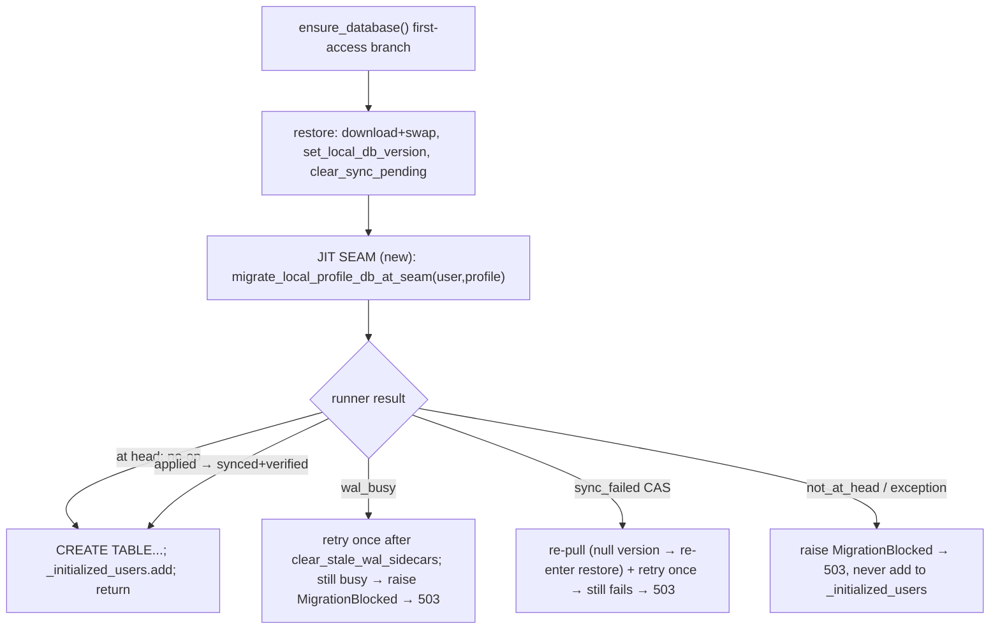

# T5083 — JIT migrate at the per-user DB-load seam (Architect design)

**Status:** WAITING ON USER (design gate)
**Tier:** L · **Depends on:** T5081 (STAGING). **Blocks:** T5085, T5087, T5089.
**Migration agent:** NOT needed — no new `vNNN_*.py`, no schema change. This task changes *when/how*
existing migrations run.

This design implements strictly within the EPIC's 8 settled decisions (EPIC.md §"Design decisions") —
it does not relitigate them. Every anchor cites `T5083-code-expert-notes.md` (`§N`) or a source line
verified against the working tree.

---

## 1. Current State

### 1.1 The two load seams (where JIT hooks)

Both per-user SQLite tracks have a **first-access restore** block that fires exactly once per
(process, DB) and is the only clean pre-connection window (EPIC decision 2, WAL constraint from the
2026-08-04 field finding §2).

```mermaid
flowchart TD
    subgraph profile["profile.sqlite — ensure_database() database.py:1023 (§1a)"]
      P1["local_version = get_local_db_version(user,profile)"] --> P2{local_version is None?}
      P2 -->|no: HOT PATH| PRET["return at 1149 — zero R2, zero sqlite work"]
      P2 -->|yes: FIRST ACCESS| P3["read_pending_token (INV-P capture, 1083)"]
      P3 --> P4["sync_database_from_r2_if_newer (WAL-guarded download+swap, 1084)"]
      P4 --> P5["clear_stale_wal_sidecars → set_local_db_version(1121) → clear_sync_pending(if_token=)(1122)"]
      P5 --> P6["CREATE TABLE IF NOT EXISTS...; if is_fresh_db: PRAGMA user_version=head (1669)"]
      P6 --> P7["_initialized_users.add"]
    end
    subgraph userdb["user.sqlite — ensure_user_database() user_db.py:122 (§1b)"]
      U1{user in _initialized_user_dbs?} -->|yes| URET["return"]
      U1 -->|no| U2["local_version = get_local_user_db_version"]
      U2 --> U3{None or file missing?}
      U3 -->|first access| U4["token → sync_user_db_from_r2_if_newer → set_local_user_db_version(198) → clear_sync_pending(199)"]
      U3 --> U5["executescript(_USER_DB_SCHEMA); if is_fresh: PRAGMA user_version=head (229)"]
      U5 --> U6["_initialized_user_dbs.add"]
    end
```



**Key facts (from the notes, spot-checked in source):**

- The `local_version is None` gate (§1a step 5 / §4) is the **only** trigger for the restore branch;
  a warmed profile short-circuits with **no R2 round trip**. This is the hot-path guarantee JIT must
  not regress.
- The restore-then-clear sequence `download → clear_stale_wal_sidecars → set_local_db_version →
  clear_sync_pending(if_token=pending_token)` is the **INV-P compare-and-clear** (persistence-sync.md
  §T5081). Nothing may reorder it.
- `user_version` is written **only** for a brand-new DB (`is_fresh_db`, database.py:1669 /
  user_db.py:229). A pre-existing below-head DB never gets its schema advanced at this seam today —
  that is exactly the gap T5083 fills.

### 1.2 The migration primitives (what JIT relocates)

- `_migrate_user(user_id)` (`migrations/__init__.py:133`, §2) — orchestrator: calls
  `_migrate_user_db` then, registry-authoritative, `_migrate_profile_db` for each `sorted(registered_ids)`;
  logs orphans, never migrates them. Written for the admin sweep (ContextVar-free at this level).
- `_migrate_user_db(user_id)` (`:189`) — `ensure_user_database` (restore) → raw connect →
  `USER_DB_RUNNER.run` → `sync_user_db_to_r2_explicit` if applied. **No own INV-P clear** (relies on
  `ensure_user_database`'s). At-head is a cheap `PRAGMA user_version` read that applies nothing.
- `_migrate_profile_db(user_id, profile_id)` (`:211`) — **force-downloads the canonical R2 copy
  AGAIN** to `profile.sqlite.migrating_tmp` (§2, §6 BUG SMELL), runs the T6410 keep-local decision
  tree, WAL-guards the swap (`wal_busy` at :361), records baseline (:371) + INV-P clear (:372), then
  `PROFILE_DB_RUNNER.run` (:391), post-migration `sync_db_to_r2_explicit` (:395), and **always
  re-verifies in R2** (`not_at_head` at :409). Refusal shapes:
  `ok | sync_failed | not_at_head | missing | download_failed | wal_busy`.

### 1.3 Code smells this task inherits (from §6)

| Smell | Location | Impact |
|-------|----------|--------|
| **Redundant download** | `_migrate_profile_db:245` re-`get_object`s a profile the `ensure_database` restore just downloaded+swapped | A second R2 round trip on the JIT cold path; re-runs the keep-local tree against a baseline the seam just set |
| **Context assumption mismatch** | Primitives SET the ContextVars (`:273/:385`) because they were sweep-entry; JIT already has them set | Harmless re-set, but signals the primitive bundles "acquire bytes" with "apply migrations" |
| **No per-profile lock at read seam** | `ensure_database`'s restore block has no lock (§3); write lock is asyncio/user-keyed/not-held-on-reads | Two concurrent first-access GETs for the same (user,profile) could both enter the restore/migration path |

### 1.4 Seam-bypass inventory (§6, drives the orphan/out-of-scope decisions)

| # | Caller | Goes through seam? | JIT-relevant |
|---|--------|--------------------|--------------|
| 1 | `materialization._open_profile_db` (via `ensure_profile_db_local`, `open_profile_db_readonly`) | **No** — raw connect, restores+INV-P-clears but never migrates | Share materialization, move-reels, admin analytics, workers — **out of scope, deferred to T5085** |
| 1b | `ensure_user_database_fresh` (write-path sibling, T4315) | second download+swap site for user.sqlite | keyed off `_initialized_user_dbs` — see §4.2 |
| 2 | `sweep_scheduler.do_sweep` | Yes — sets ContextVars, calls `ensure_database()` | background thread, orphans included; inherits JIT if seam-triggered |
| 3 | migration primitives on temp files | they ARE the primitives | n/a |

---

## 2. Target State

### 2.1 Design decisions (the 8 open questions, resolved)

| # | Open question | Decision |
|---|---------------|----------|
| Q1 | Which seam(s) | **Both** `ensure_database` (profile) AND `ensure_user_database` (user), inside each restore block. `ensure_user_database_fresh` and `materialization.ensure_profile_db_local` are **deliberately out of scope** (T5085 owns non-login writers). |
| Q2 | Full `_migrate_profile_db` vs leaner primitive | **Extract a leaner primitive** `migrate_local_profile_db_at_seam` that runs the runner on the **already-restored local file** — no second download. `_migrate_profile_db` (with force-download + keep-local tree) stays intact for the bulk runner. |
| Q3 | Locking at read seam | **Per-(user,profile) `threading.Lock`** dedicated to migration, NOT the asyncio write lock. Idempotency under the `user_version` gate makes a lost race harmless. No re-entrancy with the write lock (different lock, different primitive). |
| Q4 | At-head no-op gating | Hang off the **existing `local_version is None` first-access gate** — migration runs inside the restore block, so it costs one `PRAGMA user_version` read on the cold path and **nothing** on hot requests. |
| Q5 | Orphan / non-registered policy | **Migrate-then-serve** on any path that reaches the seam (the T7520 guard already 404s foreign profiles at the boundary; a profile that reaches `ensure_database` is owned-or-legitimate). No registry repair. Out-of-seam bypasses (§1.4) stay on T5085. |
| Q6 | Sweep interaction | Sweep still exists (T5087 deletes it). JIT's leaner primitive produces a **byte/version-identical** result: same runner, same `set_local_db_version`, same post-migration `sync_db_to_r2_explicit`, same INV-P discipline. The `user_version` gate makes double-migration a no-op. |
| Q7 | Post-migration sync on a READ | **Sanctioned exception**, framed as a one-shot schema-integrity write, not reactive persistence. Same status the admin sweep already has. See §2.4. |
| Q8 | Failure on request path | **Fail loud, block access: raise → HTTP 503** "pending migration" (the T5970/T6550 convention). Never serve un-migrated. `wal_busy` → retry-once-then-503. CAS refusal (`sync_failed`) → re-pull-and-retry-once (EPIC decision 5) then 503. |

### 2.2 Target seam flow



### 2.3 The leaner primitive (Q2 — the load-bearing extraction)

**Why not call the full `_migrate_profile_db`:** at the seam the restore already force-downloaded the
canonical R2 copy and recorded its baseline (§1.1). Calling `_migrate_profile_db` would download the
same bytes a second time (§1.3 redundant-download smell) and re-run the T6410 keep-local tree against
the baseline the seam just set. The acquire-bytes concern is already satisfied; only apply-migrations
remains.

**New primitive** `migrate_local_profile_db_at_seam(user_id, profile_id) -> MigrateResult` in
`migrations/__init__.py`, operating on the **already-restored local file** (no download):

```pseudo
def migrate_local_profile_db_at_seam(user_id, profile_id):
    db_path = USER_DATA_BASE/user_id/"profiles"/profile_id/"profile.sqlite"
    if not db_path.exists():                      # seam guarantees it exists post-restore
        return MigrateResult(status="missing")
    if wal_sidecars_present(db_path):             # Q8: never migrate under a live/stale connection
        return MigrateResult(status="wal_busy")   #      (the runner would corrupt a WAL swap)
    set_current_user_id(user_id); set_current_profile_id(profile_id)   # v002 reads them
    conn = sqlite3.connect(db_path, timeout=30); conn.execute("PRAGMA busy_timeout=30000")
    try:    applied = PROFILE_DB_RUNNER.run(conn, "sqlite")   # gate: PRAGMA user_version; no-op if at head
    finally: conn.close()
    if not applied:
        return MigrateResult(status="ok", applied=[])         # at-head cheap path — NO R2 work
    if not sync_db_to_r2_explicit(user_id, profile_id):       # applied → upload r2_version+1
        return MigrateResult(status="sync_failed", r2_version=_r2_version_or_none(user_id, profile_id))
    if _read_r2_profile_user_version(user_id, profile_id) != PROFILE_DB_RUNNER.latest_version:
        return MigrateResult(status="not_at_head", ...)        # T4830 verify-at-head preserved
    return MigrateResult(status="ok", applied=applied)
```

**Extraction preserves (the T4830/T6340/T6410 guarantees, per Q2's requirement):**

- **T6340 baseline record** — NOT re-recorded here: the seam's restore already called
  `set_local_db_version` (database.py:1121/1139/1146) for the copy on disk. The migration keeps that
  file (no swap), so the baseline is already coherent. `sync_db_to_r2_explicit` then sees
  `current_version == r2_version` and uploads `r2_version+1` (the T6340 mechanism, unchanged).
- **T6410 keep-local / force-download** — **intentionally NOT in the seam primitive.** The T6410 tree
  exists to decide swap-vs-keep after a *fresh download*; the seam already made that decision (it kept
  whatever the restore swapped or up-to-date'd). The seam primitive is unconditionally
  "migrate-in-place the file the restore left." The full `_migrate_profile_db` retains its tree for
  the sweep.
- **WAL guard** — kept (a live/stale sidecar blocks the run; §2.5).
- **Post-migration sync + R2 verify** — kept verbatim (`sync_db_to_r2_explicit` + `_read_r2_profile_user_version`).
- **INV-P clear** — **NOT needed here.** This primitive does not swap bytes, so no restore-if-newer
  occurred; INV-P reason (b) does not apply. The `sync_db_to_r2_explicit` upload path clears its own
  scope via INV-P reason (a) when it succeeds. Not double-clearing is correct (persistence-sync.md
  §T5081: clear only at a real swap or a real upload).

**Bulk runner stays working (T5087 owns deletion):** `_migrate_profile_db` is untouched; the sweep
loop over it keeps its force-download semantics. The two primitives share `PROFILE_DB_RUNNER`,
`sync_db_to_r2_explicit`, `_read_r2_profile_user_version`, `_r2_version_or_none` — no logic is
duplicated, only the download/keep-local prologue is absent from the seam variant. A DB migrated by
either path ends byte/version-identical (Q6): same runner output, same upload, same verify.

**user.sqlite:** `ensure_user_database` already does its own restore+baseline; `_migrate_user_db`
already assumes a local file and only downloads via `ensure_user_database` (no redundant second
download — §2b of the notes). So user.sqlite reuses the **existing** `USER_DB_RUNNER.run + sync`
shape; we extract the parallel `migrate_local_user_db_at_seam(user_id)` (drop the leading
`ensure_user_database` call since the seam is *inside* it, keep raw-connect + runner + sync).

### 2.4 Read-triggers-write framing (Q7 — the sharpest question)

`_migrate_profile_db`'s post-migration `sync_db_to_r2_explicit` uploads at `r2_version+1`. At the JIT
seam this can fire on a **GET** with no user gesture — apparently violating CLAUDE.md's
gesture-based-persistence rule ("The app NEVER writes to the backend as a side effect of state
changing").

**Resolution: a schema migration is a sanctioned exception, and it is not the banned pattern.** The
banned pattern is *reactive persistence* — a `useEffect`/side-effect that re-persists **runtime
fixups of application state**, creating the feedback loop that corrupted T350 keyframes. A schema
migration is categorically different on every axis the rule cares about:

- It is **not application state** — it rewrites the DB's *structure* to match the code, a one-time
  transition gated by `PRAGMA user_version`. It is **idempotent and monotonic**: it fires exactly
  once per (user,profile) per schema bump and can never re-fire against its own output (the gate
  refuses). No feedback loop is possible — the defining hazard of reactive persistence is absent by
  construction.
- The admin sweep **already** performs this exact write with no user gesture (EPIC decision 1 puts
  migration "in the serving process"; the sweep is the out-of-band version of the same write). JIT
  relocates *where* that sanctioned write happens, not *whether* it is sanctioned.
- The alternative — migrate locally but defer the R2 upload to the next real gesture — is **worse**
  and is precisely the 2026-08-04 / T6340 failure class: a migrated-but-unsynced local copy whose
  baseline disagrees with R2 arms the next writer's CAS conflict. EPIC decision 6 ("never serve a
  half-migrated DB") and T4830's verify-at-head both require the migration to reach R2 *before* we
  declare the DB usable.

**How it is framed so it is clearly not reactive persistence** (the implementor must honor these):

1. The upload is issued **synchronously inside the migration primitive**, traceable to the named
   event "schema migration applied at load seam" — not from a `useEffect`, not from a state watcher.
2. It fires **only when `applied` is non-empty** (the runner actually advanced `user_version`) — a
   no-op at-head migration issues **zero** R2 writes.
3. It does **not** ride the request's `has_writes`/write-lock machinery and does **not** mark the
   request as a user write (no `.sync_pending` re-mark for a non-swap migration; the upload's own
   success is an INV-P reason-(a) clear only for what it uploaded).

**This is stated explicitly in the design so the reviewer does not flag it as a rule violation.**

### 2.5 WAL / `wal_busy` (Q8 partial)

At a true first-access seam no connection exists yet, so `wal_sidecars_present(db_path)` should be
false. But a **stale crash sidecar** or a racing connection can leave one. The runner **swaps nothing**
in the seam primitive (it migrates in place), yet a live `-wal` still means another connection holds
the file and an ALTER TABLE would fight it. Policy:

- The seam primitive checks `wal_sidecars_present` **before** opening its own connection. If present,
  it does **one** `clear_stale_wal_sidecars(db_path)` + re-check (the restore block already ran
  `clear_stale_wal_sidecars` at database.py:1092, so a sidecar here is genuinely a live connection or
  a post-restore crash artifact).
- Still present after the single clear → `MigrateResult(status="wal_busy")` → the seam **raises
  `MigrationBlocked` → HTTP 503** (never serve un-migrated, EPIC decision 6 / field finding §2). The
  503 is retryable (§2.6), so the client re-lands once the holding connection releases.

### 2.6 Failure handling & HTTP surface (Q8)

Any non-`ok` result from the seam primitive → **raise `MigrationBlocked(user_id, profile_id, reason)`**
inside `ensure_database` / `ensure_user_database`, which propagates out of `get_db_connection` /
bootstrap and is mapped to **HTTP 503 "your data is being upgraded — please retry"**:

| Result | Meaning | Seam action |
|--------|---------|-------------|
| `ok` (applied or no-op) | at head, verified | proceed to `_initialized_users.add` and serve |
| `wal_busy` | live/stale sidecar | one clear+retry, else raise → 503 |
| `sync_failed` (CAS refusal) | R2 moved under us | **re-pull-and-retry-once** (§2.7), else raise → 503 |
| `not_at_head` | R2 verify mismatch | raise → 503 (T4830 fail-loud) |
| `missing` | registered profile absent in R2 | raise → 503 (this is the T4820 bug class, must be loud) |
| exception | anything else | do NOT catch-and-serve; raise → 503 |

**503, not 500, not a lying 200** — this mirrors the existing T5970/T6550 "pending migration"
convention (backend-services.md §T5970/§T6550): a below-head DB reaching a hot path is a *known,
time-bounded* state, and 5xx is retryable by the overlay action layer / client, so the request
re-lands automatically once migration completes. Crucially the DB is **never added to
`_initialized_users` / `_initialized_user_dbs` on failure**, so the retry re-enters the seam (the
version cache stays null on the restore path, or the init flag stays unset).

**No silent fallback to un-migrated data** — this is the whole point (the `no such column` hazard,
field finding §3 / backend-services.md §T5970). We do not fall through to opening the below-head DB.

### 2.7 Concurrency, idempotency & CAS refusal (Q3, EPIC decision 5)

**In-process (same machine):**

- The asyncio write lock (`_get_user_write_lock`) is **user-keyed, non-reentrant, and NOT held on
  reads** (§3) — a JIT migration on a GET runs with no such protection, and a WRITE request that
  *does* hold it would deadlock if the migration tried to re-acquire it. **So JIT does NOT touch the
  write lock** (this is why the shared-lock instinct fails; §3 open Q3).
- Instead: a dedicated **`threading.Lock` keyed on `(user_id, profile_id)`** (mirrors the
  `session_init._get_init_lock` threading-lock pattern §3), acquired around the seam primitive. A
  `threading.Lock` is safe from both the async event loop and the sweep's background thread, and is
  **not** the write lock, so a write request holding the write lock and then entering the migration
  seam takes a *different* lock — **no re-entrancy deadlock** (proven by lock identity: write-lock ≠
  migration-lock, and the migration primitive never acquires the write lock).
- The keys are the **(user_id, profile_id) PAIR** (EPIC decision 4 — profile ids are not globally
  unique). user.sqlite keys on `(user_id, USER_DB_SCOPE)`.
- **Idempotency** makes even a lost lock harmless: the runner gates on `PRAGMA user_version`, so a
  second migrator finds nothing to apply and no-ops (Q6). The lock exists to prevent a *double upload*
  (two migrators both advancing then both `sync_db_to_r2_explicit`), not to prevent corruption.

**Cross-machine / cross-process (the lock does NOT span):**

- Two machines (two tabs, phone+laptop, or a login racing a background worker — field finding §3) can
  both migrate the same profile. One uploads `r2_version+1`; the other's `sync_db_to_r2_explicit`
  hits a **CAS refusal** (`sync_failed`).
- **EPIC decision 5: re-pull and retry once, not a user-facing failure.** On `sync_failed` the seam:
  1. **Checks INV-P first** — `has_sync_pending_scope(user_id, profile_id)` (now trustworthy per-scope
     after T5081, persistence-sync.md §T5081). If the scope has **nothing** pending, this is the
     clean-copy case: the other machine already carried the migration to R2, our local migration was
     redundant, and there is nothing to arbitrate — treat as success after re-pull (no retry needed).
  2. **Re-pull:** null the cached version (`schedule_profile_db_reheal` equivalent — drop
     `_user_db_versions[(user,profile)]`) and re-enter the restore branch, which re-downloads R2's now
     `r2_version+1` copy (already at head — the other machine migrated it) and re-records the baseline.
  3. **Retry the seam primitive once** against the freshly-pulled copy. It finds `user_version` at
     head → no-op → serve. Idempotency (EPIC decision 5) guarantees this converges.
  4. If it **still** fails after the single re-pull+retry → raise → 503 (do not loop; a persistent
     failure is a real fault, EPIC decision 6).

This leans on T5081's now-trustworthy `.sync_pending` (per-scope, INV-P) exactly as the task file
requires: we ask "does *this profile* actually have anything pending" instead of guessing — a bare
per-user marker would have made us re-upload a clean copy and manufacture the very false conflict
T5081 eliminated.

### 2.8 Baseline coherence (EPIC decision 1 / shared invariant)

The three axes advance in one path:

- In-memory `_user_db_versions` + file `db_version` row: set by the **restore** (`set_local_db_version`,
  database.py:1121/1139/1146) *before* the seam migration runs; the migration keeps that file (no
  swap) so the baseline stays correct.
- R2 `x-amz-meta-db-version`: advanced by the migration's `sync_db_to_r2_explicit` (only when
  `applied`), which sees `current_version == r2_version` (T6340) and uploads `r2_version+1`. That
  upload path itself updates the local baseline to the new version on success.

The seam **does not reorder** the restore-then-clear sequence — it sits strictly *after*
`set_local_db_version`/`clear_sync_pending` complete (§1.1). Confirmed: the notes' §1a insertion point
is "between step 5 (restore-then-clear complete) and step 6's `already_initialized` return."

---

## 3. Implementation Plan (file-by-file)

### 3.1 `src/backend/app/migrations/__init__.py`

Add two seam primitives (leaner variants that assume the file is already local+restored):

```python
def migrate_local_profile_db_at_seam(user_id: str, profile_id: str) -> MigrateResult:
    # (pseudo-code in §2.3) — NO download, WAL-guard, runner, sync-if-applied, verify.

def migrate_local_user_db_at_seam(user_id: str) -> MigrateResult:
    # like _migrate_user_db but WITHOUT the leading ensure_user_database() call
    # (the seam IS inside ensure_user_database); raw connect → USER_DB_RUNNER.run →
    # sync_user_db_to_r2_explicit if applied → return MigrateResult.
```

Leave `_migrate_user`, `_migrate_user_db`, `_migrate_profile_db`, `run_all_migrations` **unchanged**
(T5087 owns their deletion). Add a `MigrationBlocked(Exception)` carrying `(user_id, profile_id,
reason)`, and a module-level `_migration_locks: dict[tuple, threading.Lock]` +
`_get_migration_lock(user_id, profile_id)` helper (mirrors §3's threading-lock pattern).

### 3.2 `src/backend/app/database.py` — profile seam

Insert **after** the restore branch closes (after line 1146, the last `set_local_db_version` branch)
and **before** `if already_initialized: return` (1149). Guard so it only runs on the first-access path
(i.e. inside the `local_version is None` block that we just executed):

```pseudo
# ... existing restore branch (1050-1146): download/up-to-date/not-found all
#     end with set_local_db_version + (if swapped) clear_sync_pending ...

if R2_ENABLED and <this-request-entered-the-restore-branch>:      # first access only
    with _get_migration_lock(user_id, profile_id):
        result = migrate_local_profile_db_at_seam(user_id, profile_id)
        if result.status == "wal_busy":
            clear_stale_wal_sidecars(db_path)
            result = migrate_local_profile_db_at_seam(user_id, profile_id)   # one retry
        if result.status == "sync_failed":
            result = _seam_repull_and_retry_profile(user_id, profile_id, db_path)  # §2.7
        if result.status != "ok":
            raise MigrationBlocked(user_id, profile_id, result.status)   # → 503

if already_initialized:      # unchanged (1149)
    return
```

`_seam_repull_and_retry_profile` (helper, database.py): INV-P short-circuit
(`has_sync_pending_scope` false → re-pull only, success), else drop the cached version + re-run the
restore download + one more `migrate_local_profile_db_at_seam`.

`<this-request-entered-the-restore-branch>` is a local boolean set true inside the
`if local_version is None:` block, so the migration hangs off the **same first-access gate** (Q4) — no
`PRAGMA user_version` on hot requests.

### 3.3 `src/backend/app/services/user_db.py` — user seam

Symmetric insertion: after the restore block records the baseline/clears pending (~:219) and after
schema creation, **before** `_initialized_user_dbs.add` (:239), gated on the same first-access boolean:

```pseudo
if R2_ENABLED and <first_access>:
    with _get_migration_lock(user_id, USER_DB_SCOPE):
        result = migrate_local_user_db_at_seam(user_id)
        # wal_busy retry-once, sync_failed re-pull-retry-once (§2.7), else raise MigrationBlocked
```

### 3.4 HTTP mapping — `MigrationBlocked → 503`

`ensure_database` / `ensure_user_database` are called from `get_db_connection`, bootstrap, and
`session_init`. Add a handler that maps `MigrationBlocked` to **503** with a clear body
(`{"detail": "Your data is being upgraded, please retry", "code": "pending_migration"}`), reusing the
existing T5970/T6550 503 convention. Preferred site: a FastAPI exception handler on `MigrationBlocked`
(one place, covers every call path) rather than a try/except at each seam caller.

### 3.5 Out of scope (documented, deferred to T5085 — Q1/Q5)

`ensure_user_database_fresh`, `materialization.ensure_profile_db_local` /
`materialization._open_profile_db`, and the background workers/share-materialization paths (§1.4
bypass #1) do **not** get the JIT trigger in T5083. They are non-login writers; T5085 wires
"migrate-before-touch" for them explicitly. This is safe because (a) T5087 (bulk-runner deletion)
comes *after* T5085 in the epic order, so there is never a window with neither mechanism, and (b) the
sweep still backstops them until then. **Stated explicitly here so the gap is a decision, not an
oversight.**

### 3.6 Tests to write

| Test | Asserts |
|------|---------|
| `test_seam_at_head_noop` | First access on an at-head profile: runner applies nothing, **zero R2 upload**, one `PRAGMA user_version` read, serves normally. |
| `test_seam_behind_head_migrates` | Below-head profile (drop a column, stamp `user_version=N-1`): first access migrates to head, uploads `r2_version+1`, R2 verify passes, serves. |
| `test_seam_hot_path_no_migration` | Second request (warmed, `local_version` cached): restore branch skipped, migration NOT called, no R2 round trip. |
| `test_seam_concurrent_same_pair` | Two concurrent first-access requests for same (user,profile): exactly one migrates+uploads, no double upload, no corruption (migration lock). |
| `test_seam_wal_busy_blocks` | Live/stale sidecar present + still present after one clear → `MigrationBlocked` → 503, DB **not** added to `_initialized_users`, never serves un-migrated. |
| `test_seam_orphan_reaches_seam_migrates` | A profile that reaches `ensure_database` (T7520 guard passed) but is registry-thin: migrate-then-serve (Q5). |
| `test_seam_fail_loud_blocks` | `not_at_head` / `missing` / exception → 503, no fallthrough to below-head open. |
| `test_seam_cas_refusal_repull_retry_once` | `sync_failed` with **nothing pending** (INV-P false) → re-pull, serve success (no retry needed); `sync_failed` **with** pending → re-pull + one retry → head → serve; persistent failure → 503. Proves single retry, no loop. |
| `test_seam_user_db_symmetric` | Same at-head-noop / behind-migrates / fail-loud for user.sqlite. |
| `test_sweep_and_seam_identical` (Q6) | A profile migrated by `migrate_local_profile_db_at_seam` and one migrated by `_migrate_profile_db` end at identical `user_version` + R2 `db-version`. |

Backend pytest invocation: CI's `tests/test_*.py --capture=sys` form
(`[[project_backend_pytest_invocation_trap]]`). Runner hands `up(conn)` a **tuple** row factory —
index positionally.

---

## 4. Risks & Tradeoffs

| Risk / tradeoff | Analysis | Mitigation |
|-----------------|----------|------------|
| **Leaner primitive vs full reuse** (redundant download) | Reusing `_migrate_profile_db` wholesale would double-download on every cold JIT request and re-run the keep-local tree against a just-set baseline (§1.3). The leaner primitive avoids both but duplicates ~6 lines of runner+sync+verify. | Duplication is deliberate and shared where possible (`sync_db_to_r2_explicit`, `_read_r2_profile_user_version`, `_r2_version_or_none`, `PROFILE_DB_RUNNER`). Only the download/keep-local prologue is absent. `test_sweep_and_seam_identical` proves the two paths converge. This honors CLAUDE.md refactoring rule "abstract on the 3rd duplication" — the two variants are close but their *preconditions* differ (bytes acquired vs not), so a forced merge would re-introduce the download branch. |
| **Read-triggers-write** (Q7) | A GET issuing an R2 upload looks like reactive persistence. | Framed in §2.4 as a sanctioned, idempotent, gate-guarded schema-integrity write (never fires at-head; never from a state watcher; already sanctioned for the sweep). Called out explicitly so the reviewer does not flag it. |
| **Cross-machine race** (field finding §3) | Two machines migrate the same profile; second hits CAS. | Re-pull-and-retry-once on `sync_failed`, INV-P-gated (§2.7). Idempotency guarantees convergence; a persistent failure correctly 503s rather than looping. |
| **First cold request per user pays migration cost** | The user whose process first opens a below-head DB pays the runner + upload latency on that one request. | Paid **once per (user,profile) per schema bump** (`user_version` gate + `_initialized_users`); every subsequent request is the hot-path no-op. At 14 profiles / additive migrations this is sub-second (field finding §1 — scale is not the concern). 503-retryable if it fails, so no user-visible hard failure. |
| **New migration lock** | A second lock alongside the write lock risks confusion. | It is a `threading.Lock` on a *disjoint* key space (migration, not write) and never nests with the write lock (different lock objects; the migration primitive never acquires the write lock) → provably no deadlock. Documented at the lock definition. |
| **Out-of-scope bypasses still un-migrated** (§3.5) | `ensure_profile_db_local`/workers reach a DB without the seam. | Deliberately deferred to T5085 (next in epic order, *before* T5087 deletes the bulk backstop). Sweep still covers them meanwhile. Stated as a decision. |
| **Rolling deploy skew** (field finding §6) | Old machine serves a DB the new machine JIT-migrated to head. | Out of T5083's control by design — EPIC decision 8 (additive-only migrations) makes this safe; T5070 gates the stale *client*, not a stale backend instance. No action here beyond honoring additive-only. |

---

## 5. Open Questions for the User

1. **503 body / client UX.** The design maps `MigrationBlocked` → **HTTP 503** with
   `code: "pending_migration"`, reusing the T5970/T6550 convention (the overlay action layer already
   treats 5xx as retryable). This surfaces as a transient "please retry" rather than a hard error. Is
   a bare retryable 503 the desired UX for the (rare, once-per-schema-bump) case where a user's very
   first post-deploy request races a migration failure — or do you want a dedicated
   "upgrading your data…" interstitial? **Recommendation: 503 as designed** (matches existing
   convention, no new frontend surface); flagging in case you want an explicit UI.

2. **Leaner primitive vs. accept the redundant download.** §2.3 extracts a no-download seam primitive
   rather than calling the full `_migrate_profile_db` (which would download the just-restored bytes a
   second time). The extraction adds a small, deliberately-separate code path that the sweep does not
   share. The alternative (call `_migrate_profile_db`, accept one extra `get_object` per cold JIT
   request, rely on its T6410 keep-local branch to no-op the swap) is simpler to write but pays the
   redundant download and re-runs the keep-local tree against a baseline the seam just set.
   **Recommendation: extract the leaner primitive** (correctness + hot-path cost), with
   `test_sweep_and_seam_identical` guarding convergence. Confirm you are comfortable with the two
   coexisting until T5087 deletes the bulk path.

No other decisions require a human — the remaining questions (seam placement, locking, orphan policy,
failure surface, sync framing, sweep interaction) are resolved within the 8 settled EPIC decisions.
