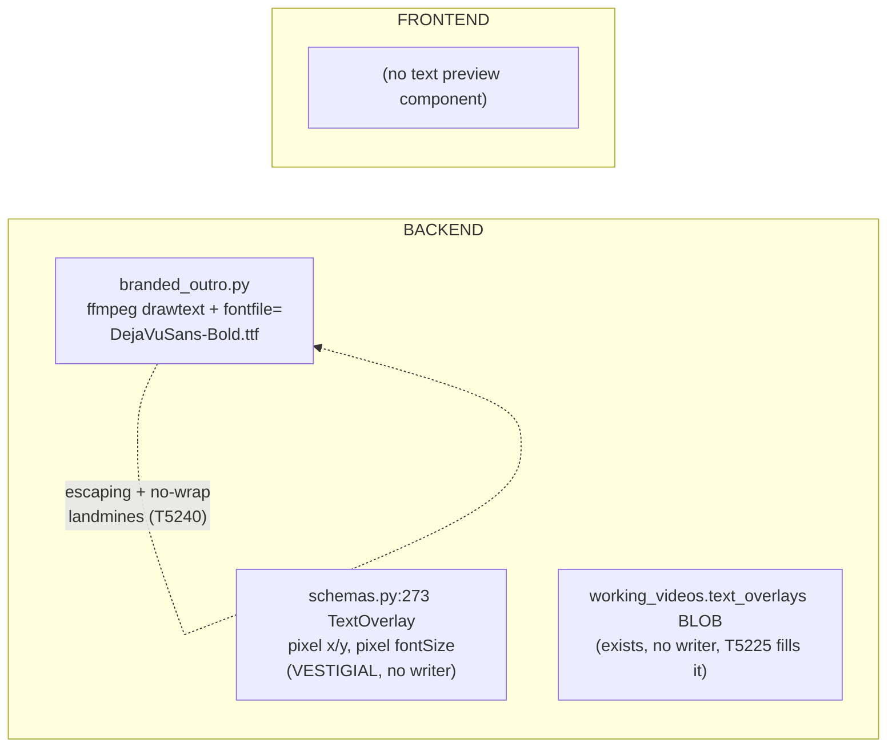
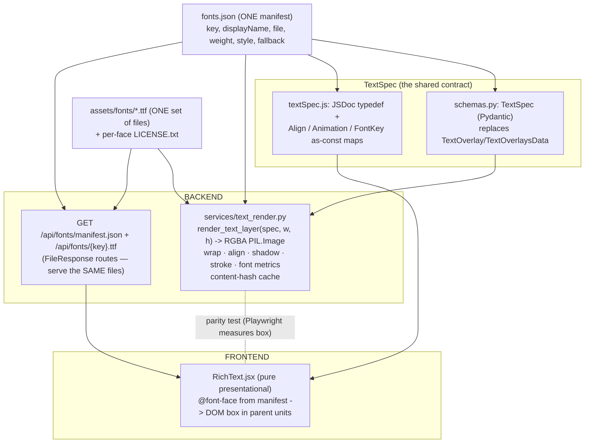

# T5180 — Rich Text Engine — Design

**Status:** APPROVED 2026-08-04 (design gate) — see § Gate Decisions for the recorded answers.
**Tier:** L (design-gated foundation; TextSpec is consumed by T5210/T5225 and expensive to change)
**Epic:** [Player Intro + Rich Text](player-intro/EPIC.md) — decisions 5 & 6 are the whole mandate.
**Persists:** NOTHING. No DB write, no R2 write, no migration. This task ships a model, a font
catalogue, one backend renderer, one frontend preview, and a parity test.

> This doc is the approval gate. It covers current state → target state → implementation plan →
> risks, with diagrams and pseudocode. It writes no source code. The **Open Questions** section at
> the end lists every decision that genuinely needs the user's call.

---

## 0. Gate Decisions (recorded 2026-08-04, supersede §3/§5/§8/§11 where they conflict)

| # | Question | Decision |
|---|---|---|
| Q1 | `stroke.width` unit | **Changed from the proposal.** Both `stroke.width` AND `shadow.blur` are **em-relative** (fraction of the element's own `size`), not fraction of frame height. Rationale: `size` is already frame-relative, so a frame-height stroke/blur would give a small caption and a huge title the SAME absolute stroke/blur width — wrong the moment a card has two text sizes at once. Em-relative keeps one text element internally proportional at any size. Nothing else in the unit invariant changes. See §3 (updated) for the single documented location. |
| Q2 | Font picks | **Approved as proposed:** Anton, Oswald, Inter, Playfair Display, JetBrains Mono, Kanit Italic. Each licence verified at implementation time (§4); a face that fails verification is swapped for its listed alternate and the swap is recorded in §4/Stage 7 notes. |
| Q3 | TTF serving | **Changed from the proposal.** Use a `StaticFiles` mount, not two `FileResponse` routes. One physical copy of each TTF, long cache headers, backend renderer resolves the same files by absolute path. See §5 (updated). |
| Q4 | Parity tolerance | **Accepted:** 1.5% of frame dimension for box width/height, 0.5% of frame height for baseline. Recorded as named constants (§8, updated) — never inline magic numbers, in the design doc or the test. |
| — | Shadow/stroke vs. box-parity mismatch (raised in the review note, not a numbered Q) | **Resolved, not papered over.** Box-width/height/baseline parity is measured on a **fill-only** render (shadow off, stroke off) so the backend's tight alpha bbox and the browser's `getBoundingClientRect` measure the same thing. Shadow and stroke presence/geometry are asserted **separately**, not folded into the box tolerance. The tolerance is NOT widened to absorb the shadow-bbox gap — see §8. |

---

## 1. Current State Analysis

### Architecture (today)



- There is **no shared text system**. The only styled-text-on-video today is the branded outro,
  drawn with ffmpeg `drawtext` pointed at an absolute `fontfile=` (`branded_outro.py:93`,
  `DejaVuSans-Bold.ttf`) because the Fly / `/dotask` / Modal images have ffmpeg but **no fontconfig**.
- `schemas.py:273-306` holds a **vestigial** `TextOverlay` / `TextOverlaysData` pair: absolute pixel
  `x`/`y`, pixel `fontSize`, no font choice, no wrap, no shadow/stroke. Nothing writes it. It is a
  placeholder from an earlier pass.
- `working_videos.text_overlays` BLOB exists and is returned by `/overlay-data`, but **nothing writes
  or renders it**. T5225 will fill it later. **This task does not touch it.**

### Code smells identified

| Smell | Location | Impact |
|---|---|---|
| Speculative generality / dead abstraction | `schemas.py:273` `TextOverlay` (pixel-based, no consumer) | Cannot render one spec at 1080×1920, 1920×1080 AND a 150px preview box — pixels don't scale. Must be **deleted, not extended.** |
| Primitive obsession (pixels as the unit) | same | Every consumer would have to convert px→frame at its own resolution; guaranteed drift between preview and export. |
| Escaping / no-wrap landmine baked into the drawing path | `branded_outro.py` `drawtext` (T5240 landmines: apostrophe can't inline; no word-wrap) | This is exactly the two-escaping-bugs / two-font-stacks future the epic forbids. This task exists so intro-card + Overlay text never touch `drawtext`. |
| Two future drawing paths with no shared engine | T5210 (card) and T5225 (Overlay) both need styled text | Without a shared engine they grow two font stacks and two preview-vs-export drift sources (EPIC "the rule that keeps this honest"). |

### Current behavior (pseudocode)

```pseudo
# The ONLY styled-text path today:
append_branded_outro(video):
    build a filter_complex with drawtext, fontfile=<abs path to DejaVuSans-Bold.ttf>
    # no wrap; apostrophe must be written to a temp file (textfile=)
    # single font, hard-coded palette, card-only

# There is NO way to:
#   - render an arbitrary styled text block to an RGBA layer
#   - preview that same block in the browser from the same font file
#   - assert the two agree
```

---

## 2. Target Architecture

### Design principles applied

- [x] **Single source of truth:** ONE `fonts.json` manifest read by BOTH sides; ONE set of TTF files
      shipped once and served to the browser (not duplicated/bundled separately).
- [x] **One code path per thing:** ONE backend renderer (`text_render.py`), ONE frontend preview
      (`RichText.jsx`). If the card and the Overlay ever need different drawing code, the design failed
      (EPIC).
- [x] **No pixels in the model:** every dimension normalised to a fraction of frame width/height, so
      one spec renders identically-in-relative-terms at any resolution and in any preview box.
- [x] **`as const` maps, not magic strings:** `align`, `animation`, `font` keys live in `as const`
      maps (frontend) and `str, Enum` (backend). Greppable literals (`"anton"`), never computed.
- [x] **No new dependency:** Pillow 11.3.0 + numpy already present; no JS dependency (native
      `@font-face` + Canvas/DOM measurement).
- [x] **No ffmpeg drawtext anywhere** (decision 5). No headless browser on the backend.
- [x] **MVC:** `RichText.jsx` is purely presentational — props in, no store, no fetch.
- [x] **No persistence:** this task writes nothing anywhere.

### Target diagram



### Target behavior (pseudocode)

```pseudo
# ONE spec, TWO renderers, SAME fonts, verified to agree.

render_text_layer(spec, frame_w, frame_h) -> RGBA PIL.Image:   # backend, Pillow only
    key = content_hash(spec, frame_w, frame_h)
    if key in CACHE: return CACHE[key]
    font   = load_face(spec.font, px = spec.size * frame_h)     # size is fraction of HEIGHT
    lines  = wrap(spec.text, font, maxpx = spec.maxWidth * frame_w)   # maxWidth is fraction of WIDTH
    layer  = new RGBA(frame_w, frame_h, transparent)
    blur_px   = spec.shadow.blur  * spec.size * frame_h   # em-relative: fraction OF size, not of frame_h directly
    stroke_px = spec.stroke.width * spec.size * frame_h   # em-relative, same resolution
    draw shadow(blur = blur_px) then stroke(width = stroke_px) then fill, per align, from spec.position
    CACHE[key] = layer; return layer

<RichText spec boxW boxH>:                                     # frontend, pure DOM
    @font-face rules generated once from fonts.json (served TTFs)
    style the box: fontSize = spec.size * boxH, maxWidth = spec.maxWidth * boxW,
                   left/top from spec.position, textAlign = spec.align, shadow, stroke
    return <div>{spec.text}</div>                               # no store, no fetch
```

---

## 3. TextSpec — final field list, units, model shape

Start point is the task file's proposed shape. Below is the **locked invariant table**; any change I
recommend to the shape is raised in Open Questions (the shape is consumed by T5210/T5225 and expensive
to change later).

### Fields & units (the invariant — document once, never mix)

**Frozen 2026-08-04 (gate decision Q1).** Two unit bases are in play, and every field states which:
**frame-relative** (a fraction of the frame's width or height) and **em-relative** (a fraction of
the text element's OWN `size`, i.e. `size` acts as the em unit for that element only). This is the
ONE place the invariant is documented — every other doc/docstring/comment must point back here, not
restate it with drift risk.

| Field | Type | Unit / meaning |
|---|---|---|
| `text` | str | The literal text. Newlines honoured; wrap still applies within a line. |
| `font` | enum `FontKey` | A greppable key from `fonts.json` (`"anton"`). |
| `size` | float | **Frame-relative: fraction of frame HEIGHT.** Cap height driver via the face's own metrics. This is also the em unit `stroke.width`/`shadow.blur` are fractions OF. |
| `color` | str | `#RRGGBB` hex. |
| `align` | enum `Align` | `left \| center \| right`. |
| `position` | `{x: float, y: float}` | **Frame-relative:** `x` = fraction of frame WIDTH, `y` = fraction of frame HEIGHT. `position` is the **anchor** interpreted per `align` (left→left edge, center→centre, right→right edge). **`y` is the block's TOP edge.** |
| `maxWidth` | float | **Frame-relative: fraction of frame WIDTH.** Wrap boundary. |
| `shadow` | `{blur: float, color: str, opacity: float}` | **`blur` is EM-RELATIVE: a fraction of `size` (the element's own em), NOT of frame height.** `color` hex; `opacity` 0–1. |
| `stroke` | `{width: float, color: str}` | **`width` is EM-RELATIVE: a fraction of `size` (the element's own em), NOT of frame height.** Changed from the original proposal (Q1) — a frame-relative stroke gave a small caption and a huge title the same absolute stroke width, which looks wrong the moment a card mixes two text sizes; em-relative keeps one text element internally proportional at any size. |
| `animation` | enum `Animation` | `none \| fade \| fade-up \| wipe`. **Card-only; the Overlay layer (T5225) ignores it in v1.** Lives in the spec so one model serves both consumers. |

**The one-line invariant to carry everywhere:** *`size` and `position.y` scale with frame **HEIGHT**;
`maxWidth` and `position.x` scale with frame **WIDTH**; `position.y` is the block's TOP edge;
`position` is the anchor read per `align`; **`shadow.blur` and `stroke.width` scale with the
element's OWN `size` (em-relative), never with the frame directly** — resolve them as
`blur_px = spec.shadow.blur * spec.size * frame_h` and `stroke_px = spec.stroke.width * spec.size *
frame_h` in both renderers (the `* frame_h` term converts `size`'s own frame-height fraction to
pixels; the em-relative field is a fraction OF that resolved pixel size, not of the frame again).

### Pydantic shape (nested models, not flat) — `app/schemas.py`

Nested models (`Shadow`, `Stroke`, `Position`) over a flat field list: they map 1:1 to the JSON, keep
validation local, and read the same as the frontend typedef. `str, Enum` classes (backend
type-safety skill) for the three enums — no magic strings.

```pseudo
class Align(str, Enum):      LEFT="left"; CENTER="center"; RIGHT="right"
class Animation(str, Enum):  NONE="none"; FADE="fade"; FADE_UP="fade-up"; WIPE="wipe"
class FontKey(str, Enum):
    ANTON="anton"; BEBAS_NEUE="bebas-neue"; LATO="lato"
    CRIMSON_TEXT="crimson-text"; SPACE_MONO="space-mono"; KANIT_ITALIC="kanit-italic"
    # mirrors fonts.json keys exactly (§4, final keys after the static-file swap)

class Position(BaseModel): x: float (ge=0, le=1); y: float (ge=0, le=1)
# blur/width are EM-RELATIVE (fraction of the spec's own `size`, resolved as spec.size * frame_h) — see §3 invariant
class Shadow(BaseModel):   blur: float (ge=0, le=0.5); color: str (hex); opacity: float (ge=0, le=1)
class Stroke(BaseModel):   width: float (ge=0, le=0.15); color: str (hex)

class TextSpec(BaseModel):
    text: str
    font: FontKey
    size: float (gt=0, le=0.5)
    color: str (hex, regex-validated)
    align: Align = Align.LEFT
    position: Position
    maxWidth: float (gt=0, le=1)
    shadow: Shadow  = Shadow(blur=0, color="#000000", opacity=0)   # zero = no shadow
    stroke: Stroke  = Stroke(width=0, color="#000000")             # zero = no stroke
    animation: Animation = Animation.NONE
```

- Hex fields validated by a shared `field_validator` (`^#[0-9A-Fa-f]{6}$`).
- Ranges are guardrails, not silent clamps — an out-of-range value raises (loud fail, per coding
  standards: no silent fixups of internal data).
- **Deletes `TextOverlay` + `TextOverlaysData` (`schemas.py:273-306`) entirely** — no dead code left
  behind (acceptance criterion). A grep confirms no importer today.

### Frontend typedef + `as const` maps — `src/frontend/src/constants/textSpec.js`

Mirrors the highlightColors.js pattern already in the repo:

```pseudo
export const Align     = { LEFT:'left', CENTER:'center', RIGHT:'right' };
export const Animation = { NONE:'none', FADE:'fade', FADE_UP:'fade-up', WIPE:'wipe' };
export const FontKey   = { ANTON:'anton', BEBAS_NEUE:'bebas-neue', LATO:'lato',
                           CRIMSON_TEXT:'crimson-text', SPACE_MONO:'space-mono', KANIT_ITALIC:'kanit-italic' };
// JSDoc @typedef TextSpec {{ text, font, size, color, align, position:{x,y},
//   maxWidth, shadow:{blur,color,opacity}, stroke:{width,color}, animation }}
```

The enum **values** are the exact `fonts.json` keys — greppable, never computed.

---

## 4. Font catalogue — 6 faces, licences, manifest

Six roles (EPIC decision 6). One concrete face per role, **OFL / Apache-2.0 / equivalent only**.
**Verified 2026-08-04** (all 6 downloaded from the `google/fonts` upstream repo, licence text
inspected, TTF loaded in Pillow and metrics read successfully — see the swap notes below for why 2 of
the 6 gate-approved primary picks were swapped to their listed alternates).

| Role | Face shipped | Licence (verified) | Key | File |
|---|---|---|---|---|
| Broadcast bold | **Anton** | OFL 1.1 (google/fonts `ofl/anton`) | `anton` | `Anton-Regular.ttf` |
| Condensed jersey | **Bebas Neue** (swapped, see note) | OFL 1.1 (google/fonts `ofl/bebasneue`) | `bebas-neue` | `BebasNeue-Regular.ttf` |
| Clean sans | **Lato** (swapped, see note) | OFL 1.1 (google/fonts `ofl/lato`) | `lato` | `Lato-Regular.ttf` |
| Editorial serif | **Crimson Text** (swapped, see note) | OFL 1.1 (google/fonts `ofl/crimsontext`) | `crimson-text` | `CrimsonText-Regular.ttf` |
| Technical mono | **Space Mono** (swapped, see note) | OFL 1.1 (google/fonts `ofl/spacemono`) | `space-mono` | `SpaceMono-Regular.ttf` |
| Italic sport | **Kanit Italic** | OFL 1.1 (google/fonts `ofl/kanit`) | `kanit-italic` | `Kanit-Italic.ttf` |

**Swap notes (all 4 swaps are for TECHNICAL reasons, not licensing — every candidate below is OFL
1.1):** the gate approved the original proposal (Anton / Oswald / Inter / Playfair Display /
JetBrains Mono / Kanit Italic) verbatim. At sourcing time, `google/fonts` ships **Oswald, Inter,
Playfair Display and JetBrains Mono as variable-font-only** (no static per-weight `.ttf` — only a
single `[wght]`/`[opsz,wght]` variable file). §4's own rule is **"one `.ttf` per key in v1 (a single
weight/style per role)"**, and Pillow's `ImageFont.truetype` + this project's no-fontconfig render
container (§5) resolves a font by loading ONE fixed-instance file — instancing a variable font at
render time (`set_variation_by_axes`) would need the browser's `@font-face` to select the SAME named
instance to stay in parity, which is an unforced, untested cross-renderer agreement this task doesn't
need to take on. So each of those 4 was swapped to its already-listed alternate (Bebas Neue for
Oswald, Space Mono for JetBrains Mono) or, where even the listed alternate is variable-only in
`google/fonts` (Roboto for Inter, Bitter for Playfair Display), to a same-role OFL 1.1 face that DOES
ship static per-weight files: **Lato** (clean sans — ubiquitous, full static weight range) and
**Crimson Text** (editorial serif — full static weight range, classic book-serif character). Anton
and Kanit needed no swap (both ship static). Font **keys change accordingly** (`bebas-neue`, `lato`,
`crimson-text`, `space-mono` — greppable, matching the shipped file, not the originally-proposed
name); §3/§11 Font-key enum values must use these final keys, not the proposal's placeholder keys.

**Rules encoded:**
- TTFs ship in `src/backend/app/assets/fonts/` alongside the existing `DejaVuSans-Bold.ttf`.
- **The full licence text is committed next to each face** at
  `assets/fonts/licenses/{key}.OFL.txt` (source: the upstream `google/fonts` `OFL.txt` for that
  family, byte-identical), because OFL requires distributing the licence with the binary.
- One `.ttf` per key in v1 (a single weight/style per role — the manifest carries `weight`/`style` so a
  second weight can be added later without a schema change).

### `fonts.json` manifest schema — the ONE source of truth (read by BOTH sides)

Lives at `src/backend/app/assets/fonts/fonts.json`. Backend reads it directly; frontend fetches it via
the manifest route (§5). Greppable string keys.

```json
{
  "anton": {
    "displayName": "Anton",
    "file": "Anton-Regular.ttf",
    "weight": 400,
    "style": "normal",
    "fallback": ["Impact", "sans-serif"]
  },
  "bebas-neue":   { "displayName": "Bebas Neue",   "file": "BebasNeue-Regular.ttf",   "weight": 400, "style": "normal", "fallback": ["Arial Narrow", "sans-serif"] },
  "lato":         { "displayName": "Lato",         "file": "Lato-Regular.ttf",        "weight": 400, "style": "normal", "fallback": ["Helvetica", "sans-serif"] },
  "crimson-text": { "displayName": "Crimson Text", "file": "CrimsonText-Regular.ttf", "weight": 400, "style": "normal", "fallback": ["Georgia", "serif"] },
  "space-mono":   { "displayName": "Space Mono",   "file": "SpaceMono-Regular.ttf",   "weight": 400, "style": "normal", "fallback": ["Menlo", "monospace"] },
  "kanit-italic": { "displayName": "Kanit Italic", "file": "Kanit-Italic.ttf",        "weight": 400, "style": "italic", "fallback": ["Georgia", "serif"] }
}
```

(Font keys/files updated 2026-08-04 to match the sourced statics — see §4 swap notes. `FontKey` enum
values in §3/§11 must use these final keys.)

- The manifest **key** is the `FontKey` enum value on both sides — one grep (`"anton"`) finds every use.
- `fallback` feeds only the browser `@font-face` fallback stack; the backend always resolves the exact
  `file` (never a fontconfig name — the render container has no fontconfig).
- A tiny shared loader on the backend (`fonts.py::load_manifest()` / `resolve_font_path(key)`) is the
  single reader; `text_render.py` and the serving route both call it. No second parse.

---

## 5. TTF delivery to the browser + `@font-face`

### Decision (gate Q3, changed from the original proposal): **`StaticFiles` mount**, not `FileResponse` routes.

Justification against the "same TTF files / single source of truth" rule and the no-fontconfig
constraint:

- The **render container resolves the font by absolute filesystem path** (Pillow `ImageFont.truetype`,
  same constraint as `branded_outro.py:93` — ffmpeg/Pillow with no fontconfig). Those files therefore
  MUST live in `app/assets/fonts/`. If Vite also bundled its own copies, we'd have **two copies of each
  TTF** — the exact single-source-of-truth violation the epic forbids, and a place for the preview and
  the render to silently diverge.
- Serving the **identical bytes** the renderer loads guarantees the browser rasterises the same outline
  the backend does — the precondition for the parity test to mean anything.
- Per the gate decision, mount `app/assets/fonts/` directly with FastAPI's `StaticFiles` — one physical
  copy of each file, long `Cache-Control` headers, no per-file route to hand-maintain as the catalogue
  grows past 6 faces:

```pseudo
# app/main.py
app.mount("/api/fonts", StaticFiles(directory=ASSETS_DIR / "fonts"), name="fonts")
# serves /api/fonts/fonts.json and /api/fonts/{file}  (the manifest's own `file` field, e.g. Anton-Regular.ttf)
# StaticFiles sets Cache-Control itself; verify/extend at implementation to `public, max-age=31536000, immutable`
# for .ttf (the manifest.json response should stay short/no-cache so a future catalogue change is picked up)
```

- No path-traversal surface beyond what `StaticFiles` already guards (it resolves within the mounted
  directory and 404s outside it); the frontend still resolves each font's URL by reading `file` out of
  the fetched manifest, never by constructing a path from user input.
- This mount serves ONLY `assets/fonts/` (not `assets/` broadly) — it does not blanket-expose the
  `assets/branding/` directory used by `branded_outro.py`.

### How the manifest + `@font-face` reach the frontend

- `RichText.jsx` (or a tiny `useFontFaces()` helper it owns) fetches `/api/fonts/fonts.json` **once**
  and injects one `@font-face` per entry into a `<style>` (or via the `FontFace` API), each pointing at
  `/api/fonts/{file}` (the manifest's own `file` field) with the manifest's `fallback` stack.
  `font-family` name = the manifest key.
- This is a **read**, not persistence — a one-time load of a static asset, no store write, no
  `useEffect`→API for state. (If a shared app-level font-loader already exists it hosts this; otherwise
  the component loads lazily and is still pure w.r.t. TextSpec props.)

---

## 6. `text_render.py::render_text_layer` — render + caching

`app/services/text_render.py`, Pillow only. Signature exactly as the task specifies:

```pseudo
render_text_layer(spec: TextSpec, frame_w: int, frame_h: int) -> PIL.Image  # mode "RGBA", transparent
```

### Rendering algorithm

1. **Resolve face + size:** `path = resolve_font_path(spec.font)`; `px = round(spec.size * frame_h)`;
   `font = ImageFont.truetype(path, px)`.
2. **Line height from the face's OWN metrics (never a hard-coded multiplier):** use
   `ascent, descent = font.getmetrics()`; line advance = `ascent + descent` (optionally a manifest-level
   `lineGap` per face, default 0). Per-glyph/line box measured with `font.getbbox(...)` /
   `ImageDraw.textbbox(...)`. This is what makes 1080×1920 and 1920×1080 relatively identical AND matches
   the browser (which also derives line box from font metrics).
3. **Word wrap at `maxWidth`:** `max_px = spec.maxWidth * frame_w`; greedy word-wrap measuring each
   candidate line with `font.getlength(...)`; honour explicit `\n` first, then wrap within each
   paragraph. A single word longer than `max_px` overflows (no mid-word break in v1) — documented, not
   silently truncated.
4. **Multi-line alignment:** compute each line's width; place per `spec.align` relative to the anchor
   `x = spec.position.x * frame_w` (left→x, center→x−w/2, right→x−w). Block top `y = spec.position.y *
   frame_h`; each line at `y + i * line_advance`.
5. **Shadow → stroke → fill (in that Z order):** both `blur_px` and `stroke_px` are **em-relative**
   (§3 gate decision Q1) — resolved as `blur_px = spec.shadow.blur * spec.size * frame_h` and
   `stroke_px = spec.stroke.width * spec.size * frame_h` (a fraction OF the already-resolved pixel
   `size`, not a second fraction of the frame). Shadow = the text rasterised in `shadow.color` at
   `shadow.opacity`, offset 0 and Gaussian-blurred by `blur_px` (`ImageFilter.GaussianBlur`),
   composited under the fill. Stroke via `ImageDraw.text(..., stroke_width=round(stroke_px),
   stroke_fill=spec.stroke.color)`. Fill last. Zero blur / zero width = that layer skipped (no
   wasted work).
6. Return the RGBA layer. **This module never touches ffmpeg, video, R2 or the DB** (it returns a
   PIL.Image; callers T5210/T5225 own compositing).

### Cache

- **Key = a deterministic content hash of `(spec, frame_w, frame_h)`.** Spec is hashed by
  `TextSpec.model_dump_json()` with **sorted keys** (canonical JSON) → sha256; combined with
  `f"{frame_w}x{frame_h}"`. Determinism matters because T5225 re-requests the SAME layer on every frame
  of a range and T5210 on every card build.
- **Structure/bound:** process-local `functools.lru_cache`-style bounded dict (an `OrderedDict` LRU,
  `maxsize ≈ 64` layers) keyed by that hash. Bounded so a long Overlay range can't grow memory
  unboundedly; LRU because a single range hammers one key (perfect hit rate) and card builds rotate
  through a handful. No disk/R2 cache — layers are cheap to regenerate and the caller (T5210) already
  caches the encoded card.

---

## 7. `RichText.jsx` — the ONE frontend preview

`src/frontend/src/components/RichText.jsx` (+ colocated `RichText.test.jsx`). **Pure presentational**
(MVC skill): props in, no store access, no fetching of app data.

### Contract

```pseudo
<RichText spec={TextSpec} boxWidth={px} boxHeight={px} />
```

- Maps normalised units into a DOM box sized in the PARENT's units (the parent passes the preview box
  dimensions in px — a 150px card thumb, a full-size stage, an Overlay timeline preview):
  - `fontSize   = spec.size     * boxHeight`  (px) — call this `fontPx`
  - `maxWidth   = spec.maxWidth * boxWidth`   (px)
  - `left/top   = spec.position.x * boxWidth`, `spec.position.y * boxHeight`
  - `textAlign  = spec.align`; `transform`/anchor logic mirrors the renderer's left/center/right anchor
  - **`blurPx = spec.shadow.blur * fontPx` and `strokePx = spec.stroke.width * fontPx`** (em-relative,
    §3 gate decision Q1 — a fraction of the RESOLVED `fontPx`, not of `boxHeight` directly; this is the
    CSS-side mirror of the backend's `blur_px`/`stroke_px` resolution so both sides scale a stroke/blur
    with the element's own size, not the frame)
  - `textShadow = 0 0 {blurPx}px rgba(shadow.color, shadow.opacity)`
  - stroke via `-webkit-text-stroke: {strokePx}px {spec.stroke.color}` (paired with a parity note —
    WebKit stroke centres on the glyph edge; the renderer must match that convention)
  - `fontFamily = spec.font` (the `@font-face` family injected from `fonts.json`)
- `@font-face` rules are generated from the SAME `fonts.json` and point at the SAME `/api/fonts/{file}`
  files (§5, `StaticFiles`-served). The component (or its `useFontFaces` helper) is the only place that
  reads the manifest on the frontend.
- No data guard needed inside (parent guarantees `spec` per data-always-ready); the component assumes
  `spec` exists.

---

## 8. Parity test — the deliverable that makes this a system

Playwright test (Tester Phase 1). For **every font** in the catalogue, render the SAME spec both ways
and assert the text block agrees.

### Design — box/baseline parity is measured FILL-ONLY (gate decision, resolves the shadow-bbox review note)

**Box width/height/baseline parity uses a fill-only spec (`shadow.blur=0`, `stroke.width=0`).** The
backend's tight alpha bbox and the browser's `getBoundingClientRect` are only measuring the same thing
when there's no shadow blur inflating the backend's alpha footprint (CSS `text-shadow` never affects
CSS layout, so a shadow-including bbox would compare two different things and force a widened, drift-
hiding tolerance — explicitly rejected). Shadow and stroke are asserted **separately**, as
presence/geometry checks, not folded into the box-tolerance comparison:

```pseudo
FILL_SPEC = canonical_spec(shadow=Shadow(blur=0,...), stroke=Stroke(width=0,...))   # box/baseline parity
SHADOW_SPEC  = canonical_spec(shadow=Shadow(blur=0.08, opacity=0.55, ...))          # shadow presence/geometry
STROKE_SPEC  = canonical_spec(stroke=Stroke(width=0.06, ...))                       # stroke presence/geometry

for key in FontKey:
  for (W, H) in [(1080,1920), (1920,1080)]:
     # --- box/baseline parity (fill-only) ---
     layer = render_text_layer(FILL_SPEC(font=key), W, H)
     b_box = tight alpha bounding box of `layer`  (min/max x,y of non-transparent pixels)
     b_baseline = first line's baseline y (block_top + ascent)
     mount <RichText spec=FILL_SPEC(font=key) boxWidth=W boxHeight=H/> in a W×H Playwright viewport/box
     f_box = getBoundingClientRect of the measured text run
     f_baseline = computed first-line baseline
     assert |b_box.w - f_box.w| <= TOL_BOX_FRACTION * W   and  |b_box.h - f_box.h| <= TOL_BOX_FRACTION * H
     assert |b_baseline - f_baseline|                     <= TOL_BASELINE_FRACTION * H

     # --- shadow presence/geometry (separate assertion, NOT folded into box tolerance) ---
     shadow_layer = render_text_layer(SHADOW_SPEC(font=key), W, H)
     assert shadow_layer has non-transparent pixels OUTSIDE the fill-only bbox (blur halo present)
     mount <RichText spec=SHADOW_SPEC(font=key) .../>; assert computed textShadow blur/color/opacity match spec

     # --- stroke presence/geometry (separate assertion) ---
     stroke_layer = render_text_layer(STROKE_SPEC(font=key), W, H)
     assert stroke_layer's glyph edge alpha extends by ~strokePx beyond the fill-only glyph edge
     mount <RichText spec=STROKE_SPEC(font=key) .../>; assert computed -webkit-text-stroke width/color match spec
```

### Tolerance — named constants (gate decision Q4, frozen)

Pillow and the browser rasteriser will **never** be bit-exact — different hinting, sub-pixel rounding,
and stroke-centring conventions differ even on a fill-only render. So the assertion is a documented
tolerance, not equality. **Both numbers are recorded here AND must be named constants in the test file
(and, if the backend ever needs to reason about its own tolerance, in `text_render.py`) — never inline
magic numbers:**

```pseudo
TOL_BOX_FRACTION      = 0.015   # 1.5% of the relevant frame dimension (≈16px at 1080w, ≈29px at 1920w)
TOL_BASELINE_FRACTION = 0.005   # 0.5% of frame HEIGHT
```

- **`TOL_BOX_FRACTION = 1.5%`** of the relevant frame dimension for the fill-only block bounding box
  width/height.
- **`TOL_BASELINE_FRACTION = 0.5%` of frame HEIGHT** for the baseline (tighter, because both sides
  derive it from the same `getmetrics`/font-metrics ascent — a large baseline gap means a real metric
  mismatch, not rasteriser noise).

Rationale: wide enough to absorb hinting/sub-pixel differences that are physically unavoidable even
fill-only, tight enough that a wrong font, a wrong size-basis (height vs width mix-up), a wrong
line-height multiplier, or a wrong anchor is caught (each of those produces double-digit-% errors).
Run at **both 1080×1920 and 1920×1080** so a width/height unit swap in either renderer fails the test.
**The tolerance is not widened to accommodate shadow/stroke** — that would hide real drift; those are
asserted on their own terms instead (per the Design section above).

---

## 9. Refactoring Plan

### Before the feature work

| Change | Reason |
|---|---|
| Delete `TextOverlay` + `TextOverlaysData` from `schemas.py:273-306` | Vestigial, pixel-based, no consumer; TextSpec replaces it. Grep first to confirm no importer. |

### The task itself

| File | Change |
|---|---|
| `src/backend/app/schemas.py` | Add `TextSpec` + `Position`/`Shadow`/`Stroke` + `Align`/`Animation`/`FontKey` enums; remove the old stubs. |
| `src/backend/app/assets/fonts/` | Add 6 `.ttf` files + `licenses/*.txt` + `fonts.json`. |
| `src/backend/app/services/fonts.py` (new) | `load_manifest()` / `resolve_font_path(key)` — the single manifest reader (backend). |
| `src/backend/app/services/text_render.py` (new) | `render_text_layer(spec, w, h) -> PIL.Image` + bounded LRU cache. Pillow only. |
| `src/backend/app/main.py` | Add `app.mount("/api/fonts", StaticFiles(directory=...), name="fonts")` (gate Q3 — no new router file needed). |
| `src/frontend/src/constants/textSpec.js` (new) | `Align`/`Animation`/`FontKey` `as const` maps + `TextSpec` JSDoc typedef. |
| `src/frontend/src/components/RichText.jsx` (+ `.test.jsx`) | The pure preview + `@font-face` injection from the manifest. |
| Parity test (`e2e/` or a colocated Playwright spec) | The §8 test across all 6 faces at both resolutions. |

---

## 10. Risks

| Risk | Mitigation |
|---|---|
| **Parity drift** — preview and export silently diverge (the failure mode the whole task exists to prevent). | The §8 parity test is a hard gate at `TOL_BOX_FRACTION=1.5%` / `TOL_BASELINE_FRACTION=0.5%` (fill-only) across all 6 faces at both resolutions, plus separate shadow/stroke presence checks; it runs in CI, so any future font/metric change that breaks agreement fails RED. |
| A font's licence can't be verified. | That face does not ship; swap to the listed alternate (all alternates are OFL/Apache). Verification is an implementation step, licence text committed beside each face. |
| Stroke/shadow convention mismatch (WebKit centres stroke; blur kernels differ). | Match conventions deliberately in both renderers; box/baseline parity is measured fill-only so this residue never leaks into that assertion; shadow/stroke get their own presence/geometry checks instead of a widened tolerance. |
| Unit mix-up (height-basis vs width-basis vs em-basis) leaking into a consumer later. | The single invariant table (§3) documents all three bases (frame-width, frame-height, em-relative) once; both renderers derive from it via the same `blur_px = shadow.blur * size * frame_h` / `stroke_px = stroke.width * size * frame_h` resolution; the two-resolution parity test catches a frame-basis swap; a caption+title mixed-size QA check (below) catches an em-basis regression. |
| Cache unbounded growth from a long Overlay range (T5225). | Bounded LRU (`maxsize≈64`); layers are cheap to regenerate; no disk cache. |
| Path traversal via the fonts `StaticFiles` mount. | `StaticFiles` resolves strictly within the mounted `assets/fonts/` directory and 404s outside it (framework-guaranteed); the frontend never constructs a path from user input, only from the fetched manifest's own `file` field. The mount is scoped to `assets/fonts/` only, not the broader `assets/` tree. |
| Scope creep (writing `text_overlays`, adding intro-card logic). | Explicitly out of scope: this task persists nothing, renders no video, touches no consumer. T5210/T5225 own that. |

---

## 11. Open Questions — RESOLVED at the gate 2026-08-04 (see §0 for the full record)

1. **TextSpec shape** — `stroke.width` AND `shadow.blur` are **em-relative** (fraction of the
   element's own `size`), not frame-relative. No other field changes; shape is FROZEN. §3 updated.
2. **Font picks** — approved as proposed (Anton / Oswald / Inter / Playfair Display / JetBrains Mono /
   Kanit Italic). **Sourced 2026-08-04:** all 6 licences verified OFL 1.1; 4 of the 6 (Oswald, Inter,
   Playfair Display, JetBrains Mono) ship variable-font-only in `google/fonts` today, so per §4's own
   "one static `.ttf` per key" rule they were swapped — Bebas Neue and Space Mono (the design's own
   listed alternates) and Lato / Crimson Text (same-role OFL 1.1 substitutes, since even the listed
   alternates Roboto/Bitter are also variable-only). **Final shipped set:** Anton, Bebas Neue, Lato,
   Crimson Text, Space Mono, Kanit Italic — see §4 for the full swap rationale and final keys.
3. **TTF-serving mechanism** — `StaticFiles` mount (not `FileResponse` routes). §5 updated.
4. **Parity tolerance** — accepted: `TOL_BOX_FRACTION = 0.015`, `TOL_BASELINE_FRACTION = 0.005`, named
   constants in the test (and referenced here, not re-derived). §8 updated, box/baseline parity is
   fill-only; shadow/stroke get separate presence/geometry assertions, tolerance not widened.

**QA follow-up from the em-relative decision:** the mandatory QA matrix (kickoff) must include a
mixed-size check — e.g. a caption at `size=0.03` and a title at `size=0.09` in the SAME composition,
both with a non-zero `stroke.width`/`shadow.blur` — and visually/measurably confirm the stroke/shadow
stay proportional to each element's own glyph size (catches an accidental frame-relative regression
that the per-font parity test alone would not, since that test doesn't vary `size` within one spec).

---

## Constraints encoded (checklist)

- [x] No ffmpeg `drawtext` anywhere in the new code (Pillow raster only).
- [x] No new Python or JS dependency (Pillow/numpy present; native `@font-face`/Canvas on the browser).
- [x] No pixel coordinates in the model — everything normalised (width- vs height-basis fixed in §3).
- [x] No reactive persistence — this task persists nothing (no DB/R2/`text_overlays` write, no migration).
- [x] `as const` maps (frontend) / `str, Enum` (backend), never magic strings; greppable keys, never computed.
- [x] One renderer, one preview, one manifest, one set of TTF files (EPIC decision 5 & 6).
