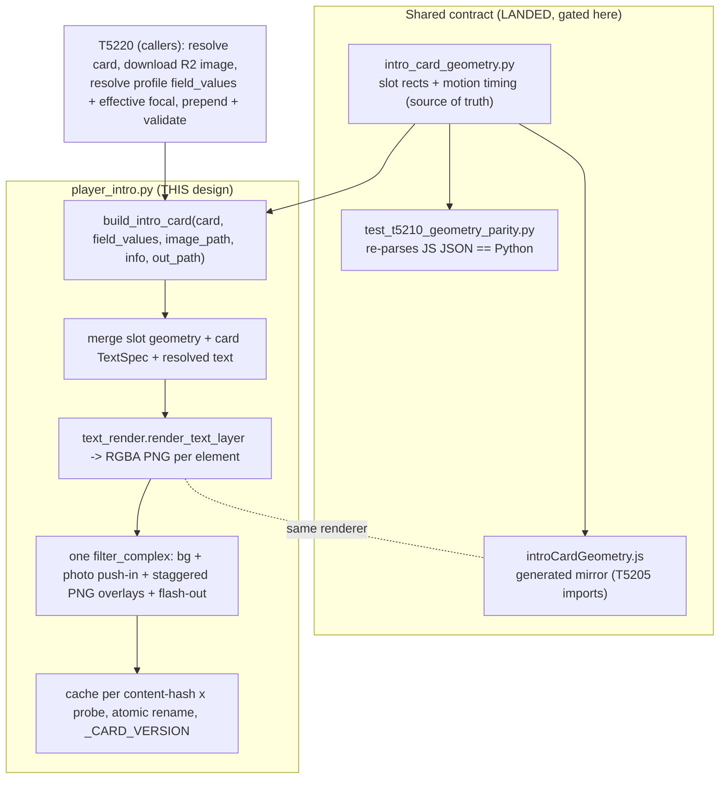

# T5210 — Intro card render engine: design

**Status:** APPROVED 2026-08-05 (gate corrections folded in) — implementing the engine
**Tier:** L · Backend (+ a generated frontend mirror, already landed) · no schema change
**Task:** [T5210-intro-card-generation.md](player-intro/T5210-intro-card-generation.md) ·
**Epic:** [Player Intro + Rich Text](player-intro/EPIC.md) (decisions 2, 2b, 3, 3b, 5, 9, 10)

> **Gate scope.** The contract commit (`T5210: shared card geometry + motion timing
> contract`) already landed on the branch so T5205 (parallel, JS) is unblocked. The
> thing being gated is the **geometry + motion VALUES** in that commit and the **engine
> design** below. Approve/adjust the numbers in §4–§5 and the engine shape in §6 before I
> build `player_intro.py`. Nothing about the engine has been written yet.

---

## 1. Summary

Turn an `intro_cards` row into a short **animated MP4** that can be prepended to a reel of
any resolution / fps / pixel format, cheaply enough to run on a download request. It mirrors
`branded_outro.py` exactly: probe the target reel, build a card that matches its stream
params, cache it per content-hash, prepend with a stream-copy concat + re-encode fallback,
and **never raise** into a download/share/export.

The two hard, cross-cutting requirements:

1. **What the editor previews is what the render produces.** The editor (T5205) is JS and
   can't import Python, so a shared **geometry + motion contract** owns the slot rects and
   animation timing. §4/§5. Landed as the first commit; parity-tested.
2. **Motion is the deliverable, not a nicety** (epic decision 10). A static-looking card
   fails acceptance. Photo push-in + staggered text-in + white-flash exit, sharing T5240's
   animated vocabulary so intro/outro/spotlight feel like one system.

## 2. Current state

- `intro_cards.py` — `derive_composition(has_photo, shown_fields)` → one of
  `title-only/hero/broadcast/recruiting` (epic decision 2). The card row also carries
  `treatment` (`gold/dark/photo-forward`, decision 2b), `image_key`, `image_cutout_key`,
  `focal_x/focal_y/zoom` (nullable = inherit the profile framing, decision 3b),
  `text_elements` (`{slot: TextSpec}`, styling), `title_text`, `duration`.
- Profile fact VALUES (`position/class/team`) live in `user_settings`
  (`get_intro_fact`/`get_all_intro_facts`), not on the card (decision 3).
- `text_render.render_text_layer(spec: TextSpec, frame_w, frame_h) -> PIL.Image` (T5180) —
  the ONE backend text rasteriser (Pillow, no `drawtext`). Layer-cached by content hash.
- `branded_outro.py` — the structure to copy: `_probe_media`, `_get_or_build_card` +
  atomic-rename cache, `_build_outro_card` (all animation inside one `filter_complex`,
  encoded once), `_concat_copy`/`_concat_reencode`/`_validate_concat`, non-fatal contract.
- **Nothing renders a card today.** `player_intro.py` does not exist.

## 3. Target state (architecture)



The engine is a **pure function of (card row, resolved field values, local image, probe) →
file**. No DB reads, no R2, no job rows — T5220 owns all of that (task §D). The contract is
the only thing shared with the frontend.

## 4. Slot geometry values (**gate: review these**)

Normalised 0..1 (mirrors the TextSpec unit invariant): `x`/`w`/`maxWidth` are fractions of
frame **width**; `y`/`h`/`size` are fractions of frame **height**. A photo rect `{x,y,w,h}`
is the region the framed photo fills (focal+zoom frame the image *within* it). A text slot
`{x,y,maxWidth,size,align}` is LAYOUT only — `x` is the anchor read per `align`, `y` is the
block top; the card's per-slot TextSpec supplies font/colour/weight/shadow/stroke + text.

**Design rationale for the four looks** — the photo placement is what separates them:
`title-only` is text-forward over a full-bleed (scrimmed) photo; `hero` makes the photo the
card with a name + 1 fact in the lower third; `broadcast` adds a lower-third band with 2
facts; `recruiting` is the "profile" look — an **inset** photo (top band at 9:16, left
column at 16:9) beside a denser 3-fact stack.

> **Gate-resolution note (landed in `T5210: fold gate corrections...`):** the `subtitle`
> slot was DROPPED (no schema field feeds it), so the tables below carry only `title` +
> facts. Values match the committed contract module.

### 9:16 (portrait)

| Composition | photo `{x,y,w,h}` | title `{x,y,mw,size,align}` | fact1 | fact2 | fact3 |
|---|---|---|---|---|---|
| title-only | 0,0,1,1 | .5,.44,.86,.072,C | — | — | — |
| hero | 0,0,1,1 | .5,.74,.90,.066,C | .5,.84,.80,.034,C | — | — |
| broadcast | 0,0,1,1 | .5,.68,.90,.062,C | .5,.79,.80,.030,C | .5,.845,.80,.030,C | — |
| recruiting | 0,0,1,.56 | .5,.61,.90,.058,C | .5,.72,.80,.032,C | .5,.79,.80,.032,C | .5,.86,.80,.032,C |

### 16:9 (landscape)

| Composition | photo `{x,y,w,h}` | title | fact1 | fact2 | fact3 |
|---|---|---|---|---|---|
| title-only | 0,0,1,1 | .5,.42,.86,.135,C | — | — | — |
| hero | 0,0,1,1 | .06,.68,.62,.120,L | .06,.86,.55,.055,L | — | — |
| broadcast | 0,0,1,1 | .06,.64,.60,.110,L | .06,.82,.42,.048,L | .06,.89,.42,.048,L | — |
| recruiting | 0,0,.46,1 | .52,.22,.44,.095,L | .52,.46,.42,.050,L | .52,.60,.42,.050,L | .52,.74,.42,.050,L |

(C = center, L = left. `mw` = maxWidth. Sizes differ per aspect on purpose — a title that
reads on a tall 9:16 frame is a different fraction-of-height than on a short 16:9 one.)

**Slot fill (seam-corrected):** `text_elements` is **STYLING ONLY** — never its `.text`.
- `title` text comes from the card's **`title_text`** column; styling from
  `text_elements["title"]`.
- `fact{i}` (ORDINAL geometry) maps to `shown_fields[i-1]` (SEMANTIC): value from the
  **profile** (`field_values[field]`), styling from `text_elements[field]`. Keeping styling
  semantic means un-ticking one fact never transfers another fact's styling.
- A `title_text`/fact value that is blank is **omitted and logged** — the slot is skipped,
  never drawn blank (task §A, decision 3). Composition guarantees the fact count equals the
  slot count (parity-tested), so no empty slots.

### 4b. Treatment palette (Q5 — moved into the contract)

`gold`/`dark` are radial gradients, `photo-forward` is a flat colour; each has an accent.
Adopted verbatim from T5205's `introCardEditorConstants.js` (editor look unchanged, now
canonical). Encoded as endpoints + centre + extent (not flattened), so the browser rebuilds
the CSS and ffmpeg paints the same pixels via `geq` (radial distance
`hypot((x-cx)/ex, (y-cy)/ey)`, stops lerped by `clip(d/lastStopPos,0,1)`).

| Treatment | Background | Accent |
|---|---|---|
| gold | radial `#2a2410`@0 → `#0d0b06`@.70, centre (.5,0), extent (1.2,1.2) | `#f7e28b` |
| dark | radial `#1a2230`@0 → `#05070b`@.70, centre (.5,0), extent (1.2,1.2) | `#e5e7eb` |
| photo-forward | solid `#04060a` | `#ffffff` |

## 5. Motion timing values (**gate: review these**)

Seconds, relative to the card timeline `0..duration` (`duration` stored per card):

| Constant | Value | Meaning |
|---|---|---|
| `photoPushInZoomStart` → `End` | 1.0 → 1.12 | Ken Burns push-in across the whole card, ease-out, FROM the stored focal framing |
| `textStaggerFirstSt` | 0.35 | first element begins fading up |
| `textStaggerStep` | 0.16 | added delay per subsequent element (order: title, fact1..3) |
| `textFadeD` | 0.45 | per-element fade-up duration |
| `textRiseFrac` | 0.02 | elements rise this fraction of frame height while fading in |
| `flashOutD` | 0.22 | white-flash EXIT into the footage (tail of the card) |

Element `i` (index into the shown slots, in `STAGGER_ORDER`) starts at
`firstSt + i*step`. The exit flash is the LAST beat so the card's final frame is a
deterministic white that cuts cleanly into the reel — mirrors T5240's entrance flash,
applied last for frame determinism (just reversed in time: outro flashes IN, intro flashes
OUT into the footage).

## 6. Engine design (`app/services/player_intro.py`)

### 6.1 Signature (**gate: confirm**)

The task file sketches `build_intro_card(card, info, out_path)`. To keep the engine a pure
function (no DB/R2 — those are T5220's), I propose the resolved inputs are passed in:

```python
def build_intro_card(
    card: dict,                       # the intro_cards row (serialized dict)
    field_values: dict[str, str],    # resolved profile facts: {"position": "...", ...};
                                      #   a missing/blank key = omit that fact slot
    image_path: str | None,          # local path to the already-downloaded photo
                                      #   (cutout if present, else plain); None = no photo
    info: dict,                       # _probe_media(target_reel) -> w/h/fps/pix_fmt/sar/audio
    out_path: str,
) -> bool:                           # True = card written; False = skipped/failed (non-fatal)
```

`field_values`, `image_path` and the effective focal (card override else profile) are
resolved by T5220 and passed in, so the engine never touches the DB or R2. This is the same
"router resolves, service renders" split `branded_outro` uses.

### 6.2 Pipeline

```
1. composition = derive_composition(image_path is not None, card["shown_fields"])
   aspect      = aspect_key(info["width"], info["height"])
   geo         = geometry_for(composition, aspect)            # from the landed contract
2. Assemble the SHOWN elements (in STAGGER_ORDER), skipping any whose text is empty:
     - title: text from card["title_text"], styling from text_elements["title"]
     - fact{i}: geometry = geo.slots["fact{i+1}"] (ORDINAL); field = shown_fields[i]
       (SEMANTIC); text = field_values[field] (omit+log if blank); styling =
       text_elements.get(field) if the card styled it, else a per-treatment default TextSpec
   For each, build a full TextSpec = card styling + slot geometry (position=(x,y),
   maxWidth, size, align) and render_text_layer(spec, W, H) -> RGBA PNG at frame size.
3. content_hash = sha256 over EVERYTHING that affects pixels: composition, treatment,
   aspect, every element's (text+resolved TextSpec), image bytes hash, focal_x/y/zoom,
   duration, _CARD_VERSION. (Not card id / updated_at — those don't change pixels.)
4. cache key = content_hash x (W x H x fps x pix_fmt x sar x audio layout).  Cache hit ->
   return the cached mp4. Miss -> build once, atomic-rename into _CARD_CACHE_DIR.
5. Build ONE filter_complex (see 6.3), encode once (libx264, match pix_fmt/fps/timescale/
   sar + silent audio iff the reel has audio, exactly like _build_outro_card).
```

The card is encoded **once per cache key**, so animation is free at serve time (task §C).

### 6.3 filter_complex (motion)

Inputs: a solid/gradient treatment background (`color`/`gradients` lavfi, sized `WxH`,
`d=duration`), the photo (`-loop 1`), and one looped PNG per shown element.

```
# Background (treatment): gold | dark | photo-forward each pick a bg colour + accent.
[bg] = color=c=<treatment bg>:s=WxH:r=fps:d=duration

# Photo: cover the photo rect from the stored focal point + zoom, then Ken Burns push-in.
#   scale to cover the rect at zoom, crop to the rect centered on (focal_x,focal_y),
#   zoompan z from photoPushInZoomStart->End ease-out (constant output size => overlay-safe,
#   T5240 landmine (a)). For full-bleed rects the photo covers the frame; for the recruiting
#   inset it covers the sub-rect and is overlaid at (photo.x*W, photo.y*H).
[photo] = <scale/crop to rect via focal+zoom> , zoompan=... : s=<rect_w>x<rect_h>
[base]  = [bg][photo] overlay=x=photo.x*W:y=photo.y*H     # (+ optional scrim for legibility)

# Text: each PNG is full-frame with its glyphs already at the slot position (render_text_layer
# placed them from the slot geometry). Animate alpha fade-in on the PNG stream itself
# (fade=t=in:st=elemStart:d=textFadeD:alpha=1, same as T5240 ring/play) and a small rise via
# the overlay Y offset ( +textRiseFrac*H -> 0 over the fade ). Overlaid in STAGGER_ORDER.
[el_i] = [png_i] fade=t=in:st=<firstSt+i*step>:d=textFadeD:alpha=1
[base] = [base][el_i] overlay=x=0:y='<rise offset -> 0>'   # repeated per element

# Exit flash LAST (deterministic final frame): fade to WHITE at the tail.
[v] = [base] fade=t=out:st=duration-flashOutD:d=flashOutD:color=white , setsar=..,format=pix_fmt
```

Escaping/robustness carried verbatim from `branded_outro`/T5240 (knowledge doc §T5240):
single-quote expression values (don't also backslash commas); pad any per-frame-resized
stream before `overlay`; `_escape_filter_path` for Windows-dev paths. **No `drawtext`
anywhere** — every glyph is a pre-rendered PNG (decision 5), which is exactly what makes the
export match the editor.

### 6.4 Cache, concat, non-fatal — copied from `branded_outro`

- `_CARD_CACHE_DIR` in the system temp dir; atomic `os.replace`; `_CARD_VERSION` constant
  bumped whenever the renderer changes.
- **Prepend** (not append): `_concat_copy([card][main])` stream-copy when profiles match,
  `_concat_reencode` fallback, `_validate_concat`. The concat helpers are identical in shape
  to the outro's; I'll evaluate extracting the three shared helpers into a small
  `ffmpeg_concat.py` used by both, vs. keeping a local copy (see open question Q4 — the
  rule is "abstract on the 3rd duplication"; this is the 2nd, so I lean toward NOT
  abstracting yet and copying, but will flag it).
- **Non-fatal always** (decision 9): every failure path returns False and logs loudly;
  never raises into a download/share/export. Missing font, missing image, ffmpeg failure,
  cache-dir failure — all return False, caller ships card-less.

## 7. Testing plan

- **Unit / contract:** `test_t5210_geometry_parity.py` (landed, 11 passing) — parity +
  shape + fact-count-per-composition. `introCardGeometry.test.js` (landed, 7 passing) —
  JS accessors.
- **Engine (Phase 1 failing → Phase 2):**
  - composition × treatment matrix (4×3) at 9:16 and 16:9 builds a valid MP4 with the probe
    params (luma-over-time harness like `test_t5240_animated_outro.py`, reading the FIRST
    `metadata=print` line — T5240 landmine (d)).
  - motion assertions: photo luma changes over time (push-in not static); each text element
    appears at its staggered time; final frame is white (flash-out).
  - unfilled fact → slot omitted (rendered frame has no ink where that slot would be) +
    a log line.
  - cutout image used when `image_cutout_key` present.
  - cache: same inputs → hit (no re-encode); edit any pixel-affecting field → miss; edit a
    non-pixel field (name) → still hit.
  - every failure path returns False, writes no `out_path`, logs.
- **QA (mandatory, before "done"):** live-drive the renderer, inspect the **output MP4s**
  for the full matrix, a visual pass on the motion, evidence mapped to every acceptance
  criterion. Runs after the gate + implementation.

## 8. Landmines already accounted for (knowledge doc §T5240)

(a) `overlay` can't take a per-frame-resized input → zoompan emits constant-size output;
pad any scaled stream first. (b) filtergraph expression values are single-quoted → don't
backslash their commas. (c) apply the flash LAST for a deterministic boundary frame.
(d) luma test harness reads the FIRST `metadata=print` line. (e) no fontconfig in the
render image → text is PNG (via Pillow's absolute-path fonts), not `drawtext`.

## 9. Risks & open questions (**for the gate**)

- **Q1 — geometry values (§4).** These are my proposal, unrendered. They're the primary
  reviewable artifact. Any slot you want moved/resized, or a different photo-placement idea
  for a composition (esp. recruiting's inset), change here and I regenerate the JS mirror +
  re-run parity before building.
- **Q2 — motion values (§5).** Push-in of 1.0→1.12, stagger 0.35/0.16/0.45, flash 0.22.
  The reference intro is ~12s and more dramatic; my defaults are subtle/professional. Want
  it punchier (bigger zoom, longer flash)?
- **Q3 — engine signature (§6.1).** Passing resolved `field_values` + local `image_path`
  keeps the engine pure (no DB/R2). Confirm vs. the task file's 3-arg sketch (which would
  force the engine to read the profile + R2 itself, coupling it to T5220's job).
- **Q4 — concat helper reuse.** `_concat_copy/_reencode/_validate_concat` are the 2nd
  copy of `branded_outro`'s. Per the "abstract on the 3rd duplication" rule I lean toward
  copying now and extracting a shared `ffmpeg_concat.py` when a 3rd caller appears. OK?
- **Q5 — treatment backgrounds.** `gold/dark/photo-forward` — I'll define concrete bg
  colours + accent + scrim opacity per treatment in the engine (not the shared contract,
  since they don't affect slot geometry). Flag if you'd rather they live in the contract too
  so the editor's treatment swatches are guaranteed identical.
- **Q6 — title-only with no photo.** Composition is `title-only` both when there's no photo
  and when there's a photo + 0 facts. With no photo the background is pure treatment; that's
  handled by drawing the treatment bg and only overlaying the photo when `image_path` is set.

---

### Appendix — what already landed (the gated commit)

`T5210: shared card geometry + motion timing contract`:
`app/services/intro_card_geometry.py` (source of truth) · generated
`src/frontend/src/utils/introCardGeometry.js` (editor mirror) ·
`tests/test_t5210_geometry_parity.py` (11) · `introCardGeometry.test.js` (7). Composition is
still derived via `intro_cards.derive_composition` — not duplicated.
