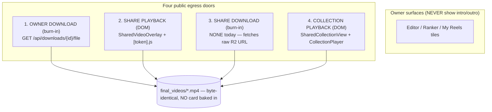

# T5220 — Apply the player intro card at every egress (Design)

**Status:** WAITING ON USER (design gate)
**Tier:** L (backend + frontend, 4 egress surfaces, new shared service, no schema change)
**Epic:** [Player Intro + Rich Text](player-intro/EPIC.md) — depends on T5215 (DONE)
**Task file:** [player-intro/T5220-add-intro-integration.md](player-intro/T5220-add-intro-integration.md)

This design is decision-complete: every open choice from the task's Scopes A–F is
resolved below with rationale. Nothing is left "either/or" for implementation.

---

## 0. TL;DR of the decisions

| # | Decision | Choice |
|---|---|---|
| 1 | **Scope B delivery mechanism** | **DOM pre-roll reusing `MotionPreview` on the 3 React surfaces; the edge function `[token].js` gets a hand-rolled DOM intro (mirroring how it already hand-rolls the outro end-card).** No per-share backend render for playback. |
| 2 | **Scope E serve-time helper** | `services/serve_time_video.py::compose_serve_time(reel_path, out_path, *, intro=None, outro=True, metadata_hook=None)` — probes once, builds intro + outro cards (cached as today), concatenates `[intro?, reel, outro?]` in **one** `ffmpeg_concat` demuxer pass, then the T6360 metadata seam. Non-fatal at every rung. |
| 3 | **Intro resolution per egress** | Owner download & single-reel share: **LIVE** from the sharer's current `final_videos.intro_card_id` (+ profile facts). Collection: the **already-frozen** concrete value (unchanged, `collections.py` seam). |
| 4 | **Scope C share-download endpoint** | New `GET /api/shared/{share_token}/download` in `shares.py`, token-gated, calls the same `compose_serve_time`; `SharedVideoOverlay.handleDownload` repoints to it. |
| 5 | **Scope F exposure notice** | Reuse `IntroCardCarousel`'s existing amber notice copy, added to `ShareModal.jsx`, photo-gated on the reel's resolved intro. |
| — | **ffmpeg concat extraction** | Extract the byte-duplicated `_probe_media/_concat*/_validate_concat/_run/_escape_filter_path` from `branded_outro.py` + `player_intro.py` into `services/ffmpeg_concat.py` (ordered N-segment list); strangler-fig, both keep their public APIs. |
| — | **T4945 / T6360 seams** | Documented code seams only (no-op hooks), not built. |

---

## 1. Current State Analysis

### 1.1 The four egress paths (verified, Stage-1 Code Expert)



| # | Path | Entry point (file:line) | Outro today | Intro today |
|---|---|---|---|---|
| 1 | Owner download | `downloads.py:668 download_file`; R2 gen `_stream_with_outro_r2` (:730), local `_stream_with_outro_local` (:789) — each `append_branded_outro(original, out)` at :759/:796 | **yes** | no |
| 2 | Share playback | `SharedVideoOverlay.jsx:99-108` (`<MediaPlayer>` + `<BrandedEndCard visible={showEndCard}>` on `onEnded`); edge `[token].js:174-181` (real `<video>`, hand-rolled `.ec-*` DOM end-card on the `ended` event) | **yes** | no |
| 3 | Share download | `SharedVideoOverlay.jsx:75-89 handleDownload` → `fetch(share.video_url)` (raw presigned R2 URL) | **no** | no |
| 4 | Collection playback | `SharedCollectionView.jsx:113-124` → `CollectionPlayer` + `<BrandedEndCard positionClassName="fixed inset-0 z-[90]">` | **yes** | no |

### 1.2 What already exists to wire (do NOT rebuild)

- **Renderer** (`player_intro.py`, T5210): `build_intro_card(card, field_values, image_path, info, out_path) -> bool` (:720, PURE, non-fatal); `prepend_intro_card(card_path, main_path, out_path) -> bool` (:752, card-first, copy + reencode fallback + validate, non-fatal). Cache `/tmp/rb_intro_cards`, content-hash includes **image bytes** ⇒ the image MUST be downloaded to a local path first.
- **Resolver** (`intro_cards.py`, T5215): `resolve_intro_card(intro_card_id, reel_duration, profile_conn, *, reel_id=None)` (:290) → concrete card row (loads default + min-duration, applies 0/NULL/id + duration gate). `resolve_intro_card_id` (:188) pure variant. `load_profile_cards` (:277) batch.
- **field_values** live in **user.sqlite** (`user_db.get_all_intro_facts` :720 / `get_all_intro_full_names` :740, keyed by profile_id) — a DIFFERENT DB than profile.sqlite (which holds the card row + reel). The caller opens BOTH.
- **Collection seam** (`collections.py`): `_evaluated_share_members` (:865) already resolves the frozen intro via `resolve_intro_card(definition.get("intro_card_id", 0), reel_duration=None, conn)` (:889); `resolve_collection_share` (:918) already carries `{intro_card_id, intro_card_name}` (:932-936) with the literal comment **"T5215: id + name now; T5220 adds the presigned pre-roll payload."** ← exact seam.
- **Frontend DOM renderer** (`MotionPreview.jsx`): already plays the card's FULL animation in the DOM — props `{card, profile, aspect, boxWidth, boxHeight, onDone}`, reads `card.previewUrl` (presigned image), uses the SHARED contract (`introCardGeometry.js` `INTRO_CARD_MOTION` + `STAGGER_ORDER`), fires `onDone` at motion end. It is the editor's own preview renderer ⇒ **preview == playback for free**.
- **Outro playback precedent** (`BrandedEndCard.jsx`): `if (!BRANDED_OUTRO_ENABLED || !visible) return null;` — `visible` is the ONLY public-surface gate; owner surfaces pass `visible=false`/never mount.
- **Exposure notice** (`IntroCardCarousel.jsx:166-172`): the amber `AlertTriangle` "This card includes a photo — it will be publicly visible…" notice, photo-gated on `effectiveCard?.image_key` (:104).

### 1.3 Code smells this task fixes / avoids

| Smell | Location | Fix |
|---|---|---|
| **Duplicated code (byte-for-byte)** | `_probe_media/_concat_copy/_concat_reencode/_validate_concat/_run/_escape_filter_path` in `branded_outro.py` (:177-442) AND `player_intro.py` (:86-183) — differ ONLY in concat input order | 3rd use ⇒ extract `services/ffmpeg_concat.py` (abstract-on-3rd rule; T5210 gate Q4 explicitly deferred this to T5220) |
| **Two separate serve-time file passes about to appear** | outro (shipped), intro (this task), T6360 metadata — each would open+concat+stream the temp file independently | Scope E: **one** `compose_serve_time` opens/concats/streams once |
| **Divergent resolution** risk | live-resolve intro in 2 new places (owner-dl, share-dl) | Both call the SAME `resolve_intro_card` + a SINGLE cross-DB assembly helper; never a second resolution order |
| **Missing egress** | share download fetches raw R2 (no outro, no intro, no metadata) | Scope C adds the backend endpoint |

---

## 2. Target Architecture

```mermaid
flowchart TB
  subgraph BURN["Burn-in egress (backend, one pass)"]
    OD[1. Owner download<br/>downloads.py] --> CST
    SD[3. Share download NEW<br/>shares.py] --> CST
    T4945[(D. T4945 collection stitch<br/>SEAM — documented only)] -.-> CST
    CST["compose_serve_time()<br/>serve_time_video.py"]
    CST --> FC["ffmpeg_concat.concat_segments()<br/>[intro?, reel, outro?] ONE demuxer pass"]
    CST --> MH["metadata_hook (T6360 SEAM — no-op)"]
  end
  subgraph DOM["Playback egress (DOM pre-roll, no re-encode)"]
    SP[2. Share playback<br/>SharedVideoOverlay] --> IPR
    CP[4. Collection playback<br/>SharedCollectionView] --> IPR
    EDGE[2b. Edge page<br/>[token].js] --> HAND[hand-rolled DOM intro<br/>mirrors its outro end-card]
    IPR["IntroPreRoll.jsx<br/>wraps MotionPreview → onDone → play"]
  end
  RES["resolve_intro_card (T5215)<br/>+ cross-DB field_values assembly"]
  OD --> RES
  SD --> RES
  SP --> RES
  CP -.frozen value.-> RES
```

**Design principles applied:**
- [x] DRY: one `ffmpeg_concat`, one `compose_serve_time`, one resolver, one DOM renderer (`MotionPreview`), one exposure-notice copy.
- [x] Single code path per action: intro delivered ONE way per class (burn = `compose_serve_time`; playback = `MotionPreview`).
- [x] Minimal branches: `compose_serve_time` takes `intro`/`outro` as OPTIONAL inputs and internally routes the fall-through ladder — callers do not branch on which cards are present.
- [x] Pattern: mirrors the shipped outro precedent (serve-time burn + DOM `visible`-gated pre-roll), the epic's "one preview component" rule, and T5215's single-resolver rule.
- [x] Non-fatal contract preserved end-to-end (HTTP 200 always).

---

## 3. The four-egress table (path → resolver input → delivery → non-fatal fallback)

| # | Path | Intro resolved from | Resolver call + inputs | Delivery | Non-fatal fallback |
|---|---|---|---|---|---|
| 1 | **Owner download** | LIVE — this profile's current `final_videos` | Open profile.sqlite; `resolve_intro_card(row['intro_card_id'], reel_duration=row['duration'], profile_conn, reel_id=id)`. Assemble `field_values` from user.sqlite (`get_all_intro_facts`/`get_all_intro_full_names`[profile_id]). Download card image (cutout-preferred) to temp. | `compose_serve_time(reel, out, intro=IntroSpec(...), outro=True)` → `[intro][reel][outro]` in one concat pass; stream | intro build/prepend fails → `[reel][outro]`; outro fails → `[intro][reel]`; both fail → `[reel]`. HTTP 200. |
| 2 | **Share playback** | LIVE — the sharer's current `final_videos` | Backend (in `get_shared_video`): open the sharer's profile.sqlite via `open_profile_db_readonly(sharer_user_id, sharer_profile_id)`; same `resolve_intro_card`; assemble field_values from the sharer's user.sqlite; presign the card image. Serialize the **card doc + previewUrl + field_values** into `ShareDetailResponse`. | Frontend `IntroPreRoll` → `MotionPreview` plays, `onDone` → start `<MediaPlayer>`. No backend render. | payload intro absent/null → pre-roll not mounted, player starts immediately (exactly today's behaviour). |
| 2b | **Edge page** `[token].js` | Same LIVE payload as path 2 (the edge fn already consumes `/api/shared/{token}`) | Consumes the intro fields already on `ShareDetailResponse` | Hand-rolled DOM intro card (mirrors its existing `.ec-*` outro), shown before the `<video>` plays; `onended`→outro as today | intro fields absent → video autoplays immediately (unchanged). |
| 3 | **Share download** (NEW) | LIVE — the sharer's current `final_videos` | New `GET /api/shared/{token}/download`: resolve share → `_build_video_r2_key` → download reel to temp; open sharer profile.sqlite; same `resolve_intro_card` + cross-DB field_values as path 1 | `compose_serve_time(reel, out, intro=..., outro=True)` (identical to owner-download), stream as attachment | same ladder as path 1. HTTP 200. |
| 4 | **Collection playback** | FROZEN — the concrete value on the share definition | `collections.py` ALREADY resolves it (`_evaluated_share_members` :889). Extend `resolve_collection_share` (:932) to serialize the card doc + presigned previewUrl + the sharer's field_values, exactly like path 2 but from the FROZEN id. | Frontend: ONE `IntroPreRoll` before the FIRST member (not per-member), then `CollectionPlayer` chains members as today. | payload intro absent → no pre-roll, first member plays immediately. |

**Cross-DB assembly (paths 1, 2, 3) — one helper:** a new
`services/intro_egress.py::resolve_intro_for_reel(user_id, profile_id, intro_card_id, reel_duration, reel_id) -> IntroSpec | None`:
1. open profile.sqlite (readonly for shares) → `resolve_intro_card(...)` → concrete card row or None (→ return None).
2. open user.sqlite → `field_values = {**get_all_intro_facts()[profile_id], "full_name": get_all_intro_full_names()[profile_id]}` (missing profile key → `{}`; title still renders from full_name, facts omit+log per T6620 — see Risk R1).
3. **for burn paths:** download the card's `image_cutout_key` (preferred) else `image_key` from R2 to a temp path (None when the card has no photo); return an `IntroSpec(card_row, field_values, image_path, tempdir)` the caller cleans up.
   **for playback paths:** presign `image_cutout_key`/`image_key` → `previewUrl`; return the serialized payload dict (no download).

This is the single seam that guarantees paths 1/2/3 never diverge in how they read facts.

---

## 4. Scope E — the ONE serve-time helper

### 4.1 Signature

```python
# services/serve_time_video.py
def compose_serve_time(
    reel_path: str,
    out_path: str,
    *,
    intro: IntroSpec | None = None,     # None => no intro segment
    outro: bool = True,                 # False => skip outro (respects BRANDED_OUTRO_ENABLED internally)
    metadata_hook=None,                 # T6360 SEAM: callable(list[str]) -> list[str] extra ffmpeg args, or None
) -> bool:
    """Compose [intro?, reel, outro?] into out_path in ONE ffmpeg_concat demuxer
    pass. Returns True if out_path was written with at least the reel (i.e. any
    non-fatal degradation still counts as success as long as the reel is served),
    False only if NOTHING could be produced (caller then streams reel_path raw).
    NEVER raises."""
```

`IntroSpec` = the `resolve_intro_for_reel` return (card row + field_values + local image_path + owning tempdir).

### 4.2 Composition order + non-fatal fall-through ladder

```mermaid
flowchart TD
  A["probe reel = _probe_media(reel_path)"] --> B{intro requested?}
  B -- yes --> C["build_intro_card(card, field_values, image_path, info=probe) → intro.mp4"]
  B -- no --> D
  C -- ok --> D{outro enabled?}
  C -- fail/log --> D
  D -- yes --> E["_get_or_build_card(probe) → outro.mp4 (branded_outro cache)"]
  D -- no --> F
  E -- ok --> F["segments = [intro.mp4?, reel_path, outro.mp4?]"]
  E -- fail/log --> F
  F --> G{len(segments) == 1?}
  G -- yes (reel only) --> H["out = reel_path (copy-through);<br/>apply metadata_hook; return True"]
  G -- no --> I["ffmpeg_concat.concat_segments(segments, out, probe)<br/>copy → validate → reencode fallback → validate"]
  I -- ok --> J["apply metadata_hook (T6360 seam, no-op today); return True"]
  I -- fail/log --> K["retry concat with ONLY [reel] (drop the failing card set);<br/>if still fail → out = reel_path raw; return True"]
```

**The ladder in pseudocode:**

```pseudo
compose_serve_time(reel, out, intro, outro, metadata_hook):
    probe = _probe_media(reel)                      # raises only on unreadable reel -> caught -> return False
    segs = []

    intro_mp4 = None
    if intro is not None:
        intro_mp4 = try_build_intro_card(intro, info=probe)   # non-fatal: None + log on any failure
        if intro_mp4: segs.append(intro_mp4)

    segs.append(reel)

    outro_mp4 = None
    if outro and outro_enabled():
        outro_mp4 = try_build_outro_card(probe)               # non-fatal: None + log
        if outro_mp4: segs.append(outro_mp4)

    if len(segs) == 1:                              # reel only, nothing to join
        served = reel
    else:
        served = concat_or_degrade(segs, out, probe)  # see below

    apply_metadata_hook(served, out, metadata_hook)   # T6360 SEAM; today: identity copy-through
    return True

concat_or_degrade(segs, out, probe):
    if ffmpeg_concat.concat_segments(segs, out, probe):   # copy->validate->reencode->validate
        return out
    log.error("serve-time concat failed; degrading to reel-only")
    return reel        # NEVER a broken/missing file
```

Fall-through guarantees, restating the AC:
- intro fails → `[reel][outro]`
- outro fails → `[intro][reel]`
- both fail → `[reel]`
- the concat itself fails → `[reel]` (raw), streamed
- HTTP 200 in every case.

### 4.3 How both burn callers use it

`downloads.py` `_stream_with_outro_r2` / `_stream_with_outro_local` (rename → `_stream_composed_*`):
replace the `append_branded_outro(original, out)` block (:757-764 / :794-801) with
```python
intro = resolve_intro_for_reel(uid, pid, row['intro_card_id'], row['duration'], download_id)  # burn variant
try:
    if await asyncio.to_thread(compose_serve_time, original_path, out_path, intro=intro, outro=True):
        serve_path = out_path
finally:
    if intro: intro.cleanup()      # its own temp image dir
```
**The `download_file` SELECT (:686-691) is WIDENED** to also load `fv.intro_card_id` and `fv.duration` (the resolver needs both). No other change to the streaming/`finally: rmtree` machinery.

`shares.py` `GET /{token}/download` (NEW) does the identical shape after downloading the reel to its own temp dir (mirrors `apply_branded_outro_to_bytes`'s tempdir pattern; the reel comes from `_build_video_r2_key(share)`, resolved profile/user from the share row).

---

## 5. Scope B — delivery mechanism decision (the headline)

### 5.1 Recommendation: **DOM pre-roll (option B)** — reuse `MotionPreview` on the 3 React surfaces; hand-roll a DOM intro on the edge function.

### 5.2 Why

1. **The epic's binding rule.** EPIC "one preview component on the frontend" + decision 1 explicitly names "a React pre-roll on playback surfaces mirroring `BrandedEndCard`." `MotionPreview` ALREADY renders the exact motion the render engine encodes (shared `INTRO_CARD_MOTION`/`STAGGER_ORDER`, parity-tested `test_t5210_geometry_parity.py`). Preview == playback == export by construction. A presigned-MP4 pre-roll would introduce a SECOND animation path for the same card — the precise failure the epic's "one preview component" rule exists to prevent.
2. **Zero per-share backend render.** Option A renders (or cache-serves) an MP4 per share/playback. The reel already streams from a byte-identical R2 object; adding a render on the hot playback path is latency + CPU the DOM route avoids entirely. Card change is instantly reflected (the DOM reads the live card doc), matching the epic's "swap an intro, costs nothing" promise on the playback side.
3. **The outro precedent is exactly this split.** `BrandedEndCard.jsx` (React) is used by both React playback surfaces AND the edge function hand-rolls its OWN `.ec-*` DOM end-card (`[token].js:157-181`) separately — because the edge page is a hand-authored HTML string, not a React tree. T5220 mirrors that split in reverse: React `IntroPreRoll` for the 3 React surfaces, a hand-rolled DOM intro block for `[token].js`.
4. **Parity/failure surface.** The burn path (paths 1/3) IS an MP4 render — so the download already gives exact-MP4 fidelity. Playback does not need byte-identical fidelity to the download; it needs the same MOTION, which `MotionPreview` already guarantees against the same contract the MP4 render uses.

### 5.3 The edge-function wrinkle (handled explicitly)

`[token].js` is a Cloudflare Pages function returning a hand-authored HTML/CSS/JS string; it cannot mount React. It already hand-rolls the outro end-card and its replay JS. T5220 adds a **hand-rolled DOM intro** block (a `<div id="intro-card">` with CSS keyframes for the push-in + staggered fade + white-flash, sourced from the same contract numbers, emitted server-side into the HTML template) shown before the `<video>` starts and hidden on first play. This is a bounded, static-animation port (no per-line rich-text layout engine — the edge card shows the photo + full name + the resolved facts as plain styled text, matching the visual, accepting that the edge card is a simplified render, exactly as its outro end-card is a simplified render of `BrandedEndCard`). It is gated on the intro fields being present in the share JSON and on the card having reached the edge payload; absent → today's immediate autoplay.

> **Note this is the one place the intro is NOT pixel-identical to the download.** That is the SAME compromise the shipped outro already makes on the edge page, and it is acceptable for the same reason (the edge page is a fast static unfurl surface, not the fidelity-critical download). Called out again in Risks (R4) and Open Questions (Q1) so the user can veto the edge-card port if they'd rather the edge page simply autoplay with no intro.

### 5.4 The share payload the DOM route carries (paths 2 & 4)

`ShareDetailResponse` (`shares.py:76-90`) and the collection payload (`resolve_collection_share` :932) each gain an optional `intro` object:

```jsonc
"intro": {
  "card": { /* the intro_cards row as the frontend picker already consumes it:
              image_key, treatment, shown_fields, text_elements, focal_x/y, zoom,
              duration, composition-affecting fields */ },
  "previewUrl": "<presigned card image (cutout-preferred) URL>",   // null when no photo
  "field_values": { "full_name": "...", "position": "...", "class": "...", "team": "..." },
  "profile": { /* the minimal framing profile MotionPreview's resolveFraming needs:
                 focal_x/y, zoom */ }
}
```
This is exactly the `{card, profile, previewUrl}` shape `MotionPreview` + `resolveFraming` + `useCardPreviewElements` already consume in the editor — no new frontend contract. Absent `intro` → no pre-roll (today's behaviour). `is_public` unchanged; the payload is only emitted on a resolvable intro.

### 5.5 Rejected alternative: option A (presigned intro-MP4 pre-roll on every surface)

Rejected because: (a) it introduces a second animation code path for the same card, breaking the epic's "one preview component" invariant and the parity test's guarantee; (b) it adds a backend render/cache on the hot playback path that the DOM route makes free; (c) it does NOT actually simplify the edge function — a `<video>` pre-roll segment there is arguably simpler, but the win is dwarfed by (a)+(b) across the 3 React surfaces where it would be strictly worse. The ONE thing option A buys — pixel parity with the download on playback — is not a requirement (playback needs motion parity, which `MotionPreview` gives). Its edge-function upside is preserved as the Open-Question fallback (Q1): if the user dislikes the hand-rolled edge intro, the edge page can either autoplay bare (today's behaviour) or use the burn-path MP4 — decided at the gate, not blocking the 3 React surfaces.

---

## 6. Scope C — the new share-download endpoint

**Route:** `GET /api/shared/{share_token}/download` in `shares.py` (`shared_router`), token-gated identically to `get_shared_video` (:745): 404 unknown, 410 revoked, 403 non-public without matching recipient email.

**Body:** resolve share → `_build_video_r2_key(share)` → download to a temp dir → `resolve_intro_for_reel(sharer_user_id, sharer_profile_id, live intro_card_id+duration from the sharer's final_videos, reel_id)` (burn variant) → `compose_serve_time(reel, out, intro=..., outro=True)` → `StreamingResponse(..., media_type="video/mp4", headers={"Content-Disposition": attachment})`, `finally: rmtree`. Mirrors `download_file`'s generator + cleanup exactly (share-scoped, so it re-reads the sharer's live `intro_card_id`/`duration` from the sharer profile DB rather than the caller's).

**Frontend:** `SharedVideoOverlay.jsx:75-89 handleDownload` repoints from `fetch(share.video_url)` to `fetch(${API_BASE}/api/shared/${token}/download)` (blob → object URL → anchor click, unchanged mechanics). This closes AC "share download gets the intro" AND the pre-existing "share download has no outro" gap in one move.

**T6360 coordination:** T6360 is TODO, no branch, not in flight. Per the task's "whichever lands first owns the routing," **T5220 owns this endpoint AND `compose_serve_time`'s `metadata_hook` seam.** T6360 later supplies a non-None `metadata_hook` (its `-c copy` cover-art/tags pass) — it does NOT re-create the endpoint. The seam is a documented no-op parameter today.

---

## 7. Scope F — public-exposure notice

The reel-picker + collection-share dialog already show the amber notice via `IntroCardCarousel.jsx:166-172` (photo-gated on `effectiveCard?.image_key`). The GAP is the **single-reel share dialog `ShareModal.jsx`**, which shows sharing controls but no intro notice.

**Change:** `ShareModal` gains a small photo-gated amber notice reusing the EXACT copy/pattern from the carousel (`AlertTriangle` + "This card includes a photo — it will be publicly visible to anyone with this reel's link."). It renders when the reel being shared has a resolved intro WITH a photo. `ShareModal` receives `videoId`; it will read the reel's resolved intro from the same `GET /api/downloads` list data the gallery already holds (which returns the resolved `intro_card_name` and — extend by one field — a `resolved_intro_has_photo` boolean, computed backend-side from the resolved card's `image_key`, no new query since `load_profile_cards` already batches card rows). No new copy is invented; the string lives once (extract the notice into a tiny shared `IntroExposureNotice.jsx` used by both the carousel and `ShareModal` — 2nd use is a component, not premature since both are presentational and identical).

> Extracting `IntroExposureNotice.jsx` on the 2nd use (not 3rd) is justified: it is a pure presentational snippet with identical copy, and the compliance requirement (T5230) makes a SINGLE source of the exposure wording a correctness property, not just DRY — divergent wording across surfaces is a compliance defect.

---

## 8. ffmpeg_concat extraction plan (mechanical, strangler-fig)

`_probe_media`, `_concat_copy`, `_concat_reencode`, `_validate_concat`, `_run`, `_escape_filter_path` are **byte-for-byte duplicated** in `branded_outro.py` (:177-442) and `player_intro.py` (:86-183), differing ONLY in concat input order (outro = main-first, intro = card-first). This is the 3rd use ⇒ extract per the abstract-on-3rd rule (T5210 gate Q4 explicitly deferred it here).

**New module `services/ffmpeg_concat.py`** generalizes the join to an **ordered list of N segments**:
```python
def probe_media(path) -> dict            # the shared probe (identical body)
def concat_segments(segments: list[str], out_path: str, probe: dict) -> bool
    # ordered demuxer concat, -c copy; validate (>= sum of min durations);
    # re-encode fallback (filter_complex concat=n=len); validate; non-fatal bool.
def run(cmd) -> CompletedProcess         # the shared subprocess wrapper
def escape_filter_path(path) -> str
```

**Sequencing (each a separate reviewable commit, moves never mix with behaviour):**
1. **Commit A (mechanical move):** create `ffmpeg_concat.py` with the shared bodies verbatim. `branded_outro` and `player_intro` import from it; their existing public functions (`append_branded_outro`, `apply_branded_outro_to_bytes`, `build_intro_card`, `prepend_intro_card`) KEEP their signatures (facade over the shared helper). Their 2-segment calls become `concat_segments([a, b], out, probe)`. Characterization: `test_t3950_branded_outro.py` + `test_t5210_player_intro.py` must stay green byte-for-byte (they are the pre-existing characterization tests; no behaviour change is permitted in this commit). Diff kept < ~200 meaningful lines.
2. **Commit B (new behaviour):** `serve_time_video.py::compose_serve_time` builds an N=2 or N=3 ordered list and calls `concat_segments` ONCE — the single-pass `[intro][reel][outro]` that AC#1 requires. This is where the two-pass → one-pass change lands, isolated from the move.

`prepend_intro_card`/`append_branded_outro` remain as public APIs (used by tests + any non-egress caller); `compose_serve_time` supersedes them ONLY on the egress paths.

---

## 9. File-by-file change list

### Backend

| File | Change |
|---|---|
| `services/ffmpeg_concat.py` | **NEW.** Shared `probe_media/concat_segments/run/escape_filter_path` (Commit A). |
| `services/branded_outro.py` | Import concat helpers from `ffmpeg_concat`; delete the duplicated bodies (:177-442 region); keep `append_branded_outro`/`apply_branded_outro_to_bytes`/`_get_or_build_card` public. |
| `services/player_intro.py` | Import concat helpers from `ffmpeg_concat`; delete duplicated bodies (:86-183); keep `build_intro_card`/`prepend_intro_card` public. |
| `services/serve_time_video.py` | **NEW.** `compose_serve_time(reel, out, *, intro, outro, metadata_hook)` + the fall-through ladder (§4). `metadata_hook` = T6360 no-op seam. |
| `services/intro_egress.py` | **NEW.** `resolve_intro_for_reel(...)` (burn + playback variants) — the cross-DB (profile.sqlite card + user.sqlite facts + R2 image) assembly (§3), the ONE place paths 1/2/3 assemble an intro. `IntroSpec` dataclass with `.cleanup()`. |
| `routers/downloads.py` | Widen `download_file` SELECT (:686-691) to add `fv.intro_card_id, fv.duration`. Replace the outro-only block in `_stream_with_outro_r2` (:757-764) and `_stream_with_outro_local` (:794-801) with `resolve_intro_for_reel` + `compose_serve_time(..., intro=..., outro=True)` + `intro.cleanup()`. |
| `routers/shares.py` | Add `intro` to `ShareDetailResponse`; populate it in `get_shared_video` (:772) via `resolve_intro_for_reel` playback variant against the sharer's DBs. **NEW** `GET /{share_token}/download` (§6). Add `resolved_intro_has_photo` to the reel list feeding `ShareModal` (via `GET /api/downloads`, `downloads.py` list handler — one boolean off the already-batched card rows). |
| `routers/collections.py` | Extend `resolve_collection_share` (:932-936) intro block to serialize the full pre-roll payload (card doc + presigned previewUrl + the sharer's field_values + framing profile) from the ALREADY-frozen `intro_card` row — no resolution change, only serialization. |

### Frontend

| File | Change |
|---|---|
| `components/introcards/IntroPreRoll.jsx` | **NEW.** Wraps `MotionPreview` (props `{intro}` → `{card, profile, previewUrl, aspect}`); mounts before playback, calls parent `onDone` at motion end. `visible`/mount-gated like `BrandedEndCard`. |
| `components/introcards/IntroExposureNotice.jsx` | **NEW.** Extract the amber `AlertTriangle` notice (2nd use, compliance-single-source). `IntroCardCarousel.jsx:166-172` re-uses it; `ShareModal.jsx` uses it. |
| `components/SharedVideoOverlay.jsx` | Mount `IntroPreRoll` from `share.intro` before `<MediaPlayer autoPlay>`; gate autoplay on pre-roll done. Repoint `handleDownload` (:75-89) to `GET /api/shared/{token}/download`. |
| `components/SharedCollectionView.jsx` | Mount ONE `IntroPreRoll` from the collection payload's `intro` before the FIRST member; then `CollectionPlayer` as today (:113-124). |
| `components/ShareModal.jsx` | Render `IntroExposureNotice` when the reel's resolved intro has a photo (`resolved_intro_has_photo`). |
| `functions/shared/[token].js` | Emit a hand-rolled DOM intro block (CSS-keyframe push-in + staggered fade + white-flash from the contract numbers) when the share JSON carries `intro`; show before `<video>` play, hide on first play (mirrors the existing `.ec-*` outro block at :157-181). |

---

## 10. Documented seams (NOT built)

- **D. T4945 (collection stitched download):** in `serve_time_video.py`, a header comment + a clearly-marked insertion point: *"T4945 seam — a collection stitch calls `compose_serve_time` with the STITCHED file as `reel_path` and ONE `intro` = the collection's resolved card as the FIRST segment of the whole stitch (not per-member); outro=True gives the single trailing outro. Do not per-member prepend."* T4945 is TODO doc-only; nothing built here.
- **T6360 (download metadata / cover art):** `compose_serve_time`'s `metadata_hook` parameter is the seam — a callable applying the `-c copy` cover-art/tags pass AFTER the concat. Today it is None (identity copy-through). Documented in the signature + a comment: *"T6360 supplies this; T5220 owns the endpoint + helper, T6360 adds its pass on top."*

---

## 11. Risks

| # | Risk | Mitigation |
|---|---|---|
| R1 | **Cross-DB field_values silently title-only.** field_values come from user.sqlite; the card row + reel from profile.sqlite. A missing/empty facts row would render a title-only-ish card silently. | `resolve_intro_for_reel` logs at INFO when `get_all_intro_facts()[profile_id]` is empty but the card `shown_fields` expects facts; the renderer already omits+logs a blank fact (T6620). Full name always drives the title. Test asserts a facts-present vs facts-empty card differ. |
| R2 | **Image-download temp cleanup** (burn paths download the R2 image to a temp dir; content-hash needs the bytes). | `IntroSpec.cleanup()` owns its tempdir; callers call it in `finally` alongside the existing `rmtree(tmp_dir)`. Test asserts no temp dir leaks after a download (and after an induced build failure). |
| R3 | **Non-fatal chaining order.** With two cards, a naive impl could lose the reel if either card fails mid-concat. | The ladder (§4.2) builds the segment list from SUCCESSFUL cards only, then a single concat; concat failure degrades to reel-only (never a broken file). Tests exercise each rung. |
| R4 | **Edge-function intro is a simplified render** (not pixel-identical to the download), and its CSS-keyframe port could drift from the contract. | Accepted, same compromise as the shipped edge outro. The edge card shows photo + full name + resolved facts as plain styled text; if the port is a burden, Q1's fallback (autoplay bare) is the escape. Not on any parity-tested path. |
| R5 | **Single-reel share resolves LIVE while collections are FROZEN** — an asymmetry. | Deliberate and consistent: owner-download is ALSO live; both single-reel surfaces read the same current `final_videos`. Collections freeze because a share definition IS a snapshot (T5215). No schema change (kickoff constraint) FORCES live for single-reel shares — there is no `share_videos.intro_card_id` column to freeze into. Documented as asymmetric-by-design in `intro_egress.py` + here. |
| R6 | **Concat format-drift between the intro probe and the outro probe.** Both cards are built to match the SAME reel probe, but they are two independently cached MP4s joined in one pass. | `build_intro_card(info=probe)` and the outro `_get_or_build_card(probe)` BOTH take the reel's probe ⇒ identical width/height/fps/pix_fmt/sar/timescale/audio layout. `concat_segments` validates the copy-join and re-encodes on mismatch. Test: a 3-segment copy-join validates; an induced mismatch falls to re-encode and still validates. |
| R7 | **Sharer profile DB open on the hot playback path** (path 2 opens the sharer's profile.sqlite + user.sqlite per share GET). | Read-only open (`open_profile_db_readonly`), same pattern `_evaluated_share_members` already uses for collections; the intro block is only assembled when an intro resolves; failure → omit `intro`, never 500. |

---

## 12. Test Plan

### Backend (pytest — changed-code scope)

`test_t5220_serve_time.py` (NEW):
- **Single concat produces `[intro][reel][outro]`** — a fixture reel + a built intro card + outro through `compose_serve_time` yields ONE file whose duration ≈ intro+reel+outro and whose segment boundaries (luma/duration probe) match the ordered list; assert the concat ran ONCE (one ffmpeg invocation, not two).
- **Each non-fatal rung:** intro build forced to fail → `[reel][outro]`; outro forced to fail → `[intro][reel]`; both fail → `[reel]`; concat forced to fail → raw `[reel]`. Every case returns True and a playable file.
- **Resolution order NULL/0/id** through `resolve_intro_for_reel`: `0`→no intro at any duration; explicit id→always; NULL→default only when `duration >= min`; NULL+short→none; NULL+missing-duration→none+WARNING (reuses T5215's `resolve_intro_card_id` matrix, asserted at the egress boundary).
- **Cross-DB field_values:** facts-present card vs facts-empty card render measurably different intros; empty facts logs INFO, title still present.
- **Temp cleanup (R2):** no leaked temp dir after success and after induced build failure.

`test_t5220_ffmpeg_concat.py` (NEW): `concat_segments` copy-join for N=2 and N=3; induced format mismatch → re-encode fallback → validates; validation-length guard.

`test_t5220_collection_intro.py` (NEW): a collection share with a frozen intro serializes the pre-roll payload ONCE (first-segment semantics, asserted at the payload level — the payload carries a single `intro`, members carry none); a memberless / legacy (no `intro_card_id` key) share carries no `intro`.

`test_t5220_share_download.py` (NEW): `GET /api/shared/{token}/download` — 404/410/403 gating parity with `get_shared_video`; happy path streams a composed `[intro][reel][outro]`; induced intro failure still 200 with `[reel][outro]`.

Regression: `test_t3950_branded_outro.py` + `test_t5210_player_intro.py` stay GREEN after the extraction (characterization; Commit A must not change behaviour).

### Frontend

E2E `T5220-egress.qa.spec.js` (NEW), driving a real share link + the 3 React playback surfaces:
- Single-reel share playback: `IntroPreRoll` (`MotionPreview`) plays, then `<MediaPlayer>` starts; `onDone` transition asserted.
- Collection playback: ONE `IntroPreRoll` before the first member, NOT per-member (assert exactly one pre-roll mount across the member chain).
- **Owner-not-shown gating:** editor / ranker / My Reels tiles do NOT mount `IntroPreRoll` (mirrors the `BrandedEndCard visible=false` owner test).
- `ShareModal` shows `IntroExposureNotice` iff the reel's resolved intro has a photo.
- Share-download button hits `/api/shared/{token}/download` (network assertion), not the raw R2 URL.

Unit (Vitest): `IntroPreRoll` calls `onDone` after `MotionPreview`'s `onDone`; renders nothing when `intro` is null.

### Manual (mandatory — the 4 paths can't be proven by unit tests alone, per the task classification)

Real download of a reel with an intro (verify `[intro][reel][outro]` in the file), a real share link playback (React + edge page), a real share-download, a real collection playback.

---

## 13. Open Questions (need the user's call at the gate)

- [ ] **Q1 — Edge-function intro fidelity.** The recommendation hand-rolls a SIMPLIFIED DOM intro on `[token].js` (photo + full name + facts as plain styled text with CSS-keyframe motion), matching how the edge page already hand-rolls a simplified outro. Acceptable? Fallbacks if not: (a) edge page simply autoplays with NO intro (today's behaviour, zero new edge code), or (b) the edge page uses the burn-path MP4 as a `<video>` pre-roll. Recommendation: hand-rolled DOM to match the outro precedent; (a) is the low-risk fallback.
- [ ] **Q2 — Facts on a publicly shared intro.** Path 2/3/4 expose the athlete's full name + position/class/team publicly (that IS the intro's purpose, and the exposure notice covers photos). Confirm the resolved FACTS (not just the photo) traveling in the public share payload is intended — it is per the epic, but it is the compliance-adjacent surface (T5230). No design change either way; flagging for an explicit yes.
- [ ] **Q3 — Owner-download intro default.** Owner download resolves LIVE, so a reel on `NULL` (inherit) that clears the duration gate WILL get the profile default burned in on download. Confirm the owner burning the inherited default (vs only explicit picks) is wanted — it matches the epic's resolution order exactly, but it means every long reel with a default suddenly downloads with an intro. Recommendation: keep (consistent with the single resolution order).
